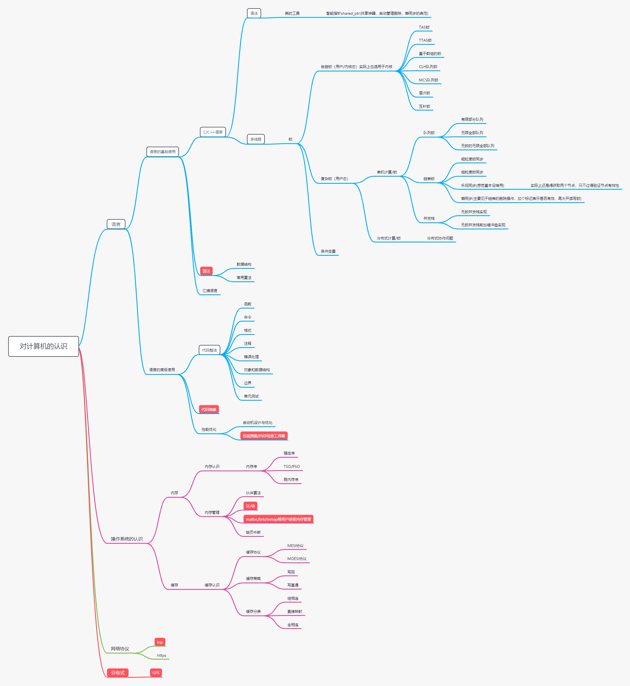

## 一些要学的东西
NGINX
火焰图
sicp

redis开发运维学习

music betty-boop jazz pop 背景音乐，黄金时代

选择很多，

长期目标

+ 我正在计划以《天才的编辑》为基础写个小剧本，你是一个编辑，新手出道的编辑，你能不能再维持生活，养家，亲人之间。尽量发掘更多的新人作家呢？需要多添加几个常见的故事，生活或许不能以善意对人，但男人总得挥拳，洛基/私酒/海明威/杰拉德/，作为编辑参与到伟大作品的诞生过程，当然也可能中途失败。实际上，还是要尽量多添加作者和事件
+ 写一个中文翻译标准文档，使用redis写一个方便的字典工具。同时该部分应当包含充分的解释和指引。此外应当建立各种名词的关系。比方说SC和TSO/PSO的关系。
+ 写一个从缓存到底怎么回事，到不同内存序怎么回事，再到怎么保持同步，不同例子怎么实现无锁竞争，再到大的分布式怎么实现存储的文章。参考资料《计算机体系结构量化研究方法》《A Primer on Memory Consistency and Cache Coherence》 《数据密集型计算xxx技术》。目前进度：《A Primer on Memory Consistency and Cache Coherence》已经开始阅读监听协议，数据密集型紧跟MIT课程的脚步。《计算机体系结构量化研究方法》暂时不急
+ 翻译内存模型和缓存一致性，第二章翻译完成，第三章还在翻译
+ 阅读Debug Hacks中文版，格蠹汇编，软件调试 第2版 卷1：硬件基础，阅读抽象方面的书籍：《编程原本》《SICP》《Refactoring: Improving the Design of Existing Code(重构)》《软件方法》《代码大全》《FROM MATHEMATICS TO GENERIC PROGRAMMING》进度：《代码整洁之道》翻了一遍，重点关注了函数和命名，暂时移除出目标名单。重构还在看
+ 学习BPF性能分析，进度，书买了，没时间看，基本网络知识还没构成体系
+ 分布式存储和分布式计算
+ 学习构建自己的调试工具库valgrind，gdb
+ 《linux虚拟内存管理》lru管理部分，《深入浅出DPDK》虚拟内存管理，进度：《C++ primer》的类设计者基本完成，
+ 学习Linux Guts的视频，《linux核心设计——发展过程回顾1,2》《linux核心涉及---rcu同步（上下）》《linux核心设计---浅谈同步机制》《linux核心设计---多核处理器和spinlock》
+ 使用python开发一个分析整理邮件的工具，能够快速的筛选出来邮件的内容，并整理本地的邮件关系，参与人员关系等多方面的信息。方便信息检索。
+ 每天做两道新的C++ leetcode，然后每天要看20个曾经做个的算法题。

## 大狗的些许碎碎念

+ 什么叫做唯物？唯物指的是符合事实，不断章取义，论迹不论心，不能靠猜测发表意见。但是有个问题，如果光看事情的话，那么婚姻和卖春有什么区别？
+ 什么是科学？科学是能够解释并加以预测的东西，必须符合实证
+ 资本主义本质上是将任何东西都当成消费品和货物，因此自然会使得个人丧失诸如气质/胸怀的东西，但是问题在于不是每个人都能有什么胸怀/品质的，大部分人还是稀碎的过一辈子。

## 结尾的闲言碎语
写到这里差不多就可以结束了,就不多说了。TLS这块还有啥不明白的直接告诉我就成了
