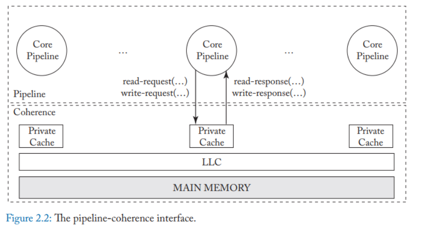

# 阅读内核程序员的smp技术

## 前言
这本书实际上叫做《现代体系结构上的UNIX系统-内核程序员的对称多处理和缓存技术(修订版)》这本书我才刚刚看完，下面打算看电子版书籍《内存模型和缓存一致性》与《多处理器编程的艺术》。我第一次看的时候没注意第一三部分，主要注意了第二部分。

## 第一部分--高速缓存系统

第一部分讲解了两种高速缓存系统和其写策略：直接映射高速缓存和N路组相连高速缓存系统，与常用的写策略：写直通，写回和写分配。接着通过介绍纯虚拟高速缓存，到键虚拟高速缓存再到物理高速缓存系统执行上下文切换/fork/exec等操作时候的困难和优势，介绍了为什么目前常见的硬件都是讲虚拟高速缓存和物理高速缓存相结合的策略-避免出现重名和歧义的问题，而且物理高速缓存有总线监视等搞笑手段。最后指出了三种提高高速缓存效率的方法：地址空间布局，延迟高速缓存无效和缓存对其的数据结构。最后一种方法是对应用程序最直接的方法，前两种实际上对应用程序是透明的。

映射相关的基础知识：

+ 直接映射高速缓存指的是：在保存高速缓存的地址中，以散列算法计算地址只能算出来每行仅拥有且仅有一个索引（换言之直接映射地址）。由于高速缓存有限，因此会出现多个地址命中的情况，因此还需要标记位+地址来表示是否命中
+ 直接映射高速缓存的散列算法：最常用的散列算法就是取模，一般会将一个地址拆成三个部分：1 低地址为选择行中的字节，选择行的字节个数和高速缓存每行（块）的大小一致 2 高速缓存行号，连着选择行的地址为高速缓存行号，个数和高速缓存行的个数一致 3 剩下的高地址没什么直接用处
+ 所谓高速缓存着色，指的是不同的地址映射到相同的高速缓存行上。如果高速缓存发生了缺失，那么就会触发突发模式（burst mode)读取一个高速缓存行。但是索引命中比较聚集，多个不同地址，被映射到同一个缓存行，触发频繁的读写就会导致高速缓存颠簸。

写策略：

+ 写直通：是当*cache*写命中时，*cache*与主存同时发生写修改。
+ 写回：当*CPU*对*cache*写命中时，只修改*cache*的内容不立即写入主存，只当此行被换出时才写回主存

上面的简介都是单台机器上的缓存概念，那么到了多处理机，换言之SMP，问题就发生了改变。

这种情况下就出现了一个问题，多处理机

## 第二部分--多处理器系统

这一部分考虑了主从系统内核，支持自旋锁的内核，采用信号量的内核等面对争用的解决方式，我个人觉得这部分实际上已经可以不看了。因为很多只要看linux内核里面的锁，互斥量等东西就能理解到。

## 第三部分--带有高速缓存的多处理器系统

第三部分讲述了在SMP体系下，面对缓存不一致问题的解决。并介绍了缓存一致性和顺序一致性协议，实际上这部分同样也不是很值得看，不如直接看《A Primer onMemory Consistencyand Cache Coherence》

## 结语
这本书作为一本入门书籍比较合适，其他方面可能比《C++并发实战》还是要差一些，对于内存的解释相比较而言还是并发实战更好一些。

## 多处理机系统概述的一些要点
+ 临界区，竞争条件的概念就不多说了。在书籍《linux内核设计与实现》上说过了。
+ 单机系统下，也会出现竞争条件，比方说“短期互斥”，“中断互斥”，“长期互斥”。对于unix内核而言，因为不存在内核抢占，所以短期互斥很难出现，但是linux内核可以内核抢占，如果内核操作同一数据结构，就会出现短期互斥。中断互斥指的是中断跟新了非中断代码（基准代码），对于这种东西我们在内核里就该直接关中断，可以参照缺页中断的处理。长期互斥，一般是指文件操作，因为文件IO一般比较长，因此文件IO的时候，会让出CPU。即CPU会调用sleep和wakeup函数。这块让我想起来了虚拟内存了。
+ SMP系统可就没有UP系统(单机系统)那么简单了，短期互斥UP系统的同一时刻只有一个进程运行的条件自动被破坏了，中断互斥也被破坏
+ 下面三章提出的方法都是非抢占式内核针对SMP系统的解决方式

## 主从处理机内核的一些要点

主从处理机将关键代码放到主处理器执行，这些操作包括缺页中断，算数异常。
+ 两个或两个以上处理器彼此享有对方需要的资源，又彼此等待不可抢占就会触发死锁。比方说一个数据结构的两个元素在两个不同的自旋锁上，这就是AB-BA死锁。值得注意的是，对于非抢占式内核，在已经有一个cpu占有自旋锁的情况下，所有cpu再次竞争自旋锁也可能触发死锁。因为忙等不可释放
+ 这种模式下，性能很容易出现瓶颈

## 采用自旋锁的内核的一些要点
+ 锁的粒度是个值得争论的东西，一方面要考虑性能，另一方面要考虑语意的简洁名了。如果CPU的数量很少，那么一个巨大的自旋锁可能和多个自旋锁的情况一致。也得考虑系统是IO密集还是计算密集
+ 在多处理机上因为使用sleep/wakeup导致的多进程对锁的争夺和颠簸，称为惊群效应，这种操作可以通过使用wakeup_one来解决。

## 采用信号量的内核的一些要点
+ 为什么信号量比sleep/wakeup更高级？因为信号量阻塞的决定和阻塞进程的操作都是原子操作，也支持一次仅唤醒一个进程的操作。
+ 为什么中断不能使用信号量，因为中断处理程序没有进程现场，P操作是无法阻塞进程的
+ 同一个信号量多次P，并不一定会死锁，因为V由其他进程执行。但是如果试图一次预留多份资源，会触发死锁。两个进程都想获取四分资源里面的三分，每个都获取两个，那么获取第三个时候就会死锁。一般都是通过每个进程释放它占用的那部分资源来避免死锁。银行家算法。

## 结尾
唉，尴尬

