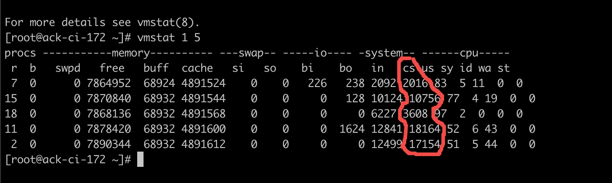
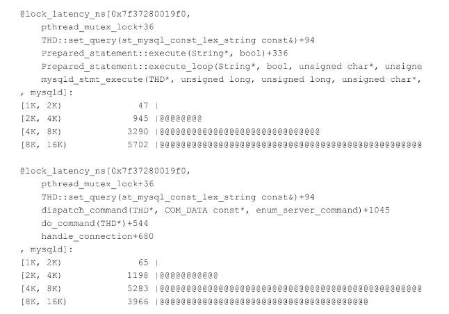
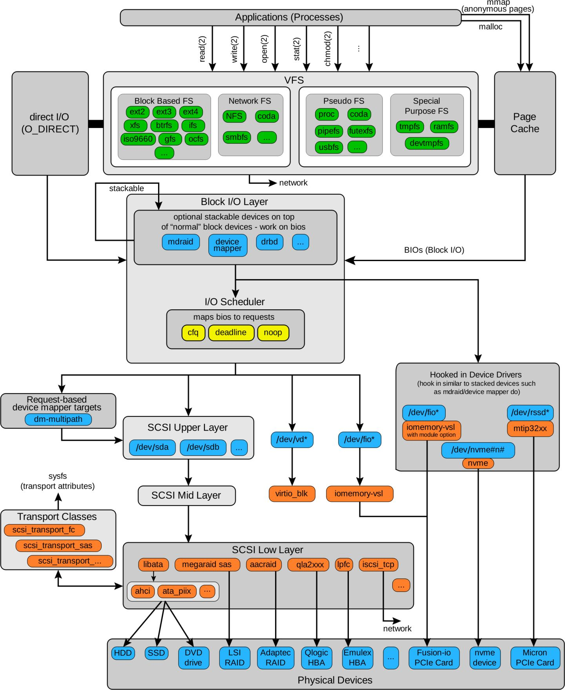
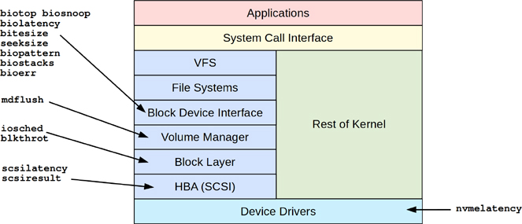
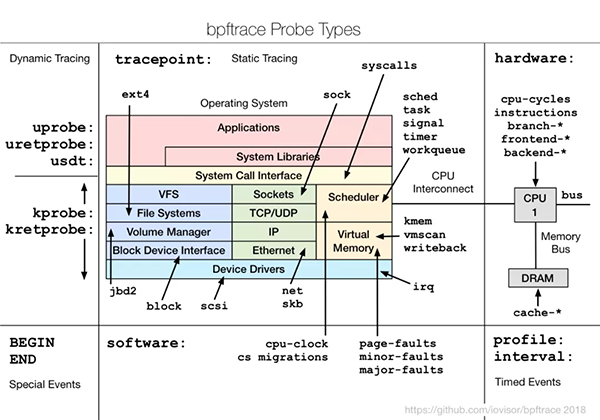

# 如何进行性能分析和诊断

## 0 前言和性能测试综述

为什么写这个呢，毕竟性能分析往往是整个系统的最后一环，而且目前很多时候像什么cpu/内存往往都可以拓展的情况下，性能分析的意义不再像原先那么大。但是现在做CI，CI运行的稳定，对CI中每个测试都有一定的依赖，以目前轻舟的实例来说：如果format test 或者仿真测试scenario-test-presubmit-cn运行过久，那么就会占用大量的CI运算资源，从而干扰其他的测试。我们目前虽然启用了buildfarm来加速编译和测试过程，但是仿真测试在编译完成之后就在云端运行，就脱离了编译的范畴了。

这里面揉杂着三个方面的内容和经历：

+ 在华耀排查内存泄露的问题，到底是哪里花了太多cpu？malloc的linux内存？还是直接接管的hugepage内存？
+ 轻舟排查CI运行的性能问题，比方说为什么仿真运行过久，占用了太多的ci资源
+ 《性能之巅》+《bpf之巅》等很多东西，估计写起来会比较复杂
+ linux性能优化实战
+ 。。。

可能第一遍写也会比较乱，慢慢写吧。


### 0.1 性能测试综述

我下面先简单对性能测试做个分类，再介绍性能测试挑战性的来源，之后给出性能测试的方法和套路，最后给出性能测试可视化的常见手段。这里需要说下，很多内容都是抄的《性能之巅》这本书，我建议直接阅读这本书（已经捐到了图书角），先对xxx表示感谢


#### 0.1.1 性能测试的分类

按照我个人习惯，我将性能测试按照阶段和复杂度进行分类。按照测试场景可以分为下面几种：

+ 软件开发阶段
  + 设置性能目标和建立基本的性能模型：做简单的性能测试，定性分析。
  + 针对软件发布后的基准测试：理想情况下的软件综合性能测试，定量分析。
+ 真实集成阶段
  + 目标环境的概念测试：集成环境或者说ontest环境的性能测试，定量分析。依赖的数据源可能成为受限因素。
  + 特定问题的性能分析：针对实际生产环境性能不达标所做的分析。故障分析

按照复杂度将测试分为两种单一测试和集成测试

+ 单一测试一般只测试单一模块，其它的资源（网络，IO。。。）是充足的，属于设置性能目标和性能建模阶段做的测试。
+ 集成测试，对应软件发布后的基准测试，是理想情况下一个软件系统所能提供的性能的量化

因为测试阶段的不同，其常用的方法和手段都是不同。针对单一测试，抽象出关键资源的性能指标，然后做资源USE分析即可估算出性能模型，提供性能参考。而集成测试需要以单一测试为起点，对工作负载做分析，最终量化性能数据。


#### 0.1.2 性能测试挑战性的来源

性能测试是一个具有挑战性的话题，其挑战性来源于标准的主观性，系统结构的复杂，和系统多问题并存的可能性。

+ 主观：之所以说性能测试是主观的，是因为性能问题是否存在的判断标准往往是模糊的：响应时间或者说是延时虽然是比较清楚的衡量标准之一，如果只说延迟1ms，实际上并不能确定是否存在性能问题。简单来说如果不明确最终用户的性能预期，那这个性能评测往往就是主观的。这个问题的解决方法可以通过定义清晰的目标，或者对落进一定响应延时范围内的请求统计百分比可以将主观的性能变得客观化。
+ 复杂：系统的复杂性导致我们往往缺少一个明确的分析起点，即使子系统隔离时表现得都很好，也可能因为故障连锁（出故障的组件导致其它组件出现性能问题）。这种问题的解决往往要不同角色的工程师通力合作，有时还需要子系统隔离做性能分析
+ 多问题并存：做软件测试

因此当我们做性能测试的时候，需要明确地针对上面三种问题，给出前提条件，从而论证性能测试时合理有效的，


#### 0.1.3 性能测试的常见方法

无论哪种性能测试，都需要明确具体的测试目的，测试用例和前提假设

首先我们需要明确一些术语，这些一致的术语能够帮我们讨论性能问题时快速地统一背景。讨论性能测试时第一步就是明确哪些是关键指标，如何衡量这些指标

+ IOPS：每秒进行读写(I/O)操作的次数，多用于数据库等场合
+ 响应时间：在网络上，指从空载到负载发生一个步进值的变化时，举个简单例子是TLS握手的服务端返回ServerHello报文时间。
+ 延时：延迟是指某个操作从开始到结束所经过的时间
+ 使用率：使用率可以认为是资源所占的比例，一般常说的都是CPU使用率，IO使用率

性能测试常见方法可以分成三种

+ 最常见的就是我直接benchmark工具做压测，什么线程模型，软件模型一把梭！这种方法术语“死道友不死贫道”的性能测试，即我就测试请求，至于可靠性啥的完全不管，只要数字。
+ 从上到下-工作负载分析法：工作负载法往往是用来对外给出定量分析使用，常用来衡量QPS，延时等指标
+ 从下到上-资源分析法：资源负载重点考察资源是否已经处于极限或者接近极限，一些资源负载分析的关键指标为IOPS，吞吐量，使用率

后两种方法是相辅相成的，工作负载测试出来的数据需要有合理性的论证，这时就需要做资源分析；做工作负载分析时，要明确具体的工作负载是什么，除了工作负载之外假定的前提的是什么，注意这里的前提是需要重点展示的。但是无论如何都要对软件应用场景有充分的理解

下面针对性的聊下这几个方法


##### 0.1.3.1 USE法

USE 方法可以概括为：检查所有的资源（服务器功能性的物理组成硬件（CPU， 硬盘, 总线））的利用率（资源执行某工作的平均时间），饱和度（衡量资源超载工作的程度，往往会被塞入队列），和错误信息。

其流程如下

+ 先列出资源列表，比方说下面的资源类型
  + CPUs： sockets, cores, hardware threads (virtual CPUs)
  + 内存： 容量
  + 网络接口
  + 存储设备： I/O, 容量
  + 控制器： 存储, 网卡
  + 通道： CPUs, memory, I/O

+ 绘制数据流图，利用数据流图做瓶颈分析。确定数据流转的关键流程。比方说编解码是主要的功耗，那么我就直接拿CPU的资源做估算即可评估QPS。

我一般用USE法的时候不会直接对着CPU或者网络做资源分析，因为那样子过于基础。相反一般是先用benchmark测试几个关键路径qps等数据，之后利用排队理论里面的little law做性能估测。这个little law的内容为*L* = *λW。*即：一个排队系统在稳定状态下，在系统里面的个体的数量的平均值 L， 等于[平均个体到达率](https://www.zhihu.com/search?q=平均个体到达率&search_source=Entity&hybrid_search_source=Entity&hybrid_search_extra={"sourceType"%3A"answer"%2C"sourceId"%3A"51284376"})*λ* （单位是 个每单位时间）乘以 个体的[平均逗留时间](https://www.zhihu.com/search?q=平均逗留时间&search_source=Entity&hybrid_search_source=Entity&hybrid_search_extra={"sourceType"%3A"answer"%2C"sourceId"%3A"51284376"})W。这里有一个点，如果系统是串行的，那么可以参考CPU发射，将他们的L累加；如果是并行的，需要取最小的L作为结果。

举个简单的例子，分析一个负载均衡的TLS Offload系统的性能，首先分析数据是通过轮询网卡直接拷贝到用户态，然后CPU做解码分包，再之后送入SSL硬件卡做加ECC计算。因此硬件负载均衡网卡，CPU的数据普遍都强于加解密卡，就能直接从理论确定上，这里新建的性能瓶颈是来自加解密卡的性能，那加解密卡做性能建模即可。

如果想计算延时，那么little law就派上了用场，就拿上面的例子来说，网卡的qps是1000，延时是2ms；cpu的qps是10000，延时是1ms；加解密卡的qps是100，延时是1ms，那么系统的并发总量可以计算为`1000*2+10000*1+100*1`，并发度就算出来了，接下来我们非常清楚qps是100，那么延时就可以用这个值直接除以100计算得出。


##### 0.1.3.3 工作负载特征归纳法

工作负载特征归纳法，从上到下进行分析，它需要开发者对实际场景有非常深入的了解。不断提问下面的问题来进行特征归纳，进而设计测试场景。

+ 负载时谁产生的？可以参考进程ID，用户ID，进程名
+ 负载为什么会产生？是哪个代码路径，怎么样子的调用链
+ 负载的组成是什么？是IO？是吞吐？
+ 负载有什么的特点？这种问题一般需要用泛性的方法去分析

我是用工作负载特征法的时候，一般只用来设计测试场景，就拿RPC的测试为例，RPC框架的工作主要是IO线程做发送+送到对应的计算线程编解码，其流量特征为部分长尾数据长度及其长，那么测试场景就可以设计为10%的数据为长尾数据，这些数据随机发出，测试响应时间/延时。

工作负载特征归纳法的问题是用户很多时候并不知道负载是从哪里来的：简单的echo程序，处理一个请求只需要200-300纳秒，单个线程可以达到300-500万的吞吐。但如果多个线程协作，即使在极其流畅的系统中，也要付出3-5微秒的上下文切换代价和1微秒的cache同步代价，这种代价对开发者往往是透明的，因此这种时候我的建议还是直接对着函数做个benchmark，测一下，然后二分式地找一下工作负载来自哪里。


##### 0.1.3.4 性能测试的一般套路

上面的两种方法说起来还是比较粗糙和抽象的，下面给通用一些套路。

首先

+ 确定好性能基线。使用资源分析法，明确响应时间，吞吐量以及资源利用率等性能测试中的关键指标。
  + 可以直接用gbenchmark跑一下理想情况的关键路径，以关键路径作为理论性能的基准
+ 设计测试用例，使用工作负载特征归纳法逐层分析，重点是需要分析清楚负载有什么样子的特点，或者说用户的真实使用场景是什么样子的。
  + 对于部分场景，请求的平均qps很低，但是瞬时冲击很高，那么做性能测试就需要针对性地测试瞬时冲击。
+ REVIEW测试用例合理性，对比软件测试模型是否一致，并评估测试模型是否合理。需要计算机体系结构的基础知识。
+ 执行具体的测试，明确性能测试中的关键指标后，选择具有统计意义的数据进行测试。如果做定量测试或者对比测试，需要给出自变量和因变量的测试结果。
  + 这里要注意，展示结果的时候需要明确地给出测试环境的前提假设。比方说依赖数据库，那么就需要确保数据库的吞吐和延时是正常的。

我们以原先的自定义RPC框架为例模拟一下定量测试。

+ 确定性能基线：因为网络属于不可控因素，先假设网络为理想情况，网络延时为0。接下来对protobuf编解码做benchmark评估延时和QPS等数据的量级，这个结果可以作为理论性能的上限，最终测试出的系统性能偏差20%都算正常。
+ 设计测试用例：PC框架的工作主要是IO线程做发送+送到对应的计算线程编解码，其流量特征为部分长尾数据长度极其长，那么测试场景就可以设计为10%的数据为长尾数据，这些数据随机发出，我们需要测试正常的请求响应时间/延时，是不是受到影响。
+ REVIEW测试用例合理性：这个就可以写文档论述软件模型是什么样子的，测试写的程序架构是什么如何如何
+ 执行具体测试并展示结果：这里要确定自变量和因变量是什么，比方说认为网络情况理想，自变量可以是发送线程的数量，因变量可以为QPS。或者自变量是发送数据包的大小，因变量是请求的QPS。如果对比不同框架的RPC，在固定QPS的情况下，可以自变量是延时，因变量是百分比等等


最后


## 1 性能分析总览

性能分析是一个很复杂的事情，可能是多个方面造成的后果。性能问题很可能出在多个子系统复杂的联系上，即便是这些子系统隔离的时候表现很好，也可能由于连锁故障产生性能问题。要理解这些问题最重要的是搞清楚各个系统下的联系。因此要求对整个系统的理解就要深刻

在轻舟做CI我们重点针对的测试就是仿真测试，而仿真测试的代码非常复杂，揉杂着cache/bazel等一堆东西。它不单纯涉及到编译的耗时，还有仿真测试load cache的延时，另外还有cpu计算的耗时，也就是说它不单纯是个计算密集型还是个io密集型，而且它往往是多个问题的集合体，同时可能有多个瓶颈问题的存在

对这种东西的性能分析，往往要集合很多人才能做分析，诸如pod数量不够，或者存储pvc/oss挂载失败的问题浅层还能直接确定并解决，一旦深入到逻辑里比方说跑的慢，那么就手足无措了。

### 1.1 性能分析的起步和大致的方法

一般分析的时候先考虑程序是什么类型，在华耀做的负载均衡系统就是io密集型，而轻舟的仿真就是io密集+cpu密集型：它又能把cpu吃慢，还吃网络io来load cache（这种两者兼有的极为蛋疼）。之后，就需要衡量程序的性能，改进性能首先要研究评测哪些方面，如何评价，比方说吞吐量，响应时间，延时，并发，使用率，饱和度等等。最后就是针对性的采用各种方法。


#### 1.1.1 资源分析法
资源分析分析是内部哪个资源达到了极限，从而导致问题的出现。我们目前可以简单地将资源分类为下面几个类别，内容是具体的术语来表明关注点。实际上针对性地我们就是在提问比方说使用率，饱和度，错误

+ 网络IO
  + iops：每秒发生的输入/输出的次数
  + 响应时间：一次操作完成的时间（比方说load cache）
  + 延时：等待服务的时间，这里面实际上藏着很多问题，因为网络延时设计的范围很广：dns延时，tcp三次握手延时，数据传输延时等等
+ 磁盘IO
  + iops：如上面，就不赘述了
  + 响应时间
  + 延时：
  + 使用率：
+ CPU：
  + 负载：这里又暗藏一个东西，负载可能不是说任务太多了，而是说任务跑的太久了
+ 内存：
  + 使用率
+ 文件系统：
  + 响应时间：

#### 1.1.2 工作负载法

工作负载分析则分析是内部哪个部分在疯狂占用负载，从而导致问题。这个东西实际上就有点类似perf火焰图了，这里面藏着一个问题就是负载重的不一定就是导致延时增加的东西。比方说阿里云的人就是典型的工作负载法，直接查负载，哪里不对就往哪里blame。

业务负载画像需要直接理解实际运行的业务复杂， “消除不必要的工作”就往往是优化的起点，这要求用户了解

+ 负载时谁产生的？可以参考进程ID，用户ID，进程名
+ 负载为什么会产生？是哪个代码路径，怎么样子的调用链
+ 负载的组成是什么？是IO？是吞吐？
+ 负载有什么的特点？这种问题一般需要用泛性的方法去分析

这里要重点提出来一个60s观察法， 这个是在bpf之巅里面提到的分析，可以帮助我们建立一个直观的最初的印象，确定排查的方向。即先执行一些简单的命令看看有什么问题：

+ uptime
+ dmesg|tail
+ vmstat 1，r的列表示cpu上正在执行和等待执行的进程数量，这个不包含IO，标准来说Average number of kernel threads that are runnable, which includes threads that are running and threads that are waiting for the CPU.。而b指的是被block的进程，一般是被IO阻塞，Average number of kernel threads in the VMM wait queue per second. This includes threads that are waiting on filesystem I/O or threads that have been suspended due to memory load control，free指空闲内存，si和so指示页换入和换出，这些值不为0，说明系统内存紧张。us,sy,id,wa,st都是cpu的运行时间戏份，st是指被窃取时间，主要针对虚拟化环境。cs代表每秒上下文切换次数，一般如果超过10000就意味着上下文过量了。此时一般祭出pidstat -w 5查看上下文抢占的情况。下面是我一次调试runner问题的记录，pidstat的使用看下面，有写
+ mpstat -P ALL 1，如果usr出现100的占用，一般是单个线程阻塞，如果是iowait高就得看看io，如果sys高就得看看系统调用
+ pidstat 1，针对进程显示cpu占用情况，-w显示上下文抢占情况，-w的结果重点关注下面两列
  + **cswch**：自愿上下文切换，进程运行时由于**系统资源不足**，如IO,内存等原因不得不进行切换。
  + **nvcswch**：非自愿上下文切换，比如时间片用完，系统调度让其他任务运行，或者**竞争CPU**的时候也会发生。 

+ iostat -xz 1，r/s,w/s,rkB/s,wkB/s是指每秒向设备发出的读写次数，读写字节数。使用这些指标对业务负载画像即可察觉问题。await：IO的平均响应时间以ms为单位，超过预期的平均响应时间可以视为设备已经饱和或者设备层面有问题的表征。%util代表设备利用率，一般大于60代表性能变差
+ free -m
+ sar -n DEV 1
+ sar -n TCP,ETCP 1
+ top


### 1.1.3 延时分析法

对于延时的分析方法存在延时分析法，这个方法就非常直接了，就是针对延时的二分法：

1. 存在请求延时吗？（有的）
2. 请求时间花在cpu上吗？（不在）
3. 不花在cpu的时间花在哪里了？（文件系统i/o）
4. 文件系统的io花在了磁盘io/还是锁竞争？（磁盘io）


### 1.2 性能分析的工具

我们现在可以使用的工具已经非常多了，这给我们带来很多的方便。

#### 1.2.1 计数器类型工具

针对系统级别：

+ vmstat
+ mpstat
+ iostat
+ netstat
+ sar

针对进程级别：

+ ps：用来查进程状态，延时分析的时候可以调研进程处于哪几种状态。

  + 可以用这个命令来判断进程（线程）on-cpu占wallclock总的时间比例：

    ```
    ps -eo time,pid,etime | grep [PID]
    ```

  + 进程状态的汇总：on-cpu（执行）；off-cpu（可运行；匿名换页；睡眠：等待包括网络，块设备和数据/文本页换入在内的io；锁：等待获取同步锁，或者等待其它线程；空闲：等待工作）

  + 针对各个cpu状态可以做更细分工作

    + 执行：检查执行的是用户态还是内核态，确定哪些代码路径消耗cpu，消耗了多少
    + 可运行：检查整个系统的cpu负载，可能是系统的资源不足？
    + 匿名换页：检查整个系统的内存使用情况和限制
    + 睡眠：分析阻塞应用程序的资源是什么，下面给一些具体的工具
      + pidstat -d ：判断在等待磁盘io还是睡眠
      + pstack，这个一般是针对睡眠达到s级别的，这次对仿真运行过久的排查就是用pstack确定的
    + 锁：识别锁和持有锁过久线程，确定为什么花了那么久

+ top：top往往用来分析进程占用cpu的比例，对于cpu密集型程序，如果占用cpu很少，那明显确定有问题。

  + top将执行时间汇报为%CPU，即

+ pmap

+ /proc/[pid]下的各种进程信息的汇总

  + stat进程状态和统计，直接看这个https://man7.org/linux/man-pages/man5/proc.5.html，里面有每个列的汇总
  + limits实际的资源限制

+ pstack：直接打印线程栈，显示线程在干什么，如果几次打印线程都阻塞在curl上，那么大概率网络io有点问题

#### 1.2.2 追踪类型工具

追踪方面的工具相比较而言可以给我们更直接的观察

+ dtrace
+ bpftrace
+ perf

dtrace：针对dtrace我觉得不用多看了，毕竟bpftrace都出来那么久了，感觉没必要再坚持老黄历了。

##### 1.2.2.1 bpftrace

bpftrace：bpftrace，比较新的内核都支持，注意这里比较新的是指4.19之后的linux kernel，所以目前实际上我们都可以做分析了，下面给出来几个简单的例子，这里注意我不会过多的纠结于语法，也就是说重点是介绍某个工具可用，给个简单的例子，然后继续

+ funccount，统计内核态或者用户态函数是否被调用过，该函数被调用过几次。方向明确的时候，针对具体函数可以做分析。
+ stackcount，负责对内核态或者用户态函数发生调用链分析，比方说我们认为某个函数被调用是有问题，想查查到底是哪几个地方大量调用就可以使用这个函数。方向明确的时候，针对具体函数可以做分析
+ trace，trace函数是多用途函数。它可以用来显示包括：1某个函数被调用的时候，参数是什么？2函数的返回值是什么？3函数的调用链是什么？这个功能对于内存泄漏问题排查会有比较大的帮助。比方说我可以直接同时记录申请内存 & 释放内存的函数，然后查询哪些函数路径里面的内存没被释放掉。当然，这也是需要自己手动去比较的。方向明确的时候，针对具体函数可以做分析
+ 

perf：具体的如何用perf做分析的就直接看这个链接好了https://access.redhat.com/documentation/en-us/red_hat_enterprise_linux/8/html/monitoring_and_managing_system_status_and_performance/monitoring-application-performance-with-perf_monitoring-and-managing-system-status-and-performance


## 2 针对具体方面的分析

### 2.1 CPU

#### 2.1.0 关于CPU

CPU和硬件资源直接的管理者是kernel，kernel决定了cpu的调度和状态的切换。这里的状态值得是用户态和内核态，用户态程序进入内核态有两种情况：发起syscall就会显式地进入内核态；如果有缺页中断会隐式地进入内核态。这里面藏着一点，如果有大量的中断，确实可能导致CPU上的进程被打断，在华耀的时候就见过网卡大量中断，中断上半段必须立刻执行从而干扰了进程执行。但是这种情况的确定是明显能从数据当中看出来的，会打断所有的程序。软件发起的中断一般是软中断，而硬件发起的中断是硬中断

从上面的描述可以看出来，使线程脱离cpu执行的情况有：

+ 主动脱离，线程阻塞于IO，锁或者主动休眠sleep
+ 被动脱离，线程运行时长超过了调度器分配的时间片，或者高优先的任务抢占。

这种线程的切换实际上要保存包括栈，页表等信息被称为上线问切换。

#### 2.1.1 CPU分析的方法

方法，对cpu做性能分析的方法如此之多，可以分析的指标又如此之多，所以中断关注什么呢？可以看看系统负载是否均衡，cpu是不是调度的均匀：

+ 工具法：实际上就是可用的工具全用一遍，检查是不是有什么明显的问题。但是这个有个问题就是，工具爆出来的问题可能只是个红鲱鱼，真正的问题不在这里。而且这种排查方式往往占用大量的时间。针对工具法的流程如下，是一个从全程到细节的分析过程：
  + uptime：检查负载平均数来确认cpu负载时随时间上升还是下降，负载平均数超过了cpu数量通常代表cpu饱和
  + vmstat：每秒运行vmstat，然后检查空余列
  + mpstat：检查单个热点cpu，挑出来可能的线程拓展性问题
  + top/prstat：看哪个进程和用户是cpu消耗大户
  + pidstat/prstat：把cpu消耗大户分解为用户和系统时间
  + Perf/dtrace/stap/cpustat:profile
+ 负载特征归纳：这个重点就是分析平均负载；用户时间和系统时间的比例；系统调用频率；中断频率；如果程序花了大量的时间在系统调用中，那么就可以用这个方法来确定到底为什么慢。
+ profiling：这个就是拿dtrace/perf等方面一点一点去看，究竟哪些path的频率高
+ 优先级调优：这个说白了就是调整nice值，正的nice代表降低进程优先级，而负值代表提高优先级。


#### 2.1.2 CPU分析的工具

工具：

+ uptime：用来显示系统的平均负载，如果认为是性能不足负载过重，可以用这个来检查。平均负载表示了对cpu资源的需求，通过汇总正在运行的线程数和正在排队等待运行的线程数计算得出。如果平均负载大于CPU数量，那么说明CPU不足以服务线程

  ```
  qcraft@BJ-HeXiaonan:~$ uptime
  #最后三个值分别代表1min，5min，15min的平均负载
   16:12:45 up 4 days,  3:22,  2 users,  load average: 1.14, 1.65, 1.46
  ```

+ vmstat：

+ mpstat: mpstatl报告每个cpu的统计信息，参考这个：https://man7.org/linux/man-pages/man1/mpstat.1.html，列CPU表示cpu号，%usr代表用户态，%sys为内核态，%iowait：io等待，%irq，硬件中断，%soft软件中断，%idle空闲；

  ```
  qcraft@BJ-HeXiaonan:~$ mpstat -P ALL 1
  Linux 5.4.0-42-generic (BJ-HeXiaonan) 	2022年06月05日 	_x86_64_	(24 CPU)
  
  16时23分21秒  CPU    %usr   %nice    %sys %iowait    %irq   %soft  %steal  %guest  %gnice   %idle
  16时23分22秒  all    0.00    0.00    0.08    0.00    0.00    0.00    0.00    0.00    0.00   99.92
  16时23分22秒    0    0.00    0.00    0.00    0.00    0.00    0.00    0.00    0.00    0.00  100.00
  16时23分22秒    1    0.00    0.00    0.00    0.00    0.00    0.00    0.00    0.00    0.00  100.00
  16时23分22秒    2    0.99    0.00    0.00    0.00    0.00    0.00    0.00    0.00    0.00   99.01
  16时23分22秒    3    0.00    0.00    0.00    0.00    0.00    0.00    0.00    0.00    0.00  100.00
  ```

  

+ ps：这个不用多说

+ gdb: 也不用多说

+ pidstat：这个命令按照进程或者线程数量打印CPU用量，很直接的结果，实际上

+ time & ptime:这个也不用多说了，输出运行用户态时间+sys时间+wallclock时间

+ 来说说怎么使用bpftrace做分析，

### 2.1.3 分析CPU的几种具体方法

我们来看下面几种重点的分析案例中的具体手段，注意，这下面都是给出工具，从工具出发的具体手段。这里使用的工具是bpf

#### 2.1.3.0 通用分析

通用分析的时候一般第一步是分析到底是什么问题，一般入手就是两种情况：

1. 目的非常明确，我知道我想分析的程序是什么，比方说就是仿真的主程序simulator_main跑得慢，那么直接针对性的用pidstat/pstack看花费时间在哪里，进而查询到底是本身在文件系统、io(磁盘，网络)上。还是单纯的cpu没抢到。
2. 我不知道我要分析什么，我需要首先查询负载，检查每个cpu的状态mpstat。检查io的状态。如果能找到可疑的程序，那么检查这个程序的耗时等东西。


通用分析的工具包括CPU分析的工具里面提到的东西，和下面的bpf的工具。

+ execsnoop：这个工具会列出来新创建出来的进程，分析负载方面的问题。试想这样子的场景，pod启动失败，对应于一个docker进程，根据日志/启动时间+execsnoop的日志我们就能找到对应的进程号，然后就可以不断的看top里面该进程的状态是D？S？R？一个良好的起点就出现了。

+ gdb：gdb --q --n --ex bt --batch --pid xxx 使用这个命令打印出栈在干啥，有的时候发现进程不知道在干啥就可以打印出来具体的栈，看看到底在干啥

+ exitsnoop：这个工具可以列出来pid，ppid运行时长和退出码，分析进程之间的关系和它们所耗费的时间的时候是个非常有效的提示点

+ opensnoop：这个工具用来分析

+ profile：和perf一样，直接进行采样，设想这样的用法：我们使用profile发现某个函数比方说~SIM_CACHE花了大量时间，那么到底是跑的慢还是跑的次数很多呢？调用前面的functount算下调用多少次，就可以排查了。profile会以49hz的频率记录用户态和内核态的调用栈。除了在不知道咋回事的时候用profile看调用栈，使用profile也可以针对一两个函数做分析，比方说想分析malloc都是哪里申请的，那就调用profile查看到malloc的调用栈啥的。

+ offcputime：offcputime会打印出来进程阻塞时候的栈，或者说调用链。我们可以用火焰图进行分析。这里很有用的是火焰图片svg，可以点击进去继续进行分析

  ```shell
  offcputime -f -p $(pgrep mysqld) 10 > out.offcputime.txt
  flamegraph.pl --widh=800 --color=io --title="Off-CPU Time Flame Graph" \
  	--countname=us < out.offcputime.txt > out.offcputim.svc
  ```

  

#### 2.1.3.1 分析锁

一般认为锁是导致程序睡眠的原因的话属于大部分问题分析的最后一步了，这种锁的争用要么及其冥想，要么很令人迷惑所幸bpf里面也有分析的软件

+ pmlock：会显示出来调用锁的路径和等待的延迟，输出的格式一般是：先是锁的地址，然后具体的调用路径，最后是等待的时间

  

  

+ pmheld：显示某些路径持有锁和持有的时间

+ deadlock：显示死锁，这个说起来是显示锁的调用顺序

#### 2.1.3.2 分析负载或者进程/线程睡眠

线程/进程睡眠的时间原因就几种：

+ 负载重，进程优先级不高，被其它线程抢占了。可以看看uptime，runqlat，runqlen
+ 本身代码的问题，有网络io/很重的磁盘io。这个针对具体进程分析cpudist
+ 系统有大量的磁盘io/中断，强行打断了。调用mpstat看irqs，或者看下一小节。

确认是不是负载重的问题，分析可以使用下面的工具进行分析。

+ runqlat：当cpu负载很重，我们想证明这一点的时候，除了使用uptime的后三列来论证。也可以使用该工具，该工具统计的信息是每个线程（任务）等待CPU的耗时。这个工具有什么用呢？我们都知道编译的时候是clang多线程编译的，如果编译的线程数量设置的不对，可能就会发生资源利用不充分的情况。CPU超载的情况下就会发生下图，这样子就是明显的离群点。当然使用sar也能发现这样子的问题。下面的图片显示了线程等待时间的微秒是多少，可以看到0->15s有很多，16384 -> 32767有一个明显的离群点，这就证明了配置的错误，或者说是性能不足。

  ```
  # runqlat
  Tracing run queue latency... Hit Ctrl-C to end.
  ^C
       usecs               : count     distribution
           0 -> 1          : 233      |***********                             |
           2 -> 3          : 742      |************************************    |
           4 -> 7          : 203      |**********                              |
           8 -> 15         : 173      |********                                |
          16 -> 31         : 24       |*                                       |
          32 -> 63         : 0        |                                        |
          64 -> 127        : 30       |*                                       |
         128 -> 255        : 6        |                                        |
         256 -> 511        : 3        |                                        |
         512 -> 1023       : 5        |                                        |
        1024 -> 2047       : 27       |*                                       |
        2048 -> 4095       : 30       |*                                       |
        4096 -> 8191       : 20       |                                        |
        8192 -> 16383      : 29       |*                                       |
       16384 -> 32767      : 809      |****************************************|
       32768 -> 65535      : 64       |***                                     |
  ```

+ runqlen：另一个显示性能是否繁忙的工具，显示有多少个线程在等待运行，显示等待队列的信息，同样可以确定负载。但是显示运行等待队列并不如显示运行等待时间靠谱，等待时间是一等指标，等待队列是二等指标，想想看超市排队的时候排队时间是关注重点，排队人数是稍次级的工具。那么为什么需要runqlen呢？因为它可以从侧面反映问题，而且它对性能造成的影响低。

+ cpudist：这个工具的作用是统计每次线程唤醒后在cpu上执行的时长分布，它可以针对具体的进程执行分析，只需要制定pid。我们实际上是希望某些程序能够尽量多占用cpu的，这个工具不用直接去查/proc/[pid]/stat里面的信息。设想我们某天保存了一个仿真测试正常执行的oncpu分布，过了两天仿真测试忽然变慢了，我们可以对比下看看到底是哪里的变化。下面是我在台式机上做分析的时候给出的统计，可以看到每个线程执行的时间很短。但整体还是一个正态分布的效果。

  ```
  root@BJ-HeXiaonan:/# /usr/share/bcc/tools/cpudist  10 1
  Tracing on-CPU time... Hit Ctrl-C to end.
  
       usecs               : count     distribution
           0 -> 1          : 1095     |**                                      |
           2 -> 3          : 5130     |**********                              |
           4 -> 7          : 6286     |************                            |
           8 -> 15         : 7448     |**************                          |
          16 -> 31         : 20146    |****************************************|
          32 -> 63         : 7442     |**************                          |
          64 -> 127        : 2461     |****                                    |
         128 -> 255        : 527      |*                                       |
         256 -> 511        : 152      |                                        |
         512 -> 1023       : 112      |                                        |
        1024 -> 2047       : 59       |                                        |
        2048 -> 4095       : 40       |                                        |
        4096 -> 8191       : 47       |                                        |
        8192 -> 16383      : 28       |                                        |
  root@BJ-HeXiaonan:/#
  ```

  对于任务很重的情况，可能会有线程超过了CPU调度器分配的运行失常，从而导致了被动的上下文切换的情况，下面的图有非常明显的离群点，4-15ms，

  

       root@BJ-HeXiaonan:/# /usr/share/bcc/tools/cpudist  10 1
       Tracing on-CPU time... Hit Ctrl-C to end.
       usecs               : count     distribution
           0 -> 1          : 1095     |****************************************|
           2 -> 3          : 5130     |****                                    |
           4 -> 7          : 6286     |*****************************           |
           8 -> 15         : 7448     |*******************************         |
          16 -> 31         : 20146    |********                                |
          32 -> 63         : 7442     |******                                  |
          64 -> 127        : 2461     |****                                    |
         128 -> 255        : 527      |*                                       |
  root@BJ-HeXiaonan:/#

+ threaded：很多时候，我们分析的软件时多线程的，那么这些线程多久使用一次cpu就需要采样分析，使用threaded.bt就能做这样子的事情

+ offcputime：虽然上面已经说过一次了，不过还是要专门提一下offcputime因为它确实好用，offcputime会统计并输出线程offcpu的原因和时间，换言之会给出来栈，因此可以分析为什么线程没在cpu上运行，这个工具可以用来分析为什么线程没在cpu上运行。如果是有睡眠或者syscall的原因可以用这个看出来。


#### 2.1.3.3 分析软中断soft interrupt（syscall）/和硬中断

一般直观的可以用pstack或者软中断上去看下线程在干什么，然后调用相应的工具。

+ syscount：这个工具用来调查syscall占用时间长的问题，它会打印出来系统调用的排行表。然后我们可以用profile发现到底是什么慢了
+ softirqs & hardirqs：mpstat工具用%soft & %irq来显示软中断，硬中断，也可以用这两个工具来做分析
+ argdist：
+ trace：
+ bpftrace：


### 2.2 内存

对于内存方面，我发现有些人认识并不清楚，性能差了就往缺页终端，内存swap了方面去猜测，这种如果是内存引起的性能问题是需要明确数据证明的，不能靠猜测。按照bpf之巅的方法，一般排查流程是：

+ 

实际上这段时间我们遇到内存的问题并不多，一次是内存泄露的排查，最后用memleak查了出来；另一次是没有内存泄露，用memleak确定了一下，最后强制malloc把释放的内存还给了操作系统解决。


#### 2.2.1 内存排查的工具

工具还是以bpf的为主：

+ oomkill，用来追踪是什么程序需要内存从而触发的oom kill，和谁被oomkill掉了。同时还会显示当前系统的负载
+ memleak，用来排查没释放的内存，但这个工具依然只是调试工具，可能会导致性能降低到十分之一的级别
+ mmapsnoop，跟踪mmap系统调用，
+ brkstack，跟踪brk系统调用
+ faults，跟踪缺页中断触发时候的系统路径，会打印出来调用栈。这个时候可以用来解释进程内存的增长。这个是有火焰图可以用来统计具体是哪里触发的。
+ swapin


### 2.3 文件系统

当问题出到文件系统和IO的时候，问题往往就不是那么好分析了。需要开发人员对于操作系统有基本的认识：

一般来说，应用程序向文件系统发送的请求是逻辑IO，如果这些逻辑IO最终由磁盘设备服务，那么就会变成物理IO---应用程序通过posxi到系统库，然后到系统调用。到了系统调用之后要么直接裸io，要么走文件系统io:用vfs一点一点到磁盘设备。linux为了应对性能的挑战，启用了多种缓存技术这些缓存包括：

+ 页缓存：页缓存是缓存的虚拟内存页，包括文件的内容和IO穿冲的信息，简单来说就是page cache。注意**linux支持写回模式处理文件系统写操作，仙还村脏页，再写回，避免阻塞IO**
+ inode缓存：索引节点是文件系统用来描述所需对象的一个数据结构体，linux维持这个是因为检查权限或者读取其他数据的时候，这个经常用到
+ 目录缓存：dcache，这个缓存了从目录元素名到VFS inode之间的映射关系，这可以提高路径名查找的速度。




针对文件系统，我们通常需要解答很多细节的问题，比方说：

+ 发往文件系统的请求有哪些？按照类型计数
+ 文件系统的读请求多少？
+ 有多少写IO是同步请求？
+ 文件系统的延迟来自哪里？磁盘？调用路径？还是锁？
+ 文件系统延迟的分布情况如何？
+ Dcache和Icache的命中率和命空率是多少？


下面给一种通用的IO排查方法：

+ 首先识别挂载了哪些盘，df/fdisk啥的
+ 检查文件系统的容量，看看磁盘是不是满了。之后找个空闲的机器看看IO Usage多少
+ 使用opensnoop查看正在打开那些文件，使用filelife查找是否存在短期稳健
+ 查找非常慢的文件系统操作，按照进程和文件名观察，可以用ext4slower,btrfsslower,zfsslower
+ 检查文件系统的延迟分布，比方说ext4dist，btrfsdist，zfsdist等
+ 检查页缓存命中率
+ 使用vfsstat比较逻辑IO和物理IO的命中率和数量的区别


可用的BPF工具：

因为linux传统工具分析文件系统的不多，所以我直接写BPF工具了


+ opensnoop，这个就不多赘述了

+ statsnoop，stat用来获取文件信息，这个东西过多也可能造成性能问题

+ fmapfault：用来跟踪内存映射文件的时候的缺页错误

+ filelife：显示文件的生命周期

+ vfsstat：这个是针对VFS调用，用来统计VFS调用，比方说读、写、创建、打开、的次数。文件打开是相对较慢的操作，需要进行路径查找，创建文件描述符啥的

+ vfscount：这个是用来显示vfs函数的次数的

+ vfssize：用直方图的方式统计VFS读取尺寸和写入尺寸，并且按照进程名，VFS文件名和操作类型分类

+ fileslower：显示延迟超过某个阈值的同步模式文件读取和写入，下面的命令可以看到写入了大量的源代码文件，其延迟非常恐怖，竟然达到了200甚至4000ms的级别

  ```
  root@hangzhou-arm03:/usr/share/bcc/tools# ./fileslower -p 24959
  Tracing sync read/writes slower than 10 ms
  TIME(s)  COMM           TID    D BYTES   LAT(ms) FILENAME
  0.261    skyframe-evalu 18233  W 1535     200.59 central_b_splines.svg
  0.261    skyframe-evalu 18248  W 4279     201.55 AccessKey.cpp
  0.464    skyframe-evalu 18233  W 1559     203.51 central_b_splines.svg
  0.464    skyframe-evalu 18248  W 989      203.48 AttachGroupPolicyRequest.cpp
  0.668    skyframe-evalu 18233  W 1606     203.55 central_b_splines.svg
  0.668    skyframe-evalu 18248  W 1283     203.42 ContextKeyTypeEnum.cpp
  4.968    skyframe-evalu 18233  W 1521    4299.95 central_b_splines.svg
  4.976    skyframe-evalu 18248  W 3424    4307.99 ContextKeyTypeEnum.cpp
  5.176    skyframe-evalu 18233  W 466      201.83 differential_entropy.svg
  5.184    skyframe-evalu 18248  W 1612     202.68 GetPolicyVersionResult.cpp
  5.380    skyframe-evalu 18233  W 3936     202.40 digamma____float128.svg
  5.388    skyframe-evalu 18248  W 4364     202.50 InstanceProfile.cpp
  ```

  

+ filetop，关注读写最频繁的文件，这个可以用来找热点文件

+ writesync

+ cachestat：用来显示页缓存的命中率，一般来说页缓存命中率应该很高才对，如果命中率能达到100%，那么这个效率就很高了

+ writeback：显示页缓存的协会操作，包括：页扫描的时间，脏页写入磁盘的时间，写回时间的类型，持续的时间

+ dcstat和dcsnoop

+ xfsslower:跟踪xfs文件系统操作，对超过阈值的慢速操作打印出来每个事件的详细信息，跟踪的操作有read/write/open/fsync

+ xfsdist：以直方图的方式，统计操作的延迟read/write/open/fsync

+ ext4dist

+ ext4slower:用来追踪ext4比较慢的操作

  ```
  root@hangzhou-arm03:/usr/share/bcc/tools# ./ext4slower
  Tracing ext4 operations slower than 10 ms
  TIME     COMM           PID    T BYTES   OFF_KB   LAT(ms) FILENAME
  13:37:03 skyframe-evalu 27776  W 8192    110456    203.52 boost_1_76_0.tar.gz
  13:37:03 skyframe-evalu 26315  W 6929    1         203.96 Recommendation.h
  13:37:03 skyframe-evalu 25278  W 508     0         200.85 DescribeMapRequest.cpp
  13:37:03 skyframe-evalu 24408  W 6204    16        206.56 brent_minima.html
  13:37:03 skyframe-evalu 25278  W 2259    5         201.86 test_gcd.cpp
  13:37:03 skyframe-evalu 27439  W 8192    19        201.58 reverse_128.hpp
  13:37:03 skyframe-evalu 27439  W 2391    0         204.91 test_read_format_zip_encryption_
  13:37:03 skyframe-evalu 24959  W 2575    0         206.25 DeleteLogGroupRequest.h
  13:37:03 skyframe-evalu 27439  W 5428    0         206.37 UpdateVpcLinkRequest.h
  13:37:03 skyframe-evalu 26315  W 8192    427       207.77 pcl_horz_large_pos.bmp
  13:37:03 skyframe-evalu 28681  W 8192    86528     207.81 boost_1_76_0.tar.gz
  13:37:03 skyframe-evalu 26315  W 8192    3744      207.81 libxml2-2.9.12.tar.gz
  13:37:03 skyframe-evalu 27439  W 8192    20592     203.83 pcl-1d3622c1e624994bc013e3e66bc5
  13:37:03 skyframe-evalu 26315  W 884     0         202.81 bind.hpp
  13:37:03 skyframe-evalu 29981  W 2898    26        203.15 tokenizer.cc
  13:37:03 skyframe-evalu 24959  W 3825    296       207.59 hypergeometric_1f1_log_large.ipp
  13:37:03 skyframe-evalu 26315  W 422     0         202.99 UntagResourceRequest.h
  13:37:03 skyframe-evalu 25278  W 587     0         202.62 GetMapGlyphsRequest.cpp
  13:37:03 skyframe-evalu 24408  W 4754    90        207.67 brent_minima.html
  13:37:03 skyframe-evalu 25278  W 715     0         202.98 test_kn.cpp
  13:37:03 skyframe-evalu 27439  W 8192    7         207.62 reverse_256.hpp
  13:37:03 skyframe-evalu 27439  W 391     0         207.12 test_read_format_zip_filename_cp
  13:37:03 skyframe-evalu 24959  W 5520    0         207.10 DescribeLogGroupsRequest.h
  13:37:03 skyframe-evalu 26315  W 8192    3816      207.81 libxml2-2.9.12.tar.gz
  13:37:03 skyframe-evalu 27439  W 8192    20656     203.84 pcl-1d3622c1e624994bc013e3e66bc5
  13:37:08 skyframe-evalu 26315  W 8192    493      4715.70 pcl_horz_large_pos.bmp
  13:37:08 skyframe-evalu 27439  W 4462    3        4723.10 APIGatewayClient.cpp
  13:37:08 skyframe-evalu 28681  W 8192    86600    4723.81 boost_1_76_0.tar.gz
  13:37:08 skyframe-evalu 26315  W 8192    3824     4515.97 libxml2-2.9.12.tar.gz
  ```

  

+ icstat：跟踪inode缓存的查找操作

+ bufgrow：查看换从缓存的内部情况，展示页缓存里面的块也增长情况


### 2.4 IO

我个人对io的认识并不深刻，前几天实际上就分析遇到过xavier（arm64）机器io占用极高的问题，大概四个核的iowait高达90%，但是无论使用iotop还是iftop都没看到什么可疑的东西。最后我重启了系统，恢复正常。但是这个事情算是无疾而终，实际上我后来回想出问题的地方，觉得我的分析有两大谬误：

+ iowait高是起因还是结果？如何分析这个事情？iowait高智能说明操作延时很高
+ 磁盘或者网络io只是外因，重点应该分析文件系统，只关注磁盘/网络往往是错误的。

#### 2.3.1 IO的基本知识

这里的IO和文件系统拆开说了，我们只说IO了。IO操作在块IO层会进入一个队列，由调度器进行调度，传统调度器使用一个全局共享请求队列，这个队列有单独的锁保护，在高IO的情况下就有性能瓶颈。新的IO调度器拆分为不同的CPU不同的队列，但是总体来讲，等待时长是在块服务层调度器队列和设备分发队列中等待的时间。服务时长是从设备发布请求到请求完成的时间。

现在的IO设备往往自己还有一个缓存，所以这个是时候的问题分析就变得复杂，总之


所以实际上我们分析的事情应该针对

### 2.3.2 IO分析的方法

分析的时候一般需要先分析一些基础信息：

+ 操作频率和操作类型
+ 文件io吞吐量：需要考虑文件系统缓存有多大？
+ 文件io大小
+ 读写比例
+ 同步读写比例
+ 文件随机读写

### 2.3.3 磁盘io分析的工具

传统工具部分，观察

+ iostat，最常用的工具一般是iostat -dxz 1使用，其中rrqm/s是每秒进入对了和被合并的读请求，wrqm/s是每秒进入对了和被合并的写请求。当系统发现一个新的io读写请求和另一个io读写请求位置相邻的时候，两个io就会被合并。r/s和w/s是合并一哦呼每秒完成的读或者写请求。这里面对于同步io，我们要管线r_await或者w_await，await是平均IO请求市场，也就是设备的响应时间，包括在驱动队列中的等待时间和设备的实际响应时长，单位为ms

  ```
  Device            r/s     w/s     rkB/s     wkB/s   rrqm/s   wrqm/s  %rrqm  %wrqm r_await w_await aqu-sz rareq-sz wareq-sz  svctm  %util
  loop0            0.00    0.00      0.00      0.00     0.00     0.00   0.00   0.00    0.00    0.00   0.00     2.50     0.00   0.00   0.00
  vda              6.61 1021.96    136.05  25014.27     0.00  2482.40   0.06  70.84    0.43    0.41   0.37    20.58    24.48   0.05   4.86
  
  Device            r/s     w/s     rkB/s     wkB/s   rrqm/s   wrqm/s  %rrqm  %wrqm r_await w_await aqu-sz rareq-sz wareq-sz  svctm  %util
  vda              1.00    8.00      8.00    360.00     0.00    82.00   0.00  91.11    0.00    0.00   0.00     8.00    45.00   0.00   0.00
  ```

+ blktrace

上面都是传统工具，我们重点看bpf的工具了，针对磁盘IO发生的性能诊断工具其应用的层次如下



+ biolatency。该工具用直方图统计块IO设备的延迟信息，这里的设备延迟是从向设备发出请求到请求完成的全部时间，包括了在操作系统内部的派对时间。给一个简单例子，下面按照10s来统计写入./biolatency -Q -F 10，这个会包括操作系统的排队时间（-Q，A -Q option can be used to include time queued in the kernel.），按照IO操作的类型区分（-F），从而区分同步写等flag的区别。下面的图片，同步写有明显的双峰

  ```
  root@hangzhou-arm03:/usr/share/bcc/tools# ./biolatency -Q  -F 10
  Tracing block device I/O... Hit Ctrl-C to end.
  
  
  flags = Write
       usecs               : count     distribution
           0 -> 1          : 0        |                                        |
           2 -> 3          : 0        |                                        |
           4 -> 7          : 0        |                                        |
           8 -> 15         : 0        |                                        |
          16 -> 31         : 0        |                                        |
          32 -> 63         : 0        |                                        |
          64 -> 127        : 0        |                                        |
         128 -> 255        : 18       |******                                  |
         256 -> 511        : 35       |***********                             |
         512 -> 1023       : 111      |*************************************   |
        1024 -> 2047       : 120      |****************************************|
        2048 -> 4095       : 67       |**********************                  |
        4096 -> 8191       : 9        |***                                     |
  
  flags = Sync-Write
       usecs               : count     distribution
           0 -> 1          : 0        |                                        |
           2 -> 3          : 0        |                                        |
           4 -> 7          : 0        |                                        |
           8 -> 15         : 0        |                                        |
          16 -> 31         : 0        |                                        |
          32 -> 63         : 0        |                                        |
          64 -> 127        : 0        |                                        |
         128 -> 255        : 10       |****************************************|
         256 -> 511        : 1        |****                                    |
         512 -> 1023       : 0        |                                        |
        1024 -> 2047       : 4        |****************                        |
  
  flags = NoMerge-Write
       usecs               : count     distribution
           0 -> 1          : 0        |                                        |
           2 -> 3          : 0        |                                        |
           4 -> 7          : 0        |                                        |
           8 -> 15         : 0        |                                        |
          16 -> 31         : 0        |                                        |
          32 -> 63         : 0        |                                        |
          64 -> 127        : 0        |                                        |
         128 -> 255        : 0        |                                        |
         256 -> 511        : 0        |                                        |
         512 -> 1023       : 20       |********************************        |
        1024 -> 2047       : 25       |****************************************|
        2048 -> 4095       : 9        |**************                          |
        4096 -> 8191       : 1        |*                                       |
  
  flags = NoMerge-Sync-Write
       usecs               : count     distribution
           0 -> 1          : 0        |                                        |
           2 -> 3          : 0        |                                        |
           4 -> 7          : 0        |                                        |
           8 -> 15         : 0        |                                        |
          16 -> 31         : 0        |                                        |
          32 -> 63         : 0        |                                        |
          64 -> 127        : 0        |                                        |
         128 -> 255        : 0        |                                        |
         256 -> 511        : 0        |                                        |
         512 -> 1023       : 19       |****************************************|
        1024 -> 2047       : 18       |*************************************   |
  ```

  

+ biosnoop，biosnoop用来针对每个磁盘IO打印一行信息，可以方便地确定写入的延迟。下面的例子发现一只在写入jbd2/vda3-8的进程的写操作。

  ```
  30.954642   jbd2/vda3-8    471    vda     W 17496216   65536     3.16
  30.954707   jbd2/vda3-8    471    vda     W 17499928   65536     2.30
  30.954861   jbd2/vda3-8    471    vda     W 17500056   65536     2.43
  30.954873   jbd2/vda3-8    471    vda     W 17496344   65536     3.38
  ```

  

+ biotop，可以认为是iotop的现代版本，用来显示正在操作的io行为

+ bitesize

+ seeksize

+ biopattern

+ biostacks：跟踪完整io栈，一些后台进程可以被追踪

+ bioerr

+ iosched：跟踪io请求在io调度器里面排队的时间，并且安装调度器名称分组显示

+ scsilatency：跟踪scsi命令以及对应的延迟分布的工具

+ nvmelatency：


### 2.5 网络

或许有点奇怪，实际上网络的问题我查的不多，因为很多时候网络的问题都是直接看统计报表即可


常用工具

+ ss
+ Ip


### 2.5 安全

作为新兴工具，bpf在安全方面还是很先进的。bpf可以协助检查正在执行进程，检查网络连接和系统权限，检查正在被调用系统内核。此外bpf也可以用来追踪检查软件漏洞

常用工具：

+ elfsnoop
+ modsnoop
+ bashreadline：跟踪bash交互的命令
+ shellsnoop：镜像另一个shell会话的输出
+ ttysnoop
+ eperm：舰艇permission失败，但是在具有高IO的系统里，开销可能会很高
+ tcpreset：跟踪tcp发送重置数据包
+ capable：检查线程能力模型（参考零信任学习）的进程，会显示安全能力号，安全能力代码名称，


## 2 性能分析的案例和常见的调优手段


### 2.1 git慢的问题排查

我为啥写这个事情呢？因为这个过程当中我一开始以为是性能问题，后来发现似乎和性能无关，最后还是发现性能问题。这个属于第二类性能问题，即一开始没有明确目标，需要先找到问题是啥然后再解决。

2022年6月的时候，我们的gitlab出现两个问题：1 push代码忽然很慢，2 提交代码经常报错500

这里面两个问题同时出现，以至于我们以为这是同一个问题，实际上是两个问题，提交代码报错500，经过追踪是gitlab内部ruby报的错误。然后开始查push慢的问题，一开始以为是gitaly和gitlab-workhorse的东西（这两个干啥的可以直接搜索下），在机器负载重的情况下这两个占用cpu能占到5个cpu，负载重的时候uptime显示的负载能到60多（我们机器才32c），但是后来发现及时是负载清的时候，push代码也很慢，Nmmmm，换个思路。排查下push代码的时候发生了什么

启动execsnoop监控启动的进程和参数，exec log可以清晰的看到参数和具体启动的时间戳，看了下发现似乎29307也就是git rev-list花了好长的时间啊，那么到底是这样子吗？还是说启动的早，退出的早？

```shell
exec.log
10:37:21 git              28706   2005      0 /opt/gitlab/embedded/bin/git -c core.fsyncObjectFiles=true -c gc.auto=0 -c core.autocrlf=input -c core.alternateRefsCommand=exit 0 # -c receive.fsckObjects=true -c receive.fsck.badTimezone=ignore -c receive.advertisePushOptions=true -c receive.hideRefs=refs/environments/ -c receive.hideRefs=refs/keep-around/ -c ...
10:37:33 git              29306   28706     0 /opt/gitlab/embedded/libexec/git-core/git unpack-objects --pack_header=2,5 --strict=badtimezone=ignore
10:37:33 ps               29307   1975      0 /bin/ps -o rss= -p 1975
#为什么你这个慢？你到底干了什么？这时候它还是个黑盒
10:37:33 git              29309   28706     0 /opt/gitlab/embedded/libexec/git-core/git rev-list --objects --stdin --not --all --quiet --alternate-refs --progress=Checking connectivity 
10:37:57 pre-receive      30076   28706     0 /opt/gitlab/embedded/service/gitaly-ruby/git-hooks/pre-receive
10:37:57 gitaly-hooks     30076   28706     0 /opt/gitlab/embedded/bin/gitaly-hooks pre-receive
10:37:58 update           30116   28706     0 /opt/gitlab/embedded/service/gitaly-ruby/git-hooks/update refs/heads/x x x x x/y y y y y y/z z z z z 051676603877ed329f2e525227dc46a71ff4987f 2e2d1501e78d1ac69cc1072d4d9dd5a14e245fdf

```

启动exitsnoop监控启动的进程运行的时常，发现这个29309确实很慢，花了23.36s，那么它干啥了呢？

```shell
exit.log
10:37:33.790 git              29306   28706   29306   0.03    0
10:37:57.156 git              29309   28706   29309   23.36   0
10:37:58.384 gitaly-hooks     30076   28706   30076   1.23    0
10:37:58.395 gitaly-hooks     30116   28706   30116   0.01    0
10:37:58.474 git              28706   2005    28706   36.70   0
```

启动opensnoop看看开了哪些文件，我猜测git就是个版本管理（文件管理）所以超时可能和文件有关。打开以后一看，时间非常均匀的分布在遍历gitlab的objects目录下，它检索了所有的文件，使用ls -laR ｜ wc -l看看多少个文件，哇，286313个，看起来是文件太多导致的，奇怪了git gc哪里去了？

我们的代码库曾经出现过几次bad object大型事故，因此直接执行git gc会出错，会不会是这个原因导致文件越来越多，越来越慢呢？首先执行fsck找到broken link，然后删除掉这些坏掉的ref，大部分是keep-around/xxxxxx，然后执行git gc，看了下文件数量减少到3万多，重新git rev-list，时间减少为4s，bingo

```shell
# --name-objects是需要的，找到broken的ref
git fsck --full --name-objects
#多次操作
git update-ref -d broken_ref_0
git update-ref -d broken_ref_1
git update-ref -d broken_ref_3
...
# 最后操作
git gc
```


### 2.2 cassandra连接内存泄露

这几天在排查仿真运行过慢的时候，发现我们的一部分服务器会出现严重的内存的泄露，这些服务的共同点都是连接cassandra服务器。然后开始协助排查，本来想祭出ebpf排查，发现线上环境的linux kernel是3.10.xxx，是个阿里云的内部kernel，装不了perf也装不了ebpf，Nmmmm，本地起了个虚拟机，然后同事写了个MR加了一个test发送数据来测试，观测到明显的内存增长。这时候祭出ebpf memleak：

```
#这个路径是我在宿主机用源码装的memleak路径
# -a, --show-allocs     show allocation addresses and sizes as well as callstacks，显示调用次数，申请的大小，返回的地址和调用栈
# -p 指定pid，就是那个79xxxx
# 最后的500，interval in seconds to print outstanding allocations，就是显示malloc 和 free没有抵消掉的地址，
/usr/share/bcc/tools/memleak             -ap      79xxxx     500
```


使用ebpf的memleak的时候要注意两点：

+ record一次的时间要比较长，最好保证一个测试连接的完整完成，从而去除那些智能指针引起的内存泄漏错误判断，我这里设置的是500，bazel test small size 300 s，这里放了500s
+ record的时候，最好加上-a来显示call stack，会有很大帮助

最后发现Session::prepare大量调用malloc没释放，按照这个函数的名字找了一下我们调用cassandra sdk的代码，发现里面犯了一个经典的内存错误，一个变量存储一块必须被释放的内存地址，这个变量后来又直接赋值了新的内存地址，没释放这个老得内存，总之就是申请的内存地址直接覆盖了，然后第一次申请的内存没释放导致的。

```shell
36696 bytes in 1529 allocations from stack
                xxxxx  datastax::internal::core::Session::prepare(char const*, unsigned long)+0x219 [libcassandra.so.2.14.1]
210744 bytes in 8781 allocations from stack
                xxxxx  datastax::internal::core::Session::prepare(char const*, unsigned long)+0x219 [libcassandra.so.2.14.1]
600000 bytes in 25000 allocations from stack
                xxxxx  datastax::internal::core::SimpleDataTypeCache::by_value_type(unsigned short)+0x3f [libcassandra.so.2.14.1]
3000000 bytes in 12500 allocations from stack
                datastax::internal::core::Session::prepare(char const*, unsigned long)+0x4f [libcassandra.so.2.14.1]
                0x000000000000005f      [unknown]
                0x65766571204f544e      [unknown]
3299736 bytes in 12499 allocations from stack
                xxxxx  datastax::internal::core::Session::prepare(char const*, unsigned long)+0x1ac [libcassandra.so.2.14.1]
                0x000000000000005f      [unknown]
                0x00007fdc600008d0      [unknown]
        9400000 bytes in 12500 allocations from stack

```


### 2.3 crypto_c++ 慢

事情的起因是这几天（在美团的时候）在开发给网关用的auth sdk，功能性测试通过了，然后给出性能测试时候发现性能低的令人发指，数据如下：

| Crypto++算法 | 签发QPS | 验签QPS |
| ------------ | ------- | ------- |
| HMAC         | 15475   |         |
| ECDSA        | 358     |         |
| RSA          | 206     |         |


我本来是想用perf的，但是不知道为啥一直收不到数据，就切换成了gperftools。对签名/验签算法优化是不能更进一步了，因此注释掉代码里面的编码解码部分，然后用gbenchmark测试，发现结果为编码需要44054ns。我傻了，这也太长了！

```
---------------------------------------------------------------------
Benchmark                           Time             CPU   Iterations
---------------------------------------------------------------------
BM_MultiThreaded/threads:1      44054 ns        43773 ns        15721


Load Average: 0.31, 0.12, 0.03
---------------------------------------------------------------------
Benchmark                           Time             CPU   Iterations
---------------------------------------------------------------------
BM_MultiThreaded/threads:1      28770 ns        28596 ns        24289
```

使用gperftool分析调用时长，发现cryptopp库的base64编解码性能太差了！所以再次修改base64/base64 url safe编码的实现，从新测试性能得到上面第二个benchamark结果。

```
Total: 85 samples
			 /*使用了过多的临时对象并释放，对内存消耗比较大  */
       7   8.2%   8.2%        7   8.2% _int_free   //整数释放,具体的调用链
       6   7.1%  22.4%        6   7.1% _int_malloc //整数申请
       5   5.9%  28.2%       11  12.9% __GI___libc_malloc
       /* cryptopp库性能太低，消耗太大直接拖慢了性能 */
       4   4.7%  38.8%        7   8.2% CryptoPP::BaseN_Encoder::Put2
       2   2.4%  61.2%        2   2.4% CryptoPP::AlgorithmParametersTemplate::~AlgorithmParametersTemplate
       1   1.2%  75.3%        2   2.4% CryptoPP::Filter::AttachedTransformation
       1   1.2%  76.5%        1   1.2% CryptoPP::SecBlock::New
       1   1.2%  77.6%        1   1.2% CryptoPP::StringSinkTemplate::Put2
       1   1.2%  78.8%        1   1.2% CryptoPP::member_ptr::get
       1   1.2%  94.1%        1   1.2% boost::any_cast
       1   1.2%  96.5%        1   1.2% operator delete
```

再次使用gperf分析得到：

```
Total: 28 samples
       2   7.1%   7.1%        2   7.1% _int_free
       2   7.1%  14.3%        2   7.1% _int_malloc
       2   7.1%  21.4%        4  14.3% std::unique_ptr::reset
       1   3.6%  25.0%        4  14.3% AuthBasicClaim::AuthBasicClaim
       1   3.6%  28.6%        1   3.6% AuthBasicClaim::InputParamType
       1   3.6%  32.1%        5  17.9% AuthClaim::AuthClaim@684c54
       1   3.6%  35.7%        1   3.6% AuthClaim::operator<
       1   3.6%  39.3%        1   3.6% AuthToken::SetAud
       1   3.6%  42.9%        3  10.7% __GI___libc_malloc
       1   3.6%  46.4%        1   3.6% __gnu_cxx::__normal_iterator::operator++
       1   3.6%  50.0%        1   3.6% __gnu_cxx::__ops::_Iter_equals_val::operator
       1   3.6%  53.6%        1   3.6% __gnu_cxx::operator!=
       1   3.6%  57.1%        1   3.6% std::_Head_base::_M_head
       1   3.6%  60.7%        5  17.9% std::_Rb_tree::_M_create_node
       1   3.6%  64.3%        8  28.6% std::_Rb_tree::_M_insert_unique
       1   3.6%  67.9%        1   3.6% std::_Tuple_impl::_Tuple_impl
       1   3.6%  71.4%        3  10.7% std::__find_if
       1   3.6%  75.0%        1   3.6% std::allocator_traits::select_on_container_copy_construction
       1   3.6%  78.6%        1   3.6% std::forward
       1   3.6%  82.1%        2   7.1% std::get
       1   3.6%  85.7%        2   7.1% std::replace
       1   3.6%  89.3%        1   3.6% std::string::assign
       1   3.6%  92.9%        1   3.6% std::swap
       1   3.6%  96.4%        2   7.1% std::unique_ptr::operator bool
       1   3.6% 100.0%        2   7.1% std::unique_ptr::unique_ptr
       0   0.0% 100.0%        3  10.7% AuthBasicClaim::AuthBasicClaim@68872c
```


优化之后的sample结果，有大量的内存申请和释放，这很正常，内部编码没开启优化，有大量的临时变量分配之后再释放。修改成O3级别的优化，再benchmark一次看下

```
---------------------------------------------------------------------
Benchmark                           Time             CPU   Iterations
---------------------------------------------------------------------
BM_MultiThreaded/threads:1       9402 ns         9348 ns        74714
```

还有一些问题，比方说使用shared_ptr从而避免申请释放内存，会不会比unique_ptr的效果好呢？这个优化以后发现性能提高了1/20，算是比较小就暂时不再考虑了。


### 2.4 分析git仓库corrupt问题

仓库经常性的崩溃，我目前有一个怀疑这是个by design git corrupted issue，我查明白之后会总结线索


### 2.5 gitlab runner崩溃问题

有一天我们的gitlab runner经常莫名其妙的被unregistered，从具体的操作来看就是runner自己cancel了自己的pod，奇特！简单看了下syslog发现提示探活失败

```shell
Apr 13 23:23:57 ack-ci-172 kubelet: E0413 23:23:57.435661    1786 remote_runtime.go:394] "ExecSync cmd from runtime service failed" err="rpc error: code = DeadlineExceeded desc = context deadline exceeded" containerID="b7afd8d170b2542888f710fce5f6f994da5c40fdb9d943c0d779058250b49415" cmd=[/usr/bin/pgrep gitlab.*runner]
...
```


莫名其妙，感觉不太正常重新开始检查，IT的同学给了一个探活超时的issue，感觉有点可能，到宿主机上开始找相关信息，dmesg没有关键信息，然后如下：！四核cpu负载高出来这么多！太tm离谱了

```shell
[root@ack-ci-172 ~]# uptime
 00:30:11 up  1:49,  1 user,  load average: 24.28, 22.19, 21.74
[root@ack-ci-172 ~]# cat /proc/cpuinfo| grep "processor"| wc -l
4
[root@ack-ci-172 ~]#
```


直接关闭


### 2.6 Buildfarm Worker 构建问题分析

CI后台编译服务性能下降，机器并没有减配，但是速度确实减慢了，找了一个满负载的机器，buildfarm-worker-868bs（100%功率运转），先把环境装上

```shell
[root@ack-ci-172 ~]# lsb_release -a
LSB Version:	:core-4.1-amd64:core-4.1-noarch
Distributor ID:	CentOS
Description:	CentOS Linux release 7.9.2009 (Core)
Release:	7.9.2009
Codename:	Core
[root@ack-ci-172 ~]# uname -a
Linux ack-ci-172.20.6.26-online-buildfarm-worker 3.10.0-1160.76.1.el7.x86_64 #1 SMP Wed Aug 10 16:21:17 UTC 2022 x86_64 x86_64 x86_64 GNU/Linux
[root@ack-ci-172 ~]#  yum -y install bcc-tools
```


vmstat的结果显示还好，但是看clang有比较明显的非自愿切换。做出猜测，是不是clang确实编译速度减慢了？clang被抢占是直接原因，或者说也还只是结果，而不是根本原因

```shell
[root@ack-ci-172 ~]# vmstat 1
procs -----------memory---------- ---swap-- -----io---- -system-- ------cpu-----
 r  b   swpd   free   buff  cache   si   so    bi    bo   in   cs us sy id wa st
25  0      0 1608516  73508 65077532    0    0    24   154    0    0  7  4 89  0  0
27  0      0 1164052  73504 64969344    0    0  4564 235986 76844 62002 34 10 56  0  0
29  0      0 934664  73432 64629188     0    0  1664 67045 84336 72251 35 17 48  0  0
27  0      0 1246500  73364 64221360    0    0  2256 125096 96714 87624 36 11 53  0  0
24  0      0 2644012  73372 64221348    0    0  2352 824785 96807 65267 35 13 51  1  0
27  0      0 1990800  73372 64227796    0    0  3840 13154 90636 88460 33 14 53  0  0
25  0      0 1572856  73336 64037344    0    0  2288 14159 100520 97671 34 18 48  0  0
23  0      0 3231344  73312 63839116    0    0  5736 171691 85444 82650 34 17 49  0  0
30  0      0 2974904  73320 63843980    0    0  2540  6776 67446 46092 33 10 57  0  0

05:50:02      UID       PID   cswch/s nvcswch/s  Command
05:50:03        0         1      1.00      0.00  tini
05:50:03        0    654787      0.00     14.00  clang
05:50:03        0    654842      0.00     10.00  clang
05:50:03        0    654892      0.00      2.00  clang
05:50:03        0    654920      0.00     10.00  clang
05:50:03        0    654929      0.00      2.00  clang
05:50:03        0    655140      0.00      4.00  clang
05:50:03        0    655157      1.00      0.00  pidstat
05:50:03        0    655163      1.00      7.00  clang
05:50:03        0    655186    157.00      2.00  multi_camera_fu
05:50:03        0    655195      0.00      2.00  clang
05:50:03        0    655205      0.00      3.00  clang
05:50:03        0    655214      0.00     18.00  clang
05:50:03        0    655220      0.00      4.00  clang
05:50:03        0    655246      0.00     17.00  clang
05:50:03        0    655322      0.00     15.00  clang
05:50:03        0    655360      1.00     15.00  clang

```


开始考虑查找是不是进程被非自愿地抢占了，使用命令/usr/share/bcc/tools/cpudist -P就能够针对每个进程查看在CPU上运行的时间，（偶尔）可以非常明显地可以看到java的运行非常不规律，针对clang同样发现了同样非常明显的离群点

```
pid = 3034488 java

     usecs               : count     distribution
         0 -> 1          : 0        |                                        |
         2 -> 3          : 0        |                                        |
         4 -> 7          : 0        |                                        |
         8 -> 15         : 19       |***                                     |
        16 -> 31         : 169      |**********************************      |
        32 -> 63         : 194      |****************************************|
        64 -> 127        : 58       |***********                             |
       128 -> 255        : 0        |                                        |
       256 -> 511        : 29       |*****                                   |
       512 -> 1023       : 0        |                                        |
      1024 -> 2047       : 25       |*****                                   |
      2048 -> 4095       : 33       |******                                  |
      4096 -> 8191       : 0        |                                        |
      8192 -> 16383      : 123      |*************************               |
     16384 -> 32767      : 88       |******************                      |

pid = 3180430 clang

     usecs               : count     distribution
         0 -> 1          : 0        |                                        |
         2 -> 3          : 0        |                                        |
         4 -> 7          : 0        |                                        |
         8 -> 15         : 0        |                                        |
        16 -> 31         : 5        |***********                             |
        32 -> 63         : 0        |                                        |
        64 -> 127        : 0        |                                        |
       128 -> 255        : 0        |                                        |
       256 -> 511        : 4        |*********                               |
       512 -> 1023       : 0        |                                        |
      1024 -> 2047       : 1        |**                                      |
      2048 -> 4095       : 3        |*******                                 |
      4096 -> 8191       : 0        |                                        |
      8192 -> 16383      : 0        |                                        |
     16384 -> 32767      : 0        |                                        |
     32768 -> 65535      : 0        |                                        |
     65536 -> 131071     : 0        |                                        |
    131072 -> 262143     : 17       |****************************************|

```


再随便找一个针对具体的clang作分析，明显地看到clang被中断了好几次。所以需要查找为什么clang被中断

```
[root@ack-ci-172 ~]# pidstat -w 1 | grep clang
02:30:57 PM     0   3268780      0.00     36.00  clang
^C[root@ack-ci-172 ~]# /usr/share/bcc/tools/cpudist -p 3268780
Tracing on-CPU time... Hit Ctrl-C to end.
^C
     usecs               : count     distribution
         0 -> 1          : 0        |                                        |
         2 -> 3          : 0        |                                        |
         4 -> 7          : 0        |                                        |
         8 -> 15         : 0        |                                        |
        16 -> 31         : 5        |****************************************|
        32 -> 63         : 1        |********                                |
        64 -> 127        : 0        |                                        |
       128 -> 255        : 0        |                                        |
       256 -> 511        : 3        |************************                |
       512 -> 1023       : 1        |********                                |
      1024 -> 2047       : 1        |********                                |
      2048 -> 4095       : 3        |************************                |
      4096 -> 8191       : 0        |                                        |
      8192 -> 16383      : 0        |                                        |
     16384 -> 32767      : 0        |                                        |
     32768 -> 65535      : 0        |                                        |
     65536 -> 131071     : 0        |                                        |
    131072 -> 262143     : 1        |********                                |
    262144 -> 524287     : 1        |********                                |
    524288 -> 1048575    : 1        |********                                |
   1048576 -> 2097151    : 0        |                                        |
   2097152 -> 4194303    : 1        |********                                |

```


从统计的角度进行一些分析，下面的部分会从两个bazel的profile文件提取出来同样的cpp编译文件，这两个profile文件内部的编译数量是基本一致的（注意，这依然不是严格证明，因为黑盒太多，无法严格对比）之后对比两个文件执行控制流里面cpp编译的时间。bazel的编译是并行运行的，但是总体依然是反映了单“执行线程”的规律。从下面的结果可以看出来，单纯执行阶段clang的编译速度确实下降了一倍左右

```
# 第一个比较慢，remote编译4329个target，耗时132min。第二个快不少，remote编译4301个target，耗时66min
mv 455610-27325538.profile slow.profile
mv 458377-27662235.profile fast.profile
# 提取编译的C++目标
cat slow.profile | grep CppCompile > slow.cppcompile
cat fast.profile | grep CppCompile > fast.cppcompile
# 提取C++目标的编译文件和时间
cat slow.cppcompile| awk  -F  ',' '{print $2,$5}' > slow_simple.cppcompile
cat fast.cppcompile| awk  -F  ',' '{print $2,$5}' > fast_simple.cppcompile
# 提取C++目标的编译文件， 本次分析slow目标共3472个，fast目标共3502个
cat fast.cppcompile| awk  -F  ',' '{print $2}' > fast_targets.cppcompile
cat slow.cppcompile| awk  -F  ',' '{print $2}' > slow_targets.cppcompile
# 找到共同的编译文件, 共同编译的对象共2798个
cat slow_targets.cppcompile fast_targets.cppcompile| sort | uniq -d > common_targets.cppcompile

# 从慢和快的profile提取共同编译的文件
cat common_targets.cppcompile| while read line; do cat slow_simple.cppcompile|grep $line >> slow_common.cppcompile; done
cat common_targets.cppcompile| while read line; do cat fast_simple.cppcompile|grep $line >> fast_common.cppcompile; done

# 检索慢的编译平均速度
cat slow_common.cppcompile| awk -F ':' '{print $3}' > slow_time.cppcompile
cat slow_common.cppcompile| awk -F ':' '{print $3}' > slow_time.cppcompile

# 求和，看下累加起来的总c++编译的时间是多少，慢的编译时间是快的1.7倍，符合我对应bazel编译慢的猜想
awk 'BEGIN{sum=0}{sum+=$1}END{print sum}'  slow_time.cppcompile
168695103574
awk 'BEGIN{sum=0}{sum+=$1}END{print sum}'  fast_time.cppcompile
97473692742


```


那么问题就需要进一步排查，为什么clang的编译变慢了？对这一步的分析会非常麻烦，因为缺乏环境+有很多外部因素的干扰。

使用`ps -eLfc`可以在`CLS`一栏中查看进程的调度策略，clang用的是TS即SCHED_OTHER，SCHED_OTHER也被称为SCHED_NORMAL，下面的一些东西是我的猜想，机器使用的是3.10的linux kernel，SCHED_NORMAL基本上默认的linux进程调度算法，而sched_nomal实际上是倾向于优先处理io bound的进程的，所以是否会由于受到IO密集型ld.ldd的flto的影响呢？

（非完备）测试方法很简单，空闲状态下跟踪一个clang进程的cpudist，之后启动大量flto的进程做测试，再次跟踪。不启动flto的时候按照5s的频率跟踪，clang基本都是 524288 -> 1048575长时间运行，出现明显离群点的比例统计为3/121。启动flto任务之后，等待ld.ldd启用flto操作之后再去检查clang的cpudist发现出现大量下面的类型，比例为5/13（分母比较小是因为ld.ldd停止了我就退出了统计）。尽管不能证明历史原因就是因为ld.ldd引起的，不过也找到了一个影响因素。

```
pid = 1429291 clang

     usecs               : count     distribution
         0 -> 1          : 0        |                                        |
         2 -> 3          : 0        |                                        |
         4 -> 7          : 0        |                                        |
         8 -> 15         : 0        |                                        |
        16 -> 31         : 0        |                                        |
        32 -> 63         : 0        |                                        |
        64 -> 127        : 2        |**************************              |
       128 -> 255        : 0        |                                        |
       256 -> 511        : 0        |                                        |
       512 -> 1023       : 1        |*************                           |
      1024 -> 2047       : 1        |*************                           |
      2048 -> 4095       : 1        |*************                           |
      4096 -> 8191       : 2        |**************************              |
      8192 -> 16383      : 0        |                                        |
     16384 -> 32767      : 0        |                                        |
     32768 -> 65535      : 1        |*************                           |
     65536 -> 131071     : 0        |                                        |
    131072 -> 262143     : 0        |                                        |
    262144 -> 524287     : 3        |****************************************|
pid = 1429010 clang

     usecs               : count     distribution
         0 -> 1          : 0        |                                        |
         2 -> 3          : 0        |                                        |
         4 -> 7          : 0        |                                        |
         8 -> 15         : 0        |                                        |
        16 -> 31         : 2        |**************************              |
        32 -> 63         : 0        |                                        |
        64 -> 127        : 0        |                                        |
       128 -> 255        : 0        |                                        |
       256 -> 511        : 3        |****************************************|
       512 -> 1023       : 0        |                                        |
      1024 -> 2047       : 0        |                                        |
      2048 -> 4095       : 2        |**************************              |
      4096 -> 8191       : 0        |                                        |
      8192 -> 16383      : 0        |                                        |
     16384 -> 32767      : 0        |                                        |
     32768 -> 65535      : 0        |                                        |
     65536 -> 131071     : 1        |*************                           |
    131072 -> 262143     : 3        |****************************************|
pid = 1429010 clang    #还是上面那个clang进程，可以看到它被打断多次

     usecs               : count     distribution
         0 -> 1          : 0        |                                        |
         2 -> 3          : 0        |                                        |
         4 -> 7          : 0        |                                        |
         8 -> 15         : 0        |                                        |
        16 -> 31         : 2        |**************************              |
        32 -> 63         : 0        |                                        |
        64 -> 127        : 0        |                                        |
       128 -> 255        : 0        |                                        |
       256 -> 511        : 3        |****************************************|
       512 -> 1023       : 0        |                                        |
      1024 -> 2047       : 0        |                                        |
      2048 -> 4095       : 2        |**************************              |
      4096 -> 8191       : 0        |                                        |
      8192 -> 16383      : 0        |                                        |
     16384 -> 32767      : 0        |                                        |
     32768 -> 65535      : 0        |                                        |
     65536 -> 131071     : 1        |*************                           |
    131072 -> 262143     : 3        |****************************************|
pid = 1427996 clang

     usecs               : count     distribution
         0 -> 1          : 0        |                                        |
         2 -> 3          : 0        |                                        |
         4 -> 7          : 0        |                                        |
         8 -> 15         : 0        |                                        |
        16 -> 31         : 0        |                                        |
        32 -> 63         : 0        |                                        |
        64 -> 127        : 0        |                                        |
       128 -> 255        : 0        |                                        |
       256 -> 511        : 0        |                                        |
       512 -> 1023       : 0        |                                        |
      1024 -> 2047       : 0        |                                        |
      2048 -> 4095       : 0        |                                        |
      4096 -> 8191       : 0        |                                        |
      8192 -> 16383      : 1        |****************************************|
     16384 -> 32767      : 1        |****************************************|
     32768 -> 65535      : 0        |                                        |
     65536 -> 131071     : 0        |                                        |
    131072 -> 262143     : 0        |                                        |
    262144 -> 524287     : 0        |                                        |
    524288 -> 1048575    : 1        |****************************************|
```


### 2.7 Xavier机器的IO问题

依然是多个个核存在非常高的iowait，

```
Average:     CPU    %usr   %nice    %sys %iowait    %irq   %soft  %steal  %guest  %gnice   %idle
Average:     all    2.50    0.03    1.21   38.81    0.00    0.00    0.00    0.00    0.00   57.46
Average:       0    0.61    0.40    3.43   34.55    0.00    0.00    0.00    0.00    0.00   61.01
Average:       1    0.80    0.00    1.20   34.27    0.00    0.00    0.00    0.00    0.00   63.73
Average:       2    2.01    0.00    1.61   33.53    0.00    0.00    0.00    0.00    0.00   62.85
Average:       3    0.80    0.00    2.21   15.86    0.00    0.00    0.00    0.00    0.00   81.12
Average:       4    9.72    0.00    2.02   54.45    0.00    0.00    0.00    0.00    0.00   33.81
Average:       5    7.24    0.00    0.80   31.39    0.00    0.00    0.00    0.00    0.00   60.56
Average:       6    1.20    0.00    0.40   32.53    0.00    0.00    0.00    0.00    0.00   65.86
Average:       7    1.80    0.00    1.40    0.20    0.00    0.00    0.00    0.00    0.00   96.60
Average:       8    1.21    0.00    0.20   98.59    0.00    0.00    0.00    0.00    0.00    0.00
Average:       9    0.80    0.00    0.40   98.80    0.00    0.00    0.00    0.00    0.00    0.00
Average:      10    0.80    0.00    0.40   43.06    0.00    0.00    0.00    0.00    0.00   55.73
Average:      11    5.21    0.00    1.00   27.86    0.00    0.00    0.00    0.00    0.00   65.93
Average:      12    0.80    0.00    0.40   20.24    0.00    0.00    0.00    0.00    0.00   78.56
Average:      13    3.81    0.00    0.40    0.00    0.00    0.00    0.00    0.00    0.00   95.79
Average:      14    1.81    0.00    1.01   78.67    0.00    0.00    0.00    0.00    0.00   18.51
Average:      15    1.60    0.00    2.00   17.64    0.00    0.00    0.00    0.00    0.00   78.76
```

针对一个bazel进程做分析，发现等待的时间有点久

```
1000     29057  1.6  0.6 26199204 429660 ?     Ssl  00:44   0:17 bazel(qcraft) --add-opens=java.base/java.nio=ALL-UNNAMED --add-opens=java.base/java.lang=ALL-UNNAMED -Xverify:none -Djava.util.logging.config.file=/home/qcrafter/.cache/bazel/_bazel_qcrafter/c418f5acab2a0d971f0829ca9f48d1c3/javalog.properties -Dcom.google.devtools.build.lib.util.LogHandlerQuerier.class=com.google.devtools.build.lib.util.SimpleLogHandler$HandlerQuerier -XX:-MaxFDLimit -Djava.library.path=/home/qcrafter/.cache/bazel/_bazel_qcrafter/install/0f213247804519331681f5a8469944bb/embedded_tools/jdk/lib/jli:/home/qcrafter/.cache/bazel/_bazel_qcrafter/install/0f213247804519331681f5a8469944bb/embedded_tools/jdk/lib:/home/qcrafter/.cache/bazel/_bazel_qcrafter/install/0f213247804519331681f5a8469944bb/embedded_tools/jdk/lib/server:/home/qcrafter/.cache/bazel/_bazel_qcrafter/install/0f213247804519331681f5a8469944bb/ -Dfile.encoding=ISO-8859-1 -jar /home/qcrafter/.cache/bazel/_bazel_qcrafter/install/0f213247804519331681f5a8469944bb/A-server.jar --max_idle_secs=10800 --noshutdown_on_low_sys_mem --connect_timeout_secs=30 --output_user_root=/home/qcrafter/.cache/bazel/_bazel_qcrafter --install_base=/home/qcrafter/.cache/bazel/_bazel_qcrafter/install/0f213247804519331681f5a8469944bb --install_md5=0f213247804519331681f5a8469944bb --output_base=/home/qcrafter/.cache/bazel/_bazel_qcrafter/c418f5acab2a0d971f0829ca9f48d1c3 --workspace_directory=/builds/root/qcraft --default_system_javabase= --failure_detail_out=/home/qcrafter/.cache/bazel/_bazel_qcrafter/c418f5acab2a0d971f0829ca9f48d1c3/failure_detail.rawproto --expand_configs_in_place --idle_server_tasks --write_command_log --nowatchfs --nofatal_event_bus_exceptions --nowindows_enable_symlinks --client_debug=false --product_name=Bazel --option_sources=
root@hangzhou-arm03:~# ps -eo time,pid,etime | grep 29057
00:00:17 29057       18:20
```


针对性地去看vmstat的结果，发现b那一列明显数量大，也就是说被(IO)阻塞的进程很多

```
root@hangzhou-arm03:~# vmstat 1
procs -----------memory---------- ---swap-- -----io---- -system-- ------cpu-----
 r  b   swpd   free   buff  cache   si   so    bi    bo   in   cs us sy id wa st
 2 16      0 3457712 13946072 38106688    0    0     8  1574    0    0 15  2 82  1  0
 1 17      0 3458236 13946072 38106692    0    0     0     0 6445 10341 10  1 31 59  0
 1 17      0 3458508 13946072 38106692    0    0     0     0 5005 8231  7  0 38 55  0
 0 13      0 3442008 13946440 38122648    0    0     0 15836 18856 33676  2  2 47 49  0
 0 15      0 3442112 13946440 38122648    0    0     0   356 3911 6790  0  0 43 57  0
 1 16      0 3442452 13946440 38122648    0    0     0     0 7766 13444  1  2 29 68  0
 0 17      0 3443040 13946440 38122656    0    0     0     0 4313 7236  0  0 24 75  0
 0 18      0 3441648 13946440 38122660    0    0     0     0 7302 12236  0  2 21 77  0
 1 19      0 3441072 13946440 38122660    0    0     0    20 4924 8226  4  1 25 71  0
 0 19      0 3440940 13946440 38122660    0    0     0   128 4747 8105  2  1 41 57  0
 1 19      0 3438976 13946440 38122660    0    0     0     0 4615 7832  1  1 40 59  0
 0 19      0 3441968 13946440 38122660    0    0     0     0 5105 8807  0  0 34 65  0
 0 19      0 3441712 13946440 38122660    0    0     0     0 4047 7055  1  0 29 71  0
 1 19      0 3441024 13946440 38122660    0    0     0    44 6129 9746  7  1 32 60  0
 
root@hangzhou-arm03:~# dstat
You did not select any stats, using -cdngy by default.
--total-cpu-usage-- -dsk/total- -net/total- ---paging-- ---system--
usr sys idl wai stl| read  writ| recv  send|  in   out | int   csw
 15   2  82   1   0| 136k   25M|   0     0 |   0     0 |6964    10k
  0   0  18  81   0|   0     0 | 362B 2974B|   0     0 |4228  7259
  0   1   8  91   0|   0     0 | 218k 3841B|   0     0 |5665  9887
  7   1   6  87   0| 344k    0 | 118B  424B|   0     0 |5220  8267
  3   1   8  88   0|  56k 4096B|1919B 4682B|   0     0 |5440  9258
  1   1  12  86   0|   0     0 |3501B   58k|   0     0 |5478  9222
  0   0  14  86   0|   0   136k| 118B  424B|   0     0 |4487  7801
  1   1  12  86   0|   0     0 | 803B 1057B|   0     0 |5172  8713
  0   0   1  98   0|   0     0 | 118B  424B|   0     0 |4651  8057
  2   2   7  89   0|   0  2796k|  43k 2207B|   0     0 |  11k   19k
  5   4   6  85   0|8192B    0 |  73k 2623B|   0     0 |7246    12k^C
```

又看了下文件的写入延迟，这也太离谱了。。。

```
root@hangzhou-arm03:/usr/share/bcc/tools# ./fileslower -p 27439
Tracing sync read/writes slower than 10 ms
TIME(s)  COMM           TID    D BYTES   LAT(ms) FILENAME
47.455   skyframe-evalu 29133  W 3317     202.95 unicode_iterator.hpp
52.190   skyframe-evalu 29151  W 8192    34993.71 pcl-1d3622c1e624994bc013e3e66...
52.194   skyframe-evalu 29137  W 4735    34995.38 ComputeEnvironmentOrder.h
52.402   skyframe-evalu 29151  W 8192     207.66 pcl-1d3622c1e624994bc013e3e66...
52.414   skyframe-evalu 29137  W 2860     206.61 LinuxParameters.cpp
82.242   skyframe-evalu 29133  W 1013    34787.80 w32_regex_traits.hpp
82.458   skyframe-evalu 29133  W 400      206.21 integer.hpp
```

然而，查看biolatency的结果发现实际上，QUEUE，就是倒数第二列（操作系统队列的排队时间），(从IO创建到发送到设备的时间并不长)，那么问题是这么回事？

```
110.154892  skyframe-evalu 25278  vda     R 113660304  4096      0.00    0.69
110.180021  skyframe-evalu 29981  vda     R 908345936  4096      0.01    0.16
110.180148  skyframe-evalu 29981  vda     R 908345944  16384     0.00    0.09
110.180447  skyframe-evalu 29981  vda     R 908345976  32768     0.00    0.28
110.180936  skyframe-evalu 29981  vda     R 908345800  16384     0.01    0.26
110.181238  skyframe-evalu 29981  vda     R 908345832  32768     0.00    0.26
110.181454  skyframe-evalu 29981  vda     R 908345896  20480     0.00    0.46
110.182545  skyframe-evalu 29981  vda     R 908346040  45056     0.01    0.15
110.183457  skyframe-evalu 29981  vda     R 908148672  4096      0.00    0.28
110.183700  skyframe-evalu 29981  vda     R 908148680  16384     0.00    0.22
110.184168  skyframe-evalu 29981  vda     R 908148712  4096      0.00    0.09
110.184338  skyframe-evalu 29981  vda     R 908148728  8192      0.01    0.25
110.184377  skyframe-evalu 29981  vda     R 908148752  4096      0.00    0.29
110.187430  skyframe-evalu 29981  vda     R 908148968  16384     0.01    0.11
110.187906  skyframe-evalu 29981  vda     R 908149088  4096      0.01    0.08
```


然后针对bazel统计下每5s的io操作强度，pidstat -dl 5，发现最慢的bazel进程也就写个4kb，一个文件解压前170MB，需要花170\*1024/4\*5/60 = 60h。。。这明显超时，所以io这么慢的根本原因是什么？


### 2.8 丢包的原因

在理想，有一天接入层往WAF建立连接报了大量错误

查看ss发现tcp连接为6033个


### 可以参考的链接

https://huataihuang.gitbooks.io/cloud-atlas/content/os/linux/kernel/tracing/diagnose_high_sys_cpu.html

https://cloud.tencent.com/developer/article/1876605


## 3 （附加）如何安装bcc工具包到ubuntu18.04

安装方式有两种，一种是直接安装binary，另一种从源码编译安装。我选择从源码编译。主要是出了问题也好修复。使用源代码编译的时候还有一点要注意，首先，安装的实际上是python3的bcc，而默认安装到/usr/share/bcc/tool下面之后的各种工具，指明的语言版本都是python，需要手动更改为python3，这可能是个小坑。另外用户必须是root才能正常启用。

一种方法是安装最新版的llvm，和最新版的github上面的bcc，这种方法要求能连接github

+ 安装llvm-13，之所以选择llvm 13是因为14安装的很多依赖过新，所以装llvm13。而且很多编译的工具平时开发也用，所以全安装

  ```
  wget https://apt.llvm.org/llvm.sh
  chmod +x llvm.sh
  sudo ./llvm.sh 13 all
  ```

+ 安装bcc需要的依赖，命令如下，一部分llvm的东西已经装上了

  ```
  sudo apt install -y bison build-essential cmake flex git libedit-dev \
  libllvm13 llvm-13-dev libclang-13-dev python3 zlib1g-dev libelf-dev libfl-dev python3-distutils
  ```

+ 最后从源头编译bcc，直接安装bcc binary的方式只会安装上老旧的版本，缺失部分工具

  ```
  git clone https://github.com/iovisor/bcc.git
  mkdir bcc/build; cd bcc/build
  cmake ..
  make
  sudo make install
  cmake -DPYTHON_CMD=python3 .. # build python3 binding
  pushd src/python/
  make
  sudo make install
  popd
  ```


另一种方法适用于连接不上github，只能用gitee的情况下，因为代码兼容性的问题，需要切换到旧的版本。如果能连接github，那么不需要用gitee，直接安装然后切换到v0.24.0也可以

+ 首先安装依赖

  ```
  # For Bionic (18.04 LTS)
  sudo apt-get -y install bison build-essential cmake flex git libedit-dev \
    libllvm6.0 llvm-6.0-dev libclang-6.0-dev python zlib1g-dev libelf-dev libfl-dev
  ```

+ 接着clone bcc的代码，如果是只能连接gitee，需要把git配置内部的submodule都替换为gitee的网址。因为submodule会下载

  ```
  #git clone https://gitee.com/ershou10/bcc.git
  git clone https://github.com/iovisor/bcc.git
  # 切换到0.24.0的版本是为了避免兼容性的问题
  cd bcc
  git checkout v0.24.0
  mkdir bcc/build; cd bcc/build
  cmake ..
  make
  sudo make install
  cmake -DPYTHON_CMD=python3 .. # build python3 binding
  pushd src/python/
  make
  sudo make install
  popd
  ```

  


CENTOS7 的安装

```
yum -y install bcc-tools
yum -y install kernel-devel-$(uname -r)
```


## 4 BPF的学习

实际上上面是纯应用，但是除了纯应用的方面，我们还需要关注更基本的东西

BPF是什么不写了，网上一堆抄来抄去

### 4.1 BPF支持的插桩

支持动态插桩和静态插桩

动态插桩，动态性地插桩，但是需要用户对软件函数有所了解，且不会被编译器内联处理

+ kprobes
  + 工作原理：
    + 对于krpobe插桩，首先复制插桩地址的字节码
      + 单步中断指令覆盖目标地址，x86_64是int3
      + 指令执行到断点，断电处理函数检查是不是kprobe插桩。
        + kprobe插桩是的话就执行krpobe函数
      + 原始指令继续执行。当不需要kprobe时，再把原始的字节内容放回去
    + 对于kretprobe
      + 对入口做kprobe插桩，如果入口命中，将返回地址保存并替换为蹦床函数
      + 在返回的时候，跳到蹦床函数。如果不需要就移除蹦床
+ uprobes：用户态动态插桩
  + 工作原理：和krpobe基本一致

静态插桩，静态插桩需要由开发者维护，就比较麻烦，一般是推荐用户优先用静态	

+ tracepoint
+ USDT
  + 工作原理，在USDT探针的地址放置了一个not指令。插桩的事哦呼这个地址会被内核修改为一个端点指令，so damned genius

### 4.2 bcc和bpftrace

一般来说，当真正使用bpf相关观测工具的时候，我推荐用户直接根据问题的需要去看bpftools来查阅相关工具。所以下面的内容实际上更针对性一种学习。

#### 4.1 BCC内部实现和调试

内部实现

调试

### 4.2 bpftrace工具的内部实现和调试

bpf前端用lex和yacc对bpftrace编程语言做语法和此法分析，然后交给clang解析，最后丢给bpftrace程序编译成llvm中间形式，并最终编译为bpf程序。

bpf支持很多种事件源，比方说动态插桩，静态插桩，定期事件采样，周期事件PMC事件，合成事件。目前已经存在的bpftrace工具如下图




### 4.2.1 bpftrace一行编程

参考文档参考bpftrace one-liner tutorial和bpftrrace reference guide

```
# 执行bpf程序，直到退出。所以后年的program可以是单行程序，也可以是一个.bt，即bpf执行程序
bpftrace -e program

#程序的内部结构往往是探针加对应的动作
probes { actions }
# 可以在前面加上一些filter，类似awk的匹配替换一样
probes /filter/ { actions }
# 可以通过// 添加单行主食，或者/* */添加多行主食，类似c++

#探针格式以类型名启动，然后以冒号分割的标识符
type:identifier1[:identifier2[...]]
# 举个例子
# krpobe探针对内核太函数插桩，只用一个标识符：内核函数名字
# uprobe探针对用户态函数插桩，需要两个标识符，文件名字和函数名
kprobe:vfs_read
uprobe:/bin/bash:readline
# 过滤器
# 变量，内置变量，临时变量，映射表变量以@前缀可以用作全局存储，在不通动作之间同步。可以提供由多个或者耽搁元素组成的ekey，将映射表作为hash表使用
@start[tid] = nsecs;
# 内置变量有pid,tid,uid,username,nsecs,elapsed,cpu,comm（进程名）,kstack,ustak内核调用栈和用户态调用栈，retval函数返回值，func被跟踪的函数名称，cgroup，cgroup的ID，
# 映射表函数
# bpftrace的探针类型
# tracepoint内核静态插桩点，usdt用户态静态定义插桩点，kprobe，kretprobe内核动态插转和返回插桩，uprobe和ureteprobe，用户态动态插桩和返回插桩
# profile，cpu采样，interval，周期性报告

# bpftrace的函数
# 
```

给一个简单的例子

```
```


工作原理，如何内部运作


## 5 如何做性能优化

这部分的内容，从实现角度来讲，完全是可以单独拿出来写的，因为性能优化从来都是最后需要考虑的手段。但是其基本思路从来都没有太大的变化。通用的角度来讲

一般是

+ 计算方面
  + 指令级优化 ILP
    + 分值预测优化
    + 减少控制跳转
  + 向量化优化 SIMD Param
    + Neon优化
    + SSE/AVX优化
  + 线程级并行
    + 多线程并行
    + OPENMP/TBB
    + CUDA/OPENCL
+ 通讯层面
  + 缓存优化
    + 内存排布
    + 数据优化
  + 网络优化
  + IO优化


一般思路如下

+ 业务架构层面
+ 系统层优化
  + 缓存
  + 减少中断和系统调用
    + 减少不必要的中断在我们写安全网关的时候是非常重要的一点：减少系统调用和缺页中断的次数！系统调用会导致上下文切换外加一些耗时的操作。举一个简单的例子：启用hugepage减少缺页中断，另一个方面很多小对象的分配和回收会导致内存空洞，这种情况下小对象应当使用slab的管理方式进行管理，减少不必要的操作。（我见过一部分的go的内存管理就是直接抄袭的slab的实现）
+ 应用层优化
  + STL容器和算法性能比较与选择
  + 去掉全局变量
  + 受限指针 - 别名优化
  + 条件编译和编译时优化
    + 比方说浮点数运算等指令的“使用”是多余的，但是这种优化一般不推荐个人用户随便使用，一个很简单的例子，写代码写的是inline，只是对编译器的建议。具体是不是转换为inline代码是编译器的行为。这种情况下，自己对最终行为做出诸多假设往往不如启用编译器官方的优化：也就是 The *BOLT* + *LTO* + *PGO*
  + 选择正确的第三方库
    + 另外一种减少不必要的指令级操作指具有一定专业性的操作：举一个简单的例子，对于大数除法或者大整数求分解的问题（这种一般都是数学上的NP问题）最简单的优化方法不是自己去翻翻数论里面的理论，自己实现一套。而是使用正确的第三方库，比方说openssl而不是cryptopp，openssl的大部分除法运算都是直接参考的理论论文，做汇编级别的运算。其效率会比自己写的效率高起码十几倍。
    + 一些竞争频繁数据结构，使用无锁的结果可能会带来一定的性能提升
      + 
    + 使用正确的序列化，反序列化库
  + 减少不必要的上下文切换
    + 绑核
    + 频繁竞争部分不要sleep，用自旋锁
  + 减少cache miss
    + 成员对齐优化（一般也不用用户自己做）
+ 函数层优化
  + 减少拷贝
  + 针对C++而言：
    + 函数调用参数
    + 内联函数，inline是建议层面，优化力度也要看编译器
    + C++ Devirtualization，解决方法还是LTO等操作，
  + 选择正确的数据结构
    + 比较细枝末节的效率了，比方说boost any的效率就是比C的void*效率低。但是这种优化往往属于最末端才会考虑的优化。
+ 语句层
  + 减少内存读写
  + 分支优化
  + 结构体对齐
  + 选用尽量小的数据结构，这里小的数据结构也要考虑内存管理的问题，选择正确的第三方库

+ 


参考资料：

https://juejin.cn/post/7102235375724625928


