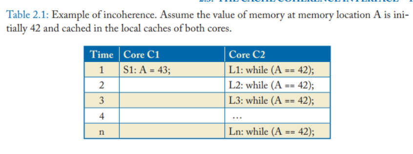
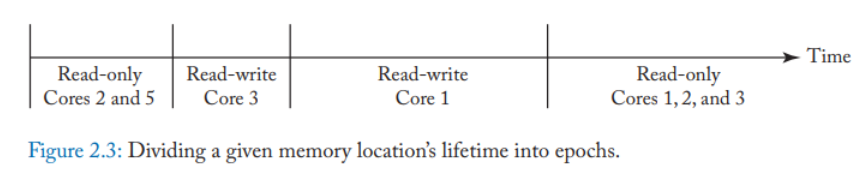
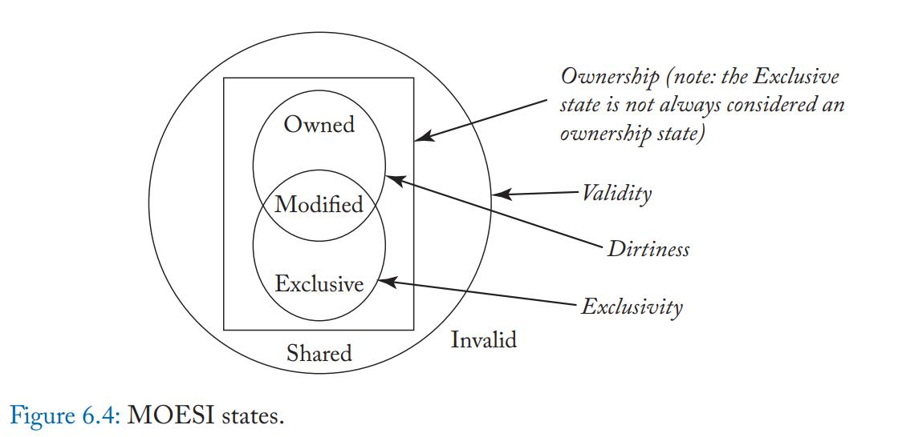
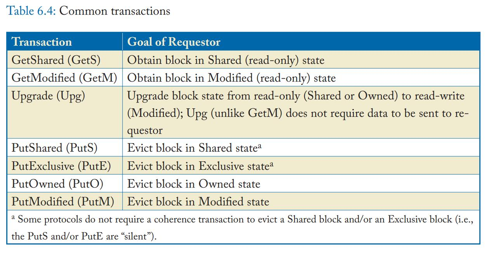
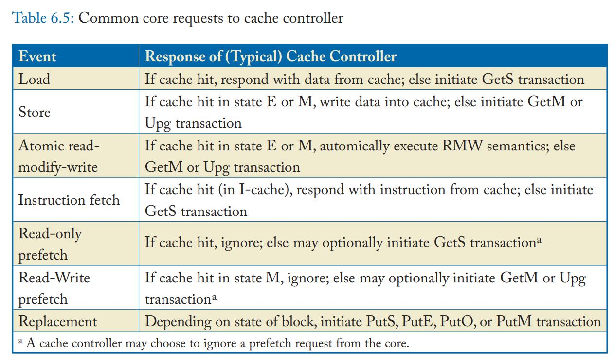

# 尝试翻译内存模型和缓存一致性

建议读者在阅读前搞明白缓存和计算机的一些基础知识，诸如缓存是怎么设计，缓存为何使用物理内存做标记，CPU的乱序指令，在指令队列和结果队列上是如何进行的。建议阅读《现代体系结构上的unix系统》和wiki百科。对内容有疑问建议直接stackoverflow或者看英文，对内容有异议可以直接回复我或者在github上发patch。

## 第一章:内存一致性和缓存一致性引论
许多操作系统和大部分多和芯片(多核处理器)支持共享物理内存。在一个共享物理内存的系统中，每个核都可能读写同一个地址。这种设计的目标是追求良好的功效：比方说高性能，低能耗，低消耗()

## 第二章：缓存一致性基础
本章我们会充分介绍缓存一致性来帮助理解强定序模型（也可被译为一致性内存模型，SC）如何和缓存交互。从2.1节开始我们会展示本书一直涉及到的强定序模型。为了简化本章节和其他章节的理论复杂性，我们选择最简单的系统模型来展示需要关注的重要事项；到第九章我们才会涉及到更复杂的系统模型。2.2讲述有哪些必须解决的缓存一致性问题及为什么会有缓存不一致问题出现。2.3节给出了缓存一致性概念具体的定义。（这里多赘述一点，X86硬件实现缓存一致性，而ARM并非如此！需要软件实现）

### 2.1 基线系统模型(BASELINE SYSTEM MODEL)

本书里，我们将系统视为一个拥有多个处理器，共享同一个物理内存，所有的处理器都可以对所有的物理地址进行载入和存储操作的模型。该基线系统包含一个单独的多核芯片和芯片外的物理内存，就如同图2.1展示的那样。多核芯片包含多个单线程的处理器，每个处理都有自己的私有数据缓存。每个核共享一个最低层级缓存（last-level cache (LLC)  ）。当我们谈到“缓存”这个词，我们指的是每个核上的私有数据缓存而不是最低层级缓存。每个核的私有数据成员通过物理地址生成索引和标记，采取写回策略(注，不明白什么是写回策略的可以看《现代体系结构上的unix系统》)。处理器们和最低层级缓存使用交互网络（interconnection network）通信。尽管最低层级缓存也在处理器芯片上，但从逻辑角度来看，是个“内存部分缓存”(memory-side cache)，因此并不会导致任何缓存一致性问题。从逻辑层面来看，最低层级缓存直接和内存交互，提供降低内存访问延迟和增加内存访问带宽的功能。它同样充当（多处理器芯片的）片上内存控制器角色。

我们的基线系统模型忽略了很多和本书内容无关，但是很常见的设计。这些设计包括指令缓存，多级缓存，多处理器共享一级缓存，虚拟地址缓存，TLB，DMA。同时，我们忽略包含多个多核芯片的系统。这些会添加不必要复杂度的话题，以后再说。

- 

### 2.2 关键问题：缓存不一致到底是怎样发生的？

缓存不一致之所以会出现是因为一个很基本的问题：多个角色可以并行地访问内存和缓存的入口。现代操作系统里，这些角色包括处理器，DMA控制器，和一些其他的可读写缓存和内存的外部设备。在本书里，我们将目光投射于处理器，但这并不意味可以无视处理器以外的角色。

表2.1展示了一个缓存不一致的例子，一开始内存地址A和两个处理器的本地缓存都存储值42。在时刻1，处理器1改变了其缓存和内存地址A储存的值，从42变到43。这使得处理器2缓存里的值过时。处理器2在执行一个while循环的载入，重复地从它自己的本地缓存中载入已经过时的A的值42。很明显，这个缓存不一致的例子，是由于处理器1对A的储存行为，对处理器2是不可见，而导致的。

为了避免这种缓存不一致问题，系统必须实现缓存一致性协议（cache coherence protocol ）才能保证处理器1的结果对处理器2是可见的。设计和实现缓存一致性协议是第六章-第九章的主要话题。

### 2.3 缓存一致性协议接口

通俗的说，缓存一致性协议必须保证写操作对所有的处理器可见。本节，我们会正式地从缓存一致性接口中抽象出缓存一致性协议。

处理器通过缓存一致性协议提供的两个接口来进行交互：(1)读请求(read-request)，该请求将内存地址作为参数，该请求的结果是向处理器返回一个值。(2)写请求(write-request)将内存地址作为参数1，将要写入的值作为参数2，该请求的结果是向处理器返回一个确认值。

无论是学术还是工业界，目前已经由许多缓存一致性协议出现，我们会根据这些缓存一致性协议提供的接口进行区分，具体来说就是通过缓存一致性是否和内存一致性密不可分来区分。

+ 一致性不可区分协议  这种协议，执行写请求时，即使没有返回确认，写入的结果立刻对其他核可见。因为写操作是同步传播的，第一种缓存一致性协议就如同工作在一个原子操作内存系统上(缓存仿佛不存在一样)。任何和这种缓存一致性协议交互的子系统-比方说处理器管线-可以认为它正在和一个没有缓存的原子操作内存系统交互。从追求实现代码顺序一致性的角度来看，这种协议免去了程序员对多核系统中变量值不同的担忧。这种缓存一致性协议将缓存透明化，仿佛移除了缓存的存在，只有原子操作内存系统。这种协议的实现，将问题丢给了处理器管线（硬件）解决。
+ 一致性可区分协议 这种协议的写结果是异步传播的，因此写操作的确认可能在其他核可见之前就返回给当前核，从而可以在其他核上观测到过期的变量。然而，为了不违背内存一致性的要求，这种类型的缓存一致性协议必须保证写入的值所显示的顺序，和写入操作写入的顺序是一致的（我理解为，如果写入操作的顺序是a,b,c,d,e，那么其他核看到的顺序也得是a,b,c,d,e。不能出现a,d,c,b,e这种混乱的顺序）。图2.2中，处理器管线和缓存一致性协议一起努力实现内存一致性。第二种类型的缓存一致性多见于GPU。

本书主要关注第一种缓存一致性协议，第二种类型的协议到第十章才会讨论。

### 2.4 缓存不变式

究竟缓存一致性协议应当满足什么不变式，才能使得缓存透明化，将物理内存和缓存系统抽象成一个原子内存系统呢？目前无论是工业界还是学术界，已经有多种缓存一致性的定义，我们可不想把他们都列出来。作为替代，我们会给出一种体现缓存一致性本质的定义。在侧边栏里，我们会讨论其他定义，展示他们和我们的定义有什么关系。

我们将缓存一致性协议定义为满足单写多读不变式（SWMR(single-writer–multiple-reader  )）的协议。任何一个时刻，对于特定的内存地址，在任何一个时刻，如果该地址的内容只被一个核修改，不存在其他核也在同时进行读或写操作，或者（这个或者对应于那个“如果该地址”）此时没有任何一个核进行写操作，多个核在对这块地址进行读操作。换另一种说法，对任何内存块而言，该块的生命周期被分为多个周期。每个周期里，该内存块只会处于两种状况：一种状况是只有一个核拥有读+写权限，另一种状况是有多个核(也可能一个都没有)拥有只读权限。图2.3展示了将内存块生命周期拆分开的例子。

除了SWMR不变式，缓存一致性协议同样要求操作内存块值的行为可以被正确的传播（）。设想图2.3中的例子，即使满足了SWMR不变式，如果第一个只读周期，核2和核5读到了不同的值，那么系统就不满足协议一致性了。相似地，如果核1没能成功读取核3在读+写周期写入的值，或者核1，核2，核3没能读取到核1存储的值，协议一致性再次被打破。

因此，必须满足SWMR不变式和数据值操作正确(Data-Value Invariant  )不变式才能满足缓存一致性协议，数据值操作正确不变式保证了处理器在读周期，能正确读到该内存块处于读+写周期时最后写入的值。

其他的缓存一致性协议不变式的定义和我们的大同小异。（下面的翻译是我胡编的）虎符协议，只有拿到所有的虎符才能执行调兵操作（写操作），否则只能执行报数操作（读操作）。在任意时刻，只可能有一个调兵操作（写操作）或者多个报数操作（读操作）。

#### 2.4.1 实现缓存不变式

上一节提到的几个不变式暗示了缓存一致性协议如何工作。大部分缓存一致性协议，被称为“无效化协议”，就满足这些不变式。如果一个核想读取一块内存，就向其他核发送消息请求获取该内存块的值并确保不会有其他核已经缓存了这个内存块的值，且（其他核）处于读+写状态。该消息会终止任何当前活跃的读+写状态，并开始一个只读周期。如何该核相对某个内存块写，它会对其他核发送请求获取该内存块的值，并确定其它核没有缓存该内存块，无论他们是出于只读还是读+写状态。该请求会终止任何活跃的读+写或只读的周期，并开始一个新的读+写周期。后续的章节(6-9章)拓展了这种协议的抽象模型，但实现一致性基本的理念不变。

#### 2.4.2 缓存的粒度

一个核可以以多种粒度执行载入和储存操作，粒度一般从1-64字节浮动。理论上来说，缓存一致性可以以任意粒度执行。然后现实环境里缓存一致性的粒度经常和缓存块大小保持一致---真实硬件以缓存块长度实现缓存一致性。对真实硬件而言，基本不可能出现一个核修改缓存块的第一个字节，其他核修改该缓存块的其他字节(对缓存的修改通常都是整行的，从实现角度和理论角度，效率更好实现简单)。尽管以缓存块长度为缓存一致性实行的粒度更为普遍，我们需要认识到缓存一致性协议可以以其他粒度实现。

#### 2.4.3 缓存一致性何时重要

无论我们选择如何定义缓存一致性，缓存一致性只在特定情况下至关重要。架构设计者必须清楚缓存一致性是否生效。我们指出两条缓存一致性的准则(我理解为缓存一致性提供的保证)。

+ 缓存一致性对任何层级的缓存和共享物理内存都适用。这些结构包括L1数据缓存，L2级别缓存，共享的LLC，和主存。此外诸如L1指令缓存和TLB同样适用。(这句话需要注意，这些结构并不包含per core write buffer，也就是每个核的写缓存器。写缓冲器和L1/L2/LLC cache并不是一个东西，如果这个不清楚，看TSO和PSO的时候会产生很多疑问)
+ 缓存一致性对程序员是透明的。处理器管线(pipeline)和一致性模型一同努力提供强定序的内存模型，程序员只能注意到强定序的内存模型。

## 第三章 顺序一致性

本章研究内存顺序一致性模型，该模型给程序员和实现者定义了共享物理内存的系统在程序执行时，应当提供什么样子的时序：程序员知道系统可以提供什么样子的时序，实现者知道系统应当提供什么样子的时序。我们现在3.1节给出为什么要定义内存行为，3.2节给出内存一致性模型应该做些什么，3.3节对比内存一致性和缓存一致性。

我们之后研究最直观的一致性模型强定序，或者说顺序一致性模型。强定序之所以重要，一方面是因为该模型是很多程序员期待的共享物理内存提供的模型，另一方面是因为它是理解下两章弱内存序模型(宽松内存序模型)的基础。我们现在3.4节给出强定序的基本理念，然后给出形式化定义(3.5节)。3.6节讨论强定序的实现，3.7节讲解基于缓存一致性的强定序，3.8节讲解更激进的优化，3.9节讲解强定序下原子指令的实现。3.10和3.11节我们研究MIPS R10000的现实例子，并给出一些参考资料。

### 3.1 共享物理内存时的行为问题

为了理解为什么需要定义共享物理内存时，操作内存的行为为什么必须被定义，看表3.1中双核处理器的例子(这个例子，和本章所有其他例子一致，都认为变量的初始值为0)：大部分程序员会期待核C2的寄存器r2会获得值NEW。然而，一部分现代计算机系统上，r2的值可以为0。

硬件如果重排核C1的两条存储指令S1和S2，就会导致r2获得0值。如果我们只看核C1的执行，不关心和其他线程的交互，那么重排S1和S2似乎没有什么问题，因为两者访问的是不同的地址。18页的侧边栏描述了硬件可能以怎样的方式重排指令，储存操作自然也在这些指令中。

伴随着S1和S2的重排，指令执行的顺序可能为S2，L1，L2，S1--如同表格3.2所示。

这种指令执行的顺序满足缓存一致性，它并没有违背SWMR不变式。换言之，违背缓存一致性并不是导致这个显而易见错误的原因。让我们考虑用于提供互斥(mutual exclusion，详情参加《多处理器编程的艺术》修订版)Dekker算法提供的例子，该例子如同表3.3所示。在指令执行之后，r1和r2中的值可能是多少？下意识地，读者可能认为会是下面三种值：

+ (r1, r2) = (0, NEW) 执行顺序为 S1, L1, S2, then L2  
+ (r1, r2) = (NEW, 0) 执行顺序为 S2, L2, S1, and L1  
+ (r1, r2) = (NEW, NEW), 执行顺序为 S1, S2, L1, and L2  

令人惊讶的是在大部分机器上，比方说intel和AMD提供的X86系统上，由于FIFO写缓冲器的存在(这部分请看后面的章节，现在不明白无所谓)，(r1,
r2) = (0, 0)  的情况同样可能出现。

一些读者难以对这个例子表示认同，他们认为如果这个例子是正确的，那么程序执行的结果岂不是不固定了？这对于编程者来说也不是一个明确的编程模型。然而，现代多处理器体系结构的执行流本身就是不确定的，所有我们知道的体系结构又允许指令并行执行（流水线执行）。执行结果是否确定是由线程之间明确的进行同步操作来保证的，因此当定义什么是共享物理内存的多处理器机器正确的内存模型时，我们必须认可执行结果可能有多种正确的答案。

### 3.2什么是内存一致性模型

内存一致性模型，或者说内存模型是一种技术规范，该技术规范指明了多线程程序操作共享的物理内存时的合法行为。对多线程程序而言，它指明了该执行过存储操作的多线程程序，动态的载入会返回什么样的值。和单线程程序执行不同，有多种正确的行为。

通俗的说，内存一致性模型MC(memory consistency)将指令操作分为遵守MC和不遵守MC两种。这种划分从指令执行角度划分，相对应的也可以从实现角度划分。一个MC实现系统指的是该系统只允许遵守MC的指令，一个非MC实现系统值得是该系统有时允许非MC指令的执行。

从一开始，我们一直假设程序执行硬件指令集中的指令，此外我们假设内存通过物理内存进行访问(也就是说，我们不关系虚拟内存和地址翻译的影响)。第五章我们会讨论高层次语言(high-level languages (HLLs)  )，我们将会发现编译器如果在编译分配变量的指令时，把寄存器指定为该变量，会导致该高层语言内存模型类似的行为类似硬件重拍内存访问顺序(翻译存疑)

### 3.3 内存一致性VS缓存一致性

### 3.4 内存一致性的基本想法

单核时序 “单纯看指令执行的结果，就好像指令按照程序执行的顺序执行”，然后他定义了多核顺序一致性“指令执行的结果，看起来就好像多核按照某种时序执行，同时每个核指令执行的顺序同程序指定的顺序一致”。这种所有指令执行的顺序被称为内存时序(memory order)。在内存一致性模型中，内存一致性模型中，内存时序不违反任何一个核上执行的程序顺序，但其他一致性模型可能并不总会保证内存时序和程序顺序一致。

图3.2展示了表3.1中示例程序如何执行

内存一致性模型下，内存时序不违背任何一个核上程序执行的顺序，因此op1 
 多任务并行单核处理器

> The Switch
>
> 多核，单switch，如图3.4，同一时间只有一个核可以对switch执行其指令序，只要不影响switch执行内存操作的顺序，每个核可以执行任意的指令优化。比方说五步的流水线指令执行和指令预测功能。

评估

这些实现的优点在于他们实现了一种能同时提供（1）指令级别SC（2）实现级别SC的标准。switch体系同样证明了SC可以独立于缓存或者缓存一致性。缺点在于，这些实现的性能并不同增长的核数成正比：第一种实现中单核存在性能瓶颈，第二种实现中switch和内存存在性能瓶颈。这些瓶颈导致部分人错误地认为SC不可能有真正执行的并行指令。我们接下来会看到事实并非如此。

### 3.7 一个兼容缓存一致性的简单SC实现

### 3.8使用缓存一致性优化SC实现

> 不绑定预取

> 预测处理器
>
> 设想一个以指令序执行的处理器，该处理器同样进行指令预测，这些指令包含储存和载入执行，如果发生了指令错误预测这些指令也可能被无效化。这些无效的储存和载入看起来和预取比较类似，同样都对SC不会造成错误的影响。一个发生在分支预测之后的载入L1 CACHE，无论预测错误还是成功()都会向寄存器返回一个值。如果载入操作被无效化，处理器丢弃寄存器的更新，抹除任何载入引发的副作用，就好像没有执行载入操作一样。缓存则不需要撤销这次预取，一方面不必要，另一方面提前载入数据可以在再次请求这块地址时提高性能。执行储存时，处理器可能执行GetM请求，但在确定执行储存之前不会将缓存里的结果更新。

提问：一个实现SC的系统，处理器发布缓存一致性的请求时，这些请求必然符合指令序吗？答案：错，CPU可以以任意顺序发布缓存请求。

> 指令乱序处理器
>
> 说起来这个解释起来并不简单，建议直接看原版论文https://courses.engr.illinois.edu/cs533/sp2019/reading_list/gharachorloo91two.pdf
>
> 每个Load指令都是从memory到L1 cache
>
> Gharachorloo et al提供了两种保障多核下SC的检查。1如果处理器先执行了L2，在它提交L2的请求，并真正使用L2载入的数据之前之前，检查L2的缓存是否依然存在。只要缓存还在，那么L2的值不可能在执行载入和提交之前发生改变(因为SWMR，但我没理解。既然是载入，那么怎么会有提交呢，唯一可能的即使就是提交到Cache)。为执行此检查，处理器跟踪L2的地址并检查该物理地址关联的内存块和缓存一致性请求。一个GetM请求暗示另一个核注意到L2失序，该请求说明预测失败，需要抹消该无效预测（如果没明白为什么一个GetM会导致请求失效，建议看看SC的第二个要求，即Load要返回它之前最近的Store操作。举个例子）。
>
> 另一种方法是通过重放，如果先执行L2，在L1执行完毕之后L2的值和缓存里的值保持一致，那就说明改变顺序是没有影响的，因为值是一样的。
>
> 这两种做法从本质来说就是提前执行某个load，只要结果是不干扰执行的

> 指令乱序处理器的预取

> 多线程

### 3.9 SC模型的原子操作

编写多线程代码时，程序员应该能够同步多线程的读写(同步的意思是指使线程操作操作在时间上出现一致性和统一化的现象，对程序员而言，并不是指同时发生，而是有先后顺序的发生)，这些同步性常常需要进行一对操作。这种操作通过提供原子级别的读改写指令实现。读改写RMW(read-modify-write)对正确实现同步机制，自旋锁与其他同步优先级至关重要。

更激进的RMWs实现利用SC只需要将请求保持特定顺序(不是很通畅)，一个核将其缓存中特定的block置为状态M，即可执行读改写操作。直到任何其他一致性缓存消息对该block生成。

## 第四章

### 4.1 TSO/X86设计的缘由

处理器很早就支持利用写缓冲器(write (store) buffers  )去延时(hold)已经提交(commited/retired)，但还没进入缓存(cache)的储存操作。当提交储存操作时，载入操作进入写缓冲器。直到该内存块的内容以获得读+写的周期写入缓存时，才会将该储存操作从写缓冲器中取出。很显然，储存操作进入写缓冲器可以发生在获取对该内存块的读+写周期，写缓冲器因此降低了一次储存失败延迟。由于储存操作是如此常见，延迟写入看起来很有益，最妙的是，储存操作尝试跟新内存的操作不会干扰处理器状态，不会使得处理器停止继续执行指令。

对

#### 4.4.1 实现原子指令

在TSO体系中实现原子级别读改写指令和强定序体系中实现原子级别读改写指令的操作基本一致。关键的不同只在于TSO体系下允许载入操作从时间序看来比指令序在它之前的储存操作先执行。对读改写指令造成的影响就是储存操作可能被写到写缓存器中。

为了更好的理解TSO体系中的读改写指令，我们将读改写指令视为一对紧密结合的载入操作和储存操作。

读改写指令的读指令部分不能比指令序在它之前的读指令先执行，这没有什么难以理解。但读者可能在为深入思考的情况下，认为读改写指令里的读指令会比已存在于写缓存器里的写指令更早执行，真实情况并非如此。如果读改写的读指令部分时序上早于写缓存器里的指令，那么紧随读指令部分执行的写指令部分会比写缓冲器中的写指令更早执行，这违背了TSO体系上STORE-STORE指令的执行序。因此读改写指令的读部分不能早于一个指令序上早于它的储存指令。

这些时序的要求限制了读改写指令的实现，由于读改写的读指令部分必须晚于写缓冲器里的写指令，因此原子级别读改写指令会在执行读指令部分之前将写缓存器清空（使内部的写指令执行完）。为了能够是的写操作部分紧跟读指令部分，该读指令会尝试获取读+写的缓存权限，普通的读指令往往只需要读权限。最后为了保证读改写指令的原子性，缓存控制器可能不会

## 第五章 弱内存序

上两章我们探索了强定序(SC)和完全存储定序(TSO)。

本章我们探寻一种时序限制更弱的内存一致性模型，这种模型只保留程序员“需求”的指令序。这样子的好处blablabla

完全探索这种模型超出本章的内容，本章只是一个提供一种基本的指引，帮助读者理解这种体系的限制。为此，我们以XC(5.2)为例，讨论XC的种种实现。这些实现包括原子指令。

### 5.1 动机

理解弱一致性内存模型可比理解强定序和完全存储定序困难多了。既然有如此多的不便，干嘛折腾弱一致性内存模型？本节我们首先展示一些指令序并不是那么至关重要的例子，然后讨论下指令序不重要时一部分优化操作。

#### 5.1.2 利用重排序的机会

假设一个弱内存一致性模型可能重拍所有没有内存栅栏分割的指令，因此程序员必须清楚哪些指令必须被固定顺序。对程序员而言，这是个缺点，但对计算机而言这可能更便于优化。下面我们讨论一些普遍而且重要的优化，更深入的话题就不在本书中讨论了。

##### 5.1.2.1 非先进先出，合并式写缓冲器

上一章中完全存储定序使用写缓冲器来降低写操作的延迟。相比于使用先进先出写缓冲器的完全存储定序，弱内存一致性模型采用了优化性更彻底的可合并非先进先出写缓冲器（即两个指令序不相邻的写操作可以合并到一起添加到到写缓冲器中）。这种可合并非先进先出的写缓冲器和完全存储定序体系中要求必须先进先出的存储相违背。我们提供的弱内存序体系中只要两条写指令不被栅栏分割，那就可以合并添加到可合并非先进先出写缓冲器里。

##### 5.1.2.2 简单的指令预测

强定序和完全存储定序模型里，处理器可以预测接下来要执行的指令，从而能够提前执行某些指令。从表现结果来看，类似乱序执行接下来的指令，当然执行这些指令的结果在确定这些指令应当执行之前并不会提交。这种预测和检测机制增加了硬件的性能消耗和复杂度。除了多消耗了计算资源，这种机制意味着指令级别的并行被某些有限状态资源所限制。弱内存序体系中，处理器可以无视指令序和缓存一致性请求（其他核发出来的）请求执行载入命令。在弱内存序里，这些载入操作是否执行是不可预测的(尽管它们可能通过分支预测)   这段话实际上有个问题，就是在问，弱内存序里，在某些指令不被确定是否执行前，载入操作的结果会不会提前commit?这里需要区分内存序指令序。建议阅读https://stackoverflow.com/questions/52215031/how-is-load-store-reordering-possible-with-in-order-commit和https://stackoverflow.com/questions/39670026/out-of-order-instruction-execution-is-commit-order-preserved。除此之外，典型的弱内存序ARM里面指令交互相关建议看这个网页https://azeria-labs.com/memory-instructions-load-and-store-part-4/。这里我建议想一想这一点，无论哪种内存序，只保证线程执行的结果和单线程执行的结果保持一致，这里单线程和结果是重点。

### 5.2 一个弱内存序例子

#### 5.2.1 XC模型的基本理念

XC的内存序会保证一下指令序不会被重拍：

+ 载入 => 屏障
+ 储存 => 屏障
+ 屏障 => 屏障
+ 屏障 => 载入
+ 屏障 => 储存

此外，XC对于两条相同指令的操作不会重排，这和完全存储定序保持了一致：

+ 载入 => 载入 (对相同地址)
+ 载入 => 储存 (对相同地址)
+ 储存 => 储存 (对相同地址)

XC同样保证，同一线程里，对某地址内存块执行载入操作，会获取该线程载入操作之前的对相同地址的储存指令的结果。因此上面应该可以加上一条 储存 => 载入 （相同地址），但因为这种操作因为正式来说属于分流(bypass)，所以没写到上面。

#### 5.2.2 在XC模型下使用栅栏的例子

屏障F1保证了指令的时序，看起来很有用。但一部分读者诧异于屏障F2的作用。

### 5.3 实现XC模型

本章节讨论实现XC。我们会沿用前两章实现强定序和完全存储定序的方法-将指令重拍和缓存一致性协议拆开，来设计实现XC模型。在完全存储定序中，每个核和缓存系统之间都添加了一个先入先出写缓冲器。对于XC模型而言，每个核和缓存系统之间都会添加一个重排单元，该重排单元会将储存和载入操作重排。

如同图5.3a描述的那样，XC运行符合：

+ 载入，储存，屏障按照程序指令序<p离开每个核Ci，并进入每个核Ci的重排单元的尾部。
+ 每个核的重排单元会处理并将操作从队尾挪到队头，处理操作的顺序要么按照程序指令序，或者根据下面的几条规定将指令重排。一个屏障在到达重排单元的头部被丢弃。
+ 当switch选择执行核Ci的操作时，它会执行核C重排单元队头的操作。

重排单元重排操作时，遵循三种规则：

+ 屏障---屏障可以通过多种方式实现，但是他们必须正确实现操作排序。尤其是在操作的目标地址不同时，重排单元不能执行重排操作，保证原本的顺序，这些顺序包括：载入 => 屏障，储存 => 屏障，屏障 => 屏障，屏障 => 载入，屏障 => 储存
+ 对相同地址的操作：对相同的地址的操作不允许被重排，这些操作包括：载入 => 载入 (对相同地址)，载入 => 储存 (对相同地址)，储存 => 储存 (对相同地址)
+ 分流：必须保证对相同地址的load能看到之前store的结果。

上面的规定并不奇怪，它们只是5.2.3节的规则换了一种表述。

上两章，无论是强定序还是完全存储定序，我们都使用缓存一致性内存体系替代了switch和内存体系。正如图5.3b所示，这对于XC同样适用。缓存一致性协议实现了全局的内存序，但和原先不同的是，全局的内存序可能会由于重排单元的存在而和指令序大为不同。

那么从完全存储定序提升到XC模型，性能提高了多少呢？很不幸，这个答案和5.1.2节讨论的内容相关，诸如先进先出写缓冲器和可合并非先进先出写缓冲区性能比较？分支预测支持几何？

#### 5.3.1 在XC模型中实现原子指令

在支持XC模型的系统中实现原子级别读改写有很多方法。实现原子级别读改写的方法同样依赖于系统是如何实现XC模型的。本节中，我们假设XC系统包含多个指令乱序处理器，每个指令乱序处理器通过一个可合并非先入先出写缓冲器和内存相连。

另一种实现原子级别读改写并不在本书讨论的范围里，表格5.6中，我们展示了一种典型的临界区操作，自然也包括锁争用和锁释放。对完全存储定序，原子级别读写操作用来获取锁，储存操作用来释放锁。对XC模型，情况变的更为复杂，XC模型并不强制要求原子级别读改写晚于临界区代码执行，因此必须在获取锁的代码之后加个屏障，锁释放同样要在之前加一个屏障，避免锁释放的操作和临界区操作被重排。简而言之，锁的使用必须通过屏障保护。

#### 5.3.2 在XC模型中实现屏障

不同体系里屏障的实现方法有三种：

+ 对强定序而言，所有的屏障都可被视为空转(no-ops)。
+ 另一种实现方式是将Xi所有的内存操作执行完毕后，认为屏障已经起作用了，然后再开始执行Yi的操作。这种方式，通俗形容起来和“将缓冲器排空，再写入操作”一样，是一种非常常见但耗费昂贵的实现方式。
+ 另一种实现方式无需“将缓冲器排空”，只保证必须执行的一致性操作执行完毕。这种方式并不在本书设计的范围里。尽管这种方式设计实现起来比较困难，但比“将缓冲器排空”带来更好的性能。

无论上面哪种情况，屏障必须能够清楚何时Xi执行完毕，对于一个常常分流缓存一致性的储存操作而言，知道何时执行完毕的方法可能十分巧妙。

#### 5.3.3 警告

一个XC模型的实现者可能会认为：我在实现一个弱内存序模型，所以最终的时序了无限制。事实并非如此，XC的很多规范必须被遵守，

### 5.4 实现无竞争的一致性程序

to have their cake and eat it too.   想要鱼和熊掌兼得。

You can't have your cake and eat it (too) 鱼和熊掌不可兼得

幸运的是，对数据无竞争(data-race-free（DRF）)程序而言，实现这两个目标是可能的。通俗的来说，当两个线程同时访问同一块内存地址，其中一个线程在写数据，两个线程没有任何同步关系就会导致同步问题的出现。强定序下，数据无竞争程序的开发者只需要正确的标识同步操作就可以开发此类程序，在XC模型下，数据无竞争程序的开发者需要使用原子级别读改写和屏障来实现同步标签的同步工作。这种方法是诸如JAVA和C++的高级语言同步原语的基石。

让我们来看看表5.6和表5.8提供

从这两个例子中可以看出，“顺序一致性的数据无竞争”(DRF)概念包含以下含义：

+ 存在数据竞争的指令执行揭示了XC模型下的储存载入重排序，或者

如果想对“顺序一致性的数据无竞争(SC for DRF)”有一个更具体的理解，需要对以下概念有认识：

+ 一些内存操作被标记为“同步”（“同步操作”），其余默认被标记为“数据”（“数据操作”）。“同步”（同步操作）包含锁的获取和释放
+ 两个不同核上对同一块内存的数据操作Di和Dj，只要其中有一个是储存，我们就称这两个操作“违背”。
+ 两个不同核上对同一块内存（比方说锁）的同步操作Si和Sj，只要其中一个操作是写操作就称这两个操作“违背”（对于自旋锁的获取和释放都是违背，而两个对读写锁的读锁并不违背）
+ 两个同步操作Si和Sj，只要两个操作直接“违背”或者Si和Sk“违背”，而Sk和Sj在同一个核上执行，且Sk的指令序早于Sj，我们就说这两个操作“及物违背”。
+ 两个数据操作Di和Dj如果“违背”，且在全局的时序上没有一对及物违背的同步操作Si和Sj发生在两者之间，那么Di和Dj就发生了“竞争”。换句话说，一对违背的数据操作Di <m Dj并不会发生数据竞争，只要有一对及物违背的同步操作Si和Sj，满足Di <m Si <m Sj <m Dj。上面的两种说法，Di和Si在同一个核(线程)上，Dj和Sj在同一个核（线程）上。
+ 一段满足顺序一致性的流程，只要不发生数据竞争，我们就称该流程满足“顺序一致性的数据无竞争”。
+ 如果一个程序所有的流程都没发生争用，那么我们就称该程序是“顺序一致性的数据无竞争”的。

对XC模型而言，程序员或底层开发者需要使用屏障来确保同步操作执行顺序是正确的。

### 5.5 一些弱内存序的术语

#### 5.5.1 释放一致性

#### 5.5.2 可视性和写原子性

可视性意味着“如果我看待某事发生，且告知了你，那么你也会看到”

写原子性（也被称为储存原子性，多拷贝原子性）意味着“如果一个核执行了储存操作，那么所有其他核都能立刻看到”。XC模型的缓存一致性内存模型保证了其是符合写原子性的。写入之前，没有任何一个核可以看到新储存的值，写入之后，其他核只能看到两种情况：要么这次存储的新值，要么这之后存贮的值里的一种，而不能看到被这次存储覆盖的过去的值(这里面有两个含义：1写入以后，其他核只能看到新值，或者更新的值2写入成功之前，只有执行写入的核看到这个值，其他核看到的值都早于这个写入的值)。写原子性使得处理器可以比其他核更早的看到他自己存储的值，因此，有人认为这个名字的xxx

+ 写原子性存在意味着必然存在可视性，举个例子表格5.9里，核C2注意到S1，执行一个屏障，然后执行S2。因为满足写原子性，因此C3必然能看到S1
+ 可视性存在并不能说明写原子性存在，举个例子表格5.10里，假设核C1和C3共享一个写缓冲区，而C2和C4共享一个写缓冲区。当C1把S1放入C1和C3的写缓冲器里，很明显只有C1自己和C3的L1可以看到。相似的，当C2把S2放入C2和C4的写缓冲器里，很明显只有C2自己和C4的L3可以看到。只要C3的L2和C4的L4在写缓冲器把两个储存操作写入缓存一致性内存之前，那么写原子性必然得不到满足。

总之，我们的XC模型提供了写原子性和可视性。由于写原子性暗示了可视性，所以我们以前只提及写原子性。建议继续阅读https://azeria-labs.com/memory-instructions-load-and-store-part-4/

## 第六章 缓存一致性协议

### 6.1 全局视角看缓存一致性

一致性协议的目的是通过满足2.3节的两个不变式来提供缓存一致性。

+ SWMR不变式
+ 数值正确不变式

为实现这些不变式，我们将每个存储设备-每个缓存和LLC/物理内存-和一个有限状态自动机联系起来，并将结合了自动机的存储设备称为“一致性控制器(coherence controller  )”。这些一致性控制器通过确保交换信息时满足SWMR和数据正确不变式的有效性，构建了一个分布式的系统。缓存协议规定了这些一致性控制器的互动通过制定。

不同的一致性控制器有不同的职责。缓存部分的一致性控制器，我们称之缓存控制器，如图6.1一样工作。缓存控制器提供服务时必须满足两个方面的资源：在“处理器角度”，缓存控制器提供接口实现储存和载入功能，并返回对应的值。一次缓存缺失会导致缓存控制器发起一致性事务，这里是发起一个一致性请求请求获得处理器需求的内存块。缓存一致性请求在交互网络上传递。一致性事务包含一致性请求和其他的交换信息(比方说从其他缓存控制器返回的数据回复信息)，其他信息往往是为了满足一致性请求而产生。一致性事务和消息的种类和具体一致性协议密不可分。

### 6.2 描述缓存一致性协议

### 6.3 缓存一致性协议的例子

### 6.4 总览缓存一致性设计

#### 6.4.1 状态

系统如果只有一个角色，每个缓存的状态可以用有效/无效区分。有效的内存块又可以被划分成“脏”块--该块的数据和其他的块拷贝相比，最后被处理器修改。举个例子，一个L1缓存采用写回策略的二级缓存，L1缓存中的数据可能是脏的，从而使得L2缓存的数据过时。

一个有多个角色的系统可以使用这几种简单的状态，但我们常常想讲有效状态区分开。我们希望能够从四个角度将内存块的状态区分开：有效性，脏性质，独占性，和拥有性。后两者是SMP系统所独有的：

+ 有效性，一个有效的数据块，其内容（数据）必然是最新的。该数据块可读，但如果想可写需要再获得独占性。
+ 脏性质，如同单核处理器一样，如果缓存的数据是更新过的，而LLC/物理内存的数据是陈旧的，缓存控制器因此有必要将此数据最终写回到LLC/物理内存里。脏性质的反义词是“干净”
+ 独占性，如果该缓存里的内存块，是系统上唯一被缓存的拷贝(这句话暗指的意思是LLC中可能有该数据块)
+ 拥有性，如果某缓存控制器负责应答该对内存块的缓存请求，我们就将该缓存控制器称为该内存块的拥有者。大部分协议中，每个数据块在某段时间都是有其拥有者的。一个内存块不会在其控制权被拥有者转让出去之前，因为容量不足和缓存行冲突，就把数据从缓存写回到内存里。

本节，我们先讨论常用的状态，

许多缓存一致性协议使用Sweazey and Smith  第一次引入的五种经典状态MOESI 里的子集作为其状态。三个基础状态为MSI，O和E不属于基础状态，但也很常用。每个状态的特性并不相同，感觉需要英文做精确表述。

+ M(odified): The block is valid, exclusive, owned, and potentially dirty. The block may be read or written. The cache has the only valid copy of the block, the cache must respond to requests for the block, and the copy of the block at the LLC/memory is potentially stale.  M代表着数据是有效，独占，被当前缓存控制器拥有，有可能已经被修改了。
+ S(hared): The block is valid but not exclusive, not dirty, and not owned. The cache has a read-only copy of the block. Other caches may have valid, read-only copies of the block.  S代表数据不被独占，不被缓存控制器拥有，不脏。
+ I(nvalid): The block is invalid. The cache either does not contain the block or it contains a potentially stale copy that it may not read or write. In this primer, we do not distinguish between these two situations, although sometimes the former situation may be denoted as the “Not Present” state.  I代表无效，这个很好理解，没有或者说数据老旧。
+ O(wned): The block is valid, owned, and potentially dirty, but not exclusive. The cache has a read-only copy of the block and must respond to requests for the block. Other caches may have a read-only copy of the block, but they are not owners. The copy of the block in the LLC/memory is potentially stale.  O状态是有效，被当前缓存控制器拥有，可能是脏的，但不是独占的。当前缓存控制器有用一份内存块的只读拷贝(这个状态的目的是啥呢？我理解是延缓写入内存，但是同样保持有效性，这个是比X86_MESI（见下）能够更晚写回内存的，由于S共享只读，但是不脏，因此如果要释放M状态的值需要写回内存，而O共享只读，可能脏，能够不写会内存，是M的一个简单退化，减少了性能的差异？)
+ E(xclusive): The block is valid, exclusive, and clean. The cache has a read-only copy of the block. No other caches have a valid copy of the block, and the copy of the block in the LLC/memory is up-to-date. In this primer, we consider the block to be owned when it is in the Exclusive state, although there are protocols in which the Exclusive state is not treated as an ownership state. E状态是有效，独占，而且干净。当前缓存是只有内存块的只读拷贝，其他缓存块则没有改块的只读拷贝，LLC/物理内存的数据和缓存控制器里的块是一致的。

使用文氏图来表达其关系，四个特性是其集合，但是其内容并不是十分严格，Modified属于Dirtiness的子集吗？并不，Modified是有不被修改的可能的

这里需要协商平时经常说的MESI状态：

+ Modified 当前cache的内容有效，数据已被修改而且与内存中的数据不一致，数据只在当前cache里存在
+ Exclusive 当前cache的内容有效，数据与内存中的数据一致，数据只在当前cache里存在
+ Shared 当前cache的内容有效，数据与内存中的数据一致，数据在多个cache里存在
+ Invalid 当前cache无效

讲平时的MESI称为X86_MESI，将MOESI称为LIB_MOESI，会发现：

+ X86_M是LIB_M的子集，因为X86M是必然脏，而LIB_M是可脏可不脏的。实际上LIB_M是一种大的权限，是SMWR里的可读可写。
+ X86_E是LIB_E的同义词，两者都保证缓存和LLC/物理内存的数据一样新
+ X86_S是LIB_S的同义词，
+ X86_I是LIB_I的同义词，
+ X86里没有O这个状态，因为LIB_O里，如果一个数据不被当前缓存控制器独占的，但是被占有，是脏的。必然有一个曾经的M状态导致它脏，简答来说就是M和S能够保证O不被使用。因此X86实际上实现的是个简单的MOESI

让我来再细细的捋一下X86_MESI和LIB_MOESI的区别，这里使用一开始说的四个特点:

+ X86_M=Dirtyness+Exclusivity
+ X86_S = Validity+Cleaness+N_exclusivity
+ X86_E = Validity +Exclusivity+Cleaness
+ X86_I  = Nothing Happen

#### 6.4.2 事务

理论研究者和实际工作者的实现往往是不同的，平时说到缓存协议一般就是MESI协议

## 结尾
唉，尴尬

