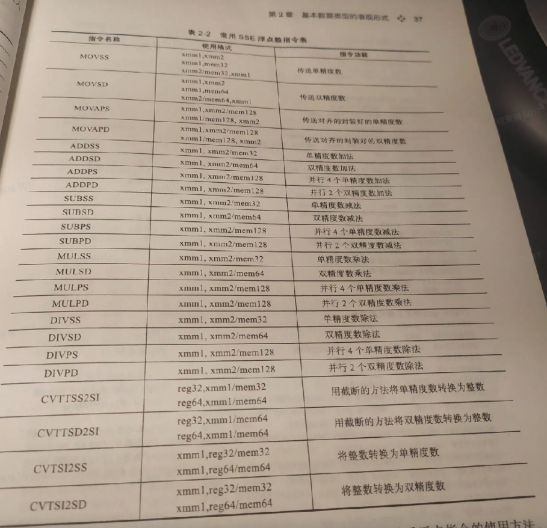
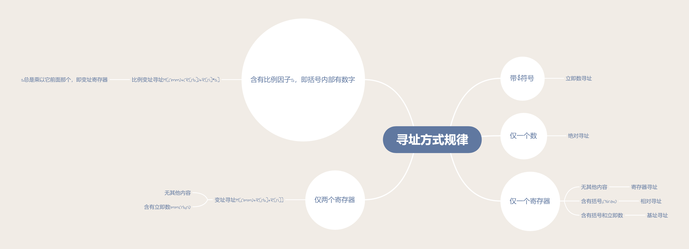
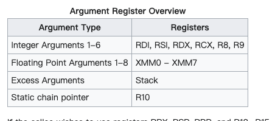
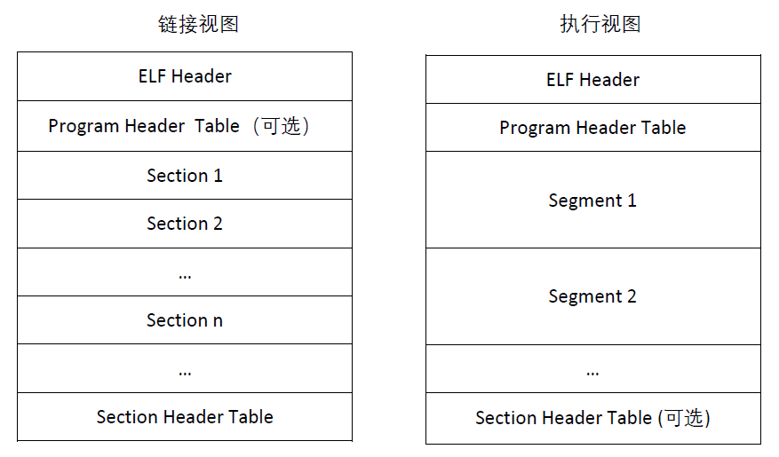

# 汇编笔记

几本书一起看，笔记互相添加，嗯，真是个糟糕的主意。目前实际上是《X86_64组织结构及汇编入门》的笔记，还没有王爽汇编的部分。

## 第一章-第三章

前面几章实际上没啥好说的，也就补码，反码那部分有点意思，不过原先上学的时候都学过。

## 第四章-第五章 逻辑门与逻辑电路

### 4.1-4.2 布尔逻辑基础

literal有两个含义

+ In [computer science](https://en.wikipedia.org/wiki/Computer_science), a **literal** is a notation for representing a fixed [value](https://en.wikipedia.org/wiki/Value_(computer_science)) in [source code](https://en.wikipedia.org/wiki/Source_code). 这个是给编程/计算机科学用的
+ In [mathematical logic](https://en.wikipedia.org/wiki/Mathematical_logic), a **literal** is an [atomic formula](https://en.wikipedia.org/wiki/Atomic_formula) (atom) or its [negation](https://en.wikipedia.org/wiki/Negation). The definition mostly appears in [proof theory](https://en.wikipedia.org/wiki/Proof_theory) (of [classical logic](https://en.wikipedia.org/wiki/Classical_logic)), e.g. in [conjunctive normal form](https://en.wikipedia.org/wiki/Conjunctive_normal_form) and the method of [resolution](https://en.wikipedia.org/wiki/Resolution_(logic)). 数学里面是个极简的数学公式
+ A presence of a variable or its complement in an expression.   布尔算式里面更具体

product term布尔逻辑里的“乘积表达式”，minterm每个变量都有的乘积表达式（无论里面是x还是^X），sum of products(SoP)乘积表达式的求和，sum of minterms(SoM)每个乘积表达式都是minterm的SoP

八种使得minterm为1的组合，如图

sum term布尔逻辑里的“加法表达式”，maxterm每个变量都有的加法表达式（无论里面是x还是^X），products of sums(PoS)加法表达式的求乘，product of materms(PoM)每个加法表达式都是maxterm的PoS

八种使得maxterm为0的组合，如图

### 4.3 布尔函数冷处理(?)

mSoP

mPoS

莫利斯卡诺，卡诺图K-map，非常有用的用于分析逻辑的方法，具体方法因为是英文版不是很清楚，明天查清了再写下来。


## 第六章 CPU

### 6.1 CPU总览

+ 总线
+ L1缓存
+ 寄存器
+ 指令指针
+ 指令寄存器
+ 控制单元
+ ALU
+ 标志寄存器

### 6.2 CPU寄存器

下面的调用习惯，或者说calling convention是System V AMD64 ABI，还有微软那边的一派别，详情参考https://en.wikipedia.org/wiki/X86_calling_conventions#x86-64_calling_conventions


### 6.3 CPU与内存/IO的交互

### 6.4 CPU指令执行流程

现代处理器体系结构往往采用指令队列，那么如何进行指令执行流程呢？

### 6.5 使用GDB观察程序

一些指令:

+ N    代码行数级别的，不进入执行的单步执行
+ S    代码行数级别的，进入加执行的单步执行
+ SI   机器码级别的单步执行
+ Info Reg 查看寄存器

## 第七章：使用汇编语言编程

没什么特别值得记载的，只需要记住

movq %rsp, %rbp  #这里的%用来表示寄存器，AT&T语法的通用格式是movs src, dest。如果是inter语法，那么就反过来 movs dest, src。dest和src中至少得有一个寄存器

movl $0, %eax   #这里的$表示一个常量

leave 指令等同于

``` assembly
movq %rbp, %rsp
popq %rbp
```

+ b => byte => 8 bits
+ w => word => 16 bits
+ l => long => 32 bits，it's always called dword
+ q =>quadword => 64 bis

这里显示的都是整数，我们来看点浮点数的指令，下面看到一个不明白的就写一条，慢慢建一个表

```
 CVTSI2SS — Convert Doubleword Integer to Scalar Single-Precision Floating-Point Value
 CVTSS2SI — Convert Scalar Single-Precision Floating-Point Value to Doubleword Integer
 CVTTSS2SI — Convert with Truncation Scalar Single-Precision Floating-Point Value to Integer
 CVTSS2SD — Convert Scalar Single-Precision Floating-Point Value to Scalar Double-Precision Floating-Point Value
 MOVSS — Move or Merge Scalar Single-Precision Floating-Point Value
```

更具体的指令，看这个：




除了上述的内容，还需要多赘述几句寻址方式。首先，x86是小端的典型代表，也就是低地址放低位数据，高地址放高位数据。

寻址方式可以参考链接https://zhuanlan.zhihu.com/p/355261639，下面的内容直接就是我抄过来的，感谢原作者。

## **x86 寄存器功能**

x86 寄存器功能列表如下：


在x86的abi中注：以 main 函数中调用函数 add为例 ，main 为调用者，add 为被调用者。在 main 函数调用 add 之前，应该将【EAX, ECX, EDX】保存到栈中，在 add 函数中应该将【EBX, ESI, EDI, EBP】保存到栈中，在函数执行完成后，恢复原始数据。

## **操作数类型**

在 x86 指令中，包括三类操作数：立即数、寄存器和存储器引用。

**立即数**：即常数，任何可以用 32 位寄存器表示的数，都可以作为立即数。立即数使用前缀`$`进行表示，后面可跟十进制或者十六进制。使用 ![[公式]](https://www.zhihu.com/equation?tex=I_%7Bmm%7D) 代表任意立即数。例如：`$0x10` 或者 `$16` ，都表示数字 16。

**寄存器**：用符号 ![[公式]](https://www.zhihu.com/equation?tex=E_a) 表示任意寄存器 a , 使用 ![[公式]](https://www.zhihu.com/equation?tex=R%5BE_a%5D) 表示寄存器 a 的值。

**存储器引用**：存储器引用表示存储器某个地址的数据。用 ![[公式]](https://www.zhihu.com/equation?tex=M%5BAddr%5D) 表示地址 Addr 的值。

## **寻址方式**

x86 包括 7 种寻址方式，分别为：*立即数寻址*、*寄存器寻址*、*绝对寻址*、*间接寻址*、*基址+偏移寻址*、*变址寻址*、*比例变址寻址*。

前三种寻址方式的表示即上面立即数的表示方式。

**间接寻址**：通过访问寄存器 ![[公式]](https://www.zhihu.com/equation?tex=E_a) 的值(![[公式]](https://www.zhihu.com/equation?tex=R%5BE_a%5D))，访问对应地址的值。使用符号 ![[公式]](https://www.zhihu.com/equation?tex=M%5BR%5BE_a%5D%5D) 表示。例如：`EAX` 寄存器为 `0x0001` ，地址 `0x0001` 的值为`0x1234`。则 ![[公式]](https://www.zhihu.com/equation?tex=M%5BR%5BE_%7Beax%7D%5D%5D) 的值为`0x1234`

**基址+偏移寻址**：通过寄存器 ![[公式]](https://www.zhihu.com/equation?tex=E_a) 和立即数 ![[公式]](https://www.zhihu.com/equation?tex=I_%7Bmm%7D) ，访问地址：![[公式]](https://www.zhihu.com/equation?tex=R%5BE_a%5D%2BI_%7BMM%7D) 处的值。使用符号 ![[公式]](https://www.zhihu.com/equation?tex=M%5BI_%7BMM%7D%2BR%5BE_a%5D%5D) 表示。

完整寻址方式见下表，我实际上感觉类型存储器，第三行的Imm的写的有点令人迷惑，在x86里面，实际上看到这个的形式应该是`mov rax, [0xff]`的样子，There’s *one* exception to this: x86_64 allows for a 64-bit displacement with the `a*` registers.	


立即数 ![[公式]](https://www.zhihu.com/equation?tex=Imm)、基址寄存器 ![[公式]](https://www.zhihu.com/equation?tex=E_b)、变址寄存器 ![[公式]](https://www.zhihu.com/equation?tex=E_i)、比例因子 ![[公式]](https://www.zhihu.com/equation?tex=s)（其值为 1、2、4、8)。

上面都是中文，翻译的莫名其妙的寻址分类，不如直接对应下面的英文的分类

- `Displacement`
- `Base`
- `Base + Index`
- `Base + Displacement`
- `Base + Index + Displacement`
- `Base + (Index * Scale)`
- `(Index * Scale) + Displacement`
- `Base + (Index * Scale) + Displacement`
- rip relative

除此之外，具体的可以看下面的图片，



ok，let's give a raw example with at&t example:simple example below

| **register direct**:           | The data value is located in a CPU register. <br>*syntax*: name of the register with a “%” prefix.<br>*example*: movl %eax, %ebx |
| ------------------------------ | ------------------------------------------------------------ |
| **immediate** **data**:        | The data value is located immediately after the instruc- tion. Source operand only.<br>*syntax*: data value with a “$” prefix.<br>*example*: movl $0xabcd1234, %ebx |
| **base register plus offset**: | The data value is located in memory. The address of the memory location is the sum of a value in a base register plus an offset value.<br>*syntax*: use the name of the register with parentheses around the name and the offset value immediately be- fore the left parenthesis.<br>*example*: movl $0xaabbccdd, 12(%eax) |
| **rip-relative**:              | The target is a memory address determined by adding an offset to the current address in the rip register.<br> *syntax*: a programmer-defined label<br> *example*: je somePlace |
| **indexed**:                   | The data value is located in memory. The address of the memory location is the sum of the value in the base_register plus scale times the value in the in- dex_register, plus the offset.<br/> *syntax*: place parentheses around the comma separated list (base_register, index_register, scale) and preface it with the offset.<br/> *example*: movl $0x6789cdef, -16(%edx, %eax, 4) |

for complex example ,check link https://blog.yossarian.net/2020/06/13/How-x86_64-addresses-memory


## 第八章：程序数据-输入，存储，输出

### 8.1-8.3 设计本地变量的栈

一些最基础的东西：

+ 汇编传递参数的时候，用哪个寄存器传参数，约定俗称的，得看ABI。需要保存哪些二进制到栈里，也需要记录values in registers rbx, rbp, rsp, and r12 – r15 be preserved by the called function  。具体的ABISystem V Application Binary Interface AMD64 Architecture Processor Supplement  我上传到了网盘上，哪天上班的路上翻翻看。
+ 栈顶也就是RSP值得位置从来都是有数值的，进栈的时候是先减指针再放入数据`sp = sp-8;stack[sp]=value`，出栈的时候是先拿出来数据，再加指针`var=stack[sp];sp = sp+8`
+ .rodata对应于只读数据，
+ at&t 对应的rbp本地栈上变量的表示方法为`offset(register_name)  `，实际上我们就是在每个局部函数的栈帧(stack frame  )里修改本地变量，这里的栈帧指针就是frame pointer, rbp寄存器 。而stack pointer就是rsp寄存器

被调用函数在进入call之后，也就是刚执行的时候，它的流程为(这里有一点要注意，必须先保存caller's rbp再保存其他寄存器的值)：

+ Save the caller’s value in the frame pointer on the stack.  
+ Copy the current value in the stack pointer to the frame pointer.  
+ Subtract a value from the stack pointer to allow for the local variables.  

函数执行完毕的时候，我们可以观察到：

+ The local variables are located in an area of the call stack – between the addresses in the rsp and rbp registers.  
+ The rbp register is a pointer to the bottom (the numerically highest address) of the local variable area.  
+ The remaining area of the stack can be accessed using the stack pointer (rsp) as always.

下面的两张图，图8.5是刚进入call执行完头几步之后的栈帧的示意图。图8.6是执行完了leave，正要执行ret的时候的栈，可以看到局部变量都被释放了。可以注意到rbp寄存器的值同样是16的倍数。


几条新的指令，equ指令，leaq指令，ret指令作用不同：

+ ret指令相当于pop %rip
+ leaq用于取地址
+ que相当于给某个地址取名字

需要注意到，C中有两种类型的变量，static和automatic：

+ atuomatic类型在栈上建立
+ static程序一致性，该变量就建立了，然后在程序的生命周期一直活着

### 8.4 本地变量的栈

ABI规定了本地变量的栈上结构应该符合什么规律：

+ Each variable should be aligned on an address that is a multiple of its size.  
+ The address in the stack pointer (rsp) should be a multiple of 16 immediately before another function is called.  

总之就这两点，具体看ABI。


### 8.5-8.6 syscall系统调用和32位程序调用流程

本质上没啥变化，就不写了


## 第九章：计算

#### 9.3.2 机器码格式

eflags寄存器储存运算的结果。本章基本也属于理解性的东西比较多，唯一一个可能要知道就是编码格式。

每条指令可以拆分成1-15字节，不同的字节有不同的作用：

+ Opcode This is the first byte in the instruction and specifies the basic operation performed by executing the instruction. It can also include operand location.  如果没有prefix那么opecode就是第一个字节，opcode里面实际上也有w位
+ ModRM  The mode/register/memory byte specifies operand locations and how they are
  accessed.  
+ SIB The scale/index/base byte specifies operand locations and how they are accessed.  
+ Data These bytes are used to encode constants, either those that are part of the program, or those that are relative address offsets to operand locations in memory.  
+ Prefix If placed in before the opcode, these modify the behavior of the instruction, typically the size of the operands.  


#### 9.3.3 REX前缀

一般不加，加了是为了能够制定用哪个寄存器，使用四位来改变指令，因此REX.R, REX.X, and REX.B bits in the REX prefix byte as the high-order bits for specifying registers.  A fourth bit in the REX prefix, the REX.W bit, is set to 1 when the operand is 64 bits. For all other operand sizes — 8, 16, or 32 bits — REX.W is set to 0.  

这里要注意

+ 3bit的寄存器字段可以出在opcode/modrm/sib字段里，根据指令的不同。
+ rex bit包括rex.r，rex.x或者rex.b在REX前缀里
+ 如果需要协商rex前缀，那么64位指令的rex.w位必须为1


#### 9.3.4 modrm

表明操作数和地址的关系，mm都是11的话，那就是两个寄存器，其他情况会变


#### 9.3.5 SIB

这个暂时还没看到，先不用着急，等到了13章再回来补上


总之，机器码看的我很蛋疼。


## 第十章流程控制

### 10.1 循环

cmp指令，根据后面的b,w,l,q来判断后面的两个操作数。执行的操作是减法，只会改变EFLAGS寄存器的值，包括of,sf,zf,af,pf,cf。

test指令，根据后面的b,w,l,q来判断后面的两个操作数。执行的操作是bit-wise and  。只会改变EFLAGS寄存器的值，包括sf,zf,pf，cf和of都置为0，AF的值未定义。

jcc指令，cc根据不同的条件变化。这里面有个问题就是：

+ 比较的时候ja，就是jmp above，jb，就是jmp below也就是两个参与比较的数都是无符号数
+ 比较的时候jg，就是jmp greater，jl，就是jmp below，也就是两个参与比较的数都是有符号数

jmp指令，无条件跳转

X86_64汇编拓展指令，有两种：

+ sign extend，往高位补1，比方说movssd，后面两个字符sd分别表示size of the source operand and d the size of the destination operand ，高位补1
+ zero extend，往高位补0，比方说movzsd，后面两个字符sd分别表示size of the source operand and d the size of the destination operand  ，高位补0

inc指令，根据后面的b,w,l,q判断增加的值。有一点需要注意增加的到底是多少位。另一点是需要注意，一块内存，里面放了目标的地址，我们每次加一，是改变这块内存上面放着的地址的值，每次地址加个一。

### 10.2 二元操作

二元操作也没啥特别稀奇的，就是流程有点绕，then代码块最后会有个无条件Jmp蹦过else代码块。

对于复杂一些的逻辑操作，比方说`while( value>= 0 && value < 9)`就是比较条件多一些，按照顺序比较，和C语言中比较的流程一致，英文叫做short-circuit evaluation.

X86_64提供了一个简单的条件赋值语句，cmovcc  src, dst。不过我感觉看到的不多啊


## 第十一章 

本章主要是高层语言和汇编语言的实际联系。When one function calls another, the information that is required to provide the interface between the two is called an activation record.  这种调用参数时的传递关系很蛋疼，不过还好X86_64的ABI给出了一整套限制。 In 64-bit mode six of the general purpose registers and a portion of the call stack are used for the activation record. The area of the stack used for the activation record is called a stack frame.   

+ 调用函数（注意区分“被调用函数”）多于六个参数时，用stack frame传递参数
+ 返回地址
+ 调用函数的帧指针
+ 局部变量

常常包含：

+ 寄存器里参数的拷贝
+ Copies of values in the registers that must be preserved by a function — rbx, r12 – r15.  

除此之外，一些通用规则：

+ Each argument is passed within an 8-byte unit. For example, passing three char values requires three registers. This 8-byte rule also applies to arguments passed on the stack.  
+ Local variables can be allocated to take up only the amount of memory they require. For example, three char values can be accommodated in a three-byte memory area.  
+ The address in the frame pointer (rbp register) must always be a multiple of sixteen. It should never be changed within a function, except during the prologue and epilogue.  
+ The address in the stack pointer (rsp register) must always be a multiple of sixteen before transferring program flow to another function.  


需要引入一个redzone的概念，The ABI [25] defines the 128 bytes beyond the stack pointer— that is, the 128 bytes at addresses lower than the one in the rsp register — as a red zone. The operating system is not allowed to use this area, so the function can use it for temporary storage of values that do not need to be saved when another function is called.  


### 11.2 64位参数多于6个

多于6个的时候，倒着（参数列表，从右向左）扔进stack，然后一call，这几个参数正好在栈里面返回地址的上面，如上图和下图所示。


总结起来就是：

对于调用函数：

+ Assume that the values in the rax, rcx, rdx, rsi, rdi and r8 – r11 registers will be changed by the called function.  
+ The first six arguments are passed in the rdi, rsi, rdx, rcx, r8, and r9 registers in left-to-right order.  
+ Arguments beyond six are stored on the stack as though they had been pushed onto the stack in right-to-left order.  
+ Use the call instruction to invoke the function you wish to call.  

刚进入被调用函数时：

+ Save the caller’s frame pointer by pushing rbp onto the stack  
+ Establish a new frame pointer at the current top of stack by copying rsp to rbp.  
+ Allocate space on the stack for all the local variables, plus any required register save space, by subtracting the number of bytes required from rsp; this value must be a multiple of sixteen.  
+ If a called function changes any of the values in the rbx, rbp, rsp, or r12 – r15 registers, they must be saved in the register save area, then restored before returning to the calling function.  
+ If the function calls another function, save the arguments passed in registers on the stack  

在被调用函数里面的时候：

+ rsp is pointing to the current bottom of the stack that is accessible to this function. Observe the usual stack discipline (see §8.2). In particular, DO NOT use the stack pointer to access arguments or local variables.  
+ Arguments passed in registers to the function and saved on the stack are accessed by negative offsets from the frame pointer, rbp.  
+ Arguments passed on the stack to the function are accessed by positive offsets from the frame pointer, rbp.  
+ Local variables are accessed by negative offsets from the frame pointer, rbp  

当离开被调用函数的时候：

+ Place the return value, if any, in eax.  
+ Restore the the values in the rbx, rbp, rsp, and r12 – r15 registers from the register save area in the stack frame.  
+ Delete the local variable space and register save area by copying rbp to rsp.  
+ Restore the caller’s frame pointer by popping rbp off the stack save area. 
+ Return to calling function with ret.   

补一点内存对齐的内容：

编译器会尽量避免数据被两次读取，因此会积极主动地采用内存对齐的操作进行执行。原则为两条：

+ 结构体第一个成员的**偏移量（offset）**为0，以后每个成员相对于结构体首地址的 offset 都是**该成员大小与实际的对齐值	中较小那个**的整数倍，如有需要编译器会在成员之间加上填充字节。
+ **结构体的总大小**为 实际的对齐值 的**整数倍**，如有需要编译器会在最末一个成员之后加上填充字节。

换言之，可以说结果是，下面的说法也不是很对：

+ 基本类型的对齐值就是其sizeof值
+ 结构体的对齐值是其成员的最大对齐值
+ 编译器可以设置一个对齐值，但是类型的实际对齐值是该类型的对齐值与设定的对齐值取最小值得来。
+ 结构体的成员为数组的时候，计算对齐值是根据数据元素的长度，而不是数组的整体大小

## 第十二章：位运算，乘法除法

### 12.1-2 逻辑运算

几条新指令：

+ ands，和原先一致s可以是b,w,l,q
+ ors，和原先一致s可以是b,w,l,q
+ xors，和原先一致s可以是b,w,l,q
+ shrs，和原先一致s可以是b,w,l,q。右移，高位补0，低位，或者说被移除的位拷贝到cf里
+ sars，和原先一致s可以是b,w,l,q。右移，高位补和原先最高位一样的数字，低位，或者说被移除的位拷贝到cf里
+ shls，和原先一致s可以是b,w,l,q。左移，低位补0，高位，或者说被移除的位拷贝到cf里
+ sals，和原先一致s可以是b,w,l,q。左移，低位补0，高位，或者说被移除的位拷贝到cf里

### 12.3 乘法

几条新指令：

+ muls，和原先一致s可以是b,w,l,q。unsigned乘法，目的操作数必须在al,ax,eax,rax寄存器里。C语言里面，认为unsigned模式是循环或者说是reduced modulo的
+ imuls，和原先一致s可以是b,w,l,q。signed乘法，这个的格式很多，有三种imuls source; imuls source,destination;imuls immediate,source,destination;

### 12.4 除法

几条新指令：

+ divs，和原先一致s可以是b,w,l,q。无符号除法，和muls用的操作数都一样的
+ idivs，和原先一致s可以是b,w,l,q。有符号除法，和muls用的操作数都一样的。可没有imuls那么花里胡哨的

### 12.6 取补码

二进制取补码

+ negs，和原先一致s可以是b,w,l,q。


## 第十三章：C/C++语言和汇编的转换

使用gdb调试的时候，输入layout asm就能一遍调试，一边看asm的代码了

### 13.1 部分算数运算的优化和转换

#### 13.1.1 乘法

#### 13.1.2 除法

##### 13.1.2.1 无符号除法的几种形式

无符号除法的对应的形式主要有三种，1 除数是2的幂次 2 

代码

```cpp
#include <stdio.h>
int main(int argc, char* argv[]) {
  printf("argc / 16 = %u", (unsigned)argc / 16);
  printf("argc / 3 = %u", (unsigned)argc / 3);
  printf("argc / 7 = %u", (unsigned)argc / 7);
  return 0;
}
```

可以看到，针对2的幂次就是直接右移，针对非2的幂次。除法做了相应的优化，计算出来一个魔数，如果魔术小于四字节整数范围那就直接计算，可是如果超过累四字节，那就

```assembly
Dump of assembler code for function main:
   0x000055555555464a <+0>:	push   %rbp
   0x000055555555464b <+1>:	mov    %rsp,%rbp
=> 0x000055555555464e <+4>:	sub    $0x10,%rsp
   0x0000555555554652 <+8>:	mov    %edi,-0x4(%rbp)
   0x0000555555554655 <+11>:	mov    %rsi,-0x10(%rbp)
   0x0000555555554659 <+15>:	mov    -0x4(%rbp),%eax
   0x000055555555465c <+18>:	shr    $0x4,%eax   #对应argc / 16 = %u
   0x000055555555465f <+21>:	mov    %eax,%esi
   0x0000555555554661 <+23>:	lea    0xec(%rip),%rdi        # 0x555555554754
   0x0000555555554668 <+30>:	mov    $0x0,%eax
   0x000055555555466d <+35>:	callq  0x555555554520 <printf@plt>
   0x0000555555554672 <+40>:	mov    -0x4(%rbp),%eax
   0x0000555555554675 <+43>:	mov    $0xaaaaaaab,%edx
   0x000055555555467a <+48>:	mul    %edx      # argc / 3 的核心，虽然是乘法但是右移以后是除法
   0x000055555555467c <+50>:	mov    %edx,%eax
   0x000055555555467e <+52>:	shr    %eax      # short-hand for SAR EAX,1
   0x0000555555554680 <+54>:	mov    %eax,%esi
   0x0000555555554682 <+56>:	lea    0xda(%rip),%rdi        # 0x555555554763
   0x0000555555554689 <+63>:	mov    $0x0,%eax
   0x000055555555468e <+68>:	callq  0x555555554520 <printf@plt>
   0x0000555555554693 <+73>:	mov    -0x4(%rbp),%ecx
   0x0000555555554696 <+76>:	mov    $0x24924925,%edx
   0x000055555555469b <+81>:	mov    %ecx,%eax
   0x000055555555469d <+83>:	mul    %edx
   0x000055555555469f <+85>:	mov    %ecx,%eax
   0x00005555555546a1 <+87>:	sub    %edx,%eax
   0x00005555555546a3 <+89>:	shr    %eax
   0x00005555555546a5 <+91>:	add    %edx,%eax
   0x00005555555546a7 <+93>:	shr    $0x2,%eax
   0x00005555555546aa <+96>:	mov    %eax,%esi
   0x00005555555546ac <+98>:	lea    0xbe(%rip),%rdi        # 0x555555554771
   0x00005555555546b3 <+105>:	mov    $0x0,%eax
   0x00005555555546b8 <+110>:	callq  0x555555554520 <printf@plt>
   0x00005555555546bd <+115>:	mov    $0x0,%eax
   0x00005555555546c2 <+120>:	leaveq
   0x00005555555546c3 <+121>:	retq
End of assembler dump.
```


##### 13.1.2.2 有符号除法除数是正数的几种形式

对C语言而言，除法规则是向0取整

```c++
#include <stdio.h>
int main(int argc, char* argc[]) {
  printf("argc / 8 = %d", argc / 8);
  printf("argc / 9 = %d", argc / 9);
  printf("argc / 7 = %d", argc / 7);
  return 0;
}
```


可以看到对2的幂次的除法

```assembly
(gdb) disass
Dump of assembler code for function main:
   0x000055555555464a <+0>:	push   %rbp
   0x000055555555464b <+1>:	mov    %rsp,%rbp
=> 0x000055555555464e <+4>:	sub    $0x10,%rsp
   0x0000555555554652 <+8>:	mov    %edi,-0x4(%rbp)
   0x0000555555554655 <+11>:	mov    %rsi,-0x10(%rbp)
   0x0000555555554659 <+15>:	mov    -0x4(%rbp),%eax
   0x000055555555465c <+18>:	lea    0x7(%rax),%edx
   0x000055555555465f <+21>:	test   %eax,%eax   # argc / 8
   0x0000555555554661 <+23>:	cmovs  %edx,%eax
   0x0000555555554664 <+26>:	sar    $0x3,%eax
   0x0000555555554667 <+29>:	mov    %eax,%esi
   0x0000555555554669 <+31>:	lea    0xf4(%rip),%rdi        # 0x555555554764
   0x0000555555554670 <+38>:	mov    $0x0,%eax
   0x0000555555554675 <+43>:	callq  0x555555554520 <printf@plt>
   0x000055555555467a <+48>:	mov    -0x4(%rbp),%ecx
   0x000055555555467d <+51>:	mov    $0x38e38e39,%edx # argc / 9
   0x0000555555554682 <+56>:	mov    %ecx,%eax
   0x0000555555554684 <+58>:	imul   %edx
   0x0000555555554686 <+60>:	sar    %edx
   0x0000555555554688 <+62>:	mov    %ecx,%eax
   0x000055555555468a <+64>:	sar    $0x1f,%eax
   0x000055555555468d <+67>:	sub    %eax,%edx
   0x000055555555468f <+69>:	mov    %edx,%eax
   0x0000555555554691 <+71>:	mov    %eax,%esi
   0x0000555555554693 <+73>:	lea    0xd8(%rip),%rdi        # 0x555555554772
   0x000055555555469a <+80>:	mov    $0x0,%eax
   0x000055555555469f <+85>:	callq  0x555555554520 <printf@plt>
   0x00005555555546a4 <+90>:	mov    -0x4(%rbp),%ecx
   0x00005555555546a7 <+93>:	mov    $0x92492493,%edx # argc / 7
   0x00005555555546ac <+98>:	mov    %ecx,%eax
   0x00005555555546ae <+100>:	imul   %edx
   0x00005555555546b0 <+102>:	lea    (%rdx,%rcx,1),%eax
   0x00005555555546b3 <+105>:	sar    $0x2,%eax
   0x00005555555546b6 <+108>:	mov    %eax,%edx
   0x00005555555546b8 <+110>:	mov    %ecx,%eax
   0x00005555555546ba <+112>:	sar    $0x1f,%eax
   0x00005555555546bd <+115>:	sub    %eax,%edx
   0x00005555555546bf <+117>:	mov    %edx,%eax
   0x00005555555546c1 <+119>:	mov    %eax,%esi
   0x00005555555546c3 <+121>:	lea    0xb6(%rip),%rdi        # 0x555555554780
   0x00005555555546ca <+128>:	mov    $0x0,%eax
   0x00005555555546cf <+133>:	callq  0x555555554520 <printf@plt>
   0x00005555555546d4 <+138>:	mov    $0x0,%eax
   0x00005555555546d9 <+143>:	leaveq
   0x00005555555546da <+144>:	retq
End of assembler dump.
(gdb)
```


##### 13.1.2.3 有符号除法除数是负数的几种形式


```
#include <stdio.h>
int main(int argc, char* argv[]) {
  printf("argc / -4 = %d", argc / -4);
  printf("argc / -5 = %d", argc / -5);
  printf("argc / -7 = %d", argc / -7);
  return 0;
}
```


```assembly
(gdb) disass
Dump of assembler code for function main:
   0x000055555555464a <+0>:	push   %rbp
   0x000055555555464b <+1>:	mov    %rsp,%rbp
=> 0x000055555555464e <+4>:	sub    $0x10,%rsp
   0x0000555555554652 <+8>:	mov    %edi,-0x4(%rbp)
   0x0000555555554655 <+11>:	mov    %rsi,-0x10(%rbp)
   0x0000555555554659 <+15>:	mov    -0x4(%rbp),%eax
   0x000055555555465c <+18>:	lea    0x3(%rax),%edx
   0x000055555555465f <+21>:	test   %eax,%eax
   0x0000555555554661 <+23>:	cmovs  %edx,%eax
   0x0000555555554664 <+26>:	sar    $0x2,%eax
   0x0000555555554667 <+29>:	neg    %eax
   0x0000555555554669 <+31>:	mov    %eax,%esi
   0x000055555555466b <+33>:	lea    0xf2(%rip),%rdi        # 0x555555554764
   0x0000555555554672 <+40>:	mov    $0x0,%eax
   0x0000555555554677 <+45>:	callq  0x555555554520 <printf@plt>
   0x000055555555467c <+50>:	mov    -0x4(%rbp),%ecx
   0x000055555555467f <+53>:	mov    $0x66666667,%edx
   0x0000555555554684 <+58>:	mov    %ecx,%eax
   0x0000555555554686 <+60>:	imul   %edx
   0x0000555555554688 <+62>:	mov    %edx,%eax
   0x000055555555468a <+64>:	sar    %eax
   0x000055555555468c <+66>:	sar    $0x1f,%ecx
   0x000055555555468f <+69>:	mov    %ecx,%edx
   0x0000555555554691 <+71>:	sub    %eax,%edx
   0x0000555555554693 <+73>:	mov    %edx,%eax
   0x0000555555554695 <+75>:	mov    %eax,%esi
   0x0000555555554697 <+77>:	lea    0xd5(%rip),%rdi        # 0x555555554773
   0x000055555555469e <+84>:	mov    $0x0,%eax
   0x00005555555546a3 <+89>:	callq  0x555555554520 <printf@plt>
   0x00005555555546a8 <+94>:	mov    -0x4(%rbp),%ecx
   0x00005555555546ab <+97>:	mov    $0x92492493,%edx
   0x00005555555546b0 <+102>:	mov    %ecx,%eax
   0x00005555555546b2 <+104>:	imul   %edx
   0x00005555555546b4 <+106>:	lea    (%rdx,%rcx,1),%eax
   0x00005555555546b7 <+109>:	sar    $0x2,%eax
   0x00005555555546ba <+112>:	sar    $0x1f,%ecx
   0x00005555555546bd <+115>:	mov    %ecx,%edx
   0x00005555555546bf <+117>:	sub    %eax,%edx
   0x00005555555546c1 <+119>:	mov    %edx,%eax
   0x00005555555546c3 <+121>:	mov    %eax,%esi
   0x00005555555546c5 <+123>:	lea    0xb6(%rip),%rdi        # 0x555555554782
   0x00005555555546cc <+130>:	mov    $0x0,%eax
   0x00005555555546d1 <+135>:	callq  0x555555554520 <printf@plt>
   0x00005555555546d6 <+140>:	mov    $0x0,%eax
   0x00005555555546db <+145>:	leaveq
   0x00005555555546dc <+146>:	retq
End of assembler dump.
(gdb)
```


### 13.2 控制流程的汇编

来看一点控制结构的代码，对于if而言，gcc/clang会考虑启用分支预测，这样子命中的情况下不会触发跳转，而没命中触发两次跳转。下面给了一个多个ifelse对比的例子，可以看出来，多个ifelse的语句，会分别根据跳转的情况走到不同的语句块，比方说if命中跳到A，没命中跳到B

```c++
#include <stdio.h>
int main(int argc, char* argv[]) {
  if (argc > 0) {
    printf("argc > 0");
  } else if (argc == 0) {
    printf("argc == 0");
  } else {
    printf("argc <= 0");
  }
  return 0;
}
```


```assembly
Dump of assembler code for function main:
=> 0x0000555555554560 <+0>:	sub    $0x8,%rsp
   0x0000555555554564 <+4>:	cmp    $0x0,%edi
   0x0000555555554567 <+7>:	jg     0x55555555459a <main+58>
   0x0000555555554569 <+9>:	je     0x555555554585 <main+37>
   0x000055555555456b <+11>:	lea    0x1e5(%rip),%rsi        # 0x555555554757
   0x0000555555554572 <+18>:	mov    $0x1,%edi
   0x0000555555554577 <+23>:	xor    %eax,%eax
   0x0000555555554579 <+25>:	callq  0x555555554540 <__printf_chk@plt>
   0x000055555555457e <+30>:	xor    %eax,%eax
   0x0000555555554580 <+32>:	add    $0x8,%rsp
   0x0000555555554584 <+36>:	retq
   0x0000555555554585 <+37>:	lea    0x1c1(%rip),%rsi        # 0x55555555474d
   0x000055555555458c <+44>:	mov    $0x1,%edi
   0x0000555555554591 <+49>:	xor    %eax,%eax
   0x0000555555554593 <+51>:	callq  0x555555554540 <__printf_chk@plt>
   0x0000555555554598 <+56>:	jmp    0x55555555457e <main+30>
   0x000055555555459a <+58>:	lea    0x1a3(%rip),%rsi        # 0x555555554744
   0x00005555555545a1 <+65>:	mov    $0x1,%edi
   0x00005555555545a6 <+70>:	xor    %eax,%eax
   0x00005555555545a8 <+72>:	callq  0x555555554540 <__printf_chk@plt>
   0x00005555555545ad <+77>:	jmp    0x55555555457e <main+30>
End of assembler dump.
```


和多ifelse的跳转不同，尽管也有好多的比较，switch case看起来就是单纯的比较，跳转到对应的语句块。没命中的话就继续做比较，简单来说就是没命中的情况下，不会

```c++
#include <stdio.h>
int main(int argc, char* argv[]) {
  int n=1;
  scanf("%d", &n);
  switch (n) {
  case 1:
    printf("n == 1");
    break;
  case 3:
    printf("n == 3");
    break;
  case 100:
    printf("n == 100");
    break;
  default:
    break;
  }
  return 0;
}
```


```assembly
(gdb) disass
Dump of assembler code for function main:
=> 0x0000555555554610 <+0>:	sub    $0x18,%rsp
   0x0000555555554614 <+4>:	lea    0x229(%rip),%rdi        # 0x555555554844
   0x000055555555461b <+11>:	mov    %fs:0x28,%rax
   0x0000555555554624 <+20>:	mov    %rax,0x8(%rsp)
   0x0000555555554629 <+25>:	xor    %eax,%eax
   0x000055555555462b <+27>:	lea    0x4(%rsp),%rsi
   0x0000555555554630 <+32>:	movl   $0x1,0x4(%rsp)
   0x0000555555554638 <+40>:	callq  0x5555555545f0 <scanf@plt>
   0x000055555555463d <+45>:	mov    0x4(%rsp),%eax
   0x0000555555554641 <+49>:	cmp    $0x3,%eax
   0x0000555555554644 <+52>:	je     0x555555554691 <main+129>
   0x0000555555554646 <+54>:	cmp    $0x64,%eax
   0x0000555555554649 <+57>:	je     0x55555555467c <main+108>
   0x000055555555464b <+59>:	sub    $0x1,%eax
   0x000055555555464e <+62>:	je     0x555555554667 <main+87>
   0x0000555555554650 <+64>:	xor    %eax,%eax
   0x0000555555554652 <+66>:	mov    0x8(%rsp),%rdx
   0x0000555555554657 <+71>:	xor    %fs:0x28,%rdx
   0x0000555555554660 <+80>:	jne    0x5555555546a6 <main+150>
   0x0000555555554662 <+82>:	add    $0x18,%rsp
   0x0000555555554666 <+86>:	retq
   0x0000555555554667 <+87>:	lea    0x1d9(%rip),%rsi        # 0x555555554847
   0x000055555555466e <+94>:	mov    $0x1,%edi
   0x0000555555554673 <+99>:	xor    %eax,%eax
   0x0000555555554675 <+101>:	callq  0x5555555545e0 <__printf_chk@plt>
   0x000055555555467a <+106>:	jmp    0x555555554650 <main+64>
   0x000055555555467c <+108>:	lea    0x1d2(%rip),%rsi        # 0x555555554855
   0x0000555555554683 <+115>:	mov    $0x1,%edi
   0x0000555555554688 <+120>:	xor    %eax,%eax
   0x000055555555468a <+122>:	callq  0x5555555545e0 <__printf_chk@plt>
   0x000055555555468f <+127>:	jmp    0x555555554650 <main+64>
   0x0000555555554691 <+129>:	lea    0x1b6(%rip),%rsi        # 0x55555555484e
   0x0000555555554698 <+136>:	mov    $0x1,%edi
   0x000055555555469d <+141>:	xor    %eax,%eax
   0x000055555555469f <+143>:	callq  0x5555555545e0 <__printf_chk@plt>
   0x00005555555546a4 <+148>:	jmp    0x555555554650 <main+64>
   0x00005555555546a6 <+150>:	callq  0x5555555545d0 <__stack_chk_fail@plt>
End of assembler dump.
```


对于switch的结构不是有序线性，两个case之间的值差别较大的时候，可以通过建立索引表来做优化

```c++
#include <stdio.h>
int main(int argc, char* argv[]) {
  int n=1;
  scanf("%d", &n);
  switch (n) {
  case 1:
    printf("n == 1");
    break;
  case 2:
    printf("n == 2");
    break;
  case 3:
    printf("n == 3");
    break;
  case 4:
    printf("n == 4");
    break;
  case 5:
    printf("n == 5");
    break;
  case 6:
    printf("n == 6");
    break;
  case 255:
    printf("n == 255");
    break;
  }
  return 0;
}

```


```assembly
Dump of assembler code for function main:
=> 0x0000555555554610 <+0>:	sub    $0x18,%rsp
   0x0000555555554614 <+4>:	lea    0x2a9(%rip),%rdi        # 0x5555555548c4
   0x000055555555461b <+11>:	mov    %fs:0x28,%rax
   0x0000555555554624 <+20>:	mov    %rax,0x8(%rsp)
   0x0000555555554629 <+25>:	xor    %eax,%eax
   0x000055555555462b <+27>:	lea    0x4(%rsp),%rsi
   0x0000555555554630 <+32>:	movl   $0x1,0x4(%rsp)
   0x0000555555554638 <+40>:	callq  0x5555555545f0 <scanf@plt>
   0x000055555555463d <+45>:	mov    0x4(%rsp),%eax
   0x0000555555554641 <+49>:	cmp    $0x4,%eax
   0x0000555555554644 <+52>:	je     0x55555555470b <main+251>
   0x000055555555464a <+58>:	jle    0x555555554693 <main+131>
   0x000055555555464c <+60>:	cmp    $0x6,%eax
   0x000055555555464f <+63>:	je     0x5555555546de <main+206>
   0x0000555555554655 <+69>:	jl     0x5555555546c9 <main+185>
   0x0000555555554657 <+71>:	cmp    $0xff,%eax
   0x000055555555465c <+76>:	jne    0x555555554678 <main+104>
   0x000055555555465e <+78>:	lea    0x28c(%rip),%rsi        # 0x5555555548f1
   0x0000555555554665 <+85>:	mov    $0x1,%edi
   0x000055555555466a <+90>:	xor    %eax,%eax
   0x000055555555466c <+92>:	callq  0x5555555545e0 <__printf_chk@plt>
   0x0000555555554671 <+97>:	nopl   0x0(%rax)
   0x0000555555554678 <+104>:	xor    %eax,%eax
   0x000055555555467a <+106>:	mov    0x8(%rsp),%rdx
   0x000055555555467f <+111>:	xor    %fs:0x28,%rdx
   0x0000555555554688 <+120>:	jne    0x555555554723 <main+275>
   0x000055555555468e <+126>:	add    $0x18,%rsp
   0x0000555555554692 <+130>:	retq
   0x0000555555554693 <+131>:	cmp    $0x2,%eax
   0x0000555555554696 <+134>:	je     0x5555555546f3 <main+227>
   0x0000555555554698 <+136>:	jg     0x5555555546b4 <main+164>
   0x000055555555469a <+138>:	sub    $0x1,%eax
   0x000055555555469d <+141>:	jne    0x555555554678 <main+104>
   0x000055555555469f <+143>:	lea    0x221(%rip),%rsi        # 0x5555555548c7
   0x00005555555546a6 <+150>:	mov    $0x1,%edi
   0x00005555555546ab <+155>:	xor    %eax,%eax
   0x00005555555546ad <+157>:	callq  0x5555555545e0 <__printf_chk@plt>
   0x00005555555546b2 <+162>:	jmp    0x555555554678 <main+104>
   0x00005555555546b4 <+164>:	lea    0x21a(%rip),%rsi        # 0x5555555548d5
   0x00005555555546bb <+171>:	mov    $0x1,%edi
   0x00005555555546c0 <+176>:	xor    %eax,%eax
   0x00005555555546c2 <+178>:	callq  0x5555555545e0 <__printf_chk@plt>
   0x00005555555546c7 <+183>:	jmp    0x555555554678 <main+104>
   0x00005555555546c9 <+185>:	lea    0x213(%rip),%rsi        # 0x5555555548e3
   0x00005555555546d0 <+192>:	mov    $0x1,%edi
   0x00005555555546d5 <+197>:	xor    %eax,%eax
   0x00005555555546d7 <+199>:	callq  0x5555555545e0 <__printf_chk@plt>
   0x00005555555546dc <+204>:	jmp    0x555555554678 <main+104>
   0x00005555555546de <+206>:	lea    0x205(%rip),%rsi        # 0x5555555548ea
   0x00005555555546e5 <+213>:	mov    $0x1,%edi
   0x00005555555546ea <+218>:	xor    %eax,%eax
   0x00005555555546ec <+220>:	callq  0x5555555545e0 <__printf_chk@plt>
---Type <return> to continue, or q <return> to quit---
   0x00005555555546f1 <+225>:	jmp    0x555555554678 <main+104>
   0x00005555555546f3 <+227>:	lea    0x1d4(%rip),%rsi        # 0x5555555548ce
   0x00005555555546fa <+234>:	mov    $0x1,%edi
   0x00005555555546ff <+239>:	xor    %eax,%eax
   0x0000555555554701 <+241>:	callq  0x5555555545e0 <__printf_chk@plt>
   0x0000555555554706 <+246>:	jmpq   0x555555554678 <main+104>
   0x000055555555470b <+251>:	lea    0x1ca(%rip),%rsi        # 0x5555555548dc
   0x0000555555554712 <+258>:	mov    $0x1,%edi
   0x0000555555554717 <+263>:	xor    %eax,%eax
   0x0000555555554719 <+265>:	callq  0x5555555545e0 <__printf_chk@plt>
   0x000055555555471e <+270>:	jmpq   0x555555554678 <main+104>
   0x0000555555554723 <+275>:	callq  0x5555555545d0 <__stack_chk_fail@plt>
End of assembler dump.
```


关于switch还可以使用开启平衡树的结构，来减少比较的次数。


关于循环结构，do while；while do；for，三种循环都有自己的特点，简单来说。在release模式下，do while没什么变化，而while do会先进行一个if的比较跳转，如果可以直接走就直接走，然后转换为while do的结构；至于for结构也是同样的方法，拆出来初始化阶段，然后把内部结构转换为循环。

```c++
#include <stdio.h>
int main(int argc, char* argv[]) {
  int i = 0;
  int sum_i = 0;
  do {
    sum_i += i;
    i++;
  } while( i <= argc );
  printf( "sum_i is %d", sum_i);
  int j = 0;
  int sum_j = 0;
  while (j <= 2*argc ) {
    sum_j += j;
    j++;
  }
  printf( "sum_j is %d", sum_j);

  int sum_k = 0;
  for (int k = 0; k < 3*argc; k++) {
    sum_k += k;
  }
  printf( "sum_k is %d", sum_k);
  return 0;
}
```


```assembly
Dump of assembler code for function main:
=> 0x0000555555554560 <+0>:	push   %rbx
   0x0000555555554561 <+1>:	xor    %edx,%edx
   0x0000555555554563 <+3>:	mov    %edi,%ebx
   0x0000555555554565 <+5>:	xor    %eax,%eax
   0x0000555555554567 <+7>:	nopw   0x0(%rax,%rax,1)
   0x0000555555554570 <+16>:	add    %eax,%edx
   0x0000555555554572 <+18>:	add    $0x1,%eax
   0x0000555555554575 <+21>:	cmp    %ebx,%eax
   0x0000555555554577 <+23>:	jle    0x555555554570 <main+16>
   0x0000555555554579 <+25>:	lea    0x214(%rip),%rsi        # 0x555555554794
   0x0000555555554580 <+32>:	xor    %eax,%eax
   0x0000555555554582 <+34>:	mov    $0x1,%edi
   0x0000555555554587 <+39>:	callq  0x555555554540 <__printf_chk@plt>
   0x000055555555458c <+44>:	mov    %ebx,%ecx
   0x000055555555458e <+46>:	add    %ecx,%ecx
   0x0000555555554590 <+48>:	js     0x5555555545f0 <main+144>
   0x0000555555554592 <+50>:	add    $0x1,%ecx
   0x0000555555554595 <+53>:	xor    %edx,%edx
   0x0000555555554597 <+55>:	xor    %eax,%eax
   0x0000555555554599 <+57>:	nopl   0x0(%rax)
   0x00005555555545a0 <+64>:	add    %eax,%edx
   0x00005555555545a2 <+66>:	add    $0x1,%eax
   0x00005555555545a5 <+69>:	cmp    %eax,%ecx
   0x00005555555545a7 <+71>:	jne    0x5555555545a0 <main+64>
   0x00005555555545a9 <+73>:	lea    0x1f0(%rip),%rsi        # 0x5555555547a0
   0x00005555555545b0 <+80>:	xor    %eax,%eax
   0x00005555555545b2 <+82>:	mov    $0x1,%edi
   0x00005555555545b7 <+87>:	callq  0x555555554540 <__printf_chk@plt>
   0x00005555555545bc <+92>:	lea    (%rbx,%rbx,2),%ecx
   0x00005555555545bf <+95>:	test   %ecx,%ecx
   0x00005555555545c1 <+97>:	jle    0x5555555545f4 <main+148>
   0x00005555555545c3 <+99>:	xor    %eax,%eax
   0x00005555555545c5 <+101>:	xor    %edx,%edx
   0x00005555555545c7 <+103>:	nopw   0x0(%rax,%rax,1)
   0x00005555555545d0 <+112>:	add    %eax,%edx
   0x00005555555545d2 <+114>:	add    $0x1,%eax
   0x00005555555545d5 <+117>:	cmp    %eax,%ecx
   0x00005555555545d7 <+119>:	jne    0x5555555545d0 <main+112>
   0x00005555555545d9 <+121>:	lea    0x1cc(%rip),%rsi        # 0x5555555547ac
   0x00005555555545e0 <+128>:	mov    $0x1,%edi
   0x00005555555545e5 <+133>:	xor    %eax,%eax
   0x00005555555545e7 <+135>:	callq  0x555555554540 <__printf_chk@plt>
   0x00005555555545ec <+140>:	xor    %eax,%eax
   0x00005555555545ee <+142>:	pop    %rbx
   0x00005555555545ef <+143>:	retq
   0x00005555555545f0 <+144>:	xor    %edx,%edx
   0x00005555555545f2 <+146>:	jmp    0x5555555545a9 <main+73>
   0x00005555555545f4 <+148>:	xor    %edx,%edx
   0x00005555555545f6 <+150>:	jmp    0x5555555545d9 <main+121>
End of assembler dump.
(gdb)
```


### 13.3 函数的工作原理

函数是分析的重点，C/C++里面，函数参数传参顺序为从右向左一次入栈，最先定义参数最后入栈。对于C++有三种调用约定，但是对于X64只有一种，即cdicl，另外Integer arguments are passed in registers RCX, RDX, R8, and R9. Floating point arguments are passed in XMM0L, XMM1L, XMM2L, and XMM3L. 16-byte arguments are passed by reference. Parameter passing is described in detail in [Parameter passing](https://docs.microsoft.com/en-us/cpp/build/x64-calling-convention?view=msvc-170#parameter-passing). These registers, and RAX, R10, R11, XMM4, and XMM5, are considered *volatile*, or potentially changed by a callee on return. Register usage is documented in detail in [x64 register usage](https://docs.microsoft.com/en-us/cpp/build/x64-software-conventions?view=msvc-170#x64-register-usage) and [Caller/callee saved registers](https://docs.microsoft.com/en-us/cpp/build/x64-calling-convention?view=msvc-170#callercallee-saved-registers).

+ cdicl: The parameters are pushed from right to left (so that the first parameter is nearest to top-of-stack), and the caller cleans the parameters. Function names are decorated by a leading underscore.
+ ~~stdcall: This is the calling convention used for Win32, with exceptions for variadic functions (which necessarily use __cdecl) and a very few functions that use __fastcall. Parameters are pushed from right to left [*corrected 10:18am*] and the callee cleans the stack. Function names are decorated by a leading underscore and a trailing @-sign followed by the number of bytes of parameters taken by the function.~~
+ ~~fatstcall:The first two parameters are passed in ECX and EDX, with the remainder passed on the stack as in __stdcall. Again, the callee cleans the stack. Function names are decorated by a leading @-sign and a trailing @-sign followed by the number of bytes of parameters taken by the function (including the register parameters).~~

```c++
#include <stdio.h>

void addNumber(int n1) {
    n1 += 1;
    printf("%d\n", n1);
}

int main(int argc, char* argv[]) {
    int n = 0;
    scanf("%d", &n);
    addNumber(n);
    return 0;
}
```


```assembly
(gdb) disass
Dump of assembler code for function main:
=> 0x0000555555554610 <+0>:	sub    $0x18,%rsp
   0x0000555555554614 <+4>:	lea    0x21d(%rip),%rdi        # 0x555555554838
   0x000055555555461b <+11>:	mov    %fs:0x28,%rax
   0x0000555555554624 <+20>:	mov    %rax,0x8(%rsp)
   0x0000555555554629 <+25>:	xor    %eax,%eax
   0x000055555555462b <+27>:	lea    0x4(%rsp),%rsi
   0x0000555555554630 <+32>:	movl   $0x0,0x4(%rsp)
   0x0000555555554638 <+40>:	callq  0x5555555545f0 <scanf@plt>
   0x000055555555463d <+45>:	mov    0x4(%rsp),%eax
   0x0000555555554641 <+49>:	lea    0x1ec(%rip),%rsi        # 0x555555554834
   0x0000555555554648 <+56>:	mov    $0x1,%edi
   0x000055555555464d <+61>:	lea    0x1(%rax),%edx
   0x0000555555554650 <+64>:	xor    %eax,%eax
   0x0000555555554652 <+66>:	callq  0x5555555545e0 <__printf_chk@plt>
   0x0000555555554657 <+71>:	mov    0x8(%rsp),%rcx
   0x000055555555465c <+76>:	xor    %fs:0x28,%rcx
   0x0000555555554665 <+85>:	jne    0x55555555466e <main+94>
   0x0000555555554667 <+87>:	xor    %eax,%eax
   0x0000555555554669 <+89>:	add    $0x18,%rsp
   0x000055555555466d <+93>:	retq
   0x000055555555466e <+94>:	callq  0x5555555545d0 <__stack_chk_fail@plt>
End of assembler dump.
(gdb)
```

再看一个例子

```c++
#include <stdio.h>
int main(int argc, char* argv[]) {
    int n = 0;
    scanf("%d", &n);
    char ch = 2;
    scanf("%c", &ch);
    printf("%d %c\n", n , ch);
    return 0;
}
```


```assembly
(gdb) disass
Dump of assembler code for function main:
=> 0x0000555555554610 <+0>:	sub    $0x18,%rsp
   0x0000555555554614 <+4>:	lea    0x209(%rip),%rdi        # 0x555555554824
   0x000055555555461b <+11>:	mov    %fs:0x28,%rax
   0x0000555555554624 <+20>:	mov    %rax,0x8(%rsp)
   0x0000555555554629 <+25>:	xor    %eax,%eax
   0x000055555555462b <+27>:	lea    0x4(%rsp),%rsi
   0x0000555555554630 <+32>:	movl   $0x0,0x4(%rsp)
   0x0000555555554638 <+40>:	callq  0x5555555545f0 <scanf@plt>
   0x000055555555463d <+45>:	lea    0x3(%rsp),%rsi
   0x0000555555554642 <+50>:	lea    0x1de(%rip),%rdi        # 0x555555554827
   0x0000555555554649 <+57>:	xor    %eax,%eax
   0x000055555555464b <+59>:	movb   $0x2,0x3(%rsp)
   0x0000555555554650 <+64>:	callq  0x5555555545f0 <scanf@plt>
   0x0000555555554655 <+69>:	movsbl 0x3(%rsp),%ecx
   0x000055555555465a <+74>:	mov    0x4(%rsp),%edx
   0x000055555555465e <+78>:	lea    0x1c5(%rip),%rsi        # 0x55555555482a
   0x0000555555554665 <+85>:	xor    %eax,%eax
   0x0000555555554667 <+87>:	mov    $0x1,%edi
   0x000055555555466c <+92>:	callq  0x5555555545e0 <__printf_chk@plt>
   0x0000555555554671 <+97>:	mov    0x8(%rsp),%rdx
   0x0000555555554676 <+102>:	xor    %fs:0x28,%rdx
   0x000055555555467f <+111>:	jne    0x555555554688 <main+120>
   0x0000555555554681 <+113>:	xor    %eax,%eax
   0x0000555555554683 <+115>:	add    $0x18,%rsp
   0x0000555555554687 <+119>:	retq
   0x0000555555554688 <+120>:	callq  0x5555555545d0 <__stack_chk_fail@plt>
End of assembler dump.
(gdb)
```


X64的调用约定，有两种：

+ Microsoft x64 calling convention：The Microsoft x64 calling convention[[18\]](https://en.wikipedia.org/wiki/X86_calling_conventions#cite_note-ms-18)[[19\]](https://en.wikipedia.org/wiki/X86_calling_conventions#cite_note-19) is followed on [Windows](https://en.wikipedia.org/wiki/Windows_(operating_system)) and pre-boot [UEFI](https://en.wikipedia.org/wiki/UEFI) (for [long mode](https://en.wikipedia.org/wiki/Long_mode) on [x86-64](https://en.wikipedia.org/wiki/X86-64)). The first four arguments are placed onto the registers. That means RCX, RDX, R8, R9 for integer, struct or pointer arguments (in that order), and XMM0, XMM1, XMM2, XMM3 for floating point arguments. Additional arguments are pushed onto the stack (right to left). Integer return values (similar to x86) are returned in RAX if 64 bits or less. Floating point return values are returned in XMM0. Parameters less than 64 bits long are not zero extended; the high bits are not zeroed.

  Structs and unions with sizes that match integers are passed and returned as if they were integers. Otherwise they are replaced with a pointer when used as an argument. When an oversized struct return is needed, another pointer to a caller-provided space is prepended as the first argument, shifting all other arguments to the right by one place.[[20\]](https://en.wikipedia.org/wiki/X86_calling_conventions#cite_note-20)

  When compiling for the x64 architecture in a Windows context (whether using Microsoft or non-Microsoft tools), stdcall, thiscall, cdecl, and fastcall all resolve to using this convention.

  In the Microsoft x64 calling convention, it is the caller's responsibility to allocate 32 bytes of "shadow space" on the stack right before calling the function (regardless of the actual number of parameters used), and to pop the stack after the call. The shadow space is used to spill RCX, RDX, R8, and R9,[[21\]](https://en.wikipedia.org/wiki/X86_calling_conventions#cite_note-21) but must be made available to all functions, even those with fewer than four parameters.

  The registers RAX, RCX, RDX, R8, R9, R10, R11 are considered volatile (caller-saved).[[22\]](https://en.wikipedia.org/wiki/X86_calling_conventions#cite_note-Caller/Callee_Saved_Registers-22)

  The registers RBX, RBP, RDI, RSI, RSP, R12, R13, R14, and R15 are considered nonvolatile (callee-saved).[[22\]](https://en.wikipedia.org/wiki/X86_calling_conventions#cite_note-Caller/Callee_Saved_Registers-22)

  For example, a function taking 5 integer arguments will take the first to fourth in registers, and the fifth will be pushed on top of the shadow space. So when the called function is entered, the stack will be composed of (in ascending order) the return address, followed by the shadow space (32 bytes) followed by the fifth parameter.

  In [x86-64](https://en.wikipedia.org/wiki/X86-64), Visual Studio 2008 stores floating point numbers in XMM6 and XMM7 (as well as XMM8 through XMM15); consequently, for [x86-64](https://en.wikipedia.org/wiki/X86-64), user-written assembly language routines must preserve XMM6 and XMM7 (as compared to [x86](https://en.wikipedia.org/wiki/X86) wherein user-written assembly language routines did not need to preserve XMM6 and XMM7). In other words, user-written assembly language routines must be updated to save/restore XMM6 and XMM7 before/after the function when being ported from [x86](https://en.wikipedia.org/wiki/X86) to [x86-64](https://en.wikipedia.org/wiki/X86-64).

  Starting with Visual Studio 2013, Microsoft introduced the [__vectorcall](https://en.wikipedia.org/wiki/X86_calling_conventions#Microsoft_vectorcall) calling convention which extends the x64 convention.

+ System V AMD64 ABI：The calling convention of the [System V](https://en.wikipedia.org/wiki/UNIX_System_V) AMD64 [ABI](https://en.wikipedia.org/wiki/Application_binary_interface) is followed on [Solaris](https://en.wikipedia.org/wiki/Solaris_(operating_system)), [Linux](https://en.wikipedia.org/wiki/Linux), [FreeBSD](https://en.wikipedia.org/wiki/FreeBSD), [macOS](https://en.wikipedia.org/wiki/MacOS),[[23\]](https://en.wikipedia.org/wiki/X86_calling_conventions#cite_note-OS_X-23) and is the de facto standard among Unix and Unix-like operating systems. The [OpenVMS](https://en.wikipedia.org/wiki/OpenVMS) Calling Standard on x86-64 is based on the System V ABI with some extensions needed for backwards compatibility.[[24\]](https://en.wikipedia.org/wiki/X86_calling_conventions#cite_note-24) The first six integer or pointer arguments are passed in registers RDI, RSI, RDX, RCX, R8, R9 (R10 is used as a static chain pointer in case of nested functions[[25\]](https://en.wikipedia.org/wiki/X86_calling_conventions#cite_note-AMD-25): 21 ), while XMM0, XMM1, XMM2, XMM3, XMM4, XMM5, XMM6 and XMM7 are used for the first floating point arguments.[[25\]](https://en.wikipedia.org/wiki/X86_calling_conventions#cite_note-AMD-25): 22  As in the Microsoft x64 calling convention, additional arguments are passed on the stack.[[25\]](https://en.wikipedia.org/wiki/X86_calling_conventions#cite_note-AMD-25): 22  Integer return values up to 64 bits in size are stored in RAX while values up to 128 bit are stored in RAX and RDX. Floating-point return values are similarly stored in XMM0 and XMM1.[[25\]](https://en.wikipedia.org/wiki/X86_calling_conventions#cite_note-AMD-25): 25  The wider YMM and ZMM registers are used for passing and returning wider values in place of XMM when they exist.[[25\]](https://en.wikipedia.org/wiki/X86_calling_conventions#cite_note-AMD-25): 26, 55 

  If the callee wishes to use registers RBX, RSP, RBP, and R12–R15, it must restore their original values before returning control to the caller. All other registers must be saved by the caller if it wishes to preserve their values.[[25\]](https://en.wikipedia.org/wiki/X86_calling_conventions#cite_note-AMD-25): 16 

  For leaf-node functions (functions which do not call any other function(s)), a 128-byte space is stored just beneath the stack pointer of the function. The space is called the **[red zone](https://en.wikipedia.org/wiki/Red_zone_(computing))**. This zone will not be clobbered by any signal or interrupt handlers. Compilers can thus utilize this zone to save local variables. Compilers may omit some instructions at the starting of the function (adjustment of RSP, RBP) by utilizing this zone. However, other functions may clobber this zone. Therefore, this zone should only be used for leaf-node functions. `gcc` and `clang` offer the `-mno-red-zone` flag to disable red-zone optimizations.

  If the callee is a [variadic function](https://en.wikipedia.org/wiki/Variadic_function), then the number of floating point arguments passed to the function in vector registers must be provided by the caller in the AL register.[[25\]](https://en.wikipedia.org/wiki/X86_calling_conventions#cite_note-AMD-25): 55 

  Unlike the Microsoft calling convention, a shadow space is not provided; on function entry, the return address is adjacent to the seventh integer argument on the stack.

  


### 13.4 变量在内存中的位置和访问方式

变量有很多种，一种一种看：

+ 全局变量：在编译链接的时候就确定变量的位置，运行的时候直接使用全局变量的地址进行访问。
+ 全局静态变量：全局静态变量和全局变量是一样的
+ 局部静态变量：局部静态变量和全局静态变量本质没区别，其生命周期和全局变量一样子的，不过有一个地方不一样就是怎么保证只初始化一次呢？实际上是局部静态变量会有一个flag来控制是不是检查过。
+ 堆变量：堆变量是最简单也是最直接的变量了


```c++
#include <stdio.h>

int g_global = 0x12345678;

void showStatic(int n) {
    static int g_static = n;
    printf("%d\n", g_static);
}

int main(int argc, char* argv[]) {
    for (int i = 0; i < 5 ; ++i) {
        showStatic(i);
    }
    scanf("%d", &g_global);
    printf("%d", g_global);
    return 0;
}
```


```assembly
(gdb) disass
Dump of assembler code for function main:
=> 0x0000555555554690 <+0>:	sub    $0x8,%rsp
   0x0000555555554694 <+4>:	xor    %edi,%edi
   0x0000555555554696 <+6>:	callq  0x555555554810 <_Z10showStatici>
   0x000055555555469b <+11>:	mov    $0x1,%edi
   0x00005555555546a0 <+16>:	callq  0x555555554810 <_Z10showStatici>
   0x00005555555546a5 <+21>:	mov    $0x2,%edi
   0x00005555555546aa <+26>:	callq  0x555555554810 <_Z10showStatici>
   0x00005555555546af <+31>:	mov    $0x3,%edi
   0x00005555555546b4 <+36>:	callq  0x555555554810 <_Z10showStatici>
   0x00005555555546b9 <+41>:	mov    $0x4,%edi
   0x00005555555546be <+46>:	callq  0x555555554810 <_Z10showStatici>
   0x00005555555546c3 <+51>:	lea    0x200946(%rip),%rsi        # 0x555555755010 <g_global>
   0x00005555555546ca <+58>:	lea    0x227(%rip),%rdi        # 0x5555555548f8
   0x00005555555546d1 <+65>:	xor    %eax,%eax
   0x00005555555546d3 <+67>:	callq  0x555555554660 <scanf@plt>
   0x00005555555546d8 <+72>:	mov    0x200932(%rip),%edx        # 0x555555755010 <g_global>
   0x00005555555546de <+78>:	lea    0x213(%rip),%rsi        # 0x5555555548f8
   0x00005555555546e5 <+85>:	mov    $0x1,%edi
   0x00005555555546ea <+90>:	xor    %eax,%eax
   0x00005555555546ec <+92>:	callq  0x555555554640 <__printf_chk@plt>
   0x00005555555546f1 <+97>:	xor    %eax,%eax
   0x00005555555546f3 <+99>:	add    $0x8,%rsp
   0x00005555555546f7 <+103>:	retq
End of assembler dump.
(gdb) ni
0x0000555555554694 in main ()
(gdb) ni
0x0000555555554696 in main ()
(gdb) si
0x0000555555554810 in showStatic(int) ()
(gdb) disass
Dump of assembler code for function _Z10showStatici:
=> 0x0000555555554810 <+0>:	push   %rbx
   0x0000555555554811 <+1>:	movzbl 0x200808(%rip),%eax        # 0x555555755020 <_ZGVZ10showStaticiE8g_static>
   0x0000555555554818 <+8>:	test   %al,%al
   0x000055555555481a <+10>:	je     0x555555554840 <_Z10showStatici+48>
   0x000055555555481c <+12>:	mov    0x200806(%rip),%ebx        # 0x555555755028 <_ZZ10showStaticiE8g_static>
   0x0000555555554822 <+18>:	mov    %ebx,%edx
   0x0000555555554824 <+20>:	lea    0xc9(%rip),%rsi        # 0x5555555548f4
   0x000055555555482b <+27>:	mov    $0x1,%edi
   0x0000555555554830 <+32>:	pop    %rbx
   0x0000555555554831 <+33>:	xor    %eax,%eax
   0x0000555555554833 <+35>:	jmpq   0x555555554640 <__printf_chk@plt>
   0x0000555555554838 <+40>:	nopl   0x0(%rax,%rax,1)
   0x0000555555554840 <+48>:	mov    %edi,%ebx
   0x0000555555554842 <+50>:	lea    0x2007d7(%rip),%rdi        # 0x555555755020 <_ZGVZ10showStaticiE8g_static>
   0x0000555555554849 <+57>:	callq  0x555555554670 <__cxa_guard_acquire@plt>
   0x000055555555484e <+62>:	test   %eax,%eax
   0x0000555555554850 <+64>:	je     0x55555555481c <_Z10showStatici+12>
   0x0000555555554852 <+66>:	lea    0x2007c7(%rip),%rdi        # 0x555555755020 <_ZGVZ10showStaticiE8g_static>
   0x0000555555554859 <+73>:	mov    %ebx,0x2007c9(%rip)        # 0x555555755028 <_ZZ10showStaticiE8g_static>
   0x000055555555485f <+79>:	callq  0x555555554650 <__cxa_guard_release@plt>
   0x0000555555554864 <+84>:	jmp    0x555555554822 <_Z10showStatici+18>
End of assembler dump.
```


### 13.5 结构体和类

C++中的类有各种函数，比方说private/public/protected等，但这些实际上都是编译的时候追究的选项，等到成了汇编的时候就和结构体没什么区别了。这时候有个问题，对象长度应该这么计算呢？这时候有下面三个方面要考虑，除此之外还有就是对象是不是处于全局区等多方面因素

+ 空类：空类没有数据成员，但可以有函数成员，如果没长度那么没发初始化this指针，其长度为1字节。
+ 内存对齐：实际上有内存对齐的时候这个规则上面就有，具体得看实现编译器的文档了
+ 静态数据成员：静态数据成员实际上是

我们通过下面的例子重点看以下几点：

+ this指针是这么传递和调用的，这点我们看persion的setage函数，通过这个例子我们能明白
+ 结构体作为参数是怎么传递的，我们能够发现对于短的结构体，会直接利用压栈手段把数据结构搞进去，对于长的数据结构会采用数据复制的手段。这里面还有一点要注意，我们的代码里面是没有复制构造函数和移动构造函数的，
+ 结构体作为函数的返回值是这么传递的，编译器会先在栈里面申请出来返回对象的内存空间，然后调用返回对象的函数，该函数会将返回的结构体的内容复制到申请的内存空间，再将对象复制给目标对象。这里面有一个C++生命周期的小坑，为什么临时内存空间要在调用方的帧栈里面呢？想这个情况getPersion().count，如果这个不在调用方里面申请内存，那么这时候这个对象的内存明显就被释放了。这也是为什么C++里面搞出来move语句的原因。这里面还有一点，当对象作为返回值，如果该对象是个局部变量，那么不能返回该对象的首地址或者引用（实际上引用这里就是指针）


这里面有个地方可能会很有意思，编译器要是上了O2优化可能代码不会有那么明显的调用了，看下面的例子，直接就把对象压扁成了普通对象，然后所有的操作都直接对外表现了。

```c++
#include <stdio.h>

class Persion {
    public:
        void setAge(int age) {
            this->age = age;
        }
        void showPersion() {
            printf("age = %d, height = %d", age, height);
        }
    public:
        int age;
        int height;
        char name[32];
};

void show(Persion persion1, Persion persion2) {
    printf("persion 1 age = %d, persion 2 height = %d",persion1.age, persion2.height );
}

Persion getPersoin() {
    Persion persion;
    int persion_age = 0;
    scanf("%d", &persion_age);
    persion.age = persion_age;
    persion.height = 180;
    return persion;
}

int main(int argc, char* argv[]) {
    Persion persion1;
    int persion_age = 0;
    scanf("%d", &persion_age);
    persion1.setAge(persion_age);
 		// 这里的printf的rdi是参数的个数，第二个参数是"Persion : %d \n"放在了esi里面，然后直接压扁了，可以看到直接就是拿出来
    printf("Persion : %d \n", persion1.age);
  	// 
    Persion persion2 = getPersoin();
    show(persion1, persion2);
    persion1.showPersion();
    persion2.showPersion();
    return 0;
}
```


```assembly
Dump of assembler code for function main:
   0x0000555555554610 <+0>:	push   %rbp
   0x0000555555554611 <+1>:	push   %rbx
   0x0000555555554612 <+2>:	lea    0x331(%rip),%rdi        # 0x55555555494a
   0x0000555555554619 <+9>:	sub    $0x18,%rsp
   0x000055555555461d <+13>:	mov    %fs:0x28,%rax
=> 0x0000555555554626 <+22>:	mov    %rax,0x8(%rsp)
   0x000055555555462b <+27>:	xor    %eax,%eax
   0x000055555555462d <+29>:	mov    %rsp,%rsi
   0x0000555555554630 <+32>:	movl   $0x0,(%rsp)
   0x0000555555554637 <+39>:	callq  0x5555555545f0 <scanf@plt>
   0x000055555555463c <+44>:	mov    (%rsp),%ebx
   0x000055555555463f <+47>:	lea    0x2e2(%rip),%rsi        # 0x555555554928
   0x0000555555554646 <+54>:	mov    $0x1,%edi
   0x000055555555464b <+59>:	xor    %eax,%eax
   0x000055555555464d <+61>:	mov    %ebx,%edx
   0x000055555555464f <+63>:	callq  0x5555555545e0 <__printf_chk@plt>
   0x0000555555554654 <+68>:	lea    0x4(%rsp),%rsi
   0x0000555555554659 <+73>:	lea    0x2ea(%rip),%rdi        # 0x55555555494a
   0x0000555555554660 <+80>:	xor    %eax,%eax
   0x0000555555554662 <+82>:	movl   $0x0,0x4(%rsp)
   0x000055555555466a <+90>:	callq  0x5555555545f0 <scanf@plt>
   0x000055555555466f <+95>:	lea    0x282(%rip),%rsi        # 0x5555555548f8
   0x0000555555554676 <+102>:	mov    $0xb4,%ecx
   0x000055555555467b <+107>:	mov    %ebx,%edx
   0x000055555555467d <+109>:	mov    $0x1,%edi
   0x0000555555554682 <+114>:	xor    %eax,%eax
   0x0000555555554684 <+116>:	mov    0x4(%rsp),%ebp
   0x0000555555554688 <+120>:	callq  0x5555555545e0 <__printf_chk@plt>
   0x000055555555468d <+125>:	lea    0x2a3(%rip),%rsi        # 0x555555554937
   0x0000555555554694 <+132>:	xor    %ecx,%ecx
   0x0000555555554696 <+134>:	mov    %ebx,%edx
   0x0000555555554698 <+136>:	mov    $0x1,%edi
   0x000055555555469d <+141>:	xor    %eax,%eax
   0x000055555555469f <+143>:	callq  0x5555555545e0 <__printf_chk@plt>
   0x00005555555546a4 <+148>:	lea    0x28c(%rip),%rsi        # 0x555555554937
   0x00005555555546ab <+155>:	mov    %ebp,%edx
   0x00005555555546ad <+157>:	xor    %eax,%eax
   0x00005555555546af <+159>:	mov    $0xb4,%ecx
   0x00005555555546b4 <+164>:	mov    $0x1,%edi
   0x00005555555546b9 <+169>:	callq  0x5555555545e0 <__printf_chk@plt>
   0x00005555555546be <+174>:	mov    0x8(%rsp),%rdx
   0x00005555555546c3 <+179>:	xor    %fs:0x28,%rdx
   0x00005555555546cc <+188>:	jne    0x5555555546d7 <main+199>
   0x00005555555546ce <+190>:	add    $0x18,%rsp
   0x00005555555546d2 <+194>:	xor    %eax,%eax
   0x00005555555546d4 <+196>:	pop    %rbx
   0x00005555555546d5 <+197>:	pop    %rbp
   0x00005555555546d6 <+198>:	retq
   0x00005555555546d7 <+199>:	callq  0x5555555545d0 <__stack_chk_fail@plt>
End of assembler dump.
```


我们来看一个简单版本的，sizeof string = 32，这里面实际上有个点可能需要注意到就是string的结构到底是什么？

```c++
template <typename T>
struct basic_string {
    char* begin_;
    size_t size_;
    union {
        size_t capacity_;
        char sso_buffer[16];
    };
};
```


```c++
#include <stdio.h>
#include <string>
#include <iostream>


class Persion {
    public:
        void setAge(int age) {
            age_ = age;
        }
        int getAge() {
            return age_;
        }
        void setName(std::string name){
            name_ = name;
        }
        void showPersion() {
            printf("age = %d, height = %d", age_, height_);
            std::cout <<" persion name is " << name_;
        }
    public:
        int age_;
        int height_;
        std::string name_;
};

Persion getPersoin() {
    Persion persion;
    int persion_age = 0;
    scanf("%d", &persion_age);
    persion.setAge(persion_age);
    std::string commonName="hello,world";
    persion.setName(commonName);
    return persion;
}

int main(int argc, char* argv[]) {
    Persion persion = getPersoin();
    persion.showPersion();
    return 0;
}
```


```assembly
(gdb) disass
Dump of assembler code for function main:
=> 0x0000555555554b70 <+0>:	push   %rbp
   0x0000555555554b71 <+1>:	push   %rbx
   0x0000555555554b72 <+2>:	sub    $0x38,%rsp
   0x0000555555554b76 <+6>:	mov    %rsp,%rbx
   0x0000555555554b79 <+9>:	mov    %rbx,%rdi
   0x0000555555554b7c <+12>:	mov    %fs:0x28,%rax
   0x0000555555554b85 <+21>:	mov    %rax,0x28(%rsp)
   0x0000555555554b8a <+26>:	xor    %eax,%eax
   0x0000555555554b8c <+28>:	callq  0x555555554e40 <_Z10getPersoinv>
   0x0000555555554b91 <+33>:	mov    0x4(%rsp),%ecx
   0x0000555555554b95 <+37>:	mov    (%rsp),%edx
   0x0000555555554b98 <+40>:	lea    0x4a5(%rip),%rsi        # 0x555555555044
   0x0000555555554b9f <+47>:	mov    $0x1,%edi
   0x0000555555554ba4 <+52>:	xor    %eax,%eax
   0x0000555555554ba6 <+54>:	callq  0x555555554aa0 <__printf_chk@plt>
   0x0000555555554bab <+59>:	lea    0x4a8(%rip),%rsi        # 0x55555555505a
   0x0000555555554bb2 <+66>:	lea    0x201467(%rip),%rdi        # 0x555555756020 <_ZSt4cout@@GLIBCXX_3.4>
   0x0000555555554bb9 <+73>:	mov    $0x11,%edx
   0x0000555555554bbe <+78>:	callq  0x555555554b10 <_ZSt16__ostream_insertIcSt11char_traitsIcEERSt13basic_ostreamIT_T0_ES6_PKS3_l@plt>
   0x0000555555554bc3 <+83>:	mov    0x10(%rsp),%rdx
   0x0000555555554bc8 <+88>:	mov    0x8(%rsp),%rsi
   0x0000555555554bcd <+93>:	lea    0x20144c(%rip),%rdi        # 0x555555756020 <_ZSt4cout@@GLIBCXX_3.4>
   0x0000555555554bd4 <+100>:	callq  0x555555554b10 <_ZSt16__ostream_insertIcSt11char_traitsIcEERSt13basic_ostreamIT_T0_ES6_PKS3_l@plt>
   0x0000555555554bd9 <+105>:	mov    0x8(%rsp),%rdi
   0x0000555555554bde <+110>:	add    $0x18,%rbx
   0x0000555555554be2 <+114>:	cmp    %rbx,%rdi
   0x0000555555554be5 <+117>:	je     0x555555554bec <main+124>
   0x0000555555554be7 <+119>:	callq  0x555555554af0 <_ZdlPv@plt>
   0x0000555555554bec <+124>:	xor    %eax,%eax
   0x0000555555554bee <+126>:	mov    0x28(%rsp),%rcx
   0x0000555555554bf3 <+131>:	xor    %fs:0x28,%rcx
   0x0000555555554bfc <+140>:	jne    0x555555554c05 <main+149>
   0x0000555555554bfe <+142>:	add    $0x38,%rsp
   0x0000555555554c02 <+146>:	pop    %rbx
   0x0000555555554c03 <+147>:	pop    %rbp
   0x0000555555554c04 <+148>:	retq
   0x0000555555554c05 <+149>:	callq  0x555555554b00 <__stack_chk_fail@plt>
   0x0000555555554c0a <+154>:	mov    0x8(%rsp),%rdi
   0x0000555555554c0f <+159>:	add    $0x18,%rbx
   0x0000555555554c13 <+163>:	mov    %rax,%rbp
   0x0000555555554c16 <+166>:	cmp    %rbx,%rdi
   0x0000555555554c19 <+169>:	je     0x555555554c20 <main+176>
   0x0000555555554c1b <+171>:	callq  0x555555554af0 <_ZdlPv@plt>
   0x0000555555554c20 <+176>:	mov    %rbp,%rdi
   0x0000555555554c23 <+179>:	callq  0x555555554b40 <_Unwind_Resume@plt>
End of assembler dump.
(gdb)
```


我们来看一个完整的保存了结构体的复杂版本的，

```cpp
#include <stdio.h>
#include <string>
#include <iostream>


class Persion {
    public:
        void setAge(int age) {
            age_ = age;
        }
        int getAge() {
            return age_;
        }
        void setName(std::string name){
            name_ = name;
        }
        void showPersion() {
            printf("age = %d, height = %d", age_, height_);
            std::cout <<" persion name is " << name_;
        }
    public:
        int age_;
        int height_;
        std::string name_;
};

void show(Persion persion1, Persion persion2) {
    printf("persion 1 age = %d, persion 2 height = %d",persion1.getAge(), persion2.getAge() );
}

Persion getPersoin() {
    Persion persion;
    int persion_age = 0;
    scanf("%d", &persion_age);
    persion.setAge(persion_age);
    std::string commonName="hello,world";
    persion.setName(commonName);
    return persion;
}

int main(int argc, char* argv[]) {
    Persion persion1;
    int persion_age = 0;
    scanf("%d", &persion_age);
    persion1.setAge(persion_age);
    Persion persion2 = getPersoin();
    show(persion1, persion2);
    persion1.showPersion();
    persion2.showPersion();
    return 0;
}
```


```assembly
Dump of assembler code for function main:
=> 0x0000555555554b70 <+0>:	push   %r14
   0x0000555555554b72 <+2>:	push   %r13
   0x0000555555554b74 <+4>:	lea    0x6b0(%rip),%rdi        # 0x55555555522b
   0x0000555555554b7b <+11>:	push   %r12
   0x0000555555554b7d <+13>:	push   %rbp
   0x0000555555554b7e <+14>:	push   %rbx
   0x0000555555554b7f <+15>:	sub    $0xd0,%rsp
   0x0000555555554b86 <+22>:	lea    0x10(%rsp),%rbx
   0x0000555555554b8b <+27>:	lea    0xc(%rsp),%rsi
   0x0000555555554b90 <+32>:	movq   $0x0,0x20(%rsp)
   0x0000555555554b99 <+41>:	mov    %fs:0x28,%rax
   0x0000555555554ba2 <+50>:	mov    %rax,0xc8(%rsp)
   0x0000555555554baa <+58>:	xor    %eax,%eax
   0x0000555555554bac <+60>:	lea    0x18(%rbx),%rax
   0x0000555555554bb0 <+64>:	movb   $0x0,0x28(%rsp)
   0x0000555555554bb5 <+69>:	movl   $0x0,0xc(%rsp)
   0x0000555555554bbd <+77>:	mov    %rax,0x18(%rsp)
   0x0000555555554bc2 <+82>:	xor    %eax,%eax
   0x0000555555554bc4 <+84>:	callq  0x555555554b20 <scanf@plt>
   0x0000555555554bc9 <+89>:	mov    0xc(%rsp),%eax
   0x0000555555554bcd <+93>:	lea    0x40(%rsp),%rbp
   0x0000555555554bd2 <+98>:	mov    %rbp,%rdi
   0x0000555555554bd5 <+101>:	mov    %eax,0x10(%rsp)
   0x0000555555554bd9 <+105>:	callq  0x555555554fa0 <_Z10getPersoinv>
   0x0000555555554bde <+110>:	mov    0x40(%rsp),%eax
   0x0000555555554be2 <+114>:	lea    0xa0(%rsp),%r12
   0x0000555555554bea <+122>:	mov    0x48(%rsp),%rsi
   0x0000555555554bef <+127>:	mov    0x50(%rsp),%rdx
   0x0000555555554bf4 <+132>:	lea    0x8(%r12),%rdi
   0x0000555555554bf9 <+137>:	mov    %eax,0xa0(%rsp)
   0x0000555555554c00 <+144>:	mov    0x44(%rsp),%eax
   0x0000555555554c04 <+148>:	add    %rsi,%rdx
   0x0000555555554c07 <+151>:	mov    %eax,0xa4(%rsp)
   0x0000555555554c0e <+158>:	lea    0x18(%r12),%rax
   0x0000555555554c13 <+163>:	mov    %rax,0xa8(%rsp)
   0x0000555555554c1b <+171>:	callq  0x555555554eb0 <_ZNSt7__cxx1112basic_stringIcSt11char_traitsIcESaIcEE12_M_constructIPcEEvT_S7_St20forward_iterator_tag.isra.27>
   0x0000555555554c20 <+176>:	mov    0x10(%rsp),%eax
   0x0000555555554c24 <+180>:	lea    0x70(%rsp),%r13
   0x0000555555554c29 <+185>:	mov    0x18(%rsp),%rsi
   0x0000555555554c2e <+190>:	mov    0x20(%rsp),%rdx
   0x0000555555554c33 <+195>:	lea    0x8(%r13),%rdi
   0x0000555555554c37 <+199>:	mov    %eax,0x70(%rsp)
   0x0000555555554c3b <+203>:	mov    0x14(%rsp),%eax
   0x0000555555554c3f <+207>:	add    %rsi,%rdx
   0x0000555555554c42 <+210>:	mov    %eax,0x74(%rsp)
   0x0000555555554c46 <+214>:	lea    0x18(%r13),%rax
   0x0000555555554c4a <+218>:	mov    %rax,0x78(%rsp)
   0x0000555555554c4f <+223>:	callq  0x555555554eb0 <_ZNSt7__cxx1112basic_stringIcSt11char_traitsIcESaIcEE12_M_constructIPcEEvT_S7_St20forward_iterator_tag.isra.27>
   0x0000555555554c54 <+228>:	mov    0xa0(%rsp),%ecx
   0x0000555555554c5b <+235>:	mov    0x70(%rsp),%edx
   0x0000555555554c5f <+239>:	lea    0x582(%rip),%rsi        # 0x5555555551e8
   0x0000555555554c66 <+246>:	mov    $0x1,%edi
   0x0000555555554c6b <+251>:	xor    %eax,%eax
   0x0000555555554c6d <+253>:	callq  0x555555554aa0 <__printf_chk@plt>
   0x0000555555554c72 <+258>:	mov    0x78(%rsp),%rdi
   0x0000555555554c77 <+263>:	add    $0x18,%r13
   0x0000555555554c7b <+267>:	cmp    %r13,%rdi
   0x0000555555554c7e <+270>:	je     0x555555554c85 <main+277>
   0x0000555555554c80 <+272>:	callq  0x555555554af0 <_ZdlPv@plt>
   0x0000555555554c85 <+277>:	mov    0xa8(%rsp),%rdi
   0x0000555555554c8d <+285>:	add    $0x18,%r12
   0x0000555555554c91 <+289>:	cmp    %r12,%rdi
   0x0000555555554c94 <+292>:	je     0x555555554c9b <main+299>
   0x0000555555554c96 <+294>:	callq  0x555555554af0 <_ZdlPv@plt>
   0x0000555555554c9b <+299>:	mov    %rbx,%rdi
   0x0000555555554c9e <+302>:	callq  0x5555555550e0 <_ZN7Persion11showPersionEv>
   0x0000555555554ca3 <+307>:	mov    %rbp,%rdi
   0x0000555555554ca6 <+310>:	callq  0x5555555550e0 <_ZN7Persion11showPersionEv>
   0x0000555555554cab <+315>:	mov    0x48(%rsp),%rdi
   0x0000555555554cb0 <+320>:	add    $0x18,%rbp
   0x0000555555554cb4 <+324>:	cmp    %rbp,%rdi
   0x0000555555554cb7 <+327>:	je     0x555555554cbe <main+334>
   0x0000555555554cb9 <+329>:	callq  0x555555554af0 <_ZdlPv@plt>
   0x0000555555554cbe <+334>:	mov    0x18(%rsp),%rdi
   0x0000555555554cc3 <+339>:	add    $0x18,%rbx
   0x0000555555554cc7 <+343>:	cmp    %rbx,%rdi
   0x0000555555554cca <+346>:	je     0x555555554cd1 <main+353>
   0x0000555555554ccc <+348>:	callq  0x555555554af0 <_ZdlPv@plt>
   0x0000555555554cd1 <+353>:	xor    %eax,%eax
   0x0000555555554cd3 <+355>:	mov    0xc8(%rsp),%rcx
   0x0000555555554cdb <+363>:	xor    %fs:0x28,%rcx
   0x0000555555554ce4 <+372>:	jne    0x555555554cf6 <main+390>
   0x0000555555554ce6 <+374>:	add    $0xd0,%rsp
   0x0000555555554ced <+381>:	pop    %rbx
   0x0000555555554cee <+382>:	pop    %rbp
   0x0000555555554cef <+383>:	pop    %r12
   0x0000555555554cf1 <+385>:	pop    %r13
   0x0000555555554cf3 <+387>:	pop    %r14
   0x0000555555554cf5 <+389>:	retq
   0x0000555555554cf6 <+390>:	callq  0x555555554b00 <__stack_chk_fail@plt>
   0x0000555555554cfb <+395>:	mov    0x78(%rsp),%rdi
   0x0000555555554d00 <+400>:	add    $0x18,%r13
   0x0000555555554d04 <+404>:	mov    %rax,%r14
   0x0000555555554d07 <+407>:	cmp    %r13,%rdi
   0x0000555555554d0a <+410>:	je     0x555555554d11 <main+417>
   0x0000555555554d0c <+412>:	callq  0x555555554af0 <_ZdlPv@plt>
   0x0000555555554d11 <+417>:	mov    %r14,%r13
   0x0000555555554d14 <+420>:	mov    0xa8(%rsp),%rdi
   0x0000555555554d1c <+428>:	add    $0x18,%r12
   0x0000555555554d20 <+432>:	cmp    %r12,%rdi
   0x0000555555554d23 <+435>:	je     0x555555554d2a <main+442>
   0x0000555555554d25 <+437>:	callq  0x555555554af0 <_ZdlPv@plt>
   0x0000555555554d2a <+442>:	mov    %r13,%r12
   0x0000555555554d2d <+445>:	mov    0x48(%rsp),%rdi
   0x0000555555554d32 <+450>:	add    $0x18,%rbp
   0x0000555555554d36 <+454>:	cmp    %rbp,%rdi
   0x0000555555554d39 <+457>:	je     0x555555554d40 <main+464>
   0x0000555555554d3b <+459>:	callq  0x555555554af0 <_ZdlPv@plt>
   0x0000555555554d40 <+464>:	mov    0x18(%rsp),%rdi
   0x0000555555554d45 <+469>:	add    $0x18,%rbx
   0x0000555555554d49 <+473>:	cmp    %rbx,%rdi
   0x0000555555554d4c <+476>:	je     0x555555554d53 <main+483>
   0x0000555555554d4e <+478>:	callq  0x555555554af0 <_ZdlPv@plt>
   0x0000555555554d53 <+483>:	mov    %r12,%rdi
   0x0000555555554d56 <+486>:	callq  0x555555554b40 <_Unwind_Resume@plt>
   0x0000555555554d5b <+491>:	mov    %rax,%r13
   0x0000555555554d5e <+494>:	jmp    0x555555554d14 <main+420>
   0x0000555555554d60 <+496>:	mov    %rax,%r12
   0x0000555555554d63 <+499>:	jmp    0x555555554d2d <main+445>
   0x0000555555554d65 <+501>:	mov    %rax,%r12
   0x0000555555554d68 <+504>:	jmp    0x555555554d40 <main+464>
End of assembler dump.
(gdb)
Dump of assembler code for function _Z10getPersoinv:
=> 0x0000555555554fa0 <+0>:	push   %r14
   0x0000555555554fa2 <+2>:	push   %r13
   0x0000555555554fa4 <+4>:	lea    0x18(%rdi),%r13
   0x0000555555554fa8 <+8>:	push   %r12
   0x0000555555554faa <+10>:	push   %rbp
   0x0000555555554fab <+11>:	push   %rbx
   0x0000555555554fac <+12>:	mov    %rdi,%rbx
   0x0000555555554faf <+15>:	sub    $0x60,%rsp
   0x0000555555554fb3 <+19>:	mov    %r13,0x8(%rdi)
   0x0000555555554fb7 <+23>:	movq   $0x0,0x10(%rdi)
   0x0000555555554fbf <+31>:	movb   $0x0,0x18(%rdi)
   0x0000555555554fc3 <+35>:	lea    0xc(%rsp),%rsi
   0x0000555555554fc8 <+40>:	lea    0x25c(%rip),%rdi        # 0x55555555522b
   0x0000555555554fcf <+47>:	mov    %fs:0x28,%rax
   0x0000555555554fd8 <+56>:	mov    %rax,0x58(%rsp)
   0x0000555555554fdd <+61>:	xor    %eax,%eax
   0x0000555555554fdf <+63>:	movl   $0x0,0xc(%rsp)
   0x0000555555554fe7 <+71>:	callq  0x555555554b20 <scanf@plt>
   0x0000555555554fec <+76>:	mov    0xc(%rsp),%eax
   0x0000555555554ff0 <+80>:	lea    0x10(%rsp),%r12
   0x0000555555554ff5 <+85>:	lea    0x24f(%rip),%rdx        # 0x55555555524b
   0x0000555555554ffc <+92>:	lea    -0xb(%rdx),%rsi
   0x0000555555555000 <+96>:	mov    %r12,%rdi
   0x0000555555555003 <+99>:	mov    %eax,(%rbx)
   0x0000555555555005 <+101>:	lea    0x10(%r12),%rax
   0x000055555555500a <+106>:	mov    %rax,0x10(%rsp)
   0x000055555555500f <+111>:	callq  0x555555554eb0 <_ZNSt7__cxx1112basic_stringIcSt11char_traitsIcESaIcEE12_M_constructIPcEEvT_S7_St20forward_iterator_tag.isra.27>
   0x0000555555555014 <+116>:	lea    0x30(%rsp),%rbp
   0x0000555555555019 <+121>:	mov    0x10(%rsp),%rsi
   0x000055555555501e <+126>:	mov    0x18(%rsp),%rdx
   0x0000555555555023 <+131>:	lea    0x10(%rbp),%rax
   0x0000555555555027 <+135>:	mov    %rbp,%rdi
   0x000055555555502a <+138>:	add    %rsi,%rdx
   0x000055555555502d <+141>:	mov    %rax,0x30(%rsp)
   0x0000555555555032 <+146>:	callq  0x555555554eb0 <_ZNSt7__cxx1112basic_stringIcSt11char_traitsIcESaIcEE12_M_constructIPcEEvT_S7_St20forward_iterator_tag.isra.27>
   0x0000555555555037 <+151>:	lea    0x8(%rbx),%rdi
   0x000055555555503b <+155>:	mov    %rbp,%rsi
   0x000055555555503e <+158>:	callq  0x555555554ab0 <_ZNSt7__cxx1112basic_stringIcSt11char_traitsIcESaIcEE9_M_assignERKS4_@plt>
   0x0000555555555043 <+163>:	mov    0x30(%rsp),%rdi
   0x0000555555555048 <+168>:	add    $0x10,%rbp
   0x000055555555504c <+172>:	cmp    %rbp,%rdi
   0x000055555555504f <+175>:	je     0x555555555056 <_Z10getPersoinv+182>
   0x0000555555555051 <+177>:	callq  0x555555554af0 <_ZdlPv@plt>
   0x0000555555555056 <+182>:	mov    0x10(%rsp),%rdi
   0x000055555555505b <+187>:	add    $0x10,%r12
   0x000055555555505f <+191>:	cmp    %r12,%rdi
   0x0000555555555062 <+194>:	je     0x555555555069 <_Z10getPersoinv+201>
   0x0000555555555064 <+196>:	callq  0x555555554af0 <_ZdlPv@plt>
   0x0000555555555069 <+201>:	mov    0x58(%rsp),%rcx
   0x000055555555506e <+206>:	xor    %fs:0x28,%rcx
   0x0000555555555077 <+215>:	mov    %rbx,%rax
   0x000055555555507a <+218>:	jne    0x555555555089 <_Z10getPersoinv+233>
   0x000055555555507c <+220>:	add    $0x60,%rsp
   0x0000555555555080 <+224>:	pop    %rbx
   0x0000555555555081 <+225>:	pop    %rbp
   0x0000555555555082 <+226>:	pop    %r12
   0x0000555555555084 <+228>:	pop    %r13
   0x0000555555555086 <+230>:	pop    %r14
   0x0000555555555088 <+232>:	retq
```


### 13.6 构造函数和析构函数


### 13.7 虚函数


### 13.8 类的关系


## 一些代码范例

```shell
(gdb) b main
Breakpoint 1 at 0x55555555464e
(gdb) r
Starting program: /home/qcraft/code_test/ass_c++/a.out

Breakpoint 1, 0x000055555555464e in main ()
(gdb) disass
Dump of assembler code for function main:
   0x000055555555464a <+0>:	push   %rbp
   0x000055555555464b <+1>:	mov    %rsp,%rbp
=> 0x000055555555464e <+4>:	sub    $0x20,%rsp
   0x0000555555554652 <+8>:	mov    %edi,-0x14(%rbp)
   0x0000555555554655 <+11>:	mov    %rsi,-0x20(%rbp)
   0x0000555555554659 <+15>:	cvtsi2ssl -0x14(%rbp),%xmm0
   0x000055555555465e <+20>:	movss  %xmm0,-0x4(%rbp)
   0x0000555555554663 <+25>:	cvtss2sd -0x4(%rbp),%xmm0
   0x0000555555554668 <+30>:	lea    0xc5(%rip),%rdi        # 0x555555554734
   0x000055555555466f <+37>:	mov    $0x1,%eax
   0x0000555555554674 <+42>:	callq  0x555555554520 <printf@plt>
   0x0000555555554679 <+47>:	movss  -0x4(%rbp),%xmm0
   0x000055555555467e <+52>:	cvttss2si %xmm0,%eax
   0x0000555555554682 <+56>:	mov    %eax,-0x14(%rbp)
   0x0000555555554685 <+59>:	mov    -0x14(%rbp),%eax
   0x0000555555554688 <+62>:	mov    %eax,%esi
   0x000055555555468a <+64>:	lea    0xa6(%rip),%rdi        # 0x555555554737
   0x0000555555554691 <+71>:	mov    $0x0,%eax
   0x0000555555554696 <+76>:	callq  0x555555554520 <printf@plt>
   0x000055555555469b <+81>:	mov    $0x0,%eax
   0x00005555555546a0 <+86>:	leaveq
   0x00005555555546a1 <+87>:	retq
End of assembler dump.
(gdb) shell cat test.cpp
#include <stdio.h>
int main(int argc, char* argv[]) {
  float f = (float)argc;
  printf("%f", f);
  argc = (int)f;
  printf("%d", argc);
  return 0;
}
(gdb)
```


## 14 linux 二进制分析学习


elf的格式看这个：https://linuxhint.com/understanding_elf_file_format/



如果是可执行文件，那么elf header会指明程序头表的偏移量，程序头表(**Program header table**) - 列举了所有有效的段(segments)和他们的属性（执行视图），每个结构都表示一个段，就是上图右边的图片，可以想象从Program Header Table伸出一条条箭头指向下面的Segment 1, Segment 2 ...

部分的Segment我们需要关注几种类别，比方说

+ PT_LOAD
+ PT_DYNAMIC：动态链接可执行文件所特有的，包含动态链接器所必须的信息。动态段包含一些标记值和指针。为什么会有这个段？因为程序运行的时候不能有section header tabel引入，所以需要一个段包含这些信息。当共享库被映射到内存后，首先处理自身（这个自身是指动态链接器自己）的重定位，然后查看可执行程序的动态段并查找DT_NEEDED参数，该参数保存了指向所需要的共享库的字符串或者路径名。连接器接着会获取到共享库的动态段，并将共享库的符号表添加到符号表链中，符号表链存储了所有映射到内存中的共享库的符号表。这个库有以下信息：
  + 运行时候需要链接的共享库列表
  + 全局偏移表（GOT）的地址
  + 重定位条目的信息
+ PT_NOTE
+ PT_INTERP
+ PT_PHDR

看一个具体例子

```
qcraft@BJ-HeXiaonan:~/qcraft$ readelf -l /usr/bin/vim

Elf file type is DYN (Shared object file)
Entry point 0x375f0
There are 9 program headers, starting at offset 64

Program Headers:
  Type           Offset             VirtAddr           PhysAddr
                 FileSiz            MemSiz              Flags  Align
  PHDR           0x0000000000000040 0x0000000000000040 0x0000000000000040
                 0x00000000000001f8 0x00000000000001f8  R      0x8
  INTERP         0x0000000000000238 0x0000000000000238 0x0000000000000238
                 0x000000000000001c 0x000000000000001c  R      0x1
      [Requesting program interpreter: /lib64/ld-linux-x86-64.so.2]
  LOAD           0x0000000000000000 0x0000000000000000 0x0000000000000000
                 0x0000000000266878 0x0000000000266878  R E    0x200000
  LOAD           0x00000000002676f0 0x00000000004676f0 0x00000000004676f0
                 0x0000000000025360 0x00000000000323c8  RW     0x200000
  DYNAMIC        0x00000000002733d8 0x00000000004733d8 0x00000000004733d8
                 0x0000000000000270 0x0000000000000270  RW     0x8
  NOTE           0x0000000000000254 0x0000000000000254 0x0000000000000254
                 0x0000000000000044 0x0000000000000044  R      0x4
  GNU_EH_FRAME   0x0000000000229628 0x0000000000229628 0x0000000000229628
                 0x0000000000008adc 0x0000000000008adc  R      0x4
  GNU_STACK      0x0000000000000000 0x0000000000000000 0x0000000000000000
                 0x0000000000000000 0x0000000000000000  RW     0x10
  GNU_RELRO      0x00000000002676f0 0x00000000004676f0 0x00000000004676f0
                 0x000000000000c910 0x000000000000c910  R      0x1

 Section to Segment mapping:
  Segment Sections...
   00
   01     .interp
   02     .interp .note.ABI-tag .note.gnu.build-id .gnu.hash .dynsym .dynstr .gnu.version .gnu.version_r .rela.dyn .rela.plt .init .plt .plt.got .text .fini .rodata .eh_frame_hdr .eh_frame
   03     .init_array .fini_array .data.rel.ro .dynamic .got .data .bss
   04     .dynamic
   05     .note.ABI-tag .note.gnu.build-id
   06     .eh_frame_hdr
   07
   08     .init_array .fini_array .data.rel.ro .dynamic .got
```


上面看完了段头，我们来看看节头。和段不同，节主要用于链接和调试，节头表对程序不是必须的，部分人可能会删除节头表的信息来对抗调试。

我们重点关注这几个节：

+ .plt
+ .got & .plt
+ .dynsym：从共享库导入的外部符号，后面动态链接器链接的时候往往要看这个节来确定要链接哪些东西
+ .rel.*


动态链接，调用的过程，我们看一个scanf的例子，可以看到这个时候跳转到plt实际上已经没有了延迟链接的事情，

```assembly
qcraft@BJ-HeXiaonan:~/code_test/ass_c++/control_flow$ readelf -r a.out

Relocation section '.rela.dyn' at offset 0x4a0 contains 8 entries:
  Offset          Info           Type           Sym. Value    Sym. Name + Addend
000000200da8  000000000008 R_X86_64_RELATIVE                    7b0
000000200db0  000000000008 R_X86_64_RELATIVE                    770
000000201008  000000000008 R_X86_64_RELATIVE                    201008
000000200fd8  000100000006 R_X86_64_GLOB_DAT 0000000000000000 _ITM_deregisterTMClone + 0
000000200fe0  000300000006 R_X86_64_GLOB_DAT 0000000000000000 __libc_start_main@GLIBC_2.2.5 + 0
000000200fe8  000400000006 R_X86_64_GLOB_DAT 0000000000000000 __gmon_start__ + 0
000000200ff0  000700000006 R_X86_64_GLOB_DAT 0000000000000000 _ITM_registerTMCloneTa + 0
000000200ff8  000800000006 R_X86_64_GLOB_DAT 0000000000000000 __cxa_finalize@GLIBC_2.2.5 + 0

Relocation section '.rela.plt' at offset 0x560 contains 3 entries:
  Offset          Info           Type           Sym. Value    Sym. Name + Addend
000000200fc0  000200000007 R_X86_64_JUMP_SLO 0000000000000000 __stack_chk_fail@GLIBC_2.4 + 0
000000200fc8  000500000007 R_X86_64_JUMP_SLO 0000000000000000 __printf_chk@GLIBC_2.3.4 + 0
000000200fd0  000600000007 R_X86_64_JUMP_SLO 0000000000000000 scanf@GLIBC_2.2.5 + 0


(gdb) disass
Dump of assembler code for function scanf@plt:
=> 0x00005555555545f0 <+0>:	jmpq   *0x2009da(%rip)        # 0x555555754fd0
   0x00005555555545f6 <+6>:	pushq  $0x2
   0x00005555555545fb <+11>:	jmpq   0x5555555545c0

rip            0x5555555545f0	0x5555555545f0 <scanf@plt>

(gdb) ni
__scanf (format=0x555555554844 "%d") at scanf.c:28
28	scanf.c: No such file or directory.
(gdb) disass
Dump of assembler code for function __scanf:
=> 0x00007ffff7a5d120 <+0>:	sub    $0xd8,%rsp
   0x00007ffff7a5d127 <+7>:	test   %al,%al
   0x00007ffff7a5d129 <+9>:	mov    %rsi,0x28(%rsp)
   0x00007ffff7a5d12e <+14>:	mov    %rdx,0x30(%rsp)
   0x00007ffff7a5d133 <+19>:	mov    %rcx,0x38(%rsp)
   0x00007ffff7a5d138 <+24>:	mov    %r8,0x40(%rsp)
   0x00007ffff7a5d13d <+29>:	mov    %r9,0x48(%rsp)
   0x00007ffff7a5d142 <+34>:	je     0x7ffff7a5d17b <__scanf+91>
   0x00007ffff7a5d144 <+36>:	movaps %xmm0,0x50(%rsp)
   0x00007ffff7a5d149 <+41>:	movaps %xmm1,0x60(%rsp)
   0x00007ffff7a5d14e <+46>:	movaps %xmm2,0x70(%rsp)
   0x00007ffff7a5d153 <+51>:	movaps %xmm3,0x80(%rsp)
   0x00007ffff7a5d15b <+59>:	movaps %xmm4,0x90(%rsp)
   0x00007ffff7a5d163 <+67>:	movaps %xmm5,0xa0(%rsp)
   0x00007ffff7a5d16b <+75>:	movaps %xmm6,0xb0(%rsp)
   0x00007ffff7a5d173 <+83>:	movaps %xmm7,0xc0(%rsp)
   0x00007ffff7a5d17b <+91>:	mov    %fs:0x28,%rax
   0x00007ffff7a5d184 <+100>:	mov    %rax,0x18(%rsp)
   0x00007ffff7a5d189 <+105>:	xor    %eax,%eax
   0x00007ffff7a5d18b <+107>:	lea    0xe0(%rsp),%rax
   0x00007ffff7a5d193 <+115>:	mov    %rdi,%rsi
   0x00007ffff7a5d196 <+118>:	xor    %ecx,%ecx
   0x00007ffff7a5d198 <+120>:	mov    %rsp,%rdx
   0x00007ffff7a5d19b <+123>:	mov    %rax,0x8(%rsp)
   0x00007ffff7a5d1a0 <+128>:	lea    0x20(%rsp),%rax
   0x00007ffff7a5d1a5 <+133>:	movl   $0x8,(%rsp)
   0x00007ffff7a5d1ac <+140>:	movl   $0x30,0x4(%rsp)
   0x00007ffff7a5d1b4 <+148>:	mov    %rax,0x10(%rsp)
   0x00007ffff7a5d1b9 <+153>:	mov    0x36fdf0(%rip),%rax        # 0x7ffff7dccfb0
   0x00007ffff7a5d1c0 <+160>:	mov    (%rax),%rdi
   0x00007ffff7a5d1c3 <+163>:	callq  0x7ffff7a4d320 <_IO_vfscanf_internal>
   0x00007ffff7a5d1c8 <+168>:	mov    0x18(%rsp),%rcx
   0x00007ffff7a5d1cd <+173>:	xor    %fs:0x28,%rcx
   0x00007ffff7a5d1d6 <+182>:	jne    0x7ffff7a5d1e0 <__scanf+192>
   0x00007ffff7a5d1d8 <+184>:	add    $0xd8,%rsp
   0x00007ffff7a5d1df <+191>:	retq
   0x00007ffff7a5d1e0 <+192>:	callq  0x7ffff7b16b10 <__stack_chk_fail>
End of assembler dump.
(gdb) x/2 0x555555754fd0
0x555555754fd0:	0xf7a5d120	0x00007fff
(gdb)
```


## 结尾
唉，尴尬


