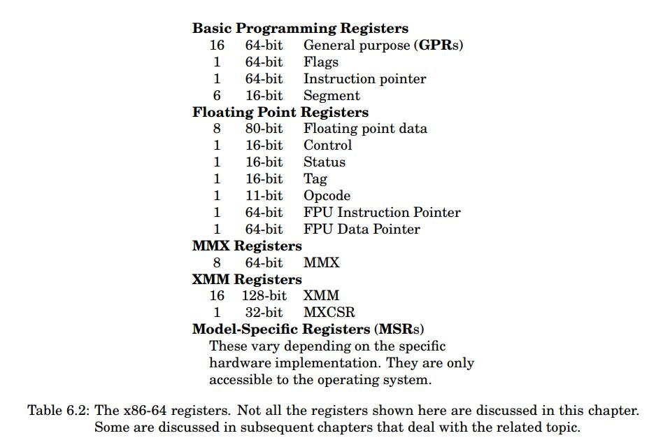
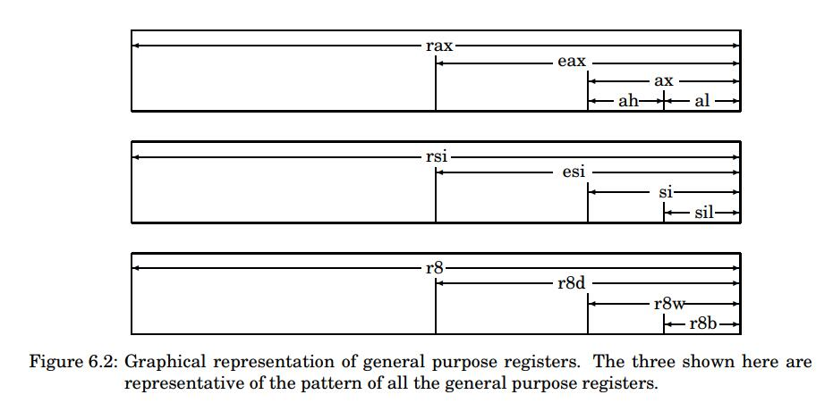
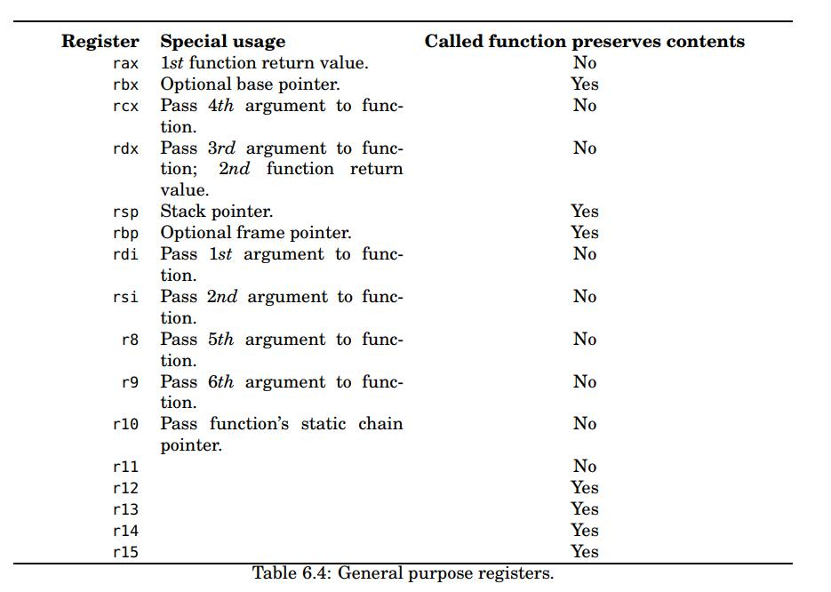
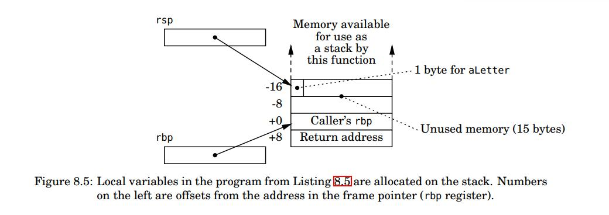
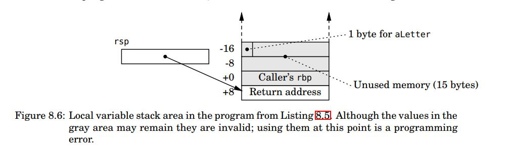
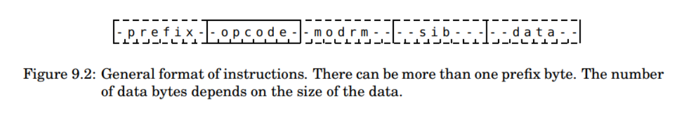
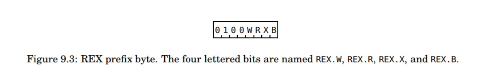
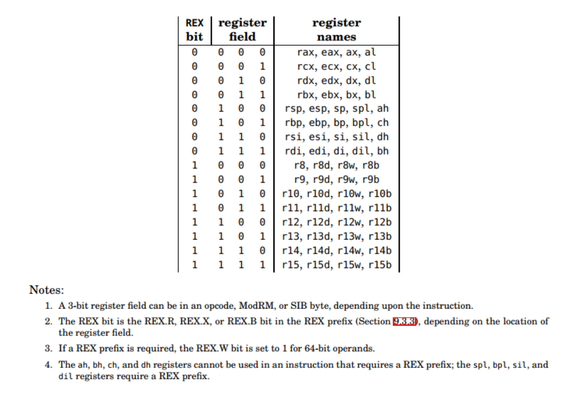
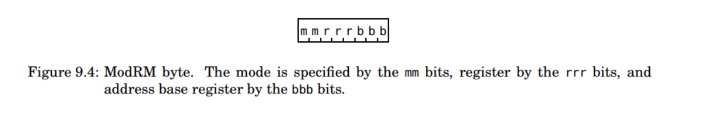
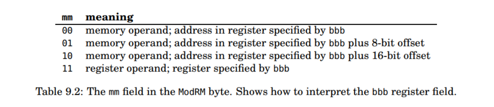

# 汇编笔记

几本书一起看，笔记互相添加，嗯，真是个糟糕的主意。目前实际上是《X86_64组织结构及汇编入门》的笔记，还没有王爽汇编的部分。

## 第一章-第三章

前面几章实际上没啥好说的，也就补码，反码那部分有点意思，不过原先上学的时候都学过。

## 第四章-第五章 逻辑门与逻辑电路

### 4.1-4.2 布尔逻辑基础

literal有两个含义

+ In [computer science](https://en.wikipedia.org/wiki/Computer_science), a **literal** is a notation for representing a fixed [value](https://en.wikipedia.org/wiki/Value_(computer_science)) in [source code](https://en.wikipedia.org/wiki/Source_code). 这个是给编程/计算机科学用的
+ In [mathematical logic](https://en.wikipedia.org/wiki/Mathematical_logic), a **literal** is an [atomic formula](https://en.wikipedia.org/wiki/Atomic_formula) (atom) or its [negation](https://en.wikipedia.org/wiki/Negation). The definition mostly appears in [proof theory](https://en.wikipedia.org/wiki/Proof_theory) (of [classical logic](https://en.wikipedia.org/wiki/Classical_logic)), e.g. in [conjunctive normal form](https://en.wikipedia.org/wiki/Conjunctive_normal_form) and the method of [resolution](https://en.wikipedia.org/wiki/Resolution_(logic)). 数学里面是个极简的数学公式
+ A presence of a variable or its complement in an expression.   布尔算式里面更具体

product term布尔逻辑里的“乘积表达式”，minterm每个变量都有的乘积表达式（无论里面是x还是^X），sum of products(SoP)乘积表达式的求和，sum of minterms(SoM)每个乘积表达式都是minterm的SoP

八种使得minterm为1的组合，如图

sum term布尔逻辑里的“加法表达式”，maxterm每个变量都有的加法表达式（无论里面是x还是^X），products of sums(PoS)加法表达式的求乘，product of materms(PoM)每个加法表达式都是maxterm的PoS

八种使得maxterm为0的组合，如图

### 4.3 布尔函数冷处理(?)

mSoP

mPoS

莫利斯卡诺，卡诺图K-map，非常有用的用于分析逻辑的方法，具体方法因为是英文版不是很清楚，明天查清了再写下来。


## 第六章 CPU

### 6.1 CPU总览

+ 总线
+ L1缓存
+ 寄存器
+ 指令指针
+ 指令寄存器
+ 控制单元
+ ALU
+ 标志寄存器

### 6.2 CPU寄存器








### 6.3 CPU与内存/IO的交互

### 6.4 CPU指令执行流程

现代处理器体系结构往往采用指令队列，那么如何进行指令执行流程呢？

### 6.5 使用GDB观察程序

一些指令:

+ N    代码行数级别的，不进入执行的单步执行
+ S    代码行数级别的，进入加执行的单步执行
+ SI   机器码级别的单步执行
+ Info Reg 查看寄存器

## 第七章：使用汇编语言编程

没什么特别值得记载的，只需要记住

movq %rsp, %rbp  #这里的%用来表示寄存器，AT&T语法的通用格式是movs src, dest。如果是inter语法，那么就反过来 movs dest, src。dest和src中至少得有一个寄存器

movl $0, %eax   #这里的$表示一个常量

leave 指令等同于

``` assembly
movq %rbp, %rsp
popq %rbp
```

+ b => byte => 8 bits
+ w => word => 16 bits
+ l => long => 32 bits
+ q =>quadword => 64 bis


## 第八章：程序数据-输入，存储，输出

### 8.1-8.3 设计本地变量的栈

一些最基础的东西：

+ 汇编传递参数的时候，用哪个寄存器传参数，约定俗称的，得看ABI。需要保存哪些二进制到栈里，也需要记录values in registers rbx, rbp, rsp, and r12 – r15 be preserved by the called function  。具体的ABISystem V Application Binary Interface AMD64 Architecture Processor Supplement  我上传到了网盘上，哪天上班的路上翻翻看。
+ 栈顶也就是RSP值得位置从来都是有数值的，进栈的时候是先减指针再放入数据`sp = sp-8;stack[sp]=value`，出栈的时候是先拿出来数据，再加指针`var=stack[sp];sp = sp+8`
+ .rodata对应于只读数据，
+ at&t 对应的rbp本地栈上变量的表示方法为`offset(register_name)  `，实际上我们就是在每个局部函数的栈帧(stack frame  )里修改本地变量，这里的栈帧指针就是frame pointer, rbp寄存器 。而stack pointer就是rsp寄存器

被调用函数在进入call之后，也就是刚执行的时候，它的流程为(这里有一点要注意，必须先保存caller's rbp再保存其他寄存器的值)：

+ Save the caller’s value in the frame pointer on the stack.  
+ Copy the current value in the stack pointer to the frame pointer.  
+ Subtract a value from the stack pointer to allow for the local variables.  

函数执行完毕的时候，我们可以观察到：

+ The local variables are located in an area of the call stack – between the addresses in the rsp and rbp registers.  
+ The rbp register is a pointer to the bottom (the numerically highest address) of the local variable area.  
+ The remaining area of the stack can be accessed using the stack pointer (rsp) as always.

下面的两张图，图8.5是刚进入call执行完头几步之后的栈帧的示意图。图8.6是执行完了leave，正要执行ret的时候的栈，可以看到局部变量都被释放了。可以注意到rbp寄存器的值同样是16的倍数。





几条新的指令，equ指令，leaq指令，ret指令作用不同：

+ ret指令相当于pop %rip
+ leaq用于取地址
+ que相当于给某个地址取名字

需要注意到，C中有两种类型的变量，static和automatic：

+ atuomatic类型在栈上建立
+ static程序一致性，该变量就建立了，然后在程序的生命周期一直活着

### 8.4 本地变量的栈

ABI规定了本地变量的栈上结构应该符合什么规律：

+ Each variable should be aligned on an address that is a multiple of its size.  
+ The address in the stack pointer (rsp) should be a multiple of 16 immediately before another function is called.  

总之就这两点，具体看ABI。


### 8.5-8.6 syscall系统调用和32位程序调用流程

本质上没啥变化，就不写了


## 第九章：计算

#### 9.3.2 机器码格式

eflags寄存器储存运算的结果。本章基本也属于理解性的东西比较多，唯一一个可能要知道就是编码格式。

每条指令可以拆分成1-15字节，不同的字节有不同的作用：

+ Opcode This is the first byte in the instruction and specifies the basic operation performed by executing the instruction. It can also include operand location.  如果没有prefix那么opecode就是第一个字节，opcode里面实际上也有w位
+ ModRM  The mode/register/memory byte specifies operand locations and how they are
  accessed.  
+ SIB The scale/index/base byte specifies operand locations and how they are accessed.  
+ Data These bytes are used to encode constants, either those that are part of the program, or those that are relative address offsets to operand locations in memory.  
+ Prefix If placed in before the opcode, these modify the behavior of the instruction, typically the size of the operands.  



#### 9.3.3 REX前缀

一般不加，加了是为了能够制定用哪个寄存器，使用四位来改变指令，因此REX.R, REX.X, and REX.B bits in the REX prefix byte as the high-order bits for specifying registers.  A fourth bit in the REX prefix, the REX.W bit, is set to 1 when the operand is 64 bits. For all other operand sizes — 8, 16, or 32 bits — REX.W is set to 0.  

这里要注意

+ 3bit的寄存器字段可以出在opcode/modrm/sib字段里，根据指令的不同。
+ rex bit包括rex.r，rex.x或者rex.b在REX前缀里
+ 如果需要协商rex前缀，那么64位指令的rex.w位必须为1






#### 9.3.4 modrm

表明操作数和地址的关系，mm都是11的话，那就是两个寄存器，其他情况会变







#### 9.3.5 SIB

这个暂时还没看到，先不用着急，等到了13章再回来补上


总之，机器码看的我很蛋疼。


## 第十章流程控制

### 10.1 循环

cmp指令，根据后面的b,w,l,q来判断后面的两个操作数。执行的操作是减法，只会改变EFLAGS寄存器的值，包括of,sf,zf,af,pf,cf。

test指令，根据后面的b,w,l,q来判断后面的两个操作数。执行的操作是bit-wise and  。只会改变EFLAGS寄存器的值，包括sf,zf,pf，cf和of都置为0，AF的值未定义。

jcc指令，cc根据不同的条件变化。这里面有个问题就是：

+ 比较的时候ja，就是jmp above，jb，就是jmp below也就是两个参与比较的数都是无符号数
+ 比较的时候jg，就是jmp greater，jl，就是jmp below，也就是两个参与比较的数都是有符号数

jmp指令，无条件跳转


## 结尾
唉，尴尬


