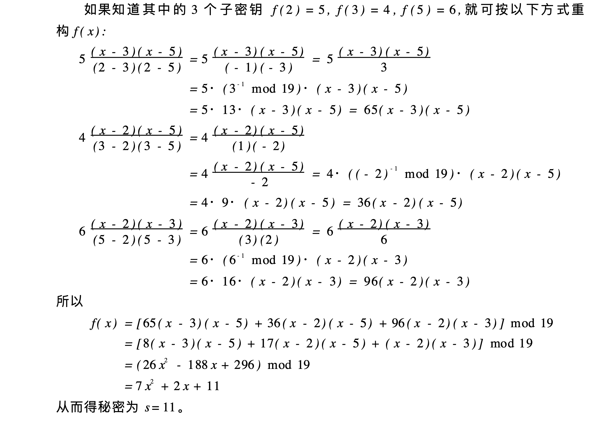

# 2021-02-22-安全方面的基础知识（数学篇+协议篇）


## 1 分组密码

### 1.1 分组密码是啥？

从本质来说，分组密码实际上是将明文分组后，和秘钥做X乘，得到的密文分组的流程。需要注意，加密前的分组数量n和加密后的分组数量m不一定相等（但一般实现都是相等的）。总之这种加密实际上就是数字序列的代换。这种加密方式要满足以下几个方面：

+ 分组长度n要足够大，从而保证分组代换字母表里的元素个数2^n足够大，防止明文穷举攻击。
+ 秘钥量要足够大，消减弱密钥的使用
+ 置换算法要复杂，别简单整个移位代换就完了。总之要能对抗：差分攻击和线性攻击。
+ 实现简单，出错恢复容易

### 1.2 安全的分组流程

因为分组密码本质是代换，因此就是要求实现从n==>2^n的拓展。但是问题来啦，n太大不好设计实现，n太小又太容易攻破。怎么办？所以分组密码设计小的加密单元，然后将内部拆成这些小单元做加密。为了对抗统计分析，常见的方法两种：

+ 扩散，扩散是隐藏明文的统计特性，从本质来说就是讲多个明文的统计特性转换为密文
+ 混淆，混淆是因为明文和密文之间的统计关系

### 1.3 基本的加密流程

基本的加密流程就是Feistel密码结构，实质是香农提出的乘积密码方法。

从本质来说就是这个流程，分组越大，轮数越多，秘钥越大，轮函数，子秘钥产生方法越夸张越安全。当然相对应的是实现的时候性能越低。
$$
L_{i}=R_{i-1}\\
R_{i}=L_{(i-1)}xorF(R_{(i-1)},K_{i})
$$


```mathematica
L(i)=R(i-1)
R(i)=L(i-1)异或F(R(i-1),K(i))
```

### 1.4 常见的分组密码

#### 1.4.1 DES算法

DES算法本质就是Feistel算法的多重应用，具体流程不多写，找本书一看就明白，很直接。无非就是Ri-1和Ki的计算过程稍微复杂些。

#### 1.4.2 AES算法

#### 1.4.3 商密SM4

#### 1.4.4 祖冲之密码

### 1.5 差分分析与线性密码分析

对于分组密码攻击的方式很多，不过下面两种最有效

+ 差分攻击：通过分析明文对的差值对密文对的差值的影响来回复某些秘钥比特
+ 线性攻击：利用密码算法的“不平衡的线性逼近”

### 1.6 分组密码的运行模式

+ ECB
+ CBC
+ CFB
+ OFB
+ CTR：每次使用递增的计数器参与加密运算，保证相同的数据不会产生相同的密文。但是实际上也没有完整性。

## 2 公钥密码

### 2.1 公钥密码体质的基本数学原理

基本的数学原理建议跟着《Introduction to Modern Cryptography，Second Edition》学习，当然，看完这本入门之后看《信息安全数学基础》也是足够的。

#### 2.1.1 群 环 域

群的定义和一部分性质

+ 半群：设$<G, *>$是一个代数系统，如果 $*$ 满足：（1）封闭性 （2）结合律，则称$<G, *>$是半群。
+ 群：设$<G, *>$是一个代数系统，如果 $*$ 满足：（1）封闭性 （2）结合律（3）存在元素e，对$∀a∈G$，有$a*e=e*a=a$；$e$称为$<G,*>$的单位元（4）对$∀a∈G$，有$a^{-1}$，使得$a*a^{-1}=a^{-1} * a=e$;称$a^{-1}$为元素$a$的逆元，则称$<G, *>$是群。也将$<G, *>$简称为G。这里加一条，如果群的元素是有限的，那么群元素的个数m，就是群的阶且：

> Let G be a finite group with m = |G|, the order of the group. Then for any element g ∈ G, $g^m = 1$.  

证明方式，是只针对阿贝尔群的，但是所有的有限群都通用。是利用:$g_1 · g_2 · · · g_m = (gg_1) · (gg_2) · · · (gg_m). $，因为$gg_i=gg_j$意味着$g_i=g_j$，所以右侧的元素都不相同，因此右边元素各不相同且也是这个群的元素。从而得出$g_1 · g_2 · · · g_m = (gg_1) · (gg_2) · · · (gg_m) = g^m · (g_1 · g_2 · · · g_m).  $。所以$g^m=1$.这个东西的推论(corollary  )是:

> Let G be a finite group with m = |G| > 1. Then for any g ∈ G and any integer x, we have gx = g[x mod m].  

这个东西是降低复杂度的有效方法。

+ Abel群：如果群G的$*$满足交换律，即对$∀a,b∈G$，有 $a * b=b*a$,则称$<G, *>$是Abel（阿贝尔）群。阿贝尔群使得很多证书操作都可以交换降低计算难度。

  $<A,+>$是Abel群，其中$I$是整数集合

  $<Q,*>$是Abel群，其中$Q$是有理数集合

  $<Z_n,+_n>$是Abel群，其中$Z_n={\{0,1,..,n-1\}}$,$+_n$是模加，$a+_n b$等于$(a+b) mod n$，$x^{-1} = n-x$。$<Z_n,*_n>$不是群，因为$0$没有逆元，这里$*_n$是模乘，$a*_n b$等于$(a*b) mod n$。**这里要注意，$Z_n={\{0,1,..,n-1\}}$这是一个常识。**

对于有限阿贝尔群的另一个推论

> Let G be a finite group with m = |G| > 1. Lete > 0 be an integer, and define the function fe : G → G by $f_e(g) = g^e$. If $gcd(e, m) = 1$, then fe is a permutation (i.e., a bijection). Moreover,if $d = e^{-1} mod m$ then $f^d$ is the inverse of $f^e$. (Note by Proposition 8.7, gcd(e, m) = 1 implies e is invertible modulo m.)  

证明比较简单，证明两者为逆很容易，这里加一个单词bijective双射，一一对应且每个都有映射，叫做双射。

+ 若$<G, *>$是群，$I$是整数集合。如果$∃g∈G$，$∀a∈G$，都有$i∈I$，$a=g^i$，则称$<G,*>$为循环群，$g$称为G的生成元，记$G=<g>={\{g^i|i∈I\}}$。称$a^m=e$的最小正整数$m$为$a$的阶，记为$|a|$。**注意：在密码学上，使用的群多为循环群，要注意循环群的性质！写在后面了**


环的定义

+ 环：设$<G,+， *>$是一个代数系统，如果 $*$与 $+$ 满足：（1）$<G,+>$是Abel群 （2）$<G,*>$是半群（3）乘法$*$在加法$+$上可分配，即对$∀a,b,c∈G$，有$a*(b+c)=a*b+a*c$，和$(b+c)*a=b*a+c*a$。则称$<G,+， *>$是一个环。


域的定义

+ 域：设$<G,+， *>$是一个代数系统，如果 $*$与 $+$ 满足：（1）$<G,+>$是Abel群 （2）$<G,*>$是Abel群（3）乘法$*$在加法$+$上可分配，即对$∀a,b,c∈G$，有$a*(b+c)=a*b+a*c$，和$(b+c)*a=b*a+c*a$。则称$<G,+， *>$是一个域。

  有限域是指域中元素个数有限的域，元素的个数为域的阶。弱$q$是素数的幂，即$q=p^r$，其中$p$是素数，$r$是自然数，则称阶为$q$的域为Galois域，记为GF(q)或$F_q$

#### 2.1.2 素数和互素数

+ 素数，除了正负1和正负自己没有其他因子的数字就是素数。相应的正整数可以由非0指数列表示，比方说$11011=7*11^2*13$，因此11011可以表示为$\{a_7=1,a_{11}=2,a_{13}=1\}$。可知，两数字相乘就是对应的系数相加。
+ 公因子，称c是a,b的最大公因子，如果：（1）c是a的因子，也是b的因子（2）a & b的任一公因子，也是c的因子。即$c=gcd(a,b)$
+ 公倍数，称c是a,b的最小公倍数，如果：（1）c是a的倍数，也是b的倍数（2）a & b的任一公倍数，也是c的倍数。即$c=lcm(a,b)$

实际上，我们相关联的点一般是：

+ If c | ab and gcd(a, c) = 1, then c | b. Thus, if p is prime and p | ab then either p | a or p | b.  
+ If a | N, b | N, and gcd(a, b) = 1, then ab | N.  


#### 2.1.3 模运算 与 模指数运算

模运算是指对整数取余，如果从映射的角度来考虑，模运算实际上是We refer to the process of mapping a to [a mod N] as reduction modulo N.  即一种映射关系。这里有个属于叫做congruent module，即全等取余We say that a and b are congruent modulo N, written a = b mod N, if [a mod N] = [b mod N] 。模运算或者说取余关系是一种很有趣的关系：

Congruence modulo N is an equivalence relation: i.e., it is reflexive (a =a mod N for all a), symmetric (a = b mod N implies b = a mod N), and transitive (if a = b mod N and b = c mod N, then a = c mod N). Congruencemodulo N also obeys the standard rules of arithmetic with respect to addition, subtraction, and multiplication; so, for example, if a = a′ mod N and b = b′ mod N then (a + b) = (a′ + b′) mod N and ab = a′b′ mod N. A consequence is that we can “reduce and then add/multiply” instead of having to “add/multiply and then reduce,” which can often simplify calculations.  

比方说计算$[1093028 · 190301 mod 100] $ ，可以先计算$1093028 · 190301 = [1093028 mod 100] · [190301 mod 100] mod 100 = 28 · 1 = 28 mod 100.$  但是module操作并不能约去共同的约数。


设$Z_8={\{0,1,..,7\}}$，可通过运算得到不是每个Z_8中的元素都有逆元，经过仔细观察可以发现，实际上只有和8互素的元素$1,3,5,7$才有乘法逆元。因此我们可以轻易的得到一条模运算的定理，赘述一条，计算时间为多想时间。

Let b, N be integers, with b ≥ 1 and N > 1. Then b  is invertible modulo N if and only if gcd(b, N) = 1  

记$Z_{n}^{*}={\{a|0<a<n,gcd(a,n)=1\}}$，必然有$Z_{n}^{*}$中的每个元素都有乘法逆元，这里的$Z_{n}^{*}$也是一个通用符号，需要记住。$Z_{n}^{*}$实际上是个乘法操作下的阿贝尔群。从$|Z_{n}^{*}|$拓展就得到了欧拉函数也就是$φ(N)$

模指数是指对给定的正整数$m,n$，计算$a^m mod n $。下面给个简单的例子

$a=7,n=19$则容易求出$7^1=7mod19,7^2=11mod 19,7^3=1mod19$，容易知道计算的周期为3，称满足$a^m=1modn$的最小正整数m为模n下a的阶，记为$ord_{n}(a)$、易知如果$a^m=1modn$，则$a^k=1modn$必然有k为m的倍数。


#### 2.1.4 费马定理，欧拉定理，卡米歇尔定理

+ 费马定理：若p是素数，a是正整数，且$gcd(a,p)=1$，则$a^{p-1}=1mod { p}$

+ 欧拉函数：设n是一个正整数，小于n且与n互素的正整数的个数为n的欧拉函数，记为$φ(n)$，有以下结论：

  (1) 若$n$为素数，则$φ(n)=n-1$

  (2) 若$n$是素数$p$与$q$的乘积，则$φ(n)=（p-1)(q-1)$

  (3) 若$n$有标准分解式，$n=p_{1}^{α_1}p_{2}^{α_2}...p_{t}^{α_t}$，则$φ(n)=n(1-1/p_{1})(1-1/p_{2})...(1-1/p_{t})$

  相对应地，我们给出每一条的证明：

  (1) $n$为素数，则$φ(n)=n-1$不需要复杂证明

  (2) 若$n$是素数$p$与$q$的乘积，那么a ∈ {1, . . . , N - 1} is not relatively prime to N, then either p | a or q | a (a cannot be divisible by both p and q since this would imply pq | a but a < N = pq).  所以 $φ(n)=(N - 1) - (q - 1) - (p - 1) = pq - p - q + 1 = (p - 1)(q - 1). $ 

  (3)

+ 欧拉函数：若$a$和$n$互素，则$a^{φ(n)}=1modn$。证明很简单，因为$gcd(a,n)=1$，且$a<n$所以$a∈Z_{N}^{*}$。$φ(n)$又是$Z_{N}^{*}$的阶，参照2.2.1里群环域的第一个推论。除此之外，可知，$ord(a)|φ(n)$，如果$ord(a)=φ(n)$，则a是n的本原根，即$a^{1},a^{2},a^{3}...a^{φ(n)}$在mod n下互不相同且都与n互素。

+ 卡米歇尔定理：


#### 2.1.5 素性检验

Miller–Rabin 算法， 基于概率的算法，如果N是素数，必然有每个$a^{N-1}$对N取余都为1，一个不符合就说明条件不成立。之所以用这个算法是因为这个算法的效率比较高，而且尝试的次数越多，出错的概率越低。

> Input: Integer N and parameter 1t  
>
> Output: A decision as to whether N is prime or composite  
>
> for i = 1 to t:  
>
> ​		a ← {1, . . . , N - 1}  
>
> ​		if $a^{N-1} ̸= 1 mod N$ return “composite”  
>
> return “prime”  


证明需要两个引理：

1 Let G be a finite group, and H ⊆ G. Assume H is nonempty, and for all a, b ∈ H we have ab ∈ H. Then H is a subgroup of G. 

2  Let H be a strict subgroup of a finite group G (i.e., H ̸= G). Then |H| ≤ |G|/2.  

使用这两个引理退出来第三个引理，这第三个引理是使得初始的Miller-Rabin貌似正确的途径，但是问题就在于引理3的这个条件，如果不存在一个witness就完蛋了：

3 Fix N. Say there exists a witness that N is composite. Then at least half the elements of $Z^∗_N$ are witnesses that N is composite.  

引理3里面的假设是必然存在witness，这个假设是证明流程里面的一个非常重要的前提。这个证明的流程可以说是非常奇特了：假设存在winess，然后证明非witness的集合的是（真）子群，其个数小于$\frac{|G|}{2}$。那么必然有witness的个数大于$\frac{|G|}{2}$，问题就在于不一定存在一个witness。

我们重点关注的数是$Z^∗_N$里面的数字，因为$Z^*_N$里面的数字少，简单，好计算。


但是初始的Miller-Rabin算法对于Carmichael number无效。Carmichael number是个很蛋疼的东西，Carmichael number是指，该数字n是个合数，但是所有和该数字互素的数b都满足，$b^{n-1}=1 (mod n)$，举一个最简单的例子，最小的carmichael Number，$561=3*11*17$。因此需要执行对Miller-Rabin素性检验的改进。

Miller-Rabin的改进依赖于以下引理：

Say $x ∈ Z^∗_N$ is a square root of 1 modulo N if x2 = 1 mod N. If N is an odd prime then the only square roots of 1 modulo N are [±1 mod N].  

换言之，初始的素性检验先拿到$N - 1 = 2^ru  $，然后只需要计算$a^{2r}u = 1 mod N  $。修正过的素性检验，分别计算$a^{2^r}u = 1 mod N  $，另r=0,1,...n-1不断变化。我们称Say that $a ∈ Z^∗_N$ is a strong witness that N is composite (or simply a strong witness) if (1) $a^u≠ ±1 mod N$ and (2) $a^{2^i}u≠ -1 mod N$ for all $i ∈ {1, . . . , r - 1}. $  换言之，这个strong witness比初始的Miller-Rabin更宽泛：

+ a如果不是strong witness，那么a必然不是witness。
+ 如果a是witness，那么a必然是strong witness。
+ a是strong witness，但是a不一定是witness。
+ strong witness比witness的概率要高，出现的数字的可能性更大。

利用上面的引论，给出来两个结论：

1对素数而言是不存在strong witness的， We conclude that when N is an odd prime there is no strong witness that N is composite.  

2 Let N be an odd number that is not a prime power. Then at least half the elements of$ Z^∗_N$ are strong witnesses that N is composite.

第二个结论的推导稍微花一些时间，Let $Bad ⊆ Z^∗_N$ denote the set of elements that are not strong witnesses. We define a set $Bad^′ $and show that: (1) Bad is a subset of Bad′, and (2) $Bad^′$ is a strict subgroup of $Z^∗_N$. This suffices because by combining (2) and Lemma 8.37 we have that $ |Bad^′| ≤ |Z^∗_N|/2$. Furthermore, by (1) it holds that $Bad ⊆ Bad^′$, and so $|Bad| ≤ |Bad^′| ≤ |Z^∗_N|/2$ as in Theorem 8.38. Thus, at least half the elements of $Z^∗_N$ are strong witnesses. (We stress that we do not claim that Bad is a subgroup of $Z^∗_N$.)   前面的证明结束了，就需要证明$Bad^,$存在即可。这里可以令Let $i ∈ \{0, . . . , r −1\}$ be the largest integer for which there exists an a ∈ Bad with $a^{2^iu} = ±1 mod N$，然后证明$Bad ⊆ Bad′  $;$Bad′$ is a subgroup of $Z^∗_N$ .  ;$Bad′$ is a strict subgroup of $Z^∗_N.$  
$$
Bad′ = \{a | a^{2^iu} = ±1 mod N\}.\\
$$


最终改进的 Miller-Rabin算法为：

> Input: Integer N > 2 and parameter 1^t
>
> Output: A decision as to whether N is prime or composite  
>
> if N is even, return “composite”  
>
> if N is a perfect power, return “composite”  
>
> compute r ≥ 1 and u odd such that $N - 1 = 2^ru$  
>
> for j = 1 to t:  
>
> ​		a ← {1, . . . , N - 1}  
>
> ​		if $a^u ≠ ±1 mod N$ and $a^{2^i}u ≠ -1 mod N$ for i ∈ {1, . . . , r - 1}  
>
> ​				return “composite”  
>
> return “prime”  


#### 2.1.6 欧几里得算法

欧几里得算法不但可以用来算公因子，也可以算乘法逆元？

欧几里得算法的正向使用，换言之，有了欧几里得算法，可以再多项式复杂度下求出$gcd(a,b)$

+ 设$a,b$是任意的正整数，将$gcd(a,b)$记为$(a,b)$。必然有$(a,b)=(b,a mod b)$
+ 如果$(a,b)=1$，则$b$在$mod a$下有乘法逆元，即存在一个x，使得$bx=1mod a$。

欧几里得算法的逆向使用，求乘法逆元可用，具体看（《Introduction To Moder Cryptography, Second Edition》的Appendix B.1.2。）有两个定义：

+ 如果$(a,b)=1$,则$b$在$moda$下有乘法逆元，即存在一个$x$使得$bx=1moda$。推广的欧几里得算法先求出$(a,b)$。如果$(a,b)=1$时，返回b的逆元。
+ 若$a$和$b$为正整数，则存在整数$x,y$使得$gcd(a,b)=ax+by$。实际上如果$gcd(a,b)=1$，那么第二个模式对a取余就得到$by=1moda$，y就是乘法逆元。此外还有一点要注意，$gcd(a,b)=ax+by$同时意味着，$gcd(a,b)$是可以表示为$ax+by$的最小整数，且$gcd(a,b)$被$ax+by$里面的每个元素整除。

第二点的证明：

To see this, take an arbitrary $c ∈ I$ and write $c = X′a + Y ′b$ with $X′, Y ′ ∈ Z.$ Using division with remainder (Proposition 8.1) we have that $c = qd + r$ with q, r integers and $0 ≤ r < d.$ Then $r = c - qd = X′a + Y ′b - q(Xa + Y b) = (X′ - qX)a + (Y ′ - qY )b ∈ I$. If r ̸= 0, this contradicts our choice of d as the smallest positive integer in I (because r < d). So, r = 0 and hence d | c. This shows that d divides every element of I.  

又因为$a,b∈I$，所以d是最大公约数，

具体的伪代码我明天更新


#### 2.1.7 中国剩余定理

数论中最有用的一个工具，它有两个用途：

+ 已知某个数关于一些两两互素的树的同余类集
+ 将大数用小数表示，大数的运算通过小数来实现。

用markdown公式来表示，就是已知下面的条件：

设$m_1m_2m_3...m_k$是两两互素的正整数，$M=\prod_{i=1}^{k}{m_i}$，则一次同余方程

+ $a_1(mod m_1)=x$
+ $a_2(mod m_2)=x$
+ ...
+ $a_k(mod m_k)=x$

对模M有唯一解：

+ $x= (\frac{M}{m_1}e_1a_1+\frac{M}{m_2}e_2a_2+...+\frac{M}{m_k}e_ka_k)(modM)$，其中$\frac{M}{m_i}e_i=1(modm_i)$


中国剩余定理是可以用群的问题来说明的，首先给出同构的定义和运算的方式：

Let G, H be groups with respect to the operations $◦G, ◦H$, respectively. A function$ f : G → H$ is an isomorphism from G to H if:
 1  $f $ is a bijection, and
 2  For all $g_1, g_2 ∈ G$ we have $f(g_1 ◦_G g_2) = f(g_1) ◦_H f(g_2)$.
If there exists an isomorphism from G to H then we say that these groups are isomorphic and write $G ≃ H$.  

同构的运算方式：
$$
(g, h)◦(g^′, h^′) = (g ◦_G g^′, h ◦_H h^′).// 这里的=是定义为
$$


中国剩余定理的群定义方式：

Let $N = pq$ where $p, q > 1$ are **relatively prime**. Then $ Z_N ≃ Z_p × Z_q$ and $Z^∗_ N ≃ Z^∗ _p × Z^∗_ q$.
Moreover, let f be the function mapping elements $x ∈ {0, . . . , N − 1}$ to pairs $(x_p, x_q) $with $x_p ∈ {0, . . . , p − 1}$ and $x_q ∈ {0, . . . , q − 1}$ defined by
$$
f(x)  = ([x mod p], [x mod q])
$$
Then f is an isomorphism from $Z_N$ to $Z_p × Z_q$, and the restriction of f to $Z^∗_N$ is an isomorphism from $Z^∗_ N$ to $Z^∗_ p × Z^∗_ q$。这里实际上不一定是$N=pq$，可以是$N=p_1p_2p_3...p_n$。换言之$ Z_N ≃ Z_{p_1} × Z_{p_2}...× Z_{p_l}$ and $Z^∗_ N ≃ Z^*_{p_1} × Z^*_{p_2}...× Z^*_{p_l}$.

中国剩余定理的证明（使用群的基础知识）：

首先证明是双射，然后证明同构定义的第二点即可。


常见的中国剩余定理的运用往往集中在求模上，比方说求$11^{53} mod 15 $ ，求解$29^{100} mod 35 $ 。这时主要的问题就变成了，how to convert back and forth between the representation of an element modulo N and its representation modulo p and q.  从N到对p、q取余很简单，如何反向运算呢即给出了$(x_p, x_q)$，怎么计算原来的数字呢？方法如下：

+ an element with representation $(x_p, x_q)$ can be written as $(x_p, x_q) = x_p · (1, 0) + x_q · (0, 1)$.  
+ 由于$gcd(p,q)=1$，可以得到$Xp+Yq=1$
+ Set $1_p := [Yq mod N]$ and $1_q := [Xp mod N]$.  
+ Compute $x := [(x_p · 1_p + x_q · 1_q) mod N]$.  


#### 2.1.8 离散对数和平方剩余

##### 2.1.8.1 离散对数discrete logarithm  

离散对数问题实际上就称为DLP问题，也就是discrete-logarithm problem，设p是一个素数，a是p的本原根，则$a,a^2,...,a^{p-1}$产生了$1～p-1$之间的所有值，且每个值只出现一次。之所以关注离散对数，因为离散对数需要多项式时间（多项式时间就是计算的高速），好生成也容易管理/计算。这里需要注意的是discrete是离散的意思。很有趣的事情是，离散对数的计算同样符合数学的计算：

+ $log_g 1 = 0$ (where 1 is the identity of G)  
+ for any integer r, we have $log_g h^r = [r · log_g h mod q];$  
+ $log_g(h_1h_2) = [(log_g h_1 + log_g h_2) mod q]$.  

离散对数问题实际上就是Diffle-Hellman的基本原理，第一个问题是怎么判断一个离散对数，步骤很简单，但是具体的复杂度会很多：

+ Run G(1n) to obtain (G, q, g), where G is a cyclic group of order q (with ∥q∥ = n), and g is a generator of G.  
+ Choose a uniform h ∈ G  
+ $A$ is given G, q, g, h, and outputs $x ∈ Z_q$. 
+  The output of the experiment is defined to be 1 if $g^x = h$, and 0 otherwise.  

要注意的一点是离散对数并不一定是困难的，如果每个算法$A$都是困难的，离散对数难以计算的假设是：

We say that the discrete-logarithm problem is hard relative to G if for all probabilistic polynomial-time algorithms A there exists
a negligible function negl such that $Pr[DLog_{A,G}(n) = 1] ≤ negl(n)$.  

$Pohlig–Hellman \space algorithm$算法证明如果阶为q的群有小素数银子，那么DLP变地简单一些，这并不代表一下子就成为简单问题了。


现在我们考虑怎么生成一个有限群，

名词解释：

+ DLP：离散对数问题。例如在整数模11乘法群中容易计算5×5×5×5=9 mod 11，那么求几个5相乘的结果是9这个问题就是一个离散对数问题。当模数为很大的质数时，这个问题是困难的。

##### 2.1.8.2 平方剩余

平方剩余：设n为正整数，a是整数，满足$gcd(a,b)=1$，称a是模n的平方剩余，如果下面的方程有解
$$
x^2=a(modn)
$$
设p是素数，a是一个整数，勒让德(Legendre)符号$(\frac{a}{p})$的定义如下
$$
\frac{a}{p}=
\begin{cases}
0 & \text{如果a被p整除}\\
-1 & \text{如果a是模p的平方剩余}\\
1 & \text{如果a是模p的非平方剩余}
\end{cases}
$$
下面是更一般的雅克比符号，设n是正整数，且$n=p{_1}^{a_1}p{_2}^{a_2}...p{_k}^{a_k}$，则雅克比符号为：

$(\frac{a}{n})=(\frac{a}{p_1})^{a_1}(\frac{a}{p_2})^{a_2}...(\frac{a}{p_k})^{a_k}$

可以看到，当n时素数的时候雅克符号退化为勒让德符号。

#### 2.1.9 循环群 及其性质和双线性映射

##### 2.1.9.1 循环群性质

Let G be a finite group and g ∈ G. The order of g is the smallest positive integer i with $g^i = 1$.  

自然就能得出下一个结论：

Let G be a finite group of order m, and say g ∈ G has order i. Then $i | m$。可以轻易得出，一个元素如果是生成元，必然有该元素的阶等于优先群的阶，换言之可以生成每个元素。

自然就有：

If G is a group of prime order p, then G is cyclic. Furthermore, all elements of G except the identity are generators of G.  

另一条循环群的性质，If p is prime then $Z^∗_p$ is a cyclic group of order p - 1.  

很有趣的一点，优先循环群同构于加群$Z/nZ$，使用标准的语言来表示：

Let G be a cyclic group of order n, and let g be a generator of G. Then the mapping $f : Z_n → G$ given by $f(a) = g^a$ is an isomorphism between Zn
and G. Indeed, for $a, a^′ ∈ Z_n$ we have 
$$
f(a + a^′) = g^{[a+a^′ mod n]} = g^{a+a^′} = g^a · g^{a^′} = f(a) · f(a′).
$$

Bijectivity of f can be proved using the fact that n is the order of g.  

书上最后给出了一段似是而非的解释，这个等到第九章再联系。

##### 2.1.9.3 双线性映射

双线性映射早期是一种对椭圆曲线的攻击方式：利用双线性对将ECDLP问题规约到DLP问题的MOV攻击。但这种攻击方式是有限的，只能对参数满足一定条件的曲线进行攻击。2000年双线性对开始在密码学领域得到重视，成果有基于身份的密码体制（IBE）、三方一轮密钥协商、BLS签名算法等。三方一轮的流程如下：


设q是一个大素数，$G_1$，$G_2$和$G_T$是两个阶为q的群，三者其上的运算都包含加法和乘法。三者存在一个映射关系$e:G_1×G_2→G_T$，满足以下特性：

+ 双线性：有$∀g_1∈G_1,g_2∈G_2,a,b∈Z_p$，均有$e(g_1^a,g_2^b)=e(g_1,g_2)^{ab}$
+ 非退化性：$∃g_1∈G_1,g_2∈G_2$，满足$e(g_1,g_2)≠1_{G_T}$
+ 可计算性：存在有效的算法，对于$∀g_1∈G_1,g_2∈G_2$，均可计算$e(g_1,g_2)$


下面给出一些名词解释：

+ MOV攻击：又称MOV规约攻击，是Menezes、Okamoto和Vanstone三人的论文中提出的针对特殊椭圆曲线离散对数问题（ECDLP）的一种有效解法。通过双线性配对，将椭圆曲线上的离散对数问题规约成为某个乘法群上的离散对数问题，能够在亚指数步骤中计算ECDLP。
+ 
+ ECDLP:椭圆曲线离散对数问题。例如已知P、Q是两个椭圆曲线点，并且4个P相加得到Q，那么已知P和Q求解几个P相加得到Q的问题就是椭圆曲线离散对数问题。当选择的曲线满足一定要求时，该问题是困难的。

#### 2.1.10 椭圆曲线的点乘运算方式

椭圆曲线怎么计算呢？密码学中使用的一般都是有限域上的椭圆曲线，其一般性定义为：
$$
E(Z_p) = \{H(x, y) | x, y ∈ Z_p\space and\space y^2 = x^3 + Ax + B \space mod p\}I ∪ {O}.
$$
最常见的形式都是：
$$
y^2=x^3+ax+b /*形式*/\\
(a,b∈GF(p)， 4a^3+27b^2≠0) /*条件*/
$$
那么如何进行椭圆曲线点乘的运算呢？使用曲线图理解会简单很多，椭圆曲线的加法实际上也是由此定义的

设$P=(x_1,y_1),Q=(x_2,y_2),P≠-Q$，则$P+Q=(x_3,y_3)$由以下规矩确定：
$$
x_3=λ^2-x_1-x_2(modp) \\
y_3=λ（x_1-x_3)-y_1(modp)
$$
其中，这里要注意这里的中间的横杆是“除法“，也就是说这里出现了有限域的离散取余
$$
λ=
\begin{cases}
\frac{y_2-y_1}{x_2-x_1} & \text{P≠Q}\\
\frac{3x_1^2+a}{2y_1} & \text{P=Q}
\end{cases}
$$
举个简单的例子我们对椭圆曲线$E_{23}(1,1)$上的$P=(3,10),Q=(9,7)$求$P+Q$，有：
$$
λ=\frac{7-10}{9-3}=\frac{-3}{-6}=\frac{-1}{2}=-1*2^{-1}mod{23}=-1*12mod{23}=11mod23\\/*2^{-1}也就是2的逆元是12，可使用上面的欧几里得求逆*/\\
x_3=11^2-3-9=109=17mod23\\
y_3=11(3-17)-10=20mod23
$$


有了上面的流程，一个新的问题就出现了，求解λ的时候，怎么求对应的乘法逆元呢？

```c++
void exgcd(int a, int b, int& x, int& y) {
  if (b == 0) {
    x = 1, y = 0;
    return;
  }
  exgcd(b, a % b, y, x);
  y -= a / b * x;
}
```


### 2.2 公钥密码体制的基本概念


### 2.3 常见的公钥密码体制

#### 2.3.1 RSA加密

RSA的安全性实际上和大数分解是相关的，没办法很简单地将n分解为两个大数。

+ 选取p和q，两个保密的大素数
+ $n=p*q$，$φ(n)=（p-1)(q-1）$，$φ(n)$是$n$的欧拉函数
+ 选择$e$，有$1<e<φ(n)$，且$φ(n)$和$e$互素
+ 计算$d*e=1 mod φ(n)$，因为$e$和$φ(n)$互素，所以$d$一定存在。
+ 选择$（d,n）$为私钥，$（e,n）$为公钥

加密的时候$c=m^e mod n$，解密的时候$m = c^d mod n$。

#### 2.3.2 椭圆曲线密码体制

椭圆曲线的安全性利用的是对椭圆曲线构成的Abel群$E_p(a,b)$上考虑方程$Q=kP$，从k和P易得出Q，但是从Q难以计算P。

+ 首先需要选取一个大素数$p≈2^{180}$和两个参数a、b。可得椭圆曲线极其上面的点构成的Abel群$E_p(a,b)$。第二步选择$E_p(a,b)$的一个生成元$G(x_1,y_1)$，要求G的阶是一个非常大的素数，G的阶是满足$nG=o$的最小整数n。$E_p(a,b)$和G作为公开参数。

+ 用户A选择$d_A$为私钥，计算公钥$Q_A=d_A G$，此时A的密钥对为$（d_A,Q_A)$。用户B选择$d_B$为私钥，计算公钥$Q_B=d_B G$，此时B的密钥对为$（d_B,Q_B)$
+ A和B分别选择各自的$Q_A$和$Q_B$发送到对端，然后A和B分别计算$(x_k,y_k)=d_A Q_B$和$(x_k,y_k)=d_B Q_A$。选择一部分作为共享的计算结果
+ 易知$d_A Q_B=d_A *d_B * G = d_B *d_A * G = d_B Q_A$，因此两边的数字一致。而攻击者只能拿到曲线，基点和两个公钥$Q_A,Q_B$。无法从公钥逆推私钥，因此提供保密性


#### 2.3.3 ElGamal密码体制


## 3 秘钥分配和管理

### 3.1 秘钥管理

常用的秘钥分配方式是有一个可信中心，挑选一个秘钥，然后在安全信道发送给用户。这种方法要求每个用户在该可信中心有一个主密钥，因此n个用户n个主密钥。为了保证n个用户相互通信的安全，回话秘钥为n(n-1)/2个。主密钥并不多，很方便。这里面还有几个问题。

+ 秘钥的分层。分层的KDC减少了主密钥的分布
+ 秘钥的有效期。面向连接的协议由于回话可能很久，因此需要定期更新秘钥。无连接的协议必须每次都更新，这种最好周期利用同一秘钥。
+ 纯无中心的秘钥控制。这种方式并不安全。

### 3.2 公钥加密体质的秘钥管理

这个实际上没啥好说的，公钥加密体质必须有个可信方。

### 3.3 随机数安全

#### 3.3.1 随机数产生算法，常规方法

一般来说怎么衡量随机数的随机性呢？考察两个方面：

+ 是不是均匀分布，也就是
+ 是否满足独立性，也就是不能由其它的数字推导出来另一个数字。

目前常见的伪随机数产生器是线性同余算法，也就是
$$
X_{n+1}=(aX_n+c) mod {m}
$$
这里面a,c,m是产生高质量随机数的关键，为了让重复的周期扩大，一般是m取计算机能表示的最大整数。当然这里面需要一个X_0作为起始种子。除了上面的形式，还有
$$
X_{n+1}={X_n}^d mod m
$$
如果选择m是大素数乘积，d是RSA密钥，满足gcd(d,fai(m)) =1，那这就是RSA产生器。


#### 3.3.2 基于密码算法的随机数产生器

+ 循环加密，主密钥保密，计数器循环加密并计算，可以用来产生随机数。
+ DES的OFB反馈，
+ ANSI X9.17伪随机数产生器，3des+日期+种子

#### 3.3.3 随机比特产生器

+ BBS产生器：这个是目前已知强度最强两个大素数p和q，满足p=q=3(mod 4)，令n = p×q，再选择一个随机数s，使s与n互素。最后一位的目的是取最低有效位置。这个的难度是基于大整数分解难题。
  $$
  X_0  =  (s^2)mod n\\
  for{\,}{\,}{\,}{\,} i  = {\,}1{\,}to{\,} ∞ \\
  X_i  =  (X_{i - 1} ^ 2 )mod {\,}n\\
  B_i  =  X_i mod 2
  $$
  
+ Rabin产生器：k是一个大于等于2的整数，在$[2^k，2^{k+1}]$之间选取两个奇素数，p,q，有p=q=3(mod 4)，迭代公式为
  $$
  X_i=(X_{i-1}^2)mod n{\,}{\,}{\,}{\,}{\,}{\,}{\,}{\,}{\,}{\,}{\,}{\,}if (X_{i-1}^2)mod n < n/2\\
  X_i = n -(X_{i-1}^2)mod n{\,}{\,}{\,}{\,}{\,}{\,}{\,}{\,}{\,}{\,}{\,}{\,}if (X_{i-1}^2)mod n > n/2
  $$
  
+ 离散指数比特序列产生器

#### 3.3.4 crypto++的随机数实现

crypto++的随机数同样需要先seed，而且不是线程安全的实现。

crypto++的随机数算法比较多：

+ [LC_RNG](https://www.cryptopp.com/wiki/LC_RNG) is a Linear Congruential Generator。也就是线性同余方法
+ `RandomPool` is a PGP style random pool，实际上是AES加密算法
+ AutoSeededX917RNG，就是上面的ANSI X9.17算法
+ NIST算法


#### 3.3.5 openssl的随机数实现

Openssl内部实现了足够安全的随机数产生器，使用的算法包括NIST, ANSI X9 committee (X9.17 and X9.31)等算法。

默认情况下openssl使用md5作为随机数产生函数。一般情况下openssl使用/dev/urandom作为随机数产生器的种子源。设置好seed之后，可以通过软算方式获得产生的密钥。

如果你是openssl1.0.1，使用的cpu是i5/i7三代cpu也可以使用硬件随机数产生器。

### 3.4 秘密分割

门限这个东西有点类似分割的藏宝图，一个人份的藏宝图找不到东西，只有一定数量人份的藏宝图才能找到宝藏。完整的定义是：

设秘密S被分成n个部分，每一部分信息称为一个子密钥/影子，由一个参与者持有，使得：

+ 由k个或多于k个参与者所持有的部分信息可重构s
+ 由少于k个参与者所持有的部分信息则无法重构s

这种方案，被称为(k,n)-秘密分割门限方案，k称为方案的门限值

#### 3.4.1 Shamir门限

翻译为“沙米尔”门限，基于多项式的拉格朗日差值公式，插值是古典数值分析的一个基本问题：已知一个函数$φ(x)$在$k$个互不相同的点的函数值为$φ(x_i)(i=1,...,k)$，寻求一个满足$f(x_i)=φ(x_i)(i=1,...,k)$的函数$f(x)$，用来逼近$φ（x)$。$f(x)$被称为$φ(x)$的插值函数，$f(x)$可取自不同的函数类，即为代数多项式，也可为三角多项式或有理分式。若取$f(x)$为代数多项式，则称插值问题为代数插值。

拉格朗日插值：已知一个函数$φ(x)$在$k$个互不相同的点的函数值为$φ(x_i)(i=1,...,k)$，可构造k-1次插值多项式为
$$
f(x)=∑_{j=1}^{k}{φ（x_j）}\prod_{l=1;l！=j}^{k}{((x-x_l)/(x_j-x_l))}
$$
利用的东西是$(k,n)$可知$f(0)$。

实际上，如果有了足够的信息，不一定得先算出来f(x)，直接调用公式计算f(0)，也就是s即可
$$
f(0)=s=（-1）^{k-1}∑_{j=1}^{k}{f（i_j）}\prod_{l=1;l！=j}^{k}{((i_l)/(i_j-i_l))}
$$
这种门限方法vault用了。

举一个简单的例子，$k=3, n=5,q=19,s = 11$,随机选取$a_1 = 2, a_2 = 7$​得多项式为
$$
f(x)=(7x^2+2x+11)mod 19
$$
分别计算f(1) = 1, f(2) = 5, f(3) = 4, f(4) = 17, f(5) = 6，所以如果知道三个子密钥f(2) = 5, f(3) = 4, f(5) = 6就可以得到下面的过程




这里注意都是有限域上的计算，vault用的是GF(2^8)，乘法是正常取余数，除法是先转换为log，然后两者相减然后加255再对255取余数。+法是亦或

理解除法/乘法看这个链接 https://mathoverflow.net/questions/223515/how-to-calculate-log-or-exp-of-a-value-in-gf2n-using-log-exp-table-of-gf2k

```go
package shamir


import (
	"crypto/rand"
	"crypto/subtle"
	"fmt"
	mathrand "math/rand"
	"time"
)

const (
	// ShareOverhead is the byte size overhead of each share
	// when using Split on a secret. This is caused by appending
	// a one byte tag to the share.
	ShareOverhead = 1
)

// polynomial represents a polynomial of arbitrary degree
type polynomial struct {
	coefficients []uint8    //uint8数组系数，构成一个多项式，每个系数都是uint8的值
}

// makePolynomial constructs a random polynomial of the given
// degree but with the provided intercept value.  intercetpt value实际上就是解决值，就是x为0时的y值，也是我们的s
func makePolynomial(intercept, degree uint8) (polynomial, error) {
	// Create a wrapper
	p := polynomial{
		coefficients: make([]byte, degree+1),
	}

	// Ensure the intercept is set
	p.coefficients[0] = intercept

	// Assign random co-efficients to the polynomial
	if _, err := rand.Read(p.coefficients[1:]); err != nil {
		return p, err
	}

	return p, nil
}

// evaluate returns the value of the polynomial for the given x
func (p *polynomial) evaluate(x uint8) uint8 {
	// Special case the origin
	if x == 0 {
		return p.coefficients[0]
	}

	// Compute the polynomial value using Horner's method.
	degree := len(p.coefficients) - 1
	out := p.coefficients[degree]
	for i := degree - 1; i >= 0; i-- {
		coeff := p.coefficients[i]
		out = add(mult(out, x), coeff)
	}
	return out
}

// interpolatePolynomial takes N sample points and returns
// the value at a given x using a lagrange interpolation.
func interpolatePolynomial(x_samples, y_samples []uint8, x uint8) uint8 {
	limit := len(x_samples)
	var result, basis uint8
	for i := 0; i < limit; i++ {
		basis = 1
		for j := 0; j < limit; j++ {
			if i == j {
				continue
			}
			num := add(x, x_samples[j])
			denom := add(x_samples[i], x_samples[j])
			term := div(num, denom)
			basis = mult(basis, term)
		}
		group := mult(y_samples[i], basis)
		result = add(result, group)
	}
	return result
}

// div divides two numbers in GF(2^8)
func div(a, b uint8) uint8 {
	if b == 0 {
		// leaks some timing information but we don't care anyways as this
		// should never happen, hence the panic
		panic("divide by zero")
	}

	log_a := logTable[a]
	log_b := logTable[b]
	diff := ((int(log_a) - int(log_b)) + 255) % 255

	ret := int(expTable[diff])

	// Ensure we return zero if a is zero but aren't subject to timing attacks
	ret = subtle.ConstantTimeSelect(subtle.ConstantTimeByteEq(a, 0), 0, ret)
	return uint8(ret)
}

// mult multiplies two numbers in GF(2^8)
func mult(a, b uint8) (out uint8) {
	log_a := logTable[a]
	log_b := logTable[b]
	sum := (int(log_a) + int(log_b)) % 255

	ret := int(expTable[sum])

	// Ensure we return zero if either a or b are zero but aren't subject to
	// timing attacks
	ret = subtle.ConstantTimeSelect(subtle.ConstantTimeByteEq(a, 0), 0, ret)
	ret = subtle.ConstantTimeSelect(subtle.ConstantTimeByteEq(b, 0), 0, ret)

	return uint8(ret)
}

// add combines two numbers in GF(2^8)
// This can also be used for subtraction since it is symmetric.
func add(a, b uint8) uint8 {
	return a ^ b
}

// Split takes an arbitrarily long secret and generates a `parts`
// number of shares, `threshold` of which are required to reconstruct
// the secret. The parts and threshold must be at least 2, and less
// than 256. The returned shares are each one byte longer than the secret
// as they attach a tag used to reconstruct the secret.
func Split(secret []byte, parts, threshold int) ([][]byte, error) {
	// Sanity check the input
	if parts < threshold {
		return nil, fmt.Errorf("parts cannot be less than threshold")
	}
	if parts > 255 {
		return nil, fmt.Errorf("parts cannot exceed 255")
	}
	if threshold < 2 {
		return nil, fmt.Errorf("threshold must be at least 2")
	}
	if threshold > 255 {
		return nil, fmt.Errorf("threshold cannot exceed 255")
	}
	if len(secret) == 0 {
		return nil, fmt.Errorf("cannot split an empty secret")
	}

	// Generate random list of x coordinates
	mathrand.Seed(time.Now().UnixNano())
	xCoordinates := mathrand.Perm(255)

	// Allocate the output array, initialize the final byte
	// of the output with the offset. The representation of each
	// output is {y1, y2, .., yN, x}.
	out := make([][]byte, parts)
	for idx := range out {
		out[idx] = make([]byte, len(secret)+1)
		out[idx][len(secret)] = uint8(xCoordinates[idx]) + 1
	}

	// Construct a random polynomial for each byte of the secret.
	// Because we are using a field of size 256, we can only represent
	// a single byte as the intercept of the polynomial, so we must
	// use a new polynomial for each byte.
	for idx, val := range secret {
		p, err := makePolynomial(val, uint8(threshold-1))
		if err != nil {
			return nil, fmt.Errorf("failed to generate polynomial: %w", err)
		}

		// Generate a `parts` number of (x,y) pairs
		// We cheat by encoding the x value once as the final index,
		// so that it only needs to be stored once.
		for i := 0; i < parts; i++ {
			x := uint8(xCoordinates[i]) + 1
			y := p.evaluate(x)
			out[i][idx] = y
		}
	}

	// Return the encoded secrets
	return out, nil
}

// Combine is used to reverse a Split and reconstruct a secret
// once a `threshold` number of parts are available.
func Combine(parts [][]byte) ([]byte, error) {
	// Verify enough parts provided
	if len(parts) < 2 {
		return nil, fmt.Errorf("less than two parts cannot be used to reconstruct the secret")
	}

	// Verify the parts are all the same length
	firstPartLen := len(parts[0])
	if firstPartLen < 2 {
		return nil, fmt.Errorf("parts must be at least two bytes")
	}
	for i := 1; i < len(parts); i++ {
		if len(parts[i]) != firstPartLen {
			return nil, fmt.Errorf("all parts must be the same length")
		}
	}

	// Create a buffer to store the reconstructed secret
	secret := make([]byte, firstPartLen-1)

	// Buffer to store the samples
	x_samples := make([]uint8, len(parts))
	y_samples := make([]uint8, len(parts))

	// Set the x value for each sample and ensure no x_sample values are the same,
	// otherwise div() can be unhappy
	checkMap := map[byte]bool{}
	for i, part := range parts {
		samp := part[firstPartLen-1]
		if exists := checkMap[samp]; exists {
			return nil, fmt.Errorf("duplicate part detected")
		}
		checkMap[samp] = true
		x_samples[i] = samp
	}

	// Reconstruct each byte
	for idx := range secret {
		// Set the y value for each sample
		for i, part := range parts {
			y_samples[i] = part[idx]
		}

		// Interpolate the polynomial and compute the value at 0
		val := interpolatePolynomial(x_samples, y_samples, 0)

		// Evaluate the 0th value to get the intercept
		secret[idx] = val
	}
	return secret, nil
}

```

vault选择的secret（S）是任意长度的byte数组，选取的x的坐标随机生成的是小于255的整数。对华耀内部可以使用诸如硬件指纹低位按照从小到大排列来产生，如果不够可以继续凑。

```

```


看完了valut的实现，那么对普通用户怎么实现呢？实际上我们只是拆分，

```
```


#### 3.4.2 中国剩余定理门限

中国剩余定理讲解的实际上是数论里一元线性同余方程组的定理。

设$m_1,m_2,...,m_n$是n个大于1的证书，满足$m_1\leq m_2 \leq m_3....\leq m_n，gcd(m_i,m_j)=1$，且$m_1 m_2 m_3 ... m_k >m_n m_n-1 m_n-2... m_n-k+2$.设s为秘密数据，满足$m_1 m_2 m_3 ... m_k >s>m_n m_n-1 m_n-2... m_n-k+2$.

计算$M=m_1m_2 m_3... m_n$，$s_i=s(mod m_i)$。以$(s_i, m_i, M)$作为一个子秘钥，集合${(s_i, m_i, M)}$即构成了一个$(k,n)$的门限.

实际上是个方程解集的问题，即逻辑不完备不可解方程。

## 4 消息认证和hash函数

### 4.1 生日攻击

生日攻击的描述非常简单，在n个人中随机选取k个人，当k为多大时能保证k个人中有两个人的生日是相同的？另一种说法是，在k个人中至少有两个人的生日相同的概率大于0.5，问k至少多大？

计算很简单实际上，计算出来概率Q=k个人生日都不相同的选择/总共的选择，然后P=1-Q即为两个人相同的概率。

对hash的攻击，实际上就是利用从多到少的映射来保证必然会撞见一个假冒的消息并保证hash值一致。

### 4.2 HMAC

HASH一般是整个消息不断迭代，计算上一轮压缩函数结果（第一轮为IV）并和明文消息继续运算。

而HMAC=HASH+MAC，快速，简单，可出口

### 4.3 AEAD

在这里说AEAD实际上稍微有点早，在TLS1.2和TLS1.3进行协商时，如果不使用AEAD算法，那么需要由主密钥计算出来MAC KEY（CLIENT & SERVER）和 ENC KEY(CLIENT & SERVER)。如果使用AEAD算法，那么就可以不计算MAC KEY，因为MAC KEY由NEC KEY衍生出来（就是需要产生一个IV）。

，几种常见的MAC方法需要先提到链接https://zh.wikipedia.org/wiki/%E8%AE%A4%E8%AF%81%E5%8A%A0%E5%AF%86，然后才能看AEAD。

AEAD 产生的原因很简单，单纯的对称加密算法，其解密步骤是无法确认密钥是否正确的。也就是说，加密后的数据可以用任何密钥执行解密运算，得到一组疑似原始数据，而不知道密钥是否是正确的，也不知道解密出来的原始数据是否正确。

实际上就是同时提供认证，如下图同时产生MAC。


## 5 数字签名和认证

## 6 密码协议

最好玩的一章，也是最蛋疼的一章。

### 6.1 基本协议

#### 6.1.1 智力扑克协议

提供四个特性，1>发牌是随机的2>牌不会重复3>每个人知道自己的牌，不知道对面的牌4>比赛后如果发生欺骗可被察觉。这个要求加密必须满足交换律。

+ B先洗牌，使用Eb对52个消息做加密，把加密结果发给A
+ A从52个加密消息里面随机选取5个发送给B，B再解密。这里面我感觉应该A把消息和自己加密过的消息发送给B，才能验证重复。
+ A另外选五个加密后的消息，使用自己的Ea加密后发给B
+ B对收到的消息做解密再发给A

#### 6.1.2 公平的扔硬币协议

扔硬币协议的问题要求双方在没有其他方面的协助下产生随机序列。本质还是利用凭证不可抵赖，不可由凭证逆推出原数据。

+ 利用平方根扔硬币
+ 利用单向函数扔硬币。
+ 利用二次剩余定理扔硬币

#### 6.1.3 数字承诺协议

数字承诺协议本质是提供隐藏性和捆绑性

### 6.2 零知识证明

所谓零知识证明就是在不透露你的机密信息情况下，证明你清楚这些机密信息。实际上PKI里面的使用签名证明拥有证书就是零知识证明的一种。一般零知识证明都是利用交互式证明系统，一步一步的证明有效性。

交互式证明和数学证明的区别是，数学证明的证明者可以自己独立完成证明，而交互式证明需要一步一步证明。

最简单的例子就是走迷宫流程，当然这个过程是基于概率的

### 6.3 安全多方协议

简单来说就是常见的百万富翁问题，

### 6.4 SGX intel的安全区相关知识和问题

SGX的问题：

+ SGX是一种对外的防护吗？那么比方说类似心脏滴血，本身实现不安全导致输出的缓冲区内部有不安全的数据能防备吗？ 回答：内存是直接隔离的，不会出现泄露，不存在任何泄露的可能。

+ SGX负责保护关键数据，但是需要用户自己去划分哪些敏感数据需要保护，哪些不需要保护。有没有一般性的指导原则提供给开发者呢？没有
+ 一般来说，我们有PRF有原始密钥材料，有salt那么就可以拿到输出的密钥。因此，SGX可以作为安全的产生源头吗？还是说只是一个安全隔离的环境？我能不能用它来产生随机数等信息？可以生成随机数。
+ 在SGX环境下敏感数据如何传递呢？比方说我有个分布式环境：两台电脑A&B，其中A的enclave保存了密钥等敏感数据信息，我现在需要使用B这台机器做加密/解密操作，那么如何进行同步呢？只能采用A使用B的公钥加密然后丢到B的enclave中解密的手段吗？实际上这个手段同样要求enclave能够保护私钥，但是私钥的来源如何保护呢？没有
+ SGX的资料里写了，会把数据写到内存并采用加密认证的方式存储，那么我的问题是，这个对内存做加密认证的密钥存储在哪里？是如何保存的呢？怎么避免被dump呢？固化在CPU里面，不对外暴露

## 7 可证明安全

## 8 网络加密和认证

## 9 常见的TLS协议和认证协议

### 9.1 常见的安全协议 

这个链接提供了标准的一些参考信息，https://www.secrss.com/articles/18154

#### 9.1.1 TLS1.3 和TLS1.2的区别

状态变化是前三条，小的细节变化在后面

+ 一种新的0-RTT模式添加，减少了一个RTT但是带来了一些安全性的问题，比方说不抗重放。
+ 复用机制由PSK替代，复用使用PSK-ONLY/PSK-ECDHE
+ 状态机重新设计，ServerHello之后的所有的消息都进行加密，从而提供保密性。移除无用state，比方说ChangeCipherSpec
+ 静态RSA和DHE秘钥交换技术废除了
+ 对称加密算法全都改成了AEAD也就是加密同时提供认证的cipher
+ KDF重新设计，现在采用HKDF进行秘钥计算
+ TLS1.2的版本协商机制改为拓展支持
+ ECC曲线固定基点，新的签名算法给出。
+ 使用random来抗降级攻击，TLS1.3协商出来TLS1.1的话必须修改serverhello.random里面的值。如果想提供抗重放的功能，需要记录ClientHello.random来进行保护。

#### 9.1.2 RFC7296—  Internet Key Exchange Protocol Version 2 (IKEv2) 与TLS的对比

IKE协议主要是针对VPN中的密钥管理和交换方式

### 9.2 TLS的秘钥交换协议

#### 9.2.1 DHE密钥交换基础

从本质来说秘钥交换是在不可信的信道上保证秘钥的安全，利用的还是单向计算的不可达。下面就以Diffie-Hellman秘钥交换为例，Diffie-Hellman秘钥交换的安全性基于求离散对数的困难性：

+ 已知p是一个大素数 ,a是p的本原根，这两个是公开秘钥

+ 用户A选择`X(A)`,计算`Y(A)=a^X(A) mod p`，用户A选择`X(B)`,计算`Y(B)=a^X(B) mod p`
+ 用户A和用户B互相发送`Y(A)`和`Y(B)`到对端。A和B分别计算`k=Y(B)^X(A) mod p`和`k=Y(A)^X(B) mod p`
+ 易知$k=Y(B)^{X(A)} mod p=(a^{X(B)}mod p)^{X(A)} mod p=a^{X(B)X(A)}mod p$因此两边算出来的数字一致，另一方面攻击者只能拿到p、a、Y(A)、Y(B)。逆推Y到X是不可能的，因此提供保密性。

基于椭圆曲线的离散对数难题实际上也是类似的方式。

#### 9.2.2 ECDHE密钥交换

和DHE比较类似，只不过计算的流程发生了改变：

+ 双方需要先协商好约定域参数，换言之确定椭圆曲线时那一条，基点是哪一个
+ 用户A选择$d_A$为私钥，计算公钥$Q_A=d_A G$，此时A的密钥对为$（d_A,Q_A)$。用户B选择$d_B$为私钥，计算公钥$Q_B=d_B G$，此时B的密钥对为$（d_B,Q_B)$
+ A和B分别选择各自的$Q_A$和$Q_B$发送到对端，然后A和B分别计算$(x_k,y_k)=d_A Q_B$和$(x_k,y_k)=d_B Q_A$。选择一部分作为共享的计算结果
+ 易知$d_A Q_B=d_A *d_B * G = d_B *d_A * G = d_B Q_A$，因此两边的数字一致。而攻击者只能拿到曲线，基点和两个公钥$Q_A,Q_B$。无法从公钥逆推私钥，因此提供保密性


#### 9.2.3 PreMasterSecret & MasterSecret

这个东西实际上主要是TLS1.2里面的东西，TLS1.3里面没进行大的改动。之所以单独拿出来也是为了解决一些概念上的混淆。PreMasterSecret我们简称为PMS，MasterSecret简称为MS。

TLS1.2中，PMS是使用密钥交换协议直接获得的值，举个简单例子Diffie-Hellman中，就是直接计算出来的 $(g^a )^b(mod p)$。 该参数的长度和密钥交换协议使用的参数与算法直接相关。为了简化问题，MS是用来衍生其他密钥的固定长度的基础密钥。这就是为什么我们使用PMS生成MS的原因。除此之外还有一些其他参数参与运算，需要注意的是，TLS1.2当中，通过密钥协商直接计算出来的PMS是需要去掉。leading zeros 具体参看RFC的计算流程为：

```c++
master_secret = PRF(pre_master_secret, "master secret",
                    ClientHello.random + ServerHello.random)
                    [0..47];
```

那么到了TLS1.3当中，出现了哪些变化呢？

TLS1.3当中master_secret没变化，依然用来参与计算各种衍生密钥。但是PMS变了，被更名为(EC)DHE shared secret（章节7.4），无论是对于有限域的DHE交换，还是对于Elliptic Curve Diffie-Hellman，计算流程什么的都没改变，但是不需要再如同TLS1.2当中去掉leading zeros（务必不要去掉）。如何从PMS计算出来MS呢？具体参见RFC(底下的（EC)DHE就是原先的PMS：

```c++
EarlySecret = HKDF_ETRACT(PSk, 0);
DerivedEarlySecret = Derive-Secret(EarlySecret);

HandshakeSecret = HKDF_EXTRACT((EC)DHE,DerivedEarlySecret);
DeriveHandshakeSecret = Derive-Secret(HandshakeSecret);

MasterSecret = HKDF_EXTRACT(DeriveHandshakeSecret);
```


### 9.3 常见的公钥加密方式的基本原理

这个还是看第二章公钥密码那里吧，就不多赘述了。

### 9.4 常见的认证机制

#### 9.4.1 SSO

单点登录(SingleSignOn，SSO)指一个用户可以通过单一的ID和凭证（密码）访问多个相关但彼此独立的系统。其流程为：

+ 用户(User)向服务提供商(Service Provider)发起请求
+ SP重定向User至SSO身份校验服务(Identity Provider)
+ User通过IP登录
+ IP返回凭证给User：凭证要包含1签发者的签名2凭证的身份3使用的时间：过期时间+生效时间
+ User将凭证发给SP
+ SP返回受保护的资源给用户

SSO的问题是：

+ 若SP和IP之前使用明文传输信息，可能会被窃取。
+ 如果在通信过程中没有对关键信息进行签名，容易被伪造。


#### 9.4.2 JWT

分为三个部分，分别为header/payload/signature。header为声明的类型和使用的算法，payload是载荷，最后是加上hmac签名，有很多问题。

header部分

+ 是否支持修改算法为none/对称加密算法
+ 是否强制使用白名单上的加密算法

payload部分

+ 其中是否存在敏感信息

signature部分：

+ 检查是否强制检查签名

其他部分

+ 如何抗重放？抗时间攻击？弱密钥破解？

#### 9.4.3 OAuth

认证的流程：

- 用户打开客户端以后，客户端要求用户给予授权
- 用户同意给予客户端授权
- 客户端使用上一步获得的授权，向认证服务器申请令牌
- 认证服务器对客户端进行认证以后，确认无误，同意发放令牌
- 客户端使用令牌，向资源服务器申请获取资源
- 资源服务器确认令牌无误，同意向客户端开放资源

四种授权方式：

+ 授权码模式：


+ 简化模式
+ 密码模式
+ 客户端模式


#### 9.4.4 Kerberos

总结：从本质来说，Kerberos需要每个用户拥有自己的秘钥（最早只有对称加密），TGT必须有每个客户的秘钥和TGT的秘钥，而每个TGT必须要每个客户的秘钥和SS的秘钥。使用时间戳来初步的抗重放和保证有效性。里面的基本概念的缩写如下：

- AS（Authentication Server）= 认证服务器
- KDC（Key Distribution Center）= 密钥分发中心
- TGT（Ticket Granting Ticket）= 票据授权票据，票据的票据
- TGS（Ticket Granting Server）= 票据授权服务器
- SS（Service Server）= 特定服务提供端

流程：

+ 首先，用户使用客户端（用户自己的机器）上的程序进行登录：

> 1. 用户输入用户ID和密码到客户端。
> 2. 客户端程序运行一个[单向函数](https://zh.wikipedia.org/wiki/單向函數)（大多数为杂凑）把密码转换成密钥，这个就是客户端（用户）的“用户密钥”(user's secret key)。

+ 随后 **客户端认证**（客户端(Client)从认证服务器(AS)获取票据的票据（TGT））：

> 1. Client向AS发送1条明文消息，申请基于该用户所应享有的服务，例如“用户Sunny想请求服务”（Sunny是用户ID）。（注意：用户不向AS发送“用户密钥”(user's secret key)，也不发送密码）该AS能够从本地数据库中查询到该申请用户的密码，并通过相同途径转换成相同的“用户密钥”(user's secret key)。
> 2. AS检查该用户ID是否在于本地数据库中，如果用户存在则返回2条消息：
>    - 消息A：**Client/TGS会话密钥(Client/TGS Session Key)**（该Session Key用在将来Client与TGS的通信（会话）上），通过**用户密钥(user's secret key)**进行加密
>    - 消息B：**票据授权票据(TGT)**（TGT包括：消息A中的“Client/TGS会话密钥”(Client/TGS Session Key)，用户ID，用户网址，TGT有效期），通过**TGS密钥(TGS's secret key)**进行加密
> 3. 一旦Client收到消息A和消息B，Client首先尝试用自己的“用户密钥”(user's secret key)解密消息A，如果用户输入的密码与AS数据库中的密码不符，则不能成功解密消息A。输入正确的密码并通过随之生成的"user's secret key"才能解密消息A，从而得到“Client/TGS会话密钥”(Client/TGS Session Key)。（注意：Client不能解密消息B，因为B是用TGS密钥(TGS's secret key)加密的）。拥有了“Client/TGS会话密钥”(Client/TGS Session Key)，Client就足以通过TGS进行认证了。

+ 然后，服务授权**服务授权**（client从TGS获取票据(client-to-server ticket)）：

> 1. 当client需要申请特定服务时，其向TGS发送以下2条消息：
>    - 消息c：即消息B的内容（TGS's secret key加密后的TGT），和想获取的服务的服务ID（注意：不是用户ID）
>    - 消息d：**认证符(Authenticator)**（Authenticator包括：用户ID，时间戳），通过**Client/TGS会话密钥(Client/TGS Session Key)**进行加密
> 2. 收到消息c和消息d后，TGS首先检查KDC数据库中是否存在所需的服务，查找到之后，TGS用自己的“TGS密钥”(TGS's secret key)解密消息c中的消息B（也就是TGT），从而得到之前生成的“Client/TGS会话密钥”(Client/TGS Session Key)。TGS再用这个Session Key解密消息d得到包含用户ID和时间戳的Authenticator，并对TGT和Authenticator进行验证，验证通过之后返回2条消息：
>    - 消息E：**client-server票据(client-to-server ticket)**（该ticket包括：Client/SS会话密钥 (Client/Server Session Key），用户ID，用户网址，有效期），通过提供该服务的**服务器密钥(service's secret key)**进行加密
>    - 消息F：**Client/SS会话密钥( Client/Server Session Key)**（该Session Key用在将来Client与Server Service的通信（会话）上），通过**Client/TGS会话密钥(Client/TGS Session Key)**进行加密
> 3. Client收到这些消息后，用“Client/TGS会话密钥”(Client/TGS Session Key)解密消息F，得到“Client/SS会话密钥”(Client/Server Session Key)。（注意：Client不能解密消息E，因为E是用“服务器密钥”(service's secret key)加密的）。

+ 最后，**服务请求**（client从SS获取服务）：

> 1. 当获得“Client/SS会话密钥”(Client/Server Session Key)之后，Client就能够使用服务器提供的服务了。Client向指定服务器SS发出2条消息：
>    - 消息e：即上一步中的消息E“client-server票据”(client-to-server ticket)，通过**服务器密钥(service's secret key)**进行加密
>    - 消息g：新的**Authenticator**（包括：用户ID，时间戳），通过**Client/SS会话密钥(Client/Server Session Key)**进行加密
> 2. SS用自己的密钥(service's secret key)解密消息e从而得到TGS提供的Client/SS会话密钥(Client/Server Session Key)。再用这个会话密钥解密消息g得到Authenticator，（同TGS一样）对Ticket和Authenticator进行验证，验证通过则返回1条消息（确认函：确证身份真实，乐于提供服务）：
>    - 消息H：**新时间戳**（新时间戳是：Client发送的时间戳加1，v5已经取消这一做法），通过**Client/SS会话密钥(Client/Server Session Key)**进行加密
> 3. Client通过Client/SS会话密钥(Client/Server Session Key)解密消息H，得到新时间戳并验证其是否正确。验证通过的话则客户端可以信赖服务器，并向服务器（SS）发送服务请求。
> 4. 服务器（SS）向客户端提供相应的服务。

## 缺陷

Kerberos 的缺点：

+ 失败于单点：它需要中心服务器的持续响应。当Kerberos服务宕机时，没有人可以连接到服务器。这个缺陷可以通过使用复合Kerberos服务器和缺陷认证机制弥补。
+ 因为所有用户使用的密钥都存储于中心服务器中，危及服务器的安全的行为将危及所有用户的密钥。
+ Kerberos要求参与通信的主机的时钟同步。票据具有一定有效期，因此，如果主机的时钟与Kerberos服务器的时钟不同步，认证会失败。默认设置要求时钟的时间相差不超过10分钟。在实践中，通常用网络时间协议后台程序来保持主机时钟同步。
+ 管理协议并没有标准化，在服务器实现工具中有一些差别。

#### 9.4.5 我们的国密认证

总结：使用用户名密码保护只能钥匙，而智能钥匙和身份绑定，时间戳对抗重放。每个实体网关的标识码不同，保证不会出现同一管理员可解锁所有设备的问题。

流程如下：

+ APV应用安全网关设备启动后，管理员在设备上插入龙脉SJK1970智能密码钥匙，并在控制台上输入用户名和智能密码钥匙口令。

+ 上述校验通过后智能密码钥匙取得当前系统的时间戳Ta、B、Ta异或Array APV应用安全网关的标识符B的结果，做数字签名，计算TokenAB，附带智能密码钥匙存储的数字证书一起发给Array APV应用安全网关。公式为：

  ```c++
  TokenAB = Ta || B || Text2 || SSA(Ta || B || Text1)
  //B 为Array APV应用安全网关的实体标识码。每台APV应用安全网关的实体标识码不同。
  //Text2为 用户输入的用户名。
  //Text1为Ta异或B的结果。
  ```

+ Array APV应用安全网关用系统预置的智能密码钥匙证书的颁发者证书，验签智能密码钥匙发过来的证书。
+ Array APV应用安全网关首先使用验签通过的证书中的公钥对签名值进行验签运算，验签通过，然后验证Ta和当前系统时间是否一致（误差在1分钟之内），然后验证B是否为APV应用安全网关设备的实体标识，然后验证Text2（用户输入的用户名）和验签通过证书的主题项中的名字是否一致的

缺点有：

+ 内部秘钥没有管理可言，不存在任何的秘钥管理（更新，删除，吊销等等）
+ 时钟同步要求比较严格。
+ 不具备任何可拓展性。


### 9.5 访问控制 与 输入处理

Web应用需要限制用户对应用程序的数据和功能的访问，以防止用户未经授权访问。访问控制的过程可以分为验证、会话管理和访问控制三个地方。

+ **验证机制**验证机制在一个应用程序的用户访问处理中是一个最基本的部分，验证就是确定该用户的有效性。大多数的web应用都采用使用的验证模型，即用户提交一个用户名和密码，应用检查它的有效性。在银行等安全性很重要的应用程序中，基本的验证模型通常需要增加额外的证书和多级登录过程，比如客户端证书、硬件等。

+ **会话管理**为了实施有效的访问控制，应用程序需要一个方法来识别和处理这一系列来自每个不同用户的请求。大部分程序会为每个会话创建一个唯一性的token来识别。

  对攻击者来说，会话管理机制高度地依赖于token的安全性。在部分情况下，一个攻击者可以伪装成受害的授权用户来使用Web应用程序。这种情况可能有几种原因，其一是token生成的算法的缺陷，使得攻击者能够猜测到其他用户的token；其二是token后续处理的方法的缺陷，使得攻击者能够获得其他用户的token。

+ **访问控制**处理用户访问的最后一步是正确决定对于每个独立的请求是允许还是拒绝。如果前面的机制都工作正常，那么应用程序就知道每个被接受到的请求所来自的用户的id，并据此决定用户对所请求要执行的动作或要访问的数据是否得到了授权。

  由于访问控制本身的复杂性，这使得它成为攻击者的常用目标。开发者经常对用户会如何与应用程序交互作出有缺陷的假设，也经常省略了对某些应用程序功能的访问控制检查。

+ **输入处理**常用的防护机制有如下几种：黑名单、白名单、过滤、处理。

### 9.6 密钥管理

**密钥管理**（**Key management**）是一个[密码系统](https://zh.wikipedia.org/w/index.php?title=密码系统&action=edit&redlink=1)中[加密密钥](https://zh.wikipedia.org/wiki/密钥)的管理部分。它包括密钥的生成、交换、存储、使用、[密钥销毁](https://zh.wikipedia.org/w/index.php?title=密钥销毁&action=edit&redlink=1)以及密钥更替的处理，涉及到[密码学协议](https://zh.wikipedia.org/wiki/安全协议)设计、[密钥服务器](https://zh.wikipedia.org/w/index.php?title=密钥服务器&action=edit&redlink=1)、用户程序，以及其他相关协议。

密钥是存储的核心，但是存储的内容和权限实际上是分离的，可以从三个层面来说：

+ 角色：拥有一部分权限的预定义身份。每个角色下面对应的是一系列策略
+ 策略：策略分为三个方面：resource具体操作的对象/action什么行为/effect
+ 授权：授权给具体的对象已经制造出来的角色

#### 9.6.1 密钥的检索与分类

密钥的分类是密钥管理的第一步，这一步伴随着密钥的整个生命周期：

+ 根据对称加密/公钥加密体制进行检索和分类，	
+ 根据证书和私钥管理策略的起点（即所有凭证的位置和责任方）进行检索和分类，这个主要是应对某些攻击：比方说CA被攻陷时能够立刻检索到所有由该CA签发的证书。
+ 密钥的管理者，这里的管理者不是私钥的拥有者，而是在密钥管理当中进行管理的人员。之所以考虑这个是因为密钥管理当中，人往往是最弱的一环。实际上这里也是根据密钥的功能进行分级的，比方说一级根密钥管理二级密钥，二级密钥管理三级密钥

#### 9.6.2 管理流程

##### 9.6.2.1 密钥交换

密钥交换面临的一个非常实际的问题，就是怎么找到可信的对端，怎么令对端认为自己可信，这往往是密钥交换的起点问题。

##### 9.6.2.2 密钥存储

如何实行密钥存储？明文？密文？怎么保证密钥对管理者是不可见的？这里面涉及到了一个同态加密的问题。这里需要注意抽象和具体的实现方法的剥离，这是一种具体的明智的管理方法。

##### 9.6.2.3 密钥使用

密钥的有效期限是一个重要问题，一个密钥应该在产生后多久被汰换呢？这是密钥使用的问题，另一方面，一个用户应该有多少对密钥？由公钥保护一堆对称密钥吗？这是主要的问题。

#### 9.6.3 密钥管理面临的问题

面临的问题实际上非常多

+ 如何高效，有组织的管理大量的加密密钥？
+ 抽象层面下层如何存储管理基本的介质，底层用的是数据库？文档？
+ 如何进行治理密钥，有效/无效/吊销如何进行？
+ 怎么保证保密性，如何提供完整性和认证性？

实际上，很多时候看到的标准或者法规就是在规定如何进行管理，但是说实在的，很多人对于法规不是那么支持到底的。

#### 9.6.4 安全标准及法规

##### GB/T 27909（ISO 11568）

由于后者的标准（文档）是收费的，因此，参考了国内的国标来进行内容整理。27909标准里面的三块,1-一般原则，2-对称密钥管理，3-非对称密钥管理

###### 总则

###### 对称密钥管理

+ 对于不可重复密钥而言，密钥必须保证不可预测性及密钥在密钥空间中的等概率性。此外，需要利用外界信息进行密钥的迭代：比方说，利用ISO18031中的流程。

+ 对于可重复密钥而言，密钥必须保证不可预测性及密钥在密钥空间中的等概率性。从原始密钥生成可重复密钥的流程应当是不可逆向的，即已泄露的初始密钥不能导致任何其他已生成密钥的泄露。
+ 密钥分级：密钥的机密性依靠其它密钥的机密性，密钥分级中某一级的泄露不应导致更高一级密钥的泄露。简单来说，具体的工作密钥由密钥加密密钥（KEK）进行保护。同样密钥生成密钥（KGK）也认为是比它所生成的密钥更高一级的密钥。
+ 密钥生命周期：
+ 密钥存储：密钥只应当以以下三种形式存在，明文密钥，由于泄露影响太大，因此只能存储于安全密码设备里/物理安全环境；密钥组件，以至少两个或多个分离的密钥组件形式密钥通过密钥分割和双重控制技术进行保护，授权一个密钥组件的人不能访问此密钥的其他组件；加密的密钥，这个没啥好说的；
+ 密钥完整性：数字签名，MAC，密钥分组绑定方法
+ 密钥使用：应当防止密钥的未授权访问，密钥只应在其预定的位置上用于其预定的功能。
+ 密钥更换：如果确认/怀疑密钥泄露，那么该密钥保护/导出的其它密钥也得替换。
+ 密钥归档：密钥归档只用于检验合法性，验证结束后销毁所有密钥实例，且归档的密钥不应再次投入使用。


###### 非对称密钥管理

##### ISO 11770

分为三个部分，


参考资料：https://docs.microsoft.com/en-us/sql/relational-databases/security/encryption/sql-server-and-database-encryption-keys-database-engine?view=sql-server-ver15


#### 9.6.5 （开源）密钥管理软件

##### Barbican

网址在这里：https://github.com/openstack/barbican

优点在于：

+ 社区环境比较好，生态不错
+ 有连续/明朗的管理策略
+ 提供带外通信手段保护敏感信息/资产

缺点在于:

+ 单点故障比较严重，


EPKS 

##### Vault

相关的资料很多，毕竟是开源产品。产品资料比较全面，

产品的优点在于：

+ 相比其他产品，特意提出了吊销管理**Revocation**，作为自己的一个特色。
+ 密钥的管理相对而言比较灵活，可以对密钥种类，密钥功能，密钥衍生等进行检索。

缺点在于：

+ 根据使用接口来说，使用方式不够灵活，细节不够具体。


提供的服务包括五个角度：

+ 安全存储：存储介质上的私钥是加密过的，获得存储介质上的文件并不会导致信息泄露。
+ 动态密钥生成：根据需求生成不同的密钥，
+ 数据加密：
+ 租约和管理：voalt中所有的密钥都有租约关联，租约到期vault自动将之吊销。
+ 吊销：吊销管理不单独针对具体的密钥，可以针对密钥种类/密钥树等类型。


这个文章似乎不错，可以用来学习vault的结构

https://shuhari.dev/blog/2018/02/vault-introduction


原理架构。

GOOGLE的OPENSK

##### 腾讯云密钥管理系统产品文档

网址链接为https://main.qcloudimg.com/raw/document/intl/product/pdf/1030_31974_zh.pdf

这个产品优点在于：

+ 它真正的提供了一款可用安全的服务，给出了客户SDK的可用接口的具体细节。
+ 与hackeryeah的kms（下面的产品）相比多了合规和审计的部分，
+ HSM符合国家标准，看上去比hackeryeah的更合规

缺点在于：

+ 对于密钥保护的层级力度不足，没有具体的层级安全，当然可能是产品文档里面给出的细节不多。
+ 依然需要端到端加密来提供通信的安全性
+ 信封解密过程使用DEK密文来保证正确归属性，非常糟糕的设计。且DEK的安全性是由待考证的。
+ RSA类型的密钥长度支持有限，只支持到2048


密钥分级：

客户主密钥CMK保护敏感数据，CMK由HSM进行保护。主密钥CMK在HSM中进行加解密，腾讯云的管理是看不到具体CMK内容的。

##### KMS

粒度由namespace控制，控制也比较粗糙。

##### [FREEBUF上的**hackeryeah**写的KMS]

网址链接为https://www.freebuf.com/articles/es/229311.html

这个产品优点在于：

+ 它基于实际的角度设计了一款KMS服务，并且提炼出通用KMS服务的基本点，诸如分级密钥，密钥管理
+ 虽然是在抽象角度，但是很详细地给出了KMS中的具体模块及功能。

缺点在于：

+ 可以标准化的组件没有利用好，不能提炼成模块。
+ 依然需要端到端加密来提供通信的安全性

密钥分级：

1. 数据加密密钥(DEK):将用于数据加密的密钥,也称三级密钥(DEK);一般公司里面一个应用对应一个DEK；
2. 密钥加密密钥(KEK):保护三级的密钥,也称二级密钥(KEK 即对DEK进行加密);一般公司里面一个部门对应一个KEK，DEK在KEK管辖之内。
3. 根密钥(RootKey):保护二级密钥的密钥，也称一级密钥(RootKey，即是对KEK进行加密)，根密钥构成了整个密钥管理系统的关键。

基本架构：

1. SDK：主要提供给服务的使用者集成到自己开发的项目中,实现密钥的创建、导入、启用、禁用等相关密钥管理和加密以及解密等常见操作。SDK分为:Client模块、加解密模块，主要负责提供简单接口完成加密解密功能。
2. KMS服务：主要负责从硬件安全模块获取和保存根密钥,并且安全地保存在后台内存中,然后通过密钥的派生算法生成KEK进而生成DEK。分为，根密钥加载模块、密钥派生模块、Server模块。
3. HSM：提供根密钥生成和保管服务。

这里面存在一些技术细节：

对于一级根密钥，推荐使用安全门限算法保证分割安全，既必须多个揭密者的密钥都获得的情况下，才能成功解密一级根密钥。

防止根密钥被泄露，根密钥RootKey由密钥管理服务KMS从硬件安全模块即HSM中读取,按照一定的分散算法打散存储在内存中。


创建密钥的流程：

1. 用户调用KMS提供的SDK中的创建用户数据密钥接
2. 用户传入用户ID等必要信息(如果要创建KEK则传入部门信息，如果创建DEK则传入应用信息)
3. KMS服务器验证请求
4. 验证通过,KMS服务器在该用户名下创建新的密钥并返回密钥ID

密钥加密(解密同理)：

1. 服务调用方调用KMS提供的SDK中直接加密的接
2. 服务调用方传入用户ID、密钥ID、待加密明文
3. KMS服务器验证密钥ID、用户ID以及是否为用户ID名下
4. 验证通过,KMS服务器返回DEK到SDK中
5. SDK加密算法中对明文进行加密，并返回密文


##### [Self Design Kms]

+ 具体的客户机器，甚至包括操作数据库的机器，每台机器上存在一个KMS-Agent，每个KMS-Agent有私钥和公钥（证书），握手的时候使用证书私钥校验身份。证书当中包含该KMS-Agent的身份appkey，该KMS-Agent能够获取的秘钥必须都是对该appkey授权的秘钥。KMS-Agent获取的秘钥必须以加密方式存储，数据的结构如下，这里有一点要注意，Environment是环境变量，不会存储在数据结构里，对客户是透明的：

  | namespace | name | encrypted_key | key_type | srand | timestamp | version | kms_secret_version |
  | --------- | ---- | ------------- | -------- | ----- | --------- | ------- | ------------------ |

  namespace & name用来确定密钥，key_type确定key类型，比方说rsa/ecc/hmac等等，srand为随机数增加随机性，timestamp用来确定加密时间，一起参与到存储中。version用来存储秘钥的版本

  encrypted_key = Encrypted(plan_key)，秘钥为KMS-Agent Secret HKDF with srand & timestamp。kms_secret_version用来在迭代kms密钥时使用。

  这里面有一点要注意，encrypted_key需要使用base64编码，然后存入数据库

+ HSM存储RootKey，可以用来生成二级密钥KEK，加密二级密钥KEK，RootKey从来不出HSM

+ 数据库密钥的存储

  + KEK使用ROOTKEY+SRAND+TIMESTAMP存储于主数据库，  

    | namespace | encrytped_kek | key_type | srand | timestamp | environment | version | root_version | owner |
    | --------- | ------------- | -------- | ----- | --------- | ----------- | ------- | ------------ | ----- |

    一个KEK对应一个namespace下的密钥，encrypted_kek = Encrypted(plan_kek)，秘钥为rootkey HKDF with srand & timestamp。timestamp为生成的日期，version用于轮转，轮转的频率可以设置，每次最多保留两个相邻版本的不同的encrypted_kek，当所有的由老版本的kek保护的具体应用秘钥ak都更新为使用新版本的key之后。老版本的key记录到日志更新操作里面。

    这里面有两点需要注意：

    + encrypted_kek使用base64编码存入数据库，方便显示和查看。
    + naemspace使用uniqueIndex

  + AK，用户具体使用AK存储各种秘钥
  
    | namespace | name | encrypted_ak | key_type | srand | timestamp | environment | version | kek_version | owner |
    | --------- | ---- | ------------ | -------- | ----- | --------- | ----------- | ------- | ----------- | ----- |
  
    每一个AK都有一个namespace，namespace由KEY保护，encrypted_ak= Encrypted(plan_ak)，秘钥为kek HKDF with srand & timestamp，每个timestamp都是和秘钥自己的属性，和具体使用的kek的timestamp没关系，通过kek_version确定用的哪个kek做保护。
  
    这里面有三点要注意，encrypted_ak需要使用base64编码，然后存入数据库
  
    + kms agent，即每个docker上面的kms 私钥也是需要存储在数据库当中的，所以还需要一个agent secret table。需不需要证书库呢？
    + encrypted_ak使用base64编码存入数据库，方便显示和查看。
    + namespace，name使用uniqueIndex
  
  + KEK授权关系，用来指定授权关系，根据指定具体的appkey来决定是不是授权
  
    | namespace | name | granted_appkey | environment |
    | --------- | ---- | -------------- | ----------- |
  
    namespace+name+environment用来指定秘钥是哪个，granted_appkey则指定该appkey可以获取该秘钥
  
+ 数据库密钥的创建，更新与管理

  + 有HSM参与的情况下，RootKey存储于HSM中，当HSM不参与的情况下，以关键服务器的私钥使用HKDF手段生成的AES KEY作为ROOT KEY，参与KEK的生成和加密，将KEK存储于数据库中。
  + 如果没有HSM，rootkey或者说纯私钥的原始密钥材料，那么使用P12格式存储在文件中，每次服务器启动读取rootkey的原始密钥材料，需要输入读取P12的密码来做解密
  + 用户请求生成ak之前，应该先申请生成对应的kek，存储于数据库当中。
    + 单独申请生成对应的kek（感觉这个没必要啊），但是这个可以一定程度简化设计。使用了gorm的FirstOrCreate函数
  + 用户请求生成AK时
    + 启动一个事务
    + 检索当前的kek。这个时候使用行级别共享锁，锁住kek
    + 在锁住kek的前提下，写入ak。总之务必保证，写入ak的时候kek是不变的，这两个是个原子操作。
  + 用户申请读取ak时，先获取ak，然后拿这个ak对应的kek号读取kek，之后揭秘kek再解密ak。过程当中都是行级别共享锁
  + 用户申请更新ak时：
    + 读取ak，先比较ak和用户用户希望更新ak的时候，旧版本的版本号是不是一样的，如果更新的时候发现版本号和请求的版本号不一样，那么就abort这个过程，返回错误。
    + 如果ak的信息和用户给的信息是一致的，那么先拿到kek，然后生成新的ak。
    + 生成新的ak后，启动事务。先用共享锁锁住kek，再更新ak，更新，然后释放事务。更新的时候务必保证ak的原始namespace，name，version，envirotment都是旧的数据。
  + 自动更新kek：
    + 检查当前的kek的旧的版本号是不是要更新的版本号-1，不是就放弃，否则
    + 启动一个事务，使用独占锁，更新其内容和版本号，然后一条一条更新数据库内使用旧版本的kek加密的ak，整个都成功了，才算是成功。所以更新kek & ak 是原子操作。kek使用独占锁，使得旧版本的kek不会被其他连接读取或者更新，不允许其他连接读取是为了避免读取到旧的kek然后创建新的ak，对kek关联的ak使用独占
  
+ 服务端程序的核心流程

  + 一个Server内部包含两个并发map，一个map存储kek，另一个密钥存储ak。
    + kek map存储明文kek，每次更新操作	
    
    + ak map存储明文ak，每次检索不到就会
    
    + 启动server的命令
    
      ```go
      go run server/server.go --logtostderr=true
      ```
    
      
  
+ 生成服务器使用的CA证书

  + 首先生成私钥

    ```
    openssl req -new -x509 -extensions v3_ca -newkey rsa:4096 -keyout ca.key -out ca.pem -days 3650 -config ./ca.conf
    ```

    

+ 补充一些openssl的操作命令，可以直接看https://www.jianshu.com/p/ea5bc56211ee这个文章。

  + 生成服务端rsa私钥：

    ```shell
    openssl genrsa -out server/server.key 4096
    ```

  + 生成服务端证书申请csr，这种方式使用默认的openssl.cnf文件，来生成csr文件

    ```shell
    openssl req -new -key server/server.key -reqexts SAN -config <(cat /System/Library/OpenSSL/openssl.cnf <(printf "[SAN]\nsubjectAltName=DNS:bigdogserver.com,DNS:bigdogkms.com"))  -out server/server.csr
    ```

  + 使用CA和CSR生成服务端证书文件。

    ```shell
    openssl x509 -req -sha256 -CA ca.pem -CAkey ca.key -CAcreateserial -days 365 -in server/server.csr -extensions SAN -extfile <(cat /System/Library/OpenSSL/openssl.cnf <(printf "[SAN]\nsubjectAltName=DNS:bigdogserver.com,DNS:bigdogkms.com")) -out server/server.pem
    ```


+ 生成客户端证书是同样的道理。举一个简单的例子		

  + 生成客户端rsa私钥：

    ```shell
    openssl genrsa -out client/client.key 2048
    ```

  + 生成服务端证书申请csr，这种方式使用默认的openssl.cnf文件，来生成csr文件

    ```shell
    openssl req -new -key client/client.key -reqexts SAN -config <(cat /System/Library/OpenSSL/openssl.cnf <(printf "[SAN]\nsubjectAltName=AppKey:testclientkey"))  -out client/client.csr
    ```

  + 使用CA和CSR生成服务端证书文件。

    ```shell
    openssl x509 -req -sha256 -CA ca.pem -CAkey ca.key -CAcreateserial -days 365 -in client/client.csr -extensions SAN -extfile <(cat /System/Library/OpenSSL/openssl.cnf <(printf "[SAN]\nsubjectAltName=appkey:testclientkey")) -out client/client.pem
    ```


那么现在如何进行编译和管理呢？关于postgresql参考下面的链接：

```
https://hanggi.me/post/kubernetes/k8s-postgresql/
https://gruchalski.com/posts/2021-07-12-postgres-in-docker-with-persistent-storage/
```

我们是找了一台机器，执行命令

```
//下面的命令映射出来port
docker run -d --name kms-storage -e POSTGRES_PASSWORD=xxxx -e PGDATA=/var/lib/postgresql/data/pgdata -v /postgres-data:/var/lib/postgresql/data -p 5432:5432 postgres
```


## 10 WEB安全的基础支持

### 10.1 安全开发与安全运营

#### 10.1.1 安全开发的流程

+ 阶段1：培训。开发团队的所有成员都必须接受适当的安全培训，了解相关的安全知识。培训对象包括开发人员、测试人员、项目经理、产品经理等。

+ 阶段2：在项目确立之前，需要提前确定安全方面的需求，确定项目的计划时间，尽可能避免安全引起的需求变更。

+ 阶段3：在设计阶段确定安全的最低可接受级别。考虑项目涉及到哪些攻击面、是否能减小攻击面。对项目进行威胁建模，明确可能来自的攻击有哪些方面，并考虑项目哪些部分需要进行渗透测试。

+ 阶段4：实现阶段主要涉及到工具、不安全的函数、静态分析等方面。实现阶段主要涉及到工具、不安全的函数、静态分析等方面。

  工具方面主要考虑到开发团队使用的编辑器、链接器等相关工具可能会涉及一些安全相关的问题，因此在使用工具的版本上，需要提前与安全团队进行沟通。

  函数方面主要考虑到许多常用函数可能存在安全隐患，应当禁用不安全的函数和API，使用安全团队推荐的函数。

  代码静态分析可以由相关工具辅助完成，其结果与人工分析相结合。

+ 阶段5：验证。验证阶段涉及到动态程序分析和攻击面再审计。动态分析对静态分析进行补充，常用的方式是模糊测试、渗透测试。模糊测试通过向应用程序引入特定格式或随机数据查找程序可能的问题。

  考虑到项目经常会因为需求变更等情况使得最终产品和初期目标不一致，因此需要在项目后期再次对威胁模型和攻击面进行分析和考虑，如果出现问题则进行纠正

+ 阶段6：发布。在程序发布后，需要对安全事件进行响应，需要预设好遇到安全问题时的处理方式。

  另外如果产品中包含第三方的代码，也需要考虑如何响应因为第三方依赖引入的问题。

#### 10.1.2 安全开发的团队建设

针对不同的角色有不同的分工：

部门负责人：

+ 负责组织整体的信息安全规划
+ 负责向高层沟通申请资源
+ 负责与组织其他部门的协调沟通
+ 共同推进信息安全工作
+ 负责信息安全团队建设
+ 负责安全事件应急工作处置
+ 负责推动组织安全规划的落实


合规管理员：

+ 负责安全相关管理制度、管理流程的制定，监督实施情况，修改和改进相关的制度和流程
+ 负责合规性迎检准备工作，包括联络、迎检工作推动，迎检结果汇报等所有相关工作
+ 负责与外部安全相关单位联络
+ 负责安全意识培训、宣传和推广


安全技术负责人：

+ 业务安全防护整体技术规划和计划
+ 了解组织安全技术缺陷，并能找到方法进行防御
+ 安全设备运维
+ 服务器与网络基础设备的安全加固推进工作
+ 安全事件排查与分析，配合定期编写安全分析报告
+ 关注注业内安全事件， 跟踪最新漏洞信息，进行业务产品的安全检查
+ 负责漏洞修复工作推进，跟踪解决情况，问题收集
+ 了解最新安全技术趋势


渗透/代码审计人员：

+ 对组织业务网站、业务系统进行安全评估测试
+ 对漏洞结果提供解决方案和修复建议


安全设备运维人员：

+ 负责设备配置和策略的修改
+ 负责协助其他部门的变更导致的安全策略修改的实现


安全开发：

+ 根据组织安全的需要开发安全辅助工具或平台
+ 参与安全系统的需求分析、设计、编码等开发工作
+ 维护公司现有的安全程序与系统


#### 10.1.3 安全运营

什么是安全运营，安全运营是一个比较复杂的东西，它平时感谢什么呢？：

+ 拥有安全知识背景，能够比较好的理解安全场景和需要解决的问题
+ 拥有研发，运维相关背景知识，知道某一类问题的合理解决方案
+ 有较好的沟通能力，可以在安全工程师、安全开发工程师、业务RD/SRE之间搭建沟通的桥梁；
+ 拥有一定的项目管理能力，较好的责任心，确保已知问题能够得到闭环的解决，涉及到跨团队的沟通，还需要有一定的大公司跨团队协作的基本经验；
+ 具备数据意识，可以提出数据埋点、统计诉求，并细心的将已发生的事件积累成数据素材，形成日常观测的指标（针对可用性、覆盖率、效果指标等）

安全运营的技巧：

+ 安全的责任划分，出了问题，怪谁？应该由哪里划分？
+ 自上而下还是自下而上？我们认为，安全无小事，安全无私事。也就是说，任何安全事件，都不是一个人的事情，至少普通事件你的Leader应当知情，抓大放小是节省精力的关键。
+ 重视宣传


### 10.2 安全相关的框架和控制


#### 10.2.1 威胁情报

威胁情报这里多添加一个，常见漏洞的危害如何评价？可以看国标GB/T 30279-2020 网络安全漏洞分类分级指南，也可以看这个网页，通过几张图把国标的内容简单覆盖了一下https://www.secrss.com/articles/29879

##### 10.2.1.1 威胁情报的概念

关于威胁情报的定义有很多，一般是指从安全数据中提炼的，与网络空间威胁相关的信息，包括威胁来源、攻击意图、攻击手法、攻击目标信息，以及可用于解决威胁或应对危害的知识。广义的威胁情报也包括情报的加工生产、分析应用及协同共享机制。相关的概念有资产、威胁、脆弱性等，具体定义如下。

##### 10.2.1.2 威胁情报的相关概念

+ 资产：对组织具有价值的信息或资源，属于内部情报，通过资产测绘等方式发现。
+ 威胁：能够通过未授权访问、毁坏、揭露、数据修改和或拒绝服务对系统造成潜在危害的起因，威胁可由威胁的主体(威胁源)、能力、资源、动机、途径、可能性和后果等多种属性来刻画
+ 脆弱性/漏洞：可能被威胁如攻击者利用的资产或若干资产薄弱环节。
+ 风险：威胁利用资产或一组资产的脆弱性对组织机构造成伤害的潜在可能。
+ 安全事件：威胁利用资产的脆弱性后实际产生危害的情景。
+ 情报来源：为了实现情报的同步和交换，各组织都制定了相应的标准和规范。主要有国标，美国联邦政府标准等。
+ 威胁框架：比较有影响力的威胁框架主要有洛克希德-马丁的杀伤链框架(Cyber Kill Chain Framework)、MITRE的ATT&CK框架(Common Knowledge base of Adversary Tactics and Techniques)、ODNI的CCTF框架(Common Cyber Threat Framework，公共网空威胁框架)，以及NSA的TCTF框架(Technical Cyber Threat Framework，技术性网空威胁框架)。

##### 10.2.1.3 敏感信息汇总

+ 


#### 10.2.2 风险控制

##### 10.2.2.1 常见的风险

| 会员     | 视频     | 活动   | 直播     | 电商     | 支付     | 其他     |
| -------- | -------- | ------ | -------- | -------- | -------- | -------- |
| 撞库盗号 | 视频盗看 | 恶意刷 | 挂站人气 | 恶意下单 | 盗号盗卡 | 钓鱼邮件 |
| 账号分享 | 广告屏蔽 | 薅羊毛 | 恶意图文 | 订单欺诈 | 洗钱     | 恶意爆破 |
| 批量注册 | 刷量作弊 |        |          |          | 恶意下单 | 短信轰炸 |
|          |          |        |          |          | 恶意体现 |          |

##### 10.2.2.2 常见的防御策略

|      | **核身策略**   | **APP用户异常特征**    |
| ---- | -------------- | ---------------------- |
|      | 同一收货手机号 | IP                     |
|      | 同一收货地址   | 设备为特定型号         |
|      | 同一历史行为   | 本地APP列表中有沙盒APP |
|      | 同一IP         | Root用户               |
|      | 同一设备       | 同设备登录过多个账号   |
|      | 同一支付ID     |                        |

#### 10.2.3 防御框架

+ **物理层**实际应用中接触较少，但仍是非常重要的位置。如果物理层设计不当，很容易被攻击者通过物理手段绕过上层防御。
+ **数据层**数据处于防御纵深较底层的位置，攻击的目标往往也是为了拿到数据，很多防御也是围绕数据不被破坏、窃取等展开的。
+ **终端层**终端包括PC、手机、IoT以及其他的智能设备，连入网络的终端是否可信是需要解决的问题。
+ **系统层**操作系统运行在终端上，可能会存在提权、非授权访问等问题。
+ **网络层**网络层使用通信线路将多台计算机相互连接起来，依照商定的协议进行通信。网络层存在MITM、DDoS等攻击。
+ **应用层**应用层是最上层，主要涉及到Web应用程序的各种攻击。


### 10.3 零信任安全

#### 10.3.1 零信任安全的基础概念

零信任包含以下几个方面：


现在展开讲：

由于1 身份认证并不可靠，内网不等于可信网络，内网用户不一定是可信用户。2 网络边界越来越难以划分

因此需要展开零信任，零信任包含以下几个要求：

+ 信任最小化：任何访问主体（人/设备/应用等），在访问被允许之前，都必须要经过身份认证和授权，默认不信任；换言之1.端到端加密确保传输安全2 1.企业应用或服务不再对公网可见
+ 分配访问权限是基于业务，越细越好，遵循最小权限原则；
+ 多源信任评估：尽可能多的和及时的获取可能影响授权的所有信息，进行安全评估。换言之提供基于网络；设备；身份；环境认证的访问控制
+ 权限动态化：对信息进行持续的信任评估和安全响应。换言之仅对特定应用而非网络授予访问权限
+ 可视化，智能化：通过可视化了解和评估网络中可能产生的安全威胁，进行主动和自动化的防御。

那么，在一个零信任网络里面，以下三个组件很重要：

1. Policy engine (PE)
2. Policy administrator (PA)
3. Policy enforcement point (PEP)


#### 10.3.2 零信任安全的基本实现

那么问题来了，零信任怎么和四层的TLS建立起来连接呢？TLS基于四层，因此是其他层面的基石，那么问题来了TLS怎么和零信任契合起来呢？TLS协议实际上是个非常灵活的东西，以下几个点值得关注。

##### 10.3.2.0 TLS协议的基本保证

由于是从四层来做，因此单调地依赖层提供的保障不再现实：TLS层就要提供身份认证和权限管理的功能，而TLS上层的协议需要能够获取TLS层的身份信息。这意味着上层需要获得已经认证的资源和证书，即上层可以和下层通信。

##### 10.3.2.1 TLS基础协议的认证功能

针对TLS1.3，TLS协议的基本认证功能主要集中在服务端的证书消息和客户端的证书消息，身份和证书绑定，终端的网络情况可以和具体的拓展或者和心跳包相关联，从而服务器能够检测出是否要再次进行权限校验功能。有一点需要注意，如果开启REUSE功能或者0-RTT功能，那么意味着身份信息需要在SESSION IDENTITY里面记录相关信息，当然这不会造成太大的问题。

##### 10.3.2.1 TLS心跳拓展

TLS的心跳拓展是个非常有趣的东西，这个拓展实际上就给上层协议做TLS的状态监测等方面提供了功能，换言之，这个功能使得安全网关能够主动请求并鉴定客户端的网络状态。心跳拓展包的类型为两种： heartbeat_request(1)和heartbeat_response(2)。心跳包的具体格式如下：

```java
心跳协议消息包含了类型，任意载荷和填充。结构如下：
   struct {
      HeartbeatMessageType type;
      uint16 payload_length;
      opaque payload[HeartbeatMessage.payload_length];
      opaque padding[padding_length];
   } HeartbeatMessage;
心跳消息的总长度不能超过2^14或者规定的最大分片单元的长度。
```

这意味着我们可以在心跳包当中嵌入任意长度的消息，只要保证安全性就可以解决问题。

接收方要告诉对方一个告警消息“illegal_parameter这个行为也可以用来记录相关的安全信息。

从简单的角度来说，对心跳包的拓展是最简单的检查功能。

具体内容参考RFC 6520https://tools.ietf.org/html/rfc6520和RFC8447https://tools.ietf.org/html/rfc8447。

#### 10.3.2.2 TLS自定拓展

在TLS1.3中自定拓展是个非常有趣的事情。EncryptedExtension和ClientHello都能加入拓展，CLientHello中可以使用明文，当然如果算上0-RTT报文当中包含权限或拓展信息就很有趣。

#### 10.3.2.2 TLS PHA功能和安全重协商

TLS1.3的PHA功能简直是对从新认证的完美实现，只要客户端带PHA_HANDSHAKE_AUTH拓展，那么服务器可以在任意时刻发送PHA认证消息，客户端必须按照符合格式的方式回复。当然可能服务器在收到认证报文之前可能受到大量无意义报文，这个情况要注意。

但是PHA只是身份认证相关的工作，无法包含更多的其他信息，因此对于零信任的场景安全重协商更靠谱，可以重新产生相应的身份信息和拓展信息。


### 10.4 信息安全法律法规相关

#### 10.4.1 敏感信息和基本功能规定

感谢法律法规，直接给出了哪些是敏感信息，相关厂商调研直接就可以拿型号了，而且没有限定基本功能，可以说是非常含糊了。该法律法规的名称为《中华人民共和国网络安全法》。下面列出具体的敏感信息内容：

+ 地图导航类，基本功能服务为“定位和导航”，必要个人信息为：位置信息、出发地、到达地。

+ 网络约车类，基本功能服务为“网络预约出租汽车服务、巡游出租汽车电召服务”，必要个人信息包括：

  1.注册用户移动电话号码；

  2.乘车人出发地、到达地、位置信息、行踪轨迹；

  3.支付时间、支付金额、支付渠道等支付信息（网络预约出租汽车服务）。

+ 即时通信类，基本功能服务为“提供文字、图片、语音、视频等网络即时通信服务”，必要个人信息包括：

  1.注册用户移动电话号码；

  2.账号信息：

  账号、即时通信联系人账号列表。

+ 网络社区类，基本功能服务为“博客、论坛、社区等话题讨论、信息分享和关注互动”，必要个人信息为：注册用户移动电话号码。

+ 网络支付类，基本功能服务为“网络支付、提现、转账等功能”，必要个人信息包括：

  1.注册用户移动电话号码；

  2.注册用户姓名、证件类型和号码、证件有效期限、银行卡号码。

+ 网上购物类，基本功能服务为“购买商品”，必要个人信息包括：

  1.注册用户移动电话号码；

  2.收货人姓名（名称）、地址、联系电话；

  3.支付时间、支付金额、支付渠道等支付信息。

+ 餐饮外卖类，基本功能服务为“餐饮购买及外送”，必要个人信息包括：

  1.注册用户移动电话号码；

  2.收货人姓名（名称）、地址、联系电话；

  3.支付时间、支付金额、支付渠道等支付信息。

+ 邮件快件寄递类，基本功能服务为“信件、包裹、印刷品等物品寄递服务”，必要个人信息包括：

  1.寄件人姓名、证件类型和号码等身份信息；

  2.寄件人地址、联系电话；

  3.收件人姓名（名称）、地址、联系电话；

  4.寄递物品的名称、性质、数量。

+ 交通票务类，基本功能服务为“交通相关的票务服务及行程管理（如票务购买、改签、退票、行程管理等）”，必要个人信息包括：

  1.注册用户移动电话号码；

  2.旅客姓名、证件类型和号码、旅客类型。旅客类型通常包括儿童、成人、学生等；

  3.旅客出发地、目的地、出发时间、车次/船次/航班号、席别/舱位等级、座位号（如有）、车牌号及车牌颜色（ETC服务)；

  4.支付时间、支付金额、支付渠道等支付信息。

+ 婚恋相亲类，基本功能服务为“婚恋相亲”，必要个人信息包括：

  1.注册用户移动电话号码；

  2.婚恋相亲人的性别、年龄、婚姻状况。

+ 求职招聘类，基本功能服务为“求职招聘信息交换”，必要个人信息包括：

  1.注册用户移动电话号码；

  2.求职者提供的简历。

+ 网络借贷类，基本功能服务为“通过互联网平台实现的用于消费、日常生产经营周转等的个人申贷服务”，必要个人信息包括：

  1.注册用户移动电话号码；

  2.借款人姓名、证件类型和号码、证件有效期限、银行卡号码。

+ 房屋租售类，基本功能服务为“个人房源信息发布、房屋出租或买卖”，必要个人信息包括：

  1.注册用户移动电话号码；

  2.房源基本信息：房屋地址、面积/户型、期望售价或租金。

+ 二手车交易类，基本功能服务为“二手车买卖信息交换”，必要个人信息包括：

  1.注册用户移动电话号码；

  2.购买方姓名、证件类型和号码；

  3.出售方姓名、证件类型和号码、车辆行驶证号、车辆识别号码。

+ 问诊挂号类，基本功能服务为“在线咨询问诊、预约挂号”，必要个人信息包括：

  1.注册用户移动电话号码；

  2.挂号时需提供患者姓名、证件类型和号码、预约挂号的医院和科室；

  3.问诊时需提供病情描述。

+ 旅游服务类，基本功能服务为“旅游服务产品信息的发布与订购”，必要个人信息包括：

  1.注册用户移动电话号码；

  2.出行人旅游目的地、旅游时间；

  3.出行人姓名、证件类型和号码、联系方式。

+ 酒店服务类，基本功能服务为“酒店预订”，必要个人信息包括：

  1.注册用户移动电话号码；

  2.住宿人姓名和联系方式、入住和退房时间、入住酒店名称。

+ 网络游戏类，基本功能服务为“提供网络游戏产品和服务”，必要个人信息为：注册用户移动电话号码。

+ 学习教育类，基本功能服务为“在线辅导、网络课堂等”，必要个人信息为：注册用户移动电话号码。

+ 本地生活类，基本功能服务为“家政维修、家居装修、二手闲置物品交易等日常生活服务”，必要个人信息为：注册用户移动电话号码。

+ 女性健康类，基本功能服务为“女性经期管理、备孕育儿、美容美体等健康管理服务”，无须个人信息，即可使用基本功能服务。

+ 用车服务类，基本功能服务为“共享单车、共享汽车、租赁汽车等服务”，必要个人信息包括：

  1.注册用户移动电话号码；

  2.使用共享汽车、租赁汽车服务用户的证件类型和号码，驾驶证件信息；

  3.支付时间、支付金额、支付渠道等支付信息；

  4.使用共享单车、分时租赁汽车服务用户的位置信息。

+ 投资理财类，基本功能服务为“股票、期货、基金、债券等相关投资理财服务”，必要个人信息包括：

  1.注册用户移动电话号码；

  2.投资理财用户姓名、证件类型和号码、证件有效期限、证件影印件；

  3.投资理财用户资金账户、银行卡号码或支付账号。

+ 手机银行类，基本功能服务为“通过手机等移动智能终端设备进行银行账户管理、信息查询、转账汇款等服务”，必要个人信息包括：

  1.注册用户移动电话号码；

  2.用户姓名、证件类型和号码、证件有效期限、证件影印件、银行卡号码、银行预留移动电话号码；

  3.转账时需提供收款人姓名、银行卡号码、开户银行信息。

+ 邮箱云盘类，基本功能服务为“邮箱、云盘等”，必要个人信息为：注册用户移动电话号码。

+ 远程会议类，基本功能服务为“通过网络提供音频或视频会议”，必要个人信息为：注册用户移动电话号码。

+ 网络直播类，基本功能服务为“向公众持续提供实时视频、音频、图文等形式信息浏览服务”，无须个人信息，即可使用基本功能服务。

+ 在线影音类，基本功能服务为“影视、音乐搜索和播放”，无须个人信息，即可使用基本功能服务。

+ 短视频类，基本功能服务为“不超过一定时长的视频搜索、播放”，无须个人信息，即可使用基本功能服务。

+ 新闻资讯类，基本功能服务为“新闻资讯的浏览、搜索”，无须个人信息，即可使用基本功能服务。

+ 运动健身类，基本功能服务为“运动健身训练”，无须个人信息，即可使用基本功能服务。

+ 浏览器类，基本功能服务为“浏览互联网信息资源”，无须个人信息，即可使用基本功能服务。

+ 输入法类，基本功能服务为“文字、符号等输入”，无须个人信息，即可使用基本功能服务。

+ 安全管理类，基本功能服务为“查杀病毒、清理恶意插件、修复漏洞等”，无须个人信息，即可使用基本功能服务。

+ 电子图书类，基本功能服务为“电子图书搜索、阅读”，无须个人信息，即可使用基本功能服务。

+ 拍摄美化类，基本功能服务为“拍摄、美颜、滤镜等”，无须个人信息，即可使用基本功能服务。

+ 应用商店类，基本功能服务为“App搜索、下载”，无须个人信息，即可使用基本功能服务。

+ 实用工具类，基本功能服务为“日历、天气、词典翻译、计算器、遥控器、手电筒、指南针、时钟闹钟、文件传输、文件管理、壁纸铃声、截图录屏、录音、文档处理、智能家居助手、星座性格测试等”，无须个人信息，即可使用基本功能服务。

+ 演出票务类，基本功能服务为“演出购票”，必要个人信息包括：

  1.注册用户移动电话号码；

  2.观演场次、座位号（如有）；

  3.支付时间、支付金额、支付渠道等支付信息。


#### 10.4.2 信息安全合规部门职能分析

发现一篇不错的文章，网址为：https://www.freebuf.com/articles/neopoints/264820.html。

这篇文章讲解了信息安全合规部门的具体职责，因为太长，具体内容不足就不粘贴/写了。


## 结尾
唉，尴尬

