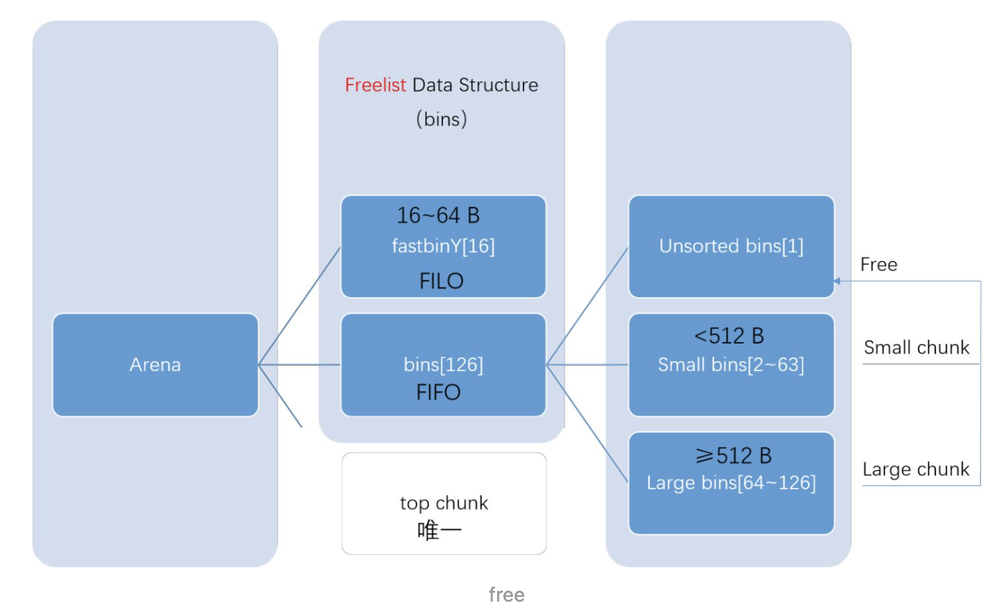

# 重抓CPP & 新抓GO

## 0 GOOGLE的CPP规范

具体的链接看这里https://zh-google-styleguide.readthedocs.io/en/latest/google-cpp-styleguide/contents/这个是中文的链接，下面贴上原本的链接https://google.github.io/styleguide/cppguide.html。下面给出来OCEANUS项目当中和编程规范匹配或者差别的地方。

### 0.1 头文件

【define保护】所有头文件定义宏来保护.h文件，基本的定义格式为：

> <PROJECT>\_<PATH>\_<FILE>\_H_

基本就是ifndef & define & endif的结构

【include顺序】#include的顺序按照项目源代码目录树顺序进行排列，避免使用./../

【前置声明】尽量不要前置声明

【内联函数】行数小于10行时，使用内联函数

### 0.2 作用域

> 总的思考：目前看起来，面向对象的代码实际上是一种理解方式和组织方式的区别，换言之用可以理解的方式组织数据和方法。但是其基本的初始化和调用的方式还是没有破坏原本的规则，比方说数据结构的对齐，每次内存申请RBP和RSP申请时候挪动的指针大小等方面。

【命名空间】鼓励使用匿名命名空间或者static声明。禁止使用using声明，禁止使用内联命名空间

【匿名命名空间和静态变量】在 .cc 文件中定义一个不需要被外部引用的变量时，可以将它们放在匿名命名空间或声明为 static 。但是不要在 .h 文件中这么做。

【非成员函数、静态成员函数和全局函数】使用静态成员函数或命名空间内的非成员函数, 尽量不要用裸的全局函数. 将一系列函数直接置于命名空间中，不要用类的静态方法模拟出命名空间的效果，类的静态方法应当和类的实例或静态数据紧密相关.//这个的代码没太明白，什么意思，难道是说类的的静态方法应当只针对具体的静态成员吗？

【局部变量】将函数变量尽可能置于最小作用域内, 并在变量声明时进行初始化.//这个倒是没什么好说的，从来都是如此

【静态和全局变量】禁止定义静态储存周期非原生数据类型变量，禁止使用含有副作用的函数初始化原生数据类型全局变量，因为多编译单元中的静态变量执行时的构造和析构顺序是未明确的，这将导致代码的不可移植。//除了int等基本数据类型，其他的都不可以定义为基本的数据结构，实际上是为了避免静态变量的初始化和析构时候导致的不确定性问题，这要求将大量的静态变量隐藏在类的内部，也是为了方便具体的管理和认识

【初始化顺序】同一个编译单元内是明确的，静态初始化优先于动态初始化，初始化顺序按照声明顺序进行，销毁则逆序。不同的编译单元之间初始化和销毁顺序属于未明确行为 (unspecified behaviour)。3

### 0.3 类

【隐式类型转换】不要定义隐式类型转换. 对于转换运算符和单参数构造函数, 请使用 explicit 关键字。//explicit需要具体查询一下，这个存在一点问题，现在记得不是很清楚。cpp primer 7.5.4节，第256页

【结构体与类】仅当只有数据成员时使用 struct, 其它一概使用 class。//Nmmm，struct和class的区别，也需要查

【继承】使用组合常常比使用继承更合理. 如果使用继承的话, 定义为 public 继承。//组合更灵活一些，具体见于headfirst设计模式的鸭子设计流程

【多重继承】真正需要用到多重实现继承的情况少之又少. 只在以下情况我们才允许多重继承: 最多只有一个基类是非抽象类; 其它基类都是以 Interface 为后缀的纯接口类。//好极了，我倒是想看看项目有几个用了多重继承

【接口类】

【运算符重载】除少数特定环境外, 不要重载运算符，也不要创建用户定义字面量。

【数据成员】将 *所有* 数据成员声明为 private, 除非是 static const 类型成员。

【声明顺序】类定义一般应以 public: 开始，后跟 protected:，最后是 private:。

### 0.4 函数

【函数体】我们承认长函数有时是合理的, 因此并不硬性限制函数的长度。如果函数超过 40 行, 可以思索一下能不能在不影响程序结构的前提下对其进行分割。//40行的长度实际上还是有点短，一会看一下OCEANUS的函数限制长度是多少

【参数顺序】函数的参数顺序为：输入参数在先, 后跟输出参数。输入参数通常是值参或 const 引用, 输出参数或输入/输出参数则一般为非 const 指针。

【引用参数】所有按引用传递的参数必须加上 const。

【缺省参数】在使用缺省参数时，优先考虑使用函数重载，并且对于虚函数不允许使用缺省参数。

【函数重载】若要使用函数重载，则必须能让读者一看调用点就胸有成竹，而不用花心思猜测调用的重载函数到底是哪一种。这一规则也适用于构造函数。

### 0.5 其他

【异常】不推荐使用 C++ 异常。

【运行时类型识别】禁止使用运行时类型识别。

【类型转换】使用 C++ 的类型转换，如 static_cast<>()。不要使用 int y = (int)x 或 int y = int(x) 等转换方式。

【流】原则上使用 printf 等函数代替流，除非接口必须使用流。//哈哈哈哈哈，笑死我了，C++失败的流设计

【自增与自减】对于迭代器和其他模板对象使用前缀形式 (++i) 的自增/自减运算符。

【初始化】初始化时，整数用 0，实数用 0.0，指针用 NULL（C++03）或nullptr（C++11）。

【auto】用 auto 绕过烦琐的类型名，只要可读性好就继续用，别用在局部变量之外的地方。//只有局部变量能用，这个倒是挺不错的

### 0.6 注释

【注释风格】注释风格使用 // 或 /* */，需要保持风格统一。

【文件注释】在每一个文件开头加入版权公告。

【类注释】每个类的定义都要附带一份注释, 描述类的功能和用法, 除非它的功能相当明显。

【函数注释】函数声明处的注释描述函数功能；定义处的注释描述函数实现。

【成员变量注释】每个类数据成员 (也叫实例变量或成员变量) 都应该用注释说明用途

【全局变量注释】和数据成员一样，所有全局变量也要注释说明含义及用途，以及作为全局变量的原因。

【代码前注释】对于代码中巧妙的，晦涩的，有趣的，重要的地方加以注释。

【不允许的注释】不要描述显而易见的现象，永远不要用自然语言翻译代码作为注释，要假设读代码的人 C++ 水平比你高，即便他可能不知道你的用意。

【TODO注释】对那些临时的，短期的解决方案，或已经够好但仍不完美的代码使用 TODO 注释。


### 0.7 命名

【通用约定】函数命名、变量命名、文件命名要有描述性，少用缩写。

【文件命名】文件名要全部小写，可以包含下划线 (_) 或连字符 (-)，依照项目的约定。如果没有约定，那么 “\_” 更好。例如 my_useful_class.cc。

【类型命名】类型名称的每个单词首字母均大写，不包含下划线：MyExcitingClass，MyExcitingEnum。

【变量命名】变量 (包括函数参数) 和数据成员名一律小写，单词之间用下划线连接。类的成员变量以下划线结尾，但结构体的就不用，如：a_local_variable、a_struct_data_member、a_class_data_member_。

【常量命名】声明为 constexpr 或 const 的变量，或在程序运行期间其值始终保持不变的，命名时以 “k” 开头，大小写混合。例如：const int kDaysInAWeek = 7;

【函数命名】常规函数使用大小写混合，取值和设值函数则要求与变量名匹配：MyExcitingFunction()、MyExcitingMethod()、my_exciting_member_variable()、set_my_exciting_member_variable()。

【命名空间命名】命名空间以小写字母命名，例如：websearch::index。最高级命名空间的名字取决于项目名称。要注意避免嵌套命名空间的名字之间和常见的顶级命名空间的名字之间发生冲突。

【宏命名】除头文件保护外，原则上不使用宏，如果一定要使用，像这样命名：MY_MACRO_THAT_SCARES_SMALL_CHILDREN。

【枚举命名】枚举的命名应当和 常量 或 宏 一致：kEnumName 或是 ENUM_NAME，例如：


下面复习一些CPP的基本知识

先复习一些CPP的基本知识：

+ 几种构造函数：
+ 引用：或者说左值引用。和初始化不同，初始化时初始值会拷贝到新建的对象里，而定义引用时直接将引用和它的初始值绑定到一起。引用的生命周期实际上和原先变量的生命周期是一致的。我们需要关注CONST 引用：允许将一个const int &绑定到一个普通int对象上。实际上还是一个临时量生命周期的问题，生成一个了临时量，然后进行绑定，本身是常量的临时量，还是只能绑定到常量。不过这里暗藏一个问题，就是const int &的绑定到一个非const的对象时候，只是代表不能通过这个const引用进行修改，直接对非const变量或者非const引用进行修改是可行的。
+ 参数传递：参数传递实际上值得说道说道，好多地方看起来都是引用传递。传值参数没啥注意，指针形参也没啥注意，传引用参数实际上就是一个别名，相当于直接操作传入的对象，然后还能避免拷贝操作，对于不支持拷贝操作的类型必须使用引用形参进行传递，对于长度过于长，拷贝操作很花时间的操作还能节省很多时间，还有一点要注意，当函数无需修改引用形参的值的时候最好使用常量引用。
+ 智能指针：目前直接看到的是shared_ptr，允许多指针共享同一个对象，但是只是引用计数增减是原子操作，具体的读写操作都不一定保证原子。智能指针实际上减少了程序员操作的难度。但是有一种情况会造成内存泄露，比方说智能指针放到了容器里，然后智能指针用完以后没有erase才导致一直没释放。一般来说，如果我们需要在多个对象之间共享内存才需要使用智能指针，这样子智能指针指向的对象的生命周期和类对象的生命周期才能相互独立。智能指针和new的混用，可以使用new返回的指针初始化智能指针。
+ 智能指针的注意事项：使用shared_ptr作为参数时，不要将智能指针和普通指针混用，所谓的智能指针管理自己的析构也只是智能指针之间才能这样子操作，这也是推荐使用make_shared而不是new的原因。这个地方实际上隐藏着一个智能指针和普通指针混用的问题，普通指针指向的内存可能已经被智能指针释放掉了，这就导致了问题。
+ 智能指针的初始化：初始化实际上有好几个方面，
+ 类static成员：
+ 构造函数后面接一个=default，具体见7.1.4节（第237页）
+ 虚函数后面接一个=0来纯虚函数


### 0.8 单元测试

单元测试应该覆盖什么东西？

+ 功能测试，保证功能正确
+ 多线程并发测试，包括并发的读写和并发的初始化等
+ 错误测试，如果有多个错误码最好都能够测试一遍。


### 0.9 代码设计原则

写的东西越多，对于一些代码的设计准则就觉得越要保持一致性：

+ 做一个产品，内部的组建的错误码可以对外暴露，这样子能迅速清楚问题来源。但是分层，代码设计的原则应当保持
+ 扁平化代码，层次化代码是看功能需要标定的。
+ 代码的设计应该是无隐喻的，但是产品往往是有隐喻的。该不该将隐喻嵌入到代码内部呢？这个就得看情况咯。


## 1 范型编程相关和一些兼容性事宜

### 1.1 继承，多态，虚继承

【动态绑定】在CPP中，当使用基类的引用或者指针的时候会发生动态绑定，换言之使用具体的结构体的时候是不发生动态绑定的。动态绑定又被称为运行时绑定。但是这种动态绑定实际上是暗藏了一个从派生类到基类的类型转换，也是隐式转换。在派生类对象中含有与其基类对应的组成部分，这一事实是继承的关键所在。但还有一点要注意，从派生类转换成基类可以，从基类转换成派生类不行！

【基类】基类一般定义一个虚析构函数。基类的private是不能被派生类的成员访问的，换言之只有基类的函数能够访问自己的private成员。对于希望派生类访问的成员，需要使用protected类型。final防止继承，

【派生类】派生类需要对virtual的函数进行override 来覆盖其旧的定义。需要注意的是，派生类不能直接初始化基类的数据成员，必须使用基类的构造函数初始化基类部分。换言之，每个类控制它自己的成员初始化的过程。实际上虚函数的动态绑定就是具体的地址，但是目前看起来似乎service的很多地方都不是虚函数的

【派生类列别】目前看到的都是public

### 1.2 范型

两种模板，一种是函数模板，另一种是类模板。以下的第一章，第二章都是《C++ TEMPLATE》的章节

第二章【函数模板】function template的每个参数必须严格符合定义的形式，不能隐式转换，此外最好两个参数都是const引用，否则会触发局部临时对象，返回的时候就不能以引用的方式传递了。两个重要原则：

+ 模板中的函数参数是const的引用
+ 函数体中的条件判断需要是传入的类型的对象锁支持的操作/运算

第一条保证了函数可以用于不能拷贝的类型，第二条是为了实现可移植性。一般来说模板的instantiate为两次，一次是基础的语法检查，另一个是带入具体的种类到模板里，看支不支持模板的运算。这就带来了一个问题，编译器需要知道template的实现。

由于template只会实例化用到的函数和类型。

第三章【类模板】类模板的名字并不是一个类型名，只有实例化的类模版，或者说包含模板参数的类模板才是类型。类模板的类型参数必须满足真正调用到的函数里面的操作必须支持，这句话也可以说成class template中，只有被实际调用的成员函数，才会被实例化。类模板支持特化，特化就和实例化很类似。类模板也支持偏特化，也就是部分特化**Specializations**，但是一旦偏特化，那么所有的成言函数都得特化了。同时，类模板也支持预设模板自变量，就可以只输入一部分参数而不输入带有预设模板自变量的值。关于类模板可能还有一点要注意Vector<Vector\<int\> >最后的那个>要和前面的>有一个空格，不要变成>>符号。 

第四章【非类型模板参数】非类型模板参数也有两种，一种是非类型类别模板参数，另一种是非类型函数模板参数。这种模版参数实际上就是值，或者是常量。具体的非类型模板参数的种类是什么还得确定，很难说具体结果。

第五章【tricky points】【typename】用于指明类型，不会引起和内部static的错误使用。当使用类内部的类型成员时候，最好加上这个typename。【template template parameters】双重模版参数，具体的template参数可以是class template，模板类型参数里面必须用class。function template不允许有template template parameters。【字符串常量的引用出错】以by reference传递字符串常量时，会出现意想不到的错误，因为会以const char[x]的方式传递参数

第六章【using template】【置入式模型】如果讲template的定义和声明分离，那么链接器就很难找到具体的定义，因此最好直接在模板的声明文件里面把定义给出，换言之在.h文件里面就把具体的定义给出来，另外还有两种不太好的做法：1在声明文件.h里面最后#include "myfirst.cpp"。2 另一种稍微差一些的方法就是在具体的调用文件里面，把.cpp文件也引入。这种最好的方法，被称为“置入式模型”，一般都推荐使用置入式模型。【显式实例化】尽量不要使用显式实例化，会大大增加复杂程度。显式实例化和特例化有什么区别呢？显式实例化是指你使用特定的template parameter去代替模版的参数，而特例化是指对某个类型的逻辑需要特殊考虑，从而进行了重写。

第七章【术语规范】【ODR】One-Definition Rule【Template ID】template name + template arguments。注意区分template arguments和template parameter的区别。

第八章【基础技术更深入】

第十四章【template的多型威力】静态多型与动态多型，【动态多型】虚函数，引用，指针之类的东西【静态多型】不同模板的实例化是静态多型，但是静态多型带来的问题就是不能再处理异质群集了：所有的类型必须在编译的时候就确定。【动态多型和静态多型的比较】继承实现的多型是bounded和dynamic的，我们称之为侵入式的。【为什么选择静态多型】静态多型的能够检查异质对象检查，就是具有类型检查功能。

第十五章【特征萃取和策略类别】


### 1.3 兼容性事宜

今天遇到这个事情，就是编译一个CPP的LIB给C用，然后就引出来这么两个问题：

+ C98的程序或者C11的程序能不能链接其他版本的LIB呢？可以参看这个链接https://stackoverflow.com/questions/46746878/is-it-safe-to-link-c17-c14-and-c11-objects。分析起来只要编译器移植，兼容性一致就可以。
+ 如何编译一个C++ LIB支持给C使用呢？具体的例子可以参看这个网页https://www.teddy.ch/c++_library_in_c/，使用cmake生成具体的lib的流程看这个网页https://www.cnblogs.com/52php/p/5681755.html


### 1.4 部分使用事宜

由于CPP的莫名其妙的编译，nm的时候看到的名字会有一大堆的数字和ascii字符，不能直接对照，因此需要使用命令nm --demangle


## 2 GOOGLE TEST笔记

需要添加具体的测试case来做单元测试，因此需要学习一下google test的使用。

入门部分内容https://google.github.io/googletest/primer.html。

高级部分内容https://google.github.io/googletest/advanced.html

具体样例https://google.github.io/googletest/samples.html


## 3 侯捷

两种容器，关联容器，顺序容器。C11新引入unordered containers容器，实际上也是关联容器。中文翻译为不定序容器，实际上就是hashtable

今天看到一个人提问，*ptr到底是这个ptr指向的对象本身还是个引用，按照c++11的page，是一个左值表达式，这个左值表达式的result是个对象的引用。

然后又有个问题，左值右值啥区别？

> An *lvalue* (*locator value*) represents an object that occupies some identifiable location in memory (i.e. has an address).
>
> *rvalues* are defined by exclusion, by saying that every expression is either an *lvalue* or an *rvalue*. Therefore, from the above definition of *lvalue*, an *rvalue* is an expression that *does not* represent an object occupying some identifiable location in memory.

简单来说就是

>  L-Values are locations, R-Values are actual values.


## 4 线程安全（linux多线程服务器编程：使用muduo库）

### 4.1 构造函数线程安全

三个要求：

+ 不在构造函数中注册回调
+ 不在构造函数当中把this传递给夸线程的对象
+ 即便是构造函数最后一行也不行（这个之所以不行是因为如果改对象是基类，那么派生类可能还在继续构造）

### 4.2 析构函数的线程安全

作为数据成员的mutex并不能保证析构时，别的线程不使用该对象。换言之作为数据成员的mutex并不能保证析构时线程安全。因此需要使用智能指针。实际上这个问题的根源就在于判断指针是否存活是困难的。为此才引入了智能指针：shared_ptr & unique_ptr。为了避免循环引用的问题，往往还需要引入weak_ptr。通常做法是owner拥有指向child的shared_ptr，而child持有指向owner的weak_ptr。

实际上，大部分的生命周期的问题都是析构函数和调用同时发生的。对于observer模式，建议使用《linux多线程服务器编程：使用muduo库》的例子

### 4.3 C++常见内存问题

+ 缓冲区溢出
+ 空悬指针/野指针
+ 重复释放
+ 内存泄露
+ 内存碎片


### 4.4 RAII好

RAII好啊，mutex使用RAII好极了啊


### 4.5 任务队列

对对象而言，使用bind 函数指针+对象指针就可以调用具体对象的函数，即可跨线程post任务


## 5 程序员的自我修养，链接，装载和库

### 编译和链接的基础知识

链接过程包括：

+ 地址和空间分配
+ 符号决议（符号绑定，名称绑定）
+ 重定位

程序的区域划分：

+ 最开始的部分是elf文件头，用来告诉程序自己是个啥：动态库/静态库/可执行文件

+ 代码段，.text/.code
+ 数据段，存储全局变量/局部静态变量，已经初始化的放在.data，未初始化的放在.bss段。为啥区分数据段和代码段：1 代码是只读的，数据可以变化 2 现代CPU基于缓存，因此需要区分指令和代码。3 代码是可以共享的，因此拆分。

可以使用size命令查看每个段大小，可以使用objdump -s -d main.o查看反汇编和具体段里面放的内容。

每个elf文件里面都有符号，而每个定义的符号对应一个符号表，符号表是文件里面的一个段，段名字为.symtab。分为以下几个种类：

+ 定义在目标文件的全局符号，可以被其它文件引用
+ 在本目标文件内引用的全局符号，一般叫做外部引用
+ 除了上面两种之外的符号，可以使用nm来查看elf的符号表

### 函数修饰和函数签名

C++为了面对函数重名的问题发明了**符号修饰**和**符号改编**，**函数签名**包含了一个函数的信息：比方说函数名，参数类型，返回值等信息。

比方说，gcc里面C++所有的符号都以_Z开头，后面紧跟N，然后是命名空间和类的名字，有个程序叫做c++file可以分析名字,

而C只是简单的在名字前面加个_

### 弱符号和强符号

+ 弱符号和强符号：强符号，C/C++默认函数和初始化的全局变量为强符号，两个同名的强符号会重名。注意强弱符号针对定义而言，extern的符号是外部定义，和强弱符号就没关系
+ 弱引用和强引用：对于弱引用，如果没有该符号不定义，链接器不会报错。

### 静态链接的基础知识

静态链接，现在的静态链接一般都是两步链接，先计算空间，再合并。这里要明白一点，静态库实际上就是把代码合并到了执行文件里面，即使这回引入很多不需要的代码，而且你还得解决这些依赖的不需要的代码所引入的undefined reference

COMMON块，现代程序处理链接时候和COMMON块一样的处理方式，直接空间非配为最大的块。

静态链接

所以符号的地址不确定，对静态库而言，发生的是连接时重定位，而动态加载是装载时重定位

静态链接的问题，静态链接不会per函数把名字印进去，它只会per文件，也就是说把所有的都丢进去.

### 动态链接

全局符号表

共享对象全局符号介入，即**如果一个符号要被加入全局符号表，如果相同的符号名存在，那么后面加入的被忽略**，所以要注意这个问题

但是这个结果往往是和其它的链接的选项相关的，如果后面还有其它符号同时链接进入，那么很可能会被当作静态符号链进来。


这里还有个东西plt，使用plt执行间接跳转，动态链接的间接跳转。disass的结果里面就有一个plt段，专门做跳转。


## 6 EFFECTIVE C++

建议2:尽量使用const，这里提供一个注意的点，两个函数同名但是一个是const，另一个不是，实际上就是发生了重载。这里面还有个争议，也就是bitwise测试的const，即bit检测不变。但是这导致我可以转移为另一个相等的对象

建议8:避让异常逃离析构函数，绝对不要在析构函数抛出异常，这会导致可能的内存泄露等问题。

建议9:绝对不要在构造和析构函数中掉用virtual函数。由于还没初始化完成，因此这个行为会引发未定义的问题，换言之，尽量初始化/析构只做已经OK的函数，

建议10:注意自己给自己赋值的情况，

建议14:小心赋值，对于RAII对象，要么禁止拷贝，要么引用计数，要么复制底层资源，要么转移底层资源的拥有权

建议18:让接口容易使用，不容易出错。因此最好使用：1 用类型系统来构造接口。2 类隐藏一个函数，使用函数来替代对象，因此使用const等限制接口是可行的3 使得你的type和内置type一样的行为 4 尽量让客户不再面对资源管理的问题

建议30:inline。inline是一种对编译器说的申请，具体实现是不是inline展开的完全看编译起。在类的函数定义在类的内部，默认就是inline实现的。但是，template是和inline没有必然联系的。那么问题来了，什么时候用inline？答案是当你确定这东西不会被调试的时候。

建议32:public继承塑模出is-a关系。简单来说A public 继承自B，那么每个A对象也是B对象，因此B起作用的地方A也可以起作用。这句话的意思，就是A的每个函数都可以在B上实现，但如果需要A对象，那么B对象未必可行。但是有个问题，比方说基类鸟类型，派生类企鹅类型。鸟会飞的话，企鹅就会飞，但是实际上企鹅不会飞，因此这是错误的继承体系导致的问题。

建议34:区分接口继承和实现继承。声明非纯虚函数的目的是为了让派生类继承该函数的接口和缺省实现；纯虚函数提供接口；非虚函数负责提供接口和强制性实现

建议38:通过复合塑模出has-a或“根据某物实现出”，

建议39:明智而审慎的使用private继承。private继承是纯粹的实现继承，换言之认为只有实现部分被继承，而接口部分应该被略去。

建议40:明智而审慎的使用多重继承。什么时候用多重继承比较合适？如果同时： 1 public继承某个基类的接口 2 private某个协助实现的class


## 7 C++的一些题目整理

自己整理：

+ C程序有几个区：堆，栈，代码段，全局/静态存储区，常量区。但这个说法严格来说是错误的，应该是：堆，栈，只读区：代码段，常量区，可读可写区：全局/静态存储区，

bigo：

+ shared_ptr的底层:shared_ptr是异常安全的，这里讲的很清楚：https://heleifz.github.io/14696398760857.html
+ 右值引用
+ 大端小端的概念，写个程序验证大端小端
+ 树的后序遍历，不使用递归的模式，使用循环的模式

bigo二面：

+ 进程切换发生了什么
+ 拓扑排序
+ 一亿对kv对，怎么管理排序，value的范围为uint64


蚂蚁图数据库：

+ 怎么设计一个安全门限系统
+ 多线程对连续的10个uint64_t进行写操作，MESI协议怎么变化。
+ 随机数产生算法有哪些


青州支行：

+ 一个有依赖的调度，怎么去找到最少的运算时间。


## 8 深度探索C++ 对象模型

### 8.1 第一章 关于对象 笔记

C当中，数据和函数是分离的。而C++中，一些自定义的数据类型往往使用ADT来实现，C++和C的区别并不单纯是语言层面的差别，更多是软件工程的差别，从软件工程角度来看“一个ADT或者数据类型的封装“能比”C程序中使用全局数据“更好。但是这种更好并不代表使用更容易。

那么C++如何实现对象模型呢？

+ 简单对象模型：简单来说，每个对象（无论是数据成员，还是函数成员）都拥有一个自己的slot，每个slot指向具体的对象
+ 表格驱动对象模型：class对象本身有两个指向表格的指针，这两个表格分别存储数据乘员和函数成员即data member table和member function table。member function table是一堆slot，每个slot指向具体的函数对象。而data member table则包含具体的成员
+ c++对象模型：非static数据对象放置在每个类对象里面，静态数据成员放在所有的类对象之外。静态函数成员和非静态函数成员放在所有的class object之外，而虚函数使用虚表支持。每个class产生一堆指向虚函数的指针，放在虚表里，每个类对象添加一个指针指向虚表，称为vptr。vptr的设定，重置由构造函数/拷贝构造函数指定。每个类别的type_info object也由虚表指出，通常放在虚表的第一个slot里面。
+ C++对象模型的另一个问题：继承怎么办？


有一个东西要注意，C程序员的巧计会变成C++的陷阱，比方说C struct末尾的零长数组，一般C可以动态申请长度，然后放置在后面。而C++里面的排列次序不同的section，比方说public/protected/private是不保证一定在末尾的。同样基类和派生类的内存布局也不一定，因此并不能保证一定有效


C++支持三种程序设计典范：

+ 程序模型：


### 8.2 构造函数语义学 笔记

> implict :暗中的，隐含的（通常指非程序代码当中出现的）
>
> Explicit:明确的，指代码里出现的
>
> Trivial:没有用处的
>
> Nontrivial:有用的
>
> memberwise：对每个member施以。。。
>
> bitwise：对每个bit施以
>
> semantics：语义学


一般情况下，编译器是不会生成默认构造函数的，换言之，是程序需要生成，而不是编译器需要的情况下，就不会有默认构造函数。那么何时编译器需要呢？

+ 如果一个类别有一个member object，这个member object有默认构造函数，那么编译器会生成一个default constructor。但是书里面说的不会初始化诸如指针等其它内存成员是不一定正确的。如果有多个带有默认构造函数的member object，那么以member object的声明顺序进行初始化
+ 如果class object的基类有默认构造函数
+ 带有virtual function的class
+ 带有virtual base class的class

总之，不要有以下两个误区：

+ 如果class 没定义default constructor，就会合成出来一个
+ 编译器合成出来的default constructor 会明确设定每个data member的默认值


那么拷贝构造函数呢？如果没有提供一个具体的拷贝构造函数，C++会调用default memberwise initializztion手法完成，但是这里有一个bitwise copy setantics

+ memberwise copy：访问每个成员，然后具体的执行拷贝
+ bitwise copy :浅拷贝的一种

实际上c11里面的std::is_trivially_copyable就是能不能直接memcpy拷贝，也就是

> Objects of trivially-copyable types that are not potentially-overlapping subobjects are the only C++ objects that may be safely copied with [std::memcpy](https://en.cppreference.com/w/cpp/string/byte/memcpy) or serialized to/from binary files with [`std::ofstream::write()`](https://en.cppreference.com/w/cpp/io/basic_ostream/write)/[`std::ifstream::read()`](https://en.cppreference.com/w/cpp/io/basic_istream/read).


### 8.3 第四章 函数语义学


## 9 malloc相关的代码

### 9.1 malloc的理解和流程

这几天在查log4cplus coredump的问题的时候，出现的问题就是破坏了malloc的结构导致coredump，因此需要对malloc管理的结构有个直观认识。malloc实际上是在堆上管理内存，因此其地址是分配是从低地址向高地址分配的，因此用户数据的起始地址实际上是低地址在前的。具体malloc分配出来的结构实际上是下面这个东西

```cpp
struct malloc_chunk {
    //如果前一块被释放，该处存储前一块的大小
    INTERNAL_SIZE_T mchunk_prev_size; /* Size of previous chunk (if free).  如果当前块在使用，那么虚拟地址相邻的块的mchunk_prev_size也可以存储数据*/  
    //本块的大小，包含堆头
    INTERNAL_SIZE_T mchunk_size;      /* Size in bytes, including overhead. */
    //双链表结构，只有当堆块被释放时使用
    struct malloc_chunk *fd; /* double links -- used only if free. */
    struct malloc_chunk *bk;
    //只有在本堆块为large chunk时，且被释放才会使用
    //指向前一个large chunk 和 后一个 large chunk 的大小
    /* Only used for large blocks: pointer to next larger size.  */
    struct malloc_chunk *fd_nextsize; /* double links -- used only if free. */
    struct malloc_chunk *bk_nextsize;
};


/* 这里的previos chunk表示的是虚拟地址相邻的上一块，或者说低地址的上一块*/
chunk-> +-+-+-+-+-+-+-+-+-+-+-+-+-+-+-+-+-+-+-+-+-+-+-+-+-+-+-+-+-+-+-+-+  /* P PREV_INUSE记录上个块是否被分配*/
        |             Size of previous chunk, if unallocated (P clear)  |  /* M 表示属于heap/mmap获取的*/
        +-+-+-+-+-+-+-+-+-+-+-+-+-+-+-+-+-+-+-+-+-+-+-+-+-+-+-+-+-+-+-+-+  /* A表示当前chunk是否属于祝线程*/
        |             Size of chunk, in bytes                     |A|M|P|  /* 低地址，这个chunk真正的大小*/
      mem-> +-+-+-+-+-+-+-+-+-+-+-+-+-+-+-+-+-+-+-+-+-+-+-+-+-+-+-+-+-+-+-+-+
        |             User data starts here...                          .  /* 这里面放的是真正的数据*/
        .                                                               .  /* 起始地址在低地址*/
        .             (malloc_usable_size() bytes)                      . 
        .                                                               |  /* 也就是说这张图里下面是高地址*/
nextchunk-> +-+-+-+-+-+-+-+-+-+-+-+-+-+-+-+-+-+-+-+-+-+-+-+-+-+-+-+-+-+-+-+-+
        |             (size of chunk, but used for application data)    |
        +-+-+-+-+-+-+-+-+-+-+-+-+-+-+-+-+-+-+-+-+-+-+-+-+-+-+-+-+-+-+-+-+
        |             Size of next chunk, in bytes                |A|0|1|
        +-+-+-+-+-+-+-+-+-+-+-+-+-+-+-+-+-+-+-+-+-+-+-+-+-+-+-+-+-+-+-+-+
```

也就是说具体这个mem地址是真正返回给客户的地址，然后真正分配给用户内存chunk的大小存储在起始地址前面(也就是在更低的地址)，换言之真正存储的数据会把size之后的结构都覆盖掉，也就是说fd/bk都被用户数据覆盖了。那么具体每个到malloc当中，内存分配是怎么管理的？换言之chunk怎么管理的呢？

+ Arena是每个线程管理堆区的单位，每个线程有自己的Arena。主线程的为main arena，其它线程的为thread arena。
+ bins是具体的管理chunk的结构，chunk挂起来连接到bin上，具体获取bin需要使用宏`bin_at(m,i)`和`next_bin(b)`
+ 如下图bins包含small bins，large bins，unsorted bins
+ unsorted bins 存储chunk拆分出来以后的剩余部分和最近被free掉的chunk（如果这个chunk不被fastbin回收）
+ fastbin存储最近free的chunk，数据大小为一般为16～64B。那么最近从small bin和large bin，free掉的大的chunk，也丢到unsorted bins里面

具体的管理结构为`malloc_state`





实际分配的时候看arena当中是否内存充足，有空余的chunk那么拆分/不拆分直接给出，要不使用sbrk/mmap申请。

顺序是优先fastbin再small /large bins中查找，还不行就unsorted bins查找，不成功再恢复到bins里面。具体的流程为：


1. 优先fastbins分配
2. 如果分配内存<512字节，则通过内存大小定位到smallbins对应的index上(floor(size/8))
   - 如果smallbins[index]为空，进入步骤4
   - 如果smallbins[index]非空，直接返回第一个chunk
3. 如果分配内存>512字节，则定位到largebins对应的index上
   - 如果largebins[index]为空，进入步骤4
   - 如果largebins[index]非空，扫描链表，找到第一个大小最合适的chunk，如size=12.5K，则使用chunk B，剩下的0.5k放入unsorted_list中
4. 遍历unsorted_list，查找合适size的chunk，如果找到则返回；否则，将这些chunk都归类放到smallbins和largebins里面
5. index++从更大的链表中查找，直到找到合适大小的chunk为止，找到后将chunk拆分，并将剩余的加入到unsorted_list中
6. 如果还没有找到，那么使用top chunk
7. 或者，内存<128k，使用brk；内存>128k，使用mmap获取新内存


相关资料看这几个链接：

+ https://zhuanlan.zhihu.com/p/163401620
+ https://jacktang816.github.io/post/mallocandfree/     感觉说的有些前后矛盾，到底是先找sammbins还是找unsorted bins呢？
+ https://a1ex.online/2020/09/28/glibc-malloc%E6%BA%90%E7%A0%81%E5%88%86%E6%9E%90/
+ https://niebelungen-d.top/2021/03/07/Glibc-2-20-malloc%E6%BA%90%E7%A0%81%E5%88%86%E6%9E%90/#int-malloc


### 9.2 从类对象到malloc的调用

上面是malloc的操作，那么使用构造函数构造对象的时候new怎么和malloc建立关系的呢？以string为目标看下，依赖的代码是gcc4.8.5的代码


## 10 C++设计新思维笔记


## 结尾

结尾记录一点和c++关系不大，但是和thrift关系比较大的东西，因为我一边写着cpp的程序练手，一边在学习怎么使用thrift进行通信。

### thrift常见错误异常和几个小问题

0 编译成功thrift程序之后，运行会爆出错误：

```
dyld: Symbol not found: _GENERAL_NAME_free*
*  Referenced from: /usr/local/lib/libthrift-0.9.3-dev.dylib*
```

查询这个问题的时候搜索百度和google会有两个搜索结果，百度的结果上说是什么mac的编译环境是clang而不是gcc导致的（什么小白装thrift的链接），这个回答是错误的，也没给出解决方案。另一个是google上运行python的时候报这个错，参考那个解决方法，解决thrift的依赖问题即可：在cmake文件中指明openssl的lib库在哪里。

1 如果server没有打开，那么client端进行连接的时候，每一次都会爆出`Thrift: TSocket::open() error on socket (after THRIFT_POLL) <Host: 127.0.0.1 Port: 9000>Connection refused`的错误提示，换言之Connection refused就是server端服务没打开。

2 如果server打开了，但是client选择的Ttransport的类型和server端的Ttransport类型不一致（比方说，一边是TBufferedTransport，另一边是TBinaryTransport）那么client端会成功的连接，不会爆出所谓的Connection refused 的错误（三次握手成功了？），但是client端会长期的等待直到到了Tsocket所设定的超时时间，然后报错`THRIFT_EAGAIN (timed out)`，而server端则会给出提示`Thrift: Sat May 15 00:32:15 2021 received invalid message type 0 from client`即消息的类型错误。

3 和上面的问题非常相似，只不过反过来了，就是服务端是TFramedTransport，客户端是TBufferedTransport，连接的时候会成功连接，不会爆出Connection refused的错误，但是client端一调用具体的函数就会触发异常`No more data to read.`的问题，服务端的报警信息我没有看到，不太确定。

4 和上面的问题类似，如果server打开了，客户端执行两次Ttransport->open()会发生什么呢？实际上不会发生什么事情，不会出现报错和异常。

5 Ttransport->open()成功之后，使用Tprotocol初始化两个不同的生成的client对象，并调用相对应的servcie函数会发生什么？不会发生什么问题，不会出现报错。

6 一个transport->open()之后，再次声明新的Tsocket,Ttransport,Tprotocol和新的对象，并调用对应的service函数，会卡住，服务端会报错：

7 server端正在正常工作，client端transport->open()成功，之后服务端offline/关闭了，client端报错`No more data to read.`

8 thrfit到底是个单向的，还是双向的服务？实际上thrift是可以实现双向连接的，服务端可以拿到客户端的连接并且进行消息的发送，但是似乎没有进行这种服务的？答案是thrift并没有双向的服务，所谓的双向知识提供接口更新的时候让对端（也就是原先的服务端）通知一下消息。

9 thrift多线程环境下能不能正确的支持消息发送？还是说需要拆分开？很明显不支持多线程，不可能把多线程都给你做了，下一个问题的里面的链接也说的很清楚了。为了维持多线程的安全，最好再重新启一个连接去获取对应的数据。

10 thrift的连接是长链接吗？比方说我trnasport->open()之后，那么我是三次握手完成了吗？从thrift的文档来看，就是完成了一个三次握手过程。如果有连接的话，我是应该再开一个还是再利用现在已经存在的东西呢？有这么一个回答https://stackoverflow.com/questions/42510657/is-a-singleton-apache-thrift-client-better-than-multiple-client-instances/42516397

11 undefined reference to `std::__throw_out_of_range_fmt(char const*, ...)'问题：这几天发现一个很奇怪的问题，cmake是3.12.2，如果先在g++ 4.8的版本下编译了一遍代码，以后无论source改变环境变量使得g++为4.9/5.3.1的新版本，总会导致一直有下面的错误提示。解决方法是删除掉旧文件，重新使用新的g++/gcc版本编译。

```
/usr/local/lib64/libbenchmark.a(benchmark_runner.cc.o): In function `benchmark::internal::BenchmarkRunner::DoNIterations()':
benchmark_runner.cc:(.text+0x1bd1): undefined reference to `std::thread::_M_start_thread(std::shared_ptr<std::thread::_Impl_base>, void (*)())'
/usr/local/lib64/libbenchmark.a(string_util.cc.o): In function `benchmark::StrSplit(std::string const&, char)':
string_util.cc:(.text+0x1e27): undefined reference to `std::__throw_out_of_range_fmt(char const*, ...)'
```


12 今天测试了一下boost::any和unique_ptr与void*存储数据时候存储数据拷贝的性能差异等数据，给个简单的对比

| 对象            | Time             CPU   Iterations    | 备注 |
| --------------- | ------------------------------------ | ---- |
| Boost::any      | 112 ns          112 ns      5603362  |      |
| std::unique_ptr | 69.5 ns         69.4 ns      9993861 |      |
| void*           | 67.4 ns         67.4 ns     10328140 |      |


测试程序很简单，综合而言，使用unique_ptr的效率不比void*低多少，而且还避免了内存泄露。因此更推荐使用unique_ptr

```c++

#include <string>
#include <iostream>
#include <memory>
#include <boost/any.hpp>
#include <benchmark/benchmark.h>

std::string res("hellosdfasdfasdfasdfasdfasdfasdfasf");
boost::any tmp = res;
void* tmp_void = static_cast<void*>(new std::string(res));

std::unique_ptr<std::string> tmp_uniqre_ptr(new std::string(res));


static void BM_SomeFunction(benchmark::State& state) {
  // Perform setup here
  for (auto _ : state) {
      std::string final = *tmp_uniqre_ptr;
  }
}
// Register the function as a benchmark
BENCHMARK(BM_SomeFunction);
// Run the benchmark
BENCHMARK_MAIN();


```


13 编译的一个静态库，然后被人用来生成静态库了，提示

`relocation R_X86_64_32 against .bss' can not be used when making a shared object; recompile with -fPIC`

出现问题的原因是因为编译静态库的时候，没加fPIC标记换言之：

Is the side-effect of not using -fPIC when compiling a static library which goes into a shared object platform-dependent 。

这个回答可以说是讲的非常清楚了:

> In brief, the term **position independent code** (PIC) refers to the generated machine code which is memory address agnostic, i.e. does not make any assumptions about where it was loaded into RAM. Only position independent code is supposed to be included into shared objects (SO) as they should have an ability to dynamically change their location in RAM.

https://stackoverflow.com/questions/19364969/compilation-fails-with-relocation-r-x86-64-32-against-rodata-str1-8-can-not

下面给出gcc的定义

> ```
> -fpic
> ```
>
> 
>
> Generate position-independent code (PIC) suitable for use in a shared library, if supported for the target machine. Such code accesses all constant addresses through a global offset table (GOT). The dynamic loader resolves the GOT entries when the program starts (the dynamic loader is not part of GCC; it is part of the operating system). If the GOT size for the linked executable exceeds a machine-specific maximum size, you get an error message from the linker indicating that -fpic does not work; in that case, recompile with -fPIC instead. (These maximums are 8k on the SPARC, 28k on AArch64 and 32k on the m68k and RS/6000. The x86 has no such limit.)
>
> Position-independent code requires special support, and therefore works only on certain machines. For the x86, GCC supports PIC for System V but not for the Sun 386i. Code generated for the IBM RS/6000 is always position-independent.
>
> When this flag is set, the macros `__pic__` and `__PIC__` are defined to 1.
>
> ```
> -fPIC
> ```
>
> 
>
> If supported for the target machine, emit position-independent code, suitable for dynamic linking and avoiding any limit on the size of the global offset table. This option makes a difference on AArch64, m68k, PowerPC and SPARC.
>
> Position-independent code requires special support, and therefore works only on certain machines.
>
> When this flag is set, the macros `__pic__` and `__PIC__` are defined to 2


14 今天遇到一个非常有趣的问题：我写了一个静态库libauth.a，里面使用ar -M < authlib.mri打包了boringssl库，然后squirrel在调用的时候自己又引了一个libcrypto.so文件。然后问题来了，libcrypto.so里面和boringssl库（静态库）有函数重名了，然后每次一跑程序就coredump在一个openssl函数上。那么

+ 为什么程序能编译通过？没啥问题，自己试过了一个动态库，一个静态库，和两个都是动态库是一样的，编译的选项哪个在前面用哪个。但这个前提是main程序只掉用了重名函数，如果main程序还调用了别的程序，那么最后掉用的会被其它掉用的程序所影响。
+ 如何解决这个问题呢？最直接的就是切换编译选项里面的先后顺序，恐怕还是`-fvisibility=hidden`
+ 如果采用第二个问题的解决方法，那么我写的libauth.a里面使用的函数究竟是libcrypto.so也就是openssl动态库里面的，还是boringssl静态库里面的？这个是时候就出现好玩的东西了，如果真正的函数除了两个lib中同名的函数，还调用了别的函数，而别的函数调用了自己库里面的重名函数，那么会导致最终都掉用对应的库里面的函数。如果没掉用，那么无所谓了。
+ 换个问题，如果两个都是静态库，那么能够编译通过吗？如果两个都是静态库，而且只是一个重名，那么采用默认的编译方式的时候是先找到一个满足的就ok，不会报错。但是如果main程序调用了两个库里面的其它的符号，那么问题就来了，就会报重复定义！

```c++
/* a.c */
  1 #include <stdio.h>
  2
  3 void out() {
  4     printf("hello from a \n");
  5     return;
  6 }
/* b.c */
  1 #include <stdio.h>
  2
  3 void out() {
  4     printf("hello from b \n");
  5     return;
  6 }
  7
  8 void call_out() {
  9     out();
 10 }
 
/* main.c */
  1 extern void test();
  2 extern void call_out();
  3 int main() {
  4     out();
  5     call_out();
  6     return 0;
  7 }
  
 /* gcc main.c ./liba.a ./libb.a  ====分隔====  会报错，提示重复定义，为什么呢？先把a中的定义引入，然后发现b里面的call_out定义，由于静态链接不是按照需求引入链接，而是直接把文件里面所有的符号链接都丢到elf文件里，因此在之后引入call_out定义的时候会把b的out定义引入，然后就重名了，就会报错 */
 /* gcc main.c ./libb.a ./liba.a  ====分隔====  不会报错，为什么呢？依赖是引入的时候就会是引入b的定义，整个过程就不会引入a的定义 */

/* gcc main.c ./libb.so ./liba.so  ====分隔====  不会报错，为什么呢？依赖是引入的时候就会是引入b的定义，整个过程就不会引入a的定义，输出都是hello from b */
/* gcc main.c ./liba.so ./libb.so  ====分隔====  不会报错，为什么呢？依赖是先找liba.so，再找libb.so，但是会都输出hello from a */

/* gcc main.c ./libb.a ./liba.so  ====分隔====  不会报错，为什么呢？由于必须引入call_out静态符号，会同时引入b的out静态符号，因此必然是输出hello from b */
/* gcc main.c ./liba.so ./libb.a  ====分隔====  不会报错，为什么呢？先找到a里面out的动态符号，由于必须引入call_out静态符号，会同时引入b的out静态符号，因此必然是输出hello from b */
```


+ 添加了`--whole-archive`那么，就会报错说是有重复定义。但是也有说是直接就报错，说是有多重定义的。

+ 换个问题，如果两个都是动态库，能编译通过吗？可以的，动态库运行的时候才会动态加载，加载的顺序由编译时候链接的顺序决定，符号表以第一个查到的为准。但是这个时候，即使main里面调用必然是b里面的call_out，那么call_out执行的out也会是和顺序强相关，也就是说，如果结果如下：

  ```
  [root@set-zf-kms-test-c-dev01 lib_test]# gcc main.c ./libb.so ./liba.so
  [root@set-zf-kms-test-c-dev01 lib_test]# ./a.out    //动态链接只会调用第一个被链接进来的，也就是b的out符号
  hello from b
  hello from b
  [root@set-zf-kms-test-c-dev01 lib_test]# gcc main.c ./liba.so ./libb.so
  [root@set-zf-kms-test-c-dev01 lib_test]# ./a.out    //动态链接还是只调用第一个的out动态符号，也就是a的out符号
  hello from a
  hello from a
  ```


15 前几天在写无锁环的遇上一个问题，就是什么是is_trivially_copyable，简单来说trivially_copyable类型的存储地址是连续的，也就是说trivially_copyable类型需要满足三个条件：

+ uses the implicitly defined copy and move constructors, copy and move assignments, and destructor.
+ has no virtual members.
+ its base class and non-static data members (if any) are themselves also *trivially copyable types*.


16 今天写cmakelist即使写了link_list也不能正确的执行连接到grpc的库根本原因是因为link_directories写到了add_executable的后面，最后改完了成了

```cmake
cmake_minimum_required(VERSION 2.8.9)
project(health_test)
 
#Bring the headers, such as Student.h into the project
include_directories(/home/qcraft/code_test/grpc-cpp/include)

link_directories(/home/qcraft/code_test/grpc-cpp/grpc/cmake/build)

add_executable(health_test_client health_client.cc health.grpc.pb.cc health.pb.cc)

#Generate the shared library from the sources

target_link_libraries(health_test_client -lgrpc++ -lgrpc++_reflection -lpthread)
```


## C/C++常见问题总结

在公司开发AuthSDK/KmsSDK时遇到很多问题，简单总结并给出解决方法。前四种为兼容性问题，最后一个为编译问题：

+ 依赖GCC版本错误导致各种问题：GCC兼容性的问题容易导致缺乏定义和结构体大小变化问题：遇见过编译爆出undefined reference to `std::__throw_out_of_range_fmt，数据体结构变化导致coredump等。

+ 依赖软件库版本不同导致各种问题：依赖库的版本变化可能导致多种问题：遇见过BOOST库版本错误导致COREDUMP，LCRYPTO库版本错误导致计算错误，静态库缺乏fPIC标记无法被动态库包含。
+ 依赖头文件错误导致UB：不同版本头文件混用导致各种UB：遇见过使用log4cplus 1.1.3和log4cplus1.2.2的库混用导致初始化日志配置就coredump问题。
+ 库重名问题：动态库混编，静态库混编，动/静态库混编导致重名/缺乏定义问题。
+ 常见其它问题：


### 1 GCC版本错误问题

公司内部gcc环境很多：4.8.5/4.9.2/5.3.1/8.3.1/...，gcc环境的变化最容易导致的问题是undefined reference，尤其以4.8.5老版本和4.8.5以上的版本混用导致为主。遇到的未定义错误可能包括：

+ undefined reference to `std::__throw_out_of_range_fmt(char const*, ...)'，该问题出现的原因是因为gcc4.8.5缺乏该函数的定义，解决方法只能使用新版本的gcc（实质为使用新版本stdc++库），如果不能更换gcc版本建议联系导致出现上述undefined reference的具体函数提供方寻求解决方案。在开发KMS 时选择公司内部clogV2作为日志库的时候遇到这个问题，最终的解决方案是弃用clogV2选择log4cplus，但导致了另外一个严重问题。提示的错误信息见下：

  ```makefile
  /usr/lib/gcc/x86_64-redhat-linux/4.8.5/../../../../lib64/libclogV2.a(configurator.cxx.o): In function `log4cplus::(anonymous namespace)::substVars(std::string&, std::string const&, log4cplus::helpers::Properties const&, log4cplus::helpers::LogLog&, unsigned int)':
  (.text+0x1683): undefined reference to `std::__throw_out_of_range_fmt(char const*, ...)'
  /usr/lib/gcc/x86_64-redhat-linux/4.8.5/../../../../lib64/libclogV2.a(property.cxx.o): In function `log4cplus::helpers::Properties::init(std::istream&)':
  (.text+0x107d): undefined reference to `std::__throw_out_of_range_fmt(char const*, ...)'
  /usr/lib/gcc/x86_64-redhat-linux/4.8.5/../../../../lib64/libclogV2.a(property.cxx.o): In function `log4cplus::helpers::Properties::getPropertySubset(std::string const&) const':
  (.text+0x169f): undefined reference to `std::__throw_out_of_range_fmt(char const*, ...)'
  /usr/lib/gcc/x86_64-redhat-linux/4.8.5/../../../../lib64/libclogV2.a(fileappender.cxx.o): In function `log4cplus::preprocessFilenamePattern(std::string const&, log4cplus::DailyRollingFileSchedule&)':
  (.text+0x9988): undefined reference to `std::__throw_out_of_range_fmt(char const*, ...)'
  /usr/lib/gcc/x86_64-redhat-linux/4.8.5/../../../../lib64/libclogV2.a(patternlayout.cxx.o): In function `log4cplus::pattern::LoggerPatternConverter::convert(std::string&, log4cplus::spi::InternalLoggingEvent const&)':
  (.text+0x304): undefined reference to `std::__throw_out_of_range_fmt(char const*, ...)'
  /usr/lib/gcc/x86_64-redhat-linux/4.8.5/../../../../lib64/libclogV2.a(patternlayout.cxx.o):(.text+0xaac): more undefined references to `std::__throw_out_of_range_fmt(char const*, ...)' follow
  collect2: error: ld returned 1 exit status
  make[2]: *** [sts_decode] Error 1
  make[1]: *** [CMakeFiles/sts_decode.dir/all] Error 2
  make: *** [all] Error 2
  ```

  

+ undefined reference to `std::__cxx11::basic_string，该问题出现的原因是因为使用的string非C++11标准实现版本，4.8.5之前的版本不支持C++11，此外C++11的ABI和string实现变化都极容易导致对C++11支持不彻底的4.8.5及老版本GCC出现CORE问题。对该问题的解决方法为添加宏定义-D_GLIBCXX_USE_CXX11_ABI=0，或指定具体的库版本为C++11版本。如果使用Cmake参与编译，那么需要手动删除产生的文件，一部分cmake 重新时不会删除部分中间文件，导致依然报该undefine reference。

  遇到的例子是使用5.3.1编译出来的KMS库在给4.8.5使用时爆出的错误信息：

  

  

  

+ 如果使用muduo库参与库实现，需要注意是否为C98标准，C98标准muduo使用的string不是std::string，需要显式定义DMUDUO_STD_STRING，才能正确编译否则会报错undefined reference to string。开发KMS SDK时，多线程同步最早选择的库为MUDUO C98分支，当时链接报错这个错误会报错：

  ```
  ```

  

除了版本混用导致的undefined reference问题，还极易出现莫名其妙的CORE问题：

+ gcc4.8.5多线程操作字符串COREDUMP问题，该问题不多赘述，网上资料很多。

+ 不同版本数据结构变化导致COREDUMP问题，举个简单例子：Kms Pangolin SDK的代码基于4.8.5编译，使用5.3.1编译器引用库时会core。原因：Kms Pangolin SDK SDK的数据结构为unordered_map后面紧跟一个mutex，加锁时会从unordered_map偏移48字节位置加锁，这个位置是mutex的位置。

  但是GCC5.0和GCC4.8的unordered_map大小不一样，GCC5.0的unordered_map为56字节，因此锁的位置有偏移，但是代码依然对偏移位置为48的地方加锁，因此GCC5之后版本修改锁会错误的修改unordered_map的_M_buckets。两种解决方法：1不使用发生变化的数据结构，增加代码开发的难度 2 和使用者的gcc版本对齐，增加维护难度，不建议，且难度较大。

  当时CORE文件的异常栈为：

  ```
  (gdb) bt
  #0  0x00007f0a03a64110 in std::_Hashtable<std::string, std::pair<std::string const, meituan::kms::Crypto*>, std::allocator<std::pair<std::string const, meituan::kms::Crypto*> >, std::__detail::_Select1st, std::equal_to<std::string>, std::hash<std::string>, std::__detail::_Mod_range_hashing, std::__detail::_Default_ranged_hash, std::__detail::_Prime_rehash_policy, std::__detail::_Hashtable_traits<true, false, true> >::_M_find_before_node(unsigned long, std::string const&, unsigned long) const ()
     from /opt/meituan/chenxinhua03/serving/faceservice-torch/cv-faceservice-torch/lib/kms_pangolin/libkms-crypto.so
  #1  0x00007f0a03a5de43 in meituan::kms::Cryptos::get(std::string const&, std::string const&, std::string const&, std::string&) () from /opt/meituan/chenxinhua03/serving/faceservice-torch/cv-faceservice-torch/lib/kms_pangolin/libkms-crypto.so
  #2  0x0000000000642f0e in FaceAuthServiceHandler::faceAuth (this=0x37872a0, _return=..., img1=..., img2=..., fpRate=faceauthservice::FaceBaseFPRate::FP_E_4) at /opt/meituan/tools/cv-faceservice-torch/src/face_service_server.cpp:414
  #3  0x0000000000556490 in faceauthservice::FaceAuthServiceProcessor::process_faceAuth (this=0x44cd7e0, seqid=0, iprot=0x7f0884001820, oprot=0x7f08840018b0, callContext=0x0) at /opt/meituan/tools/cv-faceservice-torch/thrift/FaceAuthService/FaceAuthService.cpp:327
  #4  0x0000000000555e50 in faceauthservice::FaceAuthServiceProcessor::process_fn (this=0x44cd7e0, iprot=0x7f0884001820, oprot=0x7f08840018b0, fname="faceAuth", seqid=0, callContext=0x0)
      at /opt/meituan/tools/cv-faceservice-torch/thrift/FaceAuthService/FaceAuthService.cpp:300
  #5  0x0000000000555772 in faceauthservice::FaceAuthServiceProcessor::process (this=0x44cd7e0, piprot=..., poprot=..., callContext=0x0) at /opt/meituan/tools/cv-faceservice-torch/thrift/FaceAuthService/FaceAuthService.cpp:282
  #6  0x00000000006a40e4 in cthrift::CthriftSvr::ProcessSync(apache::thrift::transport::CthriftUniformRequest&, int const&, unsigned char*, boost::weak_ptr<muduo::net::TcpConnection>, muduo::Timestamp) ()
  #7  0x00000000006a6a52 in cthrift::CthriftSvr::Process(apache::thrift::transport::CthriftUniformRequest&, int const&, unsigned char*, boost::weak_ptr<muduo::net::TcpConnection>, muduo::Timestamp) ()
  #8  0x00000000006a7ba3 in cthrift::CthriftSvr::ProcessUniformNormal(apache::thrift::transport::CthriftUniformRequest&, int const&, unsigned char const*, bool&, boost::weak_ptr<muduo::net::TcpConnection>, muduo::Timestamp) ()
  #9  0x00000000006acb9e in cthrift::CthriftSvr::ProcessUniform(boost::weak_ptr<muduo::net::Buffer>, int const&, unsigned char const*, bool&, boost::weak_ptr<muduo::net::TcpConnection>, muduo::Timestamp) ()
  #10 0x00000000006ad693 in cthrift::CthriftSvr::Process(boost::shared_ptr<muduo::net::Buffer> const&, boost::weak_ptr<cthrift::ConnContext>, boost::weak_ptr<muduo::net::TcpConnection>, muduo::Timestamp) ()
  #11 0x00000000006b3852 in boost::detail::function::void_function_obj_invoker0<boost::_bi::bind_t<void, boost::_mfi::mf4<void, cthrift::CthriftSvr, boost::shared_ptr<muduo::net::Buffer> const&, boost::weak_ptr<cthrift::ConnContext>, boost::weak_ptr<muduo::net::TcpConnection>, muduo::Timestamp>, boost::_bi::list5<boost::_bi::value<cthrift::CthriftSvr*>, boost::_bi::value<boost::shared_ptr<muduo::net::Buffer> >, boost::_bi::value<boost::weak_ptr<cthrift::ConnContext> >, boost::_bi::value<boost::weak_ptr<muduo::net::TcpConnection> >, boost::_bi::value<muduo::Timestamp> > >, void>::invoke(boost::detail::function::function_buffer&) ()
  #12 0x00000000007b90f1 in muduo::net::EventLoop::doPendingFunctors() ()
  #13 0x00000000007b92df in muduo::net::EventLoop::loop() ()
  #14 0x00000000007ba9a1 in muduo::net::EventLoopThread::threadFunc() ()
  #15 0x00000000007db585 in muduo::detail::startThread(void*) ()
  #16 0x00007f0a035c1ea5 in start_thread () from /lib64/libpthread.so.0
  #17 0x00007f09afac28dd in clone () from /lib64/libc.so.6}
  ```

  


### 2 依赖软件库版本不同问题

公司内部基础环境混乱，基于inf_cbom是比较通用的解决手段，但是inf_cbom和很多默认库版本不同会导致很多问题，目前inf_cbom已经废弃，对于版本的管理需要开发者自己维护。遇见的错误为：

+ boost版本冲突，导致出现未知COREDUMP。两种解决方法：1强制客户使用新版本/inf_cbom版本boost，增加客户运行的难度 2 开发者回退为boost153版本，会增加一定的维护困难，不过由于153和169大部分代码对齐，因此难度较为简单。AUTHSDK开发时依赖boost69的实现，SQUIRREL使用了boost153版本代码。运行时出现COREDUMP，调用栈为：

  ```
  (gdb) thread apply all bt
  Thread 12 (Thread 0x7fffd2ffd700 (LWP 4271))
  #0 Oxooo0000000000000 in ?？ ()
  #1 0x00007ffff68da14a in tls_destructor () from /lib64/libboost_thread-mt.so.1.53.0
  #2 0x00007ffff68da262 in thread_proxy () from /lib64/libboost_thread-mt.so.1.53.0
  #3 0x00007ffff7bc6ea5 in start_thread () from /lib64/libpthread.so.o
  #4 0x00007ffff54f496d in clone () from /lib64/libc.so.6
  ```

  

+ libcrypto错误版本功能支持不足，libcrypto.so/a是openssl编译出的加解密库，公司内部现在有三个加解密库:centos6的1.0.1f，centos7的1.0.2k，与boringssl编译出来的libcrypto。这三个混用有多种问题：centos的1.0.1f对pem支持有限，不能load一行多于80字符的pem，libcrypto和centos7的1.0.2k混用会导致coredump。这个问题的解决方法为：自己处理PEM格式，改为对1.0.1f兼容的格式，将对libcrypto的依赖放开由使用者决定哪个版本libcrypto。

  Squirrel使用openssl lcrypto加解密库，authsdk默认包含boringssl lcrypto库，squirrel使用下coredump。调用栈为：

  ```
  Core was generated by
  Program terminated with signal 11, Segmentation fault
  #0     0x0000000005c5614c in SquirrelCpp: :Base64Encode (input=input@entry=0x1ffefff8d0 "\362\n\213\"f\277\177\bE0\302wI:_\345\234\071\364\07 with _new_line-with_new_lineGentry=true) at /root/project/squirrel-cpp-client/src/Curler.cpp:7o
  #1    0x0000000005c562e7 in SquirrelCpp::_get_BA (url=url@entry=0x5ede929 "/config2/get", method=method@entry=0x5ede925 "GET",key=0xb7d068 at /root/project/squirrel-cpp-client/src/Curler.cpp:105
  #2    0x0000000005c5744f in SquirrelCpp::Curler::getValueByKey (url="lion-api.inf.test.sankuai. com", usr="Squirrel-cpp-client", key="avatar passwd="5XXRYR1QNG", group="") at /root/project/squirrel-cpp-client/src/Curler.cpp:131
  
  ```

  

+ 静态库缺乏fPIC导致不能被动态库包含，这个问题最常见的例子是thrift-0.9.3和thrift-0.8：0.8版本thrift静态库没有fPIC标记，因此依赖0.8版本的静态库必须得放弃包含0.8版本thrift依赖。三种解决方法：1使用thrift-0.9.3版本代码，完美支持fPIC，且对老版本thrift兼容。唯一麻烦的地方是需要手动重新生成thrift gen 文件，老版本的thrift idl的生成文件和新版本thrift idl的生成文件无法对齐。2 开放thrift给调用者，由使用者提供thrift依赖。3 自己手动从静态库.a文件使用ar x somelib.a获得中间.o文件，然后删除掉未添加fPIC标记的文推荐，重新打包。这种方法的问题是比较麻烦，且重名的.o会相互覆盖

  squirrel使用authsdk的静态库打包动态库的时候遇上这个问题，报错内容为：

  ```
  Building CXX object CMakeFiles/squirrel-cpp-client.dir/src/ServerInfo.cpp.o
  Linking CXX static library libsquirrel-cpp-client.a
  Linking CXX shared Library libsquirrel-cpp-client.so
  [ 98%] Built target squirrel-cpp-client-static
  /usr/bin/ld:../deps/kms/libauth_service4c.a(thread.o): relocation R_X86_64_32 against、.text' can not be used when making a shared object; recompile with -fPIC
  /usr/bin/ld:../deps/kms/libauth_service4c.a(log4cplus.cpp.o):relocation R_X86_64_32 against 、.rodata' can not be used when making a shared object; recompile with -fPIC
  /usr/bin/ld:../deps/kms/libauth_service4c.a(once.o) : relocation R_X86_64_32 against 、.bss' can not be used when making a shared object; recompile with -fPIC
  /usr/bin/ld:../deps/kms/libauth_service4c.a(chrono.o):relocation R_X86_64_32 against hidden symbol 、_ZZN5boost6system15system_categoryEvE24system_category_instance' can not be used when making a shared object;recompile with -fPIC
  /usr/bin/ld:../deps/kms/libauth_service4c.a(thrift_client.cpp.o):relocation R_X86_64_32S against symbol ZTV15KmsAgentService' can not be used when making a shared object; recompile witr -fPIC
  /usr/bin/ld: /deps/kms/libauth_service4c.a(kms_aes.cpp.o):relocation R_X86_64_32 against 、.rodata' can not be used when making a shared object; recompile with -fPICo
  can /usr/bin/ld:../deps/kms/libauth_service4c.a(key_format_convert.cpp.o):relocation R_X86_64_32 against 、.rodata' can not be used when making a shared object; recompile with -fPIC
  /usr/bin/ld:../deps/kms/libauth_service4c.a(KmsAgent.cpp.o):relocation R_X86_64_32S against symbol、_ZTV28KmsAgent_OnNotifyUpdate_args' can not be used when making a shared object; recompile with -fPIC /usr/bin/ld: /deps/kms/libauth_service4c.a(common_types.cpp.o):relocation R_X86_64_32S against symbol、_ZTV10TNameStore' can not be used when making a shared object; recompile with -fPIC
  'usr/bin/ld:../deps/kms/libauth_service4c.a(kms_global_config.cpp.o):relocation R_X86_64_32S against symbol 、_ZTV15KmsGLobalConfig' can not be used when making a shared object; recompile with -fPIC
  usr/bin/ld: /deps/kms/libauth_service4c.a(kms_key_map.cpp.o):relocation R_X86_64_32S against symbol、_ZTV9KmsKeyMap' can not be used when making a shared object; recompile with -fPIC
  ```

  


### 3 依赖错误头文件问题

一部分库，尤其以log4cplus为代表的库提供复杂的.h文件，这些复杂的.h文件隐藏内部复杂度的手段并不是隐藏数据结构，而是隐藏数据结构的调用。换言之这些数据结构用户可见，只不过不会显式调用。因此，如果引用这个版本的头文件和其它版本的库文件变成会导致奇特UB。这种问题对开发者往往是透明的，近乎无解。

+ Auth SDK使用的log4cplus为1.1.3版本，头文件中包含了RollingFileAppender结构，大小为664字节。使用clogV2动/静态库链接的时候，发现clogV2用的log4cplus是基于1.2.2的，RollingFileAppender大小为680字节。导致分配内存时按照664字节分配，操作数据时按照680字节大小操作内部属性，从而导致各种UB。

  当时出现的CORE文件调用栈见下，具体出错的位置不在这里。

  ```
  (gdb) bt
  #0  0x00007ffff63cb3d7 in raise () from /lib64/libc.so.6
  #1  0x00007ffff63ccac8 in abort () from /lib64/libc.so.6
  #2  0x00007ffff640df67 in __libc_message () from /lib64/libc.so.6
  #3  0x00007ffff6417b36 in _int_malloc () from /lib64/libc.so.6
  #4  0x00007ffff641a78c in malloc () from /lib64/libc.so.6
  #5  0x00007ffff6cda18d in operator new(unsigned long) () from /lib64/libstdc++.so.6
  #6  0x00007ffff6d38cd9 in std::string::_Rep::_S_create(unsigned long, unsigned long, std::allocator<char> const&) ()
     from /lib64/libstdc++.so.6
  #7  0x00007ffff6d3a561 in char* std::string::_S_construct<char const*>(char const*, char const*, std::allocator<char> const&, std::forward_iterator_tag) () from /lib64/libstdc++.so.6
  #8  0x00007ffff6d3a998 in std::basic_string<char, std::char_traits<char>, std::allocator<char> >::basic_string(char const*, std::allocator<char> const&) () from /lib64/libstdc++.so.6
  #9  0x00007ffff7b9815b in log4cplus::helpers::Properties::exists(char const*) const () from /lib64/libclogV2.so
  #10 0x00007ffff7b4b895 in log4cplus::Appender::Appender(log4cplus::helpers::Properties const&) () from /lib64/libclogV2.so
  #11 0x00007ffff7b6714f in log4cplus::FileAppenderBase::FileAppenderBase(log4cplus::helpers::Properties const&, std::_Ios_Openmode) ()
     from /lib64/libclogV2.so
  #12 0x00007ffff7b71646 in log4cplus::FileAppender::FileAppender(log4cplus::helpers::Properties const&, std::_Ios_Openmode) ()
     from /lib64/libclogV2.so  //已经出错了
  #13 0x00007ffff7b71959 in log4cplus::RollingFileAppender::RollingFileAppender(log4cplus::helpers::Properties const&) ()
     from /lib64/libclogV2.so
  #14 0x00007ffff77009f1 in log4cplus::spi::FactoryTempl<log4cplus::RollingFileAppender, log4cplus::spi::AppenderFactory>::createObject (
      this=<optimized out>, props=...) at ../include/log4cplus/spi/factory.h:242
  #15 0x00007ffff7b50bb9 in log4cplus::PropertyConfigurator::configureAppenders() () from /lib64/libclogV2.so
  #16 0x00007ffff7b53d2e in log4cplus::PropertyConfigurator::configure() () from /lib64/libclogV2.so
  #17 0x00007ffff7b53f24 in log4cplus::PropertyConfigurator::doConfigure(std::string const&, log4cplus::Hierarchy&, unsigned int) ()
     from /lib64/libclogV2.so
  #18 0x00007ffff744ed07 in AuthService::Init (this=this@entry=0x6089c0)
      at /home/hexiaonan/code/sts/auth_sdk_cpp/source/auth_service_real.cpp:9
  #19 0x00007ffff744c6ac in kms::Singleton<AuthService>::instance ()
      at /home/hexiaonan/code/sts/auth_sdk_cpp/source/./utils/Singleton.h:54
  #20 inf::auth::AuthServiceSignInit (param=...) at /home/hexiaonan/code/sts/auth_sdk_cpp/source/auth_service.cpp:8
  #21 0x0000000000400dee in main ()
  ```

  


### 4 库重名问题

库重名问题，库重名问题是很多隐式问题出现的根本问题，但这类问题很难暴露。而且出现问题的地方往往不具备规律。下面给出几种常见的库重名错误：

+ 静态库重名问题：提供静态库给其它使用者时，常常会提示multiple definition of `xxxx`，这种问题要么是写程序的时候在头文件里面给的是定义，要么是因为提供的静态库包裹了重名库函数。两种解决方法：1将所有内部函数使用命名空间保护，所有的使用必须指定命名空间。2 使用fvisibility控制符号可见性，避免出现不想暴露的符号最终暴露出去导致重名。

+ 动态库重名问题：动态库符号重名编译阶段不会报错，运行时也不会直接出错。具体调用时使用的符号看先扫描到哪个动态库，比方说g++ main.c ./liba.so ./libb.so，如果先在liba.so中找到符号，那么就使用liba.so的实现。这种重名问题是无解的，错误的动态库导致的行为属于UB，无法修复。因此建议实现动态库时第三方依赖尽量由使用者解决。

  squirrel使用openssl lcrypto库

+ 静态库/动态库混编问题：动态库静态库混编的后果是不可预料的，正常情况下使用的符号也是先扫到的优先使用，但是如果有符号只存在于静态库中，那么会把静态库的所有符号一起链接到可执行程序中，从而极容易导致multiple definition of `xxxx`。这问题近乎无解，建议减少对静态库的使用。


### 5 其它常见问题

其它常见问题往往具体编译环境有关：

+ 编译时即使添加了对应的基础库，也报undefined_reference错误。请检查是不是库依赖的关系和链接的顺序不相符，比方说A依赖B，编译的命令里面-lb在-la前面，链接时连接器只会在la后的-lx里面找依赖。

+ kms/authsdk代码依赖两种加解密库：cryptopp & openssl crypto。由于两者的部分头文件重名，可能导致can't find xxx.h的问题。目前kms使用crytpopp库，authsdk使用openssl crypto。建议不要混用两个库。

+ 第三方依赖库线程安全问题，以libcurl为代表的第三库超时使用信号实现，但信号不是线程安全的。建议检查相关函数线程安全保证，使用配置/其它第三方库绕过这些问题。出现libcrul超时coredump的栈见下

  ```
  #0  0x081eff2c in addbyter ()
  #1  0x081f05b8 in dprintf_formatf ()
  #2  0x081f15cf in curl_mvsnprintf ()
  #3  0x081f0079 in curl_msnprintf ()
  #4  0x081ef55c in Curl_failf ()
  #5  0x081fa1a3 in Curl_resolv_timeout ()
  #6  0xeb8fbdd4 in ?? ()
  #7  0x00000000 in ?? ()
  ```

  

  

+ 第三方加解密库建议使用borringssl crypto实现，目前已知openssl crypto库的base64解码存在bug，cryptopp的ecdsa签名格式非业内通用格式，cryptopp签名性能过差。但是考虑到库重名问题，建议开放具体库由使用者决定。

+ 加解密异常越界问题，开发authsdk流程中，由于cryptopp加解密库性能和兼容性问题转而使用openssl进行开发，使用rsa进行签名之后，将结果从char[]数组转换为string，之后显示string的内容会触发coredump。出现问题的原因为rsa签名的长度为700多字节，而作为缓冲区的数组长度为64，会移除。然后使用string进行赋值会coredump，从而导致问题。事后复现的coredump栈见下，单纯从栈很难看出来具体的错误是什么：

  ```
  (gdb) bt
  #0  0x00007ffff74af56d in ?? () from /lib64/libstdc++.so.6
  #1  0x00007ffff751307e in std::string::assign(std::string const&) () from /lib64/libstdc++.so.6
  #2  0x000000000041a962 in SignAlgorithm::rsa_sha256_sign_openssl (message="to be or not to be , it is a problem",
      pem_private_key="MIIEvQIBADANBgkqhkiG9w0BAQEFAASCBKcwggSjAgEAAoIBAQCxlK9lRUIDDdH6NCGBEUoq5MChmKWdTlbE9gnc3ecLL9HJ+HKhixrNo513AbGo5IZLW1IM85qAJ9797TD9c8U/PoBflCU40Lo56KHUPMyYDhSsKCzLbWf06D1y6g7V+sjYSqjo1Hw2UkZZ+k/qyRhX"...,
      signature=<error reading variable: Cannot access memory at address 0xe498b41ec53bedd9>)
      at /home/hexiaonan/code/code_test/sign_test/sign_algorithm.h:156
  #3  0xfcad1a4212b0fdcd in ?? ()
  #4  0xe498b41ec53bedf1 in ?? ()
  #5  0x12b4b1cd7e7fdd53 in ?? ()
  #6  0xeab48b2612c8e4da in ?? ()
  #7  0x1f9b145bcbba6d0e in ?? ()
  #8  0x0000000000674108 in ?? ()
  #9  0x00007ffff6ba7f49 in __internal_atexit (listp=0x7ffff6f356c8 <__exit_funcs>, d=0x34c77835045aaed0, arg=0x41a2ec <_start>,
      func=0xb9d78888ec6d3a3b) at cxa_atexit.c:34
  #10 __cxa_atexit (func=0xb9d78888ec6d3a3b, arg=0x41a2ec <_start>, d=0x34c77835045aaed0) at cxa_atexit.c:57
  #11 0x0000000000462abd in __libc_csu_init ()
  #12 0x00007ffff6b90555 in __libc_start_main (main=0x41a3e6 <main()>, argc=1, argv=0x7fffffffe468, init=<optimized out>,
      fini=<optimized out>, rtld_fini=<optimized out>, stack_end=0x7fffffffe458) at ../csu/libc-start.c:266
  #13 0x000000000041a315 in _start ()
  ```

+ 今天谢了一个泛型函数，遇到两个问题:1 泛型函数特化基类生成一个函数，然后派生类调用该泛型函数的时候回报undefined reference，简单的代码例子如下，这个是因为查找命名的空间不对，具体可以参考C++ primer。这里要注意，即使特化了。这个问题是怎么回事呢？具体可以参考这个问题：https://stackoverflow.com/questions/27988024/passing-a-derived-class-to-a-template-function-specialized-with-base-class

  这个解释就比较耐人寻味，认为会优先寻找派生类的特化，而不会去查找基类的特化，因为基类的特化需要一次类型转换。这里面涉及到了`enable_if`的使用，可以参考https://en.cppreference.com/w/cpp/types/enable_if & https://ouuan.github.io/post/c-11-enable-if-%E7%9A%84%E4%BD%BF%E7%94%A8/#enable_if-%E7%9A%84%E4%BD%BF%E7%94%A8。

  这里的解决方式有两种，一种是具体派生类使用的时候特化为调用父类的特化函数简单来说就是call_hello<base>具体调用到基类，另一种就是像上面的回答的一样，我们使用enable_if来当派生类或者基类调用函数时，由于没有特化函数的声明，所以会优先去查找类型转换的函数。

  ```c++
  #include <iostream>
  
  class base {
    public:
      int hello() {
        std::cout <<" hello world" << std::endl;
    }
  };
  
  template<typename T>
  int call_hello(T &arg);
  
  template<>
  int call_hello<base>(base &arg) {
    arg.hello();
    return 0;
  }
  
  class derive: public base {
    public:
      int hello_second() {
        std::cout <<" hello world second" << std::endl;
      }
  };
  
  int main() {
    derive test;
    call_hello(test);
    return 0;
  }
  /* 
  报错：
  /tmp/ccSSwO8U.o: In function `main':
  main.cc:(.text+0x3e): undefined reference to `int call_hello<derive>(derive&)'
  collect2: error: ld returned 1 exit status
  
  如果call_hello不是泛型，调用反而会成功。不出现问题
  */
  ```


# 新抓GO

参考链接：

+ https://golang.iswbm.com/
+ https://go.dev/doc/effective_go
+ GO语言圣经 建议看英文版本，看中文版本很糟糕

函数定义

+ 一个函数的声明由一个函数名字、参数列表(由函数的调用者提供参数变量的具体值)、一个可选的返回值列表和包含函数定义的函数体组成

+ 简短变量声明左边的变量可能并不是全部都是刚刚声明的。如果有一些已经在相同的词法域声明过了(§2.7),那么简短变量声明语句对这些已经声明过的变量就只有赋值行为了。可以实现一个变量在多个环境再次使用，简短变量声明模式必须至少要声明一个新的变量。这里务必注意简短变量声明和普通的赋值的区别即:=和=的区别

  有一个很牛逼的语句，这个怎么理解呢？先右边求出来值，然后再统一更新左边变量的值。

  ```
  x, y = y, x
  ```

  

+ 变量的生命周期指的是在程序运行期间变量有效存在的时间间隔。对于在包一级声明的变量来说,它们的生命周期和整个程序的运行周期是一致的。而相比之下,在局部变量的声明周期则是动态的:从每次创建一个新变量的声明语句开始,直到该变量不再被引用为止,然后变量的存储空间可能被回收。函数的参数变量和返回值变量都是局部变量。它们在函数每次被调用的时候创建。

+ 底层数据类型决定了内部结构和表达方式,也决定是否可以像底层类型一样对内置运算符的支持。

+ 一个声明语句将程序中的实体和一个名字关联,比如一个函数或一个变量。声明语句的作用域是指源代码中可以有效使用这个名字的范围。

  不要将作用域和生命周期混为一谈。声明语句的作用域对应的是一个源代码的文本区域;它是一个编译时的属性。一个变量的生命周期是指程序运行时变量存在的有效时间段,在此时间区域内它可以被程序的其他部分引用;是一个运行时的概念。

+ 当编译器遇到一个名字引用时,如果它看起来像一个声明,它首先从最内层的词法域向全局的作用域查找。如果查找失败,则报告“未声明的名字”这样的错误。如果该名字在内部和外部的块分别声明过,则内部块的声明首先被找到。在这种情况下,内部声明屏蔽了外部同名的声明,让外部的声明的名字无法被访问

+ Go语言将数据类型分为四类:基础类型、复合类型、引用类型和接口类型

+ 递归，为什么下面的递归不需要出栈？

```go
func outline(stack []string, n *html.Node) {
	if n.Type == html.ElementNode {
        // push tag   主要问题出在这里，我们拷贝了stack，底层数据结构一致，这里修改的是内存拷贝的数据，可以对比shared_ptr的reset
		stack = append(stack, n.Data)
		fmt.Println(stack)
	}
	for c := n.FirstChild; c != nil; c = c.NextSibling {
    	outline(stack, c)
	}
}
```

append函数并不确定原本的slice和append以后的slice是不是一个，所以往往是直接赋值将返回值赋值给过去的slice。这里面实际上就是还是那句话，拷贝和底层函数的传递。这种风格是GO语言风格的值。这里参考GO语言圣经128递归和SLICE里面的说法，一个是slice的拷贝，一个是底层数据的操作。

实际上，这种slice的操作，无论是append等都是返回一个slice，从而能够直接修改变化，这里又有GC保底

对这个有迷惑的看这个CSDN的链接 https://blog.csdn.net/liyunlong41/article/details/86767936

GO语言圣经写的

> 更新slice变量不仅对调用append函数是必要的,实际上对应任何可能导致长度、容量或底层数组变化的操作都是必要的。

+ 为什么下面的迭代是错误的？必须使用第二种方法？

  > 问题的原因在于循环变量的作用域。在上面的程序中,for循环语句引入了新的词法块,循环变量dir在这个词法块中被声明。在该循环中生成的所有函数值都共享相同的循环变量。需要注意,函数值中记录的是循环变量的内存地址,而不是循环变量某一时刻的值。

  ```go
  var rmdirs []func()
  for _, dir := range tempDirs() {
  	os.MkdirAll(dir, 0755)
  	rmdirs = append(rmdirs, func() {
  		os.RemoveAll(dir) // NOTE: incorrect!
  	})
  }
  ```

  ```go
  var rmdirs []func()
  for _, d := range tempDirs() {
  	dir := d // NOTE: necessary!
  	os.MkdirAll(dir, 0755) // creates parent directories too
  	rmdirs = append(rmdirs, func() {
  		os.RemoveAll(dir)
  	})
  }
  // ...do some work...
  for _, rmdir := range rmdirs {
  	rmdir() // clean up
  }
  ```

+ 不管你的method的receiver是指针类型还是非指针类型,都是可以通过指针/非指针类型进行调用的,编译器会帮你做类型转换。

+ 在声明一个method的receiver该是指针还是非指针类型时,你需要考虑两方面的内部,第一方面是这个对象本身是不是特别大,如果声明为非指针变量时,调用会产生一次拷贝;第二方面是如果你用指针类型作为receiver,那么你一定要注意,这种指针类型指向的始终是一块内存地址,就算你对其进行了拷贝。熟悉C或者C艹的人这里应该很快能明白。    实际上第一种，也就是不适用指针的话就是把对象拷贝一份找了一个临时对象，这个让人感觉很奇怪虽然   这里有一个问题，运算符重载，运算符是不是是一个函数


## C++ 并发编程实战

### 第二章 std::stread

std::thread代表线程，其内部具有存储空间，参数会按照默认方式拷贝到该处，新创建的线程才能直接访问他们，然后这些副本被当成临时变量，以右值的形式传递给新线程上的函数或可调用对象

而std::thread类型是不允许拷贝，只允许移动的，移动就是std::move，这里的move语义令人迷惑，比方说我写了个函数

```c++
std::thread f() {
   void some_function();
   return std::thread(some_function);
}
```

明明std::thread是一个局部变量，也就是说是在栈上，它没有拷贝构造函数，只有移动函数，这里返回的时候直接move了，相当于栈上的变量返回了，那么栈已经被销毁了，这里不是就不安全了吗？这里面有个错误的想法即move是移动，move实际上只是转换为右值，从而能够使用右值的拷贝构造函数。参考下面的thread实现代码

```c++
00125   public:
00126     thread() = default;
00127     thread(const thread&) = delete;
00128 
00129     thread(thread&& __t)    <=== here
00130     { swap(__t); }
```

那么我们就可以给move一个清晰的定义了

而std::move是什么意思呢？

+ std::move作用主要可以将一个左值转换成右值引用，从而可以调用C++11右值引用的拷贝构造函数，换句话说std::move()与std::forward()都仅仅做了**类型转换(可理解为static_cast转换)**而已。真正的移动操作是在移动构造函数或者移动赋值操作符中发生的
+ std::move应该是针对你的对象中有在堆上分配内存这种情况而设置的，这样子就可以很轻松地利用上一次分配出来的堆上的内存，而不需要再次拷贝浪费资源了

关于move，可以参考

https://www.cnblogs.com/shadow-lr/p/Introduce_Std-move.html

### 第三章 mutex

一般来说，对于锁或者说互斥，都直接使用std::lock_guard<>来保证RAII，不过std::lock_guard一般只针对一个锁，那么可以使用std::scoped_lock<>去同时锁定多个锁


防范死锁的思想简答来说就是：只有另一个线程有可能正在等待当前线程，那么当前线程千万不能反过来等待它，就可以有一些具体的准则来帮助我们进行研发

+ 避免嵌套锁，一个线程只持有一个锁

+ 尽量按照固定顺序获取锁

+ 按照层次加锁，这里实际上是说按照特定方式明确加锁次序，参考下面的代码。这里面有个问题https://stackoverflow.com/questions/14500495/thread-local-and-context-switch，很有趣，需要搞明白thread local是thread相关，不是cpu相关

  ```
  class hierarchical_mutex
  {
  	std::mutext internal_mutex_;
  	unsigned long const hierachy_value_;
  	unsigned long const previous_hierachy_value_;
  	static thread_local unsigned long this_thread_hierarchy_value; 
  	void check_for_hierarchy_violation()
  	{
  		if (this_thread_hierachy_value <= hierarchy_value_) {
  			throw std::logic_error("mutex hierarchy violated");
  		}
  	}
  	void update_hierarchy_value()
  	{
  		previous_hierarchy_value = this_thread_hierarchy_value;
  		this_thread_hierarchy_value=hierarchy_value_;
  	}
  public:
  	explicit hierarchical_mutex(unsigned long value): hierarchy_value_(value), previous_hierarchy_value(0){}
  	void lock(){
  		check_for_hierarchy_violation();
  		internal_mutext.lock();
  		update_hierarchy_value();
  	}
  }
  ```

  

+ 将准则推广到锁操作之外


关于锁的移动，std::unique_lock不持有锁，所以可以用来移动unique_lock


关于初始化单次的保护，标准库提供了std::call_once，而不是使用双检锁，为啥呢？参考https://www.drdobbs.com/cpp/c-and-the-perils-of-double-checked-locki/184405726，简单来说就是双检索对resource_ptr的写操作可能发生在初始化操作之前，因此可能会导致其他线程读取到已经赋值了，但是实际上还没初始化的resource_ptr


## 结尾
唉，尴尬

