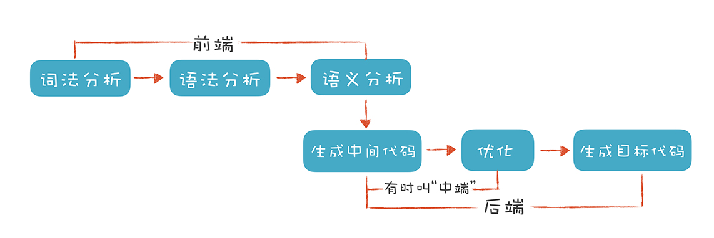
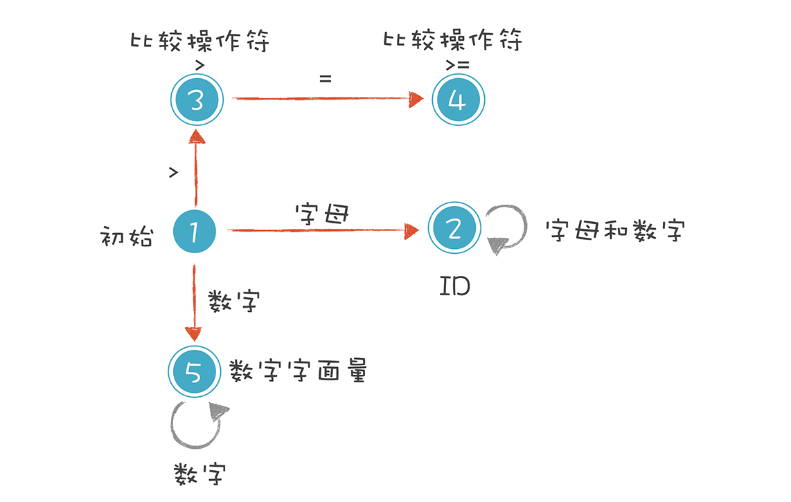

## 2021-08-09-llvm学习

## 0 前言

分为两个部分，一个是极客时间的编译原理，另一个是llvm的tablecontent。我为什么要学习编译原理？因为我想学习内核，所以我需要知道后端的很多基础知识。

## 1 编译原理之美

### 1.1编译原理之美 实现一门脚本语言 原理篇

#### 1.1.1 基础知识

当然了，**这里的“前端”指的是编译器对程序代码的分析和理解过程。**它通常只跟语言的语法有关，跟目标机器无关。**而与之对应的“后端”则是生成目标代码的过程，跟目标机器有关。**



- 词法分析是把程序分割成一个个 Token 的过程，可以通过构造有限自动机来实现。
- 语法分析是把程序的结构识别出来，并形成一棵便于由计算机处理的抽象语法树。可以用递归下降的算法来实现。
- 语义分析是消除语义模糊，生成一些属性信息，让计算机能够依据这些信息生成目标代码。

#### 1.1.2 词法分析

首先将token所属各种种类的正则表达式（之所以使用正则表达式是因为正则表达式是yacc等程序所能识别的类型），对于关键字需要单独拿出来比较，或者拆分成具体的状态。这里需要明白状态有两种，一种是中间态，另一种是终态，终态才是区分是不是可以输出的最后结果。简单来说，所谓的词法分析就是建立单词的概念。真实环境下，一半不会通过手动写程序的方式来做这个同步，由于语言非常复杂，所以一般是通过查表的方式进行状态转移，重点是构造那张表。

举一个简单的例子：

```
int ax23x = 100
```

正则表达式结果为

```
Id :        [a-zA-Z_] ([a-zA-Z_] | [0-9])*
IntLiteral: [0-9]+
GT :        '>'
GE :        '>='
```

而具体的状态转移图为：



#### 1.1.3 语法分析（手工实现公示计算）

语法分析本质是词法分析完成的对象被形式化替代到最后都是终结符的过程。需要理解上下文无关文法


唉，尴尬


