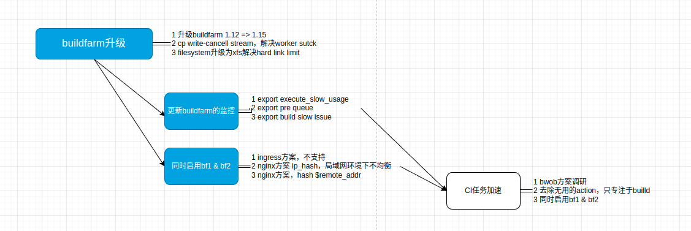
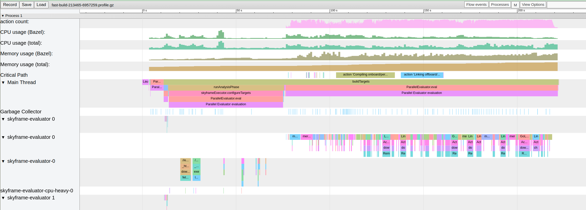
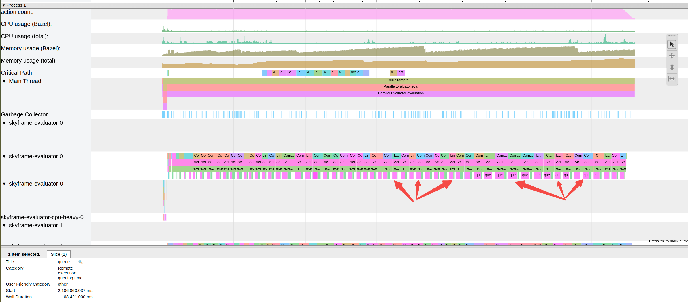
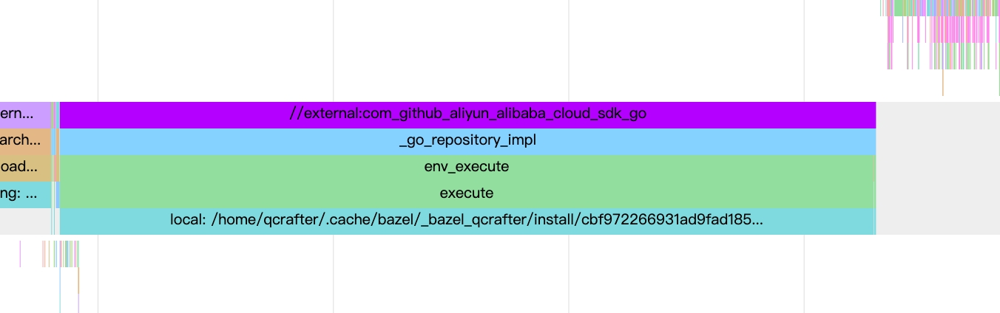

光看注释和代码不清楚怎么用，不如直接上手写。

今天的目标就是将redis-plus-plus库（c++库）从cmake编译转换为bazel编译，redis-plus-plus依赖hiredis库，hiredis库使用源码引入，redis-plus-plus依赖的uv库我们使用外部引入。

包含几个部分：

+ 如何使用bazel编译sync & async 的hiredis，并且查看生成的头文件。生成两个目标hiredis & hiredis_ssl

+ 如何使用rules_foreign_cc编译第三方外部依赖（非bazel项目）openssl & libuv，两者分别使用configure_make & cmake
+ 如何使用bazel编译生成redis++库，包括sync，async，tls版本

附录部分贴了starlark的东西：


## 1 hiredis的编译

#### 1.1 hiredis 的bazel转换

我们首先看下目前的cmakelists.txt文件，从而确定我们要生成的BUILD.bazel包含哪些东西。下面的代码我把一些没用的属性，比方说win32才需要的什么的或者一些无关的属性删除掉了。具体的分析的东西实际上在cmakelists.tx文件里面是非常清楚的，看注释即可，就不多解释了。

```cmake
# Hiredis requires C99
SET(CMAKE_C_STANDARD 99)    #C99标准，添加到copt里面即可
SET(CMAKE_POSITION_INDEPENDENT_CODE ON)    #fpic标记，编译静态库时需要加上，这样子才能生成的静态库被第三方引用
SET(CMAKE_DEBUG_POSTFIX d)

SET(hiredis_sources   #下面的.c文件对应于bazel src文件，我们可以看到目前的代码实际上是包含sync和async的，
    alloc.c
    async.c
    dict.c
    hiredis.c
    net.c
    read.c
    sds.c
    sockcompat.c)

SET(hiredis_sources ${hiredis_sources})

...

ADD_LIBRARY(hiredis SHARED ${hiredis_sources})     #要生成这两个库文件
ADD_LIBRARY(hiredis_static STATIC ${hiredis_sources})

SET_TARGET_PROPERTIES(hiredis
    PROPERTIES WINDOWS_EXPORT_ALL_SYMBOLS TRUE
    VERSION "${HIREDIS_SONAME}")
SET_TARGET_PROPERTIES(hiredis_static
    PROPERTIES COMPILE_PDB_NAME hiredis_static)
SET_TARGET_PROPERTIES(hiredis_static
    PROPERTIES COMPILE_PDB_NAME_DEBUG hiredis_static${CMAKE_DEBUG_POSTFIX})


#INSTALL_INTERFACE用于给install的时候指定使用的引用文件，那么INSTALL_INTERFACE又是怎么指定的？看这个https://ravenxrz.ink/archives/e40194d1.html
TARGET_INCLUDE_DIRECTORIES(hiredis PUBLIC $<INSTALL_INTERFACE:include> $<BUILD_INTERFACE:${CMAKE_CURRENT_SOURCE_DIR}>)
TARGET_INCLUDE_DIRECTORIES(hiredis_static PUBLIC $<INSTALL_INTERFACE:include> $<BUILD_INTERFACE:${CMAKE_CURRENT_SOURCE_DIR}>)

#CONFIGURE_FILE替换原本的普通文件的内容，给pkg用的，不需要了，所以去掉
CONFIGURE_FILE(hiredis.pc.in hiredis.pc @ONLY)

...

#Cpack打包的内容，直接省略了，关系并不大
...

IF(ENABLE_SSL)
    IF (NOT OPENSSL_ROOT_DIR)  #这个是export的openssl根目录，用来判断找openssl
        IF (APPLE)
            SET(OPENSSL_ROOT_DIR "/usr/local/opt/openssl")
        ENDIF()
    ENDIF()
    FIND_PACKAGE(OpenSSL REQUIRED)  #找到依赖的openssl库
    SET(hiredis_ssl_sources         #编译hiredis_ssl库的源文件
        ssl.c)
    ADD_LIBRARY(hiredis_ssl SHARED  
            ${hiredis_ssl_sources}) #设定生成的库文件
    ADD_LIBRARY(hiredis_ssl_static STATIC
            ${hiredis_ssl_sources})

	...

    SET_TARGET_PROPERTIES(hiredis_ssl_static
        PROPERTIES COMPILE_PDB_NAME hiredis_ssl_static)
    SET_TARGET_PROPERTIES(hiredis_ssl_static
        PROPERTIES COMPILE_PDB_NAME_DEBUG hiredis_ssl_static${CMAKE_DEBUG_POSTFIX})

    TARGET_INCLUDE_DIRECTORIES(hiredis_ssl PRIVATE "${OPENSSL_INCLUDE_DIR}")  #引入openssl包裹的头文件，只给自己用。不会暴露给hiredis_ssl的使用者
    TARGET_INCLUDE_DIRECTORIES(hiredis_ssl_static PRIVATE "${OPENSSL_INCLUDE_DIR}")

    TARGET_LINK_LIBRARIES(hiredis_ssl PRIVATE ${OPENSSL_LIBRARIES})
...

    INSTALL(TARGETS hiredis_ssl hiredis_ssl_static
        EXPORT hiredis_ssl-targets
        RUNTIME DESTINATION ${CMAKE_INSTALL_BINDIR}    #安装bin文件的位置
        LIBRARY DESTINATION ${CMAKE_INSTALL_LIBDIR}    #安装动态库的位置
        ARCHIVE DESTINATION ${CMAKE_INSTALL_LIBDIR})   #安装静态库的位置

...

    INSTALL(FILES hiredis_ssl.h   
        DESTINATION ${CMAKE_INSTALL_INCLUDEDIR}/hiredis)        #可以看到安装头文件的位置，将hiredis_ssl.h搞到了安装头文件hiredis里面

    INSTALL(FILES ${CMAKE_CURRENT_BINARY_DIR}/hiredis_ssl.pc    #提供给pkg安装用的，不用关注
        DESTINATION ${CMAKE_INSTALL_LIBDIR}/pkgconfig)

    export(EXPORT hiredis_ssl-targets
           FILE "${CMAKE_CURRENT_BINARY_DIR}/hiredis_ssl-targets.cmake"
           NAMESPACE hiredis::)

    SET(CMAKE_CONF_INSTALL_DIR share/hiredis_ssl)
    ...
ENDIF()

...
```

有几点需要单独解释。

头文件可见性控制：无论是bazel还是cmake，实际上都在追究一个头文件可见性。一些老的c/c++代码是直接把头文件和代码放到一起，然后直接`include "foo.h"`。cmake通过指定TARGET_INCLUDE_DIRECTORIES来确定引用哪些目录，然后调用者可以类似上面`include "foo.h"`调用头文件。这里面引发一个问题，直接`target_link_libraries`，头文件会使用库引入而直接暴露的头文件，也就是上一层库暴露的头文件，这里`TARGET_INCLUDE_DIRECTORIES(hiredis PUBLIC $<INSTALL_INTERFACE:include> $<BUILD_INTERFACE:${CMAKE_CURRENT_SOURCE_DIR}>)`就是公开包，打包openssl的时候就是私有包`TARGET_INCLUDE_DIRECTORIES(hiredis_ssl PRIVATE "${OPENSSL_INCLUDE_DIR}")`参考链接：https://ravenxrz.ink/archives/e40194d1.html，而bazel是采用相对于workspace的相对路径来引用具体的文件。

需要简单解释INSTALL_INTERFACE & BUILD_INTERFACE的意思，两者分别指定了编译/安装的时候需要执行的操作，在target_include_directories的时候，我理解就是找到引用的头文件。BUILD_INTERFACE是指编译的时候会使用这些指定的头文件。而安装的时候会指定使用INSTALL_INTERFACE的头文件，Nmmm，但是我实际上没明白的是，到了安装的时候，我应该只暴露一个单独的给外界使用的外部接口的头文件和库文件，干嘛还需要依赖依赖头文件呢？我又仔细想了下，觉得可能这个所谓的install_interface不是常见的直接找头文件和lib库的方式，可能是一种所谓的modern cmake，即找到其它的依托cmake的build，然后使用里面的引用的头文件，举一个简单的例子，下面的例子是先find_package，不行了才执行find_library命令。而find_package即为modern cmake的部分，即从找二进制文件脱离到一个包上，从而可以指定版本，组件等信息。具体可以参考《Professional-CMake》23章。

```cmake

# hiredis dependency
find_package(hiredis QUIET)
if(hiredis_FOUND)
    list(APPEND REDIS_PLUS_PLUS_HIREDIS_LIBS hiredis::hiredis)

    if(REDIS_PLUS_PLUS_USE_TLS)
        find_package(hiredis_ssl REQUIRED)
        list(APPEND REDIS_PLUS_PLUS_HIREDIS_LIBS hiredis::hiredis_ssl)
    endif()
else()
    find_path(HIREDIS_HEADER hiredis REQUIRED)
    find_library(HIREDIS_LIB hiredis REQUIRED)
    list(APPEND REDIS_PLUS_PLUS_HIREDIS_LIBS ${HIREDIS_LIB})

    if(REDIS_PLUS_PLUS_USE_TLS)
        find_library(HIREDIS_TLS_LIB hiredis_ssl REQUIRED)
        list(APPEND REDIS_PLUS_PLUS_HIREDIS_LIBS ${HIREDIS_TLS_LIB})
    endif()
endif()
```


如果对cmake还有疑问，建议直接看这个https://zhuanlan.zhihu.com/p/393316878，国内写的很详尽的内容。或者直接看官方文档https://cmake.org/cmake/help/git-stage/guide/importing-exporting/index.html#exporting-targets, 如果对modern cmake有疑问，建议看看https://zhuanlan.zhihu.com/p/76975231，这个知乎的专栏写的比较清楚了。

xxx.pc是什么：**CFLAGS：** 指定头文件（.h文件）的路径，如：CFLAGS=-I/usr/include -I/path/include。同样地，安装一个包时会在安装路径下建立一个include目录，当安装过程中出现问题时，试着把以前安装的包的include目录加入到该变量中来。可以看到下面制定了具体安装的路径是默认的prefix/include/hiredis。当然因为我们不适用pkg软件了，所以实际上我们不需要关注这个。上面的代码我注释掉了

```makefile
prefix=@CMAKE_INSTALL_PREFIX@
install_libdir=@CMAKE_INSTALL_LIBDIR@
exec_prefix=${prefix}
libdir=${exec_prefix}/${install_libdir}
includedir=${prefix}/include
pkgincludedir=${includedir}/hiredis

Name: hiredis
Description: Minimalistic C client library for Redis.
Version: @PROJECT_VERSION@
Libs: -L${libdir} -lhiredis
Cflags: -I${pkgincludedir} -D_FILE_OFFSET_BITS=64
```

使用编译安装的时候还遇到一个问题，即async.c文件44行引用的是个dict.c文件，解决方法有两种：将这个改成dict.h，这个dict.c加到hdrs里面作为头文件引入。最终的BUILD文件如下。在公司的时候和同事聊确认一点，不推荐修改代码。修改代码的方式很糟糕。

```BUILD
cc_library(
    name = "hiredis",
    srcs = [
        "alloc.c",
        "dict.c",
        "async.c",
        "hiredis.c",
        "net.c",
        "read.c",
        "sds.c",
        "sockcompat.c",
    ],
    hdrs = glob(["*.h"])+glob(["adapters/*.h"])+["dict.c",],  #dict.c的引入是因为被async.c引了，而adapters是编译async时候别的库要使用
    include_prefix = "hiredis",
    visibility = ["//visibility:public"],
)

cc_library(
    name = "hiredis_ssl",
    srcs = [
        "ssl.c",
    ],
    hdrs = glob(["*.h"]),
    deps = [
        "//third_party/openssl:openssl",   #我们重点关注下这个是怎么引入的
        ],
    include_prefix = "hiredis",
    visibility = ["//visibility:public"],
)
```

#### 1.1 转换时学习bazel的行为

bazel是一个追求编译速度的软件，编译hiredis_ssl的时候，这里要注意一点，如果头文件第一次拷贝过了，以后修改hdrs不需要了，它是不会删除的，依然会保留那些不用的；如果不存在才会再次拷贝。换言之，按需拷贝。另外头文件的路径是按照hdrs里面写的相对路径组织的。

```shell
root@3f01551b38dd:~/code_test/cmake2bazel# ls  bazel-out/k8-fastbuild/bin/third_party/hiredis/_virtual_includes/hiredis_ssl/hiredis_ssl/
alloc.h  async.h  async_private.h  dict.h  fmacros.h  hiredis.h  hiredis_ssl.h  net.h  read.h  sds.h  sdsalloc.h  sockcompat.h  win32.h
```

我们再看编译redis++的时候虚拟头文件是什么，我们知道hdrs是这么写的

```shell
hdrs = glob(["src/sw/redis++/*.h"])+glob(["src/sw/redis++/*.hpp"])+glob(["src/sw/redis++/cxx17/*.h"])+glob(["src/sw/redis++/no_tls/*.h"])
```

它会按照文件的布局，组织头文件和目录拷贝到对应的`/文件目标名字/文件目标名字`下面，但是引用的时候按照最顶级的共享目录的名字来引用。参照下面的diff，我想使用tls.h的时候，可以`#include "third_party/redis-plus-plus/src/sw/redis++/no_tls/tls.h"`，那么为什么也可以`#include "no_tls/tls.h"`呢，因为我们保持了相对路径的正确性。第一种写法是相对于cmake2bazel的WORKSPCE的路径，而第二种是直接找的索引的最根本的想对路径。

```shell
root@3f01551b38dd:~/code_test/cmake2bazel# ll bazel-out/k8-fastbuild/bin/third_party/redis-plus-plus/_virtual_includes/redis++/redis++/src/sw/redis++/
total 136
drwxr-xr-x 4 root root 4096 Nov 20 21:45 ./
drwxr-xr-x 3 root root 4096 Nov 20 21:45 ../
lrwxrwxrwx 1 root root   89 Nov 20 21:45 async_connection.h -> /root/code_test/cmake2bazel/third_party/redis-plus-plus/src/sw/redis++/async_connection.h
lrwxrwxrwx 1 root root   94 Nov 20 21:45 async_connection_pool.h -> /root/code_test/cmake2bazel/third_party/redis-plus-plus/src/sw/redis++/async_connection_pool.h
lrwxrwxrwx 1 root root   86 Nov 20 21:45 async_redis++.h -> /root/code_test/cmake2bazel/third_party/redis-plus-plus/src/sw/redis++/async_redis++.h
lrwxrwxrwx 1 root root   84 Nov 20 21:45 async_redis.h -> /root/code_test/cmake2bazel/third_party/redis-plus-plus/src/sw/redis++/async_redis.h
lrwxrwxrwx 1 root root   92 Nov 20 21:45 async_redis_cluster.h -> /root/code_test/cmake2bazel/third_party/redis-plus-plus/src/sw/redis++/async_redis_cluster.h
lrwxrwxrwx 1 root root   87 Nov 20 21:45 async_sentinel.h -> /root/code_test/cmake2bazel/third_party/redis-plus-plus/src/sw/redis++/async_sentinel.h
lrwxrwxrwx 1 root root   90 Nov 20 21:45 async_shards_pool.h -> /root/code_test/cmake2bazel/third_party/redis-plus-plus/src/sw/redis++/async_shards_pool.h
lrwxrwxrwx 1 root root   86 Nov 20 21:45 cmd_formatter.h -> /root/code_test/cmake2bazel/third_party/redis-plus-plus/src/sw/redis++/cmd_formatter.h
lrwxrwxrwx 1 root root   80 Nov 20 21:45 command.h -> /root/code_test/cmake2bazel/third_party/redis-plus-plus/src/sw/redis++/command.h
lrwxrwxrwx 1 root root   85 Nov 20 21:45 command_args.h -> /root/code_test/cmake2bazel/third_party/redis-plus-plus/src/sw/redis++/command_args.h
lrwxrwxrwx 1 root root   88 Nov 20 21:45 command_options.h -> /root/code_test/cmake2bazel/third_party/redis-plus-plus/src/sw/redis++/command_options.h
lrwxrwxrwx 1 root root   83 Nov 20 21:45 connection.h -> /root/code_test/cmake2bazel/third_party/redis-plus-plus/src/sw/redis++/connection.h
lrwxrwxrwx 1 root root   88 Nov 20 21:45 connection_pool.h -> /root/code_test/cmake2bazel/third_party/redis-plus-plus/src/sw/redis++/connection_pool.h
drwxr-xr-x 2 root root 4096 Nov 20 21:45 cxx17/
lrwxrwxrwx 1 root root   79 Nov 20 21:45 errors.h -> /root/code_test/cmake2bazel/third_party/redis-plus-plus/src/sw/redis++/errors.h
lrwxrwxrwx 1 root root   83 Nov 20 21:45 event_loop.h -> /root/code_test/cmake2bazel/third_party/redis-plus-plus/src/sw/redis++/event_loop.h
drwxr-xr-x 2 root root 4096 Nov 20 21:45 no_tls/
lrwxrwxrwx 1 root root   81 Nov 20 21:45 pipeline.h -> /root/code_test/cmake2bazel/third_party/redis-plus-plus/src/sw/redis++/pipeline.h
lrwxrwxrwx 1 root root   85 Nov 20 21:45 queued_redis.h -> /root/code_test/cmake2bazel/third_party/redis-plus-plus/src/sw/redis++/queued_redis.h
lrwxrwxrwx 1 root root   87 Nov 20 21:45 queued_redis.hpp -> /root/code_test/cmake2bazel/third_party/redis-plus-plus/src/sw/redis++/queued_redis.hpp
lrwxrwxrwx 1 root root   80 Nov 20 21:45 redis++.h -> /root/code_test/cmake2bazel/third_party/redis-plus-plus/src/sw/redis++/redis++.h
lrwxrwxrwx 1 root root   78 Nov 20 21:45 redis.h -> /root/code_test/cmake2bazel/third_party/redis-plus-plus/src/sw/redis++/redis.h
lrwxrwxrwx 1 root root   80 Nov 20 21:45 redis.hpp -> /root/code_test/cmake2bazel/third_party/redis-plus-plus/src/sw/redis++/redis.hpp
lrwxrwxrwx 1 root root   86 Nov 20 21:45 redis_cluster.h -> /root/code_test/cmake2bazel/third_party/redis-plus-plus/src/sw/redis++/redis_cluster.h
lrwxrwxrwx 1 root root   88 Nov 20 21:45 redis_cluster.hpp -> /root/code_test/cmake2bazel/third_party/redis-plus-plus/src/sw/redis++/redis_cluster.hpp
lrwxrwxrwx 1 root root   78 Nov 20 21:45 reply.h -> /root/code_test/cmake2bazel/third_party/redis-plus-plus/src/sw/redis++/reply.h
lrwxrwxrwx 1 root root   81 Nov 20 21:45 sentinel.h -> /root/code_test/cmake2bazel/third_party/redis-plus-plus/src/sw/redis++/sentinel.h
lrwxrwxrwx 1 root root   79 Nov 20 21:45 shards.h -> /root/code_test/cmake2bazel/third_party/redis-plus-plus/src/sw/redis++/shards.h
lrwxrwxrwx 1 root root   84 Nov 20 21:45 shards_pool.h -> /root/code_test/cmake2bazel/third_party/redis-plus-plus/src/sw/redis++/shards_pool.h
lrwxrwxrwx 1 root root   83 Nov 20 21:45 subscriber.h -> /root/code_test/cmake2bazel/third_party/redis-plus-plus/src/sw/redis++/subscriber.h
lrwxrwxrwx 1 root root   84 Nov 20 21:45 transaction.h -> /root/code_test/cmake2bazel/third_party/redis-plus-plus/src/sw/redis++/transaction.h
lrwxrwxrwx 1 root root   78 Nov 20 21:45 utils.h -> /root/code_test/cmake2bazel/third_party/redis-plus-plus/src/sw/redis++/utils.h
```

现在我们考虑另一个问题，引用的第三方头文件在哪里？redis++引用hiredis，具体的代码可以参考下面的diff，它引用的目录是hiredis/redis.h。为什么能够直接找到呢？因为hiredis的BUILD里面有一句`include_prefix = "hiredis"`，从而将头文件的相对位置补齐了，从而redis++能够从hiredis目录找到具体的hiredis.h文件。查找include_prefix的定义会发现

> The prefix to add to the paths of the headers of this rule.
>
> When set, the headers in the `hdrs` attribute of this rule are accessible at is the value of this attribute prepended to their repository-relative path.

```shell
root@3f01551b38dd:~/code_test/cmake2bazel/third_party/redis-plus-plus# egrep -R "hiredis.h"
src/sw/redis++/cmd_formatter.h:#include <hiredis/hiredis.h>
src/sw/redis++/tls/tls.h:#include <hiredis/hiredis.h>
src/sw/redis++/tls/tls.h:#include <hiredis/hiredis_ssl.h>
src/sw/redis++/redis.cpp:#include <hiredis/hiredis.h>
src/sw/redis++/redis_cluster.cpp:#include <hiredis/hiredis.h>
src/sw/redis++/no_tls/tls.h:#include <hiredis/hiredis.h>
src/sw/redis++/reply.h:#include <hiredis/hiredis.h>
src/sw/redis++/connection.h:#include <hiredis/hiredis.h>
src/sw/redis++/errors.h:#include <hiredis/hiredis.h>
```

编译redis++的时候，_virtual_includes下面包含的文件

如果去掉了include_prefix我们再看具体的编译输出代码，重点看具体编译的命令。

```shell
root@3f01551b38dd:~/code_test/cmake2bazel# bazel build //third_party/redis-plus-plus:redis++   --sandbox_debug
INFO: Analyzed target //third_party/redis-plus-plus:redis++ (1 packages loaded, 23 targets configured).
INFO: Found 1 target...
INFO: From Compiling third_party/hiredis/dict.c:
third_party/hiredis/dict.c:277:19: warning: 'dictNext' defined but not used [-Wunused-function]
  277 | static dictEntry *dictNext(dictIterator *iter) {
      |                   ^~~~~~~~
third_party/hiredis/dict.c:270:13: warning: 'dictInitIterator' defined but not used [-Wunused-function]
  270 | static void dictInitIterator(dictIterator *iter, dict *ht) {
      |             ^~~~~~~~~~~~~~~~
third_party/hiredis/dict.c:250:13: warning: 'dictRelease' defined but not used [-Wunused-function]
  250 | static void dictRelease(dict *ht) {
      |             ^~~~~~~~~~~
third_party/hiredis/dict.c:194:12: warning: 'dictDelete' defined but not used [-Wunused-function]
  194 | static int dictDelete(dict *ht, const void *key) {
      |            ^~~~~~~~~~
third_party/hiredis/dict.c:169:12: warning: 'dictReplace' defined but not used [-Wunused-function]
  169 | static int dictReplace(dict *ht, void *key, void *val) {
      |            ^~~~~~~~~~~
third_party/hiredis/dict.c:74:14: warning: 'dictCreate' defined but not used [-Wunused-function]
   74 | static dict *dictCreate(dictType *type, void *privDataPtr) {
      |              ^~~~~~~~~~
third_party/hiredis/dict.c:54:21: warning: 'dictGenHashFunction' defined but not used [-Wunused-function]
   54 | static unsigned int dictGenHashFunction(const unsigned char *buf, int len) {
      |                     ^~~~~~~~~~~~~~~~~~~
Target //third_party/redis-plus-plus:redis++ up-to-date:
  bazel-bin/third_party/redis-plus-plus/libredis++.a
  bazel-bin/third_party/redis-plus-plus/libredis++.so
INFO: Elapsed time: 2.323s, Critical Path: 2.11s
INFO: 24 processes: 1 internal, 23 processwrapper-sandbox.
INFO: Build completed successfully, 24 total actions
root@3f01551b38dd:~/code_test/cmake2bazel# vim third_party/hiredis/BUILD
root@3f01551b38dd:~/code_test/cmake2bazel# bazel build //third_party/redis-plus-plus:redis++   --sandbox_debug
INFO: Analyzed target //third_party/redis-plus-plus:redis++ (1 packages loaded, 23 targets configured).
INFO: Found 1 target...
INFO: From Compiling third_party/hiredis/dict.c:
third_party/hiredis/dict.c:277:19: warning: 'dictNext' defined but not used [-Wunused-function]
  277 | static dictEntry *dictNext(dictIterator *iter) {
      |                   ^~~~~~~~
third_party/hiredis/dict.c:270:13: warning: 'dictInitIterator' defined but not used [-Wunused-function]
  270 | static void dictInitIterator(dictIterator *iter, dict *ht) {
      |             ^~~~~~~~~~~~~~~~
third_party/hiredis/dict.c:250:13: warning: 'dictRelease' defined but not used [-Wunused-function]
  250 | static void dictRelease(dict *ht) {
      |             ^~~~~~~~~~~
third_party/hiredis/dict.c:194:12: warning: 'dictDelete' defined but not used [-Wunused-function]
  194 | static int dictDelete(dict *ht, const void *key) {
      |            ^~~~~~~~~~
third_party/hiredis/dict.c:169:12: warning: 'dictReplace' defined but not used [-Wunused-function]
  169 | static int dictReplace(dict *ht, void *key, void *val) {
      |            ^~~~~~~~~~~
third_party/hiredis/dict.c:74:14: warning: 'dictCreate' defined but not used [-Wunused-function]
   74 | static dict *dictCreate(dictType *type, void *privDataPtr) {
      |              ^~~~~~~~~~
third_party/hiredis/dict.c:54:21: warning: 'dictGenHashFunction' defined but not used [-Wunused-function]
   54 | static unsigned int dictGenHashFunction(const unsigned char *buf, int len) {
      |                     ^~~~~~~~~~~~~~~~~~~
ERROR: /root/code_test/cmake2bazel/third_party/redis-plus-plus/BUILD:1:11: Compiling third_party/redis-plus-plus/src/sw/redis++/command_options.cpp failed: (Exit 1): process-wrapper failed: error executing command
  (cd /root/.cache/bazel/_bazel_root/40ee89a49d5eb376cc6e6e5356870e5a/sandbox/processwrapper-sandbox/52/execroot/cmake2bazel && \
  exec env - \
    PATH=/usr/local/sbin:/usr/local/bin:/usr/sbin:/usr/bin:/sbin:/bin \
    PWD=/proc/self/cwd \
    TMPDIR=/tmp \
  /root/.cache/bazel/_bazel_root/install/ee8d7e4b6774884ed2cd0aece6fc9fda/process-wrapper '--timeout=0' '--kill_delay=15' /usr/bin/gcc -U_FORTIFY_SOURCE -fstack-protector -Wall -Wunused-but-set-parameter -Wno-free-nonheap-object -fno-omit-frame-pointer '-std=c++0x' -MD -MF bazel-out/k8-fastbuild/bin/third_party/redis-plus-plus/_objs/redis++/command_options.pic.d '-frandom-seed=bazel-out/k8-fastbuild/bin/third_party/redis-plus-plus/_objs/redis++/command_options.pic.o' -fPIC -iquote . -iquote bazel-out/k8-fastbuild/bin -Ibazel-out/k8-fastbuild/bin/third_party/redis-plus-plus/_virtual_includes/redis++ '-std=c++17' -fno-canonical-system-headers -Wno-builtin-macro-redefined '-D__DATE__="redacted"' '-D__TIMESTAMP__="redacted"' '-D__TIME__="redacted"' -c third_party/redis-plus-plus/src/sw/redis++/command_options.cpp -o bazel-out/k8-fastbuild/bin/third_party/redis-plus-plus/_objs/redis++/command_options.pic.o)
In file included from third_party/redis-plus-plus/src/sw/redis++/command_options.cpp:18:
third_party/redis-plus-plus/src/sw/redis++/errors.h:22:10: fatal error: hiredis/hiredis.h: No such file or directory
   22 | #include <hiredis/hiredis.h>
      |          ^~~~~~~~~~~~~~~~~~~
compilation terminated.
Target //third_party/redis-plus-plus:redis++ failed to build
Use --verbose_failures to see the command lines of failed build steps.
INFO: Elapsed time: 0.284s, Critical Path: 0.13s
INFO: 24 processes: 16 internal, 8 processwrapper-sandbox.
FAILED: Build did NOT complete successfully
```


调用process-wrapper去编译代码，引用头文件的目录的选项和具体设置为`-Ibazel-out/k8-fastbuild/bin/third_party/redis-plus-plus/_virtual_includes/redis++`而编译的文件为`-c third_party/redis-plus-plus/src/sw/redis++/command.cpp`，生成的中间文件为`-o bazel-out/k8-fastbuild/bin/third_party/redis-plus-plus/_objs/redis++/command.pic.o`。但是我们很清楚gcc不会递归查找头文件，那么头文件是怎么找到的呢？

> /root/.cache/bazel/_bazel_root/40ee89a49d5eb376cc6e6e5356870e5a/sandbox/processwrapper-sandbox/52/execroot/cmake2bazel

这里就可以看到具体的执行的路径了，换言之是在这个路径下的找到`third_party/redis-plus-plus/src/sw/redis++/command.cpp`，而相应的头文件也是拷贝到这个文件夹下面的相对路径。而不是我们本身的WORKSPACE所在的相对路径。可以看到只包含了要编译的cpp文件，和redis++里面的头文件，那么hiredis的头文件如何引入呢？

```shell
root@3f01551b38dd:~/.cache/bazel/_bazel_root/40ee89a49d5eb376cc6e6e5356870e5a/sandbox/processwrapper-sandbox/52/execroot/cmake2bazel# ll third_party/redis-plus-plus/src/sw/redis++/
total 140
drwxr-xr-x 4 root root 4096 Nov 21 14:05 ./
drwxr-xr-x 3 root root 4096 Nov 21 14:05 ../
lrwxrwxrwx 1 root root  146 Nov 21 14:05 async_connection.h -> /root/.cache/bazel/_bazel_root/40ee89a49d5eb376cc6e6e5356870e5a/execroot/cmake2bazel/third_party/redis-plus-plus/src/sw/redis++/async_connection.h
lrwxrwxrwx 1 root root  151 Nov 21 14:05 async_connection_pool.h -> /root/.cache/bazel/_bazel_root/40ee89a49d5eb376cc6e6e5356870e5a/execroot/cmake2bazel/third_party/redis-plus-plus/src/sw/redis++/async_connection_pool.h
lrwxrwxrwx 1 root root  143 Nov 21 14:05 async_redis++.h -> /root/.cache/bazel/_bazel_root/40ee89a49d5eb376cc6e6e5356870e5a/execroot/cmake2bazel/third_party/redis-plus-plus/src/sw/redis++/async_redis++.h
lrwxrwxrwx 1 root root  141 Nov 21 14:05 async_redis.h -> /root/.cache/bazel/_bazel_root/40ee89a49d5eb376cc6e6e5356870e5a/execroot/cmake2bazel/third_party/redis-plus-plus/src/sw/redis++/async_redis.h
lrwxrwxrwx 1 root root  149 Nov 21 14:05 async_redis_cluster.h -> /root/.cache/bazel/_bazel_root/40ee89a49d5eb376cc6e6e5356870e5a/execroot/cmake2bazel/third_party/redis-plus-plus/src/sw/redis++/async_redis_cluster.h
lrwxrwxrwx 1 root root  144 Nov 21 14:05 async_sentinel.h -> /root/.cache/bazel/_bazel_root/40ee89a49d5eb376cc6e6e5356870e5a/execroot/cmake2bazel/third_party/redis-plus-plus/src/sw/redis++/async_sentinel.h
lrwxrwxrwx 1 root root  147 Nov 21 14:05 async_shards_pool.h -> /root/.cache/bazel/_bazel_root/40ee89a49d5eb376cc6e6e5356870e5a/execroot/cmake2bazel/third_party/redis-plus-plus/src/sw/redis++/async_shards_pool.h
lrwxrwxrwx 1 root root  143 Nov 21 14:05 cmd_formatter.h -> /root/.cache/bazel/_bazel_root/40ee89a49d5eb376cc6e6e5356870e5a/execroot/cmake2bazel/third_party/redis-plus-plus/src/sw/redis++/cmd_formatter.h
lrwxrwxrwx 1 root root  137 Nov 21 14:05 command.h -> /root/.cache/bazel/_bazel_root/40ee89a49d5eb376cc6e6e5356870e5a/execroot/cmake2bazel/third_party/redis-plus-plus/src/sw/redis++/command.h
lrwxrwxrwx 1 root root  142 Nov 21 14:05 command_args.h -> /root/.cache/bazel/_bazel_root/40ee89a49d5eb376cc6e6e5356870e5a/execroot/cmake2bazel/third_party/redis-plus-plus/src/sw/redis++/command_args.h
lrwxrwxrwx 1 root root  147 Nov 21 14:05 command_options.cpp -> /root/.cache/bazel/_bazel_root/40ee89a49d5eb376cc6e6e5356870e5a/execroot/cmake2bazel/third_party/redis-plus-plus/src/sw/redis++/command_options.cpp
lrwxrwxrwx 1 root root  145 Nov 21 14:05 command_options.h -> /root/.cache/bazel/_bazel_root/40ee89a49d5eb376cc6e6e5356870e5a/execroot/cmake2bazel/third_party/redis-plus-plus/src/sw/redis++/command_options.h
lrwxrwxrwx 1 root root  140 Nov 21 14:05 connection.h -> /root/.cache/bazel/_bazel_root/40ee89a49d5eb376cc6e6e5356870e5a/execroot/cmake2bazel/third_party/redis-plus-plus/src/sw/redis++/connection.h
lrwxrwxrwx 1 root root  145 Nov 21 14:05 connection_pool.h -> /root/.cache/bazel/_bazel_root/40ee89a49d5eb376cc6e6e5356870e5a/execroot/cmake2bazel/third_party/redis-plus-plus/src/sw/redis++/connection_pool.h
drwxr-xr-x 2 root root 4096 Nov 21 14:05 cxx17/
lrwxrwxrwx 1 root root  136 Nov 21 14:05 errors.h -> /root/.cache/bazel/_bazel_root/40ee89a49d5eb376cc6e6e5356870e5a/execroot/cmake2bazel/third_party/redis-plus-plus/src/sw/redis++/errors.h
lrwxrwxrwx 1 root root  140 Nov 21 14:05 event_loop.h -> /root/.cache/bazel/_bazel_root/40ee89a49d5eb376cc6e6e5356870e5a/execroot/cmake2bazel/third_party/redis-plus-plus/src/sw/redis++/event_loop.h
drwxr-xr-x 2 root root 4096 Nov 21 14:05 no_tls/
lrwxrwxrwx 1 root root  138 Nov 21 14:05 pipeline.h -> /root/.cache/bazel/_bazel_root/40ee89a49d5eb376cc6e6e5356870e5a/execroot/cmake2bazel/third_party/redis-plus-plus/src/sw/redis++/pipeline.h
lrwxrwxrwx 1 root root  142 Nov 21 14:05 queued_redis.h -> /root/.cache/bazel/_bazel_root/40ee89a49d5eb376cc6e6e5356870e5a/execroot/cmake2bazel/third_party/redis-plus-plus/src/sw/redis++/queued_redis.h
lrwxrwxrwx 1 root root  144 Nov 21 14:05 queued_redis.hpp -> /root/.cache/bazel/_bazel_root/40ee89a49d5eb376cc6e6e5356870e5a/execroot/cmake2bazel/third_party/redis-plus-plus/src/sw/redis++/queued_redis.hpp
lrwxrwxrwx 1 root root  137 Nov 21 14:05 redis++.h -> /root/.cache/bazel/_bazel_root/40ee89a49d5eb376cc6e6e5356870e5a/execroot/cmake2bazel/third_party/redis-plus-plus/src/sw/redis++/redis++.h
lrwxrwxrwx 1 root root  135 Nov 21 14:05 redis.h -> /root/.cache/bazel/_bazel_root/40ee89a49d5eb376cc6e6e5356870e5a/execroot/cmake2bazel/third_party/redis-plus-plus/src/sw/redis++/redis.h
lrwxrwxrwx 1 root root  137 Nov 21 14:05 redis.hpp -> /root/.cache/bazel/_bazel_root/40ee89a49d5eb376cc6e6e5356870e5a/execroot/cmake2bazel/third_party/redis-plus-plus/src/sw/redis++/redis.hpp
lrwxrwxrwx 1 root root  143 Nov 21 14:05 redis_cluster.h -> /root/.cache/bazel/_bazel_root/40ee89a49d5eb376cc6e6e5356870e5a/execroot/cmake2bazel/third_party/redis-plus-plus/src/sw/redis++/redis_cluster.h
lrwxrwxrwx 1 root root  145 Nov 21 14:05 redis_cluster.hpp -> /root/.cache/bazel/_bazel_root/40ee89a49d5eb376cc6e6e5356870e5a/execroot/cmake2bazel/third_party/redis-plus-plus/src/sw/redis++/redis_cluster.hpp
lrwxrwxrwx 1 root root  135 Nov 21 14:05 reply.h -> /root/.cache/bazel/_bazel_root/40ee89a49d5eb376cc6e6e5356870e5a/execroot/cmake2bazel/third_party/redis-plus-plus/src/sw/redis++/reply.h
lrwxrwxrwx 1 root root  138 Nov 21 14:05 sentinel.h -> /root/.cache/bazel/_bazel_root/40ee89a49d5eb376cc6e6e5356870e5a/execroot/cmake2bazel/third_party/redis-plus-plus/src/sw/redis++/sentinel.h
lrwxrwxrwx 1 root root  136 Nov 21 14:05 shards.h -> /root/.cache/bazel/_bazel_root/40ee89a49d5eb376cc6e6e5356870e5a/execroot/cmake2bazel/third_party/redis-plus-plus/src/sw/redis++/shards.h
lrwxrwxrwx 1 root root  141 Nov 21 14:05 shards_pool.h -> /root/.cache/bazel/_bazel_root/40ee89a49d5eb376cc6e6e5356870e5a/execroot/cmake2bazel/third_party/redis-plus-plus/src/sw/redis++/shards_pool.h
lrwxrwxrwx 1 root root  140 Nov 21 14:05 subscriber.h -> /root/.cache/bazel/_bazel_root/40ee89a49d5eb376cc6e6e5356870e5a/execroot/cmake2bazel/third_party/redis-plus-plus/src/sw/redis++/subscriber.h
lrwxrwxrwx 1 root root  141 Nov 21 14:05 transaction.h -> /root/.cache/bazel/_bazel_root/40ee89a49d5eb376cc6e6e5356870e5a/execroot/cmake2bazel/third_party/redis-plus-plus/src/sw/redis++/transaction.h
lrwxrwxrwx 1 root root  135 Nov 21 14:05 utils.h -> /root/.cache/bazel/_bazel_root/40ee89a49d5eb376cc6e6e5356870e5a/execroot/cmake2bazel/third_party/redis-plus-plus/src/sw/redis++/utils.h
```


所以有个问题，什么是virutal include folder。bazel使用virual includes来管理

```shell
#如果没有加prefix，在那个目录查找hiredis.h
root@3f01551b38dd:~/.cache/bazel/_bazel_root/40ee89a49d5eb376cc6e6e5356870e5a/sandbox/processwrapper-sandbox/52/execroot/cmake2bazel# find ./ -name hiredis.h
./third_party/hiredis/hiredis.h

#不加prefix，看看redis++的编译报错，可以看到没有直接引入hiredis.h文件。这是怎么回事呢？

root@3f01551b38dd:~/code_test/cmake2bazel# bazel build //third_party/redis-plus-plus:redis++   --sandbox_debug
INFO: Analyzed target //third_party/redis-plus-plus:redis++ (1 packages loaded, 23 targets configured).
INFO: Found 1 target...
ERROR: /root/code_test/cmake2bazel/third_party/redis-plus-plus/BUILD:1:11: Compiling third_party/redis-plus-plus/src/sw/redis++/command_options.cpp failed: (Exit 1): process-wrapper failed: error executing command
  (cd /root/.cache/bazel/_bazel_root/40ee89a49d5eb376cc6e6e5356870e5a/sandbox/processwrapper-sandbox/147/execroot/cmake2bazel && \
  exec env - \
    PATH=/usr/local/sbin:/usr/local/bin:/usr/sbin:/usr/bin:/sbin:/bin \
    PWD=/proc/self/cwd \
    TMPDIR=/tmp \
  /root/.cache/bazel/_bazel_root/install/ee8d7e4b6774884ed2cd0aece6fc9fda/process-wrapper '--timeout=0' '--kill_delay=15' /usr/bin/gcc -U_FORTIFY_SOURCE -fstack-protector -Wall -Wunused-but-set-parameter -Wno-free-nonheap-object -fno-omit-frame-pointer '-std=c++0x' -MD -MF bazel-out/k8-fastbuild/bin/third_party/redis-plus-plus/_objs/redis++/command_options.pic.d '-frandom-seed=bazel-out/k8-fastbuild/bin/third_party/redis-plus-plus/_objs/redis++/command_options.pic.o' -fPIC -iquote . -iquote bazel-out/k8-fastbuild/bin -Ibazel-out/k8-fastbuild/bin/third_party/redis-plus-plus/_virtual_includes/redis++ '-std=c++17' -fno-canonical-system-headers -Wno-builtin-macro-redefined '-D__DATE__="redacted"' '-D__TIMESTAMP__="redacted"' '-D__TIME__="redacted"' -c third_party/redis-plus-plus/src/sw/redis++/command_options.cpp -o bazel-out/k8-fastbuild/bin/third_party/redis-plus-plus/_objs/redis++/command_options.pic.o)
In file included from third_party/redis-plus-plus/src/sw/redis++/command_options.cpp:18:
third_party/redis-plus-plus/src/sw/redis++/errors.h:22:10: fatal error: hiredis/hiredis.h: No such file or directory
   22 | #include <hiredis/hiredis.h>
      |          ^~~~~~~~~~~~~~~~~~~
compilation terminated.
Target //third_party/redis-plus-plus:redis++ failed to build
Use --verbose_failures to see the command lines of failed build steps.
INFO: Elapsed time: 0.204s, Critical Path: 0.07s
INFO: 19 processes: 17 internal, 2 processwrapper-sandbox.
FAILED: Build did NOT complete successfully

#如果加了prefix，查找hiredis.h
root@3f01551b38dd:~/.cache/bazel/_bazel_root/40ee89a49d5eb376cc6e6e5356870e5a/sandbox/processwrapper-sandbox/88/execroot/cmake2bazel# find ./ -name hiredis.h
./third_party/hiredis/hiredis.h        #可以看到，这个路径是相对于WORKSPACE的路径，是一直存在的，无论编译与否都不会出错。这个也是推荐的编译目录
./bazel-out/k8-fastbuild/bin/third_party/hiredis/_virtual_includes/hiredis/hiredis/hiredis.h  #这个就是加了include_prefix之后生成的假的include folder

#如果加了prefix我们在看编译redis++的命令（我加了一个未导入的文件hxndg.hcc来打断生成的文件）
#可以看到引用的头文件目录多了两个，为：
#bazel-out/k8-fastbuild/bin/third_party/redis-plus-plus/_virtual_includes/redis++
#-Ibazel-out/k8-fastbuild/bin/third_party/hiredis/_virtual_includes/hiredis
root@3f01551b38dd:~/code_test/cmake2bazel# bazel build //third_party/redis-plus-plus:redis++   --sandbox_debug
INFO: Analyzed target //third_party/redis-plus-plus:redis++ (0 packages loaded, 0 targets configured).
INFO: Found 1 target...
ERROR: /root/code_test/cmake2bazel/third_party/redis-plus-plus/BUILD:1:11: Compiling third_party/redis-plus-plus/src/sw/redis++/command.cpp failed: (Exit 1): process-wrapper failed: error executing command
  (cd /root/.cache/bazel/_bazel_root/40ee89a49d5eb376cc6e6e5356870e5a/sandbox/processwrapper-sandbox/137/execroot/cmake2bazel && \
  exec env - \
    PATH=/usr/local/sbin:/usr/local/bin:/usr/sbin:/usr/bin:/sbin:/bin \
    PWD=/proc/self/cwd \
    TMPDIR=/tmp \
  /root/.cache/bazel/_bazel_root/install/ee8d7e4b6774884ed2cd0aece6fc9fda/process-wrapper '--timeout=0' '--kill_delay=15' /usr/bin/gcc -U_FORTIFY_SOURCE -fstack-protector -Wall -Wunused-but-set-parameter -Wno-free-nonheap-object -fno-omit-frame-pointer '-std=c++0x' -MD -MF bazel-out/k8-fastbuild/bin/third_party/redis-plus-plus/_objs/redis++/command.pic.d '-frandom-seed=bazel-out/k8-fastbuild/bin/third_party/redis-plus-plus/_objs/redis++/command.pic.o' -fPIC -iquote . -iquote bazel-out/k8-fastbuild/bin -Ibazel-out/k8-fastbuild/bin/third_party/redis-plus-plus/_virtual_includes/redis++ -Ibazel-out/k8-fastbuild/bin/third_party/hiredis/_virtual_includes/hiredis '-std=c++17' -fno-canonical-system-headers -Wno-builtin-macro-redefined '-D__DATE__="redacted"' '-D__TIMESTAMP__="redacted"' '-D__TIME__="redacted"' -c third_party/redis-plus-plus/src/sw/redis++/command.cpp -o bazel-out/k8-fastbuild/bin/third_party/redis-plus-plus/_objs/redis++/command.pic.o)
third_party/redis-plus-plus/src/sw/redis++/command.cpp:18:10: fatal error: hxndg.hcc: No such file or directory
   18 | #include "hxndg.hcc"
      |          ^~~~~~~~~~~
compilation terminated.
Target //third_party/redis-plus-plus:redis++ failed to build
Use --verbose_failures to see the command lines of failed build steps.
INFO: Elapsed time: 0.223s, Critical Path: 0.12s
INFO: 15 processes: 15 internal.
FAILED: Build did NOT complete successfully
```


这里存在一个问题，在modern cmake里面我们经常希望能够控制头文件/库文件的暴露，bazel是如何控制头文件暴露的？	

> For `cc_library` rules, headers in `hdrs` comprise the public interface of the library and can be directly included both from the files in `hdrs` and `srcs` of the library itself as well as from files in `hdrs` and `srcs` of `cc_*` rules that list the library in their `deps`. Headers in `srcs` must only be directly included from the files in `hdrs` and `srcs` of the library itself. 

`cc_library`的`hdrs`里面的描述

> The list of header files published by this library to be directly included by sources in dependent rules.
>
> This is the strongly preferred location for declaring header files that describe the interface for the library. These headers will be made available for inclusion by sources in this rule or in dependent rules. Headers not meant to be included by a client of this library should be listed in the `srcs` attribute instead, even if they are included by a published header

可见我们想直接暴露的头文件应当写到`cc_library`的`hdrs`里面，而内部使用的头文件写到`src`里面。

具体存储了什么看这里：https://docs.bazel.build/versions/main/output_directories.html

具体代码参考`bazel-master\src\main\java\com\google\devtools\build\lib\rules\cpp\CcCompilationHelper.java`，想理解代码建议阅读CODEBASE.md文件

bazel-out存储了中间文件，运行的环境实际上就在bazel-out里面，


## 2 openssl & libuv的编译。

### 2.1 openssl的编译 & libuv

首先，我们需要下载openssl的源码和Libuv的源代码，因此修改WORKSPACE如下

```WORKSPACE
workspace(name = "cmake2bazel")

load("@bazel_tools//tools/build_defs/repo:http.bzl", "http_archive")
# 1.0版本的rules_foreign_cc，非常老旧了，网上我就搜到一个老外博客写怎么用这个的，就是用的1.0的版本
#http_archive(
#   name = "rules_foreign_cc",
#   sha256 = "c2cdcf55ffaf49366725639e45dedd449b8c3fe22b54e31625eb80ce3a240f1e",
#   strip_prefix = "rules_foreign_cc-0.1.0",
#   url = "https://github.com/bazelbuild/rules_foreign_cc/archive/0.1.0.zip",
#)
#
#load("@rules_foreign_cc//foreign_cc:repositories.bzl", "rules_foreign_cc_dependencies")

http_archive(
   name = "rules_foreign_cc",
   strip_prefix = "rules_foreign_cc-4010620160e0df4d894b61496d3d3b6fc8323212",
    sha256 = "07e3414cc841b1f4d16e5231eb818e5c5e03e2045827f5306a55709e5045c7fd",
   url = "https://github.com/bazelbuild/rules_foreign_cc/archive/4010620160e0df4d894b61496d3d3b6fc8323212.zip",
)

load("@rules_foreign_cc//foreign_cc:repositories.bzl", "rules_foreign_cc_dependencies")
rules_foreign_cc_dependencies()


all_content = """filegroup(name = "all", srcs = glob(["**"]), visibility = ["//visibility:public"])"""

# openssl
http_archive(
    name = "openssl",
    build_file_content = all_content,
    strip_prefix = "openssl-OpenSSL_1_1_1d",
    urls = ["https://github.com/openssl/openssl/archive/OpenSSL_1_1_1d.tar.gz"]
)

# uv
http_archive(
    name = "libuv",
    build_file_content = all_content,
    strip_prefix = "libuv-1.42.0",
    urls = ["https://github.com/libuv/libuv/archive/refs/tags/v1.42.0.tar.gz"]

)
```


thirdy_party/openssl/BUILD文件直接引用第三方仓库，然后调用rules_foreign_cc的configure_make进行安装和编译，libuv也能使用configure_make的命令进行编译，他也依托auto_gen生成代码，下面的BUILD文件使用了cmake命令。

整个的过程可以说是非常简单了，指定源码，指定编译出来的文件，然后就没有了。

如果对rules_foreign_cc有疑问就看这个链接https://github.com/bazelbuild/rules_foreign_cc/blob/main/docs/README.md。如果想学能够看懂rules_foreign_cc的代码，得看starlark的语言教程，参考：https://github.com/bazelbuild/starlark/blob/master/spec.md

```shell
# See https://github.com/bazelbuild/rules_foreign_cc
load("@rules_foreign_cc//foreign_cc:defs.bzl", "configure_make")

config_setting(
    name = "darwin_build",
    values = {"cpu": "darwin"},
)

# See https://wiki.openssl.org/index.php/Compilation_and_Installation
# See https://github.com/bazelbuild/rules_foreign_cc/issues/338
#可以通过指定out_lib_dir选项指定编译出来的lib放在哪里，aka The path to where the compiled library binaries will be written to following a successful build
#对于使用configure-make形式的代码编译的方式，
configure_make(
    name = "openssl",
#实际上调用configure的命令，默认是调用configure，这里可以找到openssl里面调用的是config
    configure_command = "config",
#Any options to be put on the 'configure' command line.
    configure_options =
      select({
            ":darwin_build": [
              "shared",
              "ARFLAGS=r",
              "enable-ec_nistp_64_gcc_128",
              "no-ssl2", "no-ssl3", "no-comp"
            ],
            "//conditions:default": [
            ]}),
    #defines = ["NDEBUG"], Don't know how to use -D; NDEBUG seems to be the default anyway
#指定OPENSSL编译lib的源代码文件，aka Where the library source code is for openssl
    lib_source = "@openssl//:all",               
    visibility = ["//visibility:public"],
#Environment variables to be set for the 'configure' invocation.
    configure_env_vars =
        select({
            ":darwin_build": {
              "OSX_DEPLOYMENT_TARGET": "10.14",
              "AR": "",
            },
            "//conditions:default": {}}),
#用来指定共享出来的动态库、动态文件是什么，可以使用static_libraries属性来共享动态库
    out_shared_libs =
        select({
            ":darwin_build": [
                "libssl.dylib",
                "libcrypto.dylib",
            ],
            "//conditions:default": [
                "libssl.so",
                "libcrypto.so",
            ],
        })
)
```


third_party/libuv/BUILD文件

这里要注意一点，生成静态库文件的时候是文件名字为libuv_a.a，一开始我写的是libuv.a，然后报错没想明白咋回事，后来去找了libuv的编译过程看了下才发现静态库文件是libuv_a.a，如果想使用动态库，就用out_shared_libs即可。那么现在问题就来了，从rules_foreign_cc是怎么到具体的生成的头文件和静态库文件呢？

```python
# See https://github.com/bazelbuild/rules_foreign_cc
load("@rules_foreign_cc//foreign_cc:defs.bzl", "cmake")

cmake(
    name = "libuv",
    lib_source = "@libuv//:all",
    #out_static_libs = ["libuv.a"],
    out_static_libs = ["libuv_a.a"],
    #out_shared_libs = ["libuv.so.1.0.0"],  libuv.so是个链接，直接编译会报错
)
```


libuv编译时候的代码为：

```shell
qcraft@BJ-HeXiaonan:~/code_test/cmake2bazel$ bazelisk-linux-amd64 build //third_party/libuv:libuv
DEBUG: Rule 'libuv' indicated that a canonical reproducible form can be obtained by modifying arguments sha256 = "371e5419708f6aaeb8656671f89400b92a9bba6443369af1bb70bcd6e4b3c764"
DEBUG: Repository libuv instantiated at:
  /home/qcraft/code_test/cmake2bazel/WORKSPACE:36:13: in <toplevel>
Repository rule http_archive defined at:
  /home/qcraft/.cache/bazel/_bazel_qcraft/66cfb4dff202f299686aa7bc701960fa/external/bazel_tools/tools/build_defs/repo/http.bzl:336:31: in <toplevel>
INFO: Analyzed target //third_party/libuv:libuv (1 packages loaded, 1 target configured).
INFO: Found 1 target...
Target //third_party/libuv:libuv up-to-date:
  bazel-bin/third_party/libuv/libuv/include
  bazel-bin/third_party/libuv/libuv/lib/libuv_a.a
  bazel-bin/third_party/libuv/copy_libuv/libuv
INFO: Elapsed time: 31.269s, Critical Path: 30.97s
INFO: 2 processes: 1 internal, 1 linux-sandbox.
INFO: Build completed successfully, 2 total actions
```


有另外一个问题，rules_foreign_cc能否正确处理第三方的依赖，也就是引入的库还依赖别的库？我们还是用简单的试下好了，

### 2.2 rules_foreign_cc的相关问题

目前存在两个相关rules_foreign_cc的问题：

+ rules_foreign_cc能不能起到和bazel相同的功能？能不能编译生成的文件和cmake一样？简单来说就是能不能保证编译出来的文件和头文件一致呢？
+ rules_foreign_cc到底干了什么？我们需要看看源代码到底干了什么?

我们先关注问题1，

再看问题2，


### 2.3 bazel的学习

有个问题冒出来了，openssl的头文件是怎么找到的呢？我改了一下hireds/ssl.c的代码，引入了一个不存在的头文件，然后执行编译命令。看到这句话`-isystem bazel-out/k8-fastbuild/bin/third_party/openssl/openssl/include`，这个路径下有openssl文件夹

```shell
root@3f01551b38dd:~/code_test/cmake2bazel# bazel build //third_party/hiredis:hiredis_ssl
INFO: Analyzed target //third_party/hiredis:hiredis_ssl (4 packages loaded, 3059 targets configured).
INFO: Found 1 target...
ERROR: /root/code_test/cmake2bazel/third_party/hiredis/BUILD:18:11: Compiling third_party/hiredis/ssl.c failed: (Exit 1): gcc failed: error executing command /usr/bin/gcc -U_FORTIFY_SOURCE -fstack-protector -Wall -Wunused-but-set-parameter -Wno-free-nonheap-object -fno-omit-frame-pointer -MD -MF ... (remaining 19 argument(s) skipped)

Use --sandbox_debug to see verbose messages from the sandbox
third_party/hiredis/ssl.c:48:10: fatal error: hxndg.hcc: No such file or directory
   48 | #include "hxndg.hcc"
      |          ^~~~~~~~~~~
compilation terminated.
Target //third_party/hiredis:hiredis_ssl failed to build
Use --verbose_failures to see the command lines of failed build steps.
INFO: Elapsed time: 1.350s, Critical Path: 0.54s
INFO: 14 processes: 14 internal.
FAILED: Build did NOT complete successfully
root@3f01551b38dd:~/code_test/cmake2bazel# bazel build //third_party/hiredis:hiredis_ssl --sandbox_debug
INFO: Analyzed target //third_party/hiredis:hiredis_ssl (0 packages loaded, 0 targets configured).
INFO: Found 1 target...
ERROR: /root/code_test/cmake2bazel/third_party/hiredis/BUILD:18:11: Compiling third_party/hiredis/ssl.c failed: (Exit 1): process-wrapper failed: error executing command
  (cd /root/.cache/bazel/_bazel_root/40ee89a49d5eb376cc6e6e5356870e5a/sandbox/processwrapper-sandbox/165/execroot/cmake2bazel && \
  exec env - \
    PATH=/usr/local/sbin:/usr/local/bin:/usr/sbin:/usr/bin:/sbin:/bin \
    PWD=/proc/self/cwd \
    TMPDIR=/tmp \
  /root/.cache/bazel/_bazel_root/install/ee8d7e4b6774884ed2cd0aece6fc9fda/process-wrapper '--timeout=0' '--kill_delay=15' /usr/bin/gcc -U_FORTIFY_SOURCE -fstack-protector -Wall -Wunused-but-set-parameter -Wno-free-nonheap-object -fno-omit-frame-pointer -MD -MF bazel-out/k8-fastbuild/bin/third_party/hiredis/_objs/hiredis_ssl/ssl.pic.d '-frandom-seed=bazel-out/k8-fastbuild/bin/third_party/hiredis/_objs/hiredis_ssl/ssl.pic.o' -fPIC -iquote . -iquote bazel-out/k8-fastbuild/bin -Ibazel-out/k8-fastbuild/bin/third_party/hiredis/_virtual_includes/hiredis_ssl -isystem bazel-out/k8-fastbuild/bin/third_party/openssl/openssl/include -fno-canonical-system-headers -Wno-builtin-macro-redefined '-D__DATE__="redacted"' '-D__TIMESTAMP__="redacted"' '-D__TIME__="redacted"' -c third_party/hiredis/ssl.c -o bazel-out/k8-fastbuild/bin/third_party/hiredis/_objs/hiredis_ssl/ssl.pic.o)
third_party/hiredis/ssl.c:48:10: fatal error: hxndg.hcc: No such file or directory
   48 | #include "hxndg.hcc"
      |          ^~~~~~~~~~~
compilation terminated.
Target //third_party/hiredis:hiredis_ssl failed to build
Use --verbose_failures to see the command lines of failed build steps.
INFO: Elapsed time: 0.232s, Critical Path: 0.06s
INFO: 2 processes: 2 internal.
FAILED: Build did NOT complete successfully
```


## redis++的编译

贴上cmakelist文件的代码


```cmake
...

set(REDIS_PLUS_PLUS_DEFAULT_CXX_STANDARD 17) #设定一个变量指代代码标准为c++17
...

if(NOT WIN32)
    set(CMAKE_CXX_FLAGS "${CMAKE_CXX_FLAGS} -std=c++${REDIS_PLUS_PLUS_CXX_STANDARD}")  #设定代码标准为c++17
else()
    set(CMAKE_CXX_FLAGS "${CMAKE_CXX_FLAGS} /std:c++${REDIS_PLUS_PLUS_CXX_STANDARD}")
endif()

if(REDIS_PLUS_PLUS_BUILD_ASYNC)          #是否编译ASYNC代码
    if(REDIS_PLUS_PLUS_BUILD_ASYNC STREQUAL "libuv")
        message(STATUS "redis-plus-plus build async interface with libuv")   #如果编译async的代码，那么需要找到libuv头文件和库，我在代码中通过rules_foreign_cc解决

        # libuv dependency
        find_path(REDIS_PLUS_PLUS_ASYNC_LIB_HEADER NAMES uv.h)
        find_library(REDIS_PLUS_PLUS_ASYNC_LIB uv)
    else()
        message(FATAL_ERROR "invalid REDIS_PLUS_PLUS_BUILD_ASYNC")
    endif()
endif()

set(REDIS_PLUS_PLUS_SOURCE_DIR src/sw/redis++)

set(REDIS_PLUS_PLUS_SOURCES                        #sync的源文件
        "${REDIS_PLUS_PLUS_SOURCE_DIR}/command.cpp"
        "${REDIS_PLUS_PLUS_SOURCE_DIR}/command_options.cpp"
        "${REDIS_PLUS_PLUS_SOURCE_DIR}/connection.cpp"
        "${REDIS_PLUS_PLUS_SOURCE_DIR}/connection_pool.cpp"
        "${REDIS_PLUS_PLUS_SOURCE_DIR}/crc16.cpp"
        "${REDIS_PLUS_PLUS_SOURCE_DIR}/errors.cpp"
        "${REDIS_PLUS_PLUS_SOURCE_DIR}/pipeline.cpp"
        "${REDIS_PLUS_PLUS_SOURCE_DIR}/redis.cpp"
        "${REDIS_PLUS_PLUS_SOURCE_DIR}/redis_cluster.cpp"
        "${REDIS_PLUS_PLUS_SOURCE_DIR}/reply.cpp"
        "${REDIS_PLUS_PLUS_SOURCE_DIR}/sentinel.cpp"
        "${REDIS_PLUS_PLUS_SOURCE_DIR}/shards.cpp"
        "${REDIS_PLUS_PLUS_SOURCE_DIR}/shards_pool.cpp"
        "${REDIS_PLUS_PLUS_SOURCE_DIR}/subscriber.cpp"
        "${REDIS_PLUS_PLUS_SOURCE_DIR}/transaction.cpp"
)

if(REDIS_PLUS_PLUS_BUILD_ASYNC)                    #async还得加上这些源文件
    list(APPEND REDIS_PLUS_PLUS_SOURCES
        "${REDIS_PLUS_PLUS_SOURCE_DIR}/async_connection.cpp"
        "${REDIS_PLUS_PLUS_SOURCE_DIR}/async_connection_pool.cpp"
        "${REDIS_PLUS_PLUS_SOURCE_DIR}/async_redis.cpp"
        "${REDIS_PLUS_PLUS_SOURCE_DIR}/event_loop.cpp"
        "${REDIS_PLUS_PLUS_SOURCE_DIR}/async_sentinel.cpp"
        "${REDIS_PLUS_PLUS_SOURCE_DIR}/async_redis_cluster.cpp"
        "${REDIS_PLUS_PLUS_SOURCE_DIR}/async_shards_pool.cpp"
    )

    if(NOT REDIS_PLUS_PLUS_ASYNC_FUTURE)
        set(REDIS_PLUS_PLUS_ASYNC_FUTURE "std")            #使用标准库的std::future特性，std17已经支持了.
    endif()

    if(REDIS_PLUS_PLUS_ASYNC_FUTURE STREQUAL "std")
        set(REDIS_PLUS_PLUS_ASYNC_FUTURE_HEADER "${REDIS_PLUS_PLUS_SOURCE_DIR}/future/std")   #链进来的future/std头文件
    elseif(REDIS_PLUS_PLUS_ASYNC_FUTURE STREQUAL "boost")
        set(REDIS_PLUS_PLUS_ASYNC_FUTURE_HEADER "${REDIS_PLUS_PLUS_SOURCE_DIR}/future/boost")
        find_package(Boost REQUIRED COMPONENTS system thread)
    else()
        message(FATAL_ERROR "invalid REDIS_PLUS_PLUS_ASYNC_FUTURE")
    endif()
endif()

# cxx utils
if(REDIS_PLUS_PLUS_CXX_STANDARD LESS 17)
    set(CXX_UTILS_DIR "${REDIS_PLUS_PLUS_SOURCE_DIR}/cxx11")
else()
    set(CXX_UTILS_DIR "${REDIS_PLUS_PLUS_SOURCE_DIR}/cxx17")           #链接cxx17的头文件
endif()

# TLS support
option(REDIS_PLUS_PLUS_USE_TLS "Build with TLS support" OFF)            #默认tls是关闭的
message(STATUS "redis-plus-plus TLS support: ${REDIS_PLUS_PLUS_USE_TLS}")

if(REDIS_PLUS_PLUS_USE_TLS)
    set(TLS_SUB_DIR "${REDIS_PLUS_PLUS_SOURCE_DIR}/tls")                #如果使用tls，头文件里面引用源码目录下的tls文件夹

    list(APPEND REDIS_PLUS_PLUS_SOURCES "${TLS_SUB_DIR}/tls.cpp")       #如果要使用tls，那么sync & async都得加上tls的cpp文件

    set(REDIS_PLUS_PLUS_DEPENDS "hiredis,hiredis_ssl")                  #使用tls，就依赖hiredis和hiredis_ssl
else()
    set(TLS_SUB_DIR "${REDIS_PLUS_PLUS_SOURCE_DIR}/no_tls")             #不使用tls，头文件里面引用no_tls文件夹

    set(REDIS_PLUS_PLUS_DEPENDS "hiredis")     
endif()

# hiredis dependency
find_package(hiredis QUIET)                   #依赖hiredis文件
if(hiredis_FOUND)
    list(APPEND REDIS_PLUS_PLUS_HIREDIS_LIBS hiredis::hiredis)

    if(REDIS_PLUS_PLUS_USE_TLS)
        find_package(hiredis_ssl REQUIRED)
        list(APPEND REDIS_PLUS_PLUS_HIREDIS_LIBS hiredis::hiredis_ssl)
    endif()
else()
    find_path(HIREDIS_HEADER hiredis)
    find_library(HIREDIS_LIB hiredis)
    list(APPEND REDIS_PLUS_PLUS_HIREDIS_LIBS ${HIREDIS_LIB})

    if(REDIS_PLUS_PLUS_USE_TLS)
        find_library(HIREDIS_TLS_LIB hiredis_ssl)
        list(APPEND REDIS_PLUS_PLUS_HIREDIS_LIBS ${HIREDIS_TLS_LIB})
    endif()
endif()

# Build static library
option(REDIS_PLUS_PLUS_BUILD_STATIC "Build static library" ON)
message(STATUS "redis-plus-plus build static library: ${REDIS_PLUS_PLUS_BUILD_STATIC}")

if(REDIS_PLUS_PLUS_BUILD_STATIC)
    set(STATIC_LIB redis++_static)

    add_library(${STATIC_LIB} STATIC ${REDIS_PLUS_PLUS_SOURCES})
    add_library(redis++::${STATIC_LIB} ALIAS ${STATIC_LIB})

    list(APPEND REDIS_PLUS_PLUS_TARGETS ${STATIC_LIB})

    target_include_directories(${STATIC_LIB} PUBLIC
            $<BUILD_INTERFACE:${CMAKE_CURRENT_SOURCE_DIR}/${REDIS_PLUS_PLUS_SOURCE_DIR}>    #编译时候的头文件包含这三个目录
            $<BUILD_INTERFACE:${CMAKE_CURRENT_SOURCE_DIR}/${TLS_SUB_DIR}>
            $<BUILD_INTERFACE:${CMAKE_CURRENT_SOURCE_DIR}/${CXX_UTILS_DIR}>
            $<INSTALL_INTERFACE:include>)

    if(hiredis_FOUND)
        target_link_libraries(${STATIC_LIB} PUBLIC ${REDIS_PLUS_PLUS_HIREDIS_LIBS})
    else()
        target_include_directories(${STATIC_LIB} PUBLIC $<BUILD_INTERFACE:${HIREDIS_HEADER}>)
    endif()

    if(REDIS_PLUS_PLUS_BUILD_ASYNC)
        target_include_directories(${STATIC_LIB} PUBLIC $<BUILD_INTERFACE:${CMAKE_CURRENT_SOURCE_DIR}/${REDIS_PLUS_PLUS_ASYNC_FUTURE_HEADER}>)
        target_include_directories(${STATIC_LIB} PUBLIC $<BUILD_INTERFACE:${REDIS_PLUS_PLUS_ASYNC_LIB_HEADER}>)
        if(REDIS_PLUS_PLUS_ASYNC_FUTURE STREQUAL "boost")
            target_include_directories(${STATIC_LIB} SYSTEM PUBLIC $<BUILD_INTERFACE:${Boost_INCLUDE_DIR}>)
        endif()
    endif()

    if (WIN32)
...
    else()
        target_compile_options(${STATIC_LIB} PRIVATE "-Wall" "-W" "-Werror")
        set_target_properties(${STATIC_LIB} PROPERTIES OUTPUT_NAME redis++)
    endif()

    set_target_properties(${STATIC_LIB} PROPERTIES CLEAN_DIRECT_OUTPUT 1)
    set_target_properties(${STATIC_LIB} PROPERTIES CXX_EXTENSIONS OFF)

    option(REDIS_PLUS_PLUS_BUILD_STATIC_WITH_PIC "Build static library with position independent code" ON)
    message(STATUS "redis-plus-plus build static library with position independent code: ${REDIS_PLUS_PLUS_BUILD_STATIC_WITH_PIC}")

    if(REDIS_PLUS_PLUS_BUILD_STATIC_WITH_PIC)
        set_target_properties(${STATIC_LIB} PROPERTIES POSITION_INDEPENDENT_CODE ON)
    endif()
endif()

# Build shared library
option(REDIS_PLUS_PLUS_BUILD_SHARED "Build shared library" ON)
message(STATUS "redis-plus-plus build shared library: ${REDIS_PLUS_PLUS_BUILD_SHARED}")

if(REDIS_PLUS_PLUS_BUILD_SHARED)
    set(SHARED_LIB redis++)

    add_library(${SHARED_LIB} SHARED ${REDIS_PLUS_PLUS_SOURCES})
    add_library(redis++::${SHARED_LIB} ALIAS ${SHARED_LIB})
    
    list(APPEND REDIS_PLUS_PLUS_TARGETS ${SHARED_LIB})

    target_include_directories(${SHARED_LIB} PUBLIC
            $<BUILD_INTERFACE:${CMAKE_CURRENT_SOURCE_DIR}/${REDIS_PLUS_PLUS_SOURCE_DIR}>
            $<BUILD_INTERFACE:${CMAKE_CURRENT_SOURCE_DIR}/${TLS_SUB_DIR}>
            $<BUILD_INTERFACE:${CMAKE_CURRENT_SOURCE_DIR}/${CXX_UTILS_DIR}>
            $<INSTALL_INTERFACE:include>)

    if(hiredis_FOUND)
        target_link_libraries(${SHARED_LIB} PUBLIC ${REDIS_PLUS_PLUS_HIREDIS_LIBS})
    else()
        target_include_directories(${SHARED_LIB} PUBLIC $<BUILD_INTERFACE:${HIREDIS_HEADER}>)
        target_link_libraries(${SHARED_LIB} PUBLIC ${REDIS_PLUS_PLUS_HIREDIS_LIBS})
    endif()

    if(REDIS_PLUS_PLUS_BUILD_ASYNC)
        target_include_directories(${SHARED_LIB} PUBLIC $<BUILD_INTERFACE:${CMAKE_CURRENT_SOURCE_DIR}/${REDIS_PLUS_PLUS_ASYNC_FUTURE_HEADER}>)
        target_include_directories(${SHARED_LIB} PUBLIC $<BUILD_INTERFACE:${REDIS_PLUS_PLUS_ASYNC_LIB_HEADER}>)
        target_link_libraries(${SHARED_LIB} PUBLIC ${REDIS_PLUS_PLUS_ASYNC_LIB})
        if(REDIS_PLUS_PLUS_ASYNC_FUTURE STREQUAL "boost")
            target_include_directories(${SHARED_LIB} SYSTEM PUBLIC $<BUILD_INTERFACE:${Boost_INCLUDE_DIR}>)
        endif()
    endif()

    if(WIN32)
        ...
    else()
        target_compile_options(${SHARED_LIB} PRIVATE "-Wall" "-W" "-Werror")
    endif()

    set_target_properties(${SHARED_LIB} PROPERTIES OUTPUT_NAME redis++)
    set_target_properties(${SHARED_LIB} PROPERTIES CLEAN_DIRECT_OUTPUT 1)
    set_target_properties(${SHARED_LIB} PROPERTIES CXX_EXTENSIONS OFF)
    set_target_properties(${SHARED_LIB} PROPERTIES POSITION_INDEPENDENT_CODE ON)
    set_target_properties(${SHARED_LIB} PROPERTIES VERSION ${PROJECT_VERSION} SOVERSION ${PROJECT_VERSION_MAJOR})
endif()

option(REDIS_PLUS_PLUS_BUILD_TEST "Build tests for redis++" ON)
message(STATUS "redis-plus-plus build test: ${REDIS_PLUS_PLUS_BUILD_TEST}")

if(REDIS_PLUS_PLUS_BUILD_TEST)
    add_subdirectory(test)
endif()

install(TARGETS ${REDIS_PLUS_PLUS_TARGETS}
        EXPORT redis++-targets
        LIBRARY DESTINATION lib
        ARCHIVE DESTINATION lib
        RUNTIME DESTINATION bin
        INCLUDES DESTINATION include)

set(REDIS_PLUS_PLUS_CMAKE_DESTINATION share/cmake/redis++)

install(EXPORT redis++-targets
        FILE redis++-targets.cmake
        NAMESPACE redis++::
        DESTINATION ${REDIS_PLUS_PLUS_CMAKE_DESTINATION})

# Install headers.
set(HEADER_PATH "sw/redis++")
file(GLOB HEADERS "${REDIS_PLUS_PLUS_SOURCE_DIR}/*.h*" "${TLS_SUB_DIR}/*.h" "${CXX_UTILS_DIR}/*.h" "${REDIS_PLUS_PLUS_ASYNC_FUTURE_HEADER}/*.h")
if(NOT REDIS_PLUS_PLUS_BUILD_ASYNC)
    file(GLOB ASYNC_HEADERS "${REDIS_PLUS_PLUS_SOURCE_DIR}/async_*.h" "${REDIS_PLUS_PLUS_SOURCE_DIR}/event_*.h")
    list(REMOVE_ITEM HEADERS ${ASYNC_HEADERS})
endif()
install(FILES ${HEADERS} DESTINATION ${CMAKE_INSTALL_PREFIX}/include/${HEADER_PATH})

include(CMakePackageConfigHelpers)

write_basic_package_version_file("${CMAKE_CURRENT_BINARY_DIR}/cmake/redis++-config-version.cmake"
        VERSION ${PROJECT_VERSION}
        COMPATIBILITY AnyNewerVersion)

configure_package_config_file("${CMAKE_CURRENT_SOURCE_DIR}/cmake/redis++-config.cmake.in"
        "${CMAKE_CURRENT_BINARY_DIR}/cmake/redis++-config.cmake"
        INSTALL_DESTINATION ${REDIS_PLUS_PLUS_CMAKE_DESTINATION})

install(FILES "${CMAKE_CURRENT_BINARY_DIR}/cmake/redis++-config.cmake"
        "${CMAKE_CURRENT_BINARY_DIR}/cmake/redis++-config-version.cmake"
        DESTINATION ${REDIS_PLUS_PLUS_CMAKE_DESTINATION})

export(EXPORT redis++-targets
        FILE "${CMAKE_CURRENT_BINARY_DIR}/cmake/redis++-targets.cmake"
        NAMESPACE redis++::)

configure_file("${CMAKE_CURRENT_SOURCE_DIR}/cmake/redis++.pc.in"
        "${CMAKE_CURRENT_BINARY_DIR}/cmake/redis++.pc" @ONLY)

install(FILES "${CMAKE_CURRENT_BINARY_DIR}/cmake/redis++.pc"
        DESTINATION "lib/pkgconfig")

# All the Debian-specific cpack defines.
if(${CMAKE_VERSION} VERSION_GREATER 3.6)
  SET(CPACK_DEBIAN_PACKAGE_GENERATE_SHLIBS "ON")
endif()
if(NOT DEFINED CPACK_DEBIAN_PACKAGE_DEPENDS)
  SET(CPACK_DEBIAN_PACKAGE_DEPENDS "libstdc++6, libhiredis-dev")
endif()
SET(CPACK_DEBIAN_FILE_NAME DEB-DEFAULT)
SET(CPACK_DEBIAN_PACKAGE_VERSION "${REDIS_PLUS_PLUS_VERSION}")
SET(CPACK_DEBIAN_PACKAGE_SOURCE "https://github.com/sewenew/redis-plus-plus")
message(STATUS "Debian package name: ${CPACK_PACKAGE_FILE_NAME}.deb")

# All the common cpack defines.
if(NOT DEFINED CPACK_PACKAGE_NAME)
    SET(CPACK_PACKAGE_NAME "libredis++-dev")
endif()
SET(CPACK_INSTALL_PREFIX "${CMAKE_INSTALL_PREFIX}")
SET(CPACK_PACKAGE_DESCRIPTION "A pure C++ client for Redis, based on hiredis.")
SET(CPACK_PACKAGE_CONTACT "anonymous")
SET(CPACK_GENERATOR "DEB")
INCLUDE(CPack)

```


最终的生成的BUILD文件

```bazel
#如果使用tls的话，把下面的src/sw/redis++/no_tls/改成src/sw/redis++/tls/，并且把对hiredis_ssl的依赖前面的#去掉，还有就是代码里面的tls.cpp前面的井号去掉
cc_library(
    name = "sync_redis++",
    srcs = [
        "src/sw/redis++/command.cpp",
        "src/sw/redis++/command_options.cpp",
        "src/sw/redis++/connection.cpp",
        "src/sw/redis++/connection_pool.cpp",
        "src/sw/redis++/crc16.cpp",
        "src/sw/redis++/errors.cpp",
        "src/sw/redis++/pipeline.cpp",
        "src/sw/redis++/redis.cpp",
        "src/sw/redis++/redis_cluster.cpp",
        "src/sw/redis++/reply.cpp",
        "src/sw/redis++/sentinel.cpp",
        "src/sw/redis++/shards.cpp",
        "src/sw/redis++/shards_pool.cpp",
        "src/sw/redis++/subscriber.cpp",
        "src/sw/redis++/transaction.cpp",
        #"src/sw/redis++/tls/tls.cpp"，
    ],
    hdrs = glob(["src/sw/redis++/*.h"])+glob(["src/sw/redis++/*.hpp"])+glob(["src/sw/redis++/cxx17/*.h"])+glob(["src/sw/redis++/no_tls/*.h"]),
    deps = [
    	"//third_party/hiredis:hiredis",
    	#"//third_party/hiredis:hiredis_ssl",
    ],
    copts = ["-std=c++17",],
    visibility = ["//visibility:public"],
)

cc_library(
    name = "async_redis++",
    srcs = [
        "src/sw/redis++/command.cpp",
        "src/sw/redis++/command_options.cpp",
        "src/sw/redis++/connection.cpp",
        "src/sw/redis++/connection_pool.cpp",
        "src/sw/redis++/crc16.cpp",
        "src/sw/redis++/errors.cpp",
        "src/sw/redis++/pipeline.cpp",
        "src/sw/redis++/redis.cpp",
        "src/sw/redis++/redis_cluster.cpp",
        "src/sw/redis++/reply.cpp",
        "src/sw/redis++/sentinel.cpp",
        "src/sw/redis++/shards.cpp",
        "src/sw/redis++/shards_pool.cpp",
        "src/sw/redis++/subscriber.cpp",
        "src/sw/redis++/transaction.cpp",
        "src/sw/redis++/async_connection.cpp",
        "src/sw/redis++/async_connection_pool.cpp",
        "src/sw/redis++/async_redis.cpp",
        "src/sw/redis++/event_loop.cpp",
        "src/sw/redis++/async_sentinel.cpp",
        "src/sw/redis++/async_redis_cluster.cpp",
        "src/sw/redis++/async_shards_pool.cpp",
    ],
    #如果使用tls的话，把下面的src/sw/redis++/no_tls/改成src/sw/redis++/tls/，并且把对hiredis_ssl的依赖前面的#去掉
    hdrs = glob(["src/sw/redis++/*.h"])+glob(["src/sw/redis++/*.hpp"])+glob(["src/sw/redis++/cxx17/*.h"])+glob(["src/sw/redis++/no_tls/*.h"])+glob(["src/sw/redis++/future/std/*.h"]),
    deps = [
      "//third_party/hiredis:hiredis",
      #"//third_party/hiredis:hiredis_ssl",
      "//third_party/libuv:libuv",
      ],
    copts = ["-std=c++17",],
    visibility = ["//visibility:public"],
)
```


编译async  & sync的时候，不需要ssl的代码需要修改的patch。

```diff
qcraft@BJ-HeXiaonan:~/code_test/cmake2bazel/third_party/redis-plus-plus$ git diff
diff --git a/src/sw/redis++/async_connection.h b/src/sw/redis++/async_connection.h
index 6cccb96..5fa3f75 100644
--- a/src/sw/redis++/async_connection.h
+++ b/src/sw/redis++/async_connection.h
@@ -27,8 +27,8 @@
 #include "connection.h"
 #include "command_args.h"
 #include "event_loop.h"
-#include "async_utils.h"
-#include "tls.h"
+#include "future/std/async_utils.h"
+#include "no_tls/tls.h"
 #include "shards.h"
 #include "cmd_formatter.h"
 
diff --git a/src/sw/redis++/connection.h b/src/sw/redis++/connection.h
index 3403755..78b9e02 100644
--- a/src/sw/redis++/connection.h
+++ b/src/sw/redis++/connection.h
@@ -28,7 +28,7 @@
 #include "errors.h"
 #include "reply.h"
 #include "utils.h"
-#include "tls.h"
+#include "no_tls/tls.h"
 
 namespace sw {
 
diff --git a/src/sw/redis++/sentinel.h b/src/sw/redis++/sentinel.h
index 6f99879..f08d527 100644
--- a/src/sw/redis++/sentinel.h
+++ b/src/sw/redis++/sentinel.h
@@ -25,7 +25,7 @@
 #include "connection.h"
 #include "shards.h"
 #include "reply.h"
-#include "tls.h"
+#include "no_tls/tls.h"
 
 namespace sw {
 
diff --git a/src/sw/redis++/utils.h b/src/sw/redis++/utils.h
index f77f796..1d9a624 100644
--- a/src/sw/redis++/utils.h
+++ b/src/sw/redis++/utils.h
@@ -20,7 +20,7 @@
 #include <cstring>
 #include <string>
 #include <type_traits>
-#include "cxx_utils.h"
+#include "cxx17/cxx_utils.h"
 
 namespace sw {

```

编译async & sync的时候使用ssl的diff文件

```diff
qcraft@BJ-HeXiaonan:~/code_test/cmake2bazel/third_party/redis-plus-plus$ git diff
diff --git a/src/sw/redis++/async_connection.h b/src/sw/redis++/async_connection.h
index 6cccb96..b76b2a2 100644
--- a/src/sw/redis++/async_connection.h
+++ b/src/sw/redis++/async_connection.h
@@ -27,8 +27,8 @@
 #include "connection.h"
 #include "command_args.h"
 #include "event_loop.h"
-#include "async_utils.h"
-#include "tls.h"
+#include "future/std/async_utils.h"
+#include "tls/tls.h"
 #include "shards.h"
 #include "cmd_formatter.h"
 
diff --git a/src/sw/redis++/connection.h b/src/sw/redis++/connection.h
index 3403755..547ddb3 100644
--- a/src/sw/redis++/connection.h
+++ b/src/sw/redis++/connection.h
@@ -28,7 +28,7 @@
 #include "errors.h"
 #include "reply.h"
 #include "utils.h"
-#include "tls.h"
+#include "tls/tls.h"
 
 namespace sw {
 
diff --git a/src/sw/redis++/sentinel.h b/src/sw/redis++/sentinel.h
index 6f99879..2110573 100644
--- a/src/sw/redis++/sentinel.h
+++ b/src/sw/redis++/sentinel.h
@@ -25,7 +25,7 @@
 #include "connection.h"
 #include "shards.h"
 #include "reply.h"
-#include "tls.h"
+#include "tls/tls.h"
 
 namespace sw {
 
diff --git a/src/sw/redis++/tls/tls.cpp b/src/sw/redis++/tls/tls.cpp
index 1ee4309..0d79a01 100644
--- a/src/sw/redis++/tls/tls.cpp
+++ b/src/sw/redis++/tls/tls.cpp
@@ -15,7 +15,7 @@
  *************************************************************************/
 
 #include "tls.h"
-#include "errors.h"
+#include "../errors.h"
 
 namespace sw {
 
diff --git a/src/sw/redis++/utils.h b/src/sw/redis++/utils.h
index f77f796..1d9a624 100644
--- a/src/sw/redis++/utils.h
+++ b/src/sw/redis++/utils.h
@@ -20,7 +20,7 @@
 #include <cstring>
 #include <string>
 #include <type_traits>
-#include "cxx_utils.h"
+#include "cxx17/cxx_utils.h"
 
 namespace sw {

```


### 3.2 bazel的学习

bazel remote cache缓存的信息action和文件，每个 action有inputs, output names, a command line, and environment variables. Required inputs and expected outputs are declared explicitly for each action.

具体缓存的数据如下，这里注意除了缓存的生成的文件，也缓存具体的std_out和std_err信息，所以test实际上也是缓存的

+ action缓存的是一个map，key为action的hash值，value为action result metadata. 
+ 一系列可以进行寻址的文件

这里面就引入了一个有趣的问题，bazel build --nobuild到底干了什么?这个问题是因为我今天发现CI rebase了一个同学的代码，然后错误的把直接依赖给去了。直接依赖去了以后bazel build --nobuild没检测出来代码用了头文件而deps里面没有的问题，然后发现bazel build --nobuild只是构建build action，也就是只看BUILD，分析里面各种target的关系，但是不看代码里面头文件的引用的。所以没检测出来这个问题。


那么bazel到底是怎么回事？


### 3.3 bazel的有趣问题

#### 3.3.1 bazel sandbox

sandbox的选择:这两天在用bazel管理一个sh_test的时候遇到了一个有趣的问题，在本地机器跑一个sh_test的时候，能够执行aws login操作(会修改/home/config.json)，而在ci executor上没办法修改/home/config.json，最后发现是因为本地用的是processwrapper-sandbox，而ci机器用的linux-sandbox，linux-sandbox的权限管理更严格。

问题的解决就变成了两个方向的选择:

+ 让ci机器也用processwrapper-sandbox
+ 让ci机器在linux-sandbox里面也能修改/home/config.json

第一个方法将ci机器和本地机器对齐，这种方法实际上包含着第二种允许改动文件，但是这种对齐是一种比较好的方法。具体手段是在加上加上一个flag:--spawn_strategy=processwrapper-sandbox，这里要注意个processwrapper-sandbox是offdocument的。

第二种方法实际上是指定可以修改的路径，但是这个就会导致ci机器和本地机器行为不同，对分析会造成恶劣的影响。使用的flag是--sandbox_writable_path=xxx


#### 3.3.2 记录bazel的输出

今天有个问题，有一个脚本，编译&运行bazel编译出来的程序，然后定时发送信号测试程序是否退出的错误码正常。我现在想用sh_test来进行管理，这样子能够节省时间，因为如果代码没变依赖没变，那么就可以直接输出缓存的结果。但是在移植的时候有个问题，bazel运行的日志怎么输出呢？答案很简单，如下:

```
 2>&1 | tee original_lite_integration_test.log
```

 

#### 3.3.3 bazel test group

我们目前运行运行test是直接一起运行的，希望能够同时运行不同的test group。直接看了下，似乎没有test group的概念，唯一一个相关的exec group和平台相关。那么如何进行管理呢？翻文档的时候看到https://docs.bazel.build/versions/main/be/common-definitions.html 里面提到了test_suite，所以查了下，具体参考https://docs.bazel.build/versions/main/be/general.html#test_suite

我们现在的目的是将不同的test_suite执行，其中test_suite A并行的程度为5，test_suite B并行的程度为1.那么是不是需要加上test_shardl呢?


### 3.4 bazel codebase

参考的是https://github.com/bazelbuild/bazel/blob/master/CODEBASE.md。可以把下面的看成是翻译和部分对源代码的分析

#### 3.4.1 cliet/server架构

bazel实际上是client/server架构的服务，客户端为C++，启动时检查是不是有server实例--检查`$OUTPUT_BASE/serve`下是不是有lockfile。如果启动配置/输出路径没出错，继续使用server，否则杀掉旧server，新建一个server。server端创建完成，客户端和服务端使用grpc进行通信，每次只能运行一个job。客户端的源代码在下面`src/main/cpp`，与服务器通信的协议在`src/main/protobuf/command_server.proto`。服务器的主要入口点是`BlazeRuntime.main()`，来自客户端的 gRPC 由`GrpcServerImpl.run()`.调用。

#### 3.4.2 目录布局


#### 3.4.4 执行命令流程

当Bazel 服务器获得控制权并获得需要执行的命令，就会发生以下事件：

1. `BlazeCommandDispatcher`被告知新的请求。它检查命令是否需要WORKSPACE才能运行（几乎所有命令，除了与源代码没有任何关系的命令，例如版本或帮助）也会检查目前是否正在运行另一个命令。
2. 找到需要执行的正确的命令。每个命令都必须实现接口 `BlazeCommand`并且必须有`@Command`注解（这有点反模式，如果命令需要的所有元数据都由 on 方法描述就好了`BlazeCommand`）
3. 命令行参数被解析。每个命令都有不同的命令行参数，`@Command`注释中对此进行了描述。
4. 创建了一个事件总线。事件总线是构建期间发生的事件的流。其中一些在构建事件协议的支持下被导出到 Bazel 之外，以便告诉世界构建是如何进行的。
5. 待执行的command获得控制权。最有趣的命令是那些运行构建的命令：构建、测试、运行、覆盖等：此功能由`BuildTool`.实现
6. 待执行的命令，所涉及到的targets被解析，诸如通配符 `//pkg:all`和`//pkg/...`也被解析。这`AnalysisPhaseRunner.evaluateTargetPatterns()`在 Skyframe 中实现 并具体化为 `TargetPatternPhaseValue`.
7. 运行加载/分析阶段(loading/analysis phase) 以生成action图（需要为构建执行的命令的有向无环图）。
8. 执行阶段运行。这意味着运行构建请求的顶级目标所需的每个操作。

#### 3.4.5 命令行选项

Bazel 调用的命令行选项在一个`OptionsParsingResult`对象中描述，该对象包含一个从“option classes”到"option"的映射map。“option classes”是`OptionsBase`的子类和相互关联的命令行选项的组合。例如：

1. 与编程语言（`CppOptions`或`JavaOptions`）相关的选项。这些应该是一个`FragmentOptions`子类，并最终被包装到一个`BuildOptions`对象中。
2. 与 Bazel 执行操作的方式相关的选项 ( `ExecutionOptions`)

这些选项旨在用于analysis phase和（通过Java的`RuleContext.getFragment()` 或Starlark的`ctx.fragments`）。其中一些（例如，是否执行 C++ 包括扫描）在执行阶段读取，但这始终需要显式管道，因为那时 `BuildConfiguration`不可用。有关详细信息，请参阅“配置”部分。

**警告：**我们喜欢假装`OptionsBase`实例是不可变的并以这种方式使用它们（例如，作为 的一部分`SkyKeys`）。情况并非如此，修改它们是一种以难以调试的微妙方式破坏 Bazel 的非常好的方法。不幸的是，使它们实际上不可变是一项巨大的努力。（`FragmentOptions`在其他人有机会保留对它的引用之前，在构造之后立即修改它，`equals()`或者`hashCode()`在它被调用之前修改它是可以的。）

Bazel 通过以下方式获得option class：

1. 有些是hardcoded到 Bazel ( `CommonCommandOptions`)
2. 来自每个 Bazel 命令的 @Command 注释
3. From `ConfiguredRuleClassProvider`（这些是与各个编程语言相关的命令行选项）
4. Starlark 规则也可以定义自己的选项（见 [这里](https://docs.bazel.build/versions/main/skylark/config.html)）

每个选项（不包括 Starlark 定义的选项）都是`FragmentOptions`具有`@Option`注释的子类的成员变量， 该注释指定命令行选项的名称和类型以及一些帮助文本。

命令行选项值的 Java 类型通常很简单（字符串、整数、布尔值、标签等）。但是，我们也支持更复杂类型的选项；在这种情况下，从命令行字符串转换为数据类型的工作落到了 `com.google.devtools.common.options.Converter`.


#### 3.4.6 存储库

“存储库”是开发人员在其上工作的源代码树；它通常代表一个项目。Bazel 的祖先 Blaze 在 一个大的整体代码库上运行，即包含任何涉及到的项目的所有源代码的大源码库(就是不能引入外部源码)。相比之下，Bazel 支持源代码跨越多个代码库的项目(可以引入外部代码)。调用 Bazel 的存储库称为“主存储库”，其他存储库称为“外部存储库”。

存储库由其根目录中名为`WORKSPACE`（或`WORKSPACE.bazel`）的文件标记。此文件的内容包含对内部任何BUILD可见的“全局”信息，例如，可用的外部存储库集。它像普通的 Starlark 文件一样工作，这意味着可以使用`load()`来载入其他 Starlark 文件。这通常用于引入显式引用的存储库所需的存储库（我们称之为“`deps.bzl`模式”）

外部存储库的代码通过软连接或下载方式置于 `$OUTPUT_BASE/external`.

运行构建时，需要将整个源代码树拼凑在一起；这是由 SymlinkForest 完成的，它将主存储库中的每个包链接到`$EXECROOT`下，每个外部存储库符号链接到`$EXECROOT/external`或 `$EXECROOT/..`（当然前者使得`external`在主存储库中调用包是不可能的；这就是我们要从它迁移的原因）


#### 3.4.7 packages

每个存储库都由package组成，用于组织文件(集合)并且指定依赖。名为`BUILD`或 `BUILD.bazel`的文件用来指定package。如果两者都存在，Bazel 更喜欢`BUILD.bazel`; BUILD 文件仍然被接受的原因是，Bazel 的祖先 Blaze 使用了这个文件名。

包是相互独立的：一个包的BUILD文件的改变不会导致其他包的改变。添加或删除 BUILD 文件 _can _change 其他包，因为递归 glob 在包边界处停止，因此 BUILD 文件的存在会停止递归。

BUILD 文件的评估称为“package loading”。它由class `PackageFactory`实现，通过调用 Starlark  interpreter工作，并且需要了解可用规则类的集合。包加载的结果是一个`Package`对象。它主要是从字符串（目标名称）到目标本身的映射。

包加载过程中的一大块内容是和globbing相关的：Bazel 不需要显式列出每个源文件，而是可以运行 glob（例如`glob(["**/*.java"])`）。与 shell 不同，它支持下降到子目录（但不下降到子package）的递归 glob。这需要访问文件系统，因为这可能会很慢，所以我们实施了各种技巧以使其尽可能高效地并行运行。

Globbing 在以下类中实现：

- `LegacyGlobber`，一个快速而幸福的Skyframe-unaware 不知道的 globber
- `SkyframeHybridGlobber`，一个使用 Skyframe 并恢复到旧 globber 的版本，以避免“Skyframe 重新启动”（如下所述）

在`Package`类本身包含一些成员，专门用于分析工作区文件并没有真正的包才有意义。这是一个设计缺陷，因为描述常规包的对象不应包含描述其他内容的字段。这些包括：

- 存储库映射
- 注册的工具链
- 注册的执行平台

理想情况下，解析 WORKSPACE 文件与解析常规包之间会有更多的分离，因此`Package`不需要同时满足两者的需求。不幸的是，这很难做到，因为这两者交织得很深。

### 标签、目标和规则

包由目标组成，这些目标具有以下类型：

1. **文件：**作为构建的输入或输出的东西。在 Bazel 的说法中，我们称它们为*人工制品*（在别处讨论过）。并非所有在构建期间创建的文件都是目标；Bazel 的输出通常没有关联的标签。
2. **规则：**这些描述了从输入中导出其输出的步骤。它们通常与编程语言相关联（例如`cc_library`， `java_library`或`py_library`），但也有一些与语言无关的（例如，`genrule`或`filegroup`）
3. **包组：**在[可见性](https://github.com/bazelbuild/bazel/blob/master/CODEBASE.md#visibility)部分讨论。

目标的名称称为*标签*。标签的语法是`@repo//pac/kage:name`，其中`repo`是标签 所在的存储库的名称，`pac/kage`是它的 BUILD 文件所在的目录，是`name`文件相对于包目录的路径（如果标签是指源文件） . 在命令行上引用目标时，标签的某些部分可以省略：

1. 如果省略了存储库，则将标签视为在主存储库中。
2. 如果省略了包部分（例如`name`或`:name`），则将标签视为当前工作目录的包中（不允许包含上级引用 (..) 的相对路径）

一种规则（例如“C++ 库”）称为“规则类”。规则类可以在 Starlark（`rule()`函数）或 Java（所谓的“原生规则”，type `RuleClass`）中实现。从长远来看，每个特定语言的规则都将在 Starlark 中实现，但一些遗留规则系列（例如 Java 或 C++）暂时仍使用 Java。

Starlark 规则类需要在 BUILD 文件的开头使用`load()`语句导入，而 Java 规则类是 Bazel “天生”知道的，因为它是在`ConfiguredRuleClassProvider`.

规则类包含以下信息：

1. 它的属性（如`srcs`，`deps`）：它们的类型，默认值，约束等
2. 附加到每个属性的配置转换和方面（如果有）
3. 规则的实施
4. 规则“通常”创建的传递信息提供者

**术语说明：**在代码库中，我们经常使用“规则”来表示由规则类创建的目标。但在 Starlark 和面向用户的文档中，“Rule”应该专门用于指代规则类本身；目标只是一个“目标”。另请注意，尽管名称中`RuleClass`有“类”，但规则类和该类型的目标之间没有 Java 继承关系。


+ bazel
+ genrule，可以关注https://github.com/bazelbuild/examples/tree/main/rules, https://docs.bazel.build/versions/main/be/general.html#genrule


Bazel 底层的评估框架称为 Skyframe。它的模型是，在构建过程中需要构建的所有内容都被组织成一个有向无环图，其边从任何数据片段指向其依赖项，即构建它需要知道的其他数据片段。

图中的节点称为`SkyValue`s，它们的名称称为 `SkyKey`s。两者都是不可变的，即只有不可变的对象应该可以从它们访问。这个不变量几乎总是成立，如果它不成立（例如，对于单个选项类`BuildOptions`，它是`BuildConfigurationValue`及其成员 `SkyKey`），我们非常努力地不改变它们或仅以无法从观察到的方式改变它们外部。由此可见，在 Skyframe 中计算的所有内容（例如配置的目标）也必须是不可变的。

观察 Skyframe 图形最方便的方法是运行`bazel dump --skyframe=detailed`，它会转储图形，`SkyValue`每行一个。最好为小型构建执行此操作，因为它可能会变得非常大。

Skyframe 位于`com.google.devtools.build.skyframe`包装中。类似名称的包`com.google.devtools.build.lib.skyframe`包含在 Skyframe 之上的 Bazel 实现。有关 Skyframe 的更多信息，请[点击此处](https://bazel.build/designs/skyframe.html)。

生成一个新的`SkyValue`涉及以下步骤：

1. 运行相关联 `SkyFunction`
2. 声明需要完成其工作的依赖项（即`SkyValue`s）`SkyFunction`。这是通过调用 `SkyFunction.Environment.getValue()`.
3. 如果依赖项不可用，Skyframe 会通过从`getValue()`. 在这种情况下，`SkyFunction`期望通过返回 null 将控制权交给 Skyframe，然后 Skyframe 评估尚未评估的依赖项并`SkyFunction` 再次调用，从而返回 (1)。
4. 构建结果 `SkyValue`

这样做的结果是，如果在 (3) 中并非所有依赖项都可用，则需要完全重新启动函数，因此需要重新进行计算，这显然是低效的。`SkyFunction.Environment.getState()` 让我们通过让 Skyframe`SkyKeyComputeState`在`SkyFunction.compute`对相同的调用之间维护实例来直接解决这个问题 `SkyKey`。查看 javadoc 中的示例 `SkyFunction.Environment.getState()`，以及 Bazel 代码库中的实际用法。

其他间接解决方法：

1. `SkyFunction`在组中声明s 的依赖关系，这样如果一个函数有 10 个依赖关系，它只需要重新启动一次而不是十次。
2. 拆分`SkyFunction`s 使得一个功能不需要多次重启。这具有将数据实习到可能是内部的 Skyframe 的副作用`SkyFunction`，从而增加了内存使用。

这些只是针对 Skyframe 限制的解决方法，这主要是由于 Java 不支持轻量级线程并且我们通常有数十万个运行中的 Skyframe 节点。

## 星雀

Starlark 是人们用来配置和扩展 Bazel 的特定领域语言。它被认为是 Python 的一个受限子集，它的类型少得多，对控制流的限制更多，最重要的是，强大的不变性保证可以实现并发读取。它不是图灵完备的，这会阻止一些（但不是所有）用户尝试在该语言中完成一般的编程任务。

Starlark 在`com.google.devtools.build.lib.syntax`包中实现。它[在这里](https://github.com/google/starlark-go)也有一个独立的 Go 实现 。Bazel 中使用的 Java 实现目前是一个解释器。

Starlark 在四种情况下使用：

1. **构建语言。**这是定义新规则的地方。在此上下文中运行的 Starlark 代码只能访问 BUILD 文件本身和由它加载的 Starlark 文件的内容。
2. **规则定义。**这就是新规则（例如对新语言的支持）的定义方式。在此上下文中运行的 Starlark 代码可以访问其直接依赖项提供的配置和数据（稍后会详细介绍）。
3. **工作空间文件。**这是定义外部存储库（不在主源代码树中的代码）的地方。
4. **存储库规则定义。**这是定义新的外部存储库类型的地方。在此上下文中运行的 Starlark 代码可以在运行 Bazel 的机器上运行任意代码，并到达工作区之外。

BUILD 和 .bzl 文件可用的方言略有不同，因为它们表达不同的东西。[此处](https://docs.bazel.build/versions/main/skylark/language.html#differences-between-build-and-bzl-files)提供了差异列表 。

有关 Starlark 的更多信息，请 [点击此处](https://docs.bazel.build/versions/main/skylark/language.html)。

## 加载/分析阶段

加载/分析阶段是 Bazel 确定构建特定规则所需的操作的地方。它的基本单元是一个“已配置的目标”，相当明智地是一个（目标，配置）对。

它被称为“加载/分析阶段”，因为它可以分为两个不同的部分，这些部分过去是序列化的，但现在它们可以在时间上重叠：

1. 加载包，即将BUILD文件转换为`Package`代表它们的对象
2. 分析配置的目标，即运行规则的实现以生成动作图

在命令行上请求的已配置目标的传递闭包中的每个已配置目标都必须自下而上进行分析，即首先分析叶节点，然后再分析命令行上的叶节点。分析单个配置目标的输入是：

1. **配置。**（“如何”构建该规则；例如，目标平台以及用户希望传递给 C++ 编译器的命令行选项）
2. **直接依赖。**他们的传递信息提供者可用于正在分析的规则。之所以这样称呼它们，是因为它们在已配置目标的传递闭包中提供了信息的“汇总”，例如类路径上的所有 .jar 文件或需要链接到 C++ 二进制文件中的所有 .o 文件)
3. **目标本身**。这是加载目标所在包的结果。对于规则，这包括它的属性，这通常是最重要的。
4. **配置目标的执行。**对于规则，这可以是 Starlark 或 Java。所有非规则配置的目标都是用 Java 实现的。

分析已配置目标的输出是：

1. 配置依赖于它的目标的传递信息提供者可以访问
2. 它可以创建的工件以及产生它们的操作。

提供给 Java 规则的 API 是`RuleContext`，相当于`ctx`Starlark 规则的 参数。它的 API 更强大，但同时更容易做 Bad Things™，例如编写时间或空间复杂度为二次（或更糟）的代码，使 Bazel 服务器因 Java 异常而崩溃或违反不变量（例如通过无意中修改 `Options`实例或使配置的目标可变）

确定已配置目标的直接依赖关系的算法位于`DependencyResolver.dependentNodeMap()`.

### 配置

配置是构建目标的“方式”：针对什么平台，使用什么命令行选项等。

可以在同一构建中为多个配置构建相同的目标。这很有用，例如，当相同的代码用于构建期间运行的工具和目标代码并且我们正在交叉编译或构建胖 Android 应用程序（包含用于多 CPU 的本机代码的应用程序时）架构）

从概念上讲，配置是一个`BuildOptions`实例。然而，在实践中，`BuildOptions`被包裹通过`BuildConfiguration`其提供的功能的附加杂件。它从依赖图的顶部传播到底部。如果它发生变化，则需要重新分析构建。

这会导致异常，例如，如果请求的测试运行的数量发生变化，则必须重新分析整个构建，即使这只影响测试目标（我们计划“修剪”配置，因此情况并非如此，但事实并非如此准备好了吗）

当规则实现需要配置的一部分时，它需要在其定义中使用`RuleClass.Builder.requiresConfigurationFragments()` . 这既是为了避免错误（例如使用 Java 片段的 Python 规则），也是为了便于配置调整，以便例如如果 Python 选项发生变化，则无需重新分析 C++ 目标。

规则的配置不一定与其“父”规则的配置相同。在依赖边缘中更改配置的过程称为“配置转换”。它可能发生在两个地方：

1. 在依赖边缘。这些转换在`Attribute.Builder.cfg()`a `Rule`（发生转换的地方）和 a `BuildOptions`（原始配置）到一个或多个`BuildOptions`（输出配置）中指定 并且是函数。
2. 在配置目标的任何传入边缘上。这些在 中指定 `RuleClass.Builder.cfg()`。

相关类是`TransitionFactory`和`ConfigurationTransition`。

使用配置转换，例如：

1. 声明在构建期间使用了特定的依赖项，因此应该在执行架构中构建它
2. 声明必须为多种架构构建特定依赖项（例如，对于胖 Android APK 中的本机代码）

如果配置转换导致多个配置，则称为 *拆分转换。*

配置转换也可以在 Starlark 中实现（[此处的](https://docs.bazel.build/versions/main/skylark/config.html)文档 ）

### 传递信息提供者

传递信息提供者是配置目标的一种方式（和 _only _way），用于告诉依赖它的其他配置目标。“传递”在他们的名字中的原因是这通常是配置目标的传递闭包的某种汇总。

Java 传递信息提供者和 Starlark 提供者之间通常存在 1:1 的对应关系（例外是`DefaultInfo`它是 的合并 `FileProvider`，`FilesToRunProvider`并且`RunfilesProvider`因为该 API 被认为比 Java 的直接音译更类似于 Starlark）。他们的关键是以下事情之一：

1. Java 类对象。这仅适用于无法从 Starlark 访问的提供商。这些提供程序是 `TransitiveInfoProvider`.
2. 一个字符串。这是遗留问题并且非常不鼓励，因为它容易受到名称冲突的影响。这种传递信息提供者是 `build.lib.packages.Info`.
3. 提供者符号。这可以使用该`provider()` 函数从 Starlark 创建，并且是创建新提供程序的推荐方法。该符号由`Provider.Key`Java 中的实例表示。

用 Java 实现的新提供者应该使用`BuiltinProvider`. `NativeProvider`已弃用（我们还没有时间删除它）并且 `TransitiveInfoProvider`无法从 Starlark 访问子类。

### 配置的目标

配置的目标实现为`RuleConfiguredTargetFactory`. 在 Java 中实现的每个规则类都有一个子类。Starlark 配置的目标是通过`StarlarkRuleConfiguredTargetUtil.buildRule()`.

配置的目标工厂应该`RuleConfiguredTargetBuilder`用来构造它们的返回值。它由以下内容组成：

1. 它们`filesToBuild`，即“这条规则所代表的文件集”的模糊概念。这些是在配置的目标位于命令行或 genrule 的 srcs 时构建的文件。
2. 他们的运行文件，常规和数据。
3. 他们的输出组。这些是规则可以构建的各种“其他文件集”。可以使用 BUILD 中的文件组规则的 output_group 属性和使用`OutputGroupInfo`Java 中的提供程序来访问它们。

### 运行文件

一些二进制文件需要数据文件才能运行。一个突出的例子是需要输入文件的测试。这在 Bazel 中由“运行文件”的概念表示。“运行文件树”是特定二进制文件的数据文件的目录树。它在文件系统中创建为符号链接树，其中单个符号链接指向输出树源中的文件。

一组运行文件表示为一个`Runfiles`实例。从概念上讲，它是从运行文件树中的文件路径到`Artifact`表示它的实例的映射。它比单一的`Map`要复杂一些，原因有两个：

- 大多数时候，文件的运行文件路径与其执行路径相同。我们用它来节省一些 RAM。
- 运行文件树中有各种遗留类型的条目，它们也需要表示。

运行文件使用`RunfilesProvider`以下方法收集：此类的一个实例表示配置目标（例如库）及其传递闭包需要的运行文件，它们像嵌套集一样被收集（实际上，它们是使用嵌套集实现的）：每个目标联合其依赖的运行文件，添加一些自己的，然后将结果集向上发送到依赖图中。一个`RunfilesProvider`实例包含两个`Runfiles` 实例，一个用于当规则通过“数据”属性依赖时，一个用于所有其他类型的传入依赖。这是因为目标有时会在通过数据属性依赖时呈现不同的运行文件。这是我们尚未消除的不良遗留行为。

二进制文件的运行文件表示为`RunfilesSupport`. 这不同于`Runfiles`因为`RunfilesSupport`具有实际构建的能力（不像`Runfiles`，它只是一个映射）。这需要以下附加组件：

- **输入运行文件清单。**这是运行文件树的序列化描述。它用作运行文件树内容的代理，Bazel 假设当且仅当清单的内容发生更改时，运行文件树才会更改。
- **输出运行文件清单。**这由处理运行文件树的运行时库使用，特别是在 Windows 上，有时不支持符号链接。
- **运行文件中间人。**为了存在运行文件树，需要构建符号链接树和符号链接指向的工件。为了减少依赖边的数量，可以使用运行文件中间人来表示所有这些。
- 用于运行`RunfilesSupport`对象所代表的运行文件的二进制文件的 **命令行参数**。

### 方面

方面是一种“沿着依赖图传播计算”的方法。[此处](https://docs.bazel.build/versions/main/skylark/aspects.html)为 Bazel 的用户描述了它们 。一个很好的激励例子是协议缓冲区：一个`proto_library`规则不应该知道任何特定的语言，但是在任何编程语言中构建一个协议缓冲区消息（协议缓冲区的“基本单元”）的实现应该与`proto_library`规则耦合，这样如果同一种语言的两个目标依赖于同一个协议缓冲区，它只被构建一次。

就像配置的目标一样，它们在 Skyframe 中表示为 a `SkyValue` ，它们的构造方式与配置目标的构建方式非常相似：它们有一个名为的工厂类`ConfiguredAspectFactory`，可以访问 a `RuleContext`，但与配置的目标工厂不同，它还知道它附加到的配置目标及其提供程序。

使用该`Attribute.Builder.aspects()`函数为每个属性指定沿依赖图传播的一组方面。有一些名称容易混淆的类参与了该过程：

1. `AspectClass`是方面的实现。它可以在 Java 中（在这种情况下它是一个子类）或在 Starlark 中（在这种情况下它是 的一个实例`StarlarkAspectClass`）。它类似于 `RuleConfiguredTargetFactory`。
2. `AspectDefinition`是方面的定义；它包括它需要的提供者、它提供的提供者并包含对其实现的引用，即适当的`AspectClass`实例。它类似于`RuleClass`。
3. `AspectParameters`是一种参数化沿依赖图传播的方面的方法。它目前是一个字符串到字符串的映射。协议缓冲区为何有用的一个很好的例子是：如果一种语言有多个 API，那么应该为哪个 API 构建协议缓冲区的信息应该沿着依赖关系图传播。
4. `Aspect`表示计算沿依赖图传播的方面所需的所有数据。它由方面类、它的定义和它的参数组成。
5. `RuleAspect`是确定特定规则应传播哪些方面的函数。这是一个`Rule`->`Aspect`函数。

一个有点出乎意料的复杂情况是方面可以附加到其他方面。例如，为 Java IDE 收集类路径的方面可能想知道类路径上的所有 .jar 文件，但其中一些是协议缓冲区。在这种情况下，IDE 方面将希望附加到 ( `proto_library`rule + Java proto aspect) 对。

方面的复杂性在类中被捕获 `AspectCollection`。

### 平台和工具链

Bazel 支持多平台构建，即在可能存在运行构建操作的多个体系结构和为其构建代码的多个体系结构的情况下构建。这些架构在 Bazel 用语中被称为*平台*（完整文档 [在这里](https://docs.bazel.build/versions/main/platforms.html)）

平台由从*约束设置*（例如“CPU 架构”的概念）到*约束值*（例如 x86_64 等特定 CPU）的键值映射来描述。我们有一个`@platforms`存储库中最常用的约束设置和值的“字典” 。

*工具链*的概念来源于这样一个事实：根据构建运行的平台和目标平台，可能需要使用不同的编译器；例如，特定的 C++ 工具链可能在特定的操作系统上运行，并且能够以其他一些操作系统为目标。Bazel 必须根据设置的执行和目标平台确定使用的 C++ 编译器（[此处](https://docs.bazel.build/versions/main/toolchains.html)的工具链文档 ）。

为了做到这一点，工具链使用它们支持的一组执行和目标平台约束进行注释。为了做到这一点，工具链的定义分为两部分：

1. 甲`toolchain()`的工具链它是描述该组的执行和目标约束的工具链载体和一种告诉什么规则（例如C ++或Java）（后者是由表示`toolchain_type()`规则）
2. 描述实际工具链的特定语言规则（例如 `cc_toolchain()`）

这样做是因为我们需要知道每个工具链的约束才能进行工具链解析，并且特定于语言的 `*_toolchain()`规则包含比这更多的信息，因此它们需要更多时间来加载。

执行平台通过以下方式之一指定：

1. 在WORKSPACE文件中使用`register_execution_platforms()`函数
2. 在命令行上使用 --extra_execution_platforms 命令行选项

可用执行平台的集合在 中计算 `RegisteredExecutionPlatformsFunction`。

已配置目标的目标平台由 确定 `PlatformOptions.computeTargetPlatform()`。这是一个平台列表，因为我们最终希望支持多个目标平台，但它还没有实现。

用于已配置目标的工具链集由 确定 `ToolchainResolutionFunction`。它是以下功能：

- 已注册的工具链集（在 WORKSPACE 文件和配置中）
- 所需的执行和目标平台（在配置中）
- 已配置目标所需的工具链类型集（在 `UnloadedToolchainContextKey)`
- 配置的目标（`exec_compatible_with`属性）和配置（`--experimental_add_exec_constraints_to_targets`）的执行平台约束集 ，在 `UnloadedToolchainContextKey`

其结果是`UnloadedToolchainContext`，它本质上是从工具链类型（表示为`ToolchainTypeInfo`实例）到所选工具链的标签的映射。它被称为“卸载”，因为它不包含工具链本身，只包含它们的标签。

然后工具链被实际加载`ResolvedToolchainContext.load()` 并由请求它们的配置目标的实现使用。

我们还有一个遗留系统，它依赖于一个单一的“主机”配置和由各种配置标志表示的目标配置，例如`--cpu`. 我们正在逐步过渡到上述系统。为了处理人们依赖旧配置值的情况，我们实施了“[平台映射](https://docs.google.com/document/d/1Vg_tPgiZbSrvXcJ403vZVAGlsWhH9BUDrAxMOYnO0Ls)”来在旧标志和新型平台约束之间进行转换。他们的代码在`PlatformMappingFunction`并使用非 Starlark 的“小语言”。

### 约束

有时，人们希望将目标指定为仅与少数几个平台兼容。Bazel（不幸的是）有多种机制来实现这一目标：

- 特定于规则的约束
- `environment_group()` / `environment()`
- 平台限制

特定于规则的约束主要在 Google for Java 规则中使用；它们即将退出，在 Bazel 中不可用，但源代码可能包含对它的引用。控制这一点的属性称为 `constraints=`。

#### environment_group() 和 environment()

这些规则是一种遗留机制，并未广泛使用。

所有构建规则都可以声明它们可以为哪些“环境”构建，其中“环境”是`environment()`规则的一个实例。

可以通过多种方式为规则指定支持的环境：

1. 通过`restricted_to=`属性。这是最直接的规范形式；它声明了规则支持该组的确切环境集。
2. 通过`compatible_with=`属性。除了默认支持的“标准”环境之外，这还声明了规则支持的环境。
3. 通过包级属性`default_restricted_to=`和 `default_compatible_with=`.
4. 通过`environment_group()`规则中的默认规范。每个环境都属于一组主题相关的对等体（例如“CPU 架构”、“JDK 版本”或“移动操作系统”）。如果`restricted_to=`/`environment()`属性没有另外指定，环境组的定义包括“默认”应支持哪些环境 。没有此类属性的规则将继承所有默认值。
5. 通过规则类默认。这会覆盖给定规则类的所有实例的全局默认值。例如，这可以用于使所有`*_test`规则都可测试，而无需每个实例都必须显式声明此功能。

`environment()`是作为常规规则实现的，而`environment_group()` 它既是`Target`但不是`Rule`( `EnvironmentGroup`)的子类，也是默认情况下可从 Starlark ( `StarlarkLibrary.environmentGroup()`)获得的函数，最终创建同名目标。这是为了避免出现循环依赖，因为每个环境都需要声明它所属的环境组，每个环境组都需要声明其默认环境。

可以使用`--target_environment`命令行选项将构建限制在特定环境中 。

约束检查的实现在 `RuleContextConstraintSemantics`和 中`TopLevelConstraintSemantics`。

#### 平台限制

当前描述目标与哪些平台兼容的“官方”方式是使用用于描述工具链和平台的相同约束。它在 pull request [#10945 中](https://github.com/bazelbuild/bazel/pull/10945)正在审查中 。

### 能见度

如果您与许多开发人员（例如在 Google）一起使用大型代码库，您不一定希望其他人都能够依赖您的代码，以便您保留更改您认为是实现细节的事情的自由（否则，根据[Hyrum 定律](https://www.hyrumslaw.com/)，人们 *将*依赖您代码的所有部分）。

Bazel 通过称为 _visibility 的机制支持这一点：_you 可以声明一个特定的规则只能依赖于使用 visibility 属性（[此处的](https://docs.bazel.build/versions/main/be/common-definitions.html#common-attributes)文档 ）。这个属性有点特别，因为与其他所有属性不同，它生成的依赖集不仅仅是列出的标签集（是的，这是一个设计缺陷）。

这是在以下地方实现的：

- 该`RuleVisibility`接口表示可见性声明。它可以是常量（完全公开或完全私有）或标签列表。
- 标签可以指包组（包的预定义列表）、包直接（`//pkg:__pkg__`）或包的子树（`//pkg:__subpackages__`）。这与使用`//pkg:*`or的命令行语法不同`//pkg/...`。
- 包组被实现为它们自己的目标和配置的目标类型（`PackageGroup`和`PackageGroupConfiguredTarget`）。如果我们愿意，我们可能可以用简单的规则替换这些。
- 从可见性标签列表到依赖`DependencyResolver.visitTargetVisibility`项的转换在 其他一些地方完成。
- 实际检查是在 `CommonPrerequisiteValidator.validateDirectPrerequisiteVisibility()`

### 嵌套集

通常，已配置的目标从其依赖项中聚合一组文件，添加自己的文件，并将聚合集包装到传递信息提供程序中，以便依赖于它的已配置目标可以执行相同的操作。例子：

- 用于构建的 C++ 头文件
- 表示传递闭包的目标文件 `cc_library`
- Java 规则编译或运行需要位于类路径上的一组 .jar 文件
- Python 规则的传递闭包中的 Python 文件集

如果我们通过使用 eg`List`或以天真的方式做到这一点`Set`，我们最终会得到二次内存使用：如果有 N 条规则链并且每个规则添加一个文件，我们将有 1+2+...+N收藏成员。

为了解决这个问题，我们提出了 a 的概念 `NestedSet`。它是一种数据结构，由其他`NestedSet` 实例和它自己的一些成员组成，从而形成集合的有向无环图。它们是不可变的，它们的成员可以被迭代。我们定义了多次迭代顺序（`NestedSet.Order`）：前序、后序、拓扑（一个节点总是在其祖先之后）和“不关心，但每次都应该相同”。

`depset`Starlark 中调用了相同的数据结构。

### 工件和动作

实际构建包含一组需要运行以生成用户想要的输出的命令。命令表示为类的实例，`Action`文件表示为类的实例 `Artifact`。它们排列在称为“动作图”的二分、有向、无环图中。

工件有两种：源工件（即在 Bazel 开始执行之前可用的工件）和派生工件（需要构建的工件）。派生的工件本身可以是多种：

1. **常规文物。**通过计算它们的校验和来检查它们的最新性，mtime 作为快捷方式；如果文件的 ctime 没有改变，我们不会对文件进行校验和。
2. **未解决的符号链接工件。**通过调用 readlink() 检查它们的最新性。与常规工件不同，这些可以是悬空符号链接。通常用于将一些文件打包成某种档案的情况。
3. **树神器。**这些不是单个文件，而是目录树。通过检查其中的文件集及其内容来检查它们的最新性。它们表示为`TreeArtifact`.
4. **恒定的元数据工件。**对这些工件的更改不会触发重建。这仅用于构建标记信息：我们不想仅仅因为当前时间改变而进行重建。

源构件不能是树构件或未解析的符号链接构件没有根本原因，只是我们还没有实现它（不过，我们应该——在 BUILD 文件中引用源目录是少数已知的长期项目之一—— Bazel 存在不正确的问题；我们有一个由`BAZEL_TRACK_SOURCE_DIRECTORIES=1`JVM 属性启用的实现 ）

一种值得注意的`Artifact`是中间人。它们由`Artifact` 作为 的输出的实例指示`MiddlemanAction`。它们用于特殊情况：

- 聚合中间人用于将工件组合在一起。这样一来，如果很多动作使用相同的大输入集，我们就没有 N*M 依赖边，只有 N+M（它们被嵌套集替换）
- 调度依赖中间人确保一个动作在另一个动作之前运行。它们主要用于 linting，但也用于 C++ 编译（参见 `CcCompilationContext.createMiddleman()`解释）
- 运行文件中间人用于确保运行文件树的存在，这样就不需要单独依赖输出清单和运行文件树引用的每个工件。

最好将操作理解为需要运行的命令、它需要的环境以及它产生的一组输出。以下是动作描述的主要组成部分：

- 需要运行的命令行
- 它需要的输入工件
- 需要设置的环境变量
- 描述它需要在 \ 中运行的环境（例如平台）的注释

还有一些其他特殊情况，例如编写内容为 Bazel 所知的文件。它们是 的子类`AbstractAction`。大多数动作都是一个`SpawnAction`或一个`StarlarkAction`（同样，他们应该可以说是没有独立的类），尽管Java和C ++有自己的操作类型（`JavaCompileAction`，`CppCompileAction`和`CppLinkAction`）。

我们最终希望将所有内容移至`SpawnAction`; `JavaCompileAction`非常接近，但是由于 .d 文件解析和包含扫描，C++ 有点特殊。

动作图主要“嵌入”到 Skyframe 图中：从概念上讲，动作的执行表示为对 `ActionExecutionFunction`. 从动作图依赖边到 Skyframe 依赖边的映射在 中进行了描述 `ActionExecutionFunction.getInputDeps()`，`Artifact.key()`并进行了一些优化，以保持 Skyframe 边的数量较少：

- 派生的工件没有自己的`SkyValue`s。相反， `Artifact.getGeneratingActionKey()`用于找出生成它的操作的关键
- 嵌套集有自己的 Skyframe 键。

### 共享操作

一些动作是由多个配置的目标生成的；Starlark 规则受到更多限制，因为它们只允许将其派生操作放入由其配置和包确定的目录中（但即便如此，同一包中的规则可能会发生冲突），但用 Java 实现的规则可以将派生工件放在任何地方。

这被认为是一个错误功能，但要摆脱它真的很难，因为当源文件需要以某种方式处理并且该文件被多个规则（handwave-handwave）引用时，它会显着节省执行时间。这是以一些 RAM 为代价的：共享操作的每个实例都需要单独存储在内存中。

如果两个动作生成相同的输出文件，它们必须完全相同：具有相同的输入、相同的输出并运行相同的命令行。这种等价关系`Actions.canBeShared()`在分析和执行阶段之间实现，并通过查看每个动作来验证。这是`SkyframeActionExecutor.findAndStoreArtifactConflicts()` 在 Bazel 中实现的，也是少数几个需要构建“全局”视图的地方之一。

## 执行阶段

这是 Bazel 真正开始运行构建操作的时候，即产生输出的命令。

Bazel 在分析阶段之后做的第一件事是确定需要构建哪些 Artifact。其逻辑编码在 `TopLevelArtifactHelper`; 粗略地说，它是`filesToBuild`命令行上配置的目标和一个特殊输出组的内容，用于明确表达“如果此目标在命令行上，则构建这些工件”。

下一步是创建执行根。由于 Bazel 可以选择从文件系统 ( `--package_path`)中的不同位置读取源包，因此它需要为本地执行的操作提供完整的源树。这由类处理，`SymlinkForest`并通过记录分析阶段使用的每个目标并构建单个目录树来处理，该目录树将每个包与从其实际位置使用的目标进行符号链接。另一种方法是将正确的路径传递给命令（考虑`--package_path`到）。这是不可取的，因为：

- 当一个包从一个包路径条目移动到另一个包时，它会更改操作命令行（过去很常见）
- 如果一个动作是远程运行的，它会导致不同的命令行，而不是它在本地运行
- 它需要特定于正在使用的工具的命令行转换（考虑 Java 类路径和 C++ 包含路径之间的区别）
- 更改操作的命令行会使其操作缓存条目无效
- `--package_path` 正在缓慢而稳定地被弃用

然后，Bazel 开始遍历动作图（由动作及其输入和输出工件组成的二分有向图）并运行动作。每个动作的执行由`SkyValue` 类的一个实例表示`ActionExecutionValue`。

由于运行一个动作很昂贵，我们有几层缓存可以在 Skyframe 后面命中：

- `ActionExecutionFunction.stateMap`包含使 Skyframe 重新启动`ActionExecutionFunction`便宜的数据
- 本地操作缓存包含有关文件系统状态的数据
- 远程执行系统通常也包含自己的缓存

### 本地动作缓存

这个缓存是位于 Skyframe 后面的另一层；即使一个动作在 Skyframe 中重新执行，它仍然可以在本地动作缓存中命中。它表示本地文件系统的状态，并被序列化到磁盘，这意味着当启动新的 Bazel 服务器时，即使 Skyframe 图表为空，也可以获得本地操作缓存命中。

使用 方法检查此缓存的命中 `ActionCacheChecker.getTokenIfNeedToExecute()`。

与其名称相反，它是从派生工件的路径到发出它的动作的映射。动作描述为：

1. 其输入和输出文件的集合及其校验和
2. 它的“动作键”，通常是执行的命令行，但一般来说，表示输入文件的校验和未捕获的所有内容（例如，对于`FileWriteAction`，它是写入数据的校验和）

还有一个仍在开发中的高度实验性的“自上而下的动作缓存”，它使用传递哈希来避免多次访问缓存。

### 输入发现和输入修剪

有些动作比只有一组输入更复杂。对动作输入集的更改有两种形式：

- 一个动作可能会在其执行之前发现新的输入，或者决定它的某些输入实际上是不必要的。典型的例子是 C++，最好从其传递闭包中对 C++ 文件使用哪些头文件进行有根据的猜测，这样我们就不会注意将每个文件发送到远程执行程序；因此，我们可以选择不将每个头文件都注册为“输入”，而是扫描源文件以查找可传递包含的头文件，并且只将这些头文件标记为`#include`语句中提到的输入（我们高估了我们不需要实现完整的 C 预处理器）此选项目前在 Bazel 中硬连线为“false”，并且仅在 Google 中使用。
- 一个动作可能会意识到一些文件在其执行期间没有被使用。在 C++ 中，这称为“.d 文件”：编译器会在事后告知使用了哪些头文件，并且为了避免增量比 Make 更差的尴尬，Bazel 利用了这一事实。这提供了比包含扫描器更好的估计，因为它依赖于编译器。

这些是使用 Action 上的方法实现的：

1. `Action.discoverInputs()`叫做。它应该返回一组被确定为需要的嵌套工件。这些必须是源工件，以便动作图中没有在配置的目标图中没有等效项的依赖边。
2. 该动作通过调用来执行`Action.execute()`。
3. 在 结束时`Action.execute()`，动作可以调用 `Action.updateInputs()`告诉 Bazel 并非所有的输入都是需要的。如果已使用的输入报告为未使用，这可能会导致不正确的增量构建。

当动作缓存返回对新动作实例的命中（例如，在服务器重新启动后创建）时，Bazel 会调用`updateInputs()`自身，以便输入集反映之前完成的输入发现和修剪的结果。

Starlark 动作可以利用该工具使用 的`unused_inputs_list=`参数将 某些输入声明为未使用`ctx.actions.run()`。

### 运行操作的各种方式：策略/ActionContexts

一些动作可以以不同的方式运行。例如，可以在本地、本地但在各种沙箱中或远程执行命令行。体现这一点的概念被称为`ActionContext`（或`Strategy`，因为我们成功地只进行了一半的重命名......）

动作上下文的生命周期如下：

1. 当执行阶段开始时，`BlazeModule`会询问实例它们有哪些动作上下文。这发生在 `ExecutionTool`. 动作上下文类型由 Java`Class` 实例标识，该实例引用`ActionContext`动作上下文的子接口以及动作上下文必须实现的接口。
2. 从可用的动作上下文中选择适当的动作上下文并转发到`ActionExecutionContext`和`BlazeExecutor`。
3. 操作使用`ActionExecutionContext.getContext()`and 请求上下文`BlazeExecutor.getStrategy()`（实际上应该只有一种方法可以做到……）

策略可以自由调用其他策略来完成它们的工作；例如，这用于在本地和远程启动操作的动态策略中，然后使用先完成的操作。

一种值得注意的策略是实现持久工作进程的策略（`WorkerSpawnStrategy`）。这个想法是一些工具有很长的启动时间，因此应该在动作之间重用，而不是为每个动作重新启动一个（这确实代表了一个潜在的正确性问题，因为 Bazel 依赖于工作进程的承诺，它不会在各个请求之间携带可观察的状态）

如果工具发生变化，则需要重新启动工作进程。通过计算使用的工具的校验和来确定工人是否可以重用 `WorkerFilesHash`。它依赖于知道动作的哪些输入代表工具的一部分，哪些代表输入；这是由 Action 的创建者决定的：`Spawn.getToolFiles()`并且运行文件`Spawn`被算作工具的一部分。

有关策略（或行动背景！）的更多信息：

- [此处](https://jmmv.dev/2019/12/bazel-strategies.html)提供[了](https://jmmv.dev/2019/12/bazel-strategies.html)有关运行动作的各种策略的信息 。
- 关于动态策略的信息，我们在本地和远程运行操作以查看先完成的操作[在这里](https://jmmv.dev/series.html#Bazel dynamic execution)可用 。
- 有关在本地执行操作的复杂性的信息可 [在此处获得](https://jmmv.dev/2019/11/bazel-process-wrapper.html)。

### 本地资源管理器

Bazel*可以*并行运行许多操作。*应该*并行运行的本地动作的数量 因动作而异：动作需要的资源越多，同时运行的实例就越少，以避免本地机器过载。

这是在类中实现的`ResourceManager`：每个动作都必须用`ResourceSet`实例（CPU 和 RAM）形式所需的本地资源的估计进行注释 。然后，当操作上下文执行需要本地资源的操作时，它们会调用`ResourceManager.acquireResources()` 并被阻止，直到所需资源可用为止。

有关本地资源管理的更详细说明，请参见 [此处](https://jmmv.dev/2019/12/bazel-local-resources.html)。

### 输出目录结构

每个操作都需要在输出目录中放置一个单独的位置来放置其输出。派生工件的位置通常如下：

```
$EXECROOT/bazel-out/<configuration>/bin/<package>/<artifact name>
```

与特定配置关联的目录名称是如何确定的？有两个相互矛盾的理想属性：

1. 如果两个配置可以发生在同一个构建中，它们应该有不同的目录，这样它们就可以有自己的相同操作版本；否则，如果两个配置在生成相同输出文件的操作的命令行上存在分歧，Bazel 不知道要选择哪个操作（“操作冲突”）
2. 如果两个配置代表“大致”相同的东西，它们应该具有相同的名称，以便在命令行匹配时可以将在一个中执行的操作重用于另一个：例如，不应该更改 Java 编译器的命令行选项导致重新运行 C++ 编译操作。

到目前为止，我们还没有想出一个原则性的方法来解决这个问题，这与配置修剪的问题有相似之处。[此处](https://docs.google.com/document/d/1fZI7wHoaS-vJvZy9SBxaHPitIzXE_nL9v4sS4mErrG4/edit)提供[了](https://docs.google.com/document/d/1fZI7wHoaS-vJvZy9SBxaHPitIzXE_nL9v4sS4mErrG4/edit)有关选项的更长讨论 。主要的问题领域是 Starlark 规则（其作者通常对 Bazel 并不十分熟悉）和方面，它们为可以生成“相同”输出文件的事物空间增加了另一个维度。

当前的方法是配置的路径段 `<CPU>-<compilation mode>`添加了各种后缀，以便在 Java 中实现的配置转换不会导致操作冲突。此外，还添加了 Starlark 配置转换集的校验和，以便用户不会导致操作冲突。它远非完美。这是`OutputDirectories.buildMnemonic()`在每个配置片段中实现 并依赖于将其自己的部分添加到输出目录的名称。

## 测试

Bazel 对运行测试有丰富的支持。它支持：

- 远程运行测试（如果远程执行后端可用）
- 并行运行多次测试（用于去剥落或收集时序数据）
- 分片测试（将同一测试中的测试用例拆分到多个进程中以提高速度）
- 重新运行易碎测试
- 将测试分组到测试套件中

测试是具有 TestProvider 的常规配置目标，它描述了应该如何运行测试：

- 构建导致运行测试的工件。这是一个包含序列化`TestResultData`消息的“缓存状态”文件
- 测试应该运行的次数
- 测试应该分成的分片数量
- 关于如何运行测试的一些参数（例如测试超时）

### 确定要运行的测试

确定运行哪些测试是一个复杂的过程。

首先，在目标模式解析期间，测试套件被递归扩展。扩展在`TestsForTargetPatternFunction`. 一个有点令人惊讶的问题是，如果一个测试套件声明没有测试，它会引用 其包中的*每个*测试。这是`Package.beforeBuild()`通过添加一个调用`$implicit_tests`测试套件规则的隐式属性来实现的。

然后，根据命令行选项过滤测试的大小、标签、超时和语言。这在目标解析期间实现`TestFilter`并从其中调用 `TargetPatternPhaseFunction.determineTests()`，并将结果放入`TargetPatternPhaseValue.getTestsToRunLabels()`. 可以过滤的规则属性不可配置的原因是这发生在分析阶段之前，因此配置不可用。

然后进一步处理`BuildView.createResult()`：分析失败的目标被过滤掉，测试分为排他性和非排他性测试。然后将其放入`AnalysisResult`，这就是如何 `ExecutionTool`知道要运行哪些测试。

为了给这个复杂的过程提供一些透明度，`tests()` 查询运算符（在 中实现`TestsFunction`）可用于告诉在命令行上指定特定目标时运行哪些测试。不幸的是，这是一个重新实现，因此它可能以多种微妙的方式偏离上述内容。

### 运行测试

运行测试的方式是请求缓存状态工件。这将导致 a 的执行`TestRunnerAction`，最终调用 `TestActionContext`由`--test_strategy`命令行选项选择的以请求的方式运行测试的选项。

测试是根据精心设计的协议运行的，该协议使用环境变量来告诉测试对它们的期望。有关 Bazel 对测试的期望以及对 Bazel 的期望的详细描述，请参见 [此处](https://docs.bazel.build/versions/main/test-encyclopedia.html)。在最简单的情况下，退出代码 0 表示成功，其他任何值都表示失败。

除了缓存状态文件之外，每个测试进程都会发出许多其他文件。它们被放在“测试日志目录”中，这是`testlogs`目标配置的输出目录的子目录 ：

- `test.xml`，一个 JUnit 样式的 XML 文件，详细说明了测试分片中的各个测试用例
- `test.log`，测试的控制台输出。 stdout 和 stderr 没有分开。
- `test.outputs`，“未声明的输出目录”；除了打印到终端的内容之外，它还被想要输出文件的测试使用。

在构建常规目标期间，测试执行期间可能会发生两件事：独占测试执行和输出流。

有些测试需要以独占模式执行，即不与其他测试并行执行。这可以通过添加`tags=["exclusive"]`到测试规则或使用`--test_strategy=exclusive`. 每个独占测试由单独的 Skyframe 调用运行，请求在“主”构建之后执行测试。这是在 `SkyframeExecutor.runExclusiveTest()`.

与常规操作不同，后者的终端输出在操作完成时被转储，用户可以请求流式传输测试的输出，以便他们了解长时间运行的测试的进度。这是由`--test_output=streamed`命令行选项指定的， 并且意味着独占测试执行，因此不同测试的输出不会散布。

这是在恰当命名的`StreamedTestOutput`类中实现的，通过轮询`test.log`对相关测试文件的更改并将新字节转储到 Bazel 规则的终端来工作。

通过观察各种事件（例如`TestAttempt`，`TestResult`或`TestingCompleteEvent`），可以在事件总线上获得已执行测试的结果。它们被转储到构建事件协议，并由`AggregatingTestListener`.

### 覆盖收集

覆盖率由文件中的 LCOV 格式的测试报告 `bazel-testlogs/$PACKAGE/$TARGET/coverage.dat`。

为了收集覆盖率，每个测试执行都包含在一个名为 `collect_coverage.sh`.

此脚本设置测试环境以启用覆盖率收集并确定覆盖率运行时将覆盖率文件写入何处。然后它运行测试。一个测试本身可以运行多个子进程，并且由用多种不同编程语言编写的部分组成（具有单独的覆盖收集运行时）。包装脚本负责在必要时将生成的文件转换为 LCOV 格式，并将它们合并到一个文件中。

的插入`collect_coverage.sh`是由测试策略完成的，并且需要`collect_coverage.sh`在测试的输入上。这是通过`:coverage_support`解析为配置标志的值的隐式属性来完成的`--coverage_support`（请参阅 参考资料 `TestConfiguration.TestOptions.coverageSupport`）

一些语言进行离线检测，这意味着在编译时添加覆盖检测（例如 C++），而其他语言进行在线检测，这意味着在执行时添加覆盖检测。

另一个核心概念是*基线覆盖率*。这是库、二进制文件或测试的覆盖范围（如果其中没有运行代码）。它解决的问题是，如果您想计算二进制文件的测试覆盖率，仅合并所有测试的覆盖率是不够的，因为二进制文件中可能存在未链接到任何测试的代码。因此，我们要做的是为每个二进制文件发出一个覆盖文件，该文件只包含我们收集覆盖的文件，没有覆盖的行。目标的基线覆盖率文件位于 `bazel-testlogs/$PACKAGE/$TARGET/baseline_coverage.dat`. 如果您将`--nobuild_tests_only`标志传递给 Bazel ，除了测试之外，它还会为二进制文件和库生成 。

基线覆盖范围目前已被打破。

我们为每个规则跟踪两组文件以进行覆盖收集：检测文件集和检测元数据文件集。

检测文件集就是这样，一组要检测的文件。对于在线覆盖运行时，可以在运行时使用它来决定要检测哪些文件。它还用于实现基线覆盖。

仪表元数据文件集是测试需要从中生成 LCOV 文件所需的额外文件集。实际上，这由特定于运行时的文件组成；例如，gcc 在编译期间发出 .gcno 文件。如果启用了覆盖模式，这些将添加到测试操作的输入集中。

是否正在收集覆盖率存储在 `BuildConfiguration`. 这很方便，因为它是一种根据该位更改测试动作和动作图的简单方法，但这也意味着如果翻转该位，则需要重新分析所有目标（某些语言，例如 C++ 需要不同的编译器选项来发出可以收集覆盖率的代码，这在一定程度上缓解了这个问题，因为无论如何都需要重新分析）。

覆盖支持文件通过隐式依赖中的标签依赖，以便它们可以被调用策略覆盖，这允许它们在不同版本的 Bazel 之间有所不同。理想情况下，这些差异将被消除，我们将其中之一标准化。

我们还生成一个“覆盖率报告”，它合并了在 Bazel 调用中为每个测试收集的覆盖率。这由 处理 `CoverageReportActionFactory`并从 调用`BuildView.createResult()`。它通过查看`:coverage_report_generator` 执行的第一个测试的属性来访问所需的工具。

## 查询引擎

该文档的原版，参考https://docs.bazel.build/versions/main/query-how-to.html

对于具体语言的细节和--output选项的的细节，看：

+ https://docs.bazel.build/versions/main/query.html，命令的帮助调用bazel help query
+ https://docs.bazel.build/versions/main/cquery.html，bazel help cquery

在执行的时候可能遇到各种错误，比方说targets不存在，如果想忽略，加上 `--keep_going` flag.

### 查找依赖

用bazel query "deps(xxx)"来查找依赖，这个命令会显示target所有的依赖，甚至会显示具体的文件。我一般查从文件触发的时候会这么查询

```
$ bazel query "deps(//foo)"
//foo:foo
//foo:foo-dep
...
```


### 查找两个target怎么建立的依赖

target `//third_party/zlib:zlibonly` 没有直接写到 `//foo`的BUILD文件里，所以它是个间接依赖, 如何查询依赖的路径呢?

+ `allpaths` ，会检索出来所有的依赖路径，这个结果是一个压扁的list

  ```
  $ bazel query "allpaths(//foo, third_party/...)"
    ...many errors detected in BUILD files...
  //foo:foo
  //translations/tools:translator
  //translations/tools:aggregator
  //translations/base:base
  //tools/pkg:pex
  //tools/pkg:pex_phase_one
  //tools/pkg:pex_lib
  //third_party/python:python_lib
  //translations/tools:messages
  //third_party/py/xml:xml
  //third_party/py/xml:utils/boolean.so
  //third_party/py/xml:parsers/sgmlop.so
  //third_party/py/xml:parsers/pyexpat.so
  //third_party/py/MySQL:MySQL
  //third_party/py/MySQL:_MySQL.so
  //third_party/mysql:mysql
  //third_party/openssl:openssl
  //third_party/zlib:zlibonly
  //third_party/zlib:zlibonly_v1_2_3
  //third_party/python:headers
  //third_party/openssl:crypto
  ```

  使用dot来转换依赖链为svg图片，这样子好看一些

  ```
  $ bazel query "allpaths(//foo, third_party/...)" --notool_deps --output graph | dot -Tsvg > /tmp/deps.svg
  ```

+ `somepath`，会检索出来一条路径

  ```
  $ bazel query "somepath(//foo:foo, third_party/zlib:zlibonly)"
  //foo:foo
  //translations/tools:translator
  //translations/base:base
  //third_party/py/MySQL:MySQL
  //third_party/py/MySQL:_MySQL.so
  //third_party/mysql:mysql
  //third_party/zlib:zlibonly
  ```

  

+ `--notool_deps`可能也有


### Aside: implicit dependencies

 `//foo` 的BUILD文件从来没引用 `//translations/tools:aggregator`. 直接的依赖链是什么呢？

有时候一部分的编译需要引入很多隐式的依赖，比方说编译proto文件的时候需要先编译protocol compiler，因此引入了很多的不必要的依赖，使用`--noimplicit_deps`移除这些依赖

### 查找反向的依赖

有时候希望查找哪些targets依赖了具体的目标，比方说你改动了部分的文件，你想知道你的代码改动会影响到哪些target，可以使用 `rdeps(u, x)` 来执行反向查找， `x` 是 `u`的闭包，Bazel's [Sky Query](https://docs.bazel.build/versions/main/query.html#sky-query) 支持 `allrdeps` 函数, 可以方便的自定检索方式

```shell
bazel query 'rdeps(//offboard/dashboard:sim_server, //offboard/dashboard/services/health:health)' #查找反向依赖链,查找health到sim_server

bazel query 'rdeps(//..., //offboard/dashboard/services/health:health)' --keep_going #这个命令检索所有的依赖health的target
```


#### What packages exist beneath `foo`?

```
bazel query 'foo/...' --output package
```

#### What rules are defined in the `foo` package?

```
bazel query 'kind(rule, foo:*)' --output label_kind
```

#### What files are generated by rules in the `foo` package?

```
bazel query 'kind("generated file", //foo:*)'
```

#### What targets are generated by starlark macro `foo`?

```
bazel query 'attr(generator_function, foo, //path/to/search/...)'
```

#### What's the set of BUILD files needed to build `//foo`?

```
bazel query 'buildfiles(deps(//foo))' | cut -f1 -d:
```

#### What are the individual tests that a `test_suite` expands to?

```
bazel query 'tests(//foo:smoke_tests)'
```

#### Which of those are C++ tests?

```
bazel query 'kind(cc_.*, tests(//foo:smoke_tests))'
```

#### Which of those are small? Medium? Large?

```
bazel query 'attr(size, small, tests(//foo:smoke_tests))'

bazel query 'attr(size, medium, tests(//foo:smoke_tests))'

bazel query 'attr(size, large, tests(//foo:smoke_tests))'
```

#### What are the tests beneath `foo` that match a pattern?

```
bazel query 'filter("pa?t", kind(".*_test rule", //foo/...))'
```

The pattern is a regex and is applied to the full name of the rule. It's similar to doing

```
bazel query 'kind(".*_test rule", //foo/...)' | grep -E 'pa?t'
```

#### What package contains file `path/to/file/bar.java`?

```
 bazel query path/to/file/bar.java --output=package
```

#### What is the build label for `path/to/file/bar.java?`

```
bazel query path/to/file/bar.java
```

#### What rule target(s) contain file `path/to/file/bar.java` as a source?

```
fullname=$(bazel query path/to/file/bar.java)
bazel query "attr('srcs', $fullname, ${fullname//:*/}:*)"
```

### What package dependencies exist ...

#### What packages does `foo` depend on? (What do I need to check out to build `foo`)

```
bazel query 'buildfiles(deps(//foo:foo))' --output package
```

Note, `buildfiles` is required in order to correctly obtain all files referenced by `subinclude`; see the reference manual for details.

#### What packages does the `foo` tree depend on, excluding `foo/contrib`?

```
bazel query 'deps(foo/... except foo/contrib/...)' --output package
```

### What rule dependencies exist ...

#### What genproto rules does bar depend upon?

```
bazel query 'kind(genproto, deps(bar/...))'
```

#### Find the definition of some JNI (C++) library that is transitively depended upon by a Java binary rule in the servlet tree.

```
bazel query 'some(kind(cc_.*library, deps(kind(java_binary, //java/com/example/frontend/...))))' --output location
```

##### ...Now find the definitions of all the Java binaries that depend on them

```
bazel query 'let jbs = kind(java_binary, //java/com/example/frontend/...) in
  let cls = kind(cc_.*library, deps($jbs)) in
    $jbs intersect allpaths($jbs, $cls)'
```

### What file dependencies exist ...

#### What's the complete set of Java source files required to build foo?

Source files:

```
bazel query 'kind("source file", deps(//path/to/target/foo/...))' | grep java$
```

Generated files:

```
bazel query 'kind("generated file", deps(//path/to/target/foo/...))' | grep java$
```

#### What is the complete set of Java source files required to build QUX's tests?

Source files:

```
bazel query 'kind("source file", deps(kind(".*_test rule", javatests/com/example/qux/...)))' | grep java$
```

Generated files:

```
bazel query 'kind("generated file", deps(kind(".*_test rule", javatests/com/example/qux/...)))' | grep java$
```

### What differences in dependencies between X and Y exist ...

#### What targets does `//foo` depend on that `//foo:foolib` does not?

```
bazel query 'deps(//foo) except deps(//foo:foolib)'
```

#### What C++ libraries do the `foo` tests depend on that the `//foo` production binary does *not* depend on?

```
bazel query 'kind("cc_library", deps(kind(".*test rule", foo/...)) except deps(//foo))'
```

### Why does this dependency exist ...

#### Why does `bar` depend on `groups2`?

```
bazel query 'somepath(bar/...,groups2/...:*)'
```

Once you have the results of this query, you will often find that a single target stands out as being an unexpected or egregious and undesirable dependency of `bar`. The query can then be further refined to:

#### Show me a path from `docker/updater:updater_systest` (a `py_test`) to some `cc_library` that it depends upon:

```
bazel query 'let cc = kind(cc_library, deps(docker/updater:updater_systest)) in
  somepath(docker/updater:updater_systest, $cc)'
```

#### Why does library `//photos/frontend:lib` depend on two variants of the same library `//third_party/jpeglib` and `//third_party/jpeg`?

This query boils down to: "show me the subgraph of `//photos/frontend:lib` that depends on both libraries". When shown in topological order, the last element of the result is the most likely culprit.

```
bazel query 'allpaths(//photos/frontend:lib, //third_party/jpeglib)
                intersect
               allpaths(//photos/frontend:lib, //third_party/jpeg)'
//photos/frontend:lib
//photos/frontend:lib_impl
//photos/frontend:lib_dispatcher
//photos/frontend:icons
//photos/frontend/modules/gadgets:gadget_icon
//photos/thumbnailer:thumbnail_lib
//third_party/jpeg/img:renderer
```

### What depends on ...

#### What rules under bar depend on Y?

```
bazel query 'bar/... intersect allpaths(bar/..., Y)'
```

Note: `X intersect allpaths(X, Y)` is the general idiom for the query "which X depend on Y?" If expression X is non-trivial, it may be convenient to bind a name to it using `let` to avoid duplication.

#### What targets directly depend on T, in T's package?

```
bazel query 'same_pkg_direct_rdeps(T)'
```

### How do I break a dependency ...


#### What dependency paths do I have to break to make `bar` no longer depend on X?

To output the graph to a `svg` file:

```
bazel query 'allpaths(bar/...,X)' --output graph | dot -Tsvg > /tmp/dep.svg
```

### Misc ...

#### How many sequential steps are there in the `//foo-tests` build?

Unfortunately, the query language can't currently give you the longest path from x to y, but it can find the (or rather *a*) most distant node from the starting point, or show you the *lengths* of the longest path from x to every y that it depends on. Use `maxrank`:

```
bazel query 'deps(//foo-tests)' --output maxrank | tail -1
85 //third_party/zlib:zutil.c
```

The result indicates that there exist paths of length 85 that must occur in order in this build.


### 性能评估


## 模块系统

Bazel 可以通过添加模块来扩展。每个模块都必须子类化 `BlazeModule`（该名称是 Bazel 过去称为 Blaze 的历史遗物）并在命令执行期间获取有关各种事件的信息。

它们主要用于实现只有某些版本的 Bazel（例如我们在 Google 使用的那个）需要的各种“非核心”功能：

- 远程执行系统的接口
- 新命令

`BlazeModule`提供的扩展点集有些随意。不要将其用作良好设计原则的示例。

## 活动巴士

BlazeModules与巴泽尔的其余部分通信的主要方式是通过事件总线（`EventBus`）：每构建创建一个新的实例，巴泽尔的各个部分可以发布事件，它和模块可以注册他们感兴趣的事件侦听器。例如，以下事物表示为事件：

- 已确定要构建的构建目标列表 ( `TargetParsingCompleteEvent`)
- 顶层配置已确定 ( `BuildConfigurationEvent`)
- 目标是否已构建成功与否 ( `TargetCompleteEvent`)
- 运行测试 ( `TestAttempt`, `TestSummary`)

其中一些事件在[构建事件协议中](https://docs.bazel.build/versions/main/build-event-protocol.html)的 Bazel 之外表示 （它们是`BuildEvent`s）。这不仅允许`BlazeModule`s，而且还允许Bazel 进程之外的事物来观察构建。它们可以作为包含协议消息的文件进行访问，或者 Bazel 可以连接到服务器（称为构建事件服务）以流式传输事件。

这是在`build.lib.buildeventservice`和 `build.lib.buildeventstream`Java 包中实现的。

## 外部存储库

Bazel 最初设计用于 monorepo（包含构建所需的所有内容的单一源代码树），但 Bazel 生活在一个不一定正确的世界中。“外部存储库”是用于连接这两个世界的抽象：它们表示构建所需但不在主源代码树中的代码。

### 工作空间文件

外部存储库的集合是通过解析 WORKSPACE 文件来确定的。例如，这样的声明：

```
    local_repository(name="foo", path="/foo/bar")
```

存储库中的结果称为`@foo`可用。这变得复杂的地方在于，可以在 Starlark 文件中定义新的存储库规则，然后可以使用这些文件加载新的 Starlark 代码，可以用来定义新的存储库规则等等……

为了处理这种情况，WORKSPACE 文件的解析（in `WorkspaceFileFunction`）被分成由`load()` 语句描述的块。块索引由指示`WorkspaceFileKey.getIndex()`和计算`WorkspaceFileFunction`直到索引 X 意味着评估它直到第 X 条`load()`语句。

### 获取存储库

在 Bazel 可以使用存储库的代码之前，需要 *fetch*。这导致 Bazel 在 `$OUTPUT_BASE/external/<repository name>`.

获取存储库的步骤如下：

1. `PackageLookupFunction`意识到它需要一个存储库并创建 a `RepositoryName`as a `SkyKey`，它调用`RepositoryLoaderFunction`
2. `RepositoryLoaderFunction`将请求转发给 `RepositoryDelegatorFunction`不明原因（代码说这是为了避免在 Skyframe 重新启动的情况下重新下载东西，但这不是一个非常可靠的推理）
3. `RepositoryDelegatorFunction` 通过遍历 WORKSPACE 文件的块，直到找到请求的存储库，找出它被要求获取的存储库规则
4. `RepositoryFunction`找到合适的实现repository fetching；它可以是存储库的 Starlark 实现，也可以是用 Java 实现的存储库的硬编码映射。

由于获取存储库可能非常昂贵，因此存在各种缓存层：

1. 下载的文件有一个缓存，由它们的校验和 ( `RepositoryCache`)键控。这要求校验和在 WORKSPACE 文件中可用，但无论如何这对密封性都有好处。这是由同一工作站上的每个 Bazel 服务器实例共享的，无论它们在哪个工作区或输出库中运行。
2. 为每个存储库编写一个“标记文件” `$OUTPUT_BASE/external` ，其中包含用于获取它的规则的校验和。如果 Bazel 服务器重新启动但校验和没有更改，则不会重新获取它。这是在`RepositoryDelegatorFunction.DigestWriter`.
3. 该`--distdir`命令行选项指定要下载用来查找文物另外一个缓存。这在 Bazel 不应从 Internet 获取随机内容的企业环境中很有用。这是由`DownloadManager`.

下载存储库后，其中的工件将被视为源工件。这带来了一个问题，因为 Bazel 通常通过调用 stat() 检查源工件的最新性，并且当它们所在的存储库的定义发生更改时，这些工件也会失效。因此， `FileStateValue`外部存储库中工件的 s 需要依赖于它们的外部存储库。这是由`ExternalFilesHelper`.

### 托管目录

有时，外部存储库需要修改工作空间根目录下的文件（例如，将下载的包存放在源代码树的子目录中的包管理器）。这与 Bazel 假设源文件仅由用户而不是自己修改并允许包引用工作区根目录下的每个目录的假设不一致。为了使这种外部存储库工作，Bazel 做了两件事：

1. 允许用户指定 Bazel 不允许进入的工作区的子目录。它们列在一个名为的文件中`.bazelignore`，功能在`BlacklistedPackagePrefixesFunction`.
2. 我们对从工作空间的子目录到外部存储库的映射进行编码，`ManagedDirectoriesKnowledge`并 `FileStateValue`以与常规外部存储库相同的方式引用它们。

### 存储库映射

可能会发生多个存储库想要依赖于同一个存储库，但版本不同（这是“钻石依赖问题”的一个实例）。例如，如果构建中不同存储库中的两个二进制文件想要依赖 Guava，它们可能都会引用带有标签的 Guava，`@guava//`并期望这意味着它的不同版本。

因此，Bazel 允许重新映射外部存储库标签，以便字符串`@guava//`可以引用`@guava1//`一个二进制存储库中的一个 Guava 存储库（例如`@guava2//`）和另一个 Guava 存储库（例如）另一个的存储库。

或者，这也可用于**连接**钻石。如果一个存储库依赖于`@guava1//`，而另一个依赖于`@guava2//`，存储库映射允许重新映射两个存储库以使用规范`@guava//`存储库。

该映射在 WORKSPACE 文件中指定`repo_mapping`为各个存储库定义的属性。然后，它作为 的成员出现在 Skyframe 中 `WorkspaceFileValue`，并连接到：

- `Package.Builder.repositoryMapping` 它用于通过以下方式转换包中规则的标签值属性 `RuleClass.populateRuleAttributeValues()`
- `Package.repositoryMapping`在分析阶段使用（用于解决`$(location)`加载阶段未解析的问题）
- `BzlLoadFunction` 用于解析 load() 语句中的标签


# BUILDFARM

CI的BUILDFARM相关的road-map




buildfarm从2.0开始做了大规模的简化工作，只需要指定一两个配置选项就可以，不需要再写冗长的配置

```
backplane:
  redisUri: "xxx"
  queues:
    - name: "cpu"
      properties:
        - name: "min-cores"
          value: "*"
        - name: "max-cores"
          value: "*"
digestFunction: SHA256
server:
  name: "shard"
  recordBesEvents: true
  maxEntrySizeBytes: 214748364800 # 200 * 1024 * 1024 * 1024
```


```
backplane:
  redisUri: "xxx"
  queues:
    - name: "cpu"
      properties:
        - name: "min-cores"
          value: "*"
        - name: "max-cores"
          value: "*"
digestFunction: SHA256        
worker:
  port: 8982
  publicName: "localhost:8982"
  inputFetchStageWidth: 8
  realInputDirectories:
    - "external"
  cas:
    type: FILESYSTEM
    maxSizeBytes: 536870912000 # 500 * 1024 * 1024 * 1024
    maxEntrySizeBytes: 214748364800 # 200 * 1024 * 1024 * 1024
```


前提条件，需要对java的并发编程 & google的Guava有一定的了解，需要了解：

+ ListenableFuture， 使用`addListener(Runnable, Executor)`来添加由executor执行的回调函数Runnable，也可以用Futures.addCallback(ListenableFuture<V>, FutureCallback<V>, Executor)，添加回调函数。具体参考：https://github.com/google/guava/wiki/ListenableFutureExplained & https://guava.dev/releases/29.0-jre/api/docs/com/google/common/util/concurrent/ListenableFuture.html
+ SettableFuture，A [`ListenableFuture`](https://guava.dev/releases/23.0/api/docs/com/google/common/util/concurrent/ListenableFuture.html) whose result can be set by a [`set(Object)`](https://guava.dev/releases/23.0/api/docs/com/google/common/util/concurrent/SettableFuture.html#set-V-), [`setException(Throwable)`](https://guava.dev/releases/23.0/api/docs/com/google/common/util/concurrent/SettableFuture.html#setException-java.lang.Throwable-) or [`setFuture(ListenableFuture)`](https://guava.dev/releases/23.0/api/docs/com/google/common/util/concurrent/SettableFuture.html#setFuture-com.google.common.util.concurrent.ListenableFuture-) call. 具体参考：https://guava.dev/releases/23.0/api/docs/com/google/common/util/concurrent/SettableFuture.html & https://zhuanlan.zhihu.com/p/356808315
+ Cache，参考：https://segmentfault.com/a/1190000011105644 & https://www.baeldung.com/guava-cache


基础知识：

远程执行主要参考admin/main/src/main/resources/proto/remote_execution.proto文件，

+ 执行前，用户检查是不是已经缓存了对应的action，调用ActionCache api相关的查询函数，获取或者更新等操作。

+ 客户端上传所有的输入，要运行的命令（command），要存入CAS的Action，然后调用Execute命令并传入参数action_digest来执行。

+ 用户需要上传执行命令需要的bolb，这个时候就需要ContentAddressableStorage服务，这个服务负责上传/下载编译出来的binary，每个content都是通过计算hash得出。
  + 对于小文件，bazle使用BatchUpdateBlobs上传
  + 对于大文件，需要使用Write method来执行写操作，实际上我们目前观测到的worker stuck，好几次都是由于write method引起的。下载资源的时候，需要使用Read method。成功后返回commitsize
  + FindMissingBlobs，用这个函数来查询blob是不是已经存在
  + 这里面实际上有个问题，我上传了文件到worker，可是怎么保证执行execute的时候，worker就一定找到我想要的文件呢？
  
+ Action，关于执行所有的信息都通过action来hold，action执行的command存储在ContentAddressableStorage里面，input_root_digest就是输入的文件啥的也需要缓存好，换存在ContentAddressableStorage

+ Command

+ Directory，代表文件树里面的一个目录节点，包含文件nodes，目录nodes，软连接node等子节点

+ 


重点需要关注

+ instance:
  + operationQueuer
  + DispatchedMonitor：The DispatchedMonitor exists to requeue operations that go missing. For example, if a worker leaves the cluster in the middle of executing an action. 会尝试一直往一个queueentry压executiveteentry进去
  + 
+ worker
+ backplane
+ Operations

架构：

+ A backplane is a communication medium for all of the members of a shard instance. All distributed communication and shared truth flows through or is retained by it.Buildfarm sees the backplane as an Interface (i.e. Java) that it can use to retrieve and broadcast information about the state of the Instance. Messages about the ActionCache, Operations, and ContentAddressableStorage flow in and out of it.

+ Both Schedulers and Workers have an instance of a Backplane implementation (i.e. concrete class object) upon which they invoke methods. 'Long polling' for dequeues (Operation Arrivals and Ready-to-Run) occurs within the backplane implementation, and the usage is as a blocking dequeue. Similar long-polling occurs on clients waiting for Operation completion, but with an active monitor for each waiting method invocation. Schedulers insist that they are updated frequently, or can positively determine the current known position, for each Operation that is being waited for.

+ stock redis cluster, and even a single stock non-clustered redis node now, will suffice to be a backplane target. And yes, it is one example, and the main/only one provided for now.

  The workers are actively waiting on the backplane at all times that they are idle, yes. The [BalancedRedisQueue](https://github.com/bazelbuild/bazel-buildfarm/blob/master/src/main/java/build/buildfarm/common/redis/BalancedRedisQueue.java) implementation actually goes through several states while waiting for work, polling a queue on each shard of a redis cluster initially unblocking (with rpoplpush), then blocking (with brpoplpush) with an exponential timeout in sequence. Any work response resets this procedure. This distributes the queue load amongst redis cluster members equally.

  The Scheduler is listening for OperationChange messages, implemented as subscriptions via redis pub/sub, on behalf of the client, to respond to it with updates. This is an event-driven interface, not a polling one, so the responses are as immediate as the pub/sub communication channel is at any moment. Per 'jobs that depend on those ones': the Remote Execution API does not currently allow for the presentation of inter-Operation dependencies. Each Operation is considered its own isolated activity (except with relative priority), and any dependent enqueueing is undertaken by the client in response to the Operation updates.

  It is important as you've indicated to reduce overhead here. For reference, we have a moderately sized and scaling cluster of hosts supporting 100s of concurrently executing builds, each with 10k to 100k remote actions. We've benchmarked arrival rates through multiple schedulers and workers at up to 10k/s without queueing (negating action-dependent transform and execute times). Operation round trips have been seen as low as 10ms, but this varies dramatically as Schedulers and Workers need to fetch and retain information throughout the cluster to transform, validate, store, check cache, and retrieve inputs and inject outputs over its lifecycle, to say nothing of execution time.

  We find it easiest to monitor these transition costs systemically as opposed to cumulatively, dealing with each phase transition cost as an individual stage, and assume that the average cost of a stage is transferrable to all operations: i.e. "Operation input fetch is slow today"

## ShardInstance Server相关代码阅读

java的future相关的看这个文档：https://www.baeldung.com/guava-futures-listenablefuture

中文的listenablefuture看这个https://zhuanlan.zhihu.com/p/349038746

schedulor和backplane交互，用redis的backplane，最后还是和redis通信。不过这样子也好，让redis管理包括任务有序啥的东西了，做消息队列了。

简单说：

shardinstance

+ 创建一个包含24个线程的actionCacheFetchService，用来获取actioncache；之后创建相应的actioncache
+ 创建remoteInputStreamFactory
+ 创建dispatchedMonitor，一个线程
+ 创建operationQueuer
+ 创建prometheusMetricsThread，单线程

key功能：


+ 函数start

  + 启动backplane
  + 启动dispatchedMonitor
  + 启动operationQueuer
  + 启动prometheusMetricsThread

+ 函数stop：这个不细说了，我们基本没主动停机过

+ 函数findMissingBlobs：查找missingblob的位置的关键函数

  + 先遍历一遍找到非空的blobdigest
  + 然后获取worker，丢到一个双端队列中。这里面有个问题啊，某些blob可能只存储在特定的worker上，随便找一个worker可能找不到啊？明白了，这个只是查找，获取到底在哪个worker上？
  + 调用findMissingBlobsOnWorker，创意的requestid是个UUID.randomUUID().toString()
  + 最后返回`ListenableFuture<Iterable<Digest>>`

+ 类别FindMissingResponseEntry

  + 就一个构造函数，指定worker，metric，exception啥的

+ findMissingBlobsOnWorker

  + 调用 `workers.removeFirst()`来获得双端队列的第一个worker

  + 调用workerstub去查找丢失的blob，实际上是创建listenablefuture：

    ```java
    ListenableFuture<Iterable<Digest>> workerMissingBlobsFuture =
            workerStub(worker).findMissingBlobs(blobDigests, requestMetadata);
    ```

  + 给listenablefuture加个回调函数

    + 成功：worker会返回一个missingDigests，这个应该指代可以找到的digests？继续调用findMissingBlobsOnWorker去查找。这个实际上

    + 失败：

      + 如果是response没实现或者不可用（Code.UNAVAILABLE；Code.UNIMPLEMENTED），就removeMalfunctioningWorker。实际上这个可以解决我们最近经常遇到的某个worker stuck in settable future的问题。当然，我们目前还没明白为什么会stuck
      + 如果是超时了
      + 如果是被cancell了，那么什么也不做
      + 其它的类型再把worker加到worker的末尾

      除非已经找到了，否则继续

+ fetchBlobFromWorker

  + 还是先deque一个worker
  + 调用getblob去获取blob

+ getBlob

+ execute：执行的关键逻辑

  + 检查backplane.canPrequeue，是否可以prequeue


shardinstace启动流程几个函数的创建

```shell
 public class ShardInstance extends AbstractServerInstance...
 public ShardInstance(
      String name,
      String identifier,
      DigestUtil digestUtil,
      ShardInstanceConfig config,
      Runnable onStop) {...
      	//step 1 在这里创建出来shardbackplane，也就是说每个server instance都会有自己的backplane。
        //backplane创建出来了，但是具体的更进一步的操作还没发生，shardinstance自己这么做的？backplane又是这么决定把哪个operation发到那里呢？
      	内部调用 ===> RedisShardBackplane,而RedisShardBackplane有RedisShardSubscriber,这里有订阅的逻辑在里面
      	
      	//step 2 创建actionCacheFetchService，或者叫做ListeningExecutorService，这里实际上就是给listeningfuture创建线程池呗
      	/* actionCacheFetchService=*/ listeningDecorator(newFixedThreadPool(24)));
      }
         ====>
             private ShardInstance(
                String name,
                DigestUtil digestUtil,
                Backplane backplane,
                ShardInstanceConfig config,
                Runnable onStop,
                ListeningExecutorService actionCacheFetchService) {
                	// step 1，创建新的ShardActionCache
                	new ShardActionCache(DEFAULT_MAX_LOCAL_ACTION_CACHE_SIZE, backplane, actionCacheFetchService)
                	// step 2,创建workerstub,workersub用来做什么？
                	WorkerStubs.create(digestUtil, config.getGrpcTimeout()),
                }
                    ===> 
                         public ShardInstance(
                            String name,
                            DigestUtil digestUtil,
                            Backplane backplane,
                            ReadThroughActionCache readThroughActionCache,
                            boolean runDispatchedMonitor,
                            int dispatchedMonitorIntervalSeconds,
                            boolean runOperationQueuer,
                            long maxEntrySizeBytes,
                            int maxCpu,
                            int maxRequeueAttempts,
                            Duration maxActionTimeout,
                            boolean useDenyList,
                            Runnable onStop,
                            LoadingCache<String, Instance> workerStubs,
                            ListeningExecutorService actionCacheFetchService,
                            boolean ensureOutputsPresent) {
                            	//所有的核心逻辑都在这里，换言之这里就把每个需要用到的东西都创建出来
                            	//core step 0 起DispatchedMonitor之前，我们看一下这个requeueOperation的函数逻辑
                            	public ListenableFuture<Void> requeueOperation(QueueEntry queueEntry, Duration timeout) {
                            		// step 1 获取executeEntry & Operation，executeEntry在buildfarm.proto内部定义，包含operation_name
                            		// execution_policy，request_metadata等信息
                            		// step 2 检查能不能requeue,
                            		// step 3 validate & requeue
                            		private ListenableFuture<Void> validateAndRequeueOperation {
                            			//这里的重点就是四个future
                            			ListenableFuture<QueuedOperation> fetchQueuedOperationFuture；
                            			ListenableFuture<QueuedOperation> queuedOperationFuture；
                            			ListenableFuture<QueuedOperation> validatedFuture；
                            			ListenableFuture<QueuedOperationResult> uploadedFuture；
                            			SettableFuture<Void> requeuedFuture = SettableFuture.create();
                            				==> QueuedOperationResult & uploadQueuedOperation
                            					==> backplane.queue核心是queue
                            		}
                            	}
                            	//core step 1 起一个线程来做DispatchedMonitor
                            	dispatchedMonitor =
                                new Thread(
                                    new DispatchedMonitor(
                                        backplane, this::requeueOperation, dispatchedMonitorIntervalSeconds)); {
                                        	//dispatchedMonitor负责把已经dispatched的operation（action）重新压入，是固定的压倒一个queue吗？或者说是稳定的worker去dequeue这个queentry吗？
                                        	//重点关注这个requeue函数，
                                        	private ListenableFuture<Void> requeueDispatchedOperation(DispatchedOperation o, long now) {
                                        		// step 1 内部调用private void logOverdueOperation(DispatchedOperation o, long now) 记录下
                                        		logOverdueOperation(o, now);
                                        		// step 2 requeue，这里就要关注requeued的逻辑是什么了,
                                        		ListenableFuture<Void> requeuedFuture = requeuer.apply(queueEntry, Durations.fromSeconds(60));

                                        	}
                                        	

                                        
                                        
                              //core step 2 起一个线程做operationQueuer，这个Runnable在不断的往队列里面丢东西，
                                ListenableFuture<Void> iterate() {
                                	//拿一个prequeueoperation，
                                	backplane.deprequeueOperation()
                                	//为了能够理解poller，我们看看poller干了些什么，poller起了一个线程ActivePoller监视，第一个参数是BooleanSupplier，实际上就是看是不是出异常的时候是不是终止了shardinstance
                                	//然后poller resume，先把结果poll出来，再调用ListenableFuture把结果再查到对立里，但是查队列的时候这么找到客户段的？就是buildfarm-worker的？
                                	poller.resume
                                }
                              
                              //core step 3 起promethues metric 线程，具体的代码就不贴了，没啥意思
                            }
                     
```


## BackPlane相关

```java
private void queue(
      JedisCluster jedis,
      String operationName,
      List<Platform.Property> provisions,
      String queueEntryJson,
      int priority) {
    if (state.dispatchedOperations.remove(jedis, operationName)) {
      logger.log(Level.WARNING, format("removed dispatched operation %s", operationName));
    }
    state.operationQueue.push(jedis, provisions, queueEntryJson, priority);
  }

  @SuppressWarnings("ConstantConditions")
  @Override
  public void queue(QueueEntry queueEntry, Operation operation) throws IOException {
    String operationName = operation.getName();
    String operationJson = operationPrinter.print(operation);
    String queueEntryJson = JsonFormat.printer().print(queueEntry);
    Operation publishOperation = onPublish.apply(operation);
    int priority = queueEntry.getExecuteEntry().getExecutionPolicy().getPriority();
    client.run(
        jedis -> {
          jedis.setex(operationKey(operationName), config.getOperationExpire(), operationJson);
          queue(
              jedis,
              operation.getName(),
              queueEntry.getPlatform().getPropertiesList(),
              queueEntryJson,
              priority);
          publishReset(jedis, publishOperation);
        });
  }
```


## ShardInstance Worker相关代码阅读

我们先大致理解下worker，以shardworker为例，到底是个怎么的架构。

什么是operationContext包含operation，action，command，queuentry，poller等信息。operation或者说com.google.longrunning.Operation，即为This resource represents a long-running operation that is the result of a network API call，这实际上可以认为是个凭证，客户端可以一直轮训这个来获取结果。action，command。poller，内部包含一个继承自Runnable的ActivePoller，puller的构造函数每次都会指定到点时间，poller有两个函数，一个是resume：构造一个activePoller然后起个线程去执行它，pause：停止activePoller，然后置空。这里注意，activePoller会不断检查是不是超时了，执行操作，如果stop了，那么函数会调用notify去通知，通知谁？


Worker首先会配置好一个worker context，然后创建每个service：

1. ContentAddressableStorageService，这个服务是查询数据/缓存数据的核心操作。

2. ByteStreamService，写文件实际上的服务发生在这里发生在这里。这里面有个java的streamobserver的基础知识，看这里https://grpc.io/docs/languages/java/basics/ 和 https://blog.csdn.net/u010900754/article/details/106203724

   1. 客户端(这个客户端）会调用函数StreamObserver<WriteRequest> write(StreamObserver<WriteResponse> responseObserver)，服务端（也就是我们的worker）搞一个双向的流式传输，返回给客户端一个WriteStreamObserver，从而每当客户端发来一些数据就会做一些操作。这里的WriteStreamObserver.onNext()就是针对客户端的一些操作的回调：我们在根据客户端的操作做一系列的行为

      下面的栈显示了，WriteStreamObserver发过来一个Request的时候，我们就触发了个一个操作，根据具体write的类型决定是getOperationStreamWrite还是getUploadBlobWrite，先加一个回调函数，然后开始handleRequest这个请求。这时候实际上就是等待获取写入的commitsize的过程，这个closedfuture实际上就是真正的写入。

      ```
      SettableFuture is waiting for executor?
      "grpc-default-executor-7" #418 daemon prio=5 os_prio=0 cpu=8.65ms elapsed=182086.43s allocated=1427K defined_classes=0 tid=0x00007f662c04f800 nid=0x257 waiting on condition  [0x00007f61a70f3000]
         java.lang.Thread.State: WAITING (parking)
        at jdk.internal.misc.Unsafe.park(java.base@11.0.15/Native Method)
        - parking to wait for  <0x000000010598b288> (a com.google.common.util.concurrent.SettableFuture)
        at java.util.concurrent.locks.LockSupport.park(java.base@11.0.15/LockSupport.java:194)
        at com.google.common.util.concurrent.AbstractFuture.get(AbstractFuture.java:537)
        at com.google.common.util.concurrent.AbstractFuture$TrustedFuture.get(AbstractFuture.java:104)
        at build.buildfarm.cas.cfc.CASFileCache$3.getOutput(CASFileCache.java:855)
        - locked <0x00000001059897b8> (a build.buildfarm.cas.cfc.CASFileCache$3)
        at build.buildfarm.server.WriteStreamObserver.getOutput(WriteStreamObserver.java:414)
        at build.buildfarm.server.WriteStreamObserver.getCommittedSizeForWrite(WriteStreamObserver.java:288)
        at build.buildfarm.server.WriteStreamObserver.handleWrite(WriteStreamObserver.java:297)
        at build.buildfarm.server.WriteStreamObserver.handleRequest(WriteStreamObserver.java:282)
        at build.buildfarm.server.WriteStreamObserver.initialize(WriteStreamObserver.java:228)
        at build.buildfarm.server.WriteStreamObserver.onUncommittedNext(WriteStreamObserver.java:115)
        at build.buildfarm.server.WriteStreamObserver.onNext(WriteStreamObserver.java:95)
        - locked <0x0000000091795828> (a build.buildfarm.server.WriteStreamObserver)
        at build.buildfarm.server.WriteStreamObserver.onNext(WriteStreamObserver.java:53)
      ...
      ```

      

然后创建一个pipeline，这个pipeline会相对应的包含四个stage，分别是matchStage & inputFetchStage & executeActionStage & reportResultStage，这四个stage每个都是继承自runnable，pipeline会给这四个stage都启动一个线程，然后启动这四个thread，开始执行任务。每个stage都继承自PipeLineStage，有的继承自SuperscalarPipelineStage。这四个stage会while(){iterate}来执行操作，并把相应的operationcontext喂给下个stage，或者说claim下个stage。有一点可能要注意，这四个stage都共享了一个workercontext，有可能的竞争。下面四个stage都是

1. PutOperationStage包含InterruptingConsumer<Operation> onPut结构，InterruptingConsumer是一个范型。每次往这个stage放OperationContext，就是往onPut里面放operation。

2. ReportResultStage继承自PipelineStage，它包含一个BlockingQueue，这个queue里面放的是OperationContext。这个stage只有一个workerContext，这个stage的tick函数里，workerContext会resumePoller，然后会尝试调用reportPolled。reportPolled函数，先构造一个resultBuilder，然后调用唯一的workerContext.uploadOutputs，并且保存执行完的action，然后构造一个completedOperation，//待确定，执行完后会调用after函数去摧毁execdir，因此实际上大量hardlink重复到一个node上的情况理论上不会特别高的概率出现。

3. ExecuteActionStage继承SuperscalarPipelineStage，它的iterate函数，覆盖了默认的iterate函数，对每个context，新建一个executor和executorThread，每个thread都会加到保存的executors里面。然后启动每个线程，开始执行。所以实际上启动的线程数量是无限的吗？这里肯定有什么我漏了的

   - executor是个runnable，它的核心是runInterruptible:获取operation的metadata，更新为处于正在执行的stage。然后尝试更新operation，更新成功以后调用workerContext.resumePoller，然后调用executePolled
     - workerContext.resumePoller，因为我们的buildfarm是shardinstace，所以关注ShardWorkerContext：传进来的poller.resume调用operationPoller.poll，就是backplane::pollOperation.poll；简单来说，就是传进来的poller.resume会然后创建新的ActivePoller，在超时的时候调用operationPoller.poll，就是backplane::pollOperation.poll。这时候还没有开始执行呢，只是把东西都启动了拿回来
       - ActivePoller，超时后调用onExpiration.

     - executePolled，真正关心的东西，执行command，remote execute就是在这里做的操作，换言之build/test都是在这里做的。先把io资源相关的东西搞出来，然后调用executeCommand
       - executeCommand函数

4. InputFetchStage继承SuperscalarPipelineStage，它的iterate函数会每次拿一个operationContext，然后创建新线程InputFetcher，去获取相关的信息

   - InputFetcher调用run，核心是runInterruptibly，先workerContext.resumePoller，然后fetchPolled

     - workerContext.resumePoller
     
     - fetchPolled，创建execdir，并且将处理好的context，丢给下个stage。来让下个stage执行。这个阶段会发生expire entry发生：Waiting on entry expiration is a poor name for the file cache waiting for any blob (content) to become unreferenced, i.e. unused, specifically when trying to perform executions. It waits for this in order to satisfy size constraints from the config. When the file cache would exceed the configured size requirement by inserting a new piece of content, it must wait for space to become available, in the form of an unreferenced entry that it can expire. When one appears (at the end of a sorted list of most to least recently used entries), it is immediately expired and discharged from the size of the file cache, to be replaced by your new content，
       
       - 解析queueOperation，从里面拿到要获取DirectoriesIndex，可以参考下面的栈调用
       
         ```
         "Thread-687829" #698760 prio=5 os_prio=0 cpu=7.20ms elapsed=0.02s tid=0x00007f75e86b2800 nid=0x1d2adf runnable  [0x00007f718b2f0000]
            java.lang.Thread.State: RUNNABLE
                 at com.google.protobuf.Utf8.decodeUtf8(Utf8.java:340)
                 at com.google.protobuf.CodedInputStream$StreamDecoder.readStringRequireUtf8(CodedInputStream.java:2299)
                 at build.bazel.remote.execution.v2.Digest.<init>(Digest.java:82)
                 at build.bazel.remote.execution.v2.Digest.<init>(Digest.java:38)
                 at build.bazel.remote.execution.v2.Digest$1.parsePartialFrom(Digest.java:712)
                 at build.bazel.remote.execution.v2.Digest$1.parsePartialFrom(Digest.java:706)
                 at com.google.protobuf.CodedInputStream$StreamDecoder.readMessage(CodedInputStream.java:2367)
                 at build.bazel.remote.execution.v2.FileNode.<init>(FileNode.java:67)
                 at build.bazel.remote.execution.v2.FileNode.<init>(FileNode.java:13)
                 at build.bazel.remote.execution.v2.FileNode$1.parsePartialFrom(FileNode.java:1079)
                 at build.bazel.remote.execution.v2.FileNode$1.parsePartialFrom(FileNode.java:1073)
                 at com.google.protobuf.CodedInputStream$StreamDecoder.readMessage(CodedInputStream.java:2367)
                 at build.bazel.remote.execution.v2.Directory.<init>(Directory.java:134)
                 at build.bazel.remote.execution.v2.Directory.<init>(Directory.java:82)
                 at build.bazel.remote.execution.v2.Directory$1.parsePartialFrom(Directory.java:2057)
                 at build.bazel.remote.execution.v2.Directory$1.parsePartialFrom(Directory.java:2051)
                 at build.bazel.remote.execution.v2.Directory$Builder.mergeFrom(Directory.java:957)
                 at build.bazel.remote.execution.v2.Directory$Builder.mergeFrom(Directory.java:690)
                 at com.google.protobuf.CodedInputStream$StreamDecoder.readMessage(CodedInputStream.java:2351)
                 at com.google.protobuf.MapEntryLite.parseField(MapEntryLite.java:128)
                 at com.google.protobuf.MapEntryLite.parseEntry(MapEntryLite.java:184)
                 at com.google.protobuf.MapEntry.<init>(MapEntry.java:107)
                 at com.google.protobuf.MapEntry.<init>(MapEntry.java:50)
                 at com.google.protobuf.MapEntry$Metadata$1.parsePartialFrom(MapEntry.java:71)
                 at com.google.protobuf.MapEntry$Metadata$1.parsePartialFrom(MapEntry.java:65)
                 at com.google.protobuf.CodedInputStream$StreamDecoder.readMessage(CodedInputStream.java:2367)
                 at build.buildfarm.v1test.Tree.<init>(Tree.java:79)
                 at build.buildfarm.v1test.Tree.<init>(Tree.java:16)
                 at build.buildfarm.v1test.Tree$1.parsePartialFrom(Tree.java:936)
                 at build.buildfarm.v1test.Tree$1.parsePartialFrom(Tree.java:930)
                 at com.google.protobuf.CodedInputStream$StreamDecoder.readMessage(CodedInputStream.java:2367)
                 at build.buildfarm.v1test.QueuedOperation.<init>(QueuedOperation.java:95)
                 at build.buildfarm.v1test.QueuedOperation.<init>(QueuedOperation.java:9)
                 at build.buildfarm.v1test.QueuedOperation$1.parsePartialFrom(QueuedOperation.java:1152)
                 at build.buildfarm.v1test.QueuedOperation$1.parsePartialFrom(QueuedOperation.java:1146)
                 at com.google.protobuf.AbstractParser.parsePartialFrom(AbstractParser.java:100)
                 at com.google.protobuf.AbstractParser.parseFrom(AbstractParser.java:120)
                 at com.google.protobuf.AbstractParser.parseFrom(AbstractParser.java:125)
                 at com.google.protobuf.AbstractParser.parseFrom(AbstractParser.java:48)
                 at build.buildfarm.v1test.QueuedOperation.parseFrom(QueuedOperation.java:371)
                 at build.buildfarm.common.ProtoUtils.parseQueuedOperation(ProtoUtils.java:47)
                 at build.buildfarm.worker.shard.ShardWorkerContext.getQueuedOperation(ShardWorkerContext.java:272)
                 at build.buildfarm.worker.InputFetcher.fetchPolled(InputFetcher.java:178)
                 at build.buildfarm.worker.InputFetcher.runInterruptibly(InputFetcher.java:101)
                 at build.buildfarm.worker.InputFetcher.run(InputFetcher.java:288)
                 at java.lang.Thread.run(java.base@11.0.15/Thread.java:829)
         ```
       
         
       
       - 创建真正的execDir，函数是createExecDir，尽管是OperationQueueWorkerContext，但是shardworker类似，可以参看下面的栈
       
       ```
       "Thread-18" #45 prio=5 os_prio=0 tid=0x00007f649ca3a800 nid=0x1b676 in Object.wait() [0x00007f649a9fc000]
          java.lang.Thread.State: WAITING (on object monitor)
       	at java.lang.Object.wait(Native Method)
       	at java.lang.Object.wait(Object.java:502)
       	at build.buildfarm.cas.cfc.CASFileCache.waitForLastUnreferencedEntry(CASFileCache.java:1683)
       	at build.buildfarm.cas.cfc.CASFileCache.expireEntry(CASFileCache.java:1787)
       	at build.buildfarm.cas.cfc.CASFileCache.charge(CASFileCache.java:2464)
       	- locked <0x00000006d4d5cec0> (a build.buildfarm.worker.memory.InjectedCASFileCache)
       	at build.buildfarm.cas.cfc.CASFileCache.putOrReferenceGuarded(CASFileCache.java:2538)
       	at build.buildfarm.cas.cfc.CASFileCache.putOrReference(CASFileCache.java:2431)
       	at build.buildfarm.cas.cfc.CASFileCache.putImpl(CASFileCache.java:2329)
       	at build.buildfarm.cas.cfc.CASFileCache.putAndCopy(CASFileCache.java:2234)
       	at build.buildfarm.cas.cfc.CASFileCache.lambda$put$25(CASFileCache.java:2226)
       	at build.buildfarm.cas.cfc.CASFileCache$$Lambda$55/1707364691.apply(Unknown Source)
       	at com.google.common.util.concurrent.AbstractTransformFuture$AsyncTransformFuture.doTransform(AbstractTransformFuture.java:213)
       	at com.google.common.util.concurrent.AbstractTransformFuture$AsyncTransformFuture.doTransform(AbstractTransformFuture.java:202)
       	at com.google.common.util.concurrent.AbstractTransformFuture.run(AbstractTransformFuture.java:118)
       	at com.google.common.util.concurrent.MoreExecutors$DirectExecutorService.execute(MoreExecutors.java:321)
       	at com.google.common.util.concurrent.MoreExecutors$5.execute(MoreExecutors.java:1108)
       	at com.google.common.util.concurrent.ImmediateFuture.addListener(ImmediateFuture.java:47)
       	at com.google.common.util.concurrent.AbstractTransformFuture.create(AbstractTransformFuture.java:39)
       	at com.google.common.util.concurrent.Futures.transformAsync(Futures.java:446)
       	at build.buildfarm.cas.cfc.CASFileCache.put(CASFileCache.java:2224)
       	at build.buildfarm.cas.cfc.CASFileCache.putDirectoryFiles(CASFileCache.java:1869)
       	at build.buildfarm.cas.cfc.CASFileCache.fetchDirectory(CASFileCache.java:1933)
       	at build.buildfarm.cas.cfc.CASFileCache.fetchDirectory(CASFileCache.java:1941)
       	at build.buildfarm.cas.cfc.CASFileCache.lambda$putDirectorySynchronized$21(CASFileCache.java:2113)
       	at build.buildfarm.cas.cfc.CASFileCache$$Lambda$62/721283856.apply(Unknown Source)
       	at com.google.common.util.concurrent.AbstractTransformFuture$AsyncTransformFuture.doTransform(AbstractTransformFuture.java:213)
       	at com.google.common.util.concurrent.AbstractTransformFuture$AsyncTransformFuture.doTransform(AbstractTransformFuture.java:202)
       	at com.google.common.util.concurrent.AbstractTransformFuture.run(AbstractTransformFuture.java:118)
       	at com.google.common.util.concurrent.MoreExecutors$DirectExecutorService.execute(MoreExecutors.java:321)
       	at com.google.common.util.concurrent.MoreExecutors$5.execute(MoreExecutors.java:1108)
       	at com.google.common.util.concurrent.AbstractFuture.executeListener(AbstractFuture.java:1213)
       	at com.google.common.util.concurrent.AbstractFuture.addListener(AbstractFuture.java:724)
       	at com.google.common.util.concurrent.FluentFuture$TrustedFuture.addListener(FluentFuture.java:110)
       	at com.google.common.util.concurrent.AbstractTransformFuture.create(AbstractTransformFuture.java:39)
       	at com.google.common.util.concurrent.Futures.transformAsync(Futures.java:446)
       	at build.buildfarm.cas.cfc.CASFileCache.putDirectorySynchronized(CASFileCache.java:2107)
       	at build.buildfarm.cas.cfc.CASFileCache.putDirectory(CASFileCache.java:1965)
       	at build.buildfarm.worker.memory.OperationQueueWorkerContext.linkDirectory(OperationQueueWorkerContext.java:556)
       	at build.buildfarm.worker.memory.OperationQueueWorkerContext.fetchInputs(OperationQueueWorkerContext.java:547)
       	at build.buildfarm.worker.memory.OperationQueueWorkerContext.fetchInputs(OperationQueueWorkerContext.java:543)
       	at build.buildfarm.worker.memory.OperationQueueWorkerContext.fetchInputs(OperationQueueWorkerContext.java:543)
       	at build.buildfarm.worker.memory.OperationQueueWorkerContext.fetchInputs(OperationQueueWorkerContext.java:543)
       	at build.buildfarm.worker.memory.OperationQueueWorkerContext.createExecDir(OperationQueueWorkerContext.java:291)
       	at build.buildfarm.worker.InputFetcher.fetchPolled(InputFetcher.java:198)
       	at build.buildfarm.worker.InputFetcher.runInterruptibly(InputFetcher.java:101)
       	at build.buildfarm.worker.InputFetcher.run(InputFetcher.java:288)
       	at java.lang.Thread.run(Thread.java:874)
       ```
       
       ```
       # 对于shardworker
       
       ```
       
       
       
       - workerContext.createExecDir 创建execdir
       - proceedToOutput，把处理
     
     

5. MatchStage继承PipelineStage，iterate函数覆盖默认iterate，自己构造一个operationContext，然后丢给下个stage来claim，然后构造listener，让workerContext去找匹配的operationContext。


这几个说完了，说点其他的，我们看inputfetch stage似乎只是获取operation，没有拿到具体的data，那么数据从哪里来呢？

```

```


BuildFarm Worker负责执行执行test，保存本地的cache，插入blob，我们先看构造函数。

```java

#src/main/java/build/buildfarm/worker/shard/Worker.java

  public Worker(String session, ServerBuilder<?> serverBuilder, ShardWorkerConfig config)
      throws ConfigurationException {
    //step 1 先设置一些基本配置，获取些cas容量和remote executive的设置，然后指定worker的名字,启动backplane，创建workerstub，用来通信,代码省略
    //step 2 创建removeDirectoryService，accessRecorder,remoteInputStreamFactory,cas和execfs。这里有一点要注意，就是
    ExecutorService removeDirectoryService =;
    ExecutorService accessRecorder = newSingleThreadExecutor();
    InputStreamFactory remoteInputStreamFactory =...;
    //removeDirectoryService参与到了ContentAddressableStorage & execFileSystem的创建，或者说实际上就是具体执行操作的线程池
    //让我们具体到上面几个什么ContentAddressableStorage/execFileSystem看看这个removeDirectoryService都干了些什么操作
    ContentAddressableStorage storage =
      	createStorages(remoteInputStreamFactory, removeDirectoryService, accessRecorder, config.getCasList()); {
            //我们是filesystem类型的cas，经过两轮调用,创建casfilecache。removeDirectoryService对应代码里面的expireService，用来做删除的
      			ShardCASFileCache(....,removeDirectoryService,accessRecorder...); {
                //shardcasfilecache是casfilecache内部的代码
                //情况1 实际就是本地文件没有，要重新生成，这个时候发现路径或者entry重复了，就需要删除文件会用
                newTransparentInput/newInput{
                   newLocalInput {
                      dischargeEntry(entry, expireService);           
                   }
                }

                //情况2 有新的输出文件或内容产生，要放到本地就会被调用
              		putImpl {
                    putOrReference {
                      putOrReferenceGuarded {
                        charge{
                          //内部调用expireService，或者说就是我们的removeDirectoryService
                        }
                      }
                    }
                  }

            }
    }
    execFileSystem =
        createExecFileSystem(remoteInputStreamFactory, removeDirectoryService, accessRecorder, storage);{
            
						//因为是casfilecache，所以创建对应的execfilesystem
      			createCFCExecFileSystem(removeDirectoryService, accessRecorder, cfc, owner) {
              CFCExecFileSystem(..., removeDirectoryService, accessRecorder ) {
                  //继续看哪里用了removeDirectoryService，将removeDirectoryService作为参数传递到filecache，就是上面的storage里面
                      ImmutableList.Builder<Digest> blobDigests = ImmutableList.builder();
                      fileCache.start(
                          digest -> {
                            synchronized (blobDigests) {
                              blobDigests.add(digest);
                            }
                          },
                          removeDirectoryService,
                          skipLoad);
              }
            }
         
    }

    instance = new ShardWorkerInstance(config.getPublicName(), digestUtil, backplane, storage);

    // step 3 Create the appropriate writer for the context，并创建对应的pipeline，就是说我们的worker需要能执行操作，所以需要buildfarm worker提供
    CasWriter writer;
    ShardWorkerContext context =...; //ShardWorkerContext是执行，汇报，获取中的核心
    pipeline = new Pipeline(); //pipeline有四个pipeline stage：matchStage；inputFetchStage；executeActionStage；reportResultStage
    //step 4， 最终创建server，开始提供服务。本身buildfarm worker实际上也是个服务器
    server = createServer(serverBuilder, storage, instance, pipeline, context); {
      PipelineStage completeStage ===> 
        PipelineStage errorStage
        PipelineStage reportResultStage
        PipelineStage executeActionStage
    }
    //pipelinestage实际上是可执行的程序，
  }


  public static void main(String[] args) {
      ==> startWorker(args) {
            worker.start() {
            		      backplane.start(config.getPublicName()); //启动backplane
            		      execFileSystem.start((digests) -> addBlobsLocation(digests, config.getPublicName()), skipLoad); //execfs启动


            }
      	    worker.blockUntilShutdown(); //和worker.start同级
      }
  }


```


```
pipelinestage

```


部分结构的伪代码，主要关注核心

PipelineStage

```
runInterruptible {
	while(活着) {
		iterate {
			take operationContext;
			tick(operationContext) 来获取结果
		}
	}
}
```

SuperscalarPipelineStage 继承PipelineStage，结构没有大的不一样。但是它会自己创建PipelineStage error，用来处理出错的operationContext。唯一不同点是它的take是takeOrDrain，没10ms就take一次，不为空返回。但是如果interrupted，那么就会丢exception来终止自己


```
"ForkJoinPool-1-worker-141" #663238 daemon prio=5 os_prio=0 cpu=102165.90ms elapsed=33159.90s tid=0x00007f6fe4003800 nid=0x1be14a runnable  [0x00007f73652d8000]
   java.lang.Thread.State: RUNNABLE
        at sun.nio.fs.UnixNativeDispatcher.link0(java.base@11.0.15/Native Method)
        at sun.nio.fs.UnixNativeDispatcher.link(java.base@11.0.15/UnixNativeDispatcher.java:141)
        at sun.nio.fs.UnixFileSystemProvider.createLink(java.base@11.0.15/UnixFileSystemProvider.java:479)
        at java.nio.file.Files.createLink(java.base@11.0.15/Files.java:1102)
        at build.buildfarm.worker.shard.CFCExecFileSystem.lambda$put$3(CFCExecFileSystem.java:202)
        at build.buildfarm.worker.shard.CFCExecFileSystem$$Lambda$298/0x00000008403c3840.apply(Unknown Source)
        at com.google.common.util.concurrent.AbstractTransformFuture$AsyncTransformFuture.doTransform(AbstractTransformFuture.java:213)
        at com.google.common.util.concurrent.AbstractTransformFuture$AsyncTransformFuture.doTransform(AbstractTransformFuture.java:202)
        at com.google.common.util.concurrent.AbstractTransformFuture.run(AbstractTransformFuture.java:118)
        at java.util.concurrent.ForkJoinTask$RunnableExecuteAction.exec(java.base@11.0.15/ForkJoinTask.java:1426)
        at java.util.concurrent.ForkJoinTask.doExec(java.base@11.0.15/ForkJoinTask.java:290)
        at java.util.concurrent.ForkJoinPool$WorkQueue.topLevelExec(java.base@11.0.15/ForkJoinPool.java:1020)
        at java.util.concurrent.ForkJoinPool.scan(java.base@11.0.15/ForkJoinPool.java:1656)
        at java.util.concurrent.ForkJoinPool.runWorker(java.base@11.0.15/ForkJoinPool.java:1594)
        at java.util.concurrent.ForkJoinWorkerThread.run(java.base@11.0.15/ForkJoinWorkerThread.java:183)
```


另外一个fetchinputstage的栈

```
"Thread-687829" #698760 prio=5 os_prio=0 cpu=7.20ms elapsed=0.02s tid=0x00007f75e86b2800 nid=0x1d2adf runnable  [0x00007f718b2f0000]
   java.lang.Thread.State: RUNNABLE
        at com.google.protobuf.Utf8.decodeUtf8(Utf8.java:340)
        at com.google.protobuf.CodedInputStream$StreamDecoder.readStringRequireUtf8(CodedInputStream.java:2299)
        at build.bazel.remote.execution.v2.Digest.<init>(Digest.java:82)
        at build.bazel.remote.execution.v2.Digest.<init>(Digest.java:38)
        at build.bazel.remote.execution.v2.Digest$1.parsePartialFrom(Digest.java:712)
        at build.bazel.remote.execution.v2.Digest$1.parsePartialFrom(Digest.java:706)
        at com.google.protobuf.CodedInputStream$StreamDecoder.readMessage(CodedInputStream.java:2367)
        at build.bazel.remote.execution.v2.FileNode.<init>(FileNode.java:67)
        at build.bazel.remote.execution.v2.FileNode.<init>(FileNode.java:13)
        at build.bazel.remote.execution.v2.FileNode$1.parsePartialFrom(FileNode.java:1079)
        at build.bazel.remote.execution.v2.FileNode$1.parsePartialFrom(FileNode.java:1073)
        at com.google.protobuf.CodedInputStream$StreamDecoder.readMessage(CodedInputStream.java:2367)
        at build.bazel.remote.execution.v2.Directory.<init>(Directory.java:134)
        at build.bazel.remote.execution.v2.Directory.<init>(Directory.java:82)
        at build.bazel.remote.execution.v2.Directory$1.parsePartialFrom(Directory.java:2057)
        at build.bazel.remote.execution.v2.Directory$1.parsePartialFrom(Directory.java:2051)
        at build.bazel.remote.execution.v2.Directory$Builder.mergeFrom(Directory.java:957)
        at build.bazel.remote.execution.v2.Directory$Builder.mergeFrom(Directory.java:690)
        at com.google.protobuf.CodedInputStream$StreamDecoder.readMessage(CodedInputStream.java:2351)
        at com.google.protobuf.MapEntryLite.parseField(MapEntryLite.java:128)
        at com.google.protobuf.MapEntryLite.parseEntry(MapEntryLite.java:184)
        at com.google.protobuf.MapEntry.<init>(MapEntry.java:107)
        at com.google.protobuf.MapEntry.<init>(MapEntry.java:50)
        at com.google.protobuf.MapEntry$Metadata$1.parsePartialFrom(MapEntry.java:71)
        at com.google.protobuf.MapEntry$Metadata$1.parsePartialFrom(MapEntry.java:65)
        at com.google.protobuf.CodedInputStream$StreamDecoder.readMessage(CodedInputStream.java:2367)
        at build.buildfarm.v1test.Tree.<init>(Tree.java:79)
        at build.buildfarm.v1test.Tree.<init>(Tree.java:16)
        at build.buildfarm.v1test.Tree$1.parsePartialFrom(Tree.java:936)
        at build.buildfarm.v1test.Tree$1.parsePartialFrom(Tree.java:930)
        at com.google.protobuf.CodedInputStream$StreamDecoder.readMessage(CodedInputStream.java:2367)
        at build.buildfarm.v1test.QueuedOperation.<init>(QueuedOperation.java:95)
        at build.buildfarm.v1test.QueuedOperation.<init>(QueuedOperation.java:9)
        at build.buildfarm.v1test.QueuedOperation$1.parsePartialFrom(QueuedOperation.java:1152)
        at build.buildfarm.v1test.QueuedOperation$1.parsePartialFrom(QueuedOperation.java:1146)
        at com.google.protobuf.AbstractParser.parsePartialFrom(AbstractParser.java:100)
        at com.google.protobuf.AbstractParser.parseFrom(AbstractParser.java:120)
        at com.google.protobuf.AbstractParser.parseFrom(AbstractParser.java:125)
        at com.google.protobuf.AbstractParser.parseFrom(AbstractParser.java:48)
        at build.buildfarm.v1test.QueuedOperation.parseFrom(QueuedOperation.java:371)
        at build.buildfarm.common.ProtoUtils.parseQueuedOperation(ProtoUtils.java:47)
        at build.buildfarm.worker.shard.ShardWorkerContext.getQueuedOperation(ShardWorkerContext.java:272)
        at build.buildfarm.worker.InputFetcher.fetchPolled(InputFetcher.java:178)
        at build.buildfarm.worker.InputFetcher.runInterruptibly(InputFetcher.java:101)
        at build.buildfarm.worker.InputFetcher.run(InputFetcher.java:288)
        at java.lang.Thread.run(java.base@11.0.15/Thread.java:829)
```


关于


## BUILDFARM的奇怪问题

### 1 BUILDFARM上传模型失败

这个问题实际上困扰我们已经很久了，我们的buildfarm worker有时候离线了，需要重新触发blob上传就会报这个错误。只不过一直没找到稳定复现的机会，因为buildfarm-worker也不是一直出问题。。。这两天上传有仿真同事一直说bazel test出错，开始正式追踪，错误信息贴在了下面

```
(06:17:44) [13,512 / 13,544] 337 / 3997 tests; Testing //onboard/planner/speed:speed_optimizer_test; 37s remote ... (30 actions, 0 running)
(06:18:14) [13,512 / 13,544] 337 / 3997 tests; Testing //onboard/planner/speed:speed_optimizer_test; 67s remote ... (30 actions, 0 running)
(06:18:25) ERROR: /builds/MSfUsJda/15/root/qcraft/onboard/planner/initializer/geometry/BUILD:158:8: Testing //onboard/planner/initializer/geometry:geometry_form_builder_test failed: (Exit 34): Error while uploading artifact with digest 'c7a5774bd97a9bee99d19dcfa8a7f5d6216dbe7ec842c1719d1ec9121ea732b3/684019619'
com.google.devtools.build.lib.remote.BulkTransferException: Error while uploading artifact with digest 'c7a5774bd97a9bee99d19dcfa8a7f5d6216dbe7ec842c1719d1ec9121ea732b3/684019619'
		...
		at io.grpc.internal.SerializingExecutor.run(SerializingExecutor.java:123)
		... 3 more
	Caused by: io.grpc.StatusRuntimeException: UNKNOWN: HTTP status code 413
invalid content-type: text/html
headers: Metadata(:status=413,date=Wed, 01 Jun 2022 06:18:25 GMT,content-type=text/html,content-length=176,strict-transport-security=max-age=15724800; includeSubDomains,access-control-allow-origin=*,access-control-allow-credentials=true)
DATA-----------------------------
<html>
<head><title>413 Request Entity Too Large</title></head>
<body>
<center><h1>413 Request Entity Too Large</h1></center>
<hr><center>nginx</center>
</body>
</html>
		at io.grpc.Status.asRuntimeException(Status.java:524)
		at com.google.devtools.build.lib.remote.ByteStreamUploader$AsyncUpload$1.onClose(ByteStreamUploader.java:551)
		... 13 more
```

我们的架构是一个ack-ingress在前面整个代理。后面是buildfarm-server& buildfarm-worker。我开始介入debug，然后发现很奇怪的现象是buildfarm-server端没出错的信息，也没有什么日志记录这个bolb，然后开始怀疑是不是中间的ack-ingress的问题。然后去查ingress的日志看到这种日志

```
2022/06/01 13:40:49 [error] 18994#18994: *1457627908 client intended to send too large chunked body: 20972665 bytes while sending request to upstream, client: 172.20.1.18, server: buildfarm-all.qcraftai.com, request: "POST /google.bytestream.ByteStream/Write HTTP/2.0", upstream: "grpc://10.150.1.56:8980", host: "buildfarm-all.qcraftai.com:443"
```

感觉不对劲，查配置发现对应ingress里面的proxy-body-size这个有点不对，才8m。而我们用户的模型动不动就600多m，改成了1024重试，成功了。。。


### 2 BUILDFARM WORKER STUCK

相比较第一个问题，第二个问题更令人无奈一些。我们的buildfarm worker有的时候会卡住，使用jstack观察打印出来的栈。会发现所有的remove-directory-pool的线程都会卡在`parking to wait for  <0x00000000934039d0> (a java.util.concurrent.locks.AbstractQueuedSynchronizer$ConditionObject)`，其它的forkjonpool也会卡住：`parking to wait for  <0x00000000957aed30> (a java.util.concurrent.ForkJoinPool)`，然后buildfarm会启动一大堆其它的thread，然后每个都在等，最后buildfarm的线程数量会超过1000个，而且这个worker就会进入无法相应的状态，也就是说，server会不断往这个worker发任务，但是一直无法完成，最终block到用户的编译任务。

```
SettableFuture is waiting for executor?
"grpc-default-executor-7" #418 daemon prio=5 os_prio=0 cpu=8.65ms elapsed=182086.43s allocated=1427K defined_classes=0 tid=0x00007f662c04f800 nid=0x257 waiting on condition  [0x00007f61a70f3000]
   java.lang.Thread.State: WAITING (parking)
  at jdk.internal.misc.Unsafe.park(java.base@11.0.15/Native Method)
  - parking to wait for  <0x000000010598b288> (a com.google.common.util.concurrent.SettableFuture)
  at java.util.concurrent.locks.LockSupport.park(java.base@11.0.15/LockSupport.java:194)
  at com.google.common.util.concurrent.AbstractFuture.get(AbstractFuture.java:537)
  at com.google.common.util.concurrent.AbstractFuture$TrustedFuture.get(AbstractFuture.java:104)
  at build.buildfarm.cas.cfc.CASFileCache$3.getOutput(CASFileCache.java:855)
  - locked <0x00000001059897b8> (a build.buildfarm.cas.cfc.CASFileCache$3)
  at build.buildfarm.server.WriteStreamObserver.getOutput(WriteStreamObserver.java:414)
  at build.buildfarm.server.WriteStreamObserver.getCommittedSizeForWrite(WriteStreamObserver.java:288)
  at build.buildfarm.server.WriteStreamObserver.handleWrite(WriteStreamObserver.java:297)
  at build.buildfarm.server.WriteStreamObserver.handleRequest(WriteStreamObserver.java:282)
  at build.buildfarm.server.WriteStreamObserver.initialize(WriteStreamObserver.java:228)
  at build.buildfarm.server.WriteStreamObserver.onUncommittedNext(WriteStreamObserver.java:115)
  at build.buildfarm.server.WriteStreamObserver.onNext(WriteStreamObserver.java:95)
  - locked <0x0000000091795828> (a build.buildfarm.server.WriteStreamObserver)
  at build.buildfarm.server.WriteStreamObserver.onNext(WriteStreamObserver.java:53)
  at io.grpc.stub.ServerCalls$StreamingServerCallHandler$StreamingServerCallListener.onMessage(ServerCalls.java:255)
  at io.grpc.internal.ServerCallImpl$ServerStreamListenerImpl.messagesAvailableInternal(ServerCallImpl.java:309)
  at io.grpc.internal.ServerCallImpl$ServerStreamListenerImpl.messagesAvailable(ServerCallImpl.java:292)
  at io.grpc.internal.ServerImpl$JumpToApplicationThreadServerStreamListener$1MessagesAvailable.runInContext(ServerImpl.java:765)
  at io.grpc.internal.ContextRunnable.run(ContextRunnable.java:37)
  at io.grpc.internal.SerializingExecutor.run(SerializingExecutor.java:123)
  at java.util.concurrent.ThreadPoolExecutor.runWorker(java.base@11.0.15/ThreadPoolExecutor.java:1128)
  at java.util.concurrent.ThreadPoolExecutor$Worker.run(java.base@11.0.15/ThreadPoolExecutor.java:628)
  at java.lang.Thread.run(java.base@11.0.15/Thread.java:829)
```

目前发现的部分现象，上面实际上针对worker的分析已经有了部分分析，我们清楚：

1. handleWrite执行写入cas的操作，然而这个时候还没真的执行写入，只是调用getCommittedSizeForWrite获取commitsize，执行的代码是WriteStreamObserver.getOutput，它实际上是在等一个write.getOutput()，一个阻塞的操作。
2. 而write.ouput函数实际上是拿到FeedbackOutputStream，顾名思义，有回馈的outputstream，调用write.getOutput来获取FeedbackOutputStream，这个地方可能有个小坑，这个write的实现在src/main/java/build/buildfarm/cas/cfc/CASFileCache.java里面，Write newWrite(BlobWriteKey key, ListenableFuture<Long> future)这个函数。
3. 这个时候虽然没有执行真正的写入，但是必然已经调用过getOutput，否则closedFuture == null，因此已经调用commitOpenState初始化了closedfuture，（第一次调用的时候使用createUniqueWriteOutput创建uniqueOut）这一步还只是

```java
  @GuardedBy("this")
  private void initialize(WriteRequest request) {
    String resourceName = request.getResourceName();
    if (resourceName.isEmpty()) {
      errorResponse(INVALID_ARGUMENT.withDescription("resource_name is empty").asException());
    } else {
      name = resourceName;
      try {
        write = getWrite(resourceName); // <===== we need to check this out
        logger.log(
            Level.FINER,
            format(
                "registering callback for %s: committed_size = %d (transient), complete = %s",
                resourceName, write.getCommittedSize(), write.isComplete()));
        Futures.addCallback(
            write.getFuture(),
            new FutureCallback<Long>() {
              @Override
              public void onSuccess(Long committedSize) {
                commit(committedSize);
              }

              @SuppressWarnings("NullableProblems")
              @Override
              public void onFailure(Throwable t) {
                errorResponse(t);
              }
            },
            withCancellation.fixedContextExecutor(directExecutor()));
        if (!write.isComplete()) {
          initialized = true;
          handleRequest(request);
        }
      } catch (EntryLimitException e) {
        errorResponse(e);
      } catch (Exception e) {
        if (errorResponse(Status.fromThrowable(e).asException())) {
          logWriteRequest(request, e);
        }
      }
    }
  }
```


下面的代码是伪代码，我删去了一些无用的东西。所以实际上最后Write就是blobWrites.get(key, () -> newWrite(key))，Cache的get方法有两个参数，第一个参数是要从Cache中获取记录的key，第二个记录是一个Callable对象。当缓存中已经存在key对应的记录时，get方法直接返回key对应的记录。如果缓存中不包含key对应的记录，Guava会启动一个线程执行Callable对象中的call方法，call方法的返回值会作为key对应的值被存储到缓存中，并且被get方法返回。所以这里会先造一个Write出来。

```java
  private Write getWrite(String resourceName){
    switch (detectResourceOperation(resourceName)) {
      case UploadBlob:
        return ByteStreamService.getUploadBlobWrite(instance, uploadBlobDigest, parseUploadBlobUUID(resourceName)); {
          instance.getBlobWrite {  //我们是shardinstance，所以得找shardinstace对应的代码
            writes.get(digest, uuid, requestMetadata); {
              blobWrites.get(key, () -> newWrite(key)) { //blobWrites是Cache<BlobWriteKey, Write>
                Write newWrite(BlobWriteKey key, ListenableFuture<Long> future) //CASFileCache.java:761，所以调用的时候getoutput也是直接在casfilecache里面。这一圈实际上绕的有点晕。。。
                
              }
            }
          
          }
        }
      case OperationStream:
        return ByteStreamService.getOperationStreamWrite(instance, resourceName); {
          instance.getOperationStreamWrite(resourceName) {
            
          }
        }
      case Blob:
      default:
        throw INVALID_ARGUMENT
            .withDescription("unknown resource operation for " + resourceName)
            .asRuntimeException();
    }
  }
```


### 3 BUILD 任务很慢

这两天日常CI维护，我在盯CI任务的时候，发现有些用户的编译任务比较慢，开始排查怎么回事。参考文档https://bazel.build/rules/performance#performance-profiling


随便找了两个profile的文件，然后用chrome://tracing打开，第一张是编译很快，第二章是编译比较慢。能够非常明显的看出来有大量的queue操作，查看buildfarm的execute_slot_usage会发现60c用满了，可能是负载的问题，ok，用analysis-profile来分析下








相比较而言，execution phase time的时间明显增长，符合我们观察到的信息，那么大概率是buildfarm的负载太重了，那么有没有可能是io，cpu，文件系统遇到了瓶颈呢？

```shell
[qcraft@qcraft-dev-qcraft:/hosthome/Downloads] $ bazel analyze-profile fast-build-213465-6957259.profile.gz 
WARNING: Invoking Bazel in batch mode since it is not invoked from within a workspace (below a directory having a WORKSPACE file).
WARNING: This information is intended for consumption by Bazel developers only, and may change at any time. Script against it at your own risk
INFO: Profile created on Thu Jul 21 11:46:06 UTC 2022, build ID: d37327ed-2404-4c26-b9d8-a065086d3a24, output base: /home/qcrafter/.cache/bazel/_bazel_qcrafter/de91dfe5bfd7ed036386d41fdb745489

=== PHASE SUMMARY INFORMATION ===

Total launch phase time         3.499 s    1.57%
Total init phase time           7.940 s    3.57%
Total target pattern evaluation phase time    2.357 s    1.06%
Total interleaved loading-and-analysis phase time   62.404 s   28.08%
Total preparation phase time    0.092 s    0.04%
Total execution phase time    145.721 s   65.57%
Total finish phase time         0.237 s    0.11%
------------------------------------------------
Total run time                222.252 s  100.00%

...

[qcraft@qcraft-dev-qcraft:/hosthome/Downloads] $ bazel analyze-profile slow-build-213242-6943808.profile.gz 
WARNING: Invoking Bazel in batch mode since it is not invoked from within a workspace (below a directory having a WORKSPACE file).
WARNING: This information is intended for consumption by Bazel developers only, and may change at any time. Script against it at your own risk
INFO: Profile created on Thu Jul 21 08:20:06 UTC 2022, build ID: 1733eb6e-f3e0-42d9-a52c-5087c5dd93e0, output base: /home/qcrafter/.cache/bazel/_bazel_qcrafter/4cc6af9c7ea2a1930fc83c0b6578c460

=== PHASE SUMMARY INFORMATION ===

Total launch phase time         2.158 s    0.03%
Total init phase time           6.007 s    0.09%
Total target pattern evaluation phase time    2.456 s    0.04%
Total interleaved loading-and-analysis phase time   62.822 s    0.95%
Total preparation phase time    0.127 s    0.00%
Total execution phase time   6532.905 s   98.88%
Total finish phase time         0.332 s    0.01%
------------------------------------------------
Total run time               6606.809 s  100.00%
...
```


### 4 BUILDFARM USE TWO SERVICE AT SAME TIME

我们有两套buildfarm服务，每个都是三个server，六个worker，最近通过看metric:execulte_slog_usage发现buildfarm1的负载很重，需要启用两套环境，看了ingress和service都不太成，所以只能启用nginx来做负载均衡，然后发现nginx的ip_hash不起效果，我们内网环境，ip的前三个字段都是一致的，和这个链接https://stackoverflow.com/questions/69481839/nginx-ip-hash-balancing-method-not-working-as-expected 写的一样，就改成了。然后才生效

```nginx
upstream xxxxx {
    server A;
    server B;
    hash $remote_addr; #需要使用这种方法，而不是第二种方法，为什么呢
    # hash $remote_addr consistent;
}
```


然后发现了另外一个问题，我们起了一个nginxpod做ingress的反向代理，然后发现大量的buildfarm 任务都过它的时候，任务依然非常慢，也就是说即使bf2将文件和具体的operation(action)已经cache住了，依然很慢。然后我修改nginx的副本数量，调整到两位数，编译的时间再次回到了10min以内，编译时间才恢复正常。至于为什么还在排查中，现在暂时没确定原因。


下面是改完了的效果，去除了启动失败的runner错误打断编译的情况，计算平均时间参考了

| total duration (s) / counts / 60 | 不启用nginx,2022-07-21 14:30:00-18:00:00 | 启用nginx,2022-07-27 14:30:00-18:00:00 |
| -------------------------------- | ---------------------------------------- | -------------------------------------- |
| g-build-presubmit-edge           | 106577.64329499999 / 65 / 60 = 27.3      | 108007.82199799998 / 84  / 60= 21.4    |
| k8s-gpu-build-presubmit-edge     | 102611.17144700004 / 58  / 60 = 29.5     | 117250.97695900007 / 78  / 60 = 25     |
| bazel-build-postsubmit:          | 41239.953479 / 16  / 60 = 43             | 30597.056951000002 / 19 / 60  = 26.9   |
| gpu-bazel-build-postsubmit       | 48058.69408200001 / 17  / 60 = 47        | 31474.201981000002 / 19  / 60 = 27.6   |


### 5 BAZEL的内存占用

这两天在统计CI/CD的JOB占用的资源的情况，以更好地提升资源利用率，然后发现了一个很蛋疼的事情，就是我们启用了buildfarm之后的bazel cpu & gpu build任务吃掉了40～50G内存，导致了机器OOM，经过排查发现有两个地方可能是吃内存的大户：

+ BAZEL的真实工作者JAVA进程，JVM吃掉了太多的内存，在--jobs为30的情况下，明显的观察到吃掉了20多G的内存
+ pod内部的buff/cache吃掉了大量的内存，这并不奇怪，本来buff/cache在有读写文件的时候就会消耗很多内存

所以开始针对性地进行优化，尝试了多种手段：

+ 首先按照bazel的官方文档，启用`--discard_analysis_cache, --notrack_incremental_state & --nokeep_state_after_build`这三个编译选项，毕竟在CI上是不需要增量编译的。经过测试节省内存0～4GB，符合官方文档的"thus freeing up additional memory (around 10%) "，但是还是有点少，毕竟远程执行又不需要你本地做什么事情。
+ 官方方法不好用，开始考虑JVM相关的优化，启用JVM参数：`--host_jvm_args="-XX:-TieredCompilation" --host_jvm_args=-Xmx2g --host_jvm_args="-XX:+UseParallelGC", `，内存有效削减10～20GB，通过让JAVA频繁触发GC，砍掉了一半的内存消耗
+ 限制并发的--jobs数量，从30减到20，又砍掉了3个GB。这并不奇怪，毕竟每个线程都要维护环境和一些符号，杯水车薪也不错
+ 定时性的触发`"echo 3 > /proc/sys/vm/drop_caches"`来释放buff/cache的内存消耗，从而减少kernel的内存，这个砍掉了差不多10GB的内存

全用的话，pod稳定在8G，和同事讨论以后被教育第四个过于hack，job数量限制又可能导致运行过久，最后用了第一个和第二个，砍掉了0～25G


### 6 BUILDFARM的代理优化

4 BUILDFARM USE TWO SERVICE AT SAME TIME里面说到了启用了nginx作为我们buildfarm的前面代理，当时提到了启用多个nginx才能使编译的速度加快，一个nginx pod作为代理，编译速度还是拖慢了，因此开始尝试nginx调节参数，加了

```nginx
# 自动调优
worker_processes  auto;
worker_cpu_affinity auto;

events {
    worker_connections  4000;
    use epoll;
    # If multi_accept is disabled, a worker process will accept one new connection at a time. Otherwise, a worker process will accept all new connections at a time
    multi_accept on;
    # When buffering is enabled, nginx receives a response from the proxied server as soon as possible, saving it into the buffers set by the proxy_buffer_size and proxy_buffers directives. If the whole response does not fit into memory, a part of it can be saved to a temporary file on the disk. Writing to temporary files is controlled by the proxy_max_temp_file_size and proxy_temp_file_write_size directives.
    # proxy_buffering off; 这个实际上没启用
}
http {
  server {
    # 调整server的backlog为65535，启用reuse port
    listen       80 reuseport backlog=65535
  }
}
```

multi_accept这个选项令人怀疑nginx的关键点是因为我们的客户端和nginx就是多条连接，参考这个问题https://serverfault.com/questions/763597/why-is-multi-accept-off-as-default-in-nginx，怀疑可能是一个减慢了速度的点

proxy_buffering关闭，是认为行为cache结果没必要，不如直接利用buildfarm本身cache的结果。

server 的backlog调大，每个pod的默认值为128，认为确实有点小，看nginx的ingress controller的/proc/sys/net/core/somaxconn默认是65535，那么给这些pod也调整成这么大试试。参考了这篇文章使用了如下的几条命令来使内核的somaxconn也调大

```shell
sysctl -w net.core.somaxconn=65535
sysctl -w net.ipv4.ip_local_port_range="1024 65535"

# 实际上是busybox的优化用initcontainer
      initContainers:
        - command:
            - /bin/sh
            - '-c'
            - |
              mount -o remount rw /proc/sys
              sysctl -w net.core.somaxconn=65535
              sysctl -w net.ipv4.ip_local_port_range="1024 65535"
              sysctl -w kernel.core_uses_pid=0
          image: 'registry-vpc.cn-zhangjiakou.aliyuncs.com/acs/busybox:v1.29.2'
          imagePullPolicy: IfNotPresent
          name: init-sysctl
          resources: {}
          securityContext:
            capabilities:
              add:
                - SYS_ADMIN
              drop:
                - ALL
          terminationMessagePath: /dev/termination-log
          terminationMessagePolicy: File
```

重新启用后，一个cache住的bazel job耗时从12min压缩2min，嘿嘿


### 7 SANDBOX的选择

这个问题是一个比较早的问题，今天在做一个编译的时候忽然需要在程序当中调用bazel，然后我们都清楚默认bazel是在sandbox里面跑命令，然后我有很多的外部文件/配置希望直接同步到沙盒内，而不是使用

参考这个链接：https://github.com/bazelbuild/bazel/issues/14734

```
The local strategy does not do any kind of sandboxing. It simply executes the action's command line with the working directory set to the execroot of your workspace.

processwrapper-sandbox is a sandboxing strategy that does not require any "advanced" features - it should work on any POSIX system out of the box. It builds a sandbox directory consisting of symlinks that point to the original source files, executes the action's command line with the working directory set to this directory instead of the execroot, then moves the known output artifacts out of the sandbox into the execroot and deletes the sandbox. This prevents the action from accidentally using any input files that are not declared and from littering the execroot with unknown output files.

linux-sandbox goes one step further and builds on top of the processwrapper-sandbox. Similar to what Docker does under the hood, it uses Linux Namespaces (User, Mount, PID, Network and IPC namespaces) to isolate the action from the host: It makes the entire filesystem read-only except for the sandbox directory, so the action cannot accidentally modify anything on the host filesystem (imagine a buggy test accidentally rm -rf'ing your $HOME directory...). It optionally prevents the action from accessing the network. It uses PID namespaces to prevent the action from seeing any other processes and to reliably kill all processes (even daemons spawned by the action) at the end.

darwin-sandbox is similar, but for macOS. It uses Apple's sandbox-exec tool to achieve roughly the same as the Linux sandbox.

Both the linux-sandbox and the darwin-sandbox do not work in a "nested" scenario due to restrictions in the mechanisms provided by the operating systems: Because Docker also uses Linux namespaces for its container magic, you cannot easily run linux-sandbox inside a Docker container. (Only if you use docker run --privileged.) On macOS, you cannot run sandbox-exec inside a process that's already being sandboxed. Thus, in these cases, Bazel automatically falls back to using processwrapper-sandbox.

You can prevent this, if you would rather get a build error (e.g. to not accidentally build with a less strict execution strategy) by modifying the list of execution strategies explicitly that Bazel tries to use e.g. bazel build --spawn_strategy=worker,linux-sandbox.
```


### 8 BUILDFARM STUCK 2.0

表现的现象为所有的worker都处于stuck状态，每一个worker实际上都堆积了大量的任务，但是每一个实际上都没在跑，反而是卡着等一个操作。


### 9 BUILDFARM ENTRY SIZE

这几天测试新版本buildfarm在不断报错下面的内容，简单看了一下，实际上增大maxSizeBytes & maxEntrySizeBytes即可

```
[qcraft@qcraft-dev-qcraft:/qcraft(xiaonan/ci_update_buildfarm) ] $ bazel build -c opt --remote_executor=grpc://172.20.4.22:80 --remote_cache= -- //... -release/...
INFO: Invocation ID: 30d10363-0edd-4a9a-a635-cbe790e20ddf
INFO: Analyzed 15398 targets (0 packages loaded, 0 targets configured).
INFO: Found 15398 targets...
ERROR: /qcraft/cyber_modules/control/proto/BUILD:85:17: ProtocInvocation cyber_modules/control/proto/input_debug_pb2.py failed: (Exit 34): Remote Execution Failure:
Failed Precondition: Action 85b4743e429e556bb6bfd4a88a07fb51e6473f8043723585cb6994648e3eec71/144 is invalid: A requested input (or the `Action` or its `Command`) was not found in the CAS.; A requested input (or the `Action` or its `Command`) was not found in the CAS.; A requested input (or the `Action` or its `Command`) was not found in the CAS. ...
  Precondition Failure:
    (MISSING) blobs/75f2f6295961d267b8eda1c5b5c99886b095ef225583df5f24a8d9051d024a9c/4156240: A requested input (or the `Action` or its `Command`) was not found in the CAS.
    (MISSING) blobs/38ecdb1c94e269e483acd31ee39aefe37f465015ddcdb7f53af2031fb99767d9/2121: A requested input (or the `Action` or its `Command`) was not found in the CAS.
    (MISSING) blobs/a6b3ad56297d3e759b63516a51d6057f2a7eb6fe8b72cbce3e0e587b62792cf0/878: A requested input (or the `Action` or its `Command`) was not found in the CAS.
    (MISSING) blobs/a837495ba065847bf3be22a07f9b8a43d31388a690df3766dce6fa76b8b36655/428: A requested input (or the `Action` or its `Command`) was not found in the CAS.
```


### 10 BAZEL ANALYSIS 阶段大量时间消耗

从profile来看主要是alibaba cloud sdk很慢，



其中_go_repository_impl花费大量时间。

利用背景知识，参考：

- https://sluongng.hashnode.dev/bazel-caching-explained-pt-3-repository-cache
- https://bazel.build/docs/external#offline-builds
- https://cs.opensource.google/bazel/bazel/+/refs/tags/5.2.0:src/main/java/com/google/devtools/build/lib/bazel/repository/downloader/DownloadManager.java java的downloadmanager代码
- https://github.com/bazelbuild/bazel-gazelle/blob/master/internal/go_repository.bzl:112 go_repo的代码，

可知，第三方的cache，只有采用了 `ctx.download` or `ctx.download_and_extract` 才会往distdir/repo cache里面去找cache的结果，

仔细检查go_repository的代码，实际上也能发现使用的是vcs方式管理的代码，因此往output base里面放这个external的cloud go sdk，花费大量时间，走的是go mod download。因此最简单的解决方法实际上就是修改为urls。


解决了go_repo的问题之后，又有新的问题出现，即http_archive的对象每次都在fetching，花费大量时间，这个本身应该是cache到repo cache里面的，有一种加速的方法是存储到distdir里面，但是bazle没有提供直接存取到distdir的方法，有一种间接获取的方法：

```
bazel sync --experimental_repository_resolved_file=resolved.bzl
```

会把下面结构的属性，拽出来

```
"repositories": [
    {
        "rule_class": "@bazel_tools//tools/build_defs/repo:http.bzl%http_archive",
        "attributes": {
            "url": "",
            "urls": [
                "https://github.com/embree/embree/archive/v2.16.5.zip"
            ],
            "sha256": "9c4c0c385a7725946648578c1b58e887caa8b4a675a9356e76b9501d9e2e9e42",
            "netrc": "",
            "auth_patterns": {},
            "canonical_id": "",
            "strip_prefix": "embree-2.16.5",
            "type": "",
            "patches": [],
            "patch_tool": "",
            "patch_args": [
                "-p0"
            ],
            "patch_cmds": [],
            "patch_cmds_win": [],
            "build_file": "//ThirdParty:embree.BUILD",
            "build_file_content": "",
            "workspace_file_content": "",
            "name": "embree"
        },
        "output_tree_hash": "b96d3a8db2ddd4bbc7ccde297a1d12e8be48c768bddde1ade53a4987861a1fe7"
    }
]
```


