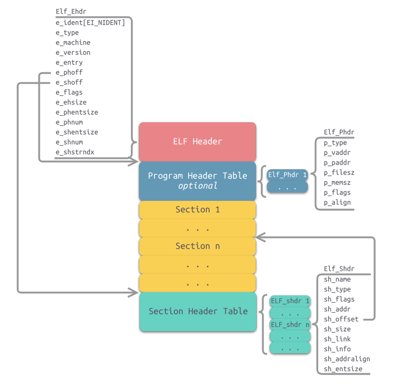
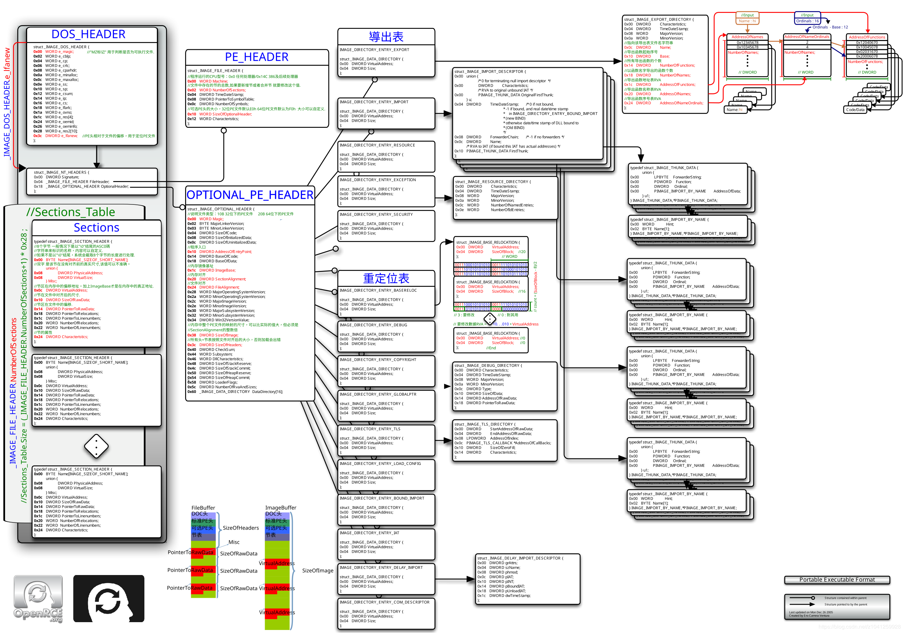

# 二进制分析

## 1 elf文件的结构

elf的格式看这个：https://linuxhint.com/understanding_elf_file_format/


如果是可执行文件，那么elf header会指明程序头表的偏移量，程序头表(**Program header table**) - 列举了所有有效的段(segments)和他们的属性（执行视图），每个结构都表示一个段，就是上图右边的图片，可以想象从Program Header Table伸出一条条箭头指向下面的Segment 1, Segment 2 ...

一般来说，我们将ELF文件标记为以下几个类型

+ ET_NONE
+ ET_REL：重定位文件，通常是还未被链接到可执行程序的一段为止独立的代码( position independent code)，
+ ET_EXEC：可执行文件
+ ET_DYN：共享目标文件，一般是共享库
+ ET_CODE：coredump文件相关

elf文件的结构如图，一点一点说

+ elf头部保存了关于比方关于幻数，架构位宽，大端序/小端序，ABI等信息。此外e_type表明是**可重定位文件（Relocatable File）**：`ETL_REL`，还是**可执行文件（Executable File）**：`ET_EXEC`，**共享目标文件（Shared Object File）**：`ET_DYN`等类型。此外还有e_phoff和e_shoff，指明程序头表和街头表的偏移量，这都是文件偏移量。还有一个e_entry表示开始执行的虚拟地址。
+ 剩下的我建议参考这个：http://chuquan.me/2018/05/21/elf-introduce/

使用readelf -h 查看文件头，默认的文件头结构定义如下

```
#define EI_NIDENT 16
typedef struct {
	unsigned char e_ident[EI_NIDENT]; //magic number
	Elf32_Half e_type;                //Ojbect file type
	Elf32_Half e_machine;             //Architecture
	Elf32_Word e_version;             //Object file version 
	Elf32_Addr e_entry;               //entry point
	Elf32_Off  e_phoff;               //程序头内容在文件的偏移量
	Elf32_off  e_shoff;               //段头内容在文件的偏移量
	Elf32_Word e_flags;
	Elf32_Half e_ehsize;              //elf头部大小
	Elf32_Half e_phentsize;           //程序头部表格的表项大小
	Elf32_Half e_phnum;               //程序头的个数Program header
	Elf32_Half e_shentsize;           //节区头部表格的表项大小
	Elf32_Half e_shnum;               //段头的个数Section header
	Elf32_Half e_shstrndx;            //String段在整个段列表中的索引值，实际上是.shstrtab的头索引，用来找字符串，
}Elf32_Ehdr;
```


### 1.1 Section结构

和段不同，节主要用于链接和调试，节头表对程序不是必须的，部分人可能会删除节头表的信息来对抗调试。




节的数据结构比较直接

```
typedef struct {
    Elf32_Word sh_name;      //给出节区名称。是节区头部字符串节区（Section Header String Table Section）的索引。名字是一个NULL结尾的字符串，保存在一个名为.shstrtab的字符串表（可通过Section Header索引到）
    Elf32_Word sh_type;      //节类型。为节区的内容和语义进行分类。SHT_PROGRAMBITS包含程序指令，机器指令或者常量
    Elf32_Word sh_flags;     //节标志位。节区支持1位形式的标志，这些标志描述了多种属性
    Elf32_Addr sh_addr;      //节的虚拟地址。如果节区将出现在进程的内存映像中或可被加载，则sh_addr为该节被加载后在进程地址空间中的虚拟地址，给出节区的每一个字节应处的位置。否则，此字段为0
    Elf32_Off sh_offset;     //节偏移。如果该节存在于文件中，则该节表示在文件中的偏移；否则无意义，如sh_offset对于BSS节来说就是没有意义的。即此成员的取值给出节区的第一个字节与文件头之间的偏移。
    Elf32_Word sh_size;      //节大小。此成员给出节区的长度（字节数）。除非节区的类型是SHT_NOBITS，否则节区占用文件中的sh_size字节。
    Elf32_Word sh_link;      //节链接信息。此成员给出节区头部表索引链接，其解释依赖于节区类型
    Elf32_Word sh_info;      //节链接信息。此成员给出附加信息，其解释依赖于节区类型
    Elf32_Word sh_addralign; //节地址对齐方式。某些节区带有地址对齐约束。
    Elf32_Word sh_entsize;   //节项大小。某些节区中包含固定大小的项目，如符号表，其包含的每个符号所在的大小都一样。
} Elf32_Shdr;

```


一些有趣的节

+ .text: .text节是保存了程序代码指令的代码节。一段可执行程序，如果存在Phdr，则.text节就会存在于text段中。由于.text节保存了程序代码，所以节类型为SHT_PROGBITS。

+ .rodata.rodata节保存了只读的数据，如一行c语言代码中的字符串。由于.rodata节是只读的，所以只能存在于一个可执行文件的只读段中。因此，只能在text段（而不是data段）中找到.rodata节。由于.rodata节是只读的，所以节类型为SHT_PROGBITS。
+ .data: .data节存在于data段中，其保存了初始化的全局变量等数据。由于.data节保存了程序的变量数据，所以节类型为SHT_PROGBITS。

+ .bss: .bss节存在于data段中，占用空间不超过4字节，仅表示这个节本来的空间。.bss节保存了未进行初始化的全局数据。程序加载时数据被初始化为0，在程序执行期间可以进行赋值。由于.bss节未保存实际的数据，所以节类型为SHT_NOBITS。


.rel.name .relaname

name根据重定位所适用的节区给定。例如.text节区的重定位节区名字将是：.rel.text或者.rela.text。重定位表保存了重定位相关的信息，这些信息描述了如何在链接或运行时，对ELF目标文件的某些部分或者进程镜像进行补充或者修改。由于重定位表保存了重定位相关的数据，所以节类型为SHT_REL。

.hash

.hash节也称为.gnu.hash，其保存了一个用于查找符号的散列表。

.symtab

.symtab节是一个ElfN_Sym的数组，保存了符号信息。节类型为SHT_SYMTAB。

.strtab

.strtab节保存的是符号字符串表，表中的内容会被.symtab的ElfN_Sym结构中的st_name引用。节类型为SHT_STRTAB。

.ctors&.dtors ctors（构造器）节和.dtors（析构器）节分别保存了指向构造函数和析构函数的函数指针，构造函数是在main函数执行之前需要执行的代码；析构函数是在main函数之后需要执行的代码。


我们重点关注这几个节：

+ .plt:.plt节也称为过程链接表（Procedure Linkage Table），其包含了动态链接器调用从共享库导入的函数所必需的相关代码。由于.plt节保存了代码，所以节类型为SHT_PROGBITS。
+ .got & .plt:.got节保存了全局偏移量。.got节和.plt节一起提供了对导入的共享库函数的访问入口，由动态链接器在运行时进行修改。由于.got .plt节与程序执行有关，所以节类型为SHT_PROGBITS。
  + 为什么需要这个节呢？
    + .text和.pot是不可写的，所以需要一个可写的节来存储
    + 现代操作系统动态库虽然都load了，可是虚拟地址不同，所以还是得每个进程保存自己的got plt

+ .dynsym：从共享库导入的外部符号，后面动态链接器链接的时候往往要看这个节来确定要链接哪些东西
+ .dynstr：.dynstr保存了动态链接字符串表，表中存放了一系列字符串，这些字符串代表了符号名称，以空字符作为终止符。
+ .dynamic节：在加载和创建要执行的elf二进制文件的是哦户，.dynamic节充当操作系统和动态链接库的路线图，该节包含名为ELF64_Dyn的结构体数组，或者说标签，每个标签都有个关联
+ .rel.*


符号引用和符号定义

节的分类中我们介绍了.dynsym节和.symtab节，两者都是符号表。那么它们到底有什么区别呢？存在什么关系呢？

符号是对某些类型的数据或代码（如全局变量或函数）的符号引用，函数名或变量名就是符号名。例如，printf()函数会在动态链接符号表.dynsym中存有一个指向该函数的符号项（以Elf_Sym数据结构表示）。在大多数共享库和动态链接可执行文件中，存在两个符号表。即.dynsym和.symtab。

.dynsym保存了引用来自外部文件符号的全局符号。如printf库函数。.dynsym保存的符号是.symtab所保存符合的子集，.symtab中还保存了可执行文件的本地符号。如全局变量，代码中定义的本地函数等。

既然.dynsym是.symtab的子集，那为何要同时存在两个符号表呢？

通过readelf -S命令可以查看可执行文件的输出，一部分节标志位（sh_flags）被标记为了A（ALLOC）、WA（WRITE/ALLOC）、AX（ALLOC/EXEC）。其中，.dynsym被标记为ALLOC，而.symtab则没有标记。

ALLOC表示有该标记的节会在运行时分配并装载进入内存，而.symtab不是在运行时必需的，因此不会被装载到内存中。.dynsym保存的符号只能在运行时被解析，因此是运行时动态链接器所需的唯一符号。.dynsym对于动态链接可执行文件的执行是必需的，而.symtab只是用来进行调试和链接的 


### 动态链接

动态库没有PT_INTERP段，所以不会触发程序解释器。当共享库加载到一个进程的地址空间的时候，动态链接器会修改可执行文件的GOT。这个段位于数据段（.got.plt节)


一般来说，动态链接的过程是

+ 调用动态链接的函数首先跳转到plt
+ plt会调用jmp \*got[3+x]的位置，x是函数的plt存根的数字。这个\*got[3+x]实际上一开始就是plt的下一条指令
  + 为什么是got[3+x]呢？下面是 GOT 的头3个偏移量。
    + GOT[0]：存放了指向可执行文件动态段的地址，动态链接器利用该地址提取动态链接相关的信息。
    + GOT[1]：存放 link_map 结构的地址，动态链接器利用该地址来对符号进行解析。
    + GOT[2]：存放了指向动态链接器_dl_runtime_resolve(),函数的地址，该函数用来解析共享库函数的实际符号地址。
+ 之后plt会跳转到就jmp plt[0]的位置，这个地址实际上放了三条指令
  + pushl将got[1]压入栈内，指向link_map的地址
  + 跳转到got[2]的地址，这俩放了动态链接_dl_runtime_resolve()函数的地址，之后动态链接器会修改got里面的地址


动态链接，调用的过程，我们看一个scanf的例子，可以看到这个时候跳转到plt实际上已经没有了延迟链接的事情，check this link:https://stackoverflow.com/questions/43048932/why-does-the-plt-exist-in-addition-to-the-got-instead-of-just-using-the-got

```assembly
qcraft@BJ-HeXiaonan:~/code_test/ass_c++/control_flow$ readelf -r a.out

Relocation section '.rela.dyn' at offset 0x4a0 contains 8 entries:
  Offset          Info           Type           Sym. Value    Sym. Name + Addend
000000200da8  000000000008 R_X86_64_RELATIVE                    7b0
000000200db0  000000000008 R_X86_64_RELATIVE                    770
000000201008  000000000008 R_X86_64_RELATIVE                    201008
000000200fd8  000100000006 R_X86_64_GLOB_DAT 0000000000000000 _ITM_deregisterTMClone + 0
000000200fe0  000300000006 R_X86_64_GLOB_DAT 0000000000000000 __libc_start_main@GLIBC_2.2.5 + 0
000000200fe8  000400000006 R_X86_64_GLOB_DAT 0000000000000000 __gmon_start__ + 0
000000200ff0  000700000006 R_X86_64_GLOB_DAT 0000000000000000 _ITM_registerTMCloneTa + 0
000000200ff8  000800000006 R_X86_64_GLOB_DAT 0000000000000000 __cxa_finalize@GLIBC_2.2.5 + 0

Relocation section '.rela.plt' at offset 0x560 contains 3 entries:
  Offset          Info           Type           Sym. Value    Sym. Name + Addend
000000200fc0  000200000007 R_X86_64_JUMP_SLO 0000000000000000 __stack_chk_fail@GLIBC_2.4 + 0
000000200fc8  000500000007 R_X86_64_JUMP_SLO 0000000000000000 __printf_chk@GLIBC_2.3.4 + 0
000000200fd0  000600000007 R_X86_64_JUMP_SLO 0000000000000000 scanf@GLIBC_2.2.5 + 0


(gdb) disass
Dump of assembler code for function scanf@plt:
=> 0x00005555555545f0 <+0>:	jmpq   *0x2009da(%rip)        # 0x555555754fd0
   0x00005555555545f6 <+6>:	pushq  $0x2
   0x00005555555545fb <+11>:	jmpq   0x5555555545c0

rip            0x5555555545f0	0x5555555545f0 <scanf@plt>

(gdb) ni
__scanf (format=0x555555554844 "%d") at scanf.c:28
28	scanf.c: No such file or directory.
(gdb) disass
Dump of assembler code for function __scanf:
=> 0x00007ffff7a5d120 <+0>:	sub    $0xd8,%rsp
   0x00007ffff7a5d127 <+7>:	test   %al,%al
   0x00007ffff7a5d129 <+9>:	mov    %rsi,0x28(%rsp)
   0x00007ffff7a5d12e <+14>:	mov    %rdx,0x30(%rsp)
   0x00007ffff7a5d133 <+19>:	mov    %rcx,0x38(%rsp)
   0x00007ffff7a5d138 <+24>:	mov    %r8,0x40(%rsp)
   0x00007ffff7a5d13d <+29>:	mov    %r9,0x48(%rsp)
   0x00007ffff7a5d142 <+34>:	je     0x7ffff7a5d17b <__scanf+91>
   0x00007ffff7a5d144 <+36>:	movaps %xmm0,0x50(%rsp)
   0x00007ffff7a5d149 <+41>:	movaps %xmm1,0x60(%rsp)
   0x00007ffff7a5d14e <+46>:	movaps %xmm2,0x70(%rsp)
   0x00007ffff7a5d153 <+51>:	movaps %xmm3,0x80(%rsp)
   0x00007ffff7a5d15b <+59>:	movaps %xmm4,0x90(%rsp)
   0x00007ffff7a5d163 <+67>:	movaps %xmm5,0xa0(%rsp)
   0x00007ffff7a5d16b <+75>:	movaps %xmm6,0xb0(%rsp)
   0x00007ffff7a5d173 <+83>:	movaps %xmm7,0xc0(%rsp)
   0x00007ffff7a5d17b <+91>:	mov    %fs:0x28,%rax
   0x00007ffff7a5d184 <+100>:	mov    %rax,0x18(%rsp)
   0x00007ffff7a5d189 <+105>:	xor    %eax,%eax
   0x00007ffff7a5d18b <+107>:	lea    0xe0(%rsp),%rax
   0x00007ffff7a5d193 <+115>:	mov    %rdi,%rsi
   0x00007ffff7a5d196 <+118>:	xor    %ecx,%ecx
   0x00007ffff7a5d198 <+120>:	mov    %rsp,%rdx
   0x00007ffff7a5d19b <+123>:	mov    %rax,0x8(%rsp)
   0x00007ffff7a5d1a0 <+128>:	lea    0x20(%rsp),%rax
   0x00007ffff7a5d1a5 <+133>:	movl   $0x8,(%rsp)
   0x00007ffff7a5d1ac <+140>:	movl   $0x30,0x4(%rsp)
   0x00007ffff7a5d1b4 <+148>:	mov    %rax,0x10(%rsp)
   0x00007ffff7a5d1b9 <+153>:	mov    0x36fdf0(%rip),%rax        # 0x7ffff7dccfb0
   0x00007ffff7a5d1c0 <+160>:	mov    (%rax),%rdi
   0x00007ffff7a5d1c3 <+163>:	callq  0x7ffff7a4d320 <_IO_vfscanf_internal>
   0x00007ffff7a5d1c8 <+168>:	mov    0x18(%rsp),%rcx
   0x00007ffff7a5d1cd <+173>:	xor    %fs:0x28,%rcx
   0x00007ffff7a5d1d6 <+182>:	jne    0x7ffff7a5d1e0 <__scanf+192>
   0x00007ffff7a5d1d8 <+184>:	add    $0xd8,%rsp
   0x00007ffff7a5d1df <+191>:	retq
   0x00007ffff7a5d1e0 <+192>:	callq  0x7ffff7b16b10 <__stack_chk_fail>
End of assembler dump.
(gdb) x/2 0x555555754fd0
0x555555754fd0:	0xf7a5d120	0x00007fff
(gdb)
```


### 1.2 Segment结构

ELF程序头，是程序装载的时候关心的对象。段在内核装载的是时候被解析，然后load到内存里面

部分的Segment我们需要关注几种类别，比方说

+ PT_LOAD：一般是可装载的段，一般需要动态链接的ELF可执行程序都包含两个
  + 存放代码的text段，权限一般为PF_X|PF_R，即执行和读
  + 存放全局变量和动态链接信息的data段，data段的权限为PF_W|PF_R

+ PT_DYNAMIC：动态链接可执行文件所特有的，包含动态链接器所必须的信息。动态段包含一些标记值和指针。为什么会有这个段？因为程序运行的时候不能有section header tabel引入（简单来说就是不能有节信息），所以需要一个段包含这些信息。当共享库被映射到内存后，首先处理自身（这个自身是指动态链接器自己）的重定位，然后查看可执行程序的动态段并查找DT_NEEDED参数，该参数保存了指向所需要的共享库的字符串或者路径名。连接器接着会获取到共享库的动态段，并将共享库的符号表添加到符号表链中，符号表链存储了所有映射到内存中的共享库的符号表。这个段保存有以下信息：
  + 运行时候需要链接的共享库列表
  + 全局偏移表（GOT）的地址
  + 重定位条目的信息
    + 这里需要关注一部分的特定类型
    + DT_NEEDED
    + DT_SYMTAB，对应.dynsym节
    + DY_HASH，对应.hash节
    + DT_STRTAB，对应.dynstr节
    + DT_PLTGOT：全局偏移表的地址
+ PT_NOTE：与供应商或者系统相关的附加信息
+ PT_INTERP：一般存放动态链接器的位置
+ PT_PHDR

看一个具体例子

```
qcraft@BJ-HeXiaonan:~/qcraft$ readelf -l /usr/bin/vim

Elf file type is DYN (Shared object file)
Entry point 0x375f0
There are 9 program headers, starting at offset 64

Program Headers:
  Type           Offset             VirtAddr           PhysAddr
                 FileSiz            MemSiz              Flags  Align
  PHDR           0x0000000000000040 0x0000000000000040 0x0000000000000040
                 0x00000000000001f8 0x00000000000001f8  R      0x8
  INTERP         0x0000000000000238 0x0000000000000238 0x0000000000000238
                 0x000000000000001c 0x000000000000001c  R      0x1
      [Requesting program interpreter: /lib64/ld-linux-x86-64.so.2]
  LOAD           0x0000000000000000 0x0000000000000000 0x0000000000000000
                 0x0000000000266878 0x0000000000266878  R E    0x200000
  LOAD           0x00000000002676f0 0x00000000004676f0 0x00000000004676f0
                 0x0000000000025360 0x00000000000323c8  RW     0x200000
  DYNAMIC        0x00000000002733d8 0x00000000004733d8 0x00000000004733d8
                 0x0000000000000270 0x0000000000000270  RW     0x8
  NOTE           0x0000000000000254 0x0000000000000254 0x0000000000000254
                 0x0000000000000044 0x0000000000000044  R      0x4
  GNU_EH_FRAME   0x0000000000229628 0x0000000000229628 0x0000000000229628
                 0x0000000000008adc 0x0000000000008adc  R      0x4
  GNU_STACK      0x0000000000000000 0x0000000000000000 0x0000000000000000
                 0x0000000000000000 0x0000000000000000  RW     0x10
  GNU_RELRO      0x00000000002676f0 0x00000000004676f0 0x00000000004676f0
                 0x000000000000c910 0x000000000000c910  R      0x1

 Section to Segment mapping:
  Segment Sections...
   00
   01     .interp
   02     .interp .note.ABI-tag .note.gnu.build-id .gnu.hash .dynsym .dynstr .gnu.version .gnu.version_r .rela.dyn .rela.plt .init .plt .plt.got .text .fini .rodata .eh_frame_hdr .eh_frame
   03     .init_array .fini_array .data.rel.ro .dynamic .got .data .bss
   04     .dynamic
   05     .note.ABI-tag .note.gnu.build-id
   06     .eh_frame_hdr
   07
   08     .init_array .fini_array .data.rel.ro .dynamic .got
```


动态链接


## 2 PE文件的结构

PE文件的结构如图，DOS头后面跟NT头




