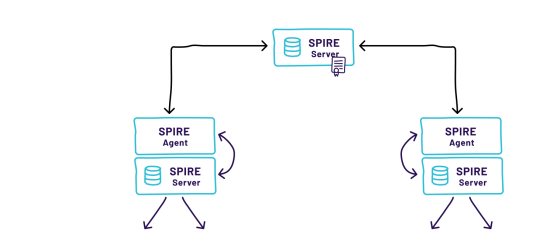

# 2023-02-12-安全零信任

## 零信任概述（不用仔细看）

零信任包含以下几个方面：


现在展开讲：

由于1 身份认证并不可靠，内网不等于可信网络，内网用户不一定是可信用户。2 网络边界越来越难以划分

因此需要展开零信任，零信任包含以下几个要求：

+ 信任最小化：任何访问主体（人/设备/应用等），在访问被允许之前，都必须要经过身份认证和授权，默认不信任；换言之1.端到端加密确保传输安全2 1.企业应用或服务不再对公网可见
+ 分配访问权限是基于业务，越细越好，遵循最小权限原则；
+ 多源信任评估：尽可能多的和及时的获取可能影响授权的所有信息，进行安全评估。换言之提供基于网络；设备；身份；环境认证的访问控制
+ 权限动态化：对信息进行持续的信任评估和安全响应。换言之仅对特定应用而非网络授予访问权限
+ 可视化，智能化：通过可视化了解和评估网络中可能产生的安全威胁，进行主动和自动化的防御。

那么，在一个零信任网络里面，以下三个组件很重要：

1. Policy engine (PE)
2. Policy administrator (PA)
3. Policy enforcement point (PEP)

## 到底什么是零信任

一种说法是：S.I.M.=SDP+IAM（*Identity and Access Management* (*IAM*)）+微隔离.这个说起来还是很粗的，实际上就是，


所以总结来说，零信任是多个方面的结合

### 身份方面

需要给出有哪些对应的软件

身份方面有很多点

+ 身份大数据

  + 需要定义用户，组织，设备，资源等实体的模型。还得管理生命周期
    + 对人而言，区分是员工，还是客户等，管理每个人的组织机构信息，个人信息，标签，关联设备
    + 设备，要建立合法设备清单库，包括设备标识，软件硬件信息，设备安全状态
    + 应用：身份标识，服务器地址，应用提供的功能菜单，
    + API：包括API服务是谁，访问哪些API，身份标识，接口信息，参数信息，返回信息
  + 需要从各种终端设备同步和用户属性相关的信息，汇聚为大数据
  + 集中管理各种不同角色，比方说用户/员工/外包

+ 身份认证的方式

  + 密码，口令，U盾牌
  + 持续多因素认证

+ 动态授权

  + 比方说归结为角色：网管，开发，RBAC的直观清晰，但是角色一多就是灾难。
  + 基于属性的授权，比方说设备的属性，设备的环境（时间，位置，ip地址），业务属性
  + 基于任务的授权，针对用户授予某项任务的权限，任务结束立刻收回
  + 策略。某种策略，一个策略应该包含策略主体，策略课题，策略条件，策略动作等。因为策略过于复杂，所以应该分层指定策略，用户的请求必须一层一层的递进，才能判断是否成功。比方说用户访问资源，先判断，用户是否有授权，再判断是否满足网络安全要求，再判断数据是否脱敏。授权策略完全可以依托于上面列举的点，比方说角色，属性，任务

  + 临时权限

设备方面

+ 设备清单
  + 能够识别设备，利用ID，MAC，主板号，
  + 设备绑定，能够和用户角色绑定
  + 设备清单库
+ 设备安全
  + 设备认证，相关绑定人
  + 设备安全监测，监测设备是否安全合规
  + 设备漏洞修复
  + 远程擦除敏感数据
  + 可信进程管理
  + 设备准入基线

网络方面

+ 统一的入口
  + 安全隧道网关
  + API安全网关
  + 分布式网关集群
  + 网络准入
  + 网络入侵防护
  + 安全DNS

数据方面

+ 数据访问控制
  + 数据分级分类
  + 数据访问控制
  + 数据脱敏
+ 数据泄密防护
  + 基于零信任授权策略，在用户可信等级较低或者资源要求较高，执行数字水印，敏感文件审计
  + 终端沙箱，在设备商划分数据安全区，敏感数据只能沙箱访问，并且最终在终端的安全区访问，也许出发在这个点？
  + 远程浏览器隔离
  + 安全浏览器

安全审计

+ 安全审计
+ 风险分析
+ 新人评估


## 现存的零信任模型

### 零信任的分类

零信任分为两种，一种是对用户的，另一种是对企业内部的。对用户的标准的架构有两种

+ SDP标准：三个组件，SDP客户端，SDP网关，SDP管控端。用户和网关都向SDP管控端报道，管控端通知客户和SDP网关相关的身份信息和权限校验，提前两者是相互都不清楚的：用户向管控端报告以后，管控端会给网关发用户相关信息，同时提供给用户有权连接的SDP网关列表，之后SDP客户端会使用SPA（单包授权 Single Packet Authorization，理解为敲门暗号）技术向SDP网关通信，校验身份成功即开放IP端口。
+ NIST的标准


针对企业，或者说针对云服务内部的，微隔离

例子：beyondprod，


## 面临的问题


## 零信任组件技术

### .1 SDP（SPA）端口隐藏

+ SDP网关默认拒绝所有IP的连接，常规黑客扫描不出来
+ 客户端和SDP控制端通信，申请通过后，控制端给SDP网关和SDP客户端发送凭据和身份信息
+ 客户端发送一个单包到SDP网关约定的端口，SDP网关收到后会添加路由，用户就可以反映了

难题是怎么保证SPA是不可伪造的，因此如何保证秘钥？有三种方法

+ 客户端嵌入秘钥
+ 用激活码生成秘钥，给用户一个随机的身份秘钥，由它派生
+ 将临时秘钥转为正式秘钥，设定失效条件

增强的手段可以为TLS敲门技术，在clienthello里面放拓展字段


#### .1.1双层隐身架构

双层隐身架构，说白了就是在企业内网边界之外使用云网关，然后客户端接入到云网关。连接器（在内网边界）直接连接云网关，这样子实际上就是转移难度到云网关


### .2零信任网关

作为零信任的中心，作用有两个

+ 分割用户和资源
+ 执行安全策略

网关有多种，比方说API网关，web代理网关

+ web代理网关功能主要是转发请求，获取身份，验证身份决定是否方形。这种是所有流量的入口，主要在边界
+ 隐身网关。类似防火墙，实际上也类似SDP网关
+ 网络隧道网关，代理SSH等协议，四层忘光
+ API网关，针对服务器之间的访问，主要在pod或者微隔离环境的内部

这些最终集合成为一个个的网关平台


### .3微隔离

微隔离这点我觉得得看spiffe，我们先看通用的，怎么实现分隔离

+ 在每个服务器的操作系统上配置agent客户端，agent客户端统一由零信任管控平台管理。优点是底层无关，支持容器，支持云
+ 基于云原生的虚拟化设备自身防火墙功能进行访问控制
+ 基于第三方防火墙，最僵硬

微隔离的架构

+ 微隔离组件有一个零信任管控平台统一管控，负责下发策略，分发证书，进行身份认证和访问控制校验
+ 身份认证是基于企业的PKI认证体系


微隔离管控平台

+ 提供基于身份的访问策略：在云原生的环境，容器的宿主机是不确定的，服务可能直接迁移，因此基于ip地址进行管控已经失去了意义，得使用服务的身份。即对于微服务，提供基于7层而非4层的隔离。这实际上就是说在容器里面建立一个7层的访问代理。
+ 可以自动学习业务策略，
+ 业务关系可视化


+ 


## 零信任的应用场景

旁路模式

旁路模式的安全访问控制

+ 


## SPIFFE的研究（微隔离）


推荐的部署spiffe（spire）的方法

首先需要有几个基本组件：

+ 命名方式：SPIFFE ID标示workload的发起者的身份，实际上结合了具体的trustzone的uri和具体的终端信息。这个部分的信息可以自由组合多种信息，包括平台 & 用来做什么
+ SPIRE的部署模型，部署模型有很多种，要考虑的问题有很多
  + 信任域如何划分，是来一个大的信任域还是细粒度的？一般来说
  + 单个信任域只有一个spire server(这个spire server得高可用)，但是如果环境问题比较复杂，那么最好使用层级spire server（ nested topology spire server）
  + Federated spire server，联合的认证实际上是多个不同spire server联合进行的。In federated SPIRE, trust between the dierent trust domains is established by first authenticating the respective bundle endpoint, followed by retrieval of the foreign trust domain bundle via the authenticated endpoint.
+ 数据存储模型
  + 独立的数据存储模型

真正需要考虑的细节

+ 如何应对failure：
  + TTL：One important attribute of an SVID is its time-to-live (TTL). The SPIRE Agent will renew an SVID in the cache if the remaining lifetime is less than one half the TTL. 

集成spire到kubernetes

+ SPIRE应该是一个node一个，因此可以是用daemonset


参考https://www.jetstack.io/blog/workload-identity-with-spiffe-trust-domains/


#### 一些实现的细节

那么问题来了，零信任怎么和四层的TLS建立起来连接呢？TLS基于四层，因此是其他层面的基石，那么问题来了TLS怎么和零信任契合起来呢？TLS协议实际上是个非常灵活的东西，以下几个点值得关注。

##### 10.3.2.0 TLS协议的基本保证

由于是从四层来做，因此单调地依赖层提供的保障不再现实：TLS层就要提供身份认证和权限管理的功能，而TLS上层的协议需要能够获取TLS层的身份信息。这意味着上层需要获得已经认证的资源和证书，即上层可以和下层通信。

##### 10.3.2.1 TLS基础协议的认证功能

针对TLS1.3，TLS协议的基本认证功能主要集中在服务端的证书消息和客户端的证书消息，身份和证书绑定，终端的网络情况可以和具体的拓展或者和心跳包相关联，从而服务器能够检测出是否要再次进行权限校验功能。有一点需要注意，如果开启REUSE功能或者0-RTT功能，那么意味着身份信息需要在SESSION IDENTITY里面记录相关信息，当然这不会造成太大的问题。

##### 10.3.2.1 TLS心跳拓展

TLS的心跳拓展是个非常有趣的东西，这个拓展实际上就给上层协议做TLS的状态监测等方面提供了功能，换言之，这个功能使得安全网关能够主动请求并鉴定客户端的网络状态。心跳拓展包的类型为两种： heartbeat_request(1)和heartbeat_response(2)。心跳包的具体格式如下：

```java
心跳协议消息包含了类型，任意载荷和填充。结构如下：
   struct {
      HeartbeatMessageType type;
      uint16 payload_length;
      opaque payload[HeartbeatMessage.payload_length];
      opaque padding[padding_length];
   } HeartbeatMessage;
心跳消息的总长度不能超过2^14或者规定的最大分片单元的长度。
```

这意味着我们可以在心跳包当中嵌入任意长度的消息，只要保证安全性就可以解决问题。

接收方要告诉对方一个告警消息“illegal_parameter这个行为也可以用来记录相关的安全信息。

从简单的角度来说，对心跳包的拓展是最简单的检查功能。

具体内容参考RFC 6520https://tools.ietf.org/html/rfc6520和RFC8447https://tools.ietf.org/html/rfc8447。

#### 10.3.2.2 TLS自定拓展

在TLS1.3中自定拓展是个非常有趣的事情。EncryptedExtension和ClientHello都能加入拓展，CLientHello中可以使用明文，当然如果算上0-RTT报文当中包含权限或拓展信息就很有趣。

#### 10.3.2.2 TLS PHA功能和安全重协商

TLS1.3的PHA功能简直是对从新认证的完美实现，只要客户端带PHA_HANDSHAKE_AUTH拓展，那么服务器可以在任意时刻发送PHA认证消息，客户端必须按照符合格式的方式回复。当然可能服务器在收到认证报文之前可能受到大量无意义报文，这个情况要注意。

但是PHA只是身份认证相关的工作，无法包含更多的其他信息，因此对于零信任的场景安全重协商更靠谱，可以重新产生相应的身份信息和拓展信息。


关于SPIFFE和SPIFRE

安全都是玩概念之spiffe

对于所谓的企业内部安全，目前实际上面临的核心问题两个问题：

+ 如何做workload级别的安全管理，即如何管理workload的安全凭证
+ 不同的调用链，怎么做安全交互

spiffe解决什么问题？只解决了怎么做workload/node级别的安全管理，它本身是一种标准化的框架。包含了注册，身份签发，节点教研等标准。


但是面临的问题还是存在：

+ tls的性能消耗带来的问题太大，怎么做细粒度验证的同时，能够保证性能？
+ 基础的验证问题，怎么验证workflow，怎么验证node


## 结尾
唉，尴尬

