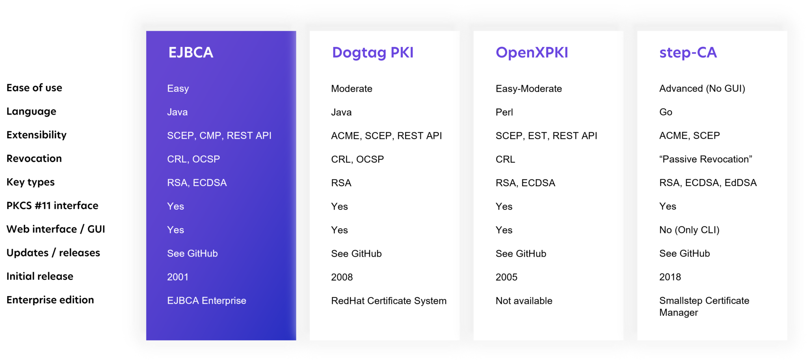
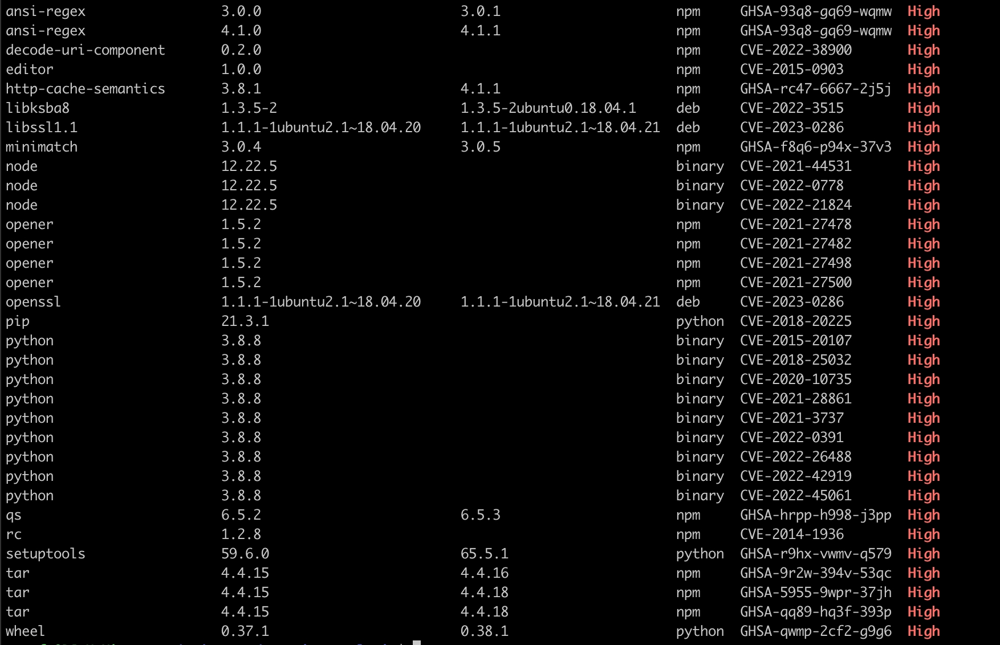

# 2023-02-12-安全零信任

## 零信任概述（不用仔细看）

零信任包含以下几个方面：


现在展开讲：

由于1 身份认证并不可靠，内网不等于可信网络，内网用户不一定是可信用户。2 网络边界越来越难以划分

因此需要展开零信任，零信任包含以下几个要求：

+ 信任最小化：任何访问主体（人/设备/应用等），在访问被允许之前，都必须要经过身份认证和授权，默认不信任；换言之1.端到端加密确保传输安全2 1.企业应用或服务不再对公网可见
+ 分配访问权限是基于业务，越细越好，遵循最小权限原则；
+ 多源信任评估：尽可能多的和及时的获取可能影响授权的所有信息，进行安全评估。换言之提供基于网络；设备；身份；环境认证的访问控制
+ 权限动态化：对信息进行持续的信任评估和安全响应。换言之仅对特定应用而非网络授予访问权限
+ 可视化，智能化：通过可视化了解和评估网络中可能产生的安全威胁，进行主动和自动化的防御。

那么，在一个零信任网络里面，以下三个组件很重要：

1. Policy engine (PE)
2. Policy administrator (PA)
3. Policy enforcement point (PEP)

## 到底什么是零信任

一种说法是：S.I.M.=SDP+IAM（*Identity and Access Management* (*IAM*)）+微隔离.这个说起来还是很粗的，实际上就是，


所以总结来说，零信任是多个方面的结合

### 身份方面

需要给出有哪些对应的软件

身份方面有很多点

+ 身份大数据

  + 需要定义用户，组织，设备，资源等实体的模型。还得管理生命周期。**需要能够方便的检索出来一些冗余信息**
    + 对人而言，区分是员工，还是客户等，管理每个人的组织机构信息，个人信息，标签，关联设备
    + 设备，要建立合法设备清单库，包括设备标识，软件硬件信息，设备安全状态
    + 应用：身份标识，服务器地址，应用提供的功能菜单，
    + API：包括API服务是谁，访问哪些API，身份标识，接口信息，参数信息，返回信息
  + 需要从各种终端设备同步和用户属性相关的信息，汇聚为大数据
  + 集中**管理**各种不同角色，比方说用户/员工/外包，管理能力或者说检索能力很重要

+ 身份认证的方式

  + 密码，口令，U盾牌
  + 持续多因素认证

+ 动态授权

  + 比方说归结为角色：网管，开发，RBAC的直观清晰，但是角色一多就是灾难。
  + 基于属性的授权，比方说设备的属性，设备的环境（时间，位置，ip地址），业务属性。现实往往是角色和属性的综合授权
  + 基于任务的授权，针对用户授予某项任务的权限，任务结束立刻收回
  + 策略。某种策略，一个策略应该包含策略主体，策略课题，策略条件，策略动作等。因为策略过于复杂，所以应该分层指定策略，用户的请求必须一层一层的递进，才能判断是否成功。比方说用户访问资源，先判断，用户是否有授权，再判断是否满足网络安全要求，再判断数据是否脱敏。授权策略完全可以依托于上面列举的点，比方说角色，属性，任务

  + 临时权限

设备方面

+ 设备清单
  + 能够识别设备，利用ID，MAC，主板号，
  + 设备绑定，能够和用户角色绑定
  + 设备清单库
+ 设备安全
  + 设备认证，相关绑定人
  + 设备安全监测，监测设备是否安全合规
  + 设备漏洞修复
  + 远程擦除敏感数据
  + 可信进程管理
  + 设备准入基线

网络方面

+ 统一的入口
  + 安全隧道网关
  + API安全网关
  + 分布式网关集群
  + 网络准入
  + 网络入侵防护
  + 安全DNS

数据方面

+ 数据访问控制
  + 数据分级分类
  + 数据访问控制
  + 数据脱敏
+ 数据泄密防护
  + 基于零信任授权策略，在用户可信等级较低或者资源要求较高，执行数字水印，敏感文件审计
  + 终端沙箱，在设备商划分数据安全区，敏感数据只能沙箱访问，并且最终在终端的安全区访问，也许出发在这个点？
  + 远程浏览器隔离
  + 安全浏览器

安全审计

+ 安全审计
+ 风险分析
+ 新人评估


## 现存的零信任模型

### 零信任的分类

零信任分为两种，一种是对用户的，另一种是对企业内部的。对用户的标准的架构有两种

+ SDP标准：三个组件，SDP客户端，SDP网关，SDP管控端。用户和网关都向SDP管控端报道，管控端通知客户和SDP网关相关的身份信息和权限校验，提前两者是相互都不清楚的：用户向管控端报告以后，管控端会给网关发用户相关信息，同时提供给用户有权连接的SDP网关列表，之后SDP客户端会使用SPA（单包授权 Single Packet Authorization，理解为敲门暗号）技术向SDP网关通信，校验身份成功即开放IP端口。
+ NIST的标准


针对企业，或者说针对云服务内部的，微隔离

例子：beyondprod，


## 面临的问题


## 零信任组件技术

### 1 SDP（SPA）端口隐藏

+ SDP网关默认拒绝所有IP的连接，常规黑客扫描不出来
+ 客户端和SDP控制端通信，申请通过后，控制端给SDP网关和SDP客户端发送凭据和身份信息
+ 客户端发送一个单包到SDP网关约定的端口，SDP网关收到后会添加路由，用户就可以反映了

难题是怎么保证SPA是不可伪造的，因此如何保证秘钥？有三种方法

+ 客户端嵌入秘钥
+ 用激活码生成秘钥，给用户一个随机的身份秘钥，由它派生
+ 将临时秘钥转为正式秘钥，设定失效条件

增强的手段可以为TLS敲门技术，在clienthello里面放拓展字段


#### 1.1双层隐身架构

双层隐身架构，说白了就是在企业内网边界之外使用云网关，然后客户端接入到云网关。连接器（在内网边界）直接连接云网关，这样子实际上就是转移难度到云网关


### 2零信任网关

作为零信任的中心，作用有两个

+ 分割用户和资源，零信任网关就是一个保安，或者说门卫
+ 执行安全策略，用户连接到安全网关之后，再到达业务系统，素以安全网关可以挡住大部分的业务系统攻击。

网关有多种，比方说API网关，web代理网关

+ web代理网关功能主要是在下面写出来了。这种是所有流量的入口，主要在边界
  + 转发请求：根据用户域名的不同，转发到不同的服务器，
  + 获取身份，从cookie或者数据包头部加入代表用户身份的token
  + 验证身份，web代理网关将访问者的信息发送给管控平台，这一步严重影响性能

+ 隐身网关。类似防火墙，可以认为只有特定身份的用户可以参与进来。
  + 其类似SPA的实现方式，使用UDP就可以携带特定的身份信息直接参与到具体的敲门过程。我个人觉得这里可以让DTLS参与进来。可以参考WIREGUARD协议

+ 网络隧道网关，代理SSH等协议，四层网关
+ API网关，针对服务器之间的访问，主要在pod或者微隔离环境的内部。一般是将请求放协议的头部

这些最终集合成为一个个的网关平台，根据不同的功能还要同时提供负载均衡，加密传输等功能


### 2.1 微隔离

微隔离解决的是服务器之间这么进行身份验证，安全通信的问题。

+ 在每个服务器的操作系统上配置agent客户端，基于微隔离组件实现。agent客户端统一由零信任管控平台管理。优点是底层无关，支持多种容器，这个实际上是发生在操作系统层面，可以理解为pod里面？
+ 基于云原生的虚拟化设备自身防火墙功能进行访问控制，这种方式实际上发生在node的虚拟机管理级别。
+ 基于第三方防火墙，最僵硬

微隔离的架构

1. 微隔离组件的集中管控：微隔离组件有一个零信任管控平台统一管控，负责下发策略，分发证书，进行身份认证和访问控制校验
2. 身份认证：微隔离组件启动后，要先向控制台发起身份认证，最简单的方式就是基于企业的PKI做认证。认证通过后就可以获取权限列表和可访问的资源。
3. 服务端环境感知：微隔离的组件可以对服务端的安全状态进行检查，后续根据安全策略，阻止有风险的服务器接入零信任网络
4. 端口暴露管理:控制暴露的端口
5. 进程外联控制：检查是否有部分异常进程的奇怪连接，比方说shell连接外部ip地址
6. 通信和校验过程：微隔离组件可以作为客户端或者服务端当成mtls的起点或者终点进行通信


微隔离管控平台

+ 提供基于身份的访问策略：在云原生的环境，容器的宿主机是不确定的，服务可能直接迁移，因此基于ip地址进行管控已经失去了意义，得使用服务的身份。即对于微服务，提供基于7层而非4层的隔离。这实际上就是说在容器里面建立一个7层的访问代理。
+ 访问策略的构成：微隔离策略的主体和客体可以是服务器，微服务，进程。微隔离策略模型可以从自身的身份，组，标签，安全属性等维度设置访问条件
+ 可以自动学习业务策略，
+ 业务关系可视化
+ 策略下发
+ 环境感知和风险监控


## 3 SPIFFE的研究（微隔离）

关于零信任在生产环境的落地，很多文章实际上说的是非常不清晰的，比方说微隔离的实现等，spiffe给出了非常实用的实现方法。spiffe和spire，主要解决微服务下的各种服务框架横行的模式下，怎么进行安全通信的问题。即，spiffe的workload相互调用时使用mtls进行调用，其证书私钥如何传递，颁发的问题。

### 3.1 SPIFFE 的基本概念

spiffe服务端先认证云环境下的node节点，在认证完node节点后，先让节点了解到工作负载（workload）有哪些，并且申请下来证书私钥。之后如果有workload要通信，就校验是否是合法workload，从而判断是否给出证书和私钥。workload校验完成之后就可以进行mtls通信啦。

SPIFFE的基本概念

+ workload，工作负载，简单理解a workload may often be more fine-grained than a physical or virtual node – often as fine grained as individual processes on the node. 
+ SPIFFE ID，SPIFFE ID is a string that uniquely and specifically identifies a workload. 
+ Trust Domain,The trust domain corresponds to the trust root of a system. A trust domain could represent an individual, organization, environment or department running their own independent SPIFFE infrastructure. All workloads identified in the same trust domain are issued identity documents that can be verified against the root keys of the trust domain.
+ SPIFFE Verifiable Identity Document，SVID is the document with which a workload proves its identity to a resource or caller. An SVID is considered valid if it has been signed by an authority within the SPIFFE ID’s trust domain.加密的可验证的档案，用于证明工作负载的身份。两种模式，一种是X509格式的证书和私钥，SAN（subject alternative name）放对应的spiffeid。另一种是jwt
+ workload API，workload API provides the following：SPIFFE ID，对应的证书，相对应的Trust Bundle(A set of certificates)。简单来说提供证书数和私钥去做mtls，还有对应的CA
+ When using X.509-SVIDs, a trust bundle is used by a destination workload to verify the identity of a source workload. A trust bundle is a collection of one or more certificate authority (CA) root certificates。复杂的网络环境下，多个不同的spiffe context交互，每个svid的ca可能不同，需要交换这些公钥信息，这些公钥信息就是trust bundle。
+ SPIFFE Federation：共享 SPIFFE Trust Bundle 的机制。名字起的很有趣，联邦

### 3.2 以SPIRE为入口学习SPIFFE

#### 3.2.0 SPIRE问题

我个人认为，从问题入手会学习的比较快，列几个我目前还没明白的点

+ SPIRE只是简单的在Trust Bundle中提了一嘴用来解决动态感知客户端身份的方法，至于说业务关系的可视化，基于身份的访问策略这些都没提。这些当然可以作为附加功能直接贴到SPIRE AGENT当中，我个人觉得，授权关系基于Trust Bundle的方式来做会比较简单（因为直接调用房CA证书校验不通过就行），但是Trust Bundle的动态更新，会成为一个问题点。我想到的点是授权策略还是剥离出来，但是可以采用授权策略最后更新时间作为检查的点
+ SPIRE在网络内部，怎么做对应证书的过期，剔除，无效化操作？
+ SPIRE SERVER有签发SVID的功能，这些SVID是不是要有PKI管理，很多敏感信息也要读取KMS信息，这些证书要作为可授信的凭证参与到KMS信息的管理。那么KMS是不是应该也细分为不同Trust Domain的粒度，存储不同的敏感信息。那么一旦不同的Namespace要共享一些敏感信息，这两个KMS是不是也得共享一套Trust Bundle。跨网段的沟通协同看起来很危险。
+ SPIRE AGENT启动时，怎么有服务端的信息，即怎么证实访问到的服务端的身份？
+ SPIRE AGENT启动时，为什么先获取被授权的相关工作负载
+ SPIRE架构下SVID的有效期和自动更新怎么做呢？

#### 3.2.1 SPIRE的架构

SPIRE的架构就两块：服务器和 Agent

- 服务器负责签发 SVID ，这些SVID最终通过 Agent 传递给工作负载；它要同时保存很多workload的注册信息，简单来说就是哪些workload可以调用workload api的问题；
  - SPIRE Server 负责在SPIFFE信任域管理和签发身份信息，因此它存储着 [registration entries](https://spiffe.io/docs/latest/spire-about/spire-concepts/#workload-registration) (用于判断是否应该签发出来对应的SPIFFE ID) ，签发密钥, 用 [node attestation](https://spiffe.io/docs/latest/spire-about/spire-concepts/#node-attestation) 来自动认证服务器节点, 为工作负载创建SVIDs
  - 其架构要求一些插件的参与
    - **Node attestor plugins** 同 [Node Attestation](https://spiffe.io/docs/latest/spire-about/spire-concepts/#node-attestation) 一起认证节点
    - **Node resolver plugins** which expand the set of selectors the server can use to identify the node by verifying additional properties about the node. See the section [Node Resolution](https://spiffe.io/docs/latest/spire-about/spire-concepts/#node-resolution) for more information.
    - **Datastore plugins**, 服务器检索，更新，存储信息的地方，比方说存储registration entries](https://spiffe.io/docs/latest/spire-about/spire-concepts/#workload-registration), 哪些节点已经认证好了, 这些节点的选择器是哪些
    - **Key manager plugins**,管理server这么签发SVID信息
    - **Upstream authority plugins**. 一般默认情况SPIRE服务器自己充当CA，但是你也可以用上游CA直接参与管理

- Agent 部署在每个节点上，向工作负载公开 Workload API。Workload在通信之前先请求证书和私钥（SVID），真正的签发请求透明地传递到server上。
  - 功能
    - 从服务端请求SVIDs，并一直缓存它们，直到有真正的调度来了。
    - 向Workload暴露SPIFFE Workload API，证实Workload的身份
    - 向Workload提供他们的SVIDs

  - 架构
    - Node attestor plugins which,同 [Node Attestation](https://spiffe.io/docs/latest/spire-about/spire-concepts/#node-attestation) 一起认证节点
    - Workload attestor plugins – 认证工作负载，从操作系统检索进程信息，并和server端拿到的信息做比对registered the workload’s properties](https://spiffe.io/docs/latest/spire-about/spire-concepts/#workload-registration) 参考 [Workload Attestation](https://spiffe.io/docs/latest/spire-about/spire-concepts/#workload-attestation) 
    - Key manager plugins, 管理如何签发和使用SVID信息


#### 3.2.2 SPIRE下的SVID的整体流程

这一节内容讲述了 SPIRE 签发工作负载身份的过程。这个过程从 Agent 在节点上启动开始，持续到工作负载收到有效的 X.509 SVID 为止（注意，JWT 和 X.509 的处理方式是不同的）。下面以 AWS EC2 为例。

1. SPIRE Server 启动
2. 除非用户配置了上游 CA 插件，Server 会生成一个自签名证书；Server 会使用这个证书来给信任域内所有的工作负载签发 SVID
3. 如果这是首次启动，Server 会自动生成 Trust Bundle，这些内容会被存储在 SQL 数据库中，参考https://github.com/spiffe/spire/blob/v1.5.4/doc/plugin_server_datastore_sql.md
4. Server 开启注册 API，允许注册工作负载。
5. SPIRE Agent 在运行了工作负载的节点上启动
6. Agent 执行节点证实工作，向 Server 证明节点的身份。例如在 AWS EC2 实例上，通常会把 [AWS Instance Identity Document](https://docs.aws.amazon.com/AWSEC2/latest/UserGuide/instance-identity-documents.html) 提交给服务器，Agent 把该证据用 TLS 提交给 Server。**这里注意！这个是双方必须先配置好的共识！**SPIRE里面这个是公用配置，自己配置的时候不要搞错哦。**这里出现了第一个问题，AGENT怎么知道服务器在哪里？怎么对抗欺骗？**
7. Server 调用 AWS API 对这些证据进行校验
8. AWS 确认身份证据的有效性，即节点通过校验
9. Server 对节点进行解析，验证 Agent 节点的附加属性，并更新注册数据。例如节点使用的是 Azure Managed Service Identity（MSI）。Resolver 会根据 SPIFFE ID 解析 Tenat ID 以及 Principal ID，并用多种 Azure Service 获取额外信息
10. Server 给 Agent 签发一个 SVID，证实 Agent 的身份
11. Agent 用它的 SVID 以及他的 TLS 客户端证书联系 Server，试图获得它被授权的相关工作负载
12. Server 用 Agent 的 SVID 验证 Agent 的身份。Agent 接下来会完成 mTLS 握手，AGENT使用 Bootstarap Bundle 完成对服务端认证。到这里我们就确定了服务器和客户端都是正确的客户端了。
13. Server 从数据库中抓取所有（该 Agent 下的）[认证的注册条目](https://spiffe.io/docs/latest/spire-about/spire-concepts/#authorized-registration-entries)，实际上就是工作负载，发送给 Agent
    1. 服务端怎么选择对应的注册条目？
       1. Query the database for any registration entries that have the agent’s SPIFFE ID listed as their “parent SPIFFE ID”.
       2. Query the database for what additional properties the specific agent is associated with ("*node* selectors”).
       3. Query the database for any registration entries that declare at least one selection on any of those *node* selectors. *
       4. Recursively query the database for any registration entries that declare any of the entries obtained so far as their “parent SPIFFE ID” (descend to all children).

14. Agent 发送工作负载的 CSR 给 Server，Server 会签署和返回 Workload SVID 给客户端，客户端进行缓存
15. 启动过程完成，Agent 开始监听 Workload API 的 Socket
16. Workload 调用调用 Workload API，申请 SVID
17. Agent 通过调用 Workload Attestor 来初始化 Workload 的证实过程，证实过程的输入以工作负载的进程 ID 启动
18. Attestor 使用内核和用户空间的调用，发现工作负载的附加信息
19. Attestor 把发现的信息返回给 Agent
20. Agent 通过比对缓存中的注册信息和 Workload 上报的信息，来决定是否把缓存中的 SVID 返回给工作负载。


#### 3.2.3 关键过程

有两个关键过程：

+ 节点证实：保障工作负载所在的节点的身份的有效性
+ 工作负载证实：保证节点上的工作负载是有效的


##### 3.2.3.1 Node Attestation

节点的证实过程是在 Agent 启动过程中完成的，SPIRE 要求 Agent 在第一次连接到服务器的时候能够验明正身。在节点证实过程中，Agent 和服务器协作对 Agent 所在的节点进行校验。这个过程是通过 SPIRE 中被称为 Node Attestor 的插件完成的，这种插件的基本做法就是对节点以及所在环境进行查询和比对，来验证节点身份的有效性。

节点证实成功之后，Agent 就收到了一个 SPIFFE ID，Agent 会把这个 ID 作为父 ID，发放给运行在这个节点上的工作负载。

几种常见的节点身份的证据：

1. 云平台分发给节点的身份文档（例如 AWS 的 Instance Identity Document）
2. 节点上 HSM 或者 TPM 硬件的私钥
3. 安装 Agent 时候的手工验证过程
4. 多节点系统中提供的身份凭据，例如 Kubernetes 的 SA Token

节点证实过程会返回一组属性（Selector）给服务器，这些属性能够标识出特定的节点，另外还会有 Node Resolver 来获取节点的其他属性，这些属性一起，构成了 SPIFFE ID 的附加属性。

例如 AWS 节点的证实过程：


1. Agent 上的 AWS Node Attestor 向 AWS 查询节点的身份，发送给 Agent
2. Agent 把身份的证据发送给服务器，服务器把信息发送给 AWS Node Attestor（的服务侧）
3. AWS Node Attestor 的服务端独立或者调用 AWS API 对前一个步骤获取到的信息进行验证。Node Attestor 还会为 Agent 创建一个 SPIFFE ID，并把 SPIFFE ID 和 Selecor 传给服务器进程
4. Server 返回一个 Agent 节点的 SVID

SPIRE 支持多种环境的 Node Attestor，例如：

- AWS 的 EC2 实例（EC2 Instance Identity Document）
- Azure 虚拟机（Azure Managed Service Identities）
- GCE Instance（GCE Instance Identity Token）
- Kubernetes 节点（Kubernetes Service Account Token）
  - 这里多赘述一下k8s的安全机制，k8s有一张rootca证书，每个node上都有对应rootca签发出来的证书和私钥


对于无法直接认证节点的平台，SPIRE 提供了如下措施：

- 服务器和 Agent 之间可以生成一个预共享密钥作为加入的 Token，Agent 启动时进行验证，使用后立即过期
- 使用现存 X.509 证书

##### 3.2.3.2 Workload Attestation

工作负载的证实过程要回答的问题是：这个进程是谁？Agent 和 Server 都参与到了节点证实过程里；而工作负载的证实过程是由 Agent 完成的。

下图展示了工作负载证明的过程：


1. 工作负载调用 Workload API 申请 SVID。在 Unix 系统中，这个 API 表现为一个 Unix Domain Socket
2. Agent 调用节点的内核来认证调用者的进程 ID。然后回调用工作负载的证实插件，把进程号提供给他们
3. 利用进程 ID 查询工作负载的额外信息，可能会和 Kubelet 等同节点服务进行交互
4. Attestor 把进程信息返回给 Agent
5. Agent 把属性和注册信息进行比对，返回合适的 SVID 给工作负载。

工作负载的证实机制目前支持 Unix、Kubernetes 和 Docker。


#### 3.2.3 SPIRE的实践关键过程

具体的操作流程建议直接参考https://spiffe.io/docs/latest/try/getting-started-k8s/，这个讲的挺清楚的。


只针对几个特定的步骤做讲解.

部署spire-server阶段，首先要做的实际上创建spire-server的service-account，一个名叫spire-bundle的configmap(用来提供服务校验资格），和对应的更新config-map等权限，实际上，最后一个server-cluster-role.yaml就是将spire-server 的service account做绑定的。也就是下面的一个shell命令。

```
# 部署spire-server阶段，手下
$ kubectl apply \
    -f server-account.yaml \
    -f spire-bundle-configmap.yaml \
    -f server-cluster-role.yaml

```

接下来就可以部署spire-server了，server-configmap当中实际上指定了部分有趣的东西，里面有趣的部分被我截取了出来，里面写的k8s_sat实际上用来做nodeattestor，

简单解释下，需要参考 use_token_review_api_validation 来判断怎么做节点校验，说白了，实际上是让server校验agent提供的service token，这个service token实际上就是从node上面拿到的。。。如果use_token_review_api_validation为false，那么使用本地的service_account_key_file当中的key文件来校验token是否有效，否则使用 Kubernetes Token Review API，这时候就得提供kube_config_file文件的路径来和api服务器通信。参考 https://github.com/spiffe/spire/blob/main/doc/plugin_server_nodeattestor_k8s_sat.md

```
$ kubectl apply \
    -f server-configmap.yaml \
    -f server-statefulset.yaml \
    -f server-service.yaml
    
```


官方文档里面写的use_token_review_api_validation默认不用，但是官方教程里面的还是启用了token review api，哈哈哈哈哈。service_account_allow_list是一系列service account名字，用来校验使用。关于rokenrequest api，这个东西实际上

```yaml
    plugins {
      DataStore "sql" {
        plugin_data {
          database_type = "sqlite3"
          connection_string = "/run/spire/data/datastore.sqlite3"
        }
      }

      NodeAttestor "k8s_sat" {
        plugin_data {
          clusters = {
            # NOTE: Change this to your cluster name
            "demo-cluster" = {
              use_token_review_api_validation = true
              service_account_allow_list = ["spire:spire-agent"]
            }
          }
        }
      }

      KeyManager "disk" {
        plugin_data {
          keys_path = "/run/spire/data/keys.json"
        }
      }

      Notifier "k8sbundle" {
        plugin_data {
        }
      }
    }
```


这里有一点需要注意，实际上

> the service account token does not contain claims that could be used to strongly identify the node/daemonset/pod running the agent. This means that any container running in an allowed service account can masquerade as an agent, giving it access to any identity the agent is capable of issuing. It is **STRONGLY** recommended that agents run under a dedicated service account.


部署spire-client阶段，spires-agent

比较有趣的configmap部分我也粘了出来。当客户端成功部署以后，实际上就会

```
$ kubectl apply \
    -f agent-account.yaml \
    -f agent-cluster-role.yaml

$ kubectl apply \
    -f agent-configmap.yaml \
    -f agent-daemonset.yaml

```


客户端的attestor，  

```
   plugins {
      NodeAttestor "k8s_sat" {
        plugin_data {
          # NOTE: Change this to your cluster name
          cluster = "demo-cluster"
        }
      }

      KeyManager "memory" {
        plugin_data {
        }
      }

      WorkloadAttestor "k8s" {
        plugin_data {
          # Defaults to the secure kubelet port by default.
          # Minikube does not have a cert in the cluster CA bundle that
          # can authenticate the kubelet cert, so skip validation.
          skip_kubelet_verification = true
        }
      }

      WorkloadAttestor "unix" {
          plugin_data {
          }
      }
    }
```


最后创建两个spiffe id

```
$ kubectl exec -n spire spire-server-0 -- \
    /opt/spire/bin/spire-server entry create \
    -spiffeID spiffe://example.org/ns/spire/sa/spire-agent \
    -selector k8s_sat:cluster:demo-cluster \
    -selector k8s_sat:agent_ns:spire \
    -selector k8s_sat:agent_sa:spire-agent \
    -node
    
$ kubectl exec -n spire spire-server-0 -- \
    /opt/spire/bin/spire-server entry create \
    -spiffeID spiffe://example.org/ns/default/sa/default \
    -parentID spiffe://example.org/ns/spire/sa/spire-agent \
    -selector k8s:ns:default \
    -selector k8s:sa:default
```


参考文章列在下面：

+ https://atbug.com/what-is-spiffe-and-spire/
+ https://spiffe.io/docs/latest/spire-about/spire-concepts/
+ https://www.jetstack.io/blog/workload-identity-with-spiffe-trust-domains/
+ https://blog.fleeto.us/post/something-about-spire/


### 基础安全软件的分析

##### Vault

相关的资料很多，毕竟是开源产品。产品资料比较全面，

产品的优点在于：

+ 相比其他产品，特意提出了吊销管理**Revocation**，作为自己的一个特色。
+ 密钥的管理相对而言比较灵活，可以对密钥种类，密钥功能，密钥衍生等进行检索。

缺点在于：

+ 根据使用接口来说，使用方式不够灵活，细节不够具体。


提供的服务包括五个角度：

+ 安全存储：存储介质上的私钥是加密过的，获得存储介质上的文件并不会导致信息泄露。
+ 动态密钥生成：根据需求生成不同的密钥，
+ 数据加密：
+ 租约和管理：voalt中所有的密钥都有租约关联，租约到期vault自动将之吊销。
+ 吊销：吊销管理不单独针对具体的密钥，可以针对密钥种类/密钥树等类型。


这个文章似乎不错，可以用来学习vault的结构

https://shuhari.dev/blog/2018/02/vault-introduction


##### [Self Design Kms]

这个产品优点在于：

+ 它基于实际的角度设计了一款KMS服务，并且提炼出通用KMS服务的基本点，诸如分级密钥，密钥管理
+ 虽然是在抽象角度，但是很详细地给出了KMS中的具体模块及功能。
+ 只关注核心部分，易于拓展
  + 比方说想在k8s的环境使用，可以使用k8s的crd（这个建议参考vault来做）


缺点在于：

+ 可以标准化的组件没有利用好，不能提炼成模块。
+ 依然需要端到端加密来提供通信的安全性
+ 理论上，为了实现完全的无状态，应该缓存所有的历史的kek和ak，换言之，ak里面存储了对应的kek是谁，这里的kek是谁是一个unique的标识，它并不包含版本信息，如果访问的时候发现这个kek已经过期了，那么应该获取具体的业务当前对应的kek，这样来实现轮转的过程，几个简单的例子，有个业务叫做read-book有个ak叫做readkey1，对应的kek标识是abc-def-hig，然后一直没人用。直到一百年了，read-book服务来读取readkey1，做解密的时候发现kek是abc-def-hig太旧了，就换成当前的kek，然后lazy写入数据库

密钥分级：

1. 数据加密密钥(AK):将用于数据加密的密钥,也称三级密钥(AK);一般公司里面一个应用对应一个AK；
2. 密钥加密密钥(KEK):保护三级的密钥,也称二级密钥(KEK 即对AK进行加密);一般公司里面一个部门对应一个KEK，AK在KEK管辖之内。
3. 根密钥(RootKey):保护二级密钥的密钥，也称一级密钥(RootKey，即是对KEK进行加密)，根密钥构成了整个密钥管理系统的关键。

基本架构：

1. KMS / PKI的核心应该完全自洽，除了少数的东西之外，要做到完全自洽。建议证书的签发或者核心服务的调用走证书，白名单+mtls
2. SDK：主要提供给服务的使用者集成到自己开发的项目中,实现密钥的创建、导入、启用、禁用等相关密钥管理和加密以及解密等常见操作。SDK分为:Client模块、加解密模块，主要负责提供简单接口完成加密解密功能。
3. KMS服务：主要负责从~~硬件安全模块获~~取和保存根密钥,并且安全地保存在后台内存中,然后通过密钥的派生算法生成KEK进而生成AK。分为，根密钥加载模块、密钥派生模块、Server模块。
4. ~~HSM：提供根密钥生成和保管服务。~~实际上根本没法买hsm。正常情况应该是kek的生成，解密都是在hsm当中获得，启动的时候将所有的kek做解密，然后放到cache里面。

待改进：

+ 数据库里面的密钥应该包含一个meta信息，指定包括版本，密钥等多方面信息


技术细节：

对于一级根密钥，推荐使用安全门限算法保证分割安全，这里是指启动的时候必须输入多个用户的秘钥，即必须多个揭密者的密钥都获得的情况下，才能成功解密一级根密钥。

关于信封加密


实现：

> another method：包裹一层vault

+ 具体的客户机器，甚至包括操作数据库的机器，每台机器上存在一个KMS-Agent，每个KMS-Agent有私钥和公钥（证书），握手的时候使用证书私钥校验身份。证书当中包含该KMS-Agent的身份appkey，该KMS-Agent能够获取的秘钥必须都是对该appkey授权的秘钥。KMS-Agent获取的秘钥必须以加密方式存储，数据的结构如下，这里有一点要注意，Environment是环境变量，不会存储在数据结构里，对客户是透明的：

  | namespace | name | encrypted_key | key_type | srand | timestamp | version | kms_secret_version |
  | --------- | ---- | ------------- | -------- | ----- | --------- | ------- | ------------------ |

  namespace & name用来确定密钥，key_type确定key类型，比方说rsa/ecc/hmac等等，srand为随机数增加随机性，timestamp用来确定加密时间，一起参与到存储中。version用来存储秘钥的版本

  encrypted_key = Encrypted(plan_key)，秘钥为KMS-Agent Secret HKDF with srand & timestamp。kms_secret_version用来在迭代kms密钥时使用。

  这里面有一点要注意，encrypted_key需要使用base64编码，然后存入数据库

+ HSM存储RootKey，可以用来生成二级密钥KEK，加密二级密钥KEK，RootKey从来不出HSM

+ 数据库密钥的存储

  + KEK使用ROOTKEY+SRAND+TIMESTAMP存储于主数据库，  

    | namespace | encrytped_kek | key_type | srand | timestamp | environment | version | root_version | owner |
    | --------- | ------------- | -------- | ----- | --------- | ----------- | ------- | ------------ | ----- |

    一个KEK对应一个namespace下的密钥，encrypted_kek = Encrypted(plan_kek)，加密操作为rootkey HKDF with srand & timestamp。timestamp为生成的日期，version用于轮转，轮转的频率可以设置，每次最多保留两个相邻版本的不同的encrypted_kek，当所有的由老版本的kek保护的具体应用秘钥ak都更新为使用新版本的key之后。老版本的key记录到日志更新操作里面。

    这里面有几点需要注意：

    + encrypted_kek使用base64编码存入数据库，方便显示和查看。
    + namespace使用uniqueIndex
    + kek的duprivated，应该由另外一个程序执行操作取进行废除。不需要自己保证，来降低代码开发的复杂度，aka无状态

  + AK，用户具体使用AK存储各种秘钥

    | namespace | name | encrypted_ak | key_type | srand | timestamp | environment | version | kek_version | owner |
    | --------- | ---- | ------------ | -------- | ----- | --------- | ----------- | ------- | ----------- | ----- |

    每一个AK都有一个namespace，namespace由KEK保护，encrypted_ak= Encrypted(plan_ak)，加密操作为kek HKDF with srand & timestamp，每个timestamp,srand,都是秘钥自己的属性，和具体使用的kek的timestamp没关系，通过kek_version确定用的哪个kek做保护。

    这里面有三点要注意，encrypted_ak需要使用base64编码，然后存入数据库

    + kms agent，即每个docker上面的kms 私钥也是需要存储在数据库当中的，所以还需要一个agent secret table。需不需要证书库呢？
    + 理论上，不同版本的密钥应该是只做新建，不做更新操作，换言之为了做到完全的无状态，历史的ak（请注意，这里不包括KE）不应该被直接删除，而应该是直接归档为不可用状态，换言之，此时只能管理员检索，而不是历史的数据被删除
    + encrypted_ak使用base64编码存入数据库，方便显示和查看。
    + namespace，name，version使用uniqueIndex

  + AK授权关系，用来指定授权关系，根据指定具体的appkey来决定是不是授权

    | namespace | name | environment | ownerappkey | grantedappkey | behavior |
    | --------- | ---- | ----------- | ----------- | ------------- | -------- |

    namespace+name+environment用来指定秘钥是哪个，granted_appkey则指定该appkey可以获取该秘钥，behavior的权限为读和写。不过一帮都是只允许读

  + 用户信息

    | Name | AppKey | Cert | KeyCipherText | KeyType | Srand | TimeStamp | Version | KEKVersion |
    | ---- | ------ | ---- | ------------- | ------- | ----- | --------- | ------- | ---------- |

    用户信息实际上和普通的Ak非常类似，只不过多了appkey和cert的存储，其中的keyciphertext是密文存储的用户私钥，需要事先创建名为”user“的production的KEK。

+ KMS初始化的操作

  + 初始化数据库的连接和各种内部的数据表

+ 为了完全实现无状态


+ 部署层面，正常情况，自研KMS/PKI是有一个核心的，这个核心负责签发证书，密钥颁发等关键功能。这个核心是部署的重点，从功能和依赖的角度来说，可以拆为这几个方面
  + 对内：考虑高可用，数据一致性等方面。理论上需要除了对分部署数据库等依赖之外，包括RAM，监控什么的都做到完全的自洽
    + 强依赖：处于高可用的考虑，理论上机房要做双电源，双服务器等多种资源冗余。当然，我做的时候啥都没有。另外，要做到
      + 数据库，在当前为了保证数据一致性和高可用，如果不想自己去做，数据库可以使用云上分布式数据库。为了保证安全性，数据库有两个必须保证的点：**1 不能明文存储密钥信息 2 必须做访问控制，来限制只能是核心访问，不允许外部访问**。在Q的时候，我没使用高可用性，直接就是一个数据库放到特定机器，访问控制这块是只允许特定的IP连接。
      + 独立机房 & 网络 & HSM：机房&网络 & 硬件模块要包含多个，做到物理隔离和网络隔离。硬件HSM一般也是和具体的机房在一起，如果为了高可用，确实可能需要多个机房布置存储了同样敏感信息的hsm，hsm的敏感信息同步是一个关键点。原先实现的时候没用hsm，因为不可能给钱买

    + 弱依赖
      + 监控：监控服务的可用性，可用性实际上只做了简单的query探测，
      + 堡垒机：这个实际上也没做，使用了公司的jumpserver和k8s本身的权限，对机器的特定访问只有少数授权用户可以使用
      + 日志：日志这部分根据需要做介入，我个人是直接用阿里云k8s那一套
      + CI/CD：CI/CD直接嵌入了gitlab基础代码库，可以方便地直接做部署

  + 对外：
    + ha/slb：对外提供服务，使用mtls进行通信。这里我使用的是k8s本身的svc做的。


如何构建PKI

+ https://insights.thoughtworks.cn/microservices-authentication-token-management/
+ https://www.zhaohuabing.com/2018/02/03/authentication-and-authorization-of-microservice/
+ https://blog.cloudflare.com/how-to-build-your-own-public-key-infrastructure/
+ https://insights.thoughtworks.cn/tag/security/
+ https://devops.com/how-to-automate-pki-for-devops-with-open-source-tools/
+ https://www.keyfactor.com/blog/the-4-best-open-source-pki-software-solutions-and-choosing-the-right-one/


### [PKI体系建设实践]


对于甲方证书体系管理而言，有诸多实践上的问题，所以记录下遇到的问题和解决方法，最后附上几种开源的CA比较

+ 什么是安全的证书
  + 声明周期方面：证书需要按照服务类型等方面，针对性的缩短生命周期。
  + 加解密key类型方面：使用安全的加解密秘钥类型，比方说rsa申请4096字节以上。或者说选择正确的算法
+ 证书的安全审计，如何全面地监控证书的使用情况。
  + 证书的申请实际上是通过在CD的k8s context上面挂载了对应的CD的证书（私钥，身份）什么的，每次签发用哪个做自动化触发。然后直接使用ejbca的cms功能，不过生命周期比较短。
  + 日志用的是k8s日志那一套，没有进行特别复杂的设计，因为没有那种需要。毕竟每天请求并不多

+ 证书如何安全存储：
+ 如何对证书做自动化管理：
  + 企业内部一般是由自己的devops的，因此在CD的时候需要做镜像的机器拥有一张权限较高的证书和私钥，该证书对应的角色需要能够为服务进行证书申请。举个简单的例子，在做CD的POD上挂载阿里云的配置的secret，这个secret的内容就是证书和私钥。这里需要保证这个证书和私钥是绝对不能泄露的。
  + 对于服务pod上的证书，这个服务pod上面的证书更新实际上就是服务pod自己的任务了，agent可以使用mtls访问证书管理服务申请和自己证书san一致的更新证书。或者使用类似acme等方式来进行更新.
  + 理论上每个证书应该是颁发一次就直接吊销旧的，不过我们目前没实现这种。直接就是声明周期比较短，直接一周搞定


几种开源的CA对比



四种选择，最简单的还是第一种ejbca，测试环境下的部署。这里注意，在调试情况下是不会有administor的限制的，谁都可以申请证书。因此正常使用需要使用开启了客户端认证的ejbca，然后使用控制台输出的指令，下载证书并且登陆。

```
docker run -it --rm -p 80:8080 -p 443:8443 -h qkmsca -e TLS_SETUP_ENABLED="simple" primekey/ejbca-ce
```

签发证书时，需要提供三种信息

+ 证书侧写（certificate profile），用来提供证书的限制，比方说可以使用什么key，可以提供什么拓展。
  + 一般情况下，证书的用处总是非常限制明显的，比方说用来做client auth，用来做root啥的
+ 终端实体侧写（end entity profile），用来确定哪些信息需要写到证书当中，比方说邮件等等，此外还有提供证书的格式文件啥的类型
+ 添加终端实体，这里实际上就是手动添加终端实体的过程，添加响应的用户


EJBCA还有个好处，可以将EJBCA当成一个证书管理系统使用即，CMS


Q内部目前都没有，还需要调研关于颁发设备证书的东西，参考https://www.zybuluo.com/zhongdao/note/1000973


参考：

https://doc.primekey.com/ejbca/tutorials-and-guides/using-ejbca-as-a-certificate-management-system-cms


证书管理


#### 一些实现的细节

那么问题来了，零信任怎么和四层的TLS建立起来连接呢？TLS基于四层，因此是其他层面的基石，那么问题来了TLS怎么和零信任契合起来呢？TLS协议实际上是个非常灵活的东西，以下几个点值得关注。

##### 10.3.2.0 TLS协议的基本保证

由于是从四层来做，因此单调地依赖层提供的保障不再现实：TLS层就要提供身份认证和权限管理的功能，而TLS上层的协议需要能够获取TLS层的身份信息。这意味着上层需要获得已经认证的资源和证书，即上层可以和下层通信。

##### 10.3.2.1 TLS基础协议的认证功能

针对TLS1.3，TLS协议的基本认证功能主要集中在服务端的证书消息和客户端的证书消息，身份和证书绑定，终端的网络情况可以和具体的拓展或者和心跳包相关联，从而服务器能够检测出是否要再次进行权限校验功能。有一点需要注意，如果开启REUSE功能或者0-RTT功能，那么意味着身份信息需要在SESSION IDENTITY里面记录相关信息，当然这不会造成太大的问题。

##### 10.3.2.1 TLS心跳拓展

TLS的心跳拓展是个非常有趣的东西，这个拓展实际上就给上层协议做TLS的状态监测等方面提供了功能，换言之，这个功能使得安全网关能够主动请求并鉴定客户端的网络状态。心跳拓展包的类型为两种： heartbeat_request(1)和heartbeat_response(2)。心跳包的具体格式如下：

```java
心跳协议消息包含了类型，任意载荷和填充。结构如下：
   struct {
      HeartbeatMessageType type;
      uint16 payload_length;
      opaque payload[HeartbeatMessage.payload_length];
      opaque padding[padding_length];
   } HeartbeatMessage;
心跳消息的总长度不能超过2^14或者规定的最大分片单元的长度。
```

这意味着我们可以在心跳包当中嵌入任意长度的消息，只要保证安全性就可以解决问题。

接收方要告诉对方一个告警消息“illegal_parameter这个行为也可以用来记录相关的安全信息。

从简单的角度来说，对心跳包的拓展是最简单的检查功能。

具体内容参考RFC 6520https://tools.ietf.org/html/rfc6520和RFC8447https://tools.ietf.org/html/rfc8447。

#### 10.3.2.2 TLS自定拓展

在TLS1.3中自定拓展是个非常有趣的事情。EncryptedExtension和ClientHello都能加入拓展，CLientHello中可以使用明文，当然如果算上0-RTT报文当中包含权限或拓展信息就很有趣。

#### 10.3.2.2 TLS PHA功能和安全重协商

TLS1.3的PHA功能简直是对从新认证的完美实现，只要客户端带PHA_HANDSHAKE_AUTH拓展，那么服务器可以在任意时刻发送PHA认证消息，客户端必须按照符合格式的方式回复。当然可能服务器在收到认证报文之前可能受到大量无意义报文，这个情况要注意。

但是PHA只是身份认证相关的工作，无法包含更多的其他信息，因此对于零信任的场景安全重协商更靠谱，可以重新产生相应的身份信息和拓展信息。


### 云原生安全

### 1 从底层linux说起

#### 1.1 权限模型方面

linux为了应对权限问题，引入了一种新的权限控制模型，叫做capabilities，这种模型主要的特点是**将一些特权划分成了不同的单元，并且可以灵活\**\*\*地\*\**\*控制其独立或者组合进行启用或禁用**。参考https://www.man7.org/linux/man-pages/man7/capabilities.7.html

capabilities 当前作为每个线程的属性存在，也可以作用在可执行文件上。实际上使用docker作为我们运行的环境的时候，其权限就是通过设置下面的东西来确定的

+ 如果用作线程属性存在，我们称之为 Thread capability sets；
  + **第一个集合，Permitted**。它不会直接影响到线程的 capability，而是**作为一个约束，定义了线程最多能使用的 capability 集合的上限**。对于线程而言，它可以通过 `capset()` 这样的系统调用来对 Inheritable 和 Effective 集合进行 capability 的增加或者删除，但是所操作的这些 capability 必须先定义在 Permitted 集合中，不过也会受到 Bounding 集合的一些影响。当然，如果想要真正能通过 `capset()` 系统调用来操作 Inheritable 集合的话，也需要保证其 Effective 集合中有 `CAP_SETPCAP` 的 capability 。
  + **第二个集合，Inheritable**。它主要定义了一组跨 `execve(2)` 系统调用时**可继承的 capability 集合**。但是它的影响是会将 Inheritable 集合中的 capability 应用于新线程的 Permitted 集合中，而非直接设置成新线程的 Effective 集合。
  + **第三个集合，Effective**。它**定义了线程可执行的全部特权**。内核对线程执行特权操作时的检查便是去检查 Effective 集合。前面我们提到 Permitted 集合定义了线程最多能使用的 capability 集合的上限，所以可以通过删除线程 Effective 集合中的 capability 来达到禁用 capability 的目的。当然，后续也可以再从 Permitted 集合进行恢复。
  + **第四个集合，Bounding**。它**定义了可被继承的 capability 集合的超集**，类似于 Permitted 之于 Effective。如果一个 capability 存在于 Inheritable 中，但未定义在 Bounding 集合中，那该 capability 同样是无法进行继承的。在 Linux 2.6.25 版本之前，这是一个系统级别的全局属性；自 Linux 2.6.25 之后，它成为了每个线程独立的属性。
  + **第五个集合，Ambient**。它是**对 Inheritable 集合的一种补充**，从 Linux 4.3 开始引入。如果一个 capability 未在 Permitted 和 Inheritable 集合中设置，那么 Ambient 集合也不能进行设置。但如果某个 capability 已经添加到了线程的 Ambient 集合中，那么当它执行 `fork()` 和 `execve(2)` 系统调用时，便可自动继承下去。
+ 如果用作可执行文件的扩展属性上，则称之为 File capability sets。
  + **第一个集合，Permitted**。它定义的 capability 会自动添加到线程的 Permitted 集合中，但最终线程的 Permitted 集合中的 capability 实际上是它与线程的 Bounding 集合取交集的结果。
  + **第二个集合，Inheritable**。它定义的 capability 会与线程的 Inheritable 取交集，然后添加到 `execve(2)` 产生的线程 Permitted 集合中。
  + **第三个集合，Effective**。它并不是一个真正的 capability 集合，它仅仅是一个标志位。如果设置为开启，那么在 `execve(2)` 系统调用执行后，线程 Permitted 集合中的 capability 将被同时设置到 Effective 集合中。

#### 1.2 资源隔离

**对于容器化技术而言，实现资源的隔离和限制是其核心**，上面的权限控制只是执行相关，而**资源隔离主要使用 namespace 完成**，因此linux启用了cgroup。

具体的cgroup可以参考目录`/sys/fs/cgroup` 下包含很多可供选择的资源目录。比方说如下图。可以针对性想限制的资源文件夹下面创建对应的新cgroup。

```shell
qcraft@BJ-vgdog:~/qcraft$ ls -l -a  /sys/fs/cgroup/
total 0
drwxr-xr-x 15 root root 380 2月  13 11:42 .
drwxr-xr-x 11 root root   0 2月  13 11:42 ..
dr-xr-xr-x  5 root root   0 2月  13 11:42 blkio
lrwxrwxrwx  1 root root  11 2月  13 11:42 cpu -> cpu,cpuacct
lrwxrwxrwx  1 root root  11 2月  13 11:42 cpuacct -> cpu,cpuacct
dr-xr-xr-x  5 root root   0 2月  13 11:42 cpu,cpuacct
dr-xr-xr-x  3 root root   0 2月  13 11:42 cpuset
dr-xr-xr-x  6 root root   0 2月  13 11:42 devices
dr-xr-xr-x  4 root root   0 2月  13 11:42 freezer
dr-xr-xr-x  3 root root   0 2月  13 11:42 hugetlb
dr-xr-xr-x  5 root root   0 2月  13 11:42 memory
lrwxrwxrwx  1 root root  16 2月  13 11:42 net_cls -> net_cls,net_prio
dr-xr-xr-x  3 root root   0 2月  13 11:42 net_cls,net_prio
lrwxrwxrwx  1 root root  16 2月  13 11:42 net_prio -> net_cls,net_prio
dr-xr-xr-x  3 root root   0 2月  13 11:42 perf_event
dr-xr-xr-x  5 root root   0 2月  13 11:42 pids
dr-xr-xr-x  2 root root   0 2月  13 11:42 rdma
dr-xr-xr-x  6 root root   0 2月  13 11:42 systemd
dr-xr-xr-x  6 root root   0 2月  13 11:42 unified
```

在容器环境中实际上docker已经按照cgroup啥的给配置了资源配比，

**总之，cgroup 的出现满足了容器对于资源配额管理的需求，同时我们可以通过使用 cgroup 对进程资源进行非常方便的资源限制，以免进程之间出现资源抢占的问题。**

在容器环境中，cgroup 的使用频率非常高，对于 Kubernetes 环境，也建议你对 Pod 进行 request 和 limit 的限制（实际上底层还是 cgroup 在起作用）。

#### 1.3 namespace隔离

namespace。主要是为了让该系统中的每个进程组通过拥有自己独立的 namespace 抽象，以达到这些**进程组之间的文件系统彼此隔离、互不可见**的目的。

namespace 有很多种，目前已经实现的有 8 种：Network、PID、Mount、IPC、UTS、User、cgroup 和 Time。


### 2 云原生安全

#### 2.1 云原生安全

针对runtime安全，一般是两种情况

+ 事前
  + 直接镜像内添加非root用户
  + 镜像内不允许让root用户运行
+ 事后
  + falco，https://falco.org/

如果希望从容器内部就开始进行安全防护，那么需要关注

- 容器镜像内容安全性的保障；
  - 简单来说就是SBOM 就是一份可用于表明 **用于构建软件的相关组件及其依赖项的详细信息及软件自身元数据信息** 的清单文件。保证产品完整性，保证供应链安全管理
    - 如何生成SBOM，使用syft
    - 如何扫描SBOM，使用grype，输入syft输入的json文件
  - 使用trivy进行镜像安全扫描
- 容器镜像分发过程中的安全性保障。
- 关于安全容器
  - gvisor
  - kata containers
  - fire cracker

#### 2.2 kubernetes安全

在 Kubernetes 中所有的请求都需要经过 kube-apiserver，而 kube-apiserver 最基础的功能就是按照请求路径对请求进行处理和路由。在此之后，会分别进行认证（Authentication）和授权（Authorization）的逻辑，再之后会有准入控制器（Admission controller）等进行处理，经过这一系列处理，请求才能与 ETCD 中的数据进行交互。

+ X509 客户端证书：这种方式使用很频繁，多数时候我们使用 kubectl 命令行工具和 Kubernetes 集群交互时候也是使用这种方式进行认证。
+ service account：
  + Service Account 是 Kubernetes 集群内认证最关键的一环，它是进行 JWT 认证的主体。默认情况下，Kubernetes 会为每个 Pod 指定一个名为 `default` 的 Service Account，并且在 Pod 内挂载该 Service Account 与 kube-apiserver 的认证凭据。
  + 想要为 ServiceAccount 进行授权，主要会涉及到以下两类资源。
    - `Role` 和 `ClusterRole`：这两个资源的区别是前者为 Namespace 范围的，后者是 Cluster 级别的。它们用于定义角色，以及角色所具备的权限。
    - `RoleBinding` 和 `ClusterRoleBinding`：这两个资源的区别是前者为 Namespace 范围的，后者是 Cluster 级别的。它们用于将角色和 Kubernetes 中具体的"用户"/"身份"进行绑定，完成授权。
    - 最终还是要涉及到token request
+ 基于 OpenID Connect Token


### 2.3 回到DEVSECOPS

参考如下：

+ Static Application Security Testing

+ syft+grype做安全分析，实际上还真的发现了一些有趣的东西

  

+ Trivy


## 2.0 云安全

### 2.1 云扫描

云扫描包含多个部分，包含资产扫描，漏洞扫描，网站扫描和安全配置扫描。现在一部分企业连清楚自己有哪些东西都不知道

+ 资产扫描，发现企业内部资产和互联网报路面为主
  + 需要回答企业的核心资产是什么
  + 扫描内容包含企业的各种核心资产，除了硬件资源还包括软件资源，数据等，总结来说是硬件资产和软件资产
  + 除了常规的内网icmp扫描，还可以通过网络层流量，云环境开放接口
+ 漏洞扫描
  + 需要衡量漏洞的严重程度
+ 网站扫描
  + 主要针对网站引用，做黑河扫描
+ 安全配置扫描
  + 针对不同平台的安全配置扫描，比方说服务器，数据库等

下面给一些开源的扫描工具

资产扫描工具

+ NMAP，扫描主机和开放端口，确定哪些服务在运行，推测主机平台等信息
+ ZMAP
+ MASSCAN

漏洞扫描工具

+ openvas
+ nessus

网站扫描

+ nikto
+ sqlmap
+ xsser

安全配置扫描

+ lynis


### 2.3 云防护

安全攻击层出不穷，从防御的角度，需要有防御的工具，因此出现了WAF，和防火墙一样WAF保护的是网站类应用，其目标是防御逐入，xss，cc工具，

一些开源的云waf工具

+ modsecurity，nginx+modsecurity
+ openresty+ngx_lua_waf


### 2.4 云SIEM

检测和分析中心


## 3 数据安全实践

数据安全能力成熟度模型（Data Security Capability Maturity Mode,简称*DSMM*）是阿里的一套模型，一般来说按照下面的方面进行分类。如果从通用的角度来管理，还需要注意几个细节方面：1 合规管理，需要专门的法务和技术人员对数据合规的法律法规进行对自身数据的分析 2 数据资产管理 3 元数据管理，这里面之所以单独提出来元数据，是因为元数据是数据最外层的表现，也是敏感的终端

1. 数据采集安全
   + 数据分级分类机制安全管理，需要能够。**工具方面需要有相应的数据资产管理工具，实现对数据分类分级自动进行标示。**分类可以按照业务，关系，内容进行分类。分级可以按照价值，敏感程度，司法影响范围分级。比方说可以拆分为非敏感数据，敏感数据，涉密数据。里面还可以继续拆分为公开，首先公开，内部使用，限制使用，审核公开，保密管理，禁止公开。不过这些流程是可以慢慢拓展的，不是必须不变的
     + 根据数据不同的级别指定不同的标示和管理
     + 应对不同类别和级别的数据建立相应的访问控制，数据加解密，数据脱敏
     + 明确等级变更的流程，因为数据级别可能会发生改变，因此需要明确等级变更的流程
   + 数据采集安全管理，工具方面需要有详细的日志记录功能，**确保数据采集和授权过程中记录的完整性**
     + 明确数据源，频度，渠道，方式，数据防伪和类型进行风险评估。
     + 给出明确的数据采集原则，定义业务的数据采集流程和方法。同时对外部数据源的合法性进行辨认。
     + 确保采集过程中的个人信息和重要数据不泄露
   + 数据源鉴别及记录
     + 能够认证数据源
     + 对数据需要做到能够数据溯源，即可以通过打标的方式或者是逆向函数的方式
   + 数据质量管理
2. 数据传输安全
   - 数据传输加密，**工具部分要对数据完整性做检测，部署对通道安全配置，密码算法配置，密钥管理等手段做审核和监控的技术**
     - 明确数据传输的安全要求，比方说传输通道加密，数据内容加密
     - 网络可用性管理，这个需要保证网络对抗入侵，数据泄漏等方面攻击
3. 数据存储安全
   - 该部分主要保证数据完整性，保密性和可用性即CIA三个方面
     - 存储物理介质的安全
     - 存储逻辑介质的安全**，明确各数据逻辑存储介质的管理员，由其负责执行数据逻辑存储系统，系统设备的安全管理和运维工作。要明确存储系统的账号权限管理，访问控制，日志管理，加密管理。要确保数据租户是相互隔离的**
     - 数据备份和恢复，明确数据备份和恢复的管理制度；明确数据备份和恢复的频率，防伪，工具过程，日志记录，数据保存市场；明确归档数据的压缩或者加密要求；明确授权管控，非授权人员不得访问
4. 数据处理安全
   - 脱敏
   - 分析
   - 保证数据正当使用，完全隔离用户，整个过程透明最简单
   - 终端安全，需要保证数据使用的终端是安全的，也是一个复杂的话题

5. 数据交换安全。我们必须能够对数据进行审批和授权，确定数据的范围/类型/内容/格式/.
   - 数据共享安全
     - 保证数据共享的原则和安全规范，明确数据使用者的安全责任和安全防护能力
   - 数据发包安全
     - 明确数据公开内容，适用范围及规范，明确发布者和使用者的权利和义务
   - 数据接口安全
     - 明确数据接口安全访问控制策略，明确接口的安全限制和安全控制策略，比方说使用身份鉴别，访问控制，授权策略，签名，时间戳等
     - 明确接口名称，接口参数等
     - 明确数据的使用目的，供应方式，保密约定等
6. 数据销毁安全


### [Q数据保护方案]

长久以来，诸如run数据，保密数据全都是以明文方式放在阿里云OSS上，在数据传递/使用的过程中极易造成数据的泄露，因此需要提供数据安全的方案。利用已经存在的KMS方案，可以建立对应的授权和保密机制。类比金钱交易，现金就是具体的数据，银行卡就是生成的token，token可以无负担地在服务之间流转

+ 生成方调用数据加密服务保存run数据，提供数据名字参数（数据名字需包含逻辑含义）；数据加密服务返回一个token，代指该数据
  + 数据加密服务使用使用方的名字/服务名字为kek（namepsace），数据名字为name，生成一个秘钥，存储到kms中。
  + 使用该namespace（kek）和name生成的秘钥（ak），对数据进行加密。加密完成后做hash生成token。需要保存该token和，namepsace & name的对应关系，方便检索。这里ldap就有用了
+ 生成方获取该token后就可以将token代指数据，传递给具体使用方，整个数据在传递过程当中没有明文传递的。
  + token需要提供数据匿名的功能，即不暴露数据拥有者和使用者的信息
+ 使用方获得token之后，向数据生成方请求token数据的授权，从而进行解密
  + token数据的授权读取需要拆分为两个部分，授权的部分实际上是授权kms里面的某个秘钥给使用方可读
  + token对应的数据的读取应该是发送密文到使用方本地，然后使用方利用授权拿到的秘钥做解密

这种方案的优点为

+ token对应为kms，可以轻松的轮转秘钥等东西
+ 可以轻松的生成文件分享的途径，到期进行文件的管控，比方说删除

这种方案的缺点为

+ 数据不可轻易分割


信封加密

+ 用户发送（创建）一个KEK。利用该KEK生成对应的AK，并使用KEK加密，将加密以后的AK密文和AK明文一起返回给用户
+ 用户使用AK的明文做加密，将数据密文和加密的秘钥一起存储。销毁明文秘钥
+ 用户存储密文秘钥和密文文件一起存储到本地
+ 用户使用的时候调用KEK解密密文秘钥，拿到明文秘钥解密即可


如果提供给外部，原始数据应当包含一些冗余信息（二进制格式的grpc proto可以非常方便的添加容易），这些冗余信息为第三方身份信息。使用流程如下

+ 数据做加密存储，加密使用的秘钥使用KEK做加密后和密文数据放到一起，存储于云上或者某个地方
+ 用户调用提供的接口，（它需要有一个身份或者说证书什么的）从我们的KMS服务拿到对应的KEK对加面的秘钥做解密之后，开始解密相应的文件
+ 以上操作应该发生在数据的接入层，也就是说整个过程除了用户的身份信息，对用户都是透明的。


参考下四维的敏感地图是怎么使用的


与“使用STS临时访问凭证访问OSS”结合的数据保护方案，


终端用户应该使用软件内嵌证书来控制最末端的身份认证体系，通过证书进行管理


一些问题

+ PKI设计部分：证书精确的粒度到底是什么？文档里面写的是车端VIN+ECU，这是说不同的板子使用不同的证书吗？车端业务后段是都一张证书，不做具体的区分吗？
+ CA及证书层级：只有这么几层吗？中间CA的层级有多少？另外trustbundle这么交换
+ 证书签名：上传CSR是说提供托管公钥，私钥不存储的能力吗？如果不提供，云端是否要保存私钥？提供什么能力？
+ 证书本身的签发不是什么问题，但是证书的安全使用，存储才是关键，如果cover？以后再设计？likey cover
+ DK，DK的meta表里面为什么没有对应kek的版本？我理解kek是有中间态的吧？
+ 


## 结尾
唉，尴尬

