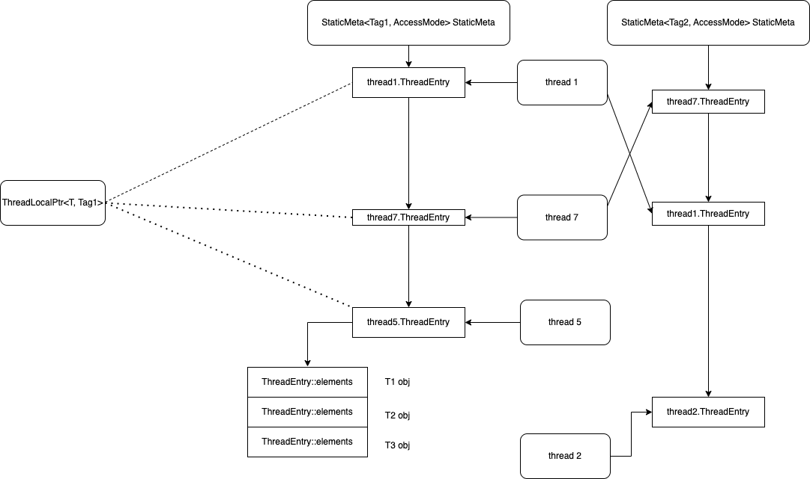

# folly学习笔记


## 1 ThreadLocal 部分

参考的代码commit at 77e08c29d9f3b60b55dd74c1ceede35a8297e586，第一个就看ThreadLocal，是因为这几天解BUG涉及到这块，所以就先写了

### 1.1 ThreadLocal的结构

参考folly自己对于threadlocal的描述，可以发现实际上针对每种Tag类型，只会占用一个pthreadke。参考实现能发现，folly内部实际上是一个per thread存储一个指针，这个指针指向一个ThreadEntry::elements数组

> - Similar speed as using `pthread_getspecific` directly, but only consumes a single `pthread_key_t` per `Tag` template param.
>
>   ------
>
>   We keep a `__thread` array of pointers to objects (`ThreadEntry::elements`) where each array has an index for each unique instance of the `ThreadLocalPtr` object. Each `ThreadLocalPtr` object has a unique id that is an index into these arrays so we can fetch the correct object from thread local storage very efficiently.
>
>   In order to prevent unbounded growth of the id space and thus huge `ThreadEntry::elements` arrays, for example due to continuous creation and destruction of `ThreadLocalPtr` objects, we keep track of all active instances by linking them together into a list. When an instance is destroyed we remove it from the chain and insert the id into `freeIds_` for reuse. These operations require a global mutex, but only happen at construction and destruction time. `accessAllThreads` also acquires this global mutex.
>
>   We use a single global `pthread_key_t` per `Tag` to manage object destruction and memory cleanup upon thread exit because there is a finite number of `pthread_key_t`'s available per machine.

这个描述不够清楚，我再用自己的话简单描述一下，

template <class T, class Tag = void, class AccessMode = void> ThreadLocal，是ThreadLocalPtr的简单包裹，没有太多需要担心的东西

template <class T, class Tag = void, class AccessMode = void> ThreadLocalPtr，ThreadLocalPtr如果初始化的时候没有特别的初始化Tag，那么实际上都是从StaticMeta里面拿到具体的element的，简单陈述就是从static thread_local ThreadEntry* threadEntryTL的数组找到element然后拿出来

typedef threadlocal_detail::StaticMeta<Tag, AccessMode> StaticMeta，全局单例的静态元数据，里面放了一个pthread_key，用来在新线程找来的时候找到对应的thread_entry。默认的tag是void，意味着即使你存储着一堆不同类型T的对象，只要tag一致，它们都会放在一个thread_entry指向的element数组里面。

struct folly::threadlocal_detail::ThreadEntry，每个线程存储着自己的Per-thread entry，进程里面有几个StaticMeta，那么线程就会存储几个ThreadEntry。每次拿取threadentry都是从ThreadLocalPtr里面的get进去，然后就开始perthread的操作了

用一张图来表示，就是ThreadLocalPtr统一入口，如果已经分配了Per-thread entry和元素，那就直接返回并分配，没分配的话就走第一次分配的流程，也就是下面1.2节的ThreadLocal第一次执行操作时的流程




这个描述还没看明白的话，可以对着下面的操作流程看下


### 1.2 ThreadLocal第一次执行操作时的流程

简单来说，当一个线程第一次调用folly::ThreadLocal的时候，实际上走的基本都是slow函数，调用关系伪代码如下

````c
olly::ThreadLocalPtr<T, Tag, AccessMode>::get() {
    olly::threadlocal_detail::StaticMeta<Tag, AccessMode>::get {
        if (tls entry capacity <= id) {
           StaticMeta<...>::getSlowReserveAndCache {
                tls entry = StaticMeta<Tag, AccessMode>::getThreadEntrySlow {
                  tls entry = pthread_getspecific(meta.pthreadKey_)
                  if  （tls entry not set)
                     alloc and pthread_setspecific
                     return tls entry
                }
                if (tls entry capacity <= id)
                   alloc and return tls entry
           }
        }
        threadEntry->elements[id]
    }
}
````


流程图还是不够精细，让我们直接来看源码，从最外层开始，走一遍一个线程第一次调用threadlocal类型的流程。

ThreadLocal 是ThreadLocalPtr的简单包裹，可以参考下面的代码，就是做个一个构造函数初始化一下，实际上每次get的时候都是拿取的tlp_，即自己的ThreadLocalPtr指针

```c++

template <class T, class Tag, class AccessMode>
class ThreadLocalPtr;

template <class T, class Tag = void, class AccessMode = void>
class ThreadLocal {
 public:
...
  FOLLY_ERASE T* get() const {
    auto const ptr = tlp_.get();
    return FOLLY_LIKELY(!!ptr) ? ptr : makeTlp();
  }
...
  T* operator->() const { return get(); }

  T& operator*() const { return *get(); }
...

  mutable ThreadLocalPtr<T, Tag, AccessMode> tlp_;
  std::function<T*()> constructor_;
};
```


那么ThreadLocalPtr的结果是什么，看下面实际上就包裹了一个StaticMeta::EntryID的对象，那么怎么做到的per线程？关注get函数StaticMeta::get(&id_);

```c++

template <class T, class Tag = void, class AccessMode = void>
class ThreadLocalPtr {
 private:
  typedef threadlocal_detail::StaticMeta<Tag, AccessMode> StaticMeta;
...
 public:
  constexpr ThreadLocalPtr() : id_() {}

  T* get() const {
    threadlocal_detail::ElementWrapper& w = StaticMeta::get(&id_);
    return static_cast<T*>(w.ptr);
  }
...

  mutable typename StaticMeta::EntryID id_;
};
```

函数StaticMeta::get可以看到，有一个简单的判断，根据是否使用kUseThreadLocal，来拿取threadEntryTL，这是一个真正的static thread_local类型对象，每个线程都有独一的一份，注意，这里开始了第一次分化。如果当前的capacity小于ID，那就需要走getSlowReserveAndCache分配出来容量。有人问为什么需要id_很简单，当你编译ThreadLocalPtr的模板参数没有指定Tag时，就用的都是一套StaticMeta<void,void>::get，也就是说你存储不同类别的（T类别）的对象，最后都会被塞到一个StaticMeta<void,void>::get，拿的都是一套threadEntryNonTL，既然如此就得给这个threadEntryNonTL所保存的element数组多分配点空间和元素。

如果你指定了独特的Tag，那么就不用多分配elements了，第一次分配了拿了就行。

我们模拟的是一个新线程走这一块，那么我们可以认为threadEntryTL第一次就是个空指针，就会再往getSlowReserveAndCache里面走，如果是第二次到来且已经给新的id分配过空间了，那么可以直接就拿初始化过的threadEntryTL对应的element返回了

```c++
  FOLLY_EXPORT FOLLY_ALWAYS_INLINE static ElementWrapper& get(EntryID* ent) {
    // Eliminate as many branches and as much extra code as possible in the
    // cached fast path, leaving only one branch here and one indirection below.
    uint32_t id = ent->getOrInvalid();

    static thread_local ThreadEntry* threadEntryTL{};
    ThreadEntry* threadEntryNonTL{};
    auto& threadEntry = kUseThreadLocal ? threadEntryTL : threadEntryNonTL;

    static thread_local size_t capacityTL{};
    size_t capacityNonTL{};
    auto& capacity = kUseThreadLocal ? capacityTL : capacityNonTL;

    if (FOLLY_UNLIKELY(capacity <= id)) {
      getSlowReserveAndCache(ent, id, threadEntry, capacity);
    }
    return threadEntry->elements[id];
  }
```


顺着getSlowReserveAndCache查看调用过程，可以看到当前线程ThreadEntry thread local static指针被instance的threadEntry_函数赋值，这个地方threadEntry = inst.threadEntry\_()这里拿到了当前数组的threadEntry，实际上的函数是getThreadEntrySlow。Here comes the fun part，是怎么拿到perthread的threadentry呢？

首先还是找到instance，然后拿到该static StaticMeta<Tag, AccessMode>保存的pthread_key，毕竟是第一次走到这里，当前线程调用pthread_getspecific发现，呀，我这个线程还没有绑定这个key的独有空间。ok，那么我可得申请一个。

先调用getThreadEntryList拿到StaticMeta的Theandentrylist，然后再构造一个static thread local类型entry，然后取地址挂到StaticMeta的链上。挂完了在把自己的tid和tid_os挂上，最终调用pthread_setspecific绑定该thread_entry，下这样子下次如果再进入getThreadEntrySlow就不需要再申请新的threadentry了，毕竟太慢了。

getThreadEntrySlow跑完了，实际上就可以分配element了，这时候就又回到了getSlowReserveAndCache里面，过程就比较直接了，inst里面reserve足够多的ent，然后拿一下id，返回即可，我们看看对应的reserve函数

```c++
  FOLLY_NOINLINE static void getSlowReserveAndCache(
      EntryID* ent, uint32_t& id, ThreadEntry*& threadEntry, size_t& capacity) {
    auto& inst = instance();
    threadEntry = inst.threadEntry_(); 
    if (UNLIKELY(threadEntry->getElementsCapacity() <= id)) {
      inst.reserve(ent);
      id = ent->getOrInvalid();
    }
    capacity = threadEntry->getElementsCapacity();
    assert(capacity > id);
  }


  FOLLY_EXPORT FOLLY_NOINLINE static ThreadEntry* getThreadEntrySlow() {
    auto& meta = instance();
    auto key = meta.pthreadKey_;
    ThreadEntry* threadEntry =
        static_cast<ThreadEntry*>(pthread_getspecific(key));
    if (!threadEntry) {
      ThreadEntryList* threadEntryList = StaticMeta::getThreadEntryList();
      if (kUseThreadLocal) {
        static thread_local ThreadEntry threadEntrySingleton;
        threadEntry = &threadEntrySingleton;
      } else {
        threadEntry = new ThreadEntry();
      }
      // if the ThreadEntry already exists
      // but pthread_getspecific returns NULL
      // do not add the same entry twice to the list
      // since this would create a loop in the list
      if (!threadEntry->list) {
        threadEntry->list = threadEntryList;
        threadEntry->listNext = threadEntryList->head;
        threadEntryList->head = threadEntry;
      }

      threadEntry->tid() = std::this_thread::get_id();
      threadEntry->tid_os = folly::getOSThreadID();

      // if we're adding a thread entry
      // we need to increment the list count
      // even if the entry is reused
      threadEntryList->count++;

      threadEntry->meta = &meta;
      int ret = pthread_setspecific(key, threadEntry);
      checkPosixError(ret, "pthread_setspecific failed");
    }
    return threadEntry;
  }
```


reserve过程实际上是从新分配element数组的个数，可以认为是扩充以后把原本的element数组的内容再原样拷贝回去，所以得加锁。这里的reallocate过程实际上是有倍数的，其会根据情况在两个增长因子计算出来的数字做分配，简单说就是要么分配(idval + 5) * kSmallGrowthFactor，要么分配(idval + 5) * kBigGrowthFactor，+5是为了避免过慢增长。

```c++

void StaticMetaBase::reserve(EntryID* id) {
  auto& meta = *this;
  ThreadEntry* threadEntry = (*threadEntry_)();
  size_t prevCapacity = threadEntry->getElementsCapacity();

  uint32_t idval = id->getOrAllocate(meta);
  if (prevCapacity > idval) {
    return;
  }

  size_t newCapacity;
  ElementWrapper* reallocated = reallocate(threadEntry, idval, newCapacity);

  // Success, update the entry
  {
    std::lock_guard<std::mutex> g(meta.lock_);

    if (reallocated) {
      /*
       * Note: we need to hold the meta lock when copying data out of
       * the old vector, because some other thread might be
       * destructing a ThreadLocal and writing to the elements vector
       * of this thread.
       */
      if (prevCapacity != 0) {
        memcpy(
            reallocated,
            threadEntry->elements,
            sizeof(*reallocated) * prevCapacity);
      }
      std::swap(reallocated, threadEntry->elements);
    }

    for (size_t i = prevCapacity; i < newCapacity; i++) {
      threadEntry->elements[i].node.initZero(threadEntry, i);
    }

    threadEntry->setElementsCapacity(newCapacity);
  }

  free(reallocated);
}
```


好了，threadlocalPtr部分就这个样子了


### 1.3 Threadlocalptr的一些问题

一些问题，

+ 如果在执行getSlowReserveAndCache，上下文切换了，当前线程被丢到另外的cpu上执行怎么办？没啥问题，它是threadlocal，不是cpulocal，所以上下文都还是传递过去了。
+ 为什么还需要pthread_key放在staticmeta里面，直接从静态函数进去走static pthread local，换句话说用c17以后的_thread不行吗？我理解是两点，但是感觉这解释也不太对劲
  + pthread_key这个东西，每个Meta只有一个，就能够大大节省\_thread成员创建时候对内存的浪费
  + 在主线程退出时，能针对性的去做清理，释放掉对应的tls


## 结尾
唉，尴尬

