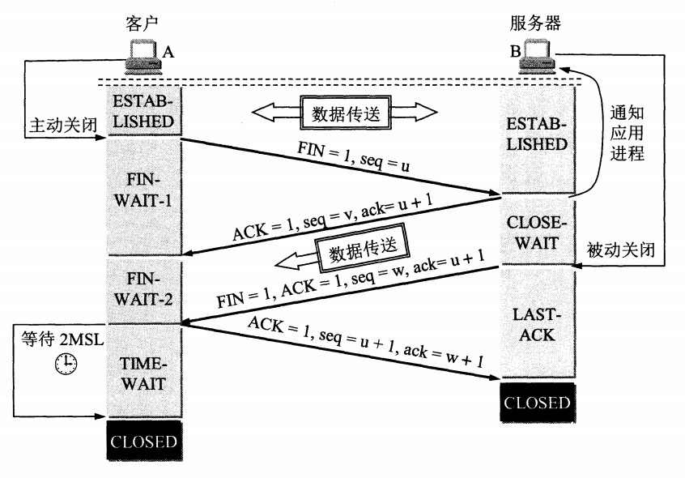

# 去tm的八股文

打不过就加入。。。

## 1 C/C++部分

+ const的作用

  + 修饰变量，说明变量不可被更改；
  + 修饰指针要么是指向常量的指针const char* p，这个就是一个变量，它指向的是const char*即常量，要么是自身是常量的指针（常量指针）char\* const p，这里的const修饰p；
  + 修饰引用，指向常量的引用（reference to const），用于形参类型，即避免了拷贝，又避免了函数对值的修改；
  + 修饰成员函数，说明该成员函数内部不能修改成员变量，写法为` int operator[](int idx) const`

+ Static的作用

  + 修饰普通变量，修改变量的存储区域和生命周期，使变量存储在静态区。且该变量不能在这个文件外面直接进行访问
    + 这里面有一个区别就是C++里面详细区分了local static storage和global static storage

    + 如果是函数内部的Static类型变量，在函数内部使用 `static` 关键字声明局部变量。这样，该变量的值会在函数调用之间保留，但只能在函数内部访问。这个变量实际上也是存储在静态区**静态数据区（static data segment）**

  + 修饰普通函数，使得外部文件不能直接使用该函数（这种文件范围的static可见性限制在C++里面通过嵌套一个匿名namespace废弃掉，但是这个feature估计短期还不会去掉）。

  + 修饰成员变量，修饰成员变量使所有的对象只保存一个该变量，而且不需要生成对象就可以访问该成员。

  + 修饰成员函数，使得不需要生成对象就可以访问该函数，但是在 static 函数内不能访问非静态成员。换言之就是类的static函数，别人可以直接使用。这个是C++新提供的

+ 单例模式（因为提到了static，所以直接给出单例模式），可以参考https://www.drdobbs.com/cpp/c-and-the-perils-of-double-checked-locki/184405726

  + 有问题的实现

    + 懒汉式：问题在于多个线程同时操作会有一致性+内存泄露的问题

      + ```
        class Singleton{
        private:
            Singleton(){}
            Singleton(Singleton&)=delete;
            Singleton& operator=(const Singleton&)=delete;
            static Singleton* m_instance_ptr;
        public:
            ~Singleton(){}
            static Singleton* get_instance(){
                if(m_instance_ptr==nullptr){
                      m_instance_ptr = new Singleton;
                }
                return m_instance_ptr;
            }
            void use() const { std::cout << "in use" << std::endl; }
        };
        ```

    + DCL（双检锁）懒汉式，这个实际上也有问题m_instance_ptr的判断实际上也可能受到一致性的问题

      + ```
        class Singleton{
        public:
            typedef std::shared_ptr<Singleton> Ptr;
            ~Singleton(){}
            Singleton(Singleton&)=delete;
            Singleton& operator=(const Singleton&)=delete;
            static Ptr get_instance(){
                // "double checked lock"
                if(m_instance_ptr==nullptr){
                    std::lock_guard<std::mutex> lk(m_mutex);
                    if(m_instance_ptr == nullptr){
                      m_instance_ptr = std::shared_ptr<Singleton>(new Singleton);
                    }
                }
                return m_instance_ptr;
            }
        
        
        private:
            Singleton(){
                std::cout<<"constructor called!"<<std::endl;
            }
            static Ptr m_instance_ptr;
            static std::mutex m_mutex;
        };
        ```

        

    + 饿汉式

  + 没问题的实现，使用了C++11保证的局部静态变量线程一致性。这里的Singleton的实例的生命周期从声明到程序结束，一直都存在，所以也是懒汉式，毕竟也是用到了才有

    + 懒汉式+CRTP（使用CRTP来保证肯定有方法）

      + ```c++
        template <typename T>
        class SingletonCRTP {
         public:
          static T& GetInstance() {
            static T instance;
            return instance;
          }
        
         protected:
          SingletonCRTP() = default;
          ~SingletonCRTP() = default;
        
          // 禁止拷贝构造和赋值操作
          SingletonCRTP(const SingletonCRTP&) = delete;
          SingletonCRTP& operator=(const SingletonCRTP&) = delete;
        };
        
        class MySingleton : public SingletonCRTP<MySingleton> {
         public:
          void PrintMessage() {
            std::cout << "This is a message from MySingleton." << std::endl;
          }
        };
        ```


  

+ inline的作用

  + 内联函数展开，直接执行函数体，避免参数压栈，针栈开辟回收啥的，但会做安全检查或自动类型转换（同普通函数
  + 只是建议编译器展开，具体是否展开不一定，编译器一般不内联包含循环、递归、switch 等复杂操作的内联函数；
  + 在类声明中定义的函数，除了虚函数的其他函数都会自动隐式地当成内联函数。
    + 问题1:虚函数可以是内连函数吗？虚函数可以是内联函数，内联是可以修饰虚函数的，但是当虚函数表现多态性的时候不能内联。毕竟runtime鬼知道是谁

+ volatile的作用

  + volatile 关键字是一种类型修饰符，用它声明的类型变量表示可以被某些编译器未知的因素（操作系统、硬件、其它线程等）更改。所以使用 volatile 告诉编译器不应对这样的对象进行优化。
  + volatile 关键字声明的变量，每次访问时都必须从内存中取出值
  + 我基本不用这个，多线程下这个volatile没同步，没有内存屏障，甚至执行顺序都不保证。实际上C++11之后就基本都是什么内存序的东西，对这个也不吭声了，哈哈哈哈。这个除非是直接硬件底层编程，比方说嵌入式啥的有承诺才用

+ #program pack(n)的作用

  + 设定结构体、联合以及类成员变量以 n 字节方式对齐。#program经常用来关闭特定类型的warn消息，也用来pack struct。一般来说，如果要设定的结构体是个精确控制的内存map结构，换言之要求多少多少字节的位置是成员变量的位置才需要这个东西
  + 一般你以多少字节对齐？64位GCC一般是8字节对齐
  + 补充对齐的基础知识：

    + 结构体第一个成员的**偏移量（offset）**为0，以后每个成员相对于结构体首地址的 offset 都是**该成员大小与实际的对齐值	中较小那个**的整数倍，如有需要编译器会在成员之间加上填充字节。
    + **结构体的总大小**为 实际的对齐值 的**整数倍**，如有需要编译器会在最末一个成员之后加上填充字节。

    关于对齐值：

    + 基本类型的对齐值就是其sizeof值
    + 结构体的对齐值是其成员的最大对齐值
    + 编译器可以设置一个对齐值，但是类型的实际对齐值是该类型的对齐值与设定的对齐值取最小值得来。
    + 结构体的成员为数组的时候，计算对齐值是根据数据元素的长度，而不是数组的整体大小

  + 

+ c++构造相关

  + explict关键字
    + explicit 修饰构造函数时，可以防止隐式转换和复制初始化
    + explicit 修饰转换函数时，可以防止隐式转换，但 [按语境转换](https://zh.cppreference.com/w/cpp/language/implicit_conversion) 除外
  + 成员初始化列表
    + 好处为初始化列表不需要定义默认构造函数，直接就会调用对应的构造函数
    + 使用方法为
    
      ```
      ```
    
      
    + 有些场合必须用初始化列表
      + 常量成员：常量成员只能初始化，不能赋值，所以必须放在初始化列表里
      + 引用类型：引用类型必须在定义时初始化，切不能重新赋值
      + 没有默认构造函数的类型：使用初始化列表不需要默认构造函数构造
  + 如何定义一个只能在堆上生成对象的类：

    + 方法1(比较糟糕的方法）：将析构函数设置为私有，原因：C++ 是静态绑定语言，编译器管理栈上对象的生命周期，编译器在为类对象分配栈空间时，会先检查类的析构函数的访问性。若析构函数不可访问，则不能在栈上创建对象。初次之外，还需要
      + **禁用拷贝构造:** 防止通过拷贝构造函数在栈上创建对象的副本。
      + **禁用赋值操作符:** 防止通过赋值操作符将一个堆对象赋值给栈对象。
    + 方法2：将构造函数全都定义为Protected/Privated类型，即禁用栈分配。然后创建一个Static函数，代表**静态工厂方法:** 提供一个静态的 `Create()` 方法，该方法在堆上分配内存并返回一个 `std::unique_ptr`，指向新创建的对象。
  + 如何定义一个只能在栈上生成对象的类：

    + 将 new 和 delete 重载为私有，原因：在堆上生成对象，使用 new 关键词操作，其过程分为两阶段：第一阶段，使用 new 在堆上寻找可用内存，分配给对象；第二阶段，调用构造函数生成对象。将 new 操作设置为私有，那么第一阶段就无法完成，就不能够在堆上生成对象。

+ 多态 & 虚函数

  + 如何实现的？
    + 虚函数指针：在含有虚函数类的对象中，指向虚函数表，在运行时确定。
    + 虚函数表：在程序只读数据段（`.rodata section`，见：[目标文件存储结构](https://github.com/huihut/interview#目标文件存储结构)），存放虚函数指针，如果派生类实现了基类的某个虚函数，则在虚表中覆盖原本基类的那个虚函数指针，在编译时根据类的声明创建。
  + 构造函数能是虚函数吗？奇怪的问题，因为构造的时候都是直接确定要哪个类型的对象，难道还能不确定是啥构造吗？另外In a constructor, the virtual call mechanism is disabled because overriding from derived classes hasn’t yet happened. Objects are constructed from the base up, “base before derived”.
  + 构造函数里面调用虚函数靠谱吗？不靠谱Calling virtual functions from a constructor or destructor is dangerous and should be avoided whenever possible. All C++ implementations should call the version of the function defined at the level of the hierarchy in the current constructor and no further.
  + 虚函数可以是inline的吗？虚函数可以是内联函数，内联是可以修饰虚函数的，但是当虚函数表现多态性的时候不能内联。因为inline是编译的时候确定，而虚函数表现为多态性时（运行期）确定，因此不可以内联。
  + 析构函数能是虚函数吗？析构函数可以是虚函数，另外基类的析构函数一般建议声明为虚函数，否则析构的时候（如果是删除一个基类指针，这个指针指向一个子类对象）那么会造成内存泄漏，因为不定义虚函数，不会调用子类的析构函数。简单说为了解决基类的指针指向派生类对象，并用基类的指针删除派生类对象。

+ Decltype

  + decltype 关键字用于检查实体的声明类型或表达式的类型及值分类，说的似乎不是人话，简单说就是decltype is *useful when declaring types that are difficult or impossible to declare using standard notation*, like lambda-related types or types

+ C++引用

  + 左值引用，常规引用表示对象的身份

  + 右值引用，必须绑定到右值（一个临时对象、将要销毁的对象）的引用。实现转移语义（Move Sementics）和精确传递（Perfect Forwarding）
    + 它可以消除两个对象交互时不必要的对象拷贝；
    + 能够更简洁明确地定义泛型函数。

+ C11相关的东西

  + 智能指针

    + shared_ptr

      + Class shared_ptr 实现共享式拥有（shared ownership）概念。多个智能指针指向相同对象，该对象和其相关资源会在 “最后一个 reference 被销毁” 时被释放。为了在结构较复杂的情景中执行上述工作，标准库提供 weak_ptr、bad_weak_ptr 和 enable_shared_from_this 等辅助类。

      + 线程安全：计数器是原子的，但是包裹的对象不一定是

      + 内存安全：

        + 可能存在的内存泄漏的点，参考https://stackoverflow.com/questions/38298008/possible-memory-leaks-with-smart-pointers

          + shared_ptr环引用，最简单的情况是两个智能指针互指，稍微复杂一些就是， a `shared_ptr` to `A`, which directly or indirectly holds a `shared_ptr` back to `A`, `A`'s use count will be 2.。英文是circular references like this，解决方式是把一个换成weak_ptr，one object should hold a [`weak_ptr`](http://www.boost.org/doc/libs/1_41_0/libs/smart_ptr/weak_ptr.htm) to the other, not a `shared_ptr`.
          + 另一种内存泄露的点，在于shared_ptr可能在将new出来的对象真正转换为shared_ptr的时候，因为其他流程崩溃而造成内存泄露。比方说下面的代码，可能在第二步操作就抛异常退出了。不过C++17开始保证函数执行顺序了，所以理论上这个情况也避免了

          ```c++
          processThing(std::shared_ptr<MyThing>(new MyThing()), get_num_samples());
          // 1 第一步操作
          new MyThing()
          // 2 第二步操作，在这里crash了
          get_num_samples()  
          // 3 第三步操作
          std::shared_ptr<MyThing>()
          ```

          

    + unique_ptr

      + Class unique_ptr 实现独占式拥有（exclusive ownership）或严格拥有（strict ownership）概念，保证同一时间内只有一个智能指针可以指向该对象。你可以移交拥有权。它对于避免内存泄漏（resource leak）——如 new 后忘记 delete ——特别有用。

    + weak_ptr

      + weak_ptr 允许你共享但不拥有某对象，一旦最末一个拥有该对象的智能指针失去了所有权，任何 weak_ptr 都会自动成空（empty）。因此，在 default 和 copy 构造函数之外，weak_ptr 只提供 “接受一个 shared_ptr” 的构造函数。

    + auto_ptr（被 C++11 弃用）

  + 类型转换

    + static_cast：1 用于非多态类型的转换 2 不执行运行时类型检查（转换安全性不如 dynamic_cast）
    + dynamic_cast：1 用于多态类型的转换 2 执行行运行时类型检查
    + const_cast: 用于删除 const、volatile 和 __unaligned 特性（如将 const int 类型转换为 int 类型 ）

  + 运行时类型信息(RTTI)
    + typeid，typeid 运算符允许在运行时确定对象的类型；type_id 返回一个 type_info 对象的引用
    + typeinfo，type_info 类描述编译器在程序中生成的类型信息。 此类的对象可以有效存储指向类型的名称的指针。

+ 多态

  + 静态多态，函数重载

  + 动态多态，运行绑定

+ 原子操作怎么实现

  + in pre-C++ 11 times, had to be performed using (for example) [interlocked functions](https://msdn.microsoft.com/en-us/library/windows/desktop/ms686360(v=vs.85).aspx#interlocked_functions) with MSVC or [atomic bultins](https://gcc.gnu.org/onlinedocs/gcc-4.4.3/gcc/Atomic-Builtins.html) in case of GCC.

  + A regular `int` has atomic loads and stores. Whats the point of wrapping it with `atomic<>`?our statement is only true for architectures that provide such guarantee of atomicity for stores and/or loads. There are architectures that do not do this. Also, it is usually required that operations must be performed on word-/dword-aligned address to be atomic

  + User level locks involve utilizing the atomic instructions of processor to atomically update a memory space. The atomic instructions involve utilizing a lock prefix on the instruction and having the destination operand assigned to a memory address. The following instructions can run atomically with a lock prefix on current Intel processors: ADD, ADC, AND, BTC, BTR, BTS, CMPXCHG, CMPXCH8B, DEC, INC, NEG, NOT, OR, SBB, SUB, XOR, XADD, and XCHG. [...] On most instructions a lock prefix must be explicitly used except for the xchg instruction where the lock prefix is implied if the instruction involves a memory address

    In the days of Intel 486 processors, the lock prefix used to assert a lock on the bus along with a large hit in performance. Starting with the Intel Pentium Pro architecture, the bus lock is transformed into a cache lock. A lock will still be asserted on the bus in the most modern architectures if the lock resides in uncacheable memory or if the lock extends beyond a cache line boundary splitting cache lines. Both of these scenarios are unlikely, so most lock prefixes will be transformed into a cache lock which is much less expensive.

    This means the CPU delays responding to MESI requests to invalidate or share the cache line, keeping exclusive access so no other CPU can look at it. MESI cache coherency always requires exclusive ownership of a cache line before a core can modify it so this is cheap if we already owned the line

+ 

  

  

  

## 2 操作系统部分

+ 进程和线程
  + 进程是资源分配的独立单位，线程是资源调度的独立单位
  
  + 进程的内存布局
    
    + ```
         高地址
        +------------------+
        |       栈         |   <- ebp (高地址),
        +------------------+              //栈存放参数,局部变量。通常也就几MB大小
        |                  |   <- esp
        |                  |
        +------------------+
        |       堆         |   <- 堆顶 //
        |                  |
        |                  |
        +------------------+
        |  共享库区域        |
        +------------------+
        |                  |
        |   数据段(.bss)    |
        |                  |
        +------------------+
        |   数据段(.data)   |
        +------------------+
        |    代码段         |
        +------------------+
        | 命令行参数/环境变量 |
        +------------------+
           低地址
      ```
    
    + 详细描述
    
      + 栈：由操作系统自动分配释放，存放函数的参数值、局部变量等的值，用于维护函数调用的上下文
        + 栈的大小一般是有限制的，用来避免占用过多内存资源，linux默认应该是**8192 kb** 
      + 堆：一般由程序员分配释放，若程序员不释放，程序结束时可能由操作系统回收，用来容纳应用程序动态分配的内存区域
        + 堆的大小是否有限制？**理论上，堆的大小可以非常大，甚至可以达到 GB 级别**
      + 共享库：存储程序运行时动态加载的共享库代码和数据。
      + 数据端：存储程序中已初始化的全局变量和静态变量。
        + 根据数据类型的不同，数据段进一步划分为：
          + 初始化数据段（.data）：存储已经初始化的非零全局变量和静态变量。
          + 未初始化数据段（.bss）：存储未初始化或者初始化为零的全局变量和静态变量。
      + 代码端：存储程序的可执行代码，也就是机器指令。
    
      
    
  + 进程之间私有和共享的资源
  
  + 线程之间共享和私有的资源
    + 私有：
      + **栈(Stack):** 每个线程拥有独立的栈空间，用于存储函数调用信息、局部变量以及函数参数等。这意味着不同线程的局部变量互不干扰，即使变量名相同，也位于不同的内存地址。
      + **寄存器:** 线程在执行过程中需要使用CPU寄存器存储临时数据。每个线程拥有独立的寄存器组，确保线程切换时数据得以保存。
      + **线程本地存储(TLS, Thread Local Storage):** 这是专门为线程私有数据设计的机制。通过TLS，可以创建全局变量，但每个线程访问的是该变量的私有副本。
    + 共享：
      + **堆(Heap):** 堆内存是所有线程共享的区域，用于动态分配内存。这意味着任何线程都可以访问和修改堆上的数据，因此需要特别注意数据同步和互斥访问。
      + **全局变量:** 位于全局作用域的变量是所有线程共享的。对全局变量的读写操作需要进行同步控制，否则可能导致数据竞争和程序错误。
      + **静态变量:** 静态变量的生命周期贯穿整个程序运行，所有线程都可以访问。与全局变量类似，对静态变量的操作也需要进行同步控制。
      + **文件、数据库等外部资源:** 多个线程可能同时访问同一个文件、数据库连接等外部资源。为了避免数据混乱，需要协调线程对这些资源的访问。
  
+ ELF相关：

  + 对应于

+ 程序通信的手段

  + 1、无名管道( pipe )；2、高级管道(popen)；3、有名管道 (named pipe)；4、消息队列( message queue )；5、信号量( semophore )；7、共享内存( shared memory )；8、套接字( socket )。

+ 线程通信的手段

+ 大端序和小端序，x86 linux是小端

  + Little-Endian就是低位字节排放在内存的低地址端，高位字节排放在内存的高地址端。

  + Big-Endian就是高位字节排放在内存的低地址端，低位字节排放在内存的高地址端。

    举一个例子，比如数字0x12 34 56 78在内存中的表示形式为：

    **1)大端模式：**

    低地址 -----------------> 高地址
    0x12  |  0x34  |  0x56  |  0x78

    **2)小端模式：**

    低地址 ------------------> 高地址
    0x78  |  0x56  |  0x34  |  0x12

+ 页面置换算法
  + fifo
  + lru
  + opt

+ 内核部分
  + 上下文切换

## 3 网络部分

+ 基础，协议分层五层
  + 应用层，
  + 传输层，端到端的报文传递，TCP，UDP
  + 网络层，负责数据包从源到宿的传递，IP，ICMP，ARP
  + 数据链路
  + 物理层
  
+ 从浏览器输入网址，到网页返回发生的过程

+ TCP
  + 该协议的特点：面向连接；只能端到端；全双工；可靠交互；面向字节流
  
  + 怎么保证可靠性
    
    + **确认和重传机制：**
    
      - **序列号和确认号：** TCP 使用序列号对每个字节进行编号，接收方使用确认号来告知发送方已成功接收的数据。
      - **超时重传：** 发送方在发送数据包后会启动一个计时器，如果在计时器超时前没有收到接收方的确认，则会重新发送该数据包。
      - **累积确认：** 接收方不必为每个收到的数据包都发送确认，可以累积确认多个数据包，提高效率。
    
    + **流量控制：**
    
      - **滑动窗口机制：** 接收方通过通告窗口大小来限制发送方发送数据的速率，避免发送方发送数据过快导致接收方缓冲区溢出。
    
      - **拥塞控制：** 当网络出现拥塞时，TCP 会自动降低发送速率，避免加剧网络拥塞。
    
        - **慢启动 (Slow Start)**
    
          - **初始阶段：** 连接建立之初，发送方维护一个拥塞窗口 (cwnd)，初始值很小，通常为 1 个报文段大小 (MSS)。
          - **指数增长：** 每收到一个 ACK 确认，拥塞窗口大小就翻倍，实现发送速率的指数增长，快速探测网络容量。
          - **慢启动门限 (ssthresh)：** 当拥塞窗口大小达到慢启动门限值时，慢启动阶段结束，进入拥塞避免阶段。
    
          **2. 拥塞避免 (Congestion Avoidance)**
    
          - **线性增长：** 拥塞窗口超过慢启动门限后，每收到一个 ACK，拥塞窗口大小只增加 1 个 MSS，实现发送速率的线性增长，避免网络拥塞。
    
          **3. 快速重传 (Fast Retransmit)**
    
          - **重复 ACK：** 当接收方发现数据包丢失时，会发送重复的 ACK，提示发送方进行重传。
          - **快速重传：** 发送方如果连续收到 3 个重复 ACK，则认为数据包丢失，立即进行重传，无需等待超时计时器。
    
          **4. 快速恢复 (Fast Recovery)**
    
          - **拥塞窗口减半：** 快速重传发生后，将慢启动门限设置为当前拥塞窗口大小的一半。
          - **拥塞窗口调整：** 将拥塞窗口设置为慢启动门限值 + 3 个 MSS，开始执行拥塞避免算法。
    
    + **校验和：**
    
      - TCP 报文段首部包含校验和字段，用于校验数据在传输过程中是否出现错误。
    
    + 连接管理：
    
      - **三次握手：** 在传输数据前，TCP 使用三次握手建立可靠的连接，确保双方都准备好进行数据传输。
      - **四次挥手：** 数据传输结束后，TCP 使用四次挥手断开连接，确保数据传输完整。
    
  + 三次握手
    + 为什么需要三次握手：因为信道不可靠，而 TCP 想在不可靠信道上建立可靠地传输，那么三次通信是理论上的最小值。（而 UDP 则不需建立可靠传输，因此 UDP 不需要三次握手。）简单来说就是攀岩，山上扽扽绳子，山下扽扽绳子
  
    + 四次挥手
  
      
  
    + TCP 为什么要进行四次挥手？ / 为什么 TCP 建立连接需要三次，而释放连接则需要四次？因为 TCP 是全双工模式，客户端请求关闭连接后，客户端向服务端的连接关闭（一二次挥手），服务端继续传输之前没传完的数据给客户端（数据传输），服务端向客户端的连接关闭（三四次挥手）。所以 TCP 释放连接时服务器的 ACK 和 FIN 是分开发送的（中间隔着数据传输），而 TCP 建立连接时服务器的 ACK 和 SYN 是一起发送的（第二次握手），所以 TCP 建立连接需要三次，而释放连接则需要四次。
  
    + 为什么 TCP 连接时可以 ACK 和 SYN 一起发送，而释放时则 ACK 和 FIN 分开发送呢？（ACK 和 FIN 分开是指第二次和第三次挥手）因为客户端请求释放时，服务器可能还有数据需要传输给客户端，因此服务端要先响应客户端 FIN 请求（服务端发送 ACK），然后数据传输，传输完成后，服务端再提出 FIN 请求（服务端发送 FIN）；而连接时则没有中间的数据传输，因此连接时可以 ACK 和 SYN 一起发送。
  
    + 为什么客户端释放最后需要 TIME-WAIT 等待 2MSL 呢？为了保证客户端发送的最后一个 ACK 报文能够到达服务端。若未成功到达，则服务端超时重传 FIN+ACK 报文段，客户端再重传 ACK，并重新计时；另外防止已失效的连接请求报文段出现在本连接中。TIME-WAIT 持续 2MSL 可使本连接持续的时间内所产生的所有报文段都从网络中消失，这样可使下次连接中不会出现旧的连接报文段。
  
    + 如果有大量timewait，说明我们关闭了大量的连接，
  
    + 如果有大量closewait，close_wait的大量出现说明我们作为服务端（关闭的被动方，客户端发起的关闭连接），用户层程序没有把连接关闭，因此占用了大量的closewait和端口。对于服务端而言，这种往往是因为负载均衡器发起了关闭，但是负载均衡器后面的服务没有执行关闭。
  
  + 为什么服务一般建议调整timewait和closewait，虽然端口数量和tcp连接数量没直接关系，毕竟tcp四元组嘛。但是每个进程能打开的文件描述符是有限制的，所以一般会建议调整timewait。不过也可以调整打开的文件描述符数量
  
  + IP报文最大报文和TCP报文最大报文什么区别，如果TCP报文长度大于IP报文呢
  
+ UDP

+ TCP和UDP的区别
  + TCP 面向连接，UDP 是无连接的；
  + TCP 提供可靠的服务，也就是说，通过 TCP 连接传送的数据，无差错，不丢失，不重复，且按序到达；UDP 尽最大努力交付，即不保证可靠交付
  + TCP 的逻辑通信信道是全双工的可靠信道；UDP 则是不可靠信道
  + 每一条 TCP 连接只能是点到点的；UDP 支持一对一，一对多，多对一和多对多的交互通信
  + UDP 没有拥塞控制，因此网络出现拥塞不会使源主机的发送速率降低（对实时应用很有用，如 IP 电话，实时视频会议等）

+ DNS协议

+ HTTP错误码
  + 200
  + 400
  + 403
  + 404
  + 500
  + 503
  
+ 网络编程


+字节面试题目

介绍


dns的过程

tcp和udp的区别

tcp三次握手和四次挥手的过程

进程和线程的区别

用户态和kernel态，为什么需要kernel

上下文切换怎么发生

系统调用切换几次上下文切换

C里面栈和堆的区别

进程中内存里面的结构，有哪些段


智能指针


## 结尾
唉，尴尬

