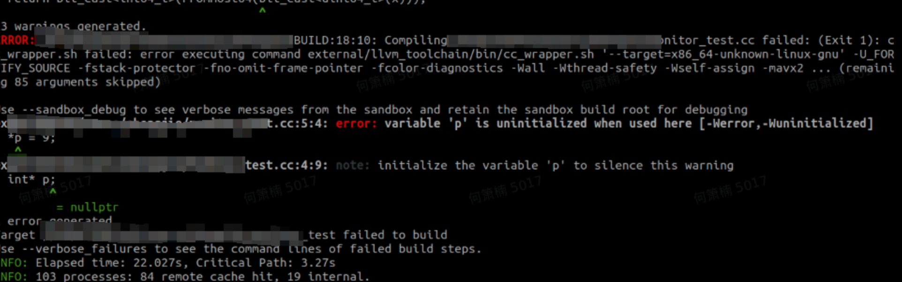
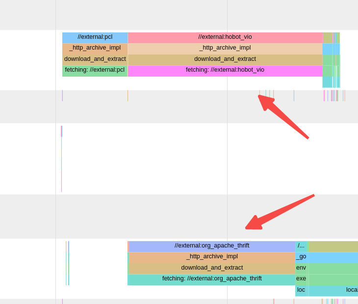

# bazel从入门到中级

这个本来是写在gitbook上的内容，发现编辑起来很费劲，就写到了博客。因为历史比较久，所以可能有一些地方有些陈旧，我会后面逐渐更新。

另外，一些具体名词我不会翻译为中文，因为英文更明确，避免二义性。但是其意义我会用中文表达，从而方便理解。下面的内容可能有点多，可以先大致浏览理解概念，以后再回来细看。


## 为什么使用Bazel

有些人喜欢争辩Cmake比Bazel如何如何好，如何如何兼容，我承认Cmake的历史更久远，用的人更多，但是Bazel的设计理念个人认为是更先进或者说更明确化：让专业的人做专业的事情，拆分代码编写工程师和鸡架工程师（哈）。

因此，使用Bazel的人，我建议先阅读https://bazel.build/basics中的这篇文章https://bazel.build/basics/artifact-based-builds，展示了bazel背后的设计理念，理解了bazel背后的设计理念，对于增量编译，可复现性等概念就会有本质的理解。

如果偷懒的话，可以不看原本内容，直接看下面我总结的对比

### Why Bazel
Bazel是一种比较先进的构建平台，提供了多种便利:

- **支持高级构建语言**. Bazel自身使用一种抽象的、易读的语言，在高语义级别上描述项目的构建属性。与其他工具不同，Bazel基于库、二进制文件、脚本和数据集的概念进行操作，使您免于编写诸如编译器和链接器等工具的单独调用的复杂性。
- **bazel高效且可靠.** Bazel缓存了所有先前完成的工作，并跟踪文件内容和构建命令的更改。这样，Bazel就知道何时需要重新构建，并仅重新构建需要的部分。可以设置项目以高度并行和增量的方式构建，从而进一步加快构建速度
- **bazel本身支持多平台**. Bazel可以在Linux、macOS和Windows上运行。Bazel可以为多个平台构建二进制文件和可部署包，包括桌面、服务器和移动设备，而这些构建可以来自同一个项目。
- **bazel可以应对不同的构建规模.** 无论是针对多个代码仓库还是处理成千上万个用户基础，Bazel都能够应对，并保持其灵活性和高效性。它通过并行化和增量构建的策略来实现高效的构建过程，并且能够有效地管理大型项目的构建需求。
- **bazel是可拓展的.** 它支持许多编程语言，并且您可以扩展Bazel以支持任何其他语言或框架。

一部分人认为，相比bazel，Cmake不是更成熟吗？恰恰相反，我个人认为，成熟，只是随大流的一种说法而言，Cmake实际上是在没有工具使用，只能找一种解决问题的方法的情况下选择的工具。它为了解决一个问题，而引入了更多的问题，最终把自己复杂化，有点类似早期的python。

而Bazel设计明确，理念清楚，这种为了解决特定的问题而做的实践，总是比乱七八糟的凑到一起解决某些不确定的问题要方便很多，其开发愿景就是为了

- **保证工程师聚焦于代码开发。**软件开发人员可以专注于编写代码的创造性过程，因为构建和测试的过程已经native 支持，即使是想编辑语言相关的工具链，也有相对应一整套机制方便拓展
- **工程师可以无视本地环境的影响**。环境是“可移动”的，简单来说工程师不用再被一堆莫名其妙的环境配置工作所耽误。
- **项目可以扩展到任何规模的代码库、任何规模的团队**。bazel原生支持的增量测试使团队能够在提交之前充分验证每个更改。无论是增加多语言支持，异或跨平台编译，或者引入更多的代码数量，都不会造成breaking级别的编译灾难（当然，不能有效控制代码的量级，这也是工程人员的失误）

综上，对于软件工程而言，保证开发效率并不是只是说“研发想怎么写，就瞎tm怎么写”，而是如何降低在多人参与开发，且能力不同的情况下所带来的复杂度和依赖复杂度。相比于Cmake的拓展支持，Bazel的原生支持，提供了一种有效的切入点。

综上，我认为bazel是一种目前比较先进的编译方向，当然除了bazel还有please build之类的东西，只不过，我实践bazel比较久。。。
末尾是Bazel和Cmake的优势对比。


| Bazel                                    | Cmake                                                        |
| ---------------------------------------- | ------------------------------------------------------------ |
| Remote Cache/Execution                   | CMake没有内置支持增量编译和分布式编译，但是CMake对增量编译工具ccache/sccache和分布式编译工具distcc/icecc支持良好 |
| Deterministic build                      | 灵活性更高，用户可在CMakeLists中调用其他command(shell, built-in commands等)实现自定义功能。 |
| 使用较难，但是依赖分析，使用方式非常清楚 | 简单，易于修改和维护                                         |


如果想了解更多，阅读https://bazel.build/basics


## 基础篇

这一部分主要面向bazel体系的用户。希望读者能够明白

- Bazel是构建平台，不能简单地理解为编译平台，错误理解这一点会导致无法快速找到对应的解决方案。有个用户曾经抱怨：bazel编译报错，而g++编译同样代码不报错，仔细一看报错如下图，这个是非常明显的bazel的工具链启用-Werror和-Wuninitialized选项导致的结果，如果g++启用同样的选项，也会报错。

  

- Bazel提供的是一种抽象的package，target，库依赖的关系，具体如何构建这些target和package，是对应的bazel rule的实现范畴。具体构建的细节，麻烦用户自己去看工具链的配置。
- Bazel的执行模式有多种：sandbox模式，本地模式等。因此使用sandbox模式的时候，本地临时文件如果不明确地指定到BUILD文件中，就无法在构建过程中看到（调用到）

这部分我建议读者先把C++那部分的例子看了，再根据需求选择使用的语言，选择对应的阅读章节。


### 1 Bazel基础概念通识

这部分会给出Bazel的设计理念，基础概念和输出布局。Bazel体系的用户在交流的时候需要有明确的名词来统一上下文，我看到很多次研发在别人给出具体的开发建议的时候，不知道怎么写BUILD的情况。因此，确定基础术语的概念会很有用。我建议阅读者重点看这部分，这部分搞明白，bazel的基本用法就不会有问题了。


在执行构建或者test任务的时候，bazel可以拆分为一下几个流程:

1. **Loads** 加载BUILD文件，并且将外部依赖
2. **Analyzes** 分析输入和输出的依赖，在内存中生成对应的action图.
3. **Executes** 执行真正的构建操作并输出相应的文件和日志


下面给出一些术语，方便统一上下文：

#### Action

执行构建过程的命令，比方说将一个完整的调用过程，改过程将其它Action的产物作为输入，并产生对应的其它编译产物。需要包含包括命令行参数、action索引（action key）、环境变量和在BUILD中声明的输入/输出工件等元数据

**参考** [Rules documentation](https://bazel.build/extending/rules#actions)

#### Action cache

磁盘上的缓存，存储执行的[操作](https://bazel.build/reference/glossary#action)到它们创建的输出的映射。缓存键称为action索引(action key)。Bazel 增量模型的核心组件。缓存存储在输出根目录（output base directory）中，因为是文件形式存储，所以在 Bazel 服务器重新启动后仍然存在。

#### Action graph

内存中的action关系图，表明action和具体的action读取和生成的产物[。](https://bazel.build/reference/glossary#artifact)该图读取`BUILD`。生成，从本质来说是一种依赖/生成关系的具象化。该图[在分析阶段](https://bazel.build/reference/glossary#analysis-phase)产生并在[执行阶段](https://bazel.build/reference/glossary#execution-phase)使用。目前还不需要了解分析阶段，执行阶段的作用是什么

#### Action graph query (aquery)

一个[查询](https://bazel.build/reference/glossary#query-concept)工具，可以查询action的依赖关系等。用户就可以了解从具体的规则，到转化为实际构建工作的过程是如何的。

#### Action key

action的缓存索引。根据action元数据计算得出，其中可能包括要在操作中执行的命令、编译器标志、库位置或系统头文件，具体取决于action的实现。从而使 Bazel 能够确定性地缓存或使单个action无效。

#### Analysis phase

构建的第二阶段。处理BUILD[文件](https://bazel.build/reference/glossary#build-file) 中指定的target之间的关系，并根据该[目标图](https://bazel.build/reference/glossary#target-graph)以生成内存中action graph。当前阶段是规则的实现被真正的解析的阶段。

#### Artifact

成品，指的是源文件或者代指生成的文件。也可以是文件目录，称为 [tree artifacts](https://bazel.build/reference/glossary#tree-artifact)

成品可以作为多个action的输入，参与到构建中，但最多只能由一个操作生成。

与[文件目标](https://bazel.build/reference/glossary#target)相对应的成品可以通过label来寻址。


#### Aspect

一种在现有rule的基础上拓展以执行更多action的机制，这种机制会传递到具体规则的依赖上，对于初级用户用不到，不过bazel-clang-tidy是用这个实现的。如果目标 A 依赖于 B，则可以在 A 上应用一个aspect，该aspect向上遍历到B中，并在 B 中运行其他action来生成和收集其他输出文件。这些附加操作同样被缓存并在重用。

参考**:** [Aspects documentation](https://bazel.build/extending/aspects)

#### Aspect-on-aspect

A composition mechanism whereby aspects can be applied to the results of other aspects. For example, an aspect that generates information for use by IDEs can be applied on top of an aspect that generates `.java` files from a proto.

For an aspect `A` to apply on top of aspect `B`, the [providers](https://bazel.build/reference/glossary#provider) that `B` advertises in its [`provides`](https://bazel.build/rules/lib/globals#aspect.provides) attribute must match what `A` declares it wants in its [`required_aspect_providers`](https://bazel.build/rules/lib/globals#aspect.required_aspect_providers) attribute.

#### Attribute

 [rule](https://bazel.build/reference/glossary#rule)的属性，用于表达每个目标的构建信息。例如，srcs（源文件）、deps（依赖项）和copts（自定义编译选项）分别声明了目标的源文件、依赖项和自定义编译选项。对于特定目标而言，可用的属性取决于其规则类型。

#### .bazelrc

Bazel的配置文件用于更改启动标志和命令标志的默认值，并定义常见选项组，可以使用--config标志在Bazel命令行上一起设置。Bazel可以从多个bazelrc文件（系统范围、工作空间范围、用户范围或自定义位置）中组合设置，而bazelrc文件也可以从其他bazelrc文件导入设置。

#### Blaze

google内部的编译构建系统，说实在的，google的infra真是令人羡慕呀

#### BUILD File

BUILD文件是Bazel的主要配置文件，用于告诉Bazel要构建哪些软件输出，它们的依赖关系是什么，以及如何构建它们。Bazel将BUILD文件作为输入，并使用该文件创建依赖图，并推导出构建中间和最终软件输出所必须完成的操作。BUILD文件将目录以及不包含BUILD文件的任何子目录标记为一个包（package），并且可以包含由规则创建的目标（targets）。该文件也可以被命名为BUILD.bazel。

#### BUILD.bazel File

参考 [`BUILD` File](https://bazel.build/reference/glossary#build-file).优先级高于同目录的BUILD

#### .bzl File

一个文件，用Starlark语言编写，用于定义规则（rules）、宏（macros）和常量（constants）。然后可以使用load()函数将其导入到BUILD文件中。实际上后面看什么bazel管理C++，bazel管理GO就能看到类似的load使用方法。

#### Build graph

Bazel构建过程中构建和遍历的依赖图。包括目标（targets）、配置后的目标（configured targets）、操作（actions）和构件（artifacts）等节点。当所有被请求的目标所依赖的构件都被验证为最新时，构建被视为完成。


#### Build setting

一个由Starlark定义的部分配置。transitions（配置传递）可以设置构建设置以更改子图的配置。对用户而言，这个可以理解为一种编译配置，比方说--config=cpu


#### Clean build

一个不使用之前构建结果的构建过程。这通常比增量构建更慢，但通常被认为更正确。保证无论是清理构建（clean build）还是增量构建（incremental build），都始终是正确的是Bazel的功能，不过确定性这点bazel在极低情况下确实会出问题，我明确遇到过在aliyun的内部pod下载的外部依赖版本不正确的问题，最后是通过指定url的下载地址避免这个问题。

#### Client-server model

bazel会自动在本地机器上启动一个后台服务器来执行Bazel命令。该服务器在命令之间保持持续存在，但在一段时间的无活动后（或通过bazel shutdown显式停止）会自动关闭。将Bazel拆分为服务器和客户端有助于分摊JVM启动时间，并支持更快的增量构建，因为操作图在命令之间保留在内存中。说白了，分离控制端和策略端

#### Command

简单理解就是Bazel的子函数，例如bazel build、bazel test、bazel run和bazel query。

#### Command flags

一组影响相关命令的标志（flags）。先指定具体命令，再指定flag（例如：先bazel build，然后在--keep going啥的 ）。这些标志可以适用于一个或多个命令。例如，--configure是仅用于bazel sync命令的标志，而--keep_going适用于sync、build、test等多个命令。command flag通常用于配置目的，因此command flag的更改可能会导致Bazel内存中存储的action graph无效，并重新启动分析阶段。


#### Configuration

配置，rule定义之外的信息，会影响rule生成action的方式。每个build都至少有一个配置，用于指定目标平台、操作环境变量和命令行选项。 [Transitions](https://bazel.build/reference/glossary#transition)可能会创建额外的配置，例如用于指定主机的工具链或交叉编译。

参考**:** [Configurations](https://bazel.build/extending/rules#configurations)

#### Configuration trimming

配置建材，简单来说就是只包含目标实际需要的配置的过程。例如，如果你使用C++依赖项//:c构建Java二进制文件//:j，在//:c的配置中包含--javacopt的值是不必要的，因为更改--javacopt会不必要地破坏C++构建的缓存性能。因此，按需配置确保每个目标仅包含其自身所需的配置信息，以避免不必要的配置冗余和影响构建缓存性能。

#### Configured query (cquery)

检索启用了配置之后的 [configured targets](https://bazel.build/reference/glossary#configured-target)的检索工具，`select()` and [build flags](https://bazel.build/reference/glossary#command-flags) (such as `--platforms`)的选择是已经明确化了。这个在[analysis phase](https://bazel.build/reference/glossary#analysis-phase)之后才执行

参考**:** [cquery documentation](https://bazel.build/query/cquery)

#### Configured target

启用了某种配置的target

#### Correctness

当构建的输出忠实地反映其传递输入的状态时，构建就是正确的。为了实现正确的构建，Bazel努力做到具有隔离性、可重现性，并使构建分析和操作执行具有确定性。这意味着在构建过程中，Bazel会尽力确保每次构建都以一致的方式处理输入，从而产生可预测和可重复的结果。这样可以确保构建的正确性，并减少不确定性带来的问题。

不过这个概念对用户一般来说没啥用，毕竟正确性大部分永不不会涉及到，很多时候问题也不是bazel的问题。

#### Dependency

依赖关系，一般是指两个target直接的依赖关系，就是BUILD文件里面规则的deps

#### Depset

一种用于收集传递依赖关系数据的数据结构。它经过优化，使得合并依赖集（depset）在时间和空间上更加高效，因为依赖集往往非常大（成千上万个文件）。为了节省空间，该数据结构被实现为可以递归引用其他依赖集。规则实现在不是构建图顶层的情况下，不应将依赖集“展开”为列表形式。展开大型依赖集会导致巨大的内存消耗。在Bazel的内部实现中，它也被称为嵌套集合（nested sets）

**参考:** [Depset documentation](https://bazel.build/extending/depsets)

#### Disk cache

本地磁盘的Blob存储用于远程缓存功能。它可以与实际的远程Blob存储结合使用。在构建过程中，Bazel会将构建输出结果转换为Blob，并将其存储在本地磁盘的Blob存储中。这样可以提高后续构建的速度，因为它可以避免重复构建相同的输出结果。实际的远程Blob存储通常用于分布式构建环境，可以将Blob存储在远程服务器上，以便多个构建节点共享和访问这些Blob。

#### Distdir

只读目录，包含了Bazel本来会通过代码库规则从互联网获取的文件。它使得构建可以完全离线运行，不需要依赖于网络资源。通过将这些文件预先存储在只读目录中，Bazel可以在没有网络连接的情况下执行构建过程，并使用本地文件来满足构建所需的依赖。这种方式对于处于隔离环境或无法访问互联网的构建系统非常有用。不过说起来，distdir对于我的实践过程而言，最重要的还是提供对第三方依赖的缓存

#### Dynamic execution

动态执行策略是根据各种启发式规则，在本地和远程执行之间进行选择，并使用更快速成功的方法的执行结果。某些操作在本地执行速度更快（例如链接操作），而其他操作在远程执行速度更快（例如高度可并行化的编译操作）。动态执行策略可以提供最佳的增量构建和清理构建时间。通过动态地选择本地或远程执行，Bazel可以根据操作类型和执行环境的特点，最大程度地优化构建过程，从而获得更快的构建时间。


#### Execution phase

构建的第三个阶段，执行在分析阶段创建的操作图中的操作。这些操作调用可执行文件（编译器、脚本）来读取和写入构件。生成策略控制这些操作的执行方式：本地执行、远程执行、动态执行、沙盒化执行、使用Docker等等。

注意，具体执行的环境很多时候都是用户显示指定，其中配置的传递是个很蛋疼的东西，因为很多本地的配置是不能在sandbox环境完全一致的。

#### Execution root

执行根目录（Execution Root）是workspace的输出目录中的一个目录，这里的action是在在非沙盒的环境中执行。该目录的内容主要放的是各种输入产物的hard link。执行根目录还包含指向外部依赖的符号软链接作为输入，以及用于存储输出的bazel-out目录。

在加载阶段通过创建大量符号软链接的方式来生成该根目录。可以通过在命令行中使用"bazel info execution_root"来访问该目录。

实际上，在buildfarm里面这个execution root的概念比较常用，因为有大量的分发的执行任务。

#### File

参考 [Artifact](https://bazel.build/reference/glossary#artifact).

#### Hermeticity

如果构建和测试操作没有外部影响，那么构建就是隔离的（hermetic），这有助于确保结果具有确定性和正确性。例如，隔离的构建通常禁止操作访问网络，限制对声明的输入的访问，使用固定的时间戳和时区，限制对环境变量的访问，并为随机数生成器使用固定的种子。

通过确保构建过程中没有外部的不可控因素干扰，隔离的构建可以消除构建结果的不确定性，并提高构建的可靠性和可重复性。这样可以更容易地定位和解决构建中的问题，并确保不同环境下的构建结果一致，从而提高构建的可移植性和可靠性。

#### Incremental build

我一般叫做，增量编译。更标准应该是增量构建。增量构建是通过重复使用先前构建的结果来减少构建时间和资源使用的一种方式。依赖检查和缓存旨在为此类型的构建生成正确的结果。增量构建是清理构建的反义词。

在增量构建中，Bazel会检查先前构建生成的构件，并根据构建过程中的依赖关系来确定哪些构件是最新的和有效的。只有在需要更新的构件上才会执行必要的操作，从而避免不必要的重新构建。这种方式可以显著减少构建时间，提高开发效率，并降低资源消耗。

#### Label

标签（label）是用于唯一标识Bazel构建系统中的目标的方式。通过标签，可以准确定位和引用构建过程中所涉及的不同目标。标签的结构使得能够精确指定目标所在的位置，并指定目标的名称。这种标识符的使用使得Bazel可以在构建和依赖管理过程中准确地追踪和处理不同的目标

完全限定的标签（fully-qualified label），例如//path/to/package:target，由以下部分组成：//用于标记工作空间的根目录，path/to/package表示包含声明该目标的BUILD文件的目录，:target表示在前述BUILD文件中声明的目标的名称。也可以在前面添加@my_repository//<..>，表示该目标在名为my_repository的外部依赖代码库中声明。


#### Loading phase

构建的第一阶段，Bazel在此阶段解析WORKSPACE、BUILD和.bzl文件，创建包（packages）。在此阶段，还会评估宏（macros）和某些函数，如glob()。该阶段与构建的第二阶段，即分析阶段，交替进行，以建立目标图（target graph）。

在加载阶段，Bazel会解析工作空间（WORKSPACE）文件，确定项目的配置和依赖关系。同时，它会解析BUILD文件和.bzl文件，创建和配置目标（targets）。宏和函数的评估也在此阶段进行，这有助于在构建过程中执行各种动态操作。加载阶段与分析阶段交替进行，以逐步构建目标图，为后续的构建阶段做好准备。

#### Macro

这个机制允许开发者将多个规则目标的声明逻辑封装在一个自定义的Starlark函数中，以提高代码的可重用性和可维护性。通过定义这样的函数，可以在多个BUILD文件中调用该函数来创建相同的规则目标，从而避免了重复编写相似的规则声明代码。在加载阶段，Bazel会将这些组合规则函数展开为实际的规则目标声明，以便后续的构建阶段使用。这种机制使得规则声明的复用变得更加方便和灵活。

**参考:** [Macro documentation](https://bazel.build/extending/macros)

#### Mnemonic

通过使用助记符，规则作者可以为规则中的操作赋予具有描述性和易记性的名称，使其更容易理解和识别。助记符通常与特定的操作类型或规则相关联，帮助开发者快速了解操作的用途和功能。这种命名方式有助于提高代码的可读性和可维护性，并促进团队之间的协作和理解。

#### Native rules

内置规则（Built-in rules）是Bazel中内置的、由Java实现的规则。这些规则在.bzl文件中以原生模块中的函数形式出现（例如native.cc_library或native.java_library）。而用户定义的规则（非原生规则）则是使用Starlark创建的。

#### Output base

在Bazel中，工作空间专用目录（workspace-specific directory）通常被称为"bazel-out"。它是一个由Bazel自动创建的目录，用于存储构建过程中生成的各种输出文件，如编译生成的二进制文件、中间文件、测试结果、日志文件等。该目录的位置位于Bazel的输出用户根目录下，用于将构建过程中产生的文件与源代码目录分离开，以保持项目结构的清晰性和可维护性。

#### Output groups

输出组（Output group）是指在Bazel完成构建一个目标后，预计将生成的一组文件。规则通常会将其常规输出放在"default output group"中（例如，Java规则的.jar文件、C++规则目标的.a和.so文件）。默认输出组是在命令行上请求目标时构建的输出组。

规则可以定义更多的命名输出组，可以在BUILD文件（使用filegroup规则）或命令行（--output_groups标志）中显式指定。命名输出组允许开发者将特定类型的输出文件分组，以便在构建过程中对其进行特定的处理或操作。

通过输出组的概念，Bazel提供了一种灵活的机制来管理构建过程中生成的文件。开发者可以根据需要将文件分组，以便更好地组织、处理和操作构建输出。这样可以提高构建过程的灵活性和可定制性，并为构建系统的构建结果提供更好的结构和组织。

#### Output user root

用户特定的目录，用于存储Bazel的输出。目录名称来自于用户系统的用户名。如果多个用户同时在系统上构建同一项目，这样的目录结构可以避免输出文件冲突。它包含与各个工作空间的构建输出相对应的子目录，也被称为输出基目录（output bases）。

#### Package

一个BUILD文件定义的目标集合。一个包（package）的名称是相对于工作空间根目录的BUILD文件路径。一个包可以包含子包，或者包含BUILD文件的子目录，从而形成一个包的层级结构。

在Bazel中，每个BUILD文件定义了一个或多个目标。这些目标可以是编译的二进制文件、库、测试等。一个包是一组相关目标的集合，用于组织和管理相关代码和资源。包的名称是BUILD文件相对于工作空间根目录的路径，通过名称可以唯一标识和引用该包。

一个包可以包含多个子包，这些子包可以是在包内部的子目录，每个子目录都包含一个或多个BUILD文件。这种层级结构的组织方式使得代码和资源可以按照逻辑和功能进行分组，便于项目的管理和维护。通过包的层级结构，可以在构建过程中方便地引用和操作不同级别的目标，从而形成灵活和可扩展的项目结构.

#### Package group

一个目标，代表一组包（packages）。通常在可见性属性（visibility attribute）的值中使用。

#### Platform

在构建过程中涉及的“机器类型”（machine type）。这包括Bazel运行的主机平台（"host"平台）、构建工具在其上执行的机器（"exec"平台）以及构建目标的目标机器（"target"平台）。

主机平台（host platform）指的是运行Bazel的计算机系统，它提供了构建环境和资源。

执行平台（exec platform）是指在构建过程中实际执行构建工具的机器。这些构建工具可以是编译器、链接器、测试运行器等。执行平台可能与主机平台不同，特别是在跨平台构建或远程构建的情况下。

目标平台（target platform）是指构建的目标所要运行的目标机器。它可以是不同的操作系统、处理器架构或设备。Bazel支持在不同的目标平台上构建和运行代码，这使得跨平台开发和构建成为可能。

通过区分主机平台、执行平台和目标平台，Bazel可以根据不同的平台要求和配置，有效地管理和执行构建过程，并生成适用于特定目标平台的构建结果。

#### Provider

提供者（Provider）是一种描述在依赖关系中在规则目标之间传递的信息单元的模式。通常，它包含编译器选项、传递的源文件或输出文件以及构建元数据等信息。它通常与依赖集（depsets）结合使用，以高效地存储累积的传递数据。内置的提供者之一是DefaultInfo。

需要注意的是，针对特定规则目标保存具体数据的对象被称为“提供者实例”（provider instance），尽管有时它与“提供者”（provider）这个术语混淆使用。

提供者的概念用于在Bazel构建系统中传递和共享关于目标的相关信息。通过定义和使用提供者，不同的规则目标之间可以传递和访问彼此所需的数据和元数据。提供者实例是提供者模式的具体实现，用于为特定的规则目标提供特定的数据。这种机制使得规则目标之间可以有效地共享和传递信息，并为构建系统提供了更灵活和可扩展的方式来处理目标之间的依赖关系和数据传递。

**参考:** [Provider documentation](https://bazel.build/extending/rules#providers)

#### Query (concept)

构建分析是指对构建图进行分析，以了解目标属性和依赖关系结构的过程。Bazel支持三种查询变体：query、cquery和aquery。

- 

  query：这是最常用的查询命令，用于从构建图中获取目标的属性信息、依赖关系、输出文件等。可以使用query命令来查询目标的属性值、依赖的目标以及目标的输出文件等详细信息。

- 

  cquery：这是一个更复杂和强大的查询命令，用于执行复杂的构建图查询操作。它支持使用复杂的查询条件和过滤器来获取目标的详细信息，并可以根据查询结果执行特定的操作。

- 

  aquery：这是一个用于分析构建图的高级查询命令。它可以提供有关目标之间依赖关系、构建过程和执行过程的详细信息。通过aquery命令，可以深入了解构建图的结构和执行细节，有助于进行构建性能分析和优化。


#### Repository cache

共享内容寻址缓存（Content-Addressable Cache）是Bazel为构建过程中下载的文件提供的一个共享缓存，可以跨工作空间共享。它使得在初始下载后可以进行离线构建成为可能。通常用于缓存通过repository rules（如http_archive）和repository rule APIs（如repository_ctx.download）下载的文件。只有在下载时指定了文件的SHA-256校验和，才会将文件缓存起来。

共享内容寻址缓存是一种通过文件内容的哈希值来寻址和存储文件的机制。在Bazel中，通过将文件的SHA-256校验和用作其唯一标识符，将文件存储在共享缓存中。当下次构建需要相同文件时，Bazel会首先检查共享缓存，如果缓存中已存在相应的文件，则可以直接使用缓存中的副本，而无需重新下载。

#### Reproducibility

无论环境，时间或者具体调用方式的变化，结果总是确定的，且可复现的。

#### Rule

规则（Rule）是用于在BUILD文件中定义规则目标（rule targets）的一种模式，例如cc_library。从BUILD文件作者的角度来看，规则由一组属性和黑盒逻辑组成。逻辑告诉规则目标如何生成输出构件并将信息传递给其他规则目标。从.bzl文件作者的角度来看，规则是扩展Bazel以支持新的编程语言和环境的主要方式。

在加载阶段，规则被实例化为规则目标，用于生成构建图。在分析阶段，规则目标通过提供者（providers）的形式向下游依赖传递信息，并注册描述如何生成输出构件的操作。这些操作在执行阶段运行。

**参考:** [Rules documentation](https://bazel.build/extending/rules)


#### Runfiles

Runfiles是指测试在运行时所需的文件和目录。这些文件和目录可以是测试执行过程中需要访问的数据文件、配置文件、资源文件等。Bazel会根据构建规则中指定的运行时依赖项，将相应的Runfiles复制到与测试可执行文件并列的目录结构中。这样，在运行测试时，可执行文件就可以访问其所需的运行时数据。

**参考:** [Runfiles documentation](https://bazel.build/extending/rules#runfiles)

#### Sandboxing

沙盒，这个不用介绍了

#### Skyframe

[Skyframe](https://bazel.build/reference/skyframe) Bazel的核心框架，用来提供并发，执行等功能


#### Starlark

Starlark是用于编写规则和宏的扩展语言。它是Python的一个受限子集（在语法和语法上），旨在用于配置目的和提高性能。Starlark文件使用.bzl扩展名。BUILD文件使用Starlark的一个更受限制的版本（例如，不支持def函数定义），曾被称为Skylark。

**参考:** [Starlark language documentation](https://bazel.build/rules/language)

#### Startup flags

The set of flags specified between `bazel` and the [command](https://bazel.build/reference/glossary#query-command), for example, bazel `--host_jvm_debug` build. These flags modify the [configuration](https://bazel.build/reference/glossary#configuration) of the Bazel server, so any modification to startup flags causes a server restart. Startup flags are not specific to any command.

#### Target

目标（Target）是在BUILD文件中定义的对象，由标签（label）标识。从最终用户的角度来看，目标代表了工作空间的可构建单元。

通过实例化规则而声明的目标称为规则目标（rule target）。根据规则的不同，这些目标可以是可执行的（如cc_binary）或可测试的（如cc_test）。规则目标通常通过其属性（如deps）依赖于其他目标；这些依赖关系构成了目标图的基础。

除了规则目标，还有文件目标和包组目标。文件目标对应于在BUILD文件中引用的构件。作为特例，任何包的BUILD文件始终被视为该包中的源文件目标。

在加载阶段，目标被发现和解析。在分析阶段，目标与构建配置关联起来，形成配置目标（configured target）。

#### Target graph

构建图（Build graph）是一种目标及其依赖关系的内存中表示形式。它在加载阶段生成，并作为分析阶段的输入。

构建图是一个有向无环图（Directed Acyclic Graph，DAG），其中节点表示目标，边表示依赖关系。通过构建图，Bazel可以了解每个目标之间的依赖关系，以及构建过程中各个目标的顺序和执行逻辑

#### Target pattern

用于指定针对哪些target的方式，常用的模式有:all（所有规则目标），:*（所有规则目标 + 文件目标），...（当前包和所有子包递归）。可以组合使用，例如，//...:*表示从工作空间根目录递归地包含所有包中的所有规则和文件目标。


#### Tests

这个不用多介绍了吧，测试规则，一般要包含一个可执行对象，返回码啥的

#### Toolchain

用于构建某种语言输出的一组工具。通常，工具链包括编译器、链接器、解释器或/和代码检查工具。工具链也可以根据平台的不同而有所变化，也就是说，Unix编译器工具链的组件可能与Windows的不同，尽管工具链是用于相同的语言。选择适合平台的正确工具链称为工具链解析（toolchain resolution）。


#### Transition

将配置变换的过程。即使从同一个规则实例化，build graph中的目标也可以具有不同的配置，这就是转换的作用。

**参考:** [User-defined transitions](https://bazel.build/extending/config#user-defined-transitions)

#### Tree artifact

表示一堆产物的集合。由于这些文件本身不是artifacts，因此对它们进行操作的action必须将Tree artifact明确为其输入或输出。

#### Visibility

构建系统中防止不必要的依赖关系的两种机制之一：目标可见性用于控制一个目标是否可以被其他目标依赖；加载可见性用于控制BUILD或.bzl文件是否可以加载给定的.bzl文件。通常情况下，没有上下文的情况下，"可见性"通常指的是目标可见性。

**参考:** [Visibility documentation](https://bazel.build/concepts/visibility)

#### Workspace

工作区，实际上就是包含WORKSPACE文件的目录

#### WORKSPACE file

用来定义工作区的文件，一般来说还包含一些外部信息和初始化流程


### 2 核心基础概念

这部分实际上会针对性地重点讲一下最常用的术语，和最常见的问题。很多Bazel体系的用户经常遇到的错误都是比较"简单”的错误，往往是对核心概念理解不到位导致。这里的概念很多都是剥离了语言层面，只关注通用领域。

建议直接看https://blog.aspect.dev/avoid-eager-fetches 获取最直接的理解。


### 核心基础术语

介绍术语之前，先看看bazel的一次执行过程，都有什么阶段？

1. **Loading Phase**: Bazel会加载工作目录里面的 BUILD文件，解析这些文件的内容来创建创建package和target graph。此阶段涉及评估宏、从glob到具体文件的映射关系（因为bazel支持glob，就那个什么\*\*/*.txt的语法）和解析target之间的依赖关系。

   1. 需要注意的是，如果在workspace里面写了一些外部依赖的命令，那么在LOAD阶段就会直接下载这些外部依赖，比方说下面的写在WORKSPACE里面的代码，一旦开始做构建，就会去下载对应的依赖（即使这些依赖目前并不需要），这个可能会导致bazel eager fetch的问题

      ```
      load("@rules_python//python:pip.bzl", "pip_parse")
      
      pip_parse(
         name = "my_deps",
         requirements_lock = "//path/to:requirements_lock.txt",
      )
      
      load("@my_deps//:requirements.bzl", "install_deps")
      install_deps()
      ```

2. **Analysis Phase**: Bazel分析目标图，确定构建所需的操作步骤。它会检查目标的依赖项或源文件是否发生了变化，以确定是否需要重新构建。在此阶段，Bazel创建一个操作图，表示生成所需输出的构建步骤的顺序。

   1. 这里依然存在bazel eager fetch的问题，因为在BUILD文件里面同样包含Load语句，看下面的例子，只要需要涉及构建到这个对应BUILD文件，或者说这个package的某个target，就会引入npm的拉取

      ```
      # Content of //pkg1:BUILD
      load("@npm//@bazel/typescript:index.bzl", "ts_project")
      
      package(default_visibility = ["//visibility:public"])
      
      ts_project(
          name = "a",
          srcs = glob(["*.ts"]),
          declaration = True,
          tsconfig = "//:tsconfig.json",
          deps = [
              "@npm//@types/node",
              "@npm//tslib",
          ],
      )
      
      filegroup(name = "b")
      ```

3. **Execution Phase**: Bazel执行action graph中的操作（这里注意，不是target graph），以构建目标。该阶段涉及调用编译器、链接器和其他构建所需的工具。Bazel会尽可能并行执行这些操作，利用可用资源加快构建过程。

4. **Output Generation**: 随着操作的执行，Bazel生成目标指定的输出文件。这些文件可以是二进制可执行文件、库文件、测试结果或在BUILD文件中定义的其他构建产物。

5. **Caching and Incremental Build**: Bazel利用缓存机制来提高构建性能。它会缓存先前构建的结果，并使用它们来避免重新执行未更改的操作。这种增量构建的特性使得Bazel只需重新构建项目中必要的部分，节省时间和资源。

   1. 注意，bazel的["repository cache"](https://bazel.build/docs/build#repository-cache) 是不会缓存外部依赖的，如果外部依赖的下载规则里面有sha256 的hash它才会缓存，否则就是很简单的cvs拉取

6. **Build Success or Failure**: 构建结束啦，这个时候如果是编译就是输出具体文件的路径，如果测试（成功）就是成功了，没啥别的信息

下面的术语，我会把影响到的阶段也一并列出

#### LABEL

loading phase，analysis phase

所有target都属于一个包。目标的名称称为其标签。每个标签都唯一标识一个目标。一般来说推荐提供完整路径用来标识特定的target，比方说下面的例子，第一部分是仓库名字`@myrepo//`. 因为大部分代码都是同样代码库，所以可以直接写//，省略最前面的代码库。标签第二部分表示package 名字， `my/app/main `用路径来表示。我推荐用户使用完整的路径来标识target，而不是相对地方式，来避免问题

```
@myrepo//my/app/main:app_binary
```


#### BUILD 文件

loading phase，analysis phase

一般研发平时需要写的都是BUILD文件，简单来说就是如何定义Package。Build是Bazel的主要配置文件，用于告诉Bazel要构建哪些软件输出，它们的依赖关系是什么，以及如何构建它们。

大多数构建规则都依托于具体的语言，比方说cc_binary、cc_library和cc_test分别是用于构建C++二进制文件、库和测试的构建规则。其他编程语言使用相同的命名方案，只是前缀不同，例如Java的规则以java_*开头。

bazel的规则一部分是native支持，另一部分就是拓展方式支持，因为bazel的拓展大部分命名为 `.bzl`格式，因此使用类似下面的语句来加载规则

```
load("//foo/bar:file.bzl", "some_library")
```

Bazel的规则分类

- `*_binary`规则用于构建特定语言的可执行程序。在构建完成后，可执行文件将位于构建工具的输出目录里面中，路径与规则的标签相对应。例如，//my:program将出现在二进制输出树的$(BIN_DIR)/my/program路径下，bazel会明确地输出编译出来的文件的路径，我原先测试的时候默认的BIN_DIR是bazel-bin

  在某些语言中，这些规则还会创建一个runfiles目录，其中包含属于该规则的data属性中提到的所有文件，或者依赖项的传递闭包中的任何规则所提到的文件。这些文件集合会集中在一个位置，方便部署到生产环境中。

- `*_test`规则是_binary规则的一种特殊形式，用于自动化测试。测试只是在成功时返回零的程序，**所以不要再问，为什么我的测试程序成功了，但是没看到日志呀？**

  与二进制文件一样，测试也有runfiles目录，其中的文件是测试在运行时合法打开的唯一文件。例如，一个名为cc_test(name='x', data=['//foo:bar'])的程序在执行过程中可以打开和读取$TEST_SRCDIR/workspace/foo/bar。（每种编程语言都有自己的实用函数用于访问$TEST_SRCDIR的值，但它们都等同于直接使用环境变量。）如果违反此规则，当在远程测试主机上执行测试时，测试将失败。**runfiles目录的可见性对应于BUILD文件中明确指定的可见性**

- `*_library`规则用于指定在给定编程语言中单独编译的模块。库可以依赖其他库，而`*_binary`和`*_test`可以依赖库。


#### Dependencies

loading phase，analysis phase

在写BUILD的时候，真正要解决的问题往往是依赖关系的修正，正常情况下，如果你依赖了什么东西，你就应该直接添加到deps或者data里面。而不是让自己依赖的组件来提供这种依赖，参考下面的例子

`a`直接依赖`c`，但忘记在构建文件中声明它时， 就会引入潜在风险。

| `a / a.in`                                                   |                                                              |
| ------------------------------------------------------------ | ------------------------------------------------------------ |
| import b; <br/>        import c; <br/>        b.foo(); <br/>        c.garply(); |                                                              |
|  |  |

声明的依赖关系不再符合实际的依赖关系。这种情况下构建可能会正常运行，因为依赖关系被闭包封锁了的，但掩盖了一个问题：`a`直接依赖`c`。如果b哪一天不依赖c了，那构建就崩了，这个问题实际上现在C++也开始治理了，禁止implicit include某个函数。


大多数构建规则都具有三个属性，用于指定不同类型的通用依赖项：`srcs`、`deps`和`data`。下面对此进行解释。详细的相关信息，请参阅 [所有规则通用的属性](https://bazel.build/reference/be/common-definitions)。

这几种依赖关系提供不同的功能

1. src依赖：构建时一个或多个规则直接使用的文件。

2. deps依赖：指向提供头文件、符号、库、数据等的单独编译模块的规则。

3. data依赖：常见情况时test或者binary需要的运行或者测试数据文件。编译单元测试执行文件时，不需要该文件，但在运行测试时确实需要它。简单来说就是在执行期间用到的工具。这种文件一般加在data里面，因为构建系统在一个隔离目录中运行测试（实际上就是沙盒），其中只有列到 `data`的文件可用。因此，如果二进制/库/测试需要运行一些文件，请在`data`.里面加这些东西。下面的代码就显示了两种情况，分别是本目录引用文件，和其它目录的test引用文件。

```
# I need a config file from a directory named env:
java_binary(
    name = "setenv",
    ...
    data = [":env/default_env.txt"],
)

# I need test data from another directory
sh_test(
    name = "regtest",
    srcs = ["regtest.sh"],
    data = [
        "//data:file1.txt",
        "//data:file2.txt",
        ...
    ],
)
```

想引用这些文件可通过相对路径`path/to/data/file`获得。在测试中，使用拼接的最终目录或者使用相对路径来引用这些文件，例如 `${TEST_SRCDIR}/workspace/path/to/data/file`.

#### Visibility

loading phase，analysis phase

上面的提到了BUILD，提到了依赖，这里面自然而然就引出了一个问题，怎么控制我的target是否可以被别人依赖？可见性就解决这个问题：**目标可见性**控制谁可以依赖于具体的target，即谁可以在deps添加（例如 ）内使用对应的target。

这个东西，目前看起来是一种很好的规范，但是不一定能立刻推广开。感觉可能大家第一反应就是所有的都是public。。。

下面有一些具体的例子

- `"//visibility:public"`: 所有的外部packet都能看到这个target。实际上目前的代码基本都是这种情况。

- `"//visibility:private"`: 只有当前package的target可以看到这个target

- `"//foo/bar:__pkg__"`:  `//foo/bar` 可以看到这个target(但子packages看不到).

- `"//foo/bar:__subpackages__"`:  `//foo/bar` 和它的间接或直接 subpackages都可以看到

- `"//some_pkg:my_package_group"`: Grants access to all of the packages that are part of the given [`package_group`](https://bazel.build/reference/be/functions#package_group).


#### sandbox

execution phase

bazel使用沙盒有多种原因

- 不使用沙盒，如果使用了未声明的输入文件（即未在BUILD的规则的deps或者data里面明确列出的文件），那么本应该构建失败但是可能成功了反而。

- 不正确地重用缓存条目会在远程缓存期间引发问题。共享缓存中的错误缓存条目会影响项目中的每个开发人员，而清除整个远程缓存不是可行的解决方案。

- 沙盒隔离模拟了远程执行的行为 - 如果使用沙盒隔离进行构建运行良好，那么它很可能也适用于远程执行。通过使远程执行上传所有必需的文件（包括本地工具）。**注意啊，沙盒只是个过程，最后还是进程，在buildfarm的环境里面，我已经看到好几次本地执行命令的副作用了，比方说什么创建文件不删除的奇葩代码**

那么，我们就需要按照情况，选择在何种模式下执行命令，简单来说就是选择用不用沙盒，用哪种沙盒

- `local`（也叫做`standalone`）策略不会进行任何类型的沙盒隔离。它只是将操作的命令行设置为工作目录，并在工作区的execroot中执行。

- `processwrapper-sandbox`是一种不需要任何“高级”功能的沙盒策略，它应该可以在任何POSIX系统上正常工作。它会构建一个沙盒目录，其中包含指向原始源文件的符号链接，然后使用该目录代替execroot设置操作的工作目录来执行操作的命令行，然后将输出文件移出沙盒并放入execroot中，最后删除沙盒。这样可以防止操作意外使用未声明的输入文件，并避免在execroot中留下未知的输出文件。

- `linux-sandbox`更进一步，在processwrapper-sandbox的基础上进行了扩展。类似于Docker在底层所做的工作，它使用Linux命名空间（用户、挂载、PID、网络和IPC命名空间）将操作与主机隔离开来。也就是说，除了沙盒目录以外，它将整个文件系统设置为只读，因此操作不能意外修改主机文件系统上的任何内容。这样可以防止出现像是一个有错误的测试意外删除了您的$HOME目录的情况。您还可以选择**禁止操作访问网络（**非常棒的特征，总有一些奇怪的用户会写测试访问数据库**）**。

- `darwin-sandbox`与之类似，但用于macOS。它使用苹果的sandbox-exec工具实现了与Linux沙盒大致相同的功能。

请注意`linux-sandbox`和`darwin-sandbox`都无法在“套娃”场景中工作，因为不推荐docker使用privileged模式，就是 `docker run --privileged`，所以如果你想在docker里面调用linux-sandbox，做不到啊。所以一般docker里面是fallback到`processwrapper-sandbox`


### 3 实践 快速浏览Bazel配置

现在我们来做一些实践，如何快速看配置相关的东西。

简单来讲，看配置的方法基本就是三步

- 先看WORKSPACE看工具链

  - WORKSPACE中工具链的配置可以方便理解具体的规则上下文，配置是否移动化，阅读WORKSPACE中的配置就能看出来

- 递归地看.bazelrc里面的通用配置组

  - 配置组.bazelrc的阅读过程中，要注意try-import语句，正确的情况下会拆分为

    ```
    # Missing CI section
    try-import %workspace%/abc.bazelrc
    ```

- 递归地看BUILD文件里面load的各种语句的实现

  - 具体的各种语句，比方说rules docker的规则细节什么的，都可以直接对应到starlark语句。


简单地看一个例子

WORKSPACE如下，可以发现这是一个go的仓库，其初始化了GO的依赖，同时引入了rules_docker


```
workspace(name = "debug")

load("@bazel_gazelle//:deps.bzl", "gazelle_dependencies")
load("//bazel:go_deps.bzl", "go_dependencies")

# gazelle:repository_macro bazel/go_deps.bzl%go_dependencies
go_dependencies()

load("@io_bazel_rules_docker//repositories:deps.bzl", rules_docker_go_deps = "deps")

rules_docker_go_deps()  
```

.bazelrc如下，可以发现环境默认使用python3，编译的C++选项默认为C++17，且开启了fpic，release模式下，开启了thin级别的flto。


```
build --java_runtime_version=remotejdk_11

build --host_force_python=PY3
build --python_version=PY3

build --cxxopt=-std=c++17

build --experimental_cc_shared_library
build --experimental_link_static_libraries_once

# This is to avoid building both PIC and non-PIC versions in opt mode,
# which doubles the build time.
build --force_pic

build:release --copt="-g1" --copt="-flto=thin"
```


### 4 Bazel的输出布局

这部分普通的研发应该遇不到，对于普通研发用户而言，输出布局一般是固定的，他们常常遇到的问题都是权限错误的问题，可以通过对输出布局的理解来定位具体是什么原因导致的问题，最常见也是最简单的解决方法就是chown。

对Infra研发而言，这部分就比较重要，输出布局需要根据业务需要做变化，尤其在CI环境下，比方说输出目录，CACHE在哪里。还有如何排查一些确定性的问题的时候输出布局知识就体现其重要性


### 输出布局

目前Bazel的文件布局是怎么实现的呢？

- Bazel命令行必须在WORKSPACE文件所在的目录，或者子目录调用
- Linux默认的*outputRoot*目录设置为`~/.cache/bazel` 
- Bazel用户编译状态位于 `outputRoot/_bazel_$USER`. 
- 在 `outputUserRoot` 目录有个 `install` 目录，里面放了一堆MD5的编译产物文件
- 在 `outputUserRoot` 目录, an `outputBase` 目录会根据workspace directory的MD5创建 .比方说workspace路径为 `/home/user/src/my-project` (or in a directory symlinked to that one), 就会创建`/home/user/.cache/bazel/_bazel_user/7ffd56a6e4cb724ea575aba15733d113`. 目录。
- 通过配置Bazel's `--output_base` 启动选项来覆盖默认的output base 目录,举个例子 `bazel --output_base=/tmp/bazel/output build x/y:z`.
- 通过配置Bazel's `--output_user_root` 启动选项来覆盖默认的install base 和 output base 目录，比方说`bazel --output_user_root=/tmp/bazel build x/y:z`.


Copy

```
<workspace-name>/                         <== workspace文件路径
  bazel-my-project => <...my-project>     <== Symlink to execRoot
  bazel-out => <...bin>                   <== Convenience symlink to outputPath
  bazel-bin => <...bin>                   <== Convenience symlink to most recent written bin dir $(BINDIR)
  bazel-testlogs => <...testlogs>         <== Convenience symlink to the test logs directory

/home/user/.cache/bazel/                  <== Root for all Bazel output on a machine: outputRoot
  _bazel_$USER/                           <== Top level directory for a given user depends on the user name:
                                              outputUserRoot
    install/
      fba9a2c87ee9589d72889caf082f1029/   <== Hash of the Bazel install manifest: installBase
        _embedded_binaries/               <== Contains binaries and scripts unpacked from the data section of
                                              the bazel executable on first run (such as helper scripts and the
                                              main Java file BazelServer_deploy.jar)
    7ffd56a6e4cb724ea575aba15733d113/     <== Hash of the client's workspace directory (such as
                                              /home/user/src/my-project): outputBase
      action_cache/                       <== Action cache directory hierarchy
                                              This contains the persistent record of the file
                                              metadata (timestamps, and perhaps eventually also MD5
                                              sums) used by the FilesystemValueChecker.
      action_outs/                        <== Action output directory. This contains a file with the
                                              stdout/stderr for every action from the most recent
                                              bazel run that produced output.
      command.log                         <== A copy of the stdout/stderr output from the most
                                              recent bazel command.
      external/                           <== The directory that remote repositories are
                                              downloaded/symlinked into.
      server/                             <== The Bazel server puts all server-related files (such
                                              as socket file, logs, etc) here.
        jvm.out                           <== The debugging output for the server.
      execroot/                           <== The working directory for all actions. For special
                                              cases such as sandboxing and remote execution, the
                                              actions run in a directory that mimics execroot.
                                              Implementation details, such as where the directories
                                              are created, are intentionally hidden from the action.
                                              Every action can access its inputs and outputs relative
                                              to the execroot directory.
        <workspace-name>/                 <== Working tree for the Bazel build & root of symlink forest: execRoot
          _bin/                           <== Helper tools are linked from or copied to here.

          bazel-out/                      <== All actual output of the build is under here: outputPath
            local_linux-fastbuild/        <== one subdirectory per unique target BuildConfiguration instance;
                                              this is currently encoded
              bin/                        <== Bazel outputs binaries for target configuration here: $(BINDIR)
                foo/bar/_objs/baz/        <== Object files for a cc_* rule named //foo/bar:baz
                  foo/bar/baz1.o          <== Object files from source //foo/bar:baz1.cc
                  other_package/other.o   <== Object files from source //other_package:other.cc
                foo/bar/baz               <== foo/bar/baz might be the artifact generated by a cc_binary named
                                              //foo/bar:baz
                foo/bar/baz.runfiles/     <== The runfiles symlink farm for the //foo/bar:baz executable.
                  MANIFEST
                  <workspace-name>/
                    ...
              genfiles/                   <== Bazel puts generated source for the target configuration here:
                                              $(GENDIR)
                foo/bar.h                     such as foo/bar.h might be a headerfile generated by //foo:bargen
              testlogs/                   <== Bazel internal test runner puts test log files here
                foo/bartest.log               such as foo/bar.log might be an output of the //foo:bartest test with
                foo/bartest.status            foo/bartest.status containing exit status of the test (such as
                                              PASSED or FAILED (Exit 1), etc)
              include/                    <== a tree with include symlinks, generated as needed. The
                                              bazel-include symlinks point to here. This is used for
                                              linkstamp stuff, etc.
            host/                         <== BuildConfiguration for build host (user's workstation), for
                                              building prerequisite tools, that will be used in later stages
                                              of the build (ex: Protocol Compiler)
        <packages>/                       <== Packages referenced in the build appear as if under a regular workspace
```


### 5 实践 GRPC的Bazel集成

俗话说“知行合一”，没有了实践，仅有理论或者思维的前行是不能得到正确的结论的，下面开始实际的写一套代码，来理解bazel的实际运用。不过这部分都是我写的mock代码，可以跳过


#### 创建WORKSPACE文件

开始利用bazel体系构建一个继承C++,Golang,Rust,Python的monorepo，该仓库需要支持grpc,glog,absiel,boost,gtest等外部仓库，我将这个仓库命名为cyber_security。

新建一个folder，写入下面的内容到WORKSPACE文件，这里我们先引入llvm c++ & grpc的支持，写一个grpc的同步模式服务器。下面的代码可以看到注释掉了protobuf的引入（因为有个bug还没解决），引入了grpc和llvm toolchain。

我之所以不使用llvm 16是因为在mac m1上会报错，所以使用的是15的llvm版本

```
workspace(name = "cyber_security")

load("@bazel_tools//tools/build_defs/repo:http.bzl", "http_archive")

# portable llvm toolchain

BAZEL_TOOLCHAIN_TAG = "0.8.2"
BAZEL_TOOLCHAIN_SHA = "0fc3a2b0c9c929920f4bed8f2b446a8274cad41f5ee823fd3faa0d7641f20db0"

http_archive(
    name = "com_grail_bazel_toolchain",
    sha256 = BAZEL_TOOLCHAIN_SHA,
    strip_prefix = "bazel-toolchain-{tag}".format(tag = BAZEL_TOOLCHAIN_TAG),
    canonical_id = BAZEL_TOOLCHAIN_TAG,
    url = "https://github.com/grailbio/bazel-toolchain/archive/refs/tags/{tag}.tar.gz".format(tag = BAZEL_TOOLCHAIN_TAG),
)

load("@com_grail_bazel_toolchain//toolchain:deps.bzl", "bazel_toolchain_dependencies")

bazel_toolchain_dependencies()

load("@com_grail_bazel_toolchain//toolchain:rules.bzl", "llvm_toolchain")

llvm_toolchain(
    name = "llvm_toolchain",
    llvm_version = "15.0.0",
)

load("@llvm_toolchain//:toolchains.bzl", "llvm_register_toolchains")

llvm_register_toolchains()

# protobuf and grpc section
# http_archive(
#     name = "rules_proto",
#     sha256 = "dc3fb206a2cb3441b485eb1e423165b231235a1ea9b031b4433cf7bc1fa460dd",
#     strip_prefix = "rules_proto-5.3.0-21.7",
#     urls = [
#         "https://github.com/bazelbuild/rules_proto/archive/refs/tags/5.3.0-21.7.tar.gz",
#     ],
# )
# load("@rules_proto//proto:repositories.bzl", "rules_proto_dependencies", "rules_proto_toolchains")
# rules_proto_dependencies()
# rules_proto_toolchains()

http_archive(
    name = "com_github_grpc_grpc",
    strip_prefix = "grpc-1.57.0",
    sha256 = "8393767af531b2d0549a4c26cf8ba1f665b16c16fb6c9238a7755e45444881dd",
    urls = ["https://github.com/grpc/grpc/archive/refs/tags/v1.57.0.tar.gz"],
)
 
load("@com_github_grpc_grpc//bazel:grpc_deps.bzl", "grpc_deps")
grpc_deps()
 
load("@com_github_grpc_grpc//bazel:grpc_extra_deps.bzl", "grpc_extra_deps")
grpc_extra_deps()
```

#### 编写BUILD文件和代码

环境初始化好了以后新建proto文件和BUILD文件


````
# experimental/sync_grpc_server/protos/stream.proto
syntax="proto3";

package stream;

// The service definition.
service Parser {
  // Sends a request
  rpc SendRequest (Request) returns (Response) {}
}

message Request {
    bytes client_ip = 1;
}

message Response {
    bytes event_id = 1;
}

# experimental/sync_grpc_server/protos/BUILD
```starlark
package(default_visibility = ["//visibility:public"])

load("@rules_proto//proto:defs.bzl", "proto_library")
load("@rules_cc//cc:defs.bzl", "cc_proto_library")
load("@com_github_grpc_grpc//bazel:cc_grpc_library.bzl", "cc_grpc_library")

# The following three rules demonstrate the usage of the cc_grpc_library rule in
# in a mode compatible with the native proto_library and cc_proto_library rules.
proto_library(
    name = "stream_proto",
    srcs = ["stream.proto"],
)

cc_proto_library(
    name = "stream_cc_proto",
    deps = [":stream_proto"],
)

cc_grpc_library(
    name = "stream_cc_grpc",
    srcs = [":stream_proto"],
    grpc_only = True,
    deps = [":stream_cc_proto"],
)

```
````

接着新建server和client的代码


````
#experimental/sync_grpc_server/src/sync_client.cc
```cpp
#include <iostream>
#include <memory>
#include <string>

#include "grpcpp/grpcpp.h"

#ifdef BAZEL_BUILD
#include "experimental/sync_grpc_server/protos/stream.grpc.pb.h"
#else
#include "stream.grpc.pb.h"
#endif

using grpc::Channel;
using grpc::ClientContext;
using grpc::Status;
using stream::Parser;
using stream::Response;
using stream::Request;

class ParserClient {
 public:
  ParserClient(std::shared_ptr<Channel> channel)
      : stub_(Parser::NewStub(channel)) {}

  // Assembles the client's payload, sends it and presents the response back
  // from the server.
  std::string SendRequest() {
    // Data we are sending to the server.
    Request request;
    request.set_client_ip("127.0.0.1");

    // Container for the data we expect from the server.
    Response response;

    // Context for the client. It could be used to convey extra information to
    // the server and/or tweak certain RPC behaviors.
    ClientContext context;

    // The actual RPC.
    Status status = stub_->SendRequest(&context, request, &response);

    // Act upon its status.
    if (status.ok()) {
      return std::string(response.event_id());
    } else {
      std::cout << status.error_code() << ": " << status.error_message() << std::endl;
      return "RPC failed";
    }
  }

 private:
  std::unique_ptr<Parser::Stub> stub_;
};

int main(int argc, char** argv) {
  std::string address = "localhost";
  std::string port = "50051";
  std::string server_address = address + ":" + port;
  std::cout << "Client querying server address: " << server_address << std::endl;


  // Instantiate the client. It requires a channel, out of which the actual RPCs
  // are created. This channel models a connection to an endpoint (in this case,
  // localhost at port 50051). We indicate that the channel isn't authenticated
  // (use of InsecureChannelCredentials()).
  ParserClient Parser(grpc::CreateChannel(
      server_address, grpc::InsecureChannelCredentials()));

  std::string response = Parser.SendRequest();
  std::cout << "Parser received: " << response << std::endl;

  return 0;
}
```
#experimental/sync_grpc_server/src/sync_server.cc
```cpp
#include <iostream>
#include <memory>
#include <string>

#include <grpcpp/grpcpp.h>

#ifdef BAZEL_BUILD
#include "experimental/sync_grpc_server/protos/stream.grpc.pb.h"
#else
#include "stream.grpc.pb.h"
#endif

using grpc::Server;
using grpc::ServerBuilder;
using grpc::ServerContext;
using grpc::Status;
using stream::Request;
using stream::Response;
using stream::Parser;

// Logic and data behind the server's behavior.
class ParserServiceImpl final : public Parser::Service {
  Status SendRequest(ServerContext* context, const Request* request,
                  Response* response) override {
    response->set_event_id("47F1F2FF-7679-4378-ACC7-051F72D5679A");
    return Status::OK;
  }
};

void RunServer() {
  std::string address = "0.0.0.0";
  std::string port = "50051";
  std::string server_address = address + ":" + port;
  ParserServiceImpl service;

  ServerBuilder builder;
  // Listen on the given address without any authentication mechanism.
  builder.AddListeningPort(server_address, grpc::InsecureServerCredentials());
  // Register "service" as the instance through which we'll communicate with
  // clients. In this case it corresponds to an *synchronous* service.
  builder.RegisterService(&service);
  // Finally assemble the server.
  std::unique_ptr<Server> server(builder.BuildAndStart());
  std::cout << "Server listening on " << server_address << std::endl;

  // Wait for the server to shutdown. Note that some other thread must be
  // responsible for shutting down the server for this call to ever return.
  server->Wait();
}

int main(int argc, char** argv) {
  RunServer();

  return 0;
}
```
#experimental/sync_grpc_server/src/BUILD
```starlark
package(default_visibility = ["//visibility:public"])

load("@rules_cc//cc:defs.bzl", "cc_binary")

cc_binary(
    name = "sync_client",
    srcs = ["sync_client.cc"],
    defines = ["BAZEL_BUILD"],
    deps = [
        "//experimental/sync_grpc_server/protos:stream_cc_grpc",
        "@com_github_grpc_grpc//:grpc++",
    ],
)

cc_binary(
    name = "sync_server",
    srcs = ["sync_server.cc"],
    defines = ["BAZEL_BUILD"],
    deps = [
        "//experimental/sync_grpc_server/protos:stream_cc_grpc",
        "@com_github_grpc_grpc//:grpc++",
    ],
)
```
````


#### 运行


```
# 窗口1 运行server
bazel run experimental/sync_grpc_server/src:sync_server

# 窗口2 运行client
bazel run experimental/sync_grpc_server/src:sync_client

#输出结果
➜  cyber_security git:(main) bazel run experimental/sync_grpc_server/src:sync_client
INFO: Analyzed target //experimental/sync_grpc_server/src:sync_client (0 packages loaded, 0 targets configured).
INFO: Found 1 target...
Target //experimental/sync_grpc_server/src:sync_client up-to-date:
  bazel-bin/experimental/sync_grpc_server/src/sync_client
INFO: Elapsed time: 0.168s, Critical Path: 0.00s
INFO: 1 process: 1 internal.
INFO: Build completed successfully, 1 total action
INFO: Running command line: bazel-bin/experimental/sync_grpc_server/src/sync_client
Client querying server address: localhost:50051
Parser received: 47F1F2FF-7679-4378-ACC7-051F72D5679A
```


### 6 使用Bazel管理C++

使用Bazel管理C++实际上并没有什么本质的不同，转变思想，从task based build system转移到artifacts build system，仅此而已。C++本身代码构建和Bazel的依赖呀，src啥的属性也非常匹配。我们先看看基础命令


#### C++基础规则

##### CC_IMPORT

```
cc_import(
  name = "mylib",
  hdrs = ["mylib.h"],
  static_library = "libmylib.a",
  # If alwayslink is turned on,
  # libmylib.a will be forcely linked into any binary that depends on it.
  # alwayslink = 1,
)
```

cc_import是用来解决外部依赖的问题的，一般用来将C++头文件和静态库从外部包或存储库导入到项目里，这个可以提供给跨平台编译使用


##### CC_LIBRARY

```
cc_library(
    name = "my_library",
    srcs = ["file1.cpp", "file2.cpp"],
    hdrs = ["header1.h", "header2.h"],
    visibility = ["//visibility:public"],
    deps = ["//path/to/dependency"],
    defines = ["DEBUG"],
    copts = ["-Wall", "-O2"],
)
```

`cc_library` 是 Bazel 中专门用于构建 C++ 库的构建规则，有以下属性。

- `name`：指定库目标的名称。
- `srcs`：列出库的 C++ 源文件（`.cpp` 文件）。
- `hdrs`：列出库的 C++ 头文件（`.h` 文件）。
- `visibility`：设置库目标的可见性，以控制其他目标是否可以依赖它。它使用标签模式，如 `"//path/to/package:target"`。
- `deps`：指定库的依赖项。这可以是其他 `cc_library` 目标或库所依赖的其他类型的目标。
- `defines`：定义预处理宏，用于编译过程中使用。
- `copts`：设置库的编译选项，如警告标志或优化级别。


##### CC_BINARY

```
cc_binary(
    name = "my_binary",
    srcs = ["main.cpp", "util.cpp"],
    hdrs = ["util.h"],
    visibility = ["//visibility:public"],
    deps = ["//path/to/dependency"],
    copts = ["-Wall", "-O2"],
)
```

参数因为和cc_library过分类似就不写了，就多赘述一句，除了编译，可以使用 Bazel 的 `bazel run` 命令，执行对应的Binary，这个执行一般是在sandbox里

```
bazel run //path/to/package:my_binary
```


##### CC_TEST

```
cc_test(
    name = "my_test",
    srcs = ["test.cpp", "util.cpp"],
    hdrs = ["util.h"],
    visibility = ["//visibility:public"],
    deps = ["//path/to/dependency"],
    size = "small",
    copts = ["-Wall", "-O2"],
)
```

重复的东西不写了，只看几个关键点

- `size`属性用于指定测试的时间和内存使用约束。它用来限制测试运行的时间和内存，防止测试用例运行时间过长或占用过多的系统内存资源，下面的表格给出来了一些约定俗成的资源消耗规格。一般来说，如果cc_test是单元测试，那么size指定为small；如果是集成测试，size指定为medium，如果是接受性测试或者端到端测试，一般size指定为large或者enormous

  

  | Size     | RAM (in MB) | CPU (in CPU cores) | Default timeout      |
  | :------- | :---------- | :----------------- | :------------------- |
  | small    | 20          | 1                  | short (1 minute)     |
  | medium   | 100         | 1                  | moderate (5 minutes) |
  | large    | 300         | 1                  | long (15 minutes)    |
  | enormous | 800         | 1                  | eternal (60 minutes) |


一般调用的时候都是直接

```
bazel test //path/to/package:my_test
```


##### 例子

这里只提供BUILD文件作为例子参考了，针对C++一般也是直接用Gtest，直接一套集成。。。

```
load("//bazel:cpplint.bzl", "cpplint")
load("//bazel:rules_cc.bzl", "cc_library", "cc_test")

package(default_visibility = ["//visibility:public"])

cc_library(
    name = "file_debug",
    srcs = ["file_debug.cc"],
    hdrs = ["file_debug.h"],
    deps = [
        "@boost//:filesystem",
        "@com_github_google_glog//:glog",
        "@com_google_absl//absl/strings",
        "@com_google_absl//absl/strings:str_format",
        "@com_googlesource_code_re2//:re2",
    ],
)

filegroup(
    name = "file_pointer_file",
    # only two mock file pointer file, will never add new, so use glob
    srcs = glob([
        "*.txt",
    ]),
)

cc_test(
    name = "file_debug_test",
    srcs = [
        "file_debug_test.cc",
    ],
    data = [
        ":file_pointer_file",
    ],
    deps = [
        ":file_debug",
        "@com_google_googletest//:gtest",
        "@com_google_googletest//:gtest_main",
    ],
)

cpplint()
```


##### 常见问题

写几个常见的问题，我目前看到很多研发都问过

1. `cc_test`可以管理什么样子的test？理论上只要是C++的测试程序，有返回值来判断是否执行成功，就都可以写为`cc_test`，因此无论写单元测试，集成测试，acceptance-check都是可以的。使用什么层级的测试，做哪些事情属于CI系统或者程序员自己的层面
2. 为什么`cc_test`超时了？参考cc_test那部分的size属性，如果size不合适可能会报错TIMEOUT。
3. 为什么`cc_test`好像没测试，直接就输出了成功？我希望用户能理解，bazel本身是有缓存机制的，如果不希望使用已经缓存过的结果，建议在test的时候加上--nocache_test_results，来强行reruntest
4. 为什么`cc_test`没输出日志？在test运行成功的情况下（或者说期望情况下），可以认为逻辑正确执行，输入测试用例都得到了正确的输出，那么我们不需要关心具体的细节，bazel就不会输出任何问题。只有test执行失败，才会输出对应的日志
5. 为什么我写的`cc_test`找不到文件？检查写的BUILD文件里面的deps和data是不是都写全了，路径是不是写的相对路径，将依赖的数据路径加到BUILD里的时候，数据依赖应该是使用相对路径，而不是本地绝对路径。


下面来看看一套从0开始的C++集成教程，这个实际上是官方教程，我直接抄的

#### C++ 集成入门


##### 先决条件

装好bazel和git以后，先把bazel官方给的代码库clone下来

```
git clone https://github.com/bazelbuild/examples
```

本教程的示例项目位于该`examples/cpp-tutorial`目录中。

下面看一下它的结构：


```
examples
└── cpp-tutorial
    ├──stage1
    │  ├── main
    │  │   ├── BUILD
    │  │   └── hello-world.cc
    │  └── WORKSPACE
    ├──stage2
    │  ├── main
    │  │   ├── BUILD
    │  │   ├── hello-world.cc
    │  │   ├── hello-greet.cc
    │  │   └── hello-greet.h
    │  └── WORKSPACE
    └──stage3
       ├── main
       │   ├── BUILD
       │   ├── hello-world.cc
       │   ├── hello-greet.cc
       │   └── hello-greet.h
       ├── lib
       │   ├── BUILD
       │   ├── hello-time.cc
       │   └── hello-time.h
       └── WORKSPACE
```

共有三组文件，每组代表本教程中的一个阶段。在第一阶段，构建驻留在单个[包中的单个](https://bazel.build/reference/glossary#package)[目标](https://bazel.build/reference/glossary#target)。在第二阶段，您将从单个包构建二进制文件和库。在第三个也是最后一个阶段，您将构建一个包含多个包的项目并使用多个目标构建它。


##### 设置WorkSpace

在构建项目之前，需要设置WorkSpace。一般将工作区理解为一个保存源代码和 Bazel 构建输出的目录。它必须包含下面两种文件：

- [`WORKSPACE file`](https://bazel.build/reference/glossary#workspace-file)文件，标识一个 Bazel 工作区，一般是位于代码根目录下。
- [`BUILD files`](https://bazel.build/reference/glossary#build-file)``，告诉 Bazel 如何构建项目的不同部分。工作区中包含文件的目录`BUILD`是package。（本教程稍后将详细介绍包。）

在将来的项目中，要将目录指定为 Bazel 工作区，请创建一个`WORKSPACE`在该目录中命名的空文件。

**注意**：当 Bazel 构建项目时，所有输入必须位于同一工作区中。驻留在不同工作区中的文件彼此独立，除非显式地链接到一起。[有关工作区规则的更多详细信息可以在本指南](https://bazel.build/reference/be/workspace)中找到。


##### 了解 BUILD 文件

一个`BUILD`文件包含多种不同类型的 Bazel 指令。每个 `BUILD`文件至少需要一个[规则](https://bazel.build/reference/glossary#rule) 作为一组指令，告诉 Bazel 如何构建目标，这些目标包括，例如可执行二进制binary或库。`BUILD`文件中构建rule的每个实例（）称为[目标](https://bazel.build/reference/glossary#target) ，并指向一组特定的源文件和[依赖项](https://bazel.build/reference/glossary#dependency)。一个目标也可以指向其他目标。

查看目录`BUILD`下的文件`cpp-tutorial/stage1/main`：


```
cc_binary(
    name = "hello-world",
    srcs = ["hello-world.cc"],
)
```

在我们的示例中，`hello-world`目标实例化 Bazel 的内置 [`cc_binary rule`](https://bazel.build/reference/be/c-cpp#cc_binary). 该规则告诉 Bazel 从源文件构建一个独立的linux binary， `hello-world.cc`没有依赖项。


接下来构建单一目标，且不会出现多包以来的代码。

##### 第一阶段：单一目标、单一包

现在是构建项目第一部分的时候了。这部分的代码结构为：

```
examples
└── cpp-tutorial
    └──stage1
       ├── main
       │   ├── BUILD
       │   └── hello-world.cc
       └── WORKSPACE
```

首先切换目录到`cpp-tutorial/stage1`目录：

```
cd cpp-tutorial/stage1
```

接下来，运行：

```
bazel build //main:hello-world
```

可以看到如下的输出内容，Bazel 生成的东西看起来像这样：

```
INFO: Found 1 target...
Target //main:hello-world up-to-date:
  bazel-bin/main/hello-world
INFO: Elapsed time: 2.267s, Critical Path: 0.25s
```

恭喜，使用bazel很简单。Bazel 将构建的目标target文件，放置在 `bazel-bin`工作区根目录中。

现在即可运行您新构建的二进制文件，即：

```
bazel-bin/main/hello-world
```

这会导致打印“ `Hello world`”消息。

这是第一阶段的依赖关系图：


hello-world 的依赖关系图显示具有单个源文件的单个目标。


##### 第二阶段：多个构建目标

虽然单个目标对于小型项目来说就足够了，但较大的项目，无论是从效率的角度，还是逻辑的角度，需要拆分为多个目标和包，。

第 2 阶段使用的目录：

```
    ├──stage2
    │  ├── main
    │  │   ├── BUILD
    │  │   ├── hello-world.cc
    │  │   ├── hello-greet.cc
    │  │   └── hello-greet.h
    │  └── WORKSPACE
```

下面看一下目录`BUILD`中的文件`cpp-tutorial/stage2/main`：

```
cc_library(
    name = "hello-greet",
    srcs = ["hello-greet.cc"],
    hdrs = ["hello-greet.h"],
)

cc_binary(
    name = "hello-world",
    srcs = ["hello-world.cc"],
    deps = [
        ":hello-greet",
    ],
)
```

使用此`BUILD`文件，Bazel 首先构建`hello-greet`库（使用 Bazel 的内置[`cc_library rule`](https://bazel.build/reference/be/c-cpp#cc_library)），然后构建`hello-world`二进制文件。`deps`目标中的属性告诉`hello-world`Bazel`hello-greet` 构建二进制文件需要该库`hello-world`。

在构建该项目的新版本之前，您需要更改目录，`cpp-tutorial/stage2`通过运行以下命令切换到该目录：

```
cd ../stage2
```

现在您可以使用以下熟悉的命令构建新的二进制文件：

```
bazel build //main:hello-world
```

Bazel 再一次生成了如下所示的内容：

```
INFO: Found 1 target...
Target //main:hello-world up-to-date:
  bazel-bin/main/hello-world
INFO: Elapsed time: 2.399s, Critical Path: 0.30s
```

现在您可以测试新构建的二进制文件，它返回另一个“ `Hello world`”：

```
bazel-bin/main/hello-world
```

如果您现在修改`hello-greet.cc`并重建项目，Bazel 只会重新编译该文件。

查看依赖关系图，您可以看到它`hello-world`依赖于名为 的额外输入`hello-greet`：


“hello-world”的依赖关系图显示文件修改后的依赖关系更改。

#### 

##### 第三阶段：多包

下一阶段又增加了一层复杂性，并构建了一个包含多个包的项目。下面看一下该 `cpp-tutorial/stage3`目录的结构和内容：

```
└──stage3
   ├── main
   │   ├── BUILD
   │   ├── hello-world.cc
   │   ├── hello-greet.cc
   │   └── hello-greet.h
   ├── lib
   │   ├── BUILD
   │   ├── hello-time.cc
   │   └── hello-time.h
   └── WORKSPACE
```

您可以看到现在有两个子目录，每个子目录都包含一个`BUILD` 文件。因此，对于 Bazel 来说，工作区现在包含两个包：`lib`和 `main`。

看一下`lib/BUILD`文件：

```
cc_library(
    name = "hello-time",
    srcs = ["hello-time.cc"],
    hdrs = ["hello-time.h"],
    visibility = ["//main:__pkg__"],
)
```

看一下`main/BUILD`文件中：

```
cc_library(
    name = "hello-greet",
    srcs = ["hello-greet.cc"],
    hdrs = ["hello-greet.h"],
)

cc_binary(
    name = "hello-world",
    srcs = ["hello-world.cc"],
    deps = [
        ":hello-greet",
        "//lib:hello-time",
    ],
)
```

主包中的目标`hello-world依赖包hello-time`中的目标`lib`（因此是目标标签`//lib:hello-time`）——Bazel 通过`deps`属性知道这一点。依赖关系图中看到这一点：


“hello-world”的依赖关系图显示了主包中的目标如何依赖于“lib”包中的目标。

为了成功构建，需要使用 Visibility 属性使`//lib:hello-time`目标`lib/BUILD` 对目标显式可见。`main/BUILD`这是因为默认情况下目标仅对同一文件中的其他目标可见 `BUILD`。Bazel 使用目标可见性来防止诸如包含实现细节的库泄漏到公共 API 等问题。

现在构建该项目的最终版本。`cpp-tutorial/stage3` 通过运行以下命令切换到目录：

```
cd  ../stage3
```

再次运行以下命令：

```
bazel build //main:hello-world
```

Bazel 生成的东西看起来像这样：

```
INFO: Found 1 target...
Target //main:hello-world up-to-date:
  bazel-bin/main/hello-world
INFO: Elapsed time: 0.167s, Critical Path: 0.00s
```

好的，大功告成啦


#### C++如何引用外部库

接下来提到的东西就是Bazel被人诟病已久的传播性，理论上用Bazel管理的外部依赖都需要用Bazel的方式构建，实际上这个很合理，因为一致的从源码构建，才能保证flag的正确性，我有时候用Cmake也很无奈，构建外部库对当前的系统造成了污染。。。。

言归正传，目前Bazel还是提供了使用不同的构建方式依赖外部库的方法。

##### 方法1 直接找到对应的实现

很多著名的库实际上要么本身支持了bazel，要么有人已经写好了对应的bazel规则。这个最直接的例子就是boost了，参考链接为https://github.com/nelhage/rules_boost，直接在WORKSPACE文件里面写入下面的内容。PS 记得更新url和sha256来使用新一些的版本。

```
load("@bazel_tools//tools/build_defs/repo:http.bzl", "http_archive")

# Boost
# Famous C++ library that has given rise to many new additions to the C++ Standard Library
# Makes @boost available for use: For example, add `@boost//:algorithm` to your deps.
# For more, see https://github.com/nelhage/rules_boost and https://www.boost.org
http_archive(
    name = "com_github_nelhage_rules_boost",

    # Replace the commit hash in both places (below) with the latest, rather than using the stale one here.
    # Even better, set up Renovate and let it do the work for you (see "Suggestion: Updates" in the README).
    url = "https://github.com/nelhage/rules_boost/archive/96e9b631f104b43a53c21c87b01ac538ad6f3b48.tar.gz",
    strip_prefix = "rules_boost-96e9b631f104b43a53c21c87b01ac538ad6f3b48",
    # When you first run this tool, it'll recommend a sha256 hash to put here with a message like: "DEBUG: Rule 'com_github_nelhage_rules_boost' indicated that a canonical reproducible form can be obtained by modifying arguments sha256 = ..."
)
load("@com_github_nelhage_rules_boost//:boost/boost.bzl", "boost_deps")
boost_deps()
```


写代码的时候如果想使用boost对应的库，就可以在对应的规则的deps里面加上对boost依赖即可@boost即可。举个简单例子，比方说我要在一个C++ library里面使用boost的算法库，就直接在在deps里面加上@boost//:algorithm

如果你是用的是std17的C++，那么可能一部分功能直接用标准库即可，不一定要引用boost。

另一个例子是rules_folly，这个是（前）同事，也是工程治理大佬写的，参考链接为https://github.com/storypku/rules_folly

按照github链接的方式，安装好必要的依赖，下面是ubuntu的例子

```
sudo apt-get update \
    && sudo apt-get -y install --no-install-recommends \
    autoconf \
    automake \
    libtool \
    libssl-dev
```

接着在WORKSPACE文件里面添加好对应的依赖，使用

```
load("@bazel_tools//tools/build_defs/repo:http.bzl", "http_archive")

http_archive(
    name = "com_github_storypku_rules_folly",
    sha256 = "16441df2d454a6d7ef4da38d4e5fada9913d1f9a3b2015b9fe792081082d2a65",
    strip_prefix = "rules_folly-0.2.0",
    urls = [
        "https://github.com/storypku/rules_folly/archive/v0.2.0.tar.gz",
    ],
)

load("@com_github_storypku_rules_folly//bazel:folly_deps.bzl", "folly_deps")
folly_deps()

load("@com_github_nelhage_rules_boost//:boost/boost.bzl", "boost_deps")
boost_deps()
```

这个库有一个点可能需要注意，

##### 方法2 手动改写BUILD文件

手动改写BUILD文件，需要用户自己能够看明白Cmake的构建稳健是怎么生效的，有的时候做编译还得去考虑native编译工具链的事情，总之是个比较麻烦的事情。但也不失为一种办法。这种方法只需要注意：

- 首先需要用http_archive的方式，将第三方库下载下来
- 其次，用指定Build的方式，指定为自己编写的BUILD文件

给一个简单的例子，将hiredis转换为bazel的库，这里面我就不写指定Build的部分了，只简单写写怎么写BUILD文件。

首先看hiredis的cmakelists.txt文件，重点就是找到对应的SRC和对应的头文件，确定哪些应该暴露，哪些不应该暴露。除此之外，还要关注一些编译选项的东西，构建应该是统一的一套，即依赖hiredis的库编译用的是release模式，那么hiredis也是release模式。

```
# Hiredis requires C99
SET(CMAKE_C_STANDARD 99)    #C99标准，添加到copt里面即可
SET(CMAKE_POSITION_INDEPENDENT_CODE ON)    #fpic标记，编译静态库时需要加上，这样子才能生成的静态库被第三方引用
SET(CMAKE_DEBUG_POSTFIX d)

SET(hiredis_sources   #下面的.c文件对应于bazel src文件，我们可以看到目前的代码实际上是包含sync和async的，
    alloc.c
    async.c
    dict.c
    hiredis.c
    net.c
    read.c
    sds.c
    sockcompat.c)

SET(hiredis_sources ${hiredis_sources})

...

ADD_LIBRARY(hiredis SHARED ${hiredis_sources})     #要生成这两个库文件
ADD_LIBRARY(hiredis_static STATIC ${hiredis_sources})

SET_TARGET_PROPERTIES(hiredis
    PROPERTIES WINDOWS_EXPORT_ALL_SYMBOLS TRUE
    VERSION "${HIREDIS_SONAME}")
SET_TARGET_PROPERTIES(hiredis_static
    PROPERTIES COMPILE_PDB_NAME hiredis_static)
SET_TARGET_PROPERTIES(hiredis_static
    PROPERTIES COMPILE_PDB_NAME_DEBUG hiredis_static${CMAKE_DEBUG_POSTFIX})


#INSTALL_INTERFACE用于给install的时候指定使用的引用文件，那么INSTALL_INTERFACE又是怎么指定的？看这个https://ravenxrz.ink/archives/e40194d1.html
TARGET_INCLUDE_DIRECTORIES(hiredis PUBLIC $<INSTALL_INTERFACE:include> $<BUILD_INTERFACE:${CMAKE_CURRENT_SOURCE_DIR}>)
TARGET_INCLUDE_DIRECTORIES(hiredis_static PUBLIC $<INSTALL_INTERFACE:include> $<BUILD_INTERFACE:${CMAKE_CURRENT_SOURCE_DIR}>)

#CONFIGURE_FILE替换原本的普通文件的内容，给pkg用的，不需要了，所以去掉
CONFIGURE_FILE(hiredis.pc.in hiredis.pc @ONLY)

...

#Cpack打包的内容，直接省略了，关系并不大
...

IF(ENABLE_SSL)
    IF (NOT OPENSSL_ROOT_DIR)  #这个是export的openssl根目录，用来判断找openssl
        IF (APPLE)
            SET(OPENSSL_ROOT_DIR "/usr/local/opt/openssl")
        ENDIF()
    ENDIF()
    FIND_PACKAGE(OpenSSL REQUIRED)  #找到依赖的openssl库
    SET(hiredis_ssl_sources         #编译hiredis_ssl库的源文件
        ssl.c)
    ADD_LIBRARY(hiredis_ssl SHARED  
            ${hiredis_ssl_sources}) #设定生成的库文件
    ADD_LIBRARY(hiredis_ssl_static STATIC
            ${hiredis_ssl_sources})

	...

    SET_TARGET_PROPERTIES(hiredis_ssl_static
        PROPERTIES COMPILE_PDB_NAME hiredis_ssl_static)
    SET_TARGET_PROPERTIES(hiredis_ssl_static
        PROPERTIES COMPILE_PDB_NAME_DEBUG hiredis_ssl_static${CMAKE_DEBUG_POSTFIX})

    TARGET_INCLUDE_DIRECTORIES(hiredis_ssl PRIVATE "${OPENSSL_INCLUDE_DIR}")  #引入openssl包裹的头文件，只给自己用。不会暴露给hiredis_ssl的使用者
    TARGET_INCLUDE_DIRECTORIES(hiredis_ssl_static PRIVATE "${OPENSSL_INCLUDE_DIR}")

    TARGET_LINK_LIBRARIES(hiredis_ssl PRIVATE ${OPENSSL_LIBRARIES})
...

    INSTALL(TARGETS hiredis_ssl hiredis_ssl_static
        EXPORT hiredis_ssl-targets
        RUNTIME DESTINATION ${CMAKE_INSTALL_BINDIR}    #安装bin文件的位置
        LIBRARY DESTINATION ${CMAKE_INSTALL_LIBDIR}    #安装动态库的位置
        ARCHIVE DESTINATION ${CMAKE_INSTALL_LIBDIR})   #安装静态库的位置

...

    INSTALL(FILES hiredis_ssl.h   
        DESTINATION ${CMAKE_INSTALL_INCLUDEDIR}/hiredis)        #可以看到安装头文件的位置，将hiredis_ssl.h搞到了安装头文件hiredis里面

    INSTALL(FILES ${CMAKE_CURRENT_BINARY_DIR}/hiredis_ssl.pc    #提供给pkg安装用的，不用关注
        DESTINATION ${CMAKE_INSTALL_LIBDIR}/pkgconfig)

    export(EXPORT hiredis_ssl-targets
           FILE "${CMAKE_CURRENT_BINARY_DIR}/hiredis_ssl-targets.cmake"
           NAMESPACE hiredis::)

    SET(CMAKE_CONF_INSTALL_DIR share/hiredis_ssl)
    ...
ENDIF()

...
```

按照上面的cmakelist里面写的注释的解析过程，最终得出BUILD文件如下。这个是非SSL的版本，SSL的版本也非常简单，就不写了。

Copy

```
cc_library(
    name = "hiredis",
    srcs = [
        "alloc.c",
        "dict.c",
        "async.c",
        "hiredis.c",
        "net.c",
        "read.c",
        "sds.c",
        "sockcompat.c",
    ],
    hdrs = glob(["*.h"])+glob(["adapters/*.h"])+["dict.c",],  #dict.c的引入是因为被async.c引了，而adapters是编译async时候别的库要使用
    include_prefix = "hiredis",
    visibility = ["//visibility:public"],
)
```


##### 方法3 rules_foreign_cc

rules_foreign_cc好用吗？好用，但是没有充分测试，且不被bazel的官方认可在我看来问题就比较大了，所以我个人不是特别喜欢rules_foreign_cc这套，不过也是个用法。

我个人拿rules_foreign_cc做测试比较早，所以下面的内容我推荐用最新版，直接参考https://bazelbuild.github.io/rules_foreign_cc/main/index.htmlopenssl和libuv做例子

首先需要配置引入rules_foreign_cc，并且下载openssl和libuv的源代码

```
workspace(name = "cmake2bazel")

load("@bazel_tools//tools/build_defs/repo:http.bzl", "http_archive")

http_archive(
   name = "rules_foreign_cc",
   strip_prefix = "rules_foreign_cc-4010620160e0df4d894b61496d3d3b6fc8323212",
    sha256 = "07e3414cc841b1f4d16e5231eb818e5c5e03e2045827f5306a55709e5045c7fd",
   url = "https://github.com/bazelbuild/rules_foreign_cc/archive/4010620160e0df4d894b61496d3d3b6fc8323212.zip",
)

load("@rules_foreign_cc//foreign_cc:repositories.bzl", "rules_foreign_cc_dependencies")
rules_foreign_cc_dependencies()

all_content = """filegroup(name = "all", srcs = glob(["**"]), visibility = ["//visibility:public"])"""

# openssl
http_archive(
    name = "openssl",
    build_file_content = all_content,
    strip_prefix = "openssl-OpenSSL_1_1_1d",
    urls = ["https://github.com/openssl/openssl/archive/OpenSSL_1_1_1d.tar.gz"]
)
all_content = """filegroup(name = "all", srcs = glob(["**"]), visibility = ["//visibility:public"])"""

# openssl
http_archive(
    name = "openssl",
    build_file_content = all_content,
    strip_prefix = "openssl-OpenSSL_1_1_1d",
    urls = ["https://github.com/openssl/openssl/archive/OpenSSL_1_1_1d.tar.gz"]
)
# uv
http_archive(
    name = "libuv",
    build_file_content = all_content,
    strip_prefix = "libuv-1.42.0",
    urls = ["https://github.com/libuv/libuv/archive/refs/tags/v1.42.0.tar.gz"]

)
```

新建一个文件，为thirdy_party/openssl/BUILD

```
# See https://github.com/bazelbuild/rules_foreign_cc
load("@rules_foreign_cc//foreign_cc:defs.bzl", "configure_make")

config_setting(
    name = "darwin_build",
    values = {"cpu": "darwin"},
)

# See https://wiki.openssl.org/index.php/Compilation_and_Installation
# See https://github.com/bazelbuild/rules_foreign_cc/issues/338
#可以通过指定out_lib_dir选项指定编译出来的lib放在哪里，aka The path to where the compiled library binaries will be written to following a successful build
#对于使用configure-make形式的代码编译的方式，
configure_make(
    name = "openssl",
#实际上调用configure的命令，默认是调用configure，这里可以找到openssl里面调用的是config
    configure_command = "config",
#Any options to be put on the 'configure' command line.
    configure_options =
      select({
            ":darwin_build": [
              "shared",
              "ARFLAGS=r",
              "enable-ec_nistp_64_gcc_128",
              "no-ssl2", "no-ssl3", "no-comp"
            ],
            "//conditions:default": [
            ]}),
    #defines = ["NDEBUG"], Don't know how to use -D; NDEBUG seems to be the default anyway
#指定OPENSSL编译lib的源代码文件，aka Where the library source code is for openssl
    lib_source = "@openssl//:all",               
    visibility = ["//visibility:public"],
#Environment variables to be set for the 'configure' invocation.
    configure_env_vars =
        select({
            ":darwin_build": {
              "OSX_DEPLOYMENT_TARGET": "10.14",
              "AR": "",
            },
            "//conditions:default": {}}),
#用来指定共享出来的动态库、动态文件是什么，可以使用static_libraries属性来共享动态库
    out_shared_libs =
        select({
            ":darwin_build": [
                "libssl.dylib",
                "libcrypto.dylib",
            ],
            "//conditions:default": [
                "libssl.so",
                "libcrypto.so",
            ],
        })
)
```

接着新建一个文件为third_party/libuv/BUILD文件

```
# See https://github.com/bazelbuild/rules_foreign_cc
load("@rules_foreign_cc//foreign_cc:defs.bzl", "cmake")

cmake(
    name = "libuv",
    lib_source = "@libuv//:all",
    #out_static_libs = ["libuv.a"],
    out_static_libs = ["libuv_a.a"],
    #out_shared_libs = ["libuv.so.1.0.0"],  libuv.so是个链接，直接编译会报错
)
```

最后可以编译一下试试

```
qcraft@BJ-HeXiaonan:~/code_test/cmake2bazel$ bazelisk-linux-amd64 build //third_party/libuv:libuv
DEBUG: Rule 'libuv' indicated that a canonical reproducible form can be obtained by modifying arguments sha256 = "371e5419708f6aaeb8656671f89400b92a9bba6443369af1bb70bcd6e4b3c764"
DEBUG: Repository libuv instantiated at:
  /home/qcraft/code_test/cmake2bazel/WORKSPACE:36:13: in <toplevel>
Repository rule http_archive defined at:
  /home/qcraft/.cache/bazel/_bazel_qcraft/66cfb4dff202f299686aa7bc701960fa/external/bazel_tools/tools/build_defs/repo/http.bzl:336:31: in <toplevel>
INFO: Analyzed target //third_party/libuv:libuv (1 packages loaded, 1 target configured).
INFO: Found 1 target...
Target //third_party/libuv:libuv up-to-date:
  bazel-bin/third_party/libuv/libuv/include
  bazel-bin/third_party/libuv/libuv/lib/libuv_a.a
  bazel-bin/third_party/libuv/copy_libuv/libuv
INFO: Elapsed time: 31.269s, Critical Path: 30.97s
INFO: 2 processes: 1 internal, 1 linux-sandbox.
INFO: Build completed successfully, 2 total actions
```


### 7 使用Bazel管理Python

先来看看Bazel里面Python的基础规则

#### Python基础规则

##### py_binary & py_library & py_test

我建议直接阅读，https://bazel.build/reference/be/python#py_binary，或者参考C++规则那一部分，过于基础，我这里打算只简单写一个py_library了

`py_library`是Bazel中用于构建Python库的规则。用来将Python代码打包成一个库，供其他目标（如`py_binary`或其他`py_library`）使用。下面是关于`py_library`规则的一些重要信息：

```
py_library(
    name = "my_library",
    srcs = ["module1.py", "module2.py"],
    deps = ["//path/to:another_library"],
)
```


##### python工具链的配置

首先还是先引入对rules_python的支持，在WORKSPACE里面写入下面的内容

```
load("@bazel_tools//tools/build_defs/repo:http.bzl", "http_archive")

rules_python_version = "740825b7f74930c62f44af95c9a4c1bd428d2c53" # Latest @ 2021-06-23

http_archive(
    name = "rules_python",
    # Bazel will print the proper value to add here during the first build.
    # sha256 = "FIXME",
    strip_prefix = "rules_python-{}".format(rules_python_version),
    url = "https://github.com/bazelbuild/rules_python/archive/{}.zip".format(rules_python_version),
)
```

接着，使用rules_python的方式注册工具链，在WORKSPACE里面继续添加内容，如下。这里要注意python对象的执行，用的是这里注册的python环境和对应的python解释器，但是这些对象还是会使用默认的系统级别的python环境和解释器去“初始化”

```
load("@rules_python//python:repositories.bzl", "python_register_toolchains")

python_register_toolchains(
    name = "python3_9",
    # Available versions are listed in @rules_python//python:versions.bzl.
    # We recommend using the same version your team is already standardized on.
    python_version = "3.9",
)

load("@python3_9//:defs.bzl", "interpreter")

load("@rules_python//python:pip.bzl", "pip_parse")

pip_parse(
    ...
    python_interpreter_target = interpreter,
    ...
)
```


##### 如何引入和使用外部依赖

上一节实际上已经写过了如何引入外部库，这次再重复写一次，不过初始化规则，就是WORKSPACE那部分不多赘述了。注意，这里的对第三方包的管理是一种集中式的管理，我个人比较推崇这种集中化的管理方式。

###### 集中化管理并引入外部包

在WORKSPACE里面写入如下的内容

```
load("@rules_python//python:pip.bzl", "pip_parse")

# Create a central repo that knows about the dependencies needed from
# requirements_lock.txt.
pip_parse(
   name = "my_deps",
   requirements_lock = "//path/to:requirements_lock.txt",
)
# Load the starlark macro which will define your dependencies.
load("@my_deps//:requirements.bzl", "install_deps")
# Call it to define repos for your requirements.
install_deps()
```

requirements_lock.txt内部只需要写入依赖的python包即可，这里我们写入jira作为对应第三方包就行了

```
# requirements.txt for Python3 packages
jira
```

##### 使用外部包

参考下面的代码，简单来说就是直接引入requirement并找到对应的依赖即可。外部包就可以直接使用了

```
load("@my_deps//:requirements.bzl", "requirement")

py_library(
    name = "mylib",
    srcs = ["mylib.py"],
    deps = [
        ":myotherlib",
        requirement("some_pip_dep"),
        requirement("another_pip_dep"),
    ]
)
```


##### 实践：使用Bazel管理Python

下面的内容，解决了两个问题

- 如何编写python binary对象？
- 如何引入python的外部依赖库

###### 前提

前提就是引入对rules_python的使用，用bzlmod或者WORKSPACE的方式加载rules_python，简单来说就是写入下面的内容

```
load("@bazel_tools//tools/build_defs/repo:http.bzl", "http_archive")

rules_python_version = "740825b7f74930c62f44af95c9a4c1bd428d2c53" # Latest @ 2021-06-23

http_archive(
    name = "rules_python",
    # Bazel will print the proper value to add here during the first build.
    # sha256 = "FIXME",
    strip_prefix = "rules_python-{}".format(rules_python_version),
    url = "https://github.com/bazelbuild/rules_python/archive/{}.zip".format(rules_python_version),
)
```

###### 如何编写python binary对象

使用rules_python相关规则，即可方便的编写对应的binary和library

首先我们看一下对应的BUILD文件和py文件

```
load("@my_deps//:requirements.bzl", "requirement")
load("@rules_python//python:defs.bzl", "py_binary")

py_binary(
    name = "validate_jira_issue",
    srcs = ["validate_jira_issue.py"],
    deps = [
        requirement("jira"),
    ],
)
```

validate_jira_issue.py如下，我省略了部分的代码，可以看到这就是一个jira issue的校验代码，除了调用系统提供的基础库之外，还引用了jira的python库。那么问题就来了，怎么安装jira的库呢？使用requirement即可，它会在WORKSPACE初始化阶段自动引入外部依赖（注意，这可能不是最佳实践）

```
#!/usr/bin/python3

import argparse
import logging
import os
import re
import sys
import traceback

import requests
from jira import JIRA, JIRAError

...

_JIRA_SERVER_ADDR = "https://daddy.jira.issues.net"
_JIRA_USER = "i am your daddy"


def jira_issue_link_check(jira_issue_text):

    try:
        jira_pass = "who is your daddy?"

        jira_server = JIRA(server=_JIRA_SERVER_ADDR, basic_auth=(_JIRA_USER, jira_pass))
    except Exception as e:
        logging.error(
            "Exception occurred when trying to connect to jira server, check connection?"
        )
        logging.error(traceback.format_exc())
        return False
    else:
        logging.info("Connection to jira & kms server success,  Congratulations")

    for issue in issues:
        logging.info(f"Get one jira issue: {issue}")
        try:
            jira_issue = jira_server.issue(issue.upper())
        except JIRAError as e:
            logging.error(
                f"Does the {issue} really exists? Exception {e.status_code}:{e.text} met "
            )
            return False
        else:
            logging.info(f"Find JIRA issue '{issue}'")

    return True
...
```

###### 如何引入python的外部依赖库

接下来看下requirement部分怎么实现，在WORKSPACE里面写入如下的内容

```
load("@rules_python//python:pip.bzl", "pip_parse")

# Create a central repo that knows about the dependencies needed from
# requirements_lock.txt.
pip_parse(
   name = "my_deps",
   requirements_lock = "//path/to:requirements_lock.txt",
)
# Load the starlark macro which will define your dependencies.
load("@my_deps//:requirements.bzl", "install_deps")
# Call it to define repos for your requirements.
install_deps()
```

requirements_lock.txt内部只需要写入依赖的python包即可，这里我们写入jira就行了

```
# requirements.txt for Python3 packages
jira
```


最后直接bazel build对应的target即可了


### 8 使用Bazel管理Go


#### Golang规则简介

GO的工具链有三个层面， [the SDK](https://github.com/bazelbuild/rules_go/blob/master/go/toolchains.rst#the-sdk), [the toolchain](https://github.com/bazelbuild/rules_go/blob/master/go/toolchains.rst#the-toolchain), 和 [the context](https://github.com/bazelbuild/rules_go/blob/master/go/toolchains.rst#the-context).，一般来说，用户只需要关注SDK层面的事情，比方说外部依赖什么的参考下面的部分

##### GO SDK

SDK说白了就是GO的标准库，工具链的源代码还有一些预编译的库之类的东西。这部分一般是用[go_download_sdk](https://github.com/bazelbuild/rules_go/blob/master/go/toolchains.rst#go-download-sdk)来显示地选择一个版本，有一些通用的命令

- [go_download_sdk](https://github.com/bazelbuild/rules_go/blob/master/go/toolchains.rst#go-download-sdk)：为特定操作系统和架构下载特定版本 Go 的工具链。
- [go_host_sdk](https://github.com/bazelbuild/rules_go/blob/master/go/toolchains.rst#go-host-sdk)：使用运行 Bazel 的系统上安装的工具链。工具链的位置通过`GOROOT`或 运行来 指定`go env GOROOT`。

如果想引用1.15.5的GO版本，那么可以在WORKSPACE里面添加下面内容

```
# WORKSPACE

load("@io_bazel_rules_go//go:deps.bzl", "go_rules_dependencies", "go_register_toolchains")

go_rules_dependencies()

go_register_toolchains(version = "1.15.5")
```

如果想用机器安装的GO版本，那么改下为如下的内容

```
# WORKSPACE

load("@io_bazel_rules_go//go:deps.bzl", "go_rules_dependencies", "go_register_toolchains")

go_rules_dependencies()

go_register_toolchains(version = "host")
```


##### Toolchain

SDK 特定于主机平台（例如`linux_amd64`）和 Go 版本，而Tollchain就是解决这个问题，一般来说，运行Bazel构建时，Bazel会根据指定的执行平台和目标平台（分别用--host_platform和--platforms选项指定）自动选择已注册的工具链。这样，就无需手动配置工具链，Bazel会自动根据平台的特性和需求选择合适的工具链，以确保构建的正确性和可靠性。

举个例子，很多时候我编译都是直接调用

```
bazel build -c opt --platforms=@io_bazel_rules_go//go/toolchain:linux_amd64 //save_money:money
```

##### Context

就是指引用具体的规则，不过这个用户一般不关心，如果要自定义规则才需要使用相关的东西，参考https://github.com/bazelbuild/rules_go/blob/master/go/toolchains.rst#go-context


##### 引入外部依赖

说起来很简单，首先在WORKSPACE里面添加对gazelle的使用，接着直接使用go_repository即可，

```
load("@bazel_tools//tools/build_defs/repo:http.bzl", "http_archive")

# Download the Go rules.
http_archive(
    name = "io_bazel_rules_go",
    sha256 = "51dc53293afe317d2696d4d6433a4c33feedb7748a9e352072e2ec3c0dafd2c6",
    urls = [
        "https://mirror.bazel.build/github.com/bazelbuild/rules_go/releases/download/v0.40.1/rules_go-v0.40.1.zip",
        "https://github.com/bazelbuild/rules_go/releases/download/v0.40.1/rules_go-v0.40.1.zip",
    ],
)

# Download Gazelle.
http_archive(
    name = "bazel_gazelle",
    sha256 = "727f3e4edd96ea20c29e8c2ca9e8d2af724d8c7778e7923a854b2c80952bc405",
    urls = [
        "https://mirror.bazel.build/github.com/bazelbuild/bazel-gazelle/releases/download/v0.30.0/bazel-gazelle-v0.30.0.tar.gz",
        "https://github.com/bazelbuild/bazel-gazelle/releases/download/v0.30.0/bazel-gazelle-v0.30.0.tar.gz",
    ],
)

# Load macros and repository rules.
load("@io_bazel_rules_go//go:deps.bzl", "go_register_toolchains", "go_rules_dependencies")
load("@bazel_gazelle//:deps.bzl", "gazelle_dependencies", "go_repository")

# Declare Go direct dependencies.
go_repository(
    name = "org_golang_x_net",
    importpath = "golang.org/x/net",
    sum = "h1:zK/HqS5bZxDptfPJNq8v7vJfXtkU7r9TLIoSr1bXaP4=",
    version = "v0.0.0-20200813134508-3edf25e44fcc",
)

# Declare indirect dependencies and register toolchains.
go_rules_dependencies()

go_register_toolchains(version = "1.20.5")

gazelle_dependencies()
```

如果希望从原始的go.mod里面导入依赖，用下面的语句就可以直接添加到依赖了

```
bazel run //:gazelle update-repos repo-uri
```

如果只想添加Kafka 的 segmentio 的 go client 包，只需要在项目根目录下执行命令：

```
bazel run //:gazelle update-repos github.com/segmentio/kafka-g
```

Gazelle 便会自动增加一条依赖到 WORKSPACE 文件：

```
go_repository(
    name = "com_github_segmentio_kafka_go",
    importpath = "github.com/segmentio/kafka-go",
    sum = "h1:Mv9AcnCgU14/cU6Vd0wuRdG1FBO0HzXQLnjBduDLy70=",
    version = "v0.3.4",
)
```


对于Infra同学而言，都写到WORKSPACE中可能会导致WORKSPACE贼大，那么统一组织这些依赖就比较方便：

先创建一个文件，比方说叫做bazel/go_deps.bzl，这个实际上定义了一个go_dependencies的规则，同时定义了大量的第三方依赖包

```
load("@bazel_gazelle//:deps.bzl", "go_repository")

def grouped_go_dependencies():
    go_repository(
        name = "com_github_golang_glog",
        build_file_proto_mode = "disable_global",
        importpath = "github.com/golang/glog",
        sum = "h1:nfP3RFugxnNRyKgeWd4oI1nYvXpxrx8ck8ZrcizshdQ=",
        version = "v1.0.0",
    )
```

在WORKSPACE里面写入下面的内容，实际上就是展开了grouped_go_dependencies规则，也就是把各种go_repository写在了Workspace里面，当然本质还是没变

```
load("@bazel_gazelle//:deps.bzl", "gazelle_dependencies")
load("//bazel:go_deps.bzl", "grouped_go_dependencies")

grouped_go_dependencies()
```


#### 实践：Bazel管理Golang

两个部分，第一个部分适用于从头开始写基于Bazel的Go代码，第二个适用于从GO原生的go build切换到Bazel的情况。

##### 使用原生的方式编写GO Target

首先要引入对rules_go的支持，在WORKSPACE文件当中写入下面的内容，使用 [git_repository](https://docs.bazel.build/versions/master/repo/git.html) 替代 [http_archive](https://docs.bazel.build/versions/master/repo/http.html#http_archive) 也可以，不过http_archive提供了sha256，方便缓存 

```
load("@bazel_tools//tools/build_defs/repo:http.bzl", "http_archive")

http_archive(
    name = "io_bazel_rules_go",
    sha256 = "51dc53293afe317d2696d4d6433a4c33feedb7748a9e352072e2ec3c0dafd2c6",
    urls = [
        "https://mirror.bazel.build/github.com/bazelbuild/rules_go/releases/download/v0.40.1/rules_go-v0.40.1.zip",
        "https://github.com/bazelbuild/rules_go/releases/download/v0.40.1/rules_go-v0.40.1.zip",
    ],
)

load("@io_bazel_rules_go//go:deps.bzl", "go_register_toolchains", "go_rules_dependencies")

go_rules_dependencies()

go_register_toolchains(version = "1.20.5")
```

接下来，新建一个BUILD文件，并开发对应的go代码，最后bazel build 即可

```
load("@io_bazel_rules_go//go:def.bzl", "go_binary")

go_binary(
    name = "hello",
    srcs = ["hello.go"],
)
```


##### 迁移原始GO代码到Bazel

从GO迁移到Bazel自然可以直接手写对应的BUILD文件，比较麻烦，推荐使用gazelle来解决这个问题

在WORKSPACE里面添加gazelle

```
load("@bazel_tools//tools/build_defs/repo:http.bzl", "http_archive")

http_archive(
    name = "io_bazel_rules_go",
    sha256 = "51dc53293afe317d2696d4d6433a4c33feedb7748a9e352072e2ec3c0dafd2c6",
    urls = [
        "https://mirror.bazel.build/github.com/bazelbuild/rules_go/releases/download/v0.40.1/rules_go-v0.40.1.zip",
        "https://github.com/bazelbuild/rules_go/releases/download/v0.40.1/rules_go-v0.40.1.zip",
    ],
)

http_archive(
    name = "bazel_gazelle",
    sha256 = "727f3e4edd96ea20c29e8c2ca9e8d2af724d8c7778e7923a854b2c80952bc405",
    urls = [
        "https://mirror.bazel.build/github.com/bazelbuild/bazel-gazelle/releases/download/v0.30.0/bazel-gazelle-v0.30.0.tar.gz",
        "https://github.com/bazelbuild/bazel-gazelle/releases/download/v0.30.0/bazel-gazelle-v0.30.0.tar.gz",
    ],
)

load("@io_bazel_rules_go//go:deps.bzl", "go_register_toolchains", "go_rules_dependencies")
load("@bazel_gazelle//:deps.bzl", "gazelle_dependencies")

go_rules_dependencies()

go_register_toolchains(version = "1.20.5")

gazelle_dependencies()
```

接着，在代码的根目录添加一个BUILD.bazel，把prefix后面的那个字符串，就是那个什么github.comxxx啥的东西，替换为原始项目的import path，也就是 `go.mod` 里面的部分

```
load("@bazel_gazelle//:def.bzl", "gazelle")

# gazelle:prefix github.com/example/project
gazelle(name = "gazelle")
```

接着执行，就会生成具体的BUILD文件。

```
bazel run //:gazelle
```


### 9 使用Bazel管理Shell

作为胶水语言，有的时候还确实需要bazel去缓存一些执行的结果，比方说我希望bazel执行一些操作，然后输出结果，那肯定得拿shell粘起来。


下面的内容是一个sh_test对象，bazel还支持sh_binary，同样的道理。

直接看BUILD文件怎么写的，声明了一个run_compare对象，核心是run_sompare.sh脚本，依赖了shflags功能，shflags（https://github.com/kward/shflags）实际上是个类似gflags的shell版本实现

```
package(default_visibility = ["//visibility:public"])

sh_library(
    name = "sh_flags",
    data = ["shflags"],
)

sh_test(
    name = "run_compare",
    size = "medium",
    srcs = ["run_compare.sh"],
    data = [
        "//save_money/compare:jandan",
    ],
    tags = ["manual"],
    # Notes: deps should only be sh_library,
    # other depends such as cc_binary and data should include in data field
    deps = [
        ":sh_flags",
    ],
)
```

这里可能需要注意下data属性，data属性提供了shell内部要直接调用的bazel target，这个和脚本是强关联的，脚本里面调用了什么对象，都需要加到这里，可以看到下面的脚本就是直接调用了save_money/compare/jandan。

而shflags是所谓shell source的对象，放到了deps里面，这个是用户写shell需要注意的情况

```
TOP_DIR="$(cd "$(dirname "${BASH_SOURCE[0]}")/.." && pwd -P)"
source "${TOP_DIR}/shflags"

DEFINE_boolean 'chinese' "${FLAGS_FALSE}" 'If true, use save chinese yuan.'
DEFINE_boolean 'US' "${FLAGS_TRUE}" 'If true, save us dollar.'

# Parse the command-line.
FLAGS "$@" || exit 1
eval set -- "${FLAGS_ARGV}"

set -e

echo "Envoking save money mode"
save_money/compare/jandan ${FLAGS_chinese} ${FLAGS_US}
```

最后直接调用bazel run就可以执行具体的shell target了。


### 10 引入第三方库

首先依然推荐阅读官方文档https://bazel.build/external/overview，伴随着Bazel 6.0的发布，目前有两种方法来引入第三方库，一种是传统的写到Workspace的方法，另一种是Bzlmod的方法。注意，永远都是推荐新的方式即Bzlmod的方式来import第三方库。

#### 传统方法

传统方法讲究化劲，接，化，发！。。。不好意思，走错片场了。。。。

##### 实现方法

理解传统方式需要首先明白以下几个概念

- 代码库：包含`WORKSPACE`带有或文件的目录`WORKSPACE.bazel`，包含 Bazel 构建中使用的源文件的一些列文件的组织，称为代码库。代码库不是只针对下面的主仓库，第三方库也是代码库。
- 主仓库： 这个不用多说了，真正的执行Bazel 命令的代码库。
- WorkSpace:工作区间，也是所有 Bazel 命令共享的环境。
- 代码库规则：（第三方）代码库库定义的模式，告诉 Bazel 如何获取代码库。例如，它可以是“从某个 URL 下载 zip 存档并解压它”，或者“获取某个 Maven 工件并使其可用作目标 `java_import`”，或者只是“符号链接本地目录”。每个存储库都是 通过使用适当数量的参数调用存储库规则来**定义的。**到目前为止，最常见的存储库规则是 [`http_archive`](https://bazel.build/rules/lib/repo/http#http_archive)，它从 URL 下载存档并提取它，以及 [`local_repository`](https://bazel.build/reference/be/workspace#local_repository)，它符号链接已经是 Bazel 存储库的本地目录。

简单来讲，传统方式可以认为就是http_archive，官方给的例子如下，引入foo作为外部依赖。

```
load("@bazel_tools//tools/build_defs/repo:http.bzl", "http_archive")
http_archive(
    name = "foo",
    urls = ["https://example.com/foo.zip"],
    sha256 = "c9526390a7cd420fdcec2988b4f3626fe9c5b51e2959f685e8f4d170d1a9bd96",
)
```

举个简单例子，在WORKSPACE文件内写入下面的内容，之后在对应依赖grpc的BUILD文件里面写入相应的依赖项即可使用该grpc外部依赖，比方说glog的引入也是同样的道理。其中strip_prefix用来去除解压的文件夹前缀。

```
version = "1.xx.x"
http_archive(
    name = "com_github_grpc_grpc",
    strip_prefix = "grpc-{}".format(version),
    sha256 = "xxxxxxxxxxxxxxxxxxxxxxxxxxxxxxxx",
    urls = [
        "https://xxxxxxxxxxxxxxxxx/grpc-{}.tar.gz".format(version),
        "https://xxxxxxxxxxxxxxxxxxx{}.tar.gz".format(version),
    ],
    patch_args = ["-p1"],
    patches = [
        clean_dep("//third_party/grpc:p01xxxxxxxxxxxxx.patch"),
        clean_dep("//third_party/grpc:p02xxxxxxxxxxxxx.patch"),
        clean_dep("//third_party/grpc:p03xxxxxxxxxxxxx.patch"),
    ],
)
```

真正使用依赖的时候如下图所示

```
cc_binary(
    name = "grpc_test_main",
    testonly = True,
    srcs = [
        "grpc_test_main.cc",
    ],
    deps = [
        "//xxxxx/proto:grpc_test_main",
        "@com_github_google_glog//:glog",
        "@com_github_grpc_grpc//:grpc++",
    ],
)
```


##### 缺陷

传统方式有几种不足

- Bazel的WORKSPACE级别的外部依赖只能是一个依赖链，不存在灵活的选择。
- 为了绕开这一点，bazel要求用户自己实现宏来选择外部依赖，宏不能灵活load .bzl文件，因此需要用户多次宣式指定依赖，而显示依赖实际上是缺乏版本信息的，简单来说，http_archive是没有（显式）版本信息的。

#### bzlmod方法

WORKSPACE文件这么写


```
load("@bazel_tools//tools/build_defs/repo:http.bzl", "http_archive")

http_archive(
    name = "com_github_google_glog",
    sha256 = "eede71f28371bf39aa69b45de23b329d37214016e2055269b3b5e7cfd40b59f5",
    strip_prefix = "glog-0.5.0",
    urls = ["https://github.com/google/glog/archive/refs/tags/v0.5.0.tar.gz"],
)

# We have to define gflags as well because it's a dependency of glog.
http_archive(
    name = "com_github_gflags_gflags",
    sha256 = "34af2f15cf7367513b352bdcd2493ab14ce43692d2dcd9dfc499492966c64dcf",
    strip_prefix = "gflags-2.2.2",
    urls = ["https://github.com/gflags/gflags/archive/refs/tags/v2.2.2.tar.gz"],
)
```

在附加一个[MODULE.bazel](https://github.com/bazelbuild/examples/blob/main/bzlmod/01-depend_on_bazel_module/MODULE.bazel)文件


```
# 1. The metadata of glog is fetched from the BCR, including its dependencies (gflags).
# 2. The `repo_name` attribute allows users to reference this dependency via the `com_github_google_glog` repo name.
bazel_dep(name = "glog", version = "0.5.0", repo_name = "com_github_google_glog")
```

编译的时候，添加属性--enable_bzelmod即可，并在对应的BUILD文件添加依赖


```
build --enable_bzlmod
```

### 原理分析

Bazel的bzlmod使用类似GO的[Minimal Version Selection](https://research.swtch.com/vgo-mvs) (MVS) 算法，即MVS 假设所有依赖满足前向兼容性，因此挑选第一个满足所有兼容性要求的版本。对这个图里面的例子，会选择1.1的D版本。如果有1.2的D版本，也会用1.1的版本。


```
       A 1.0
      /     \
   B 1.0    C 1.1
     |        |
   D 1.0    D 1.1
```


### 11 Bazel代码管理最佳实践

好了，下面给一下曾经用bazel管理代码库的时候的最佳实践

下面的内容是一些提供给Infra或者普通用户的建议，这些规则可以使得CI或者研发的平时工作轻松很多。

#### 开放用户自定配置

有的时候Infra会提供一套通用的配置给研发使用，但是不同研发的本地环境不同，需要一些个性化且不被track到代码库的配置，可以在.bazelrc里面加上

```
try-import %workspace%/user.bazelrc
```

从而方便用户可以自己制定user.bazelrc里面的内容，最常见的使用情况就是并发的action数量控制，我们遇到过的是并发数量太高，用户电脑卡死了。。。

#### 尽量使用源码编译

对于C或C++软件，一个经常遇到的问题就是引用了不该用的库，或者是版本错误，或者是符号重名。这种情况下，推荐尽量用源码来管理第三方库，从而避免使用预定义的库可能带来的编译flag不一致的问题。这几天就遇到一个问题，有一个库内部打包了一个外部libcurl，(srcs="libcurl.so")然后打出来的包同时包含了系统的libcurl和这个libcurl，然后程序只要一启动就crash。

一部分人，那我不得所有依赖都得自己用源码管理吗？的确如此，毕竟只要用prebuild库，就始终有兼容性风险。

#### 整个源码库可构建

一般情况下整个源代码仓库可以直接调用`bazel build //...` 和 `bazel test //...，`对于CI的同学这种方式会简化管理难度。

#### 尽量明确依赖而不是混杂依赖

我们实践中遇到一个大坑是，一些用户会把不该汇总到一起的东西放到一起，它会用glob写出来一个如下语句，并最终把这个大包裹汇聚给外面。

```
glob(["**/**"])
```

这个BUILD文件所在目录包含模型，音频，xml文件，有很多的TEST只用音频，反而还打包一堆模型，从而导致多了很多不必要的依赖和拷贝操作。

#### BUILD文件不要跨级

一般情况下BUILD文件应该只管理当前目录的文件，不应该管理下级目录，如果真的需要管理下级目录，需要考虑文件的位置分布是否合理，是不是可以去掉没用的文件层级


#### 常用选项


- 控制action并发数量build --jobs=xx
- 控制是否强行重跑某个test时，指定--nocache_test_results，即不利用缓存。排查flaky的问题很有用。cache_test_results本来是用来判断是否缓存test结果的
- 只做远端编译，不下载文件--[remote_download_minimal](https://bazel.build/reference/command-line-reference#flag--remote_download_minimal)
- 有时候做bazel test，希望看到test的完整输出，[--test_output](https://bazel.build/reference/command-line-reference#flag--test_output)=<summary, errors, all or streamed>指定为streamed即可。不过这个会强制rerun test
- 有时候做query或者build，希望遇到错误不停止，加上[`--[no\]keep_going`](https://bazel.build/reference/command-line-reference#flag--keep_going) [`-k`] default: "false"
- 在CI的环境，很多时候可以反向依赖查找出来改动影响到哪些target，之后针对这些target做编译。可是有个问题，这些target在明确指定的情况下，可能是不兼容的目标平台target。可以加上--skip_incompatible_explicit_targets来显示忽略，从而降低CI的工作量


## 中级

好了，下面我们来到了中级篇，看一些bazel除了构建代码之后，集成一些复杂的代码检查应该怎么做。


### 12 Bazel Platform与可配置项


#### 可配置选项与select

***可配置属性***（通常称为[`select()`](https://bazel.build/reference/be/functions#select)）是 Bazel 的一项功能，允许用户在命令行切换构建规则属性的值。


```
# myapp/BUILD

cc_binary(
    name = "mybinary",
    srcs = ["main.cc"],
    deps = select({
        ":arm_build": [":arm_lib"],
        ":x86_debug_build": [":x86_dev_lib"],
        "//conditions:default": [":generic_lib"],
    }),
)

config_setting(
    name = "arm_build",
    values = {"cpu": "arm"},
)

config_setting(
    name = "x86_debug_build",
    values = {
        "cpu": "x86",
        "compilation_mode": "dbg",
    },
)
```

接下来可以看下，对应的配置选项会怎么触发怎样编译依赖的选择。


| 命令                                            | 依赖最终选择       |
| ----------------------------------------------- | ------------------ |
| `bazel build //myapp:mybinary --cpu=arm`        | `[":arm_lib"]`     |
| `bazel build //myapp:mybinary -c dbg --cpu=x86` | `[":x86_dev_lib"]` |
| `bazel build //myapp:mybinary --cpu=ppc`        | `[":generic_lib"]` |
| `bazel build //myapp:mybinary -c dbg --cpu=ppc` | `[":generic_lib"]` |

`select()`*用用来根据情况选择不同的配置，简单来说就是选择* [`config_setting`](https://bazel.build/reference/be/general#config_setting) 中的细节。注意select是具有传递性的，如果top level启用了某种配置，这个配置会传递到下层的依赖当中。

`select`可以组合，但是不能递归


```
sh_binary(
    name = "my_target",
    srcs = ["always_include.sh"] +
           select({
               ":armeabi_mode": ["armeabi_src.sh"],
               ":x86_mode": ["x86_src.sh"],
           }) +
           select({
               ":opt_mode": ["opt_extras.sh"],
               ":dbg_mode": ["dbg_extras.sh"],
           }),
)
```

#### select的细节语法

select支持多种写法

- selects.with_or语法，一种多种情况使用相同配置的简单写法

  ```
  sh_binary(
      name = "my_target",
      srcs = ["always_include.sh"],
      deps = selects.with_or({
          (":config1", ":config2", ":config3"): [":standard_lib"],
          ":config4": [":special_lib"],
      }),
  )
  ```

- selects.config_setting_group，同样是多种匹配任何一种的情况

  ```
  config_setting(
      name = "config1",
      values = {"cpu": "arm"},
  )
  config_setting(
      name = "config2",
      values = {"compilation_mode": "dbg"},
  )
  selects.config_setting_group(
      name = "config1_or_2",
      match_any = [":config1", ":config2"],
  )
  sh_binary(
      name = "my_target",
      srcs = ["always_include.sh"],
      deps = select({
          ":config1_or_2": [":standard_lib"],
          "//conditions:default": [":other_lib"],
      }),
  )
  ```

- AND chaining，用来同时匹配多种的情况

  ```
  config_setting(
      name = "config1",
      values = {"cpu": "arm"},
  )
  config_setting(
      name = "config2",
      values = {"compilation_mode": "dbg"},
  )
  selects.config_setting_group(
      name = "config1_and_2",
      match_all = [":config1", ":config2"],
  )
  sh_binary(
      name = "my_target",
      srcs = ["always_include.sh"],
      deps = select({
          ":config1_and_2": [":standard_lib"],
          "//conditions:default": [":other_lib"],
      }),
  )
  ```

### 

#### Platforms

platform是用来方便地组合和索引多配置的方法，简单来说可以认为多种属性构成了平台（反过来，多平台构成了属性）。简单来说可以认为platform是下面的组合

`config_setting` 用来提供可选择的配置。

`constraint_setting` 用来表示一种配置属性，可以认为这个就是枚举类型

`constraint_value` 用来支持[multi-platform behavior](https://bazel.build/configure/attributes#platforms)，这个可以认为是一种枚举类型的值


```
# myapp/BUILD

sh_binary(
    name = "my_rocks",
    srcs = select({
        ":basalt": ["pyroxene.sh"],
        ":marble": ["calcite.sh"],
        "//conditions:default": ["feldspar.sh"],
    }),
)

config_setting(
    name = "basalt",
    constraint_values = [
        ":black",
        ":igneous",
    ],
)

config_setting(
    name = "marble",
    constraint_values = [
        ":white",
        ":metamorphic",
    ],
)

# constraint_setting acts as an enum type, and constraint_value as an enum value.
constraint_setting(name = "color")
constraint_value(name = "black", constraint_setting = "color")
constraint_value(name = "white", constraint_setting = "color")
constraint_setting(name = "texture")
constraint_value(name = "smooth", constraint_setting = "texture")
constraint_setting(name = "type")
constraint_value(name = "igneous", constraint_setting = "type")
constraint_value(name = "metamorphic", constraint_setting = "type")

platform(
    name = "basalt_platform",
    constraint_values = [
        ":black",
        ":igneous",
    ],
)

platform(
    name = "marble_platform",
    constraint_values = [
        ":white",
        ":smooth",
        ":metamorphic",
    ],
)
```

下面的命令，即编译“大理石”平台

```
bazel build //my_app:my_rocks --platforms=//myapp:marble_platform
```

就等同于下面的配置

```
bazel build //my_app:my_rocks --define color=white --define texture=smooth --define type=metamorphic
```


#### Bazel的Platforms

上面介绍了基本的语法，现在看看这东西组合出来做什么，下面的概念在Toolchain部分才有用，如果不想理解也可以先不看。

Bazel可以在各种不同的硬件、操作系统和系统配置上构建和测试代码，使用多种不同版本的链接器和编译器等构建工具。为了管理这种复杂性，Bazel引入了`constraint`（约束）和平台的概念。约束是是指构建或者生产环境可能不同的地方，例如CPU架构（Darwin，XXX）、是否存在GPU或系统安装的编译器版本。平台是这些约束的集合，表示某个环境中可用的特定资源。

Bazel将平台区分为三种：

1. **Host（**主机**）** - 运行Bazel的平台，比方说我现在做编译，我在本地起了一个bazel，bazel cli启动了一个java进程，这个启动java进程的机器或者说当前的系统，就是Host
2. **Execution（**执行**）** - 构建工具在其中执行构建操作以生成中间和最终输出的平台，书接上文，java进程分析好了DAG（有向无环图），拆解为多个Action，如果后台启用了Buildfarm远程执行服务，这些Action就会被分配到这些Buildfarm真正的机器上执行，这些真正执行构建的机器，就是Execution
3. **Target(**目标) - 最终输出所在的平台，并在其中执行。继续举例，我比方说在X86编译出来了一个软件，这个软件在ARM平台执行，那么最终执行的平台就是Target平台

关于平台，Bazel支持以下构建场景：

1. 单平台构建（默认）- 主机、执行和目标平台相同。例如，在运行在Intel x64 CPU上的Ubuntu上构建Linux可执行文件。
2. 交叉编译构建 - 主机和执行平台相同，但目标平台不同。例如，在运行在MacBook Pro上的macOS上构建iOS应用程序。
3. 多平台构建 - 主机、执行和目标平台都不同。


对于一部分monorepo而言，内部混杂了诸如X86（X86内部可能还按照CPU架构拆分的更细），ARM64的平台，这些代码库构建的时候都是指定了某种具体的平台，然后对某种pattern的内部package做构建。如果命令行里匹配的模式命中了某个被认为不兼容的目标，目标会自动将被跳过。例如，以下两个调用会跳过目标模式扩展中发现的任何不兼容目标。


```
$ bazel build --platforms=//:myplatform //...
```


```
$ bazel build --platforms=//:myplatform //:all
```

[`test_suite`](https://bazel.build/reference/be/general#test_suite)如果`test_suite`在命令行上用 指定 ， 则类似地会跳过a 中不兼容的测试[`--expand_test_suites`](https://bazel.build/reference/command-line-reference#flag--expand_test_suites)。换句话说，`test_suite`命令行上的目标的行为类似于`:all`和 `...`。使用`--noexpand_test_suites`会阻止扩展并导致 `test_suite`具有不兼容测试的目标也不兼容。

在命令行上显式指定不兼容的目标会导致错误消息和构建失败。


```
$ bazel build --platforms=//:myplatform //:target_incompatible_with_myplatform
...
ERROR: Target //:target_incompatible_with_myplatform is incompatible and cannot be built, but was explicitly requested.
...
FAILED: Build did NOT complete successfully
```

如果启用`--skip_incompatible_explicit_targets`，不兼容的显式目标将被静默跳过 ，这就给提供了一种对CI很方便的bazel构建用法，我可以先bazel query反向依赖查出来修改的东西涉及到的文件，然后再全部编译，并且加上`--skip_incompatible_explicit_targets` flag，这样子，编译错误就不会被平台不兼容的错误所掩盖。

不过这个是bazel 7.0.0才支持。

如果想指定配置来检查改动设计哪些目标，可以用bazel cquery


### 13 Bazel Query和Aquery


### 14 Bazel集成Clang-Tidy

Clang-Tidy是基于Clang的C++ Lint工具，用于检查C++代码中的常见编码错误，执行代码静态分析等，和Bazel的继承使用了bazel的aspect机制实现，建议直接阅读https://github.com/erenon/bazel_clang_tidy


为啥需要clang-tidy呢？原因很简单，针对语言层面的安全检查是SAST实践的核心。因此怎么在Bazel上集成clang-tidy就变成一种通用的手段，本质是使用Bazel提供的Aspect。

这种方式的好处有三个

- 可以针对任意的C++对象执行clang-tidy
- 因为用的是bazel的aspect，所以实际上并没有做真正的构建。直接调用clang-tidy对per文件做分析
- Bazel会缓存clang-tidy 的结果，如果文件没变化，那么clang-tidy不会重新运行。


#### 使用方法

在WORKSPACE里面添加代码


```
# //:WORKSPACE
load(
    "@bazel_tools//tools/build_defs/repo:git.bzl",
    "git_repository",
)

git_repository(
       name = "bazel_clang_tidy",
       commit = "69aa13e6d7cf102df70921c66be15d4592251e56",
       remote = "https://github.com/erenon/bazel_clang_tidy.git",
)
```

具体调用可以直接显式使用aspect调用，或者修改.bazelrc，贴到了最下面


```
bazel build //... \
  --aspects @bazel_clang_tidy//clang_tidy:clang_tidy.bzl%clang_tidy_aspect \
  --output_groups=report
```

修改bazelrc如下，然后直接调用tidy配置即可


````
```ini
build:tidy --aspects //bazel/clang_tidy:clang_tidy.bzl%clang_tidy_aspect
build:tidy --build_tag_filters=-no-tidy
build:tidy --output_groups=report

```
````


```
bazel build --config=tidy //...
```

接下来就会针对build的对象启动clang-tidy的检查。


我们都非常清楚，clang-tidy是一个复杂检查，其中有很多种的checker可以开启，如果需要配置clang-tidy的config，可以添加一个新的配置文件，调用的时候使用第二条命令。


```
# //:BUILD
filegroup(
       name = "clang_tidy_config",
       srcs = [".clang-tidy"],
       visibility = ["//visibility:public"],
)
```


```
bazel build //... \
  --aspects @bazel_clang_tidy//clang_tidy:clang_tidy.bzl%clang_tidy_aspect \
  --output_groups=report \
  --@bazel_clang_tidy//:clang_tidy_config=//:clang_tidy_config
```


### 15 Bazel集成Lint

### 16 Bazel生成Compile Database

很多第三方SAST检查工具，比方说CODECHECKER，都需要生成compile database来获取具体的编译行为，从而从语义的角度检查代码上下文是否符合一些通用的安全开发准则。因此了解如何在bazel体系生成compile database就很有必要性。

### 

以https://github.com/grailbio/bazel-compilation-database为例

添加如下内容在WORKSPACE里面


```
http_archive(
    name = "com_grail_bazel_compdb",
    strip_prefix = "bazel-compilation-database-0.5.2",
    urls = ["https://github.com/grailbio/bazel-compilation-database/archive/0.5.2.tar.gz"],
)

load("@com_grail_bazel_compdb//:deps.bzl", "bazel_compdb_deps")
bazel_compdb_deps()
```

针对想生成compile database的target，写入下面的代码，target可以直接写到targets里面


```
## Replace workspace_name and dir_path as per your setup.
load("@com_grail_bazel_compdb//:defs.bzl", "compilation_database")
load("@com_grail_bazel_output_base_util//:defs.bzl", "OUTPUT_BASE")

compilation_database(
    name = "example_compdb",
    targets = [
        "//a_cc_binary_label",
        "//a_cc_library_label",
    ],
    # OUTPUT_BASE is a dynamic value that will vary for each user workspace.
    # If you would like your build outputs to be the same across users, then
    # skip supplying this value, and substitute the default constant value
    # "__OUTPUT_BASE__" through an external tool like `sed` or `jq` (see
    # below shell commands for usage).
    output_base = OUTPUT_BASE,
)
```


在命令行运行下面的命令，就可以拿到对应target的compile database了


```
# Command to generate the compilation database file.
bazel build //path/to/pkg/dir:example_compdb

# Location of the compilation database file.
outfile="$(bazel info bazel-bin)/path/to/pkg/dir/compile_commands.json"

# [Optional] Command to replace the marker for output_base in the file if you
# did not use the dynamic value in the example above.
output_base=$(bazel info output_base)
sed -i.bak "s@__OUTPUT_BASE__@${output_base}@" "${outfile}"

# The compilation database is now ready to use at this location.
echo "Compilation Database: ${outfile}"
```


这里的方法是固定针对的target，我个人更推荐这种用法，因为我觉得对文件夹做分析会疏于管理。如果针对文件夹级别，看下面的脚本


```
INSTALL_DIR="/usr/local/bin"
VERSION="0.5.2"

# Download and symlink.
(
  cd "${INSTALL_DIR}" \
  && curl -L "https://github.com/grailbio/bazel-compilation-database/archive/${VERSION}.tar.gz" | tar -xz \
  && ln -f -s "${INSTALL_DIR}/bazel-compilation-database-${VERSION}/generate.py" bazel-compdb
)

bazel-compdb # This will generate compile_commands.json in your workspace root.

# To pass additional flags to bazel, pass the flags as arguments after --
bazel-compdb -- [additional flags for bazel]

# You can tweak some behavior with flags:
# 1. To use the source dir instead of bazel-execroot for directory in which clang commands are run.
bazel-compdb -s
bazel-compdb -s -- [additional flags for bazel]
# 2. To consider only targets given by a specific query pattern, say `//cc/...`. Also see below section for another way.
bazel-compdb -q //cc/...
bazel-compdb -q //cc/... -- [additional flags for bazel]
```


### 17 Bazel管理Docker

使用Docker编译镜像方便快捷，但是使用Docker打包出来的定向并不是确定的，换言之两个内部打包的binary一样的Docker镜像，其sha256是不同的，因此使用Bazel管理Docker镜像能带来的好处就是镜像确定化，即用来检查某些文件是不是发生了变化。

#### container_import

为什么第一个写container_import? 在集成Bazel管理Docker机制到CI体系中的时候，发现Bazel直接用内置的Docker下载机制将镜像下载过程当中时，会非常慢（原因就不多分析拉），因此采用了Docker镜像直接导入，之后将之Import到Bazel内部的方法。

步骤很简单，

1. 在Node机器上下载外部Base镜像，一般情况下，CI机器内部都已经缓存了镜像
2. 使用docker save命令，将Base镜像存储到本地，打开压缩包里面的config.json文件
3. 参考下面的代码，首先将config.json文件配置为filegroup
4. 使用container_import命令，标记image_digest和config.json文件导入即可，其中tag加上no-cache和no-remote用来标记不需要缓存到远端，避免占用过多空间和内存。base镜像直接缓存到本地

如下所示，Bazel就可以读取到导入的镜像了


````
```python

load("@io_bazel_rules_docker//cc:image.bzl", "cc_image")
load("@io_bazel_rules_docker//container:container.bzl", "container_bundle", "container_import")

package(default_visibility = ["//visibility:public"])

filegroup(
    name = "base_image_config_json",
    srcs = [
        "base_image_config.json",
    ],
    visibility = ["//visibility:public"],
)

container_import(
    name = "base_image",
    base_image_digest = "sha256:xxxxxxxxxxxxxxxxxxxxxx2e457cd116a429257d8f3615e51a55c56b3705539568d58c",
    base_image_registry = "registry.xxxxxx.com",
    base_image_repository = "global/xxxxxx",
    config = ":base_image_config_json",
    layers = [],
    tags = [
        "no-cache",
        "no-remote",
    ],
)
```
````


接下来，只需要运行docker pull，这个镜像只要在本地就可以直接load进bazel了。


#### 编译deterministic的镜像

编译确定性的镜像就比较简单了，这里我以cc_image为例子，编译镜像并自定义命名Docker镜像

代码如下，这里面复用了上一节的base_image的target.如下面的代码和流程

1. cc_image的base指定为Docker Base Image，这里就是上一节导入的base_image。binary指定为要编译出来的C++ Target
2. container_bundle用来解决镜像命名的问题，这里的REAL_IMAGE就是真正的命名对象。两个规则都加no-remote来避免cache


````
```python

load("@io_bazel_rules_docker//cc:image.bzl", "cc_image")
load("@io_bazel_rules_docker//container:container.bzl", "container_bundle", "container_import")

package(default_visibility = ["//visibility:public"])


cc_image(
    name = "image",
    base = ":base_image",
    binary = "//offboard/xxx:abc_target",
    tags = [
        "no-remote",
    ],
)

container_bundle(
    name = "taged_image",
    images = {
        "$(REAL_IMAGE)": ":image",
    },
    tags = [
        "no-remote",
    ],
)
```
````


那么如何将镜像编译出来呢？运行如下命令即可编译出来名字为hxndg:image的镜像

````
```shellscript
bazel run --define REAL_IMAGE=hxndg:image xxxx/xxx/xxx:taged_image -- --norun

```
````


## 高级篇


### 18 原理解释

#### 概念解释

针对Bazel，Action和CAS是平时常见的两个概念。这次重新解释下对应的概念。

##### Action

在Build，Test时运行的命令，包含很多方面：比方说，对编译器的调用，执行某个test。注意Action内部包括命令行参数、环境变量和依赖的输入/输出文件产物或者其它的Action等元数据。举一个简单的例子，给出下面的一个Bazel aquery（action query）的结果。可以看到其包含了编译出来的产物，中间文件，环境变量，命令等多方面信息。Bazel的远程执行分发的可以理解为就是Action的简单包装。

Action的多种信息，比方说Command，Inputs，Outputs都会被Hash。但是只有Command，Inputs会被当做Hashed Key存储到Action Cache里，Outputs会被当成Cache Key。这里注意，有一个非常Tricky的点，及Action Cache并没有真正的Cache Action，它Cache的是Action的FingerPrint，利用FingerPrint能够方便快捷地找到对应Action和产物

在这种情况下，我们就可以引出Action graph的概念了，存储于内存中的包含Action调用关系和产物的有向图，在[analysis phase](https://bazel.build/reference/glossary#analysis-phase) 产生，在真正的执行阶段使用，即[execution phase](https://bazel.build/reference/glossary#execution-phase)使用。而Action graph实际上就是个Merkle-Tree，相关概念用户可以自己搜索下

Copy

```
[example@example-dev-example:/example(master) ] $ bazel aquery //expxxx/xxx/xxxxx_
INFO: Invocation ID: ea675cf9-4014-42b4-ac53-dc134710a7ea
INFO: Analyzed target //experimental/xxx/xxx/xxxxx_ (1 packages loaded, 2 targets configured).
INFO: Found 1 target...
BazelCppSemantics_build_arch_k8-fastbuild for //experimental/xxxxxxs/xxx/xxxx:xxxxx
  Mnemonic: Middleman
  Target: //experimental/xxxxxxs/xxx/xxx/xxxxx_
  Configuration: k8-fastbuild
  Execution platform: @local_config_platform//:host
  ActionKey: 709e80c88487a2411e1ee4dfb9f22a861492d20c4765150c0c794abd70f8147c
  Inputs: [bazel-out/k8-fastbuild/internal/_middlemen/@com_Ugoogle_Ugoogletest_S_S_Cgtest-BazelCppSemantics_build_arch_k8-fastbuild, bazel-out/k8-fastbuild/internal/_middlemen/@com_Ugoogle_Ugoogletest_S_S_Cgtest_Umain-BazelCppSemantics_build_arch_k8-fastbuild]
  Outputs: [bazel-out/k8-fastbuild/internal/_middlemen/_S_Sexperimental_Sxxxx_Sxxxx_Ssimd_Cxxxx_Uxxxx-BazelCppSemantics_build_arch_k8-fastbuild]

action 'Compiling experimental/xxxxxxs/xxx/xxx/xxxxx.cc'
  Mnemonic: CppCompile
  Target: //experimental/xxxxxxs//xxx/xxx/xxxxx_test
  Configuration: k8-fastbuild
  Execution platform: @local_config_platform//:host
  ActionKey: bc54c74489c4827e0560d03bea1096265f8c92eb0d9ac316eacc55031d0cd65f
  Inputs: [bazel-out/k8-fastbuild/internal/_middlemen/_S_Sexperimental_Sxxxx_Sxxxx_Ssimd_Cxxxx_Uxxxx-BazelCppSemantics_build_arch_k8-fastbuild, xxxxx/xxx/xxxx/xxxx/fma_test.cc, external/bazel_tools/tools/cpp/grep-includes.sh, external/llvm_repo/llvm/bin/clang, external/llvm_repo/llvm/bin/clang++, external/llvm_repo/llvm/bin/clang-cpp, external/llvm_repo/llvm/include/c++/v1/__algorithm/adjacent_find.h, external/llvm_repo/llvm/include/c++/v1/__algorithm/all_of.h, 
  ...
external/local_cuda/cuda/nvvm/libnvvm-samples/simple/simple-gpu64.ll, external/local_cuda/cuda/nvvm/libnvvm-samples/simple/simple.c]
  Outputs: [bazel-out/k8-fastbuild/bin/xxxxx/xxx/xxxx/xxxx/_objs/fma_test/fma_test.pic.d, bazel-out/k8-fastbuild/bin/xxxxx/xxx/xxxx/xxxx/_objs/fma_test/fma_test.pic.o]
  Environment: [DOCKER_REPO_CACHE=/example_cache/docker, GOCACHE=/example_cache/go/cache, GOMODCACHE=/example_cache/go/module, GO_REPOSITORY_USE_HOST_CACHE=1, OMP_NUM_THREADS=1, PATH=/bin:/usr/bin:/usr/local/bin]
  Command Line: (exec external/llvm_toolchain/bin/cc_wrapper.sh \
    '--target=x86_64-unknown-linux-gnu' \
    -U_FORTIFY_SOURCE \
    -fstack-protector \
    -fno-omit-frame-pointer \
    -fcolor-diagnostics \
    -Wall \
    -Wthread-safety \
    -Wself-assign \
    -mavx2 \
    -mfma \
    '-std=c++17' \
    '-stdlib=libstdc++' \
    -MD \
    -MF \
    bazel-out/k8-fastbuild/bin/xxxxx/xxx/xxxx/xxxx/_objs/fma_test/fma_test.pic.d \
    '-frandom-seed=bazel-out/k8-fastbuild/bin/xxxxx/xxx/xxxx/xxxx/_objs/fma_test/fma_test.pic.o' \
    -fPIC \
    -iquote. \
    -iquotebazel-out/k8-fastbuild/bin \
    -iquoteexternal/com_google_googletest \
    -iquotebazel-out/k8-fastbuild/bin/external/com_google_googletest \
    -iquoteexternal/bazel_tools \
    -iquotebazel-out/k8-fastbuild/bin/external/bazel_tools \
    -isystem \
    external/com_google_googletest/googlemock \
    -isystem \
    bazel-out/k8-fastbuild/bin/external/com_google_googletest/googlemock \
    -isystem \
    external/com_google_googletest/googlemock/include \
    -isystem \
    bazel-out/k8-fastbuild/bin/external/com_google_googletest/googlemock/include \
    -isystem \
    external/com_google_googletest/googletest \
    -isystem \
    bazel-out/k8-fastbuild/bin/external/com_google_googletest/googletest \
    -isystem \
    external/com_google_googletest/googletest/include \
    -isystem \
    bazel-out/k8-fastbuild/bin/external/com_google_googletest/googletest/include \
    -UQ_CPU_ONLY \
    -DS2_USE_GFLAGS \
    -DS2_USE_GLOG \
    -DDCHECK_ALWAYS_ON \
    '-std=c++17' \
    -Wdeprecated-declarations \
    '-Werror=reorder' \
    -Wno-unknown-warning-option \
    -Wno-unused-local-typedef \
    -Wdelete-non-abstract-non-virtual-dtor \
    -Wenum-compare \
    -Wextra-tokens \
    -Wignored-qualifiers \
    -Winconsistent-missing-override \
    -Wlogical-op-parentheses \
    -Wmacro-redefined \
    -Wpessimizing-move \
    -Wrange-loop-construct \
    -Wreturn-stack-address \
    -Wreturn-type \
    -Wself-assign-overloaded \
    -Wswitch \
    -Wthread-safety-analysis \
    -Wunused-but-set-variable \
    -Wunused-function \
    -Wunused-lambda-capture \
    -Wunused-parameter \
    -Wunused-private-field \
    -Wunused-result \
    -Wunused-variable \
    '-ffp-contract=off' \
    -Wno-deprecated-builtins \
    -Wno-deprecated-declarations \
    -Wextra \
    -Wno-sign-compare \
    -Werror \
    '-Wno-error=unused-parameter' \
    '-Wno-error=unused-but-set-variable' \
    -fno-access-control \
    -no-canonical-prefixes \
    -Wno-builtin-macro-redefined \
    '-D__DATE__="redacted"' \
    '-D__TIMESTAMP__="redacted"' \
    '-D__TIME__="redacted"' \
    '-fdebug-prefix-map=external/llvm_repo/llvm/=__bazel_toolchain_llvm_repo__/' \
    -c \
    xxxxx/xxx/xxxx/xxxx/fma_test.cc \
    -o \
    bazel-out/k8-fastbuild/bin/xxxxx/xxx/xxxx/xxxx/_objs/fma_test/fma_test.pic.o)
# Configuration: 8b90087b699d1ce6fd2f950930f3d839cf137c3e40ca61e38ebd7a75ed2a64eb
# Execution platform: @local_config_platform//:host
```

###  


### 19 Bazel自定义规则


### 20 Bazel工具链配置和使用


### 21 性能诊断


#### 默认profile文件

对于一个黑盒的增量编译系统，做性能诊断是比较困难的，不过Bazel内置了Profile功能，每执行完一次编译行为，就会在输出根目录生成一个command.profile.gz文件，即路径为下面的文件

```
$(bazel info output_base)/command.profile.gz
```

这个文件的分析，建议打开chrome://tracing/，然后load对应的profile文件进行分析。

### 

#### 如何阅读profile文件

要看剖析结果，请在Chrome浏览器标签中打开chrome://tracing，点击“Load”并选择对应的profile文件


- 按1进入“选择”模式。单击特定的方框以查看事件的详细信息，说白了就是看具体的时间消耗，比方说wall time，cpu time啥的
- 按2进入“平移”模式。然后拖动鼠标来移动视图
- 按3进入“缩放”模式。然后拖动鼠标进行缩放。用w/s键进行放大和缩小
- 按4进入“定时”模式，可以测量两个事件之间的时间间隔


#### 阅读Profile文件的关键指标

bazel analyze-profile是bazel提供的子命令，不过这个我个人感觉不如自己写jq分析json的profile文件或者直接看时间消耗更方便。。。

#### 怎么看profile文件

一般阅读profile文件都是追求时间的效率，针对具体的bazel一个action，有意思的点击该action之后会显示相应的信息。有以下集中类型的时间消耗

- **Wall time** 是实际经过的现实世界时间.
  - 一般推荐使用[JSON trace profile](https://bazel.build/advanced/performance/json-trace-profile) 来分析性能消耗
- **CPU time**是CPU执行用户代码所花费的时间
  - 很多时候具体问题处在了用户代码还是bazel本身的问题很难说，这种情况下一般加上
- System time是CPU在内核中花费的时间.
  - 主要与Bazel从文件系统读取文件时的I/O相关，这个实际上也一般不出问题

如果怀疑时间可能和系统负载相关，可以加上 [`--experimental_collect_load_average_in_profiler`](https://github.com/bazelbuild/bazel/blob/6.0.0/src/main/java/com/google/devtools/build/lib/runtime/CommonCommandOptions.java#L306-L312) flag，这个flag是bazel 6.0引入，对应的profile文件里面会有对应系统负载的信息，如下图


#### 显示网络的使用情况

启用远端执行的情况下，网络带宽会影响编译的效率（因为需要上传下载文件和输入）

添加 `--experimental_collect_system_network_usage` 可以在profile文件里面看到网络使用情况。

启用BEP（构建事件协议）中的NetworkMetrics.SystemNetworkStats proto可以收集网络使用情况（需要启用--experimental_collect_system_network_usage参数）进行监控，不过我还没实践过监控EBP的情况


### 常见的profile问题点

- 分析阶段（runAnalysisPhase）比预期慢，尤其是增量构建的情况。这可能是规则实现不佳的迹象，例如将depsets展开的规则实现。包加载可能变慢是因为存在过多的目标、复杂的宏或递归的全局匹配。也有可能是文件下载过慢（比方说不用url，走bazel本身的下载），nas性能不够啥的，下一节写了这个情况
- 个别的慢速动作，特别是那些位于关键路径上的动作。可以尝试将大型动作拆分为多个较小的动作，或减少（传递）依赖项的数量以加快速度。比方说写了一个规则，单线程的跑test，这种常见于自己写的sh_test
- 瓶颈问题，这个一般是分配任务不均匀导致。优化这个问题可能需要修改规则实现或Bazel本身，我倒是基本没遇到过。


### 阅读profile做文件诊断的例子

看下面一个曾经遇到的例子，发现Bazel编译耗时很长，然后编译行为并不多，也就编译了几十个action就花了50mins，排查是analysis stage外部依赖花了很多时间下载，然而这些外部依赖都缓存在了对应的nas里面，并配置到编译CI环境的distdir，针对性排查网络和nas性能，发现是nas性能打满了，导致analysis stage过慢，最终更换高性能nas，并独占解决该问题




###  


### 22 性能优化

Bazel的性能优化一般集中在以下几个方面：

- 远程执行或远程缓存：共享action cache或文件，提供命中率
  - 远程执行，默认情况下，编译和测试都在本地机器执行. 远程执行运行用户将编译和测试分布到不同的多台机器上执行.
  - 远程缓存，remote cache：一般是相同Project的开发者，或者一个CI体系的研发系统用来共享编译产物，只要产物是确定性且可复用的，那么就能提高效率。参考https://github.com/buchgr/bazel-remote/
- 减少外部依赖下载所使用的时间
  - 简单来说就是distdir和第三方repo的cache
- 减少java对内存的消耗


我们一点一点说

#### Remote Execution

远程执行，说白了就是把应该在本地做的事情放到了云端做，换言之“分布式编译（构建）”，随着bazel7.0的到来，构建支持异步式构建，因此远程执行会带来巨大的性能提升。

bazel的远程执行有一套remote execution api，只要兼容就可以，因此有多种远程执行的服务可以选择。

- 非商业化服务
  - [Buildbarn](https://github.com/buildbarn)
  - [Buildfarm](https://github.com/bazelbuild/bazel-buildfarm)
  - [BuildGrid](https://gitlab.com/BuildGrid/buildgrid)
  - [Scoot](https://github.com/twitter/scoot)
- 商业化服务
  - [EngFlow Remote Execution](https://www.engflow.com/) - Remote execution and remote caching service. Can be self-hosted or hosted.
  - [BuildBuddy](https://www.buildbuddy.io/) - Remote build execution, caching, and results UI.
  - [Flare](https://www.flare.build/) - Providing a cache + CDN for Bazel artifacts and Apple-focused remote builds in addition to build & test analytics.

这其中[bazel-buildfarm ](https://github.com/bazelbuild/bazel-buildfarm)是bazel官方出的RBE方案官方文档，目前实际上已经处于可用状态，而且有一个很关键的一点，buildfarm支持worker节点扩缩容，因此我重点介绍这个软件。

关于其架构可以参考下面的链接，来获取一些基本的了解： https://github.com/bazelbuild/bazel-buildfarm/issues/351


#### Buildfarm配置

直接介绍下当前可用的BuildFarm配置是怎么做的，采用了10台BuildFarm Server维护集群的可用，24台固定的CPU Buildfarm Worker节点参与编译工作，6台GPU Buildfarm Worker参与GPU Test。除上述机器之外，还有自动扩缩容的机器参与到CPU Buildfarm Worker的工作当中。针对Buildfarm 2.3.1的版本，采用配置如下即可。

##### Server配置

backplane用来指定通信的媒介，拆分为两个不同的queues，用来方便任务的分发，比方说CPU任务包括编译和TEST，GPU任务则只包含TEST任务，可以看到GPU队列必须要满足相关的properties才会被正确的depatched。

CPU队列允许不匹配的规则，其中min-cores和max-cores都为*，就能保证没命中GPU类型任务都会命中到CPU队列当中

Server的类型为shard，这个是目前唯一支持的类型了


```
backplane:
  redisUri: "redis://xxxxxxxxxxxxxxxxxxxxxxxx:6379"
  queues:
    - name: "gpu"
      allowUnmatched: false
      properties:
        - name: "gpu"
          value: "1"
    - name: "cpu"
      allowUnmatched: true
      properties:
        - name: "min-cores"
          value: "*"
        - name: "max-cores"
          value: "*"
digestFunction: SHA256
maxEntrySizeBytes: 123456
server:
  name: "shard"
  recordBesEvents: true
```

##### CPU Worker

CPU Worker的配置和Server端非常类似，其中executeStageWidth标记可同时并发的任务数量，inputFetchStageWidth则标记可以并发获取Input的数量。我们使用FILESYSTEM来标记该CPU节点既执行缓存操作，又有执行能力。realInputDirectories用来标记external，如果不写这个配置可能造成外部文件hard link过多的问题，


```
backplane:
  redisUri: "redis://xxxxxxxxxxxxxxxxxxxxxxxx:6379"
  queues:
    - name: "cpu"
      allowUnmatched: true
      properties:
        - name: "min-cores"
          value: "*"
        - name: "max-cores"
          value: "*"
digestFunction: SHA256
maxEntrySizeBytes: 123456     
worker:
  port: 8982
  publicName: "localhost:8982"
  executeStageWidth: 80
  inputFetchStageWidth: 8
  realInputDirectories:
    - "external"
  storages:
    - type: FILESYSTEM
      maxSizeBytes: 123124124124123123
```

##### GPU Worker

可以看到GPU Worker的配置和CPU Worker类似，但是属性那一部分并不一致，借此来保证任务的正常调度。


```
backplane:
  redisUri: "redis://xxxxxxxxxxxxxxxxxxxxxxxx:6379"
  queues:
    - name: "gpu"
      allowUnmatched: false
      properties:
        - name: "gpu"
          value: "1"
digestFunction: SHA256
maxEntrySizeBytes: 12345678      
worker:
  port: 8982
  publicName: "localhost:8982"
  executeStageWidth: 8
  inputFetchStageWidth: 8
  realInputDirectories:
    - "external"
  storages:
    - type: FILESYSTEM
      maxSizeBytes: 123123123123123
  dequeueMatchSettings:
    acceptEverything: true
    allowUnmatched: false
    properties:
      - name: "gpu"
        value: "1"
```

##### 终端用户集成

将export的端口暴露为相应的grpc服务，然后直接在用户的BAZEL配置文件里面写下如下地址即可，其中GPU TEST的Build文件里面需要添加对应poperties类型，来保证这个test被正确地调度到对应的Worker


````
```python
    exec_properties = {"gpu": "1"},
```
````


````
```shellscript
build --remote_executor=服务地址
build --remote_cache=
build --remote_timeout=5m"
build --jobs=30 #控制并发数量
```
````


#### Buildfarm生产用排雷

Buildfarm的使用实际上是有部分问题的，如果想把Buildfarm投入生产，建议注意下面几点

##### grpc的负载均衡

和nginx的负载均衡不一样，grpc破坏了标准的连接级负载均衡，Kubernetes 提供的负载均衡本身是基于连接级别的负载均衡。这是因为 gRPC 构建于 HTTP/2 之上，而 HTTP/2 被设计为具有单个长期 TCP 连接，所有请求都在该连接上进行多路复用，这意味着多个请求可以在任何时间点在同一连接上处于活动*状态*。因此如果希望对buildfarm的服务做负载均衡，最好启用kubernetes的ingress机制

##### Buildfarm的Liveness检查

Buildfarm从1.15到2.3.1目前已经很稳定了，但是在机器压力过大或者inode不够用的情况下还是会出现问题，这些问题的统一表现是buildfarm的worker，java创建大量线程，因此可以根据该特征写一个livenessprobe检查

Copy

````
```yaml
        livenessProbe:
          exec:
            command:
            - /bin/bash
            - -c
            - |-
              java_thread_count=$(ps huH p $(ps -C java -o pid=) | grep java | wc -l);
              if [ "$java_thread_count" -gt "1000" ]; then
                exit 1
              fi
          failureThreshold: 12
          initialDelaySeconds: 300
          periodSeconds: 10
          successThreshold: 1
          timeoutSeconds: 3
```
````


#### Remote Cache


Remote Cache的使用，相比Buildfarm就简单很多了，推荐直接参考https://github.com/buchgr/bazel-remote/。

说白了，在本地就是运行


```
# Dockerhub example:
$ docker pull buchgr/bazel-remote-cache
$ docker run -u 1000:1000 -v /path/to/cache/dir:/data \
	-p 9090:8080 -p 9092:9092 buchgr/bazel-remote-cache \
	--max_size 5
```

在本地启动了对应的remote cache之后，在bazelrc文件当中写入下面的内容即可使用

```
common --remote_cache=xxx地址
```


#### 优化内存

一般优化都是对时间效率的优化，不过另外一些时候希望优化对内存的使用。常见的方式就是指定启动flag --host_jvm_args设置最大堆大小，例如--host_jvm_args=-Xmx2g。

如果BUILD消耗内存，bazel可能抛出OutOfMemoryError（OOM）异常，不过我目前基本没遇到这个问题，针对一个7w个action的编译库，我配置的启动选项如下，，没啥问题。

```
bazel --host_jvm_args=-Xmx4g build -c opt
```

有一些选项可以用来控制内存中的graph是否保存，副作用是这次编译完了，下回没办法复用这次的编译结果。

- --discard_analysis_cache将减少执行过程（而非分析过程）中使用的内存。下次构建将不需要重新加载依赖和包，但需要重新进行分析和执行（尽管磁盘上的操作缓存已经存在）
- --notrack_incremental_state将不会存储任何Bazel的内部依赖图中的边，简单来说，依赖关系没啦！因此增量构建无法使用了
- --nokeep_state_after_build将在构建完成后丢弃所有数据，以便增量构建必须从头开始构建（除了磁盘上的操作缓存）


我目前用的是

```
bazel --host_jvm_args=-Xmx4g build -c opt xxxxxx --notrack_incremental_state --nokeep_state_after_build --discard_analysis_cache
```

这里可能有一点要注意，不一定是bazel造成的内存消耗过多，对于kubernetes环境，buffer/cache也是一个可能造成内存消耗过多的点，这部分在POD当中也会被当做是内存消耗，尽管不是JAVA导致的（毕竟编译要访问大量文件）。


### 23 Bazel集成Code Coverage


## 结尾
唉，尴尬

